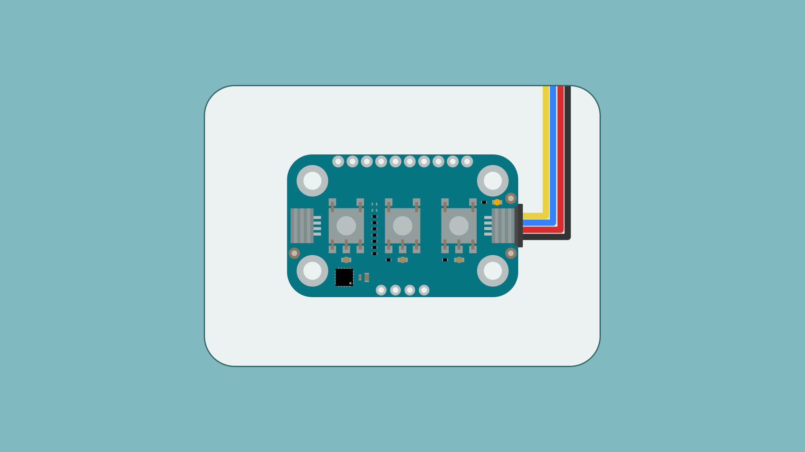
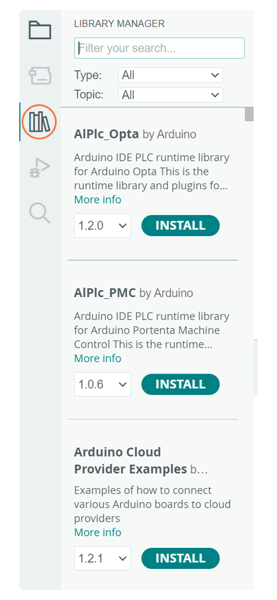
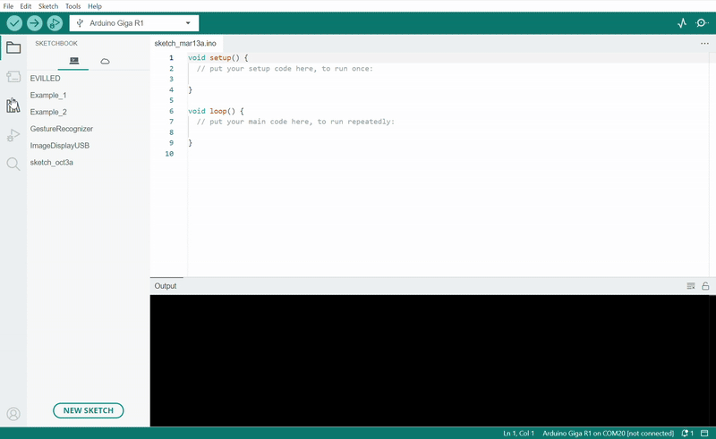

The Modulino Buttons is a modular sensor that provides tactile input and visual feedback, making it perfect to add interactive controls to your projects! 
The Modulino form factor is shaped with two QWIIC connectors and the I²C protocol integration, allowing the connection and programming of multiple Modulino nodes in a very simple way. In addition to the QWIIC's connectors, the Modulino nodes also expose solderable pins that can be used in multiple ways and make them compatible with boards that are not QWIIC compatible.




Pressing a button pulls the signal LOW, and each button has an onboard pull-up resistor. The LEDs can be controlled independently through the onboard microcontroller.


## General Characteristics

The **Modulino Buttons** module uses three tactile buttons and LEDs, which do not have native I²C capabilities. Instead, the buttons and LEDs are controlled by the Modulino's onboard microcontroller (STM32C011F4U6TR). This microcontroller provides I²C communication, allowing for flexible reading of button states and control of the LEDs. One unique feature of this setup is the ability to change the I²C address via software. This means the address can be modified based on your application needs, making it adaptable to different system configurations. 

| Specification     | Details                     |
|-------------------|-----------------------------|
| Buttons           | 3 × Tactile pushbuttons     |
| LEDs              | 3 × Indicator LEDs (orange) |
| Power Supply      | 3.3 V                       |
| Interface         | UART, SWD, I2C              |
| Pull-up Resistors | Integrated on button inputs |


The default I²C address for the **Modulino Buttons** module is:

| Modulino I²C Address | Hardware I²C Address | Editable Addresses (HEX)                        |
|----------------------|----------------------|-------------------------------------------------|
| 0x7C                 | 0x3E                 | Any custom address (via software configuration) |

When scanning for I²C address on the bus, you might find the modulino using the **Hardware I²C Address**. However, you should always use the **Modulino I²C Address** when using the official Modulino library.

Later in this article we teach how to [change the address](#how-to-change-i2c-address).

## Pinout

The tactile buttons and LEDs are the core components of this module. These input and output devices are controlled by an onboard STM32 microcontroller, which supports digital communication (I²C), meaning it connects directly to the I²C bus on the module without requiring additional conversion circuitry.


### 1x10 Header

| Pin   | Function       |
|-------|----------------|
| A     | Button A       |
| GND   | Ground         |
| 3V3   | 3.3 V Power    |
| PF2   | RESET          |
| SWCLK | SWD Clock      |
| SWDIO | SWD Data       |
| TX1   | USART Transmit |
| RX1   | USART Receive  |
| B     | Button B       |
| C     | Button C       |

- **A: Button A** – This pin connects directly to button A.
- **GND: Ground** – Ground connection for power and signal reference.
- **3V3: Power** – 3.3 V power supply input.
- **PF2: RESET** – The reset pin for the microcontroller, which can be used to reset the system.
- **SWCLK: SWD Clock** – Used for providing the clock signal in the SWD interface.
- **SWDIO: SWD Data** – Used for debugging, as part of the Serial Wire Debug (SWD) interface.
- **TX1: USART Transmit** – Used for transmitting data over UART communication.
- **RX1: USART Receive** – Used for receiving data over UART communication.
- **B: Button B** – This pin connects directly to button B.
- **C: Button C** – This pin connects directly to button C.

### 1x4 Header (I2C)

The pinout for the Modulino Buttons is shown below. While the recommended connection method is via the QWIIC connectors, this solderable header provides a connection option when using the modulino with a non-QWIIC compatible board.

| Pin   | Function     |
|-------|--------------|
| GND   | Ground       |
| 3.3 V | Power Supply |
| SDA   | I²C Data     |
| SCL   | I²C Clock    |

## Power Specifications

The board is typically powered by +3.3 VDC when using the QWIIC interface as per the I²C standard.

| Parameter        | Condition         | Minimum | Typical     | Maximum | Unit |
|------------------|-------------------|---------|-------------|---------|------|
| Supply Voltage   | -                 | -       | 3.3 (QWIIC) | -       | V    |
| LED Current Draw | Single LED Active (A,B or C) | -       | 2.5         | -       | mA   |

The module additionally includes a power LED that draws 1 mA and turns on as soon as it is powered. J1 (Qwiic connector), J2 (Qwiic connector), and the headers all share the same power branch. The power distribution of the module is therefore as follows:


## Schematic

The Modulino Buttons uses a simple circuit, as shown in the schematic below:


The main components are the **three tactile buttons**, **three user-programmable LEDs** and the **STM32C011F4U6TR** microcontroller (U1), which handles button state reading, LED control, as well as I²C communication.

You can connect to the I²C pins (SDA and SCL) using either the **QWIIC connectors** (J1 and J2, this is the recommended method) or the **solderable pins** (J4). The board runs on **3.3V**, which comes from the QWIIC cable or the **3V3 pin** on J4.

There's also a small power LED indicator that lights up when the board is on.
You can grab the full schematic and PCB files from the [Modulino Buttons](https://docs.arduino.cc/hardware/modulinos/modulino-buttons) product page.

## How To Connect Your Modulino

The easiest and most reliable way to connect your Modulino is through the QWIIC Connect System. It’s plug-and-play, uses standard I²C, and makes it easy to join multiple modules. If your board supports QWIIC, this is the recommended way to go. 

Note that the dedicated I²C pins will differ from board to board meaning it is always a good idea to check your specific model.

 

### QWIIC Connector

Whenever available, the **QWIIC Connect System** is the preferred method. Connecting to the Modulino is extremely simple, just use a standard QWIIC cable to connect your board to either of the QWIIC connectors on the Modulino. Because the cable and connectors are polarized, there is no need to worry about accidentally swapping connections.

QWIIC is a plug-and-play I²C Connect System that uses standardized 4-pin connectors:

- GND  
- 3.3V  
- SDA (Data)  
- SCL (Clock)


The Modulino features two QWIIC connectors, which are internally connected in parallel. This means you can daisy-chain multiple modules easily by connecting additional QWIIC cables between them.

### Solderable Header

When QWIIC is not available, you can use the exposed solderable pins on the module. You can solder pins to the unpopulated pads; just remember the pinout provided in this guide to connect to the right pins of your board.


## Daisy-Chaining Multiple Modulino Nodes


Regardless of whether you connect the first Modulino via QWIIC or through the solderable pins, you can still take advantage of the extra QWIIC connector to daisy-chain additional modules.
Each Modulino includes two QWIIC connectors wired in parallel, allowing you to connect one module to the next in a chain. As long as each module is configured with a unique I²C address, they can all communicate on the same bus.

This approach keeps your setup clean, modular, and expandable without adding extra wiring complexity.


***The number of modules you can connect will depend on what modules you are chaining together, as this system allows for multiple sensors from different manufacturers to be added. Also, the cables you use for these connections will play a significant role in the setup’s performance. Ensure your cables are properly connected and capable of handling the required data transfer.
Each module should have a unique address on a chain if you plan to address them individually. Later in this article we teach how to [change the address](#how-to-change-i2c-address). Multiple modules with the same address will cause conflicts on the I²C bus and will not allow you to address them individually.***

## How To Use Your Modulino

### Installing The Modulino Library

You need the official Modulino library available [here](https://docs.arduino.cc/libraries/modulino/) to use the Modulino Buttons.

With the Arduino IDE you get some tools that make adding a library easier. To learn how to install the IDE please visit our [page](https://docs.arduino.cc/software/ide-v2/tutorials/getting-started/ide-v2-downloading-and-installing/).

After opening the IDE, a tab should be visible on the left. Press the book icon for "library" as highlighted in the image.



The process should look like this:

 

A message will appear after the installation is successful.

### Getting Button Press Data

Interacting with the Modulino Buttons module is simple using the `Modulino` library.

For the **Buttons** module, there are two key functions:

- `update()`**:** Requests new data from the button module.
- `isPressed(index)`**:** Checks if a specific button (`A`, `B`, or `C`) is pressed.
- `setLeds(A, B, C)`**:** Sets the state of the LED (`A`, `B`, or `C`).
- ```Modulino.begin();```: By default the Modulino library uses ```Wire1``` if your connection is in a different Wire you will have to edit it, check [here](https://docs.arduino.cc/language-reference/en/functions/communication/wire/) (by default the Modulino library uses ```Wire1``` if your board model has a different pinout for the dedicated I²C pins you might have to edit it. More information on **Wire** can be found [here](https://docs.arduino.cc/language-reference/en/functions/communication/wire/)) for the library's hardware compatibility. More information on **Wire** can be found [here](https://docs.arduino.cc/language-reference/en/functions/communication/wire/).

Here is an example sketch demonstrating how to use these functions to detect button presses:

```arduino
#include <Modulino.h>

// Create object instance
ModulinoButtons buttons;

void setup() {
  Serial.begin(9600);
  Modulino.begin();
  buttons.begin();
  
  // Function to control the LEDs on top of each button
  buttons.setLeds(true, true, true);
}

void loop() {
  // Request new data from the Modulino Buttons
  if (buttons.update()) {
    // Check if any button has been pressed
    if (buttons.isPressed(0)) {
      Serial.println("Button A pressed!");
    } else if (buttons.isPressed(1)) {
      Serial.println("Button B pressed!");
    } else if (buttons.isPressed(2)) {
      Serial.println("Button C pressed!");
    }
  }
}
```
The code example provided shows how to initialize the button module, read button states, and control the LEDs. The program begins by turning on all three LEDs, then continuously checks for button presses and reports them through the serial monitor. Each button is identified by its index (0 for A, 1 for B, 2 for C), making it easy to expand the functionality for more complex interactions. This simple interface can be adapted to trigger various actions in your projects, from controlling other components to navigating menus or implementing game controls.

### Detecting Button Events

The Modulino Buttons module can be enhanced with the [Button2 library](https://docs.arduino.cc/libraries/button2/) to detect various button events beyond simple presses. This approach allows you to respond to single clicks, double clicks, triple clicks, and long presses.

For the **Button Events** functionality, there are several key functions:

- `setButtonStateFunction(function)`**:** Sets a custom function that provides the button state.
- `setClickHandler(function)`**:** Sets a handler for single-click events.
- `setDoubleClickHandler(function)`**:** Sets a handler for double-click events.
- `setTripleClickHandler(function)`**:** Sets a handler for triple-click events.
- `setLongClickHandler(function)`**:** Sets a handler for long-press events.
- `loop()`**:** Must be called repeatedly to check for button state changes.

Here is an example sketch demonstrating how to implement button event detection:

```arduino
#include "Modulino.h"
#include "Button2.h"

Button2 button;
ModulinoButtons modulino_buttons;

uint8_t button0StateHandler() {
  modulino_buttons.update();
  return modulino_buttons.isPressed(0) ? LOW : HIGH;  // fake a normal button -> LOW = pressed
}

void handler(Button2& btn) {
  switch (btn.getType()) {
    case single_click:
      break;
    case double_click:
      Serial.print("double ");
      break;
    case triple_click:
      Serial.print("triple ");
      break;
    case long_click:
      Serial.print("long");
      break;
  }
  Serial.print("click");
  Serial.print(" (");
  Serial.print(btn.getNumberOfClicks());
  Serial.println(")");
}

void setup() {

  Serial.begin(115200);

  Modulino.begin();
  modulino_buttons.begin();

  button.setDebounceTime(35);
  button.setButtonStateFunction(button0StateHandler);
  button.setClickHandler(handler);
  button.setDoubleClickHandler(handler);
  button.setTripleClickHandler(handler);
  button.setLongClickHandler(handler);
  button.begin(BTN_VIRTUAL_PIN);
}

void loop() {
  button.loop();
}
```

The code example provided shows how to integrate the Button2 library with the Modulino Buttons module to detect advanced button interactions. It creates a virtual button connected to Button A (index 0) and sets up handlers for different types of clicks. The `button0StateHandler()` function serves as a bridge between the Modulino hardware and the Button2 library by converting the button state to the expected format. When running, the program will detect and report single clicks, double clicks, triple clicks, and long presses through the serial monitor. This approach enables more sophisticated user interfaces in your projects, from navigating multi-level menus to implementing different functions based on how a user interacts with a single button.

### How To Change I2C Address

An example sketch, AddressChanger, is also included with the library inside the `Utilities` folder and available [here](https://github.com/arduino-libraries/Modulino/blob/main/examples/Utilities/AddressChanger/AddressChanger.ino). This sketch changes the I²C address at a software level on the Module's microcontroller.


- Connect the module to your board, remove any other modules that might be in the chain. Connection must be via I²C.
- Upload the sketch.
- Open the Serial Monitor.
- Text should now appear. Make sure the correct bauld-rate is selected if the displayed characters seem corrupted.

  

- Select the address and confirm. Valid I²C addresses range from 0x08 to 0x77 (7-bit values in hexadecimal format, e.g., 0x42).
- Your address should now have changed. Make sure to take note of the selected address.

To keep track of the address in use the module has a white rectangle on the back. Feel free to use this to write the address that was chosen.

When using a custom address in your sketch, you'll need to specify this address when creating the module object. For example:
```arduino
ModulinoButtons buttons(0x3E); // Replace 0x3E with your specific address
```


## Troubleshooting

### Buttons Not Responding

If your Modulino's power LED isn't on or the buttons aren't responsive, first check that the board is properly connected:

- Ensure both the board and the Modulino are connected to your computer, and that the power LEDs on both are lit.
- If the issue persists, make sure the Qwiic cable is properly clicked into place.

### Library Not Installed Properly

If you encounter an issue with the `#include "modulino.h"` command, verify that the Modulino library is correctly installed:

- Check your IDE to ensure the library is installed and up-to-date.
- Re-install the library through the Library Manager.

### LEDs Not Working

If the LEDs aren't lighting up as expected, make sure:

- The correct LED states are being set in your code (true for on, false for off).
- All exposed electronics are not touching any conductive surfaces, as this could interfere with the operation.

## Conclusion

The **Modulino Buttons** is a digital input and output device that communicates over I²C and follows the Modulino form factor. It includes standard Qwiic connectors for quick, solderless connections and easy daisy-chaining with other modules. Paired with the Modulino library, it makes detecting button presses and controlling LEDs straightforward, allowing you to focus on experimenting or building your system logic. It's a small, reliable module suited for both user interfaces and interactive control systems.

## What Is Next?

Now that you've learned how to use your Modulino Buttons, you're all set to integrate it into your projects!

- Create a simple menu system where each button performs a different function.
- Build a game controller for a simple arcade-style game.
- Use the buttons to control other Modulino devices in your project.
- Design an interactive installation where button presses trigger different visual and audio effects.