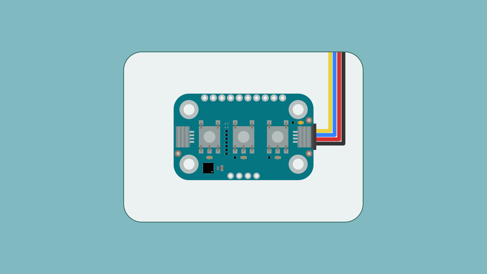
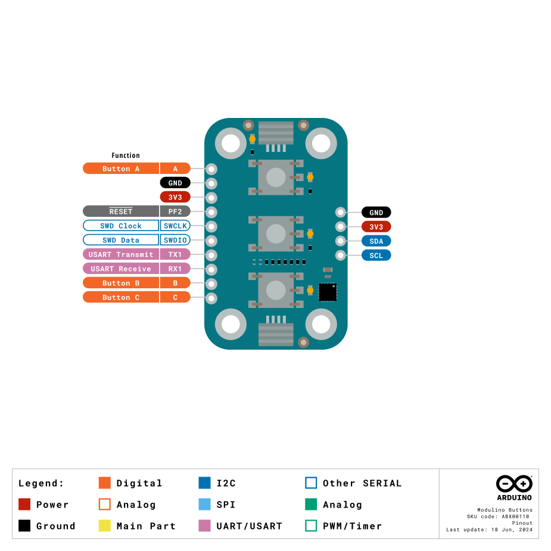

The Modulino Buttons is a modular sensor that provides tactile input and visual feedback, making it perfect to add interactive controls to your projects! Pressing a button pulls the signal LOW, and each button has an onboard pull-up resistor. The LEDs can be controlled independently through the onboard microcontroller.

## Hardware Overview

### General Characteristics

The **Modulino Buttons** module uses three tactile buttons and LEDs, controlled by the Modulino's onboard microcontroller (STM32C011F4U6TR). This microcontroller provides I²C communication, allowing for flexible reading of button states and control of the LEDs.

| Specification     | Details                     |
|-------------------|-----------------------------|
| Buttons           | 3 × Tactile pushbuttons     |
| LEDs              | 3 × Indicator LEDs (orange) |
| Power Supply      | 3.3 V                       |
| Interface         | UART, SWD, I2C              |
| Pull-up Resistors | Integrated on button inputs |

One unique feature of this setup is the ability to change the I²C address via software, making it adaptable to different system configurations.

The default I²C address for the **Modulino Buttons** module is:

| Modulino I²C Address | Hardware I²C Address | Editable Addresses (HEX)                        |
|----------------------|----------------------|-------------------------------------------------|
| 0x7C                 | 0x3E                 | Any custom address (via software configuration) |

### Pinout



#### 1x10 Header

| Pin   | Function       |
|-------|----------------|
| A     | Button A       |
| GND   | Ground         |
| 3V3   | 3.3 V Power    |
| PF2   | RESET          |
| SWCLK | SWD Clock      |
| SWDIO | SWD Data       |
| TX1   | USART Transmit |
| RX1   | USART Receive  |
| B     | Button B       |
| C     | Button C       |

#### 1x4 Header (I2C)

| Pin   | Function     |
|-------|--------------|
| GND   | Ground       |
| 3.3 V | Power Supply |
| SDA   | I²C Data     |
| SCL   | I²C Clock    |

### Power Specifications

| Parameter        | Condition                    | Minimum | Typical     | Maximum | Unit |
|------------------|------------------------------|---------|-------------|---------|------|
| Supply Voltage   | -                            | -       | 3.3 (QWIIC) | -       | V    |
| LED Current Draw | Single LED Active (A,B or C) | -       | 2.5         | -       | mA   |

The module includes a power LED that draws 1 mA and turns on as soon as it is powered.

### Schematic

The Modulino Buttons uses a straightforward circuit design featuring three tactile buttons, three user-programmable LEDs, and the STM32C011F4U6TR microcontroller.


The main components are the **three tactile buttons**, **three user-programmable LEDs** and the **STM32C011F4U6TR** microcontroller (U1), which handles button state reading, LED control, as well as I²C communication.

You can connect to the I²C pins (SDA and SCL) using either the **QWIIC connectors** (J1 and J2, this is the recommended method) or the **solderable pins** (J4). The board runs on **3.3V**, which comes from the QWIIC cable or the **3V3 pin** on J4.

You can grab the full schematic and PCB files from the [Modulino Buttons page](https://docs.arduino.cc/hardware/modulinos/modulino-buttons).

## Programming with Arduino

The Modulino Buttons is fully compatible with the Arduino IDE and the official Modulino library. The following examples showcase basic button reading and LED control functionality that can be easily integrated into your interactive projects.

### Prerequisites

- Install the Modulino library via the Arduino IDE Library Manager
- Connect your Modulino Buttons via QWIIC or solderable headers

For detailed instructions on setting up your Arduino environment and installing libraries, please refer to the [Getting Started with Modulinos guide](./how-general).

Library repository available [here](https://github.com/arduino-libraries/Arduino_Modulino).

### Basic Example

```arduino
#include <Modulino.h>

// Create object instance
ModulinoButtons buttons;

void setup() {
  Serial.begin(9600);
  Modulino.begin();
  buttons.begin();
  
  // Function to control the LEDs on top of each button
  buttons.setLeds(true, true, true);
}

void loop() {
  // Request new data from the Modulino Buttons
  if (buttons.update()) {
    // Check if any button has been pressed
    if (buttons.isPressed(0)) {
      Serial.println("Button A pressed!");
    } else if (buttons.isPressed(1)) {
      Serial.println("Button B pressed!");
    } else if (buttons.isPressed(2)) {
      Serial.println("Button C pressed!");
    }
  }
}
```

### Key Functions

- `update()`: Requests new data from the button module
- `isPressed(index)`: Checks if a specific button (0=A, 1=B, 2=C) is pressed
- `setLeds(A, B, C)`: Sets the state of the LEDs (true=on, false=off)

### Advanced Example - Button Events with Button2 Library

The Modulino Buttons can be enhanced with the Button2 library to detect various button events beyond simple presses.

```arduino
#include "Modulino.h"
#include "Button2.h"

Button2 button;
ModulinoButtons modulino_buttons;

uint8_t button0StateHandler() {
  modulino_buttons.update();
  return modulino_buttons.isPressed(0) ? LOW : HIGH;  // fake a normal button -> LOW = pressed
}

void handler(Button2& btn) {
  switch (btn.getType()) {
    case single_click:
      break;
    case double_click:
      Serial.print("double ");
      break;
    case triple_click:
      Serial.print("triple ");
      break;
    case long_click:
      Serial.print("long");
      break;
  }
  Serial.print("click");
  Serial.print(" (");
  Serial.print(btn.getNumberOfClicks());
  Serial.println(")");
}

void setup() {
  Serial.begin(115200);
  Modulino.begin();
  modulino_buttons.begin();

  button.setDebounceTime(35);
  button.setButtonStateFunction(button0StateHandler);
  button.setClickHandler(handler);
  button.setDoubleClickHandler(handler);
  button.setTripleClickHandler(handler);
  button.setLongClickHandler(handler);
  button.begin(BTN_VIRTUAL_PIN);
}

void loop() {
  button.loop();
}
```

## Programming with MicroPython

The Modulino Buttons is fully compatible with MicroPython through the official Modulino MicroPython library. The following examples demonstrate how to detect button presses, handle various button events, and control the integrated LEDs in your MicroPython projects.

### Prerequisites

- Install the Modulino MicroPython library
- Ensure Arduino Lab for MicroPython is installed

For detailed instructions on setting up your MicroPython environment and installing packages, please refer to the [Getting Started with Modulinos guide](./how-general).

### Basic Example

```python
from modulino import ModulinoButtons
from time import sleep

buttons = ModulinoButtons()

# Define button press actions
buttons.on_button_a_press = lambda : print("Button A pressed")
buttons.on_button_a_long_press = lambda : print("Button A long press")
buttons.on_button_a_release = lambda : print("Button A released")

buttons.on_button_b_press = lambda : print("Button B pressed")
buttons.on_button_b_long_press = lambda : print("Button B long press")
buttons.on_button_b_release = lambda : print("Button B released")

buttons.on_button_c_press = lambda : print("Button C pressed")
buttons.on_button_c_long_press = lambda : print("Button C long press")
buttons.on_button_c_release = lambda : print("Button C released")

# LED Sequence: Turn each LED on with a delay, then turn them off
buttons.led_a.on()
sleep(0.5)
buttons.led_b.on()
sleep(0.5)
buttons.led_c.on()
sleep(0.5)
buttons.set_led_status(False, False, False)  # Turn off all LEDs

while True:
    buttons_state_changed = buttons.update()
    
    if buttons_state_changed:
        led_a_status = buttons.is_pressed(0)  # Turn LED A on if button A is pressed
        led_b_status = buttons.is_pressed(1)  # Turn LED B on if button B is pressed
        led_c_status = buttons.is_pressed(2)  # Turn LED C on if button C is pressed
        buttons.set_led_status(led_a_status, led_b_status, led_c_status)
```

### Key Functions and Properties

- `.on_button_x_press`: Callback for button press events
- `.on_button_x_long_press`: Callback for long press events
- `.on_button_x_release`: Callback for button release events
- `.led_x.on()/.off()`: Control individual LEDs
- `.set_led_status(a, b, c)`: Set all LED states at once
- `.is_pressed(index)`: Check if a button is currently pressed
- `.update()`: Check for button state changes

### Advanced Example - Menu System

```python
from modulino import ModulinoButtons
from time import sleep

buttons = ModulinoButtons()

# Menu system variables
menu_items = ["Option 1", "Option 2", "Option 3", "Settings", "Exit"]
current_index = 0
in_submenu = False

def show_menu():
    """Display current menu state via LEDs and serial"""
    print("\n--- MENU ---")
    for i, item in enumerate(menu_items):
        prefix = ">" if i == current_index else " "
        print(f"{prefix} {item}")
    
    # Show position with LEDs
    buttons.set_led_status(
        current_index == 0,
        current_index == 2,
        current_index == 4
    )

def next_item():
    """Move to next menu item"""
    global current_index
    current_index = (current_index + 1) % len(menu_items)
    show_menu()

def previous_item():
    """Move to previous menu item"""
    global current_index
    current_index = (current_index - 1) % len(menu_items)
    show_menu()

def select_item():
    """Select current menu item"""
    print(f"\n✓ Selected: {menu_items[current_index]}")
    
    # Flash all LEDs to confirm selection
    for _ in range(3):
        buttons.set_led_status(True, True, True)
        sleep(0.1)
        buttons.set_led_status(False, False, False)
        sleep(0.1)

# Configure button actions
buttons.on_button_a_press = previous_item  # Navigate up
buttons.on_button_b_press = select_item    # Select
buttons.on_button_c_press = next_item      # Navigate down

# Initialize
print("Menu Navigation System")
print("A: Previous | B: Select | C: Next")
show_menu()

# Main loop
while True:
    buttons.update()
    sleep(0.01)
```

## Troubleshooting

### Buttons Not Responding

If your Modulino's power LED isn't on or the buttons aren't responsive:
- Ensure both the board and the Modulino are connected properly
- Verify that the power LEDs on both are lit
- Check that the QWIIC cable is properly clicked into place

### LEDs Not Working

If the LEDs aren't lighting up as expected:
- Verify correct LED states are being set in your code
- Check that exposed electronics are not touching conductive surfaces
- Ensure adequate power supply for LED operation

## Project Ideas

- **Simple Menu System**: Each button performs a different function or navigates menus
- **Game Controller**: Build controls for arcade-style games
- **Interactive Control Panel**: Control other Modulino devices in your project
- **Pattern Memory Game**: Create a Simon-style memory game with LED feedback
- **Morse Code Trainer**: Practice Morse code with button input and LED feedback
- **Smart Home Controller**: Three-button interface for home automation
- **Music Box Controller**: Each button plays different notes or controls playback