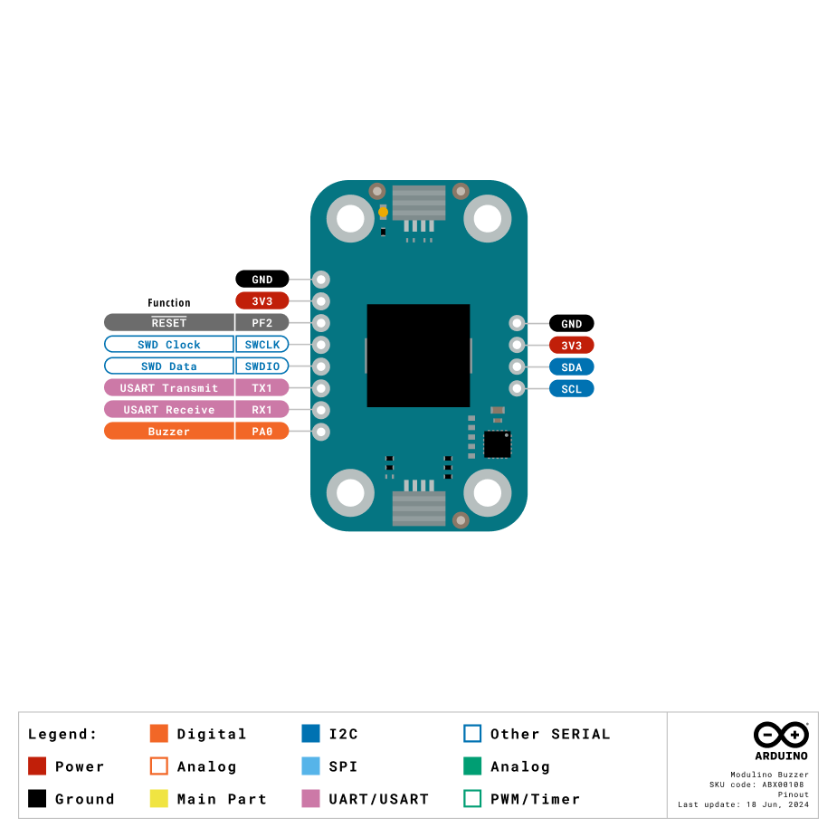
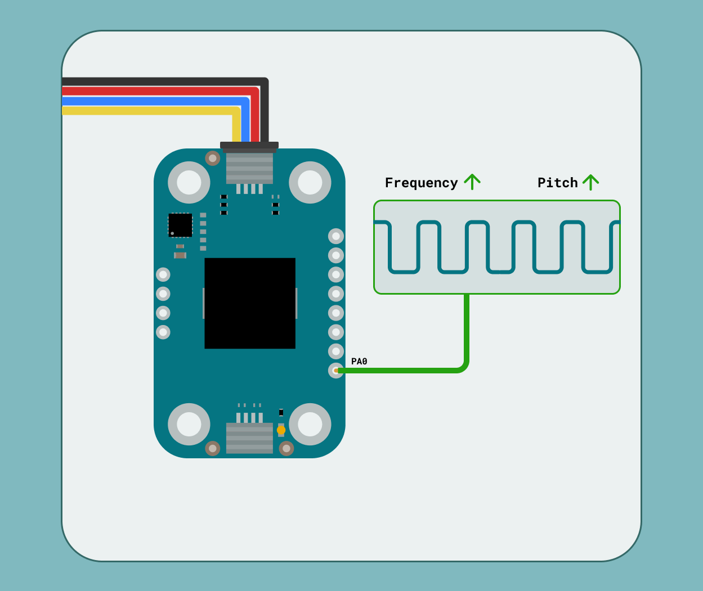
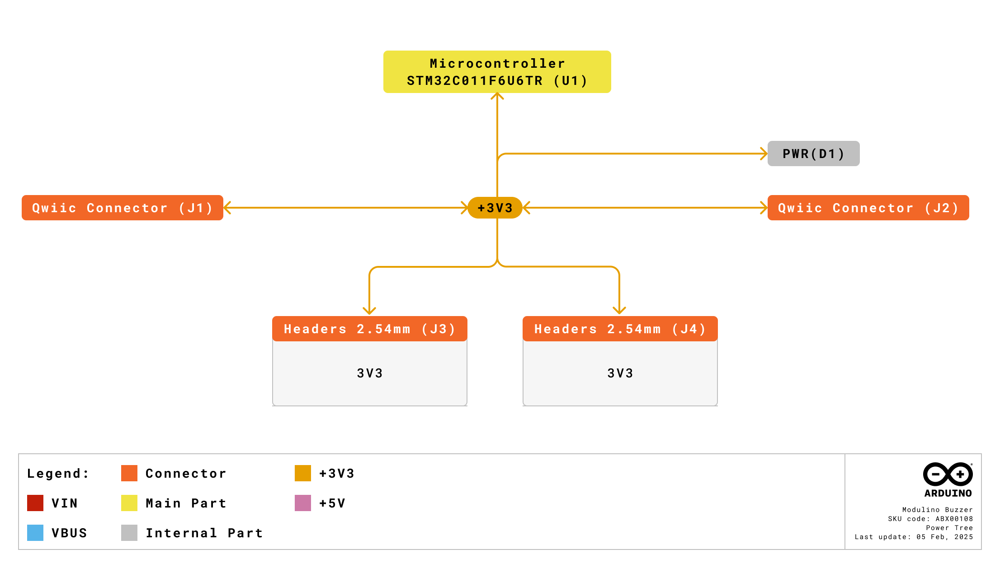
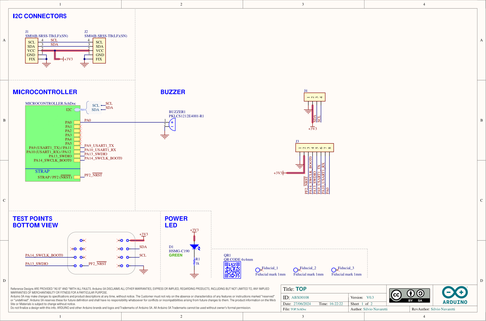
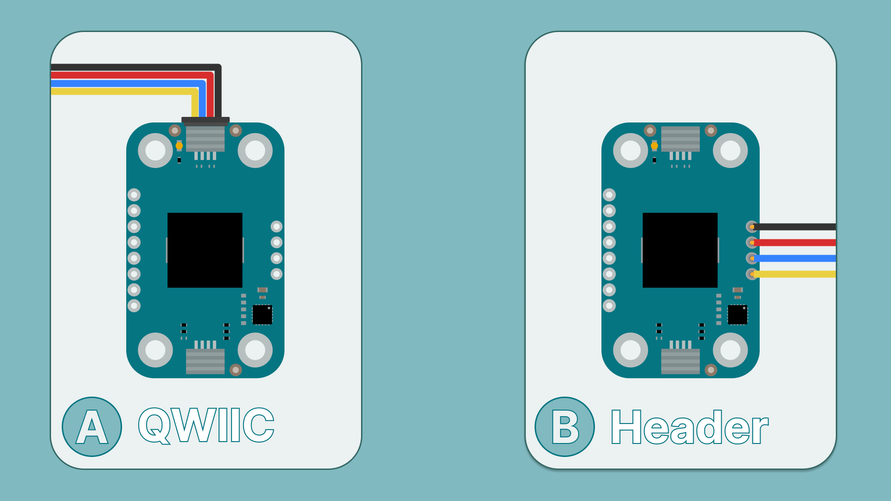
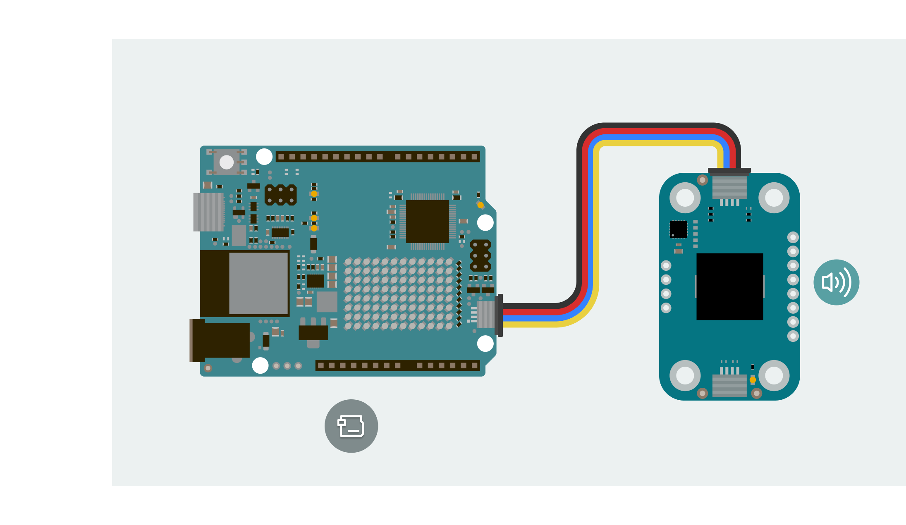
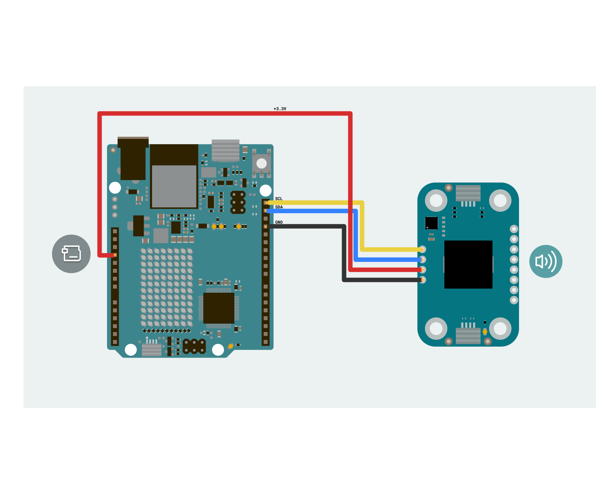
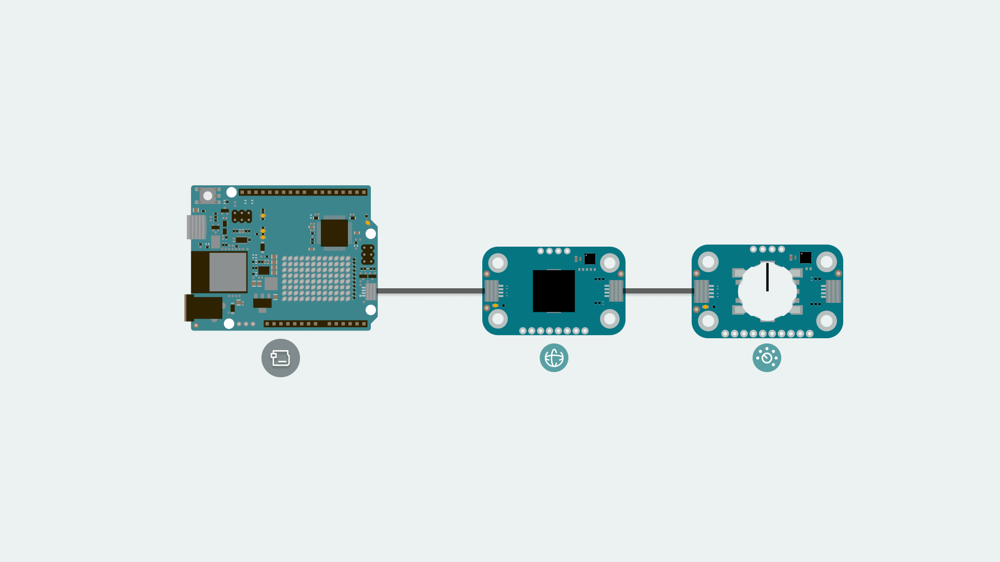

The Modulino Buzzer is a modular sensor that generates audio output, making it perfect to add sound feedback to your projects! 

The Modulino form factor is shaped with two QWIIC connectors and the I²C protocol integration, allowing the connection and programming of multiple modulinos in a very simple way. In addition to the QWIIC's connectors, the Modulinos also expose solderable pins that can be used in multiple ways and make them compatible with boards that are not QWIIC compatible.


## Hardware Specifications

The Modulino Buzzer based on the buzzer (PKLCS1212E4001-R1) is capable of generating different tones and sound patterns. Take a look at the following table to know more about its characteristics:

| Parameter            | Condition | Minimum | Typical | Maximum | Unit |
|----------------------|-----------|---------|---------|---------|------|
| Frequency            | -         | -       | 4,000   | -       | Hz   |
| Sound Pressure Level | -         | 75      | 85      | -       | dB   |

### Sensor Details

The **Modulino Buzzer** module uses the **PKLCS1212E4001-R1** buzzer, which does not have native I²C capabilities. Instead, the buzzer is controlled by the Modulino's onboard microcontroller (STM32C011F4U6T). This microcontroller provides I²C communication, allowing for flexible control of the buzzer.

One unique feature of this setup is the ability to change the I²C address via software. This means the address can be modified based on your application needs, making it adaptable to different system configurations.

The default I²C address for the **Modulino Buzzer** module is:

| Modulino I²C Address | Hardware I²C Address |Editable Addresses (HEX)|
|----------------------|----------------------|----------------------|
| 0x3C                 | 0x1E         |Any custom address (via software configuration)


When scanning for I²C address on the bus, you might find the modulino using the **Hardware I²C Address**. However, you should always use the **Modulino I²C Address** when using the official Modulino library.

Later in this article we teach how to [change the address](#how-to-change-i2c-address).


## Pinout

The PKLCS1212E4001-R1 buzzer is the core component of this module. This audio output device is controlled by an onboard STM32 microcontroller, which supports digital communication (I²C), meaning it connects directly to the I²C bus on the module without requiring additional conversion circuitry.



### 1x8 Header

| Pin    | Function        |
|--------|-----------------|
| GND    | Ground          |
| 3V3    | 3.3V Power      |
| RESET  | Reset           |
| SWCLK  | SWD Clock       |
| SWDIO  | SWD Data        |
| TX1    | USART Transmit  |
| RX1    | USART Receive   |
| PA0    | Buzzer          |

- **GND:** Provides ground reference for the circuit. 
- **3V3:** Supplies 3.3 V power to connected components and modules.
- **Reset:** The reset pin for the microcontroller, which can be used to reset the system.
- **SWCLK:** Used for providing the clock signal in the SWD interface.
- **SWDIO:** Used for debugging, as part of the Serial Wire Debug (SWD) interface.
- **TX1:** Used for transmitting data over UART communication.
- **RX1:** Used for receiving data over UART communication.
- **PA0:** This pin is used to control the buzzer's output signal. In fact, this pin can be used to bypass the I²C interface and control the buzzer directly using a square wave.



### 1x4 Header (I2C)

The pinout for the Modulino Buzzer is shown below. While the recommended connection method is via the QWIIC connectors, this solderable header provides a connection option when using the modulino with a non-QWIIC compatible board.

| Pin   | Function     |
|-------|--------------|
| GND   | Ground       |
| 3.3 V | Power Supply |
| SDA   | I²C Data     |
| SCL   | I²C Clock    |


## Power Specifications

The board is typically powered by +3.3 VDC when using the QWIIC interface as per the I²C standard.

| Parameter           | Condition | Typical | Unit |
|---------------------|-----------|---------|------|
| Operating Voltage   | -         | 3.3     | V    |
| Current Consumption | -         | ~6.4    | mA   |

The module additionally includes a power LED that draws 1 mA and turns on as soon as it is powered.
J1 (Qwiic connector), J2 (Qwiic connector), and the headers all share the same power branch. The power distribution of the module is therefore as follows:


## Schematic

The Modulino Buzzer uses a simple circuit, as shown in the schematic below:



The main components are the **PKLCS1212E4001-R1 buzzer** and the **STM32C011F6U6TR** microcontroller (U1), which handles tone generation as well as I²C communication.

You can connect to the I²C pins (SDA and SCL) using either the **QWIIC connectors** (J1 and J2, this is the recommended method) or the **solderable pins** (J4). The board runs on **3.3V**, which comes from the QWIIC cable or the **3V3 pin** on J4.

There's also a small power LED indicator that lights up when the board is on.

You can grab the full schematic and PCB files from the [Modulino Buzzer](https://docs.arduino.cc/hardware/modulinos/modulino-buzzer) product page.

## How To Connect Your Modulino

The easiest and most reliable way to connect your Modulino is through the QWIIC Connect System. It’s plug-and-play, uses standard I²C, and makes it easy to join multiple modules. If your board supports QWIIC, this is the recommended way to go. Note that the dedicated I²C pins will differ from board to board meaning it is always a good idea to check your specific model.

If your board doesn’t have a QWIIC connector, you can still access the same I²C bus and power the module using the solderable header pads just make sure you wire it to 3.3V and match the I²C pinout.

 

### QWIIC Connector

Whenever available, the **QWIIC Connect System** is the preferred method. Connecting to the Modulino is extremely simple, just use a standard QWIIC cable to connect your board to either of the QWIIC connectors on the Modulino. Because the cable and connectors are polarized, there is no need to worry about accidentally swapping connections.

QWIIC is a plug-and-play I²C Connect System that uses standardized 4-pin connectors:
- GND  
- 3.3V  
- SDA (Data)  
- SCL (Clock)



The Modulino features two QWIIC connectors, which are internally connected in parallel. This means you can daisy-chain multiple modules easily by connecting additional QWIIC cables between them.

### Solderable Header

When QWIIC is not available, you can use the exposed solderable pins on the module. You can solder pins to the unpopulated pads; just remember the pinout provided in this guide to connect to the right pins of your board. 



### Daisy-Chaining Multiple Modulinos

Regardless of whether you connect the first Modulino via QWIIC or through the solderable pins, you can still take advantage of the extra QWIIC connector to daisy-chain additional modules.

Each Modulino includes two QWIIC connectors wired in parallel, allowing you to connect one module to the next in a chain. As long as each module is configured with a unique I²C address, they can all communicate on the same bus as long as you select the correct I²C pins depending on your board.

This approach keeps your setup clean, modular, and expandable without adding extra wiring complexity.



***The number of modules you can connect will depend on what modules you are chaining together, as this system allows for multiple sensors from different manufacturers to be added. Also, the cables you use for these connections will play a significant role in the setup’s performance. Ensure your cables are properly connected and capable of handling the required data transfer.
Each module should have a unique address on a chain if you plan to address them individually. Later in this article we teach how to [change the address](#how-to-change-i2c-address). Multiple modules with the same address will cause conflicts on the I²C bus and will not allow you to address them individually.***

## How To Use Your Modulino

### Installing The Modulino Library

You need the official Modulino library available [here](https://docs.arduino.cc/libraries/modulino/) to use the Modulino Buzzer.

With the Arduino IDE you get some tools that make adding a library easier. To learn how to install the IDE please visit our [page](https://docs.arduino.cc/software/ide-v2/tutorials/getting-started/ide-v2-downloading-and-installing/).

After opening the IDE, a tab should be visible on the left. Press the book icon for "library" as highlighted in the image.


The process should look like this:

 

A message will appear after the installation is successful.

### Play A Simple Tune

Getting sound feedback from the buzzer is fairly simple using the ```Modulino``` library. For the **Modulino Buzzer** there is one important function:

- ```tone(frequency, duration)```: Generates a tone with the specified frequency (in Hz) and duration (in milliseconds).
- ```Modulino.begin();```: By default the Modulino library uses ```Wire1``` if your connection is in a different Wire you will have to edit it, check [here](https://docs.arduino.cc/language-reference/en/functions/communication/wire/) (by default the Modulino library uses ```Wire1``` if your board model has a different pinout for the dedicated I²C pins you might have to edit it. More information on **Wire** can be found [here](https://docs.arduino.cc/language-reference/en/functions/communication/wire/)) for the library's hardware compatibility. More information on **Wire** can be found [here](https://docs.arduino.cc/language-reference/en/functions/communication/wire/).

Here is an example sketch of how to implement this function to control the buzzer:

```arduino
#include <Arduino_Modulino.h>

ModulinoBuzzer buzzer;

int frequency = 440;  // Frequency of the tone in Hz
int duration = 1000;  // Duration of the tone in milliseconds

void setup(){
  Modulino.begin();
  buzzer.begin();
}

void loop(){
  buzzer.tone(frequency, duration);  // Generate the tone
  delay(1000);  // Wait for 1 second
  buzzer.tone(0, duration);  // Stop the tone
  delay(1000);  // Wait for 1 second
}
``` 

The code example provided shows how to initialize the buzzer and generate tones. The buzzer alternates between playing a 440 Hz tone for one second and staying silent for one second.
It can be easily adapted to play different melodies or to provide sound feedback for your projects based on specific conditions or events.

### How To Change I2C Address

An example sketch, AddressChanger, is also included with the library inside the `Utilities` folder and available [here](https://github.com/arduino-libraries/Modulino/blob/main/examples/Utilities/AddressChanger/AddressChanger.ino). This sketch changes the I²C address at a software level on the Module's microcontroller.


- Connect the module to your board, remove any other modules that might be in the chain. Connection must be via I²C.
- Upload the sketch.
- Open the Serial Monitor.
- Text should now appear. Make sure the correct bauld-rate is selected if the displayed characters seem corrupted.
  
  

- Select the address and confirm. Valid I²C addresses range from 0x08 to 0x77 (7-bit values in hexadecimal format, e.g., 0x42).
- Your address should now have changed. Make sure to take note of the selected address.

To keep track of the address in use the module has a white rectangle on the back. Feel free to use this to write the address that was chosen.

When using a custom address in your sketch, you'll need to specify this address when creating the module object. For example:

```arduino
ModulinoBuzzer buzzer(0x3E); // Replace 0x3E with your specific address
```


## Troubleshooting

### Buzzer Not Sounding

If your Modulino's power LED isn't on or the buzzer isn't responsive, first check that the board is properly connected:

- Ensure both the board and the Modulino are connected to your computer, and that the power LEDs on both are lit.
- If the issue persists, make sure the Qwiic cable is properly clicked into place.

### Library Not Installed Properly

If you encounter an issue with the `#include "modulino.h"` command, verify that the Modulino library is correctly installed:

- Check your IDE to ensure the library is installed and up-to-date.
- Re-install the library through the Library Manager.

### Distorted Sound

If the buzzer sound is distorted or not playing as expected, make sure:

- The correct frequency values are being used (typically between 20 Hz and 20 kHz for audible sounds).
- All exposed electronics are not touching any conductive surfaces, as this could interfere with the sound output.

## Conclusion

The **Modulino Buzzer** is a digital sound output device that communicates over I²C and follows the Modulino form factor. It includes standard Qwiic connectors for quick, solderless connections and easy daisy-chaining with other modules. Paired with the Modulino library, it makes generating sound feedback straightforward, allowing you to focus on experimenting or building your system logic. It's a small, reliable module suited for both interactive feedback and audio alert systems.

## What Is Next?

Now that you've learned how to use your Modulino Buzzer, you're all set to integrate it into your projects!

- Experiment with different frequencies to create various tones and melodies.
- Try creating a simple alarm system that triggers the buzzer when certain conditions are met.
- Use the buzzer to provide feedback in your interactive projects when a button is pressed or a threshold is reached.
- Create a music box that plays different tunes when specific inputs are detected!

