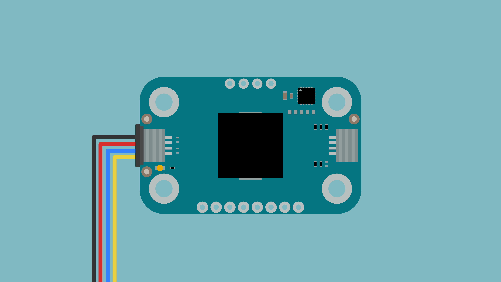
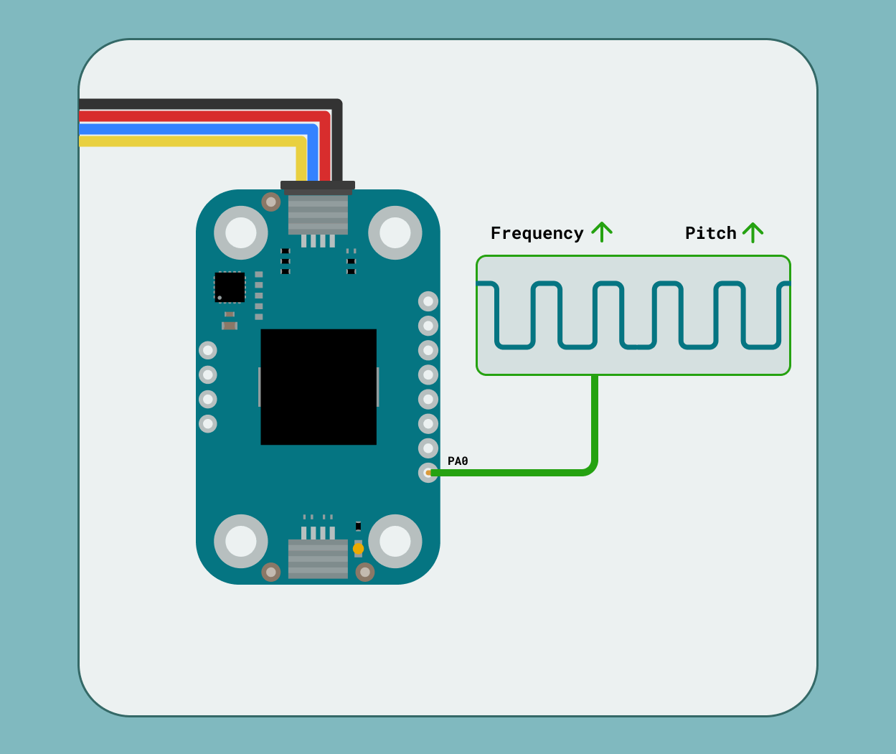

The Modulino Buzzer is a modular sensor that generates audio output, making it perfect to add sound feedback to your projects! It uses the standardised Modulino form factor with QWIIC connectors for easy integration.

## Hardware Overview

### General Characteristics

The Modulino Buzzer is based on the PKLCS1212E4001-R1 buzzer, capable of generating different tones and sound patterns.

| Parameter            | Condition | Minimum | Typical | Maximum | Unit |
|----------------------|-----------|---------|---------|---------|------|
| Frequency            | -         | -       | 4,000   | -       | Hz   |
| Sound Pressure Level | -         | 75      | 85      | -       | dB   |

### Sensor Details

The **Modulino Buzzer** module uses the **PKLCS1212E4001-R1** buzzer, which does not have native I²C capabilities. Instead, the buzzer is controlled by the Modulino's onboard microcontroller (STM32C011F4U6T). This microcontroller provides I²C communication, allowing for flexible control of the buzzer.

One unique feature of this setup is the ability to change the I²C address via software, making it adaptable to different system configurations.

The default I²C address for the **Modulino Buzzer** module is:

| Modulino I²C Address | Hardware I²C Address | Editable Addresses (HEX)                        |
|----------------------|----------------------|--------------------------------------------------|
| 0x3C                 | 0x1E                 | Any custom address (via software configuration) |

### Pinout


#### 1x8 Header

| Pin    | Function        |
|--------|-----------------|
| GND    | Ground          |
| 3V3    | 3.3V Power      |
| RESET  | Reset           |
| SWCLK  | SWD Clock       |
| SWDIO  | SWD Data        |
| TX1    | USART Transmit  |
| RX1    | USART Receive   |
| PA0    | Buzzer          |

**PA0**: This pin can be used to bypass the I²C interface and control the buzzer directly using a square wave.



#### 1x4 Header (I2C)

| Pin   | Function     |
|-------|--------------|
| GND   | Ground       |
| 3.3 V | Power Supply |
| SDA   | I²C Data     |
| SCL   | I²C Clock    |

### Power Specifications

| Parameter           | Condition | Typical | Unit |
|---------------------|-----------|---------|------|
| Operating Voltage   | -         | 3.3     | V    |
| Current Consumption | -         | ~6.4    | mA   |

The module includes a power LED that draws 1 mA and turns on as soon as it is powered.

### Schematic

The Modulino Buzzer features a simple yet effective circuit design for audio generation.


The main components are the **PKLCS1212E4001-R1 buzzer** and the **STM32C011F6U6TR** microcontroller (U1), which handles tone generation as well as I²C communication.

You can connect to the I²C pins (SDA and SCL) using either the **QWIIC connectors** (J1 and J2, this is the recommended method) or the **solderable pins** (J4). The board runs on **3.3V**, which comes from the QWIIC cable or the **3V3 pin** on J4.

There's also a small power LED indicator that lights up when the board is on.

You can grab the full schematic and PCB files from the [Modulino Buzzer page](https://docs.arduino.cc/hardware/modulinos/modulino-buzzer).

## Programming with Arduino

The Modulino Buzzer is fully compatible with the Arduino IDE and the official Modulino library. The following examples showcase how to generate tones, create melodies, and add audio feedback to your Arduino projects.

### Prerequisites

- Install the Modulino library via the Arduino IDE Library Manager
- Connect your Modulino Buzzer via QWIIC or solderable headers

For detailed instructions on setting up your Arduino environment and installing libraries, please refer to the [Getting Started with Modulinos guide](./how-general).

Library repository available [here](https://github.com/arduino-libraries/Arduino_Modulino).

### Basic Example

```arduino
#include <Modulino.h>

ModulinoBuzzer buzzer;

int frequency = 440;  // Frequency of the tone in Hz
int duration = 1000;  // Duration of the tone in milliseconds

void setup(){
  Modulino.begin();
  buzzer.begin();
}

void loop(){
  buzzer.tone(frequency, duration);  // Generate the tone
  delay(1000);  // Wait for 1 second
  buzzer.tone(0, duration);  // Stop the tone
  delay(1000);  // Wait for 1 second
}
```

### Key Functions

- `tone(frequency, duration)`: Generates a tone with the specified frequency (in Hz) and duration (in milliseconds)
- Setting frequency to 0 stops the tone

### Advanced Example - Musical Melody

```arduino
#include <Modulino.h>

ModulinoBuzzer buzzer;

// Musical notes (frequencies in Hz)
#define NOTE_C4  262
#define NOTE_D4  294
#define NOTE_E4  330
#define NOTE_F4  349
#define NOTE_G4  392
#define NOTE_A4  440
#define NOTE_B4  494
#define NOTE_C5  523
#define REST     0

// Simple melody: "Twinkle Twinkle Little Star"
int melody[] = {
  NOTE_C4, NOTE_C4, NOTE_G4, NOTE_G4, NOTE_A4, NOTE_A4, NOTE_G4, REST,
  NOTE_F4, NOTE_F4, NOTE_E4, NOTE_E4, NOTE_D4, NOTE_D4, NOTE_C4, REST
};

// Note durations: 4 = quarter note, 8 = eighth note, etc.
int noteDurations[] = {
  4, 4, 4, 4, 4, 4, 2, 4,
  4, 4, 4, 4, 4, 4, 2, 4
};

void setup() {
  Serial.begin(9600);
  Modulino.begin();
  buzzer.begin();
  
  Serial.println("Playing melody...");
  playMelody();
}

void playMelody() {
  for (int thisNote = 0; thisNote < 16; thisNote++) {
    // Calculate the note duration
    int noteDuration = 1000 / noteDurations[thisNote];
    
    buzzer.tone(melody[thisNote], noteDuration);
    
    // Pause between notes
    int pauseBetweenNotes = noteDuration * 1.30;
    delay(pauseBetweenNotes);
    
    // Stop the tone
    buzzer.tone(0, 10);
  }
}

void loop() {
  // Play melody every 5 seconds
  delay(5000);
  playMelody();
}
```

## Programming with MicroPython

The Modulino Buzzer is fully compatible with MicroPython through the official Modulino MicroPython library. The following examples demonstrate how to generate tones, create sound patterns, and implement audio feedback in your MicroPython projects.

### Prerequisites

- Install the Modulino MicroPython library
- Ensure Arduino Lab for MicroPython is installed

For detailed instructions on setting up your MicroPython environment and installing packages, please refer to the [Getting Started with Modulinos guide](./how-general).

### Basic Example

```python
from modulino import ModulinoBuzzer
from time import sleep

buzzer = ModulinoBuzzer()

frequency = 440  # Frequency of the tone in Hz
duration = 1000  # Duration of the tone in milliseconds

# Play the tone
buzzer.tone(frequency, duration, blocking=True)
sleep(1)  # Wait for 1 second

# Stop the tone
buzzer.tone(0, duration, blocking=True)
sleep(1)  # Wait for 1 second
```

### Key Functions

- `tone(frequency, duration, blocking)`: Generates a tone with specified frequency and duration
   `blocking=True`: Waits for tone to complete before continuing
   `blocking=False`: Returns immediately while tone plays

### Advanced Example - Alarm System

```python
from modulino import ModulinoBuzzer
from time import sleep

buzzer = ModulinoBuzzer()

# Define different alarm patterns
def beep_pattern():
    """Simple beep pattern"""
    for _ in range(3):
        buzzer.tone(1000, 100, blocking=True)
        sleep(0.1)

def alarm_pattern():
    """Urgent alarm pattern"""
    for i in range(5):
        frequency = 800 + (i * 100)
        buzzer.tone(frequency, 200, blocking=True)
        sleep(0.05)

def siren_pattern():
    """Police siren-like pattern"""
    for _ in range(3):
        # Rising tone
        for freq in range(400, 800, 50):
            buzzer.tone(freq, 50, blocking=True)
        # Falling tone
        for freq in range(800, 400, -50):
            buzzer.tone(freq, 50, blocking=True)

def notification_sound():
    """Pleasant notification sound"""
    notes = [523, 659, 784, 1047]  # C5, E5, G5, C6
    for note in notes:
        buzzer.tone(note, 150, blocking=True)
        sleep(0.05)

def success_sound():
    """Success/completion sound"""
    buzzer.tone(523, 100, blocking=True)  # C5
    sleep(0.05)
    buzzer.tone(659, 100, blocking=True)  # E5
    sleep(0.05)
    buzzer.tone(784, 200, blocking=True)  # G5

# Demonstration menu
patterns = {
    "1": ("Beep Pattern", beep_pattern),
    "2": ("Alarm Pattern", alarm_pattern),
    "3": ("Siren Pattern", siren_pattern),
    "4": ("Notification", notification_sound),
    "5": ("Success Sound", success_sound)
}

print("🔊 Buzzer Pattern Demo")
print("Select a pattern:")
for key, (name, _) in patterns.items():
    print(f"  {key}: {name}")

while True:
    choice = input("\nEnter pattern number (1-5): ")
    
    if choice in patterns:
        name, pattern_func = patterns[choice]
        print(f"Playing: {name}")
        pattern_func()
        print("Done!")
    else:
        print("Invalid choice. Please enter 1-5.")
    
    sleep(1)
```

## Troubleshooting

### Buzzer Not Sounding

If your Modulino's power LED isn't on or the buzzer isn't responsive:
- Ensure both the board and the Modulino are connected properly
- Verify that the power LEDs on both are lit
- Check that the QWIIC cable is properly clicked into place

### Distorted Sound

If the buzzer sound is distorted or not playing as expected:
- Verify correct frequency values are being used (typically 20 Hz to 20 kHz for audible sounds)
- Check that exposed electronics are not touching conductive surfaces
- Ensure stable power supply

## Project Ideas

- **Simple Alarm System**: Trigger the buzzer when certain conditions are met
- **Music Box**: Play different tunes based on sensor inputs
- **Timer Alert**: Create a pomodoro timer with audio notifications
- **Game Sound Effects**: Add audio feedback to interactive games
- **Morse Code Transmitter**: Send messages using Morse code patterns
- **Parking Sensor**: Combine with Modulino Distance for proximity alerts
- **Temperature Alert**: Use with Modulino Thermo for temperature warnings
- **Interactive Doorbell**: Create custom doorbell melodies