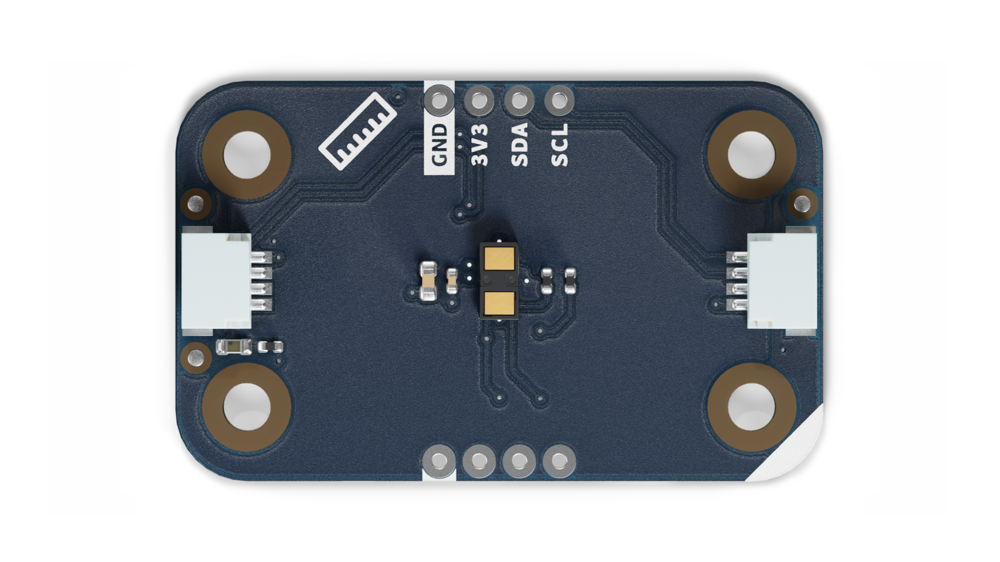
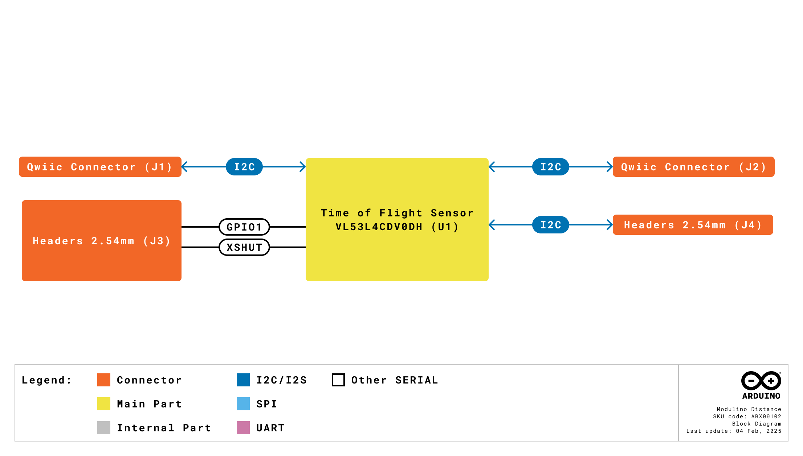
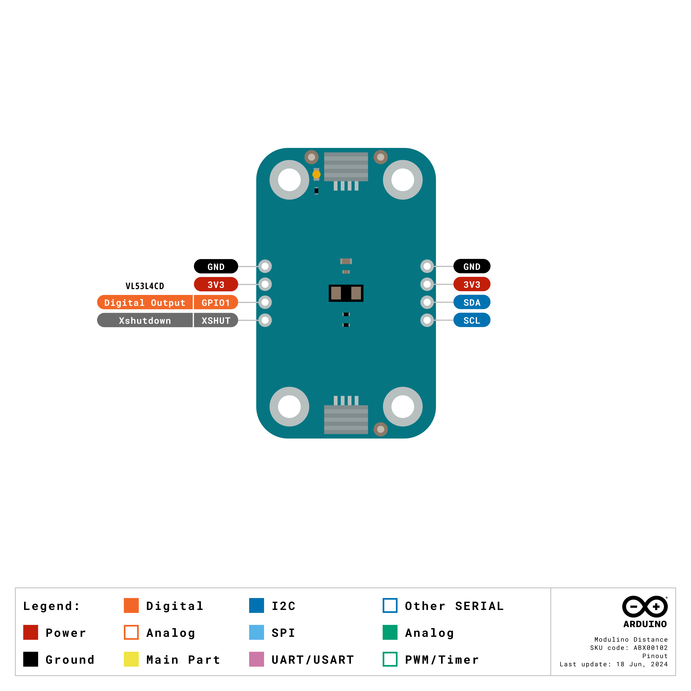
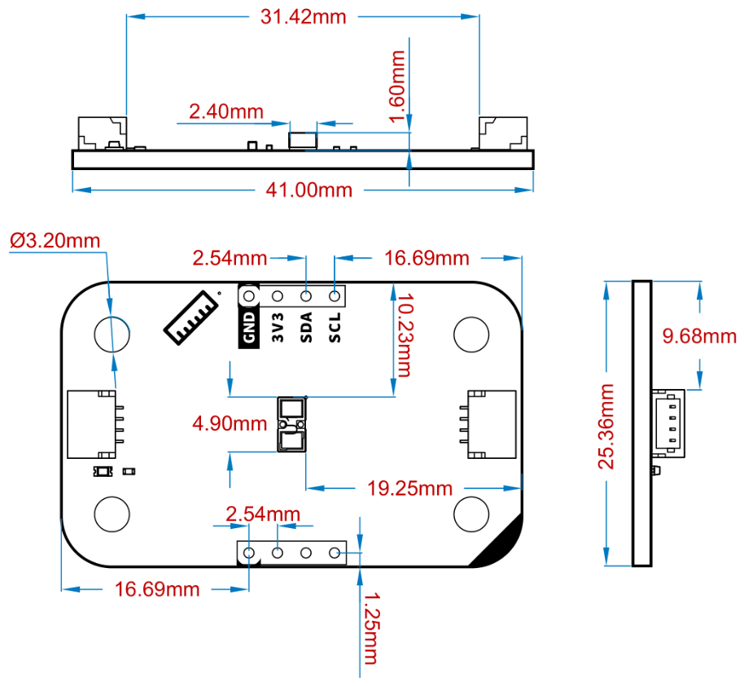

# Description
The Modulino® Distance, featuring the **VL53L4CDV0DH/1** time-of-flight sensor, provides accurate distance measurements in a compact, easy-to-use form factor. Ideal for proximity detection, obstacle avoidance, and various smart sensing applications.

# Target Areas
Maker, beginner, education

# Contents

## Application Examples
- **Robotics Navigation**
  Detect objects or obstacles up to about 1200 mm away, enabling mobile robots to sense and avoid collisions.

- **Proximity Sensing**
  Trigger actions when an object is within a user-defined range, such as auto-locking doors or touchless controls.

- **Smart Home Devices**
  Monitor open/close states of containers or doors, measure fluid levels, or create interactive installations.

## Features
- Uses the **VL53L4CDV0DH/1** sensor for precise **time-of-flight** distance measurements (0–1200 mm).
- **I2C (Qwiic)** interface for solder-free integration; operates at **3.3 V**.
- **Additional GPIO1** pin for interrupt signaling, **XSHUT** pin for power saving or reset.
- Ideal for **proximity detection**, **collision avoidance**, and general distance measuring tasks.

### Contents
| **SKU**    | **Name**            | **Purpose**                                   | **Quantity** |
| ---------- | ------------------- | --------------------------------------------- | ------------ |
| ABX00102   | Modulino® Distance  | Time-of-flight distance sensing               | 1            |
|            | I2C Qwiic cable     | Compatible with the Qwiic standard            | 1            |

## Related Products
- **SKU: ASX00027** – [Arduino® Sensor Kit](https://store.arduino.cc/products/arduino-sensor-kit)
- **SKU: K000007** – [Arduino® Starter Kit](https://store.arduino.cc/products/arduino-starter-kit-multi-language)  
- **SKU: AKX00026** – [Arduino® Oplà IoT Kit](https://store.arduino.cc/products/opla-iot-kit)

## Rating

### Recommended Operating Conditions
- **Sensor supply range:** 2.6 V – 3.5 V
- **Powered at 3.3 V** through the Qwiic interface (in accordance with the Qwiic standard)
- **Operating temperature:** –40 °C to +85 °C

**Typical current consumption:**
- ~40 mA peak (active ranging)
- ~24 mA during active measurement, ~4 mA I2C idle

## Power Tree
The power tree for the Modulino® node can be consulted below:

## Block Diagram
This module is designed to be placed on an I2C bus, allowing the on-board VL53L4CDV0DH/1 sensor to communicate with a host microcontroller via I2C.

## Functional Overview
The Modulino® Distance node uses a **time-of-flight** measuring principle to detect objects from 0 to ~1200 mm. It communicates via I2C (through the Qwiic connector at 3.3 V). **GPIO1** can signal an interrupt when a threshold is reached or measurement is ready, while **XSHUT** can place the sensor in shutdown mode to save power.

### Technical Specifications
| **Specification**       | **Details**                                      |
| ----------------------- | ------------------------------------------------ |
| **Sensor**              | VL53L4CDV0DH/1                                   |
| **Supply Voltage**      | Min: 2.6 V, Max: 3.5 V                           |
| **Power Consumption**   | ~24 mA active, 4 mA idle, 40 mA peak             |
| **Range**               | 0–1200 mm                                        |
| **Accuracy**            | ±7 mm to ±3%                                     |
| **Resolution**          | 1 mm                                            |
| **Communication**       | I2C                                             |

### Pinout

**Qwiic / I2C (1×4 Header)**  
| **Pin** | **Function**            |
| ------- | ----------------------- |
| GND     | Ground                 |
| 3.3 V   | Power Supply (3.3 V)   |
| SDA     | I2C Data               |
| SCL     | I2C Clock              |

These pads and the Qwiic connectors share the same I2C bus. You can optionally solder header pins here.

**Additional 1×4 Header (Distance Sensor Signals)**  
| **Pin** | **Function**                         |
| ------- | ------------------------------------ |
| GND   | Ground         |
| 3V3   | 3.3 V Power    |
| GPIO1 | Digital Output |
| XSHUT | Xshutdown      |

**Note:** On-board 10 kΩ pull-ups to 3.3 V exist for GPIO1 and XSHUT.

### Power Specifications
- **Nominal operating voltage:** 3.3 V via Qwiic
- **Sensor voltage range:** 2.6 V–3.5 V

### Mechanical Information

- Board dimensions: 41 mm × 25.36 mm
- Thickness: 1.6 mm (±0.2 mm)
- Four mounting holes (Ø 3.2 mm)
  - Hole spacing: 16 mm vertically, 32 mm horizontally

### I2C Address Reference
| **Board Silk Name** | **Sensor**       | **Modulino® I2C Address (HEX)** | **Editable Addresses (HEX)**              | **Hardware I2C Address (HEX)** |
|---------------------|------------------|--------------------------------|-------------------------------------------|--------------------------------|
| MODULINO DISTANCE   | VL53L4CDV0DH/1   | 0x29                           | Any custom address (via software config.) | 0x29                           |

**Note:** The default address is **0x29**. Multiple units of the same sensor may require address reconfiguration in software to avoid collisions.

## Device Operation
The Modulino® Distance node operates as an I2C target device on the Qwiic bus. A host microcontroller can read distance values, set thresholds, or configure measurement timing. If using multiple distance sensors, you may need to set unique addresses or toggle XSHUT lines.

### Getting Started
Use any standard Arduino or microcontroller environment at 3.3 V. Library support for the VL53 series sensors can simplify reading distance measurements. Ensure the sensor’s field of view is unobstructed for accurate results.

# Certifications

## Certifications Summary

| **Certification** | **Status** |
|:-----------------:|:----------:|
|  CE/RED (Europe)  |     Yes    |
|     UKCA (UK)     |     Yes    |
|     FCC (USA)     |     Yes    |
|    IC (Canada)    |     Yes    |
|        RoHS       |     Yes    |
|       REACH       |     Yes    |
|        WEEE       |     Yes    |

## Declaration of Conformity CE DoC (EU)

We declare under our sole responsibility that the products above are in conformity with the essential requirements of the following EU Directives and therefore qualify for free movement within markets comprising the European Union (EU) and European Economic Area (EEA).

## Declaration of Conformity to EU RoHS & REACH 211 01/19/2021

Arduino boards are in compliance with RoHS 2 Directive 2011/65/EU of the European Parliament and RoHS 3 Directive 2015/863/EU of the Council of 4 June 2015 on the restriction of the use of certain hazardous substances in electrical and electronic equipment.

| Substance                              | **Maximum limit (ppm)** |
|----------------------------------------|-------------------------|
| Lead (Pb)                              | 1000                    |
| Cadmium (Cd)                           | 100                     |
| Mercury (Hg)                           | 1000                    |
| Hexavalent Chromium (Cr6+)             | 1000                    |
| Poly Brominated Biphenyls (PBB)        | 1000                    |
| Poly Brominated Diphenyl ethers (PBDE) | 1000                    |
| Bis(2-Ethylhexyl) phthalate (DEHP)     | 1000                    |
| Benzyl butyl phthalate (BBP)           | 1000                    |
| Dibutyl phthalate (DBP)                | 1000                    |
| Diisobutyl phthalate (DIBP)            | 1000                    |

Exemptions: No exemptions are claimed.

Arduino Boards are fully compliant with the related requirements of European Union Regulation (EC) 1907 /2006 concerning the Registration, Evaluation, Authorization and Restriction of Chemicals (REACH). We declare none of the SVHCs (https://echa.europa.eu/web/guest/candidate-list-table), the Candidate List of Substances of Very High Concern for authorization currently released by ECHA, is present in all products (and also package) in quantities totaling in a concentration equal or above 0.1%. To the best of our knowledge, we also declare that our products do not contain any of the substances listed on the "Authorization List" (Annex XIV of the REACH regulations) and Substances of Very High Concern (SVHC) in any significant amounts as specified by the Annex XVII of Candidate list published by ECHA (European Chemical Agency) 1907 /2006/EC.

## FCC WARNING

This device complies with part 15 of the FCC Rules.

Operation is subject to the following two conditions: 

(1) This device may not cause harmful interference, and (2) this device must accept any interference received, including interference that may cause undesired operation.

## IC Caution

This device complies with Industry Canada licence-exempt RSS standard(s). 

Operation is subject to the following two conditions: 

(1) This device may not cause interference, and (2) this device must accept any interference, including interference that may cause undesired operation of the device.

## Conflict Minerals Declaration

As a global supplier of electronic and electrical components, Arduino is aware of our obligations with regard to laws and regulations regarding Conflict Minerals, specifically the Dodd-Frank Wall Street Reform and Consumer Protection Act, Section 1502. Arduino does not directly source or process conflict minerals such as Tin, Tantalum, Tungsten, or Gold. Conflict minerals are contained in our products in the form of solder or as a component in metal alloys. As part of our reasonable due diligence, Arduino has contacted component suppliers within our supply chain to verify their continued compliance with the regulations. Based on the information received thus far we declare that our products contain Conflict Minerals sourced from conflict-free areas.

## Laser Safety Information

This product contains a laser emitter and corresponding drive circuitry. The laser output is designed to meet **Class 1 laser safety limits** under all reasonably foreseeable conditions including single faults, in compliance with **IEC 60825-1:2014**.

Do not increase the laser output power by any means. Do not use any optics to focus the laser beam.

**Caution:**  
Use of controls or adjustments, or performance of procedures other than those specified herein may result in hazardous radiation exposure.

# Company Information

| Company name    | Arduino SRL                                   |
|-----------------|-----------------------------------------------|
| Company Address | Via Andrea Appiani, 25 - 20900 MONZA（Italy)  |

# Reference Documentation

| Ref                       | Link                                                                                                                                                                                           |
| ------------------------- | ---------------------------------------------------------------------------------------------------------------------------------------------------------------------------------------------- |
| Arduino IDE (Desktop)     | [https://www.arduino.cc/en/Main/Software](https://www.arduino.cc/en/Main/Software)                                                                                                             |
| Arduino Courses           | [https://www.arduino.cc/education/courses](https://www.arduino.cc/education/courses)                                                                                                           |
| Arduino Documentation     | [https://docs.arduino.cc/](https://docs.arduino.cc/)                                                                                                           |
| Arduino IDE (Cloud)       | [https://create.arduino.cc/editor](https://create.arduino.cc/editor)                                                                                                                           |
| Cloud IDE Getting Started | [https://docs.arduino.cc/cloud/web-editor/tutorials/getting-started/getting-started-web-editor](https://docs.arduino.cc/cloud/web-editor/tutorials/getting-started/getting-started-web-editor) |
| Project Hub               | [https://projecthub.arduino.cc/](https://projecthub.arduino.cc/)                                                                                                                               |
| Library Reference         | [https://github.com/arduino-libraries/](https://github.com/arduino-libraries/)                                                                                                                 |
| Online Store              | [https://store.arduino.cc/](https://store.arduino.cc/)                                                                                                                      |

# Revision History
| **Date**   | **Revision** | **Changes**                       |
| ---------- | ------------ | --------------------------------- |
| 07/07/2025 | 5            | Add laser safety section          |
| 01/07/2025 | 4            | Certification                     |
| 17/06/2025 | 3            | Nomenclature updates              |
| 23/05/2025 | 2            | Fixed pinout table and power info |
| 14/05/2025 | 1            | First release                     |

