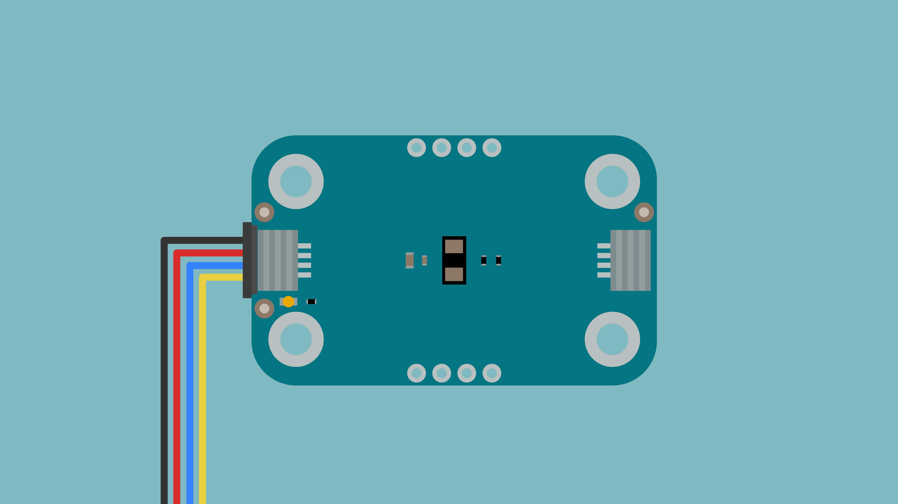
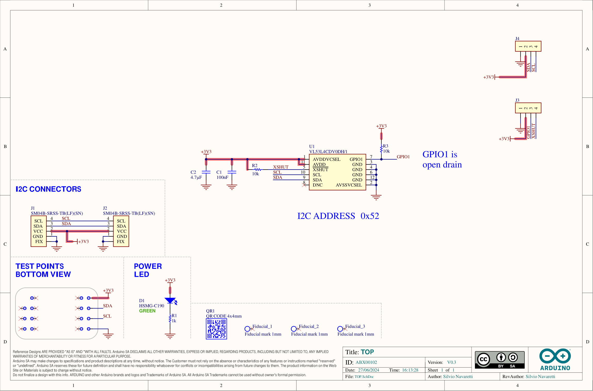

The Modulino Distance is a modular sensor that measures distance using Time-of-Flight (ToF) technology, making it perfect to add precise distance sensing and depth mapping to your projects!

## Hardware Overview

### General Characteristics

The Modulino Distance is capable of measuring distances using Time-of-Flight technology with the following specifications:

| Parameter             | Condition            | Minimum | Typical | Maximum | Unit |
|-----------------------|----------------------|---------|---------|---------|------|
| Range                 | Distance Measurement | 1       | -       | 1300    | mm   |
| Resolution            | -                    | -       | 1       | -       | mm   |
| Operating Temperature | -                    | -30     | -       | 85      | °C   |

### Sensor Details

The VL53L4CDV0DH/1 sensor from STMicroelectronics is the core component of this module. This ToF sensor natively supports digital communication (I²C), meaning it connects directly to the I²C bus on the module without requiring additional conversion circuitry.

| Parameter     | Condition     | Minimum | Typical | Maximum | Unit |
|---------------|---------------|---------|---------|---------|------|
| Field of View | -             | -       | 18      | -       | °    |
| Wavelength    | Laser Emitter | -       | 940     | -       | nm   |

The default address for the Module is:

| Modulino I²C Address | Hardware I²C Address |
|----------------------|----------------------|
| 0x52                 | 0x52                 |

***Note: Since the address cannot be changed on this Modulino specifically, using two or more identical modules on the same I²C bus will result in address conflicts and cause communication issues.***

### Pinout


#### 1x4 Header (Sensor GPIO)

| Pin   | Function       |
|-------|----------------|
| GND   | Ground         |
| 3V3   | 3.3 V Power    |
| GPIO1 | Digital Output |
| XSHUT | Xshutdown      |

#### 1x4 Header (I2C)

| Pin   | Function     |
|-------|--------------|
| GND   | Ground       |
| 3.3 V | Power Supply |
| SDA   | I²C Data     |
| SCL   | I²C Clock    |

### Power Specifications

| Parameter             | Condition               | Minimum | Typical     | Maximum | Unit |
|-----------------------|-------------------------|---------|-------------|---------|------|
| Supply Voltage        | -                       | -       | 3.3 (QWIIC) | -       | V    |
| Current Consumption   | Active measurement mode | -       | 24          | 40      | mA   |
| Operating Temperature | -                       | -30     | -           | 85      | °C   |

The module includes a power LED that draws 1 mA and turns on as soon as it is powered.

### Schematic

The Modulino Distance uses a straightforward circuit built around the Time-of-Flight sensor.



The main component is the **VL53L4CDV0DH/1** sensor (U1), which handles distance measurements using Time-of-Flight technology, as well as I²C communication.

You can connect to the I²C pins (SDA and SCL) using either the **QWIIC connectors** (J1 and J2, this is the recommended method) or the **solderable pins** (J4). The board runs on **3.3 V**, which comes from the QWIIC cable or the **3V3 pin** on J4.

There's also a small power indicator LED that lights up when the board is on.

You can grab the full schematic and PCB files from the [Modulino Distance page](https://docs.arduino.cc/hardware/modulinos/modulino-distance).

## Programming with Arduino

The Modulino Distance is fully compatible with the Arduino IDE and the official Modulino library. The following examples showcase how to read distance measurements and implement proximity-based features in your Arduino projects.

### Prerequisites

- Install the Modulino library via the Arduino IDE Library Manager
- Connect your Modulino Distance via QWIIC or solderable headers

For detailed instructions on setting up your Arduino environment and installing libraries, please refer to the [Getting Started with Modulinos guide](./how-general).

Library repository available [here](https://github.com/arduino-libraries/Arduino_Modulino).

### Basic Example

```arduino
#include "Modulino.h"

// Create object instance
ModulinoDistance distance;

void setup() {
  Serial.begin(9600);

  // Initialize the Modulino system and distance sensor
  Modulino.begin();
  distance.begin();
}

void loop() {
  if (distance.available()) {
    int measure = distance.get();
    Serial.println(measure);
  }
  delay(10);
}
```

### Key Functions

- `available()`: Checks if new distance data is available
- `get()`: Retrieves the measured distance from the sensor (default in cm)

### Advanced Example - Parking Sensor

```arduino
#include "Modulino.h"

ModulinoDistance distance;

// Distance thresholds in cm
const int DANGER_ZONE = 10;    // Less than 10cm
const int WARNING_ZONE = 30;   // 10-30cm
const int CAUTION_ZONE = 50;   // 30-50cm
const int SAFE_ZONE = 100;     // 50-100cm

void setup() {
  Serial.begin(9600);
  Modulino.begin();
  distance.begin();
  
  Serial.println("Parking Sensor Active");
  Serial.println("===================");
}

void loop() {
  if (distance.available()) {
    int measure = distance.get();
    
    // Determine zone and provide feedback
    if (measure < DANGER_ZONE) {
      Serial.print("🔴 STOP! Distance: ");
      Serial.print(measure);
      Serial.println(" cm - TOO CLOSE!");
    }
    else if (measure < WARNING_ZONE) {
      Serial.print("🟠 WARNING - Distance: ");
      Serial.print(measure);
      Serial.println(" cm - Very close");
    }
    else if (measure < CAUTION_ZONE) {
      Serial.print("🟡 CAUTION - Distance: ");
      Serial.print(measure);
      Serial.println(" cm - Getting close");
    }
    else if (measure < SAFE_ZONE) {
      Serial.print("🟢 SAFE - Distance: ");
      Serial.print(measure);
      Serial.println(" cm - Good distance");
    }
    else {
      Serial.print("✓ Clear - Distance: ");
      Serial.print(measure);
      Serial.println(" cm");
    }
  }
  
  delay(100);  // Update 10 times per second
}
```

## Programming with MicroPython

The Modulino Distance is fully compatible with MicroPython through the official Modulino MicroPython library. The following examples demonstrate how to read distance measurements and create proximity-activated systems in your MicroPython projects.

### Prerequisites

- Install the Modulino MicroPython library
- Ensure Arduino Lab for MicroPython is installed

For detailed instructions on setting up your MicroPython environment and installing packages, please refer to the [Getting Started with Modulinos guide](./how-general).

### Basic Example

```python
from modulino import ModulinoDistance
from time import sleep_ms

distance = ModulinoDistance()

while True:
    print(f"📏 Distance: {distance.distance} cm")
    sleep_ms(50)
```

### Key Properties

- `.distance`: Provides the distance measurement from the sensor (default in cm)

### Advanced Example - Proximity-Activated System

```python
from modulino import ModulinoDistance
from time import sleep, ticks_ms

distance = ModulinoDistance()

# Configuration
ACTIVATION_DISTANCE = 20  # cm
DEACTIVATION_DISTANCE = 30  # cm
DEBOUNCE_TIME = 500  # milliseconds

# State tracking
is_activated = False
last_activation_time = 0
activation_count = 0

def check_proximity():
    """Check distance and manage activation state"""
    global is_activated, last_activation_time, activation_count
    
    current_distance = distance.distance
    current_time = ticks_ms()
    
    # Check if we should activate
    if not is_activated and current_distance < ACTIVATION_DISTANCE:
        # Debounce check
        if current_time - last_activation_time > DEBOUNCE_TIME:
            is_activated = True
            activation_count += 1
            last_activation_time = current_time
            print(f"\n✋ ACTIVATED! Object detected at {current_distance} cm")
            print(f"   Activation count: {activation_count}")
            return True
    
    # Check if we should deactivate
    elif is_activated and current_distance > DEACTIVATION_DISTANCE:
        is_activated = False
        duration = (current_time - last_activation_time) / 1000
        print(f"\n👋 DEACTIVATED after {duration:.1f} seconds")
        return False
    
    return is_activated

def hand_wave_detector():
    """Detect hand wave gestures"""
    samples = []
    sample_time = 50  # ms
    wave_threshold = 5  # minimum changes
    
    print("\nWave your hand in front of the sensor...")
    
    for _ in range(20):  # Collect 1 second of samples
        samples.append(distance.distance)
        sleep(sample_time / 1000)
    
    # Detect changes in distance
    changes = 0
    for i in range(1, len(samples)):
        if abs(samples[i] - samples[i-1]) > 5:  # 5cm change threshold
            changes += 1
    
    if changes >= wave_threshold:
        print(f"👋 Wave detected! ({changes} movements)")
        return True
    
    return False

# Menu system
print("🎯 Distance Sensor Applications")
print("1. Proximity Activation Demo")
print("2. Hand Wave Detection")
print("3. Distance Monitor")

while True:
    choice = input("\nSelect mode (1-3): ")
    
    if choice == "1":
        print(f"\nProximity activation mode")
        print(f"Activation: < {ACTIVATION_DISTANCE} cm")
        print(f"Deactivation: > {DEACTIVATION_DISTANCE} cm")
        
        while True:
            activated = check_proximity()
            if activated:
                print(f"  Status: ACTIVE | Distance: {distance.distance} cm", end='\r')
            else:
                print(f"  Status: IDLE   | Distance: {distance.distance} cm", end='\r')
            sleep(0.1)
    
    elif choice == "2":
        print("\nHand wave detection mode")
        while True:
            if hand_wave_detector():
                print("  Action triggered by wave!")
            sleep(0.5)
    
    elif choice == "3":
        print("\nDistance monitoring mode")
        while True:
            d = distance.distance
            # Create visual bar graph
            bar_length = min(d // 2, 50)  # Scale to max 50 characters
            bar = "█" * bar_length
            print(f"Distance: {d:4d} cm |{bar}", end='\r')
            sleep(0.05)
```

## Troubleshooting

### Sensor Not Reachable

If your Modulino's power LED isn't on or the sensor isn't responsive:
- Ensure both the board and the Modulino are connected properly
- Verify that the power LEDs on both are lit
- Check that the QWIIC cable is properly clicked into place

### Inaccurate Values

If the sensor values are not accurate:
- Ensure the sensor lens is clean and free from dust or obstructions
- Verify the object being measured is within the sensor's detection range
- Check that exposed electronics are not touching conductive surfaces

## Project Ideas

- **Parking Assistance System**: Provide audio feedback as objects get closer
- **Theremin Musical Instrument**: Change pitch based on hand movements
- **Automatic Dispenser**: Activate when hands are detected
- **Security System**: Detect when someone approaches a protected area
- **Liquid Level Monitor**: Measure distance to liquid surface in a tank
- **Robot Obstacle Avoidance**: Help robots navigate around objects
- **Interactive Art Installation**: Trigger effects based on viewer proximity
- **Smart Trash Can**: Automatically open lid when someone approaches