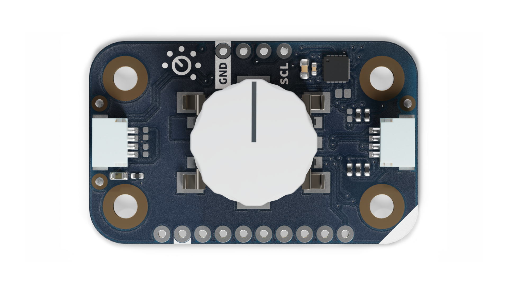
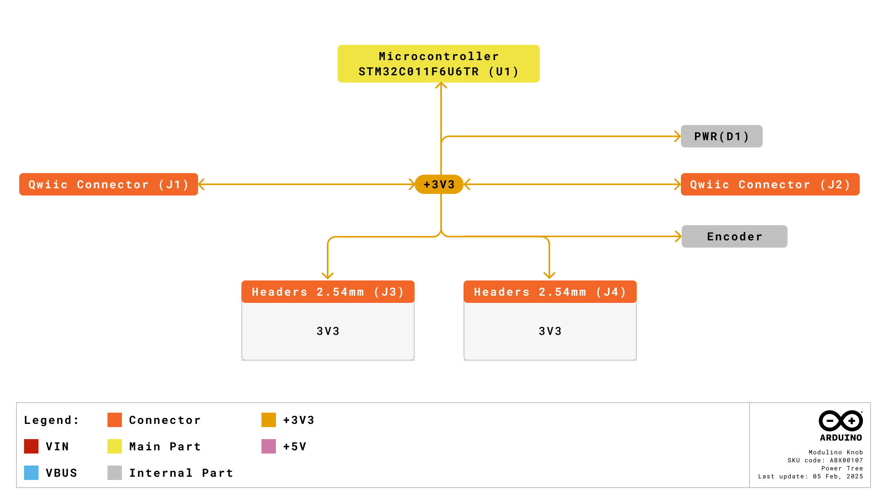
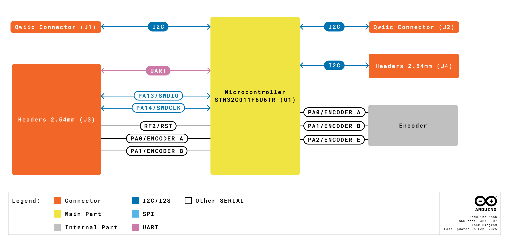
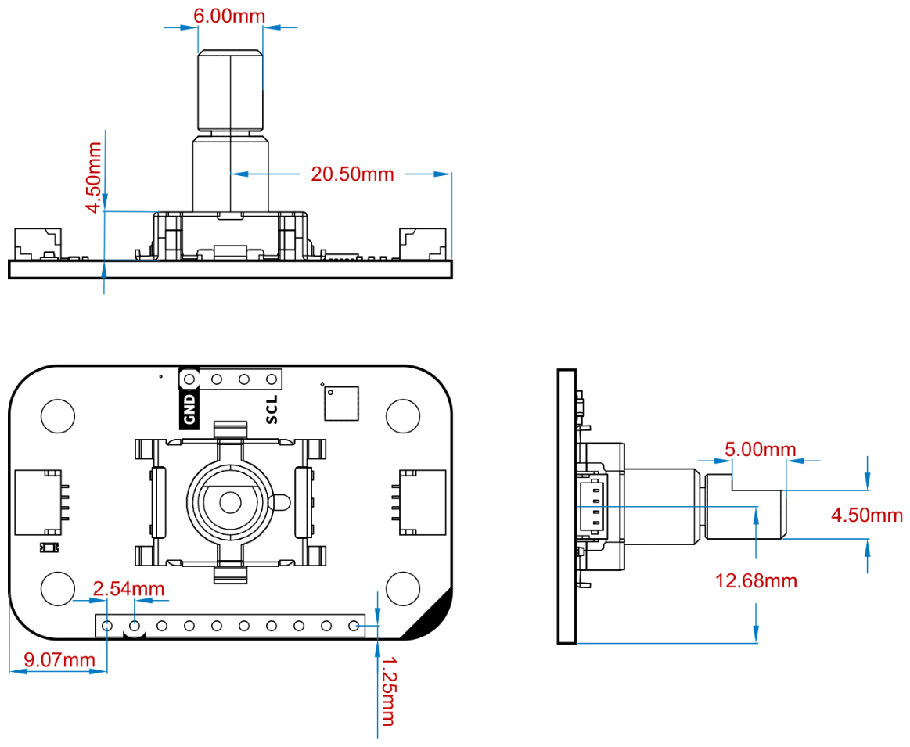
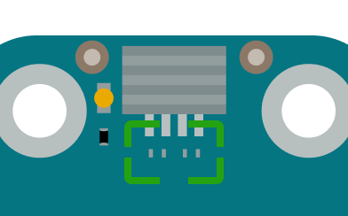

# Description
The Modulino® Knob features a **quadrature rotary encoder** (PEC11J-9215F-S0015) paired with an on-board **STM32C011F4 microcontroller**, enabling both precise rotational input and push-button interaction. The node communicates via I2C (Qwiic interface) by default, but can also be reprogrammed or accessed via other communication interfaces for advanced projects.

# Target Areas
Maker, beginner, education

# Contents

## Application Examples

- **User Interface Control**
  Implement smooth menu navigation, scrolling through options, or fine adjustment of parameters (e.g., volume, brightness) in your project.

- **Industrial/Mechanical Projects**
  Use rotary input for setting machine parameters, calibrating sensors, or controlling motor speed.

- **Educational Tools**
  Teach the concepts of rotary encoding, I2C interfacing, and microcontroller-based data handling using a simple, hands-on input device.

## Features
- **Quadrature rotary encoder** with push-switch capability for rich user input.
- **STM32C011F4** microcontroller handling I2C communications and optional reprogramming.
- Operates at **3.3 V** via the Qwiic interface; supports 2.0 V–3.6 V supply range internally.
- **SWD** interface on-board for firmware customization, plus optional UART lines.
- Ideal for **menu navigation**, fine-tuning controls, and interactive IoT or maker projects.

### Contents
| **SKU**   | **Name**             | **Purpose**                                 | **Quantity** |
| --------- | -------------------- | ------------------------------------------- | ------------ |
| ABX00107  | Modulino® Knob       | Quadrature rotary encoder with push switch  | 1            |
|           | I2C Qwiic cable      | Compatible with the Qwiic standard          | 1            |

## Related Products
- **SKU: ASX00027** – [Arduino® Sensor Kit](https://store.arduino.cc/products/arduino-sensor-kit)  
- **SKU: K000007** – [Arduino® Starter Kit](https://store.arduino.cc/products/arduino-starter-kit-multi-language)  
- **SKU: AKX00026** – [Arduino® Oplà IoT Kit](https://store.arduino.cc/products/opla-iot-kit)

## Rating

### Recommended Operating Conditions
- **Microcontroller supply range:** 2.0 V – 3.6 V (STM32C011F4)
- **Powered at 3.3 V** through the Qwiic interface (in accordance with the Qwiic standard)
- **Operating temperature:** –40 °C to +85 °C

**Typical current consumption:**
- ~3.4 mA (microcontroller + rotary encoder interface)

## Power Tree
The power tree for the Modulino® node can be consulted below:

## Block Diagram
This module includes an STM32C011F4 microcontroller, reading the quadrature signals from the rotary encoder and a push switch. It communicates via I2C by default but can be customized via SWD for additional functionalities.

## Functional Overview
The Modulino® Knob node reads a **quadrature rotary encoder** (including push-switch action), translating positional and switch states into data accessible via I2C. The on-board MCU (STM32C011F4) can also support other protocols (UART, SPI, I2S) if reprogrammed. By default, I2C data allows host microcontrollers (e.g., Arduino® UNO R4 WiFi) to read knob rotation and button states easily.

### Technical Specifications

| **Specification**       | **Details**                                     |
| ----------------------- | ----------------------------------------------- |
| **Microcontroller**     | STM32C011F4 (handles I2C, rotary encoder logic)|
| **Encoder**             | PEC11J-9215F-S0015 (quadrature + push switch)  |
| **Encoder Range**       | 360° (continuous rotation)                      |
| **Supply Voltage**      | 3.3 V                                           |
| **Power Consumption**   | ~3.4 mA                                         |
| **Communication**       | I2C (Qwiic), SWD (debug/reprogram), optional UART |

### Pinout

**Qwiic / I2C (1×4 Header)**  
| **Pin** | **Function**              |
|---------|---------------------------|
| GND     | Ground                   |
| 3.3 V   | Power Supply (3.3 V)     |
| SDA     | I2C Data                 |
| SCL     | I2C Clock                |

These pads and the Qwiic connectors share the same I2C bus at 3.3 V.

**Additional 1×10 Header (Knob & MCU Signals)**
| **Pin** | **Function**      |
|---------|-------------------|
| PA2   | Button         |
| GND   | Ground         |
| 3V3   | 3.3 V Power    |
| PF2   | RESET          |
| SWCLK | SWD Clock      |
| SWDIO | SWD Data       |
| TX1   | USART Transmit |
| RX1   | USART Receive  |
| PA0   | Encoder A      |
| PA1   | Encoder B      |

**Note:** By default, the STM32C011F4 firmware manages the rotary encoder via I2C registers. Advanced users may modify this behavior by flashing custom code through SWD.

### Power Specifications
- **Nominal operating voltage:** 3.3 V via Qwiic
- **MCU voltage range:** 2.0 V–3.6 V

### Mechanical Information

- Board dimensions: 41 mm × 25.36 mm
- Thickness: 1.6 mm (±0.2 mm)
- Four mounting holes (Ø 3.2 mm)
  - Hole spacing: 16 mm vertically, 32 mm horizontally

### I2C Address Reference
| **Board Silk Name** | **Sensor**               | **Modulino® I2C Address (HEX)** | **Editable Addresses (HEX)**          | **Hardware I2C Address (HEX)** |
|---------------------|--------------------------|--------------------------------|---------------------------------------|--------------------------------|
| MODULINO KNOB       | Quadrature Encoder + MCU | 0x76                           | Any custom address (via FW config)    | 0x3A                           |

**Note:** Default I2C address is **0x76**. You can change it through the Modulino® library or by flashing custom firmware. A white rectangle on the board silk can be used to label the new address.

#### Pull-up Resistors

The module has pads for optional I2C pull-up mounting in both data lines. No resistors are mounted by default but in case the resistors are need 4.7 K resistors in an SMD 0402 format are recommended.

These are positioned near the Qwiic connector on the power LED side.

## Device Operation
The Modulino® Knob node acts as an I2C target device on the Qwiic bus. It detects rotation steps (increment/decrement), push-switch events, and reports them to the host controller. If the included firmware doesn’t meet your needs, you can reprogram the STM32C011F4 via SWD.

### Getting Started
Use any Arduino or other 3.3 V microcontroller environment. An official Modulino® library may be available to streamline reading rotary values and push-switch states. Ensure your master device shares the same 3.3 V reference and I2C bus.

### Board Recovery

All Arduino® boards have a built-in bootloader which allows flashing the board via USB. In case a sketch locks up the processor and the board is not reachable anymore via USB, it is possible to enter bootloader mode by double-tapping the reset button right after the power-up.

# Certifications

## Certifications Summary

| **Certification** | **Status** |
|:-----------------:|:----------:|
|  CE/RED (Europe)  |     Yes    |
|     UKCA (UK)     |     Yes    |
|     FCC (USA)     |     Yes    |
|    IC (Canada)    |     Yes    |
|        RoHS       |     Yes    |
|       REACH       |     Yes    |
|        WEEE       |     Yes    |

## Declaration of Conformity CE DoC (EU)

We declare under our sole responsibility that the products above are in conformity with the essential requirements of the following EU Directives and therefore qualify for free movement within markets comprising the European Union (EU) and European Economic Area (EEA).

## Declaration of Conformity to EU RoHS & REACH 211 01/19/2021

Arduino boards are in compliance with RoHS 2 Directive 2011/65/EU of the European Parliament and RoHS 3 Directive 2015/863/EU of the Council of 4 June 2015 on the restriction of the use of certain hazardous substances in electrical and electronic equipment.

| Substance                              | **Maximum limit (ppm)** |
|----------------------------------------|-------------------------|
| Lead (Pb)                              | 1000                    |
| Cadmium (Cd)                           | 100                     |
| Mercury (Hg)                           | 1000                    |
| Hexavalent Chromium (Cr6+)             | 1000                    |
| Poly Brominated Biphenyls (PBB)        | 1000                    |
| Poly Brominated Diphenyl ethers (PBDE) | 1000                    |
| Bis(2-Ethylhexyl) phthalate (DEHP)     | 1000                    |
| Benzyl butyl phthalate (BBP)           | 1000                    |
| Dibutyl phthalate (DBP)                | 1000                    |
| Diisobutyl phthalate (DIBP)            | 1000                    |

Exemptions: No exemptions are claimed.

Arduino Boards are fully compliant with the related requirements of European Union Regulation (EC) 1907 /2006 concerning the Registration, Evaluation, Authorization and Restriction of Chemicals (REACH). We declare none of the SVHCs (https://echa.europa.eu/web/guest/candidate-list-table), the Candidate List of Substances of Very High Concern for authorization currently released by ECHA, is present in all products (and also package) in quantities totaling in a concentration equal or above 0.1%. To the best of our knowledge, we also declare that our products do not contain any of the substances listed on the "Authorization List" (Annex XIV of the REACH regulations) and Substances of Very High Concern (SVHC) in any significant amounts as specified by the Annex XVII of Candidate list published by ECHA (European Chemical Agency) 1907 /2006/EC.

## FCC WARNING

This device complies with part 15 of the FCC Rules.

Operation is subject to the following two conditions: 

(1) This device may not cause harmful interference, and (2) this device must accept any interference received, including interference that may cause undesired operation.

## IC Caution

This device complies with Industry Canada licence-exempt RSS standard(s). 

Operation is subject to the following two conditions: 

(1) This device may not cause interference, and (2) this device must accept any interference, including interference that may cause undesired operation of the device.

## Conflict Minerals Declaration

As a global supplier of electronic and electrical components, Arduino is aware of our obligations with regard to laws and regulations regarding Conflict Minerals, specifically the Dodd-Frank Wall Street Reform and Consumer Protection Act, Section 1502. Arduino does not directly source or process conflict minerals such as Tin, Tantalum, Tungsten, or Gold. Conflict minerals are contained in our products in the form of solder or as a component in metal alloys. As part of our reasonable due diligence, Arduino has contacted component suppliers within our supply chain to verify their continued compliance with the regulations. Based on the information received thus far we declare that our products contain Conflict Minerals sourced from conflict-free areas.

# Company Information

| Company name    | Arduino SRL                                   |
|-----------------|-----------------------------------------------|
| Company Address | Via Andrea Appiani, 25 - 20900 MONZA（Italy)  |

# Reference Documentation

| Ref                       | Link                                                                                                                                                                                           |
| ------------------------- | ---------------------------------------------------------------------------------------------------------------------------------------------------------------------------------------------- |
| Arduino IDE (Desktop)     | [https://www.arduino.cc/en/Main/Software](https://www.arduino.cc/en/Main/Software)                                                                                                             |
| Arduino Courses           | [https://www.arduino.cc/education/courses](https://www.arduino.cc/education/courses)                                                                                                           |
| Arduino Documentation     | [https://docs.arduino.cc/](https://docs.arduino.cc/)                                                                                                           |
| Arduino IDE (Cloud)       | [https://create.arduino.cc/editor](https://create.arduino.cc/editor)                                                                                                                           |
| Cloud IDE Getting Started | [https://docs.arduino.cc/cloud/web-editor/tutorials/getting-started/getting-started-web-editor](https://docs.arduino.cc/cloud/web-editor/tutorials/getting-started/getting-started-web-editor) |
| Project Hub               | [https://projecthub.arduino.cc/](https://projecthub.arduino.cc/)                                                                                                                               |
| Library Reference         | [https://github.com/arduino-libraries/](https://github.com/arduino-libraries/)                                                                                                                 |
| Online Store              | [https://store.arduino.cc/](https://store.arduino.cc/)                                                                                                                      |

# Revision History
| **Date**   | **Revision** | **Changes**                                                       |
| ---------- | ------------ | ----------------------------------------------------------------- |
| 01/07/2025 | 4            | Certification                                                     |
| 17/06/2025 | 3            | Nomenclature updates                                              |
| 23/05/2025 | 2            | Fixed pinout table, power info, removed unrelated characteristics |
| 14/05/2025 | 1            | First release                                                     |

