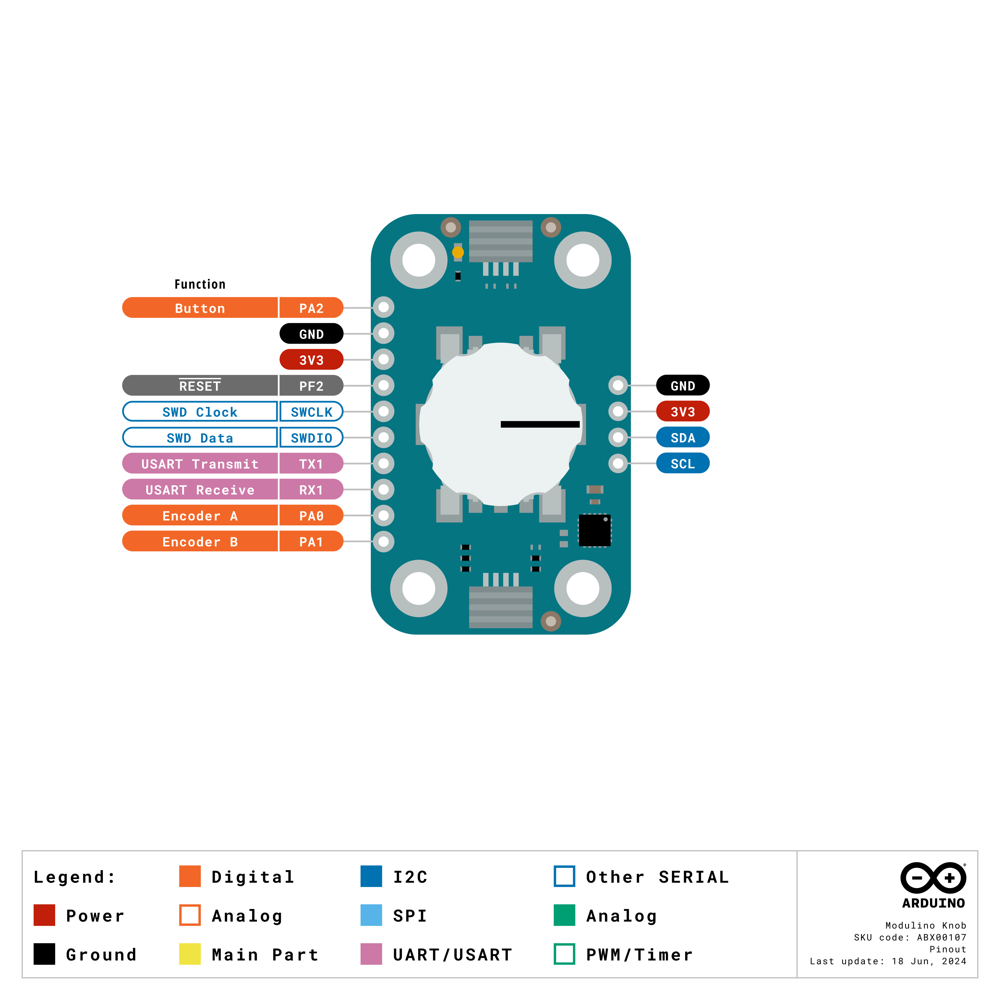
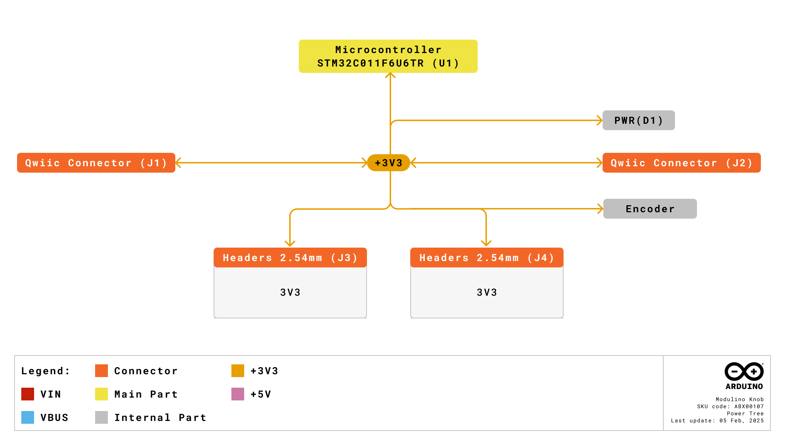
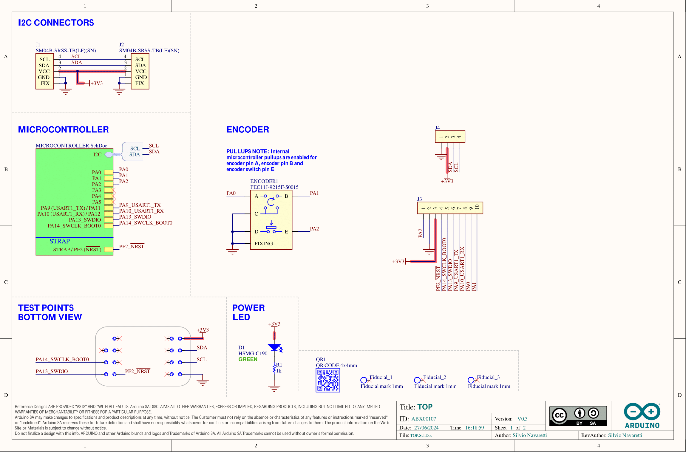
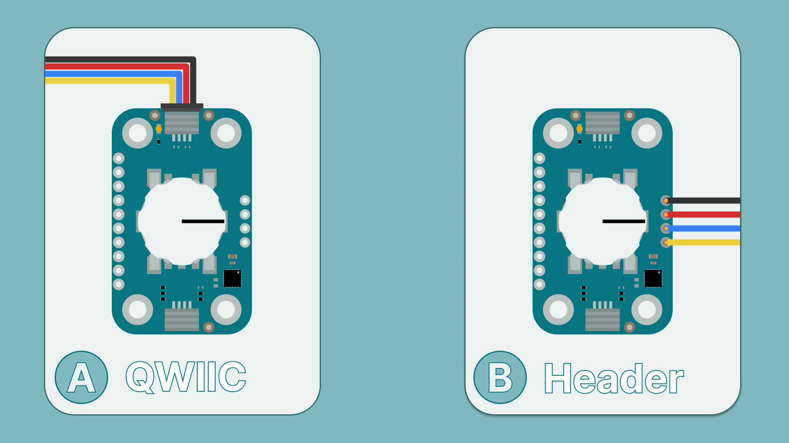
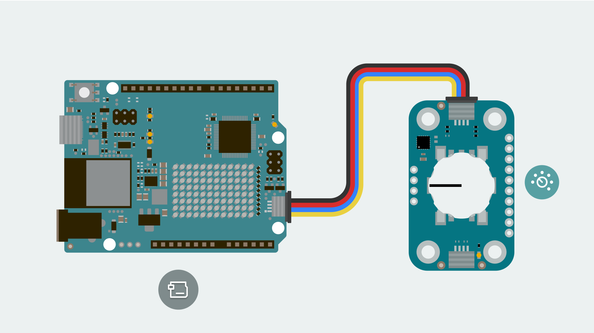
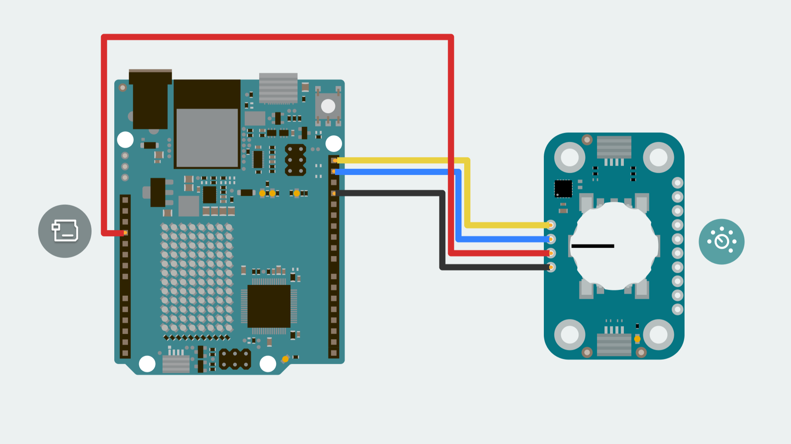
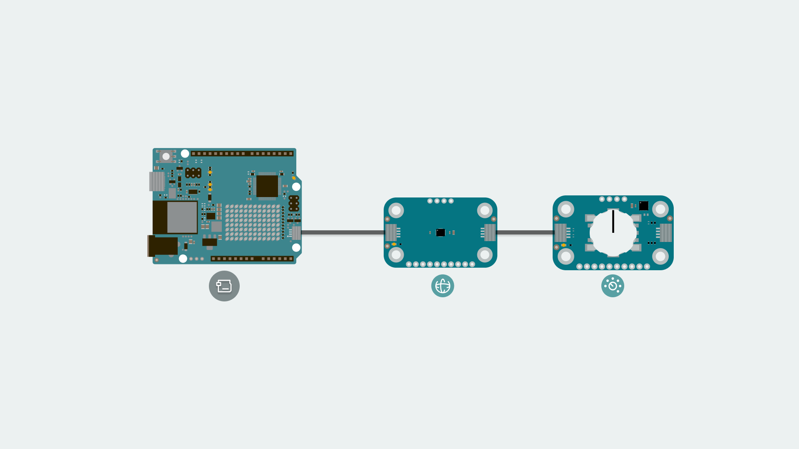
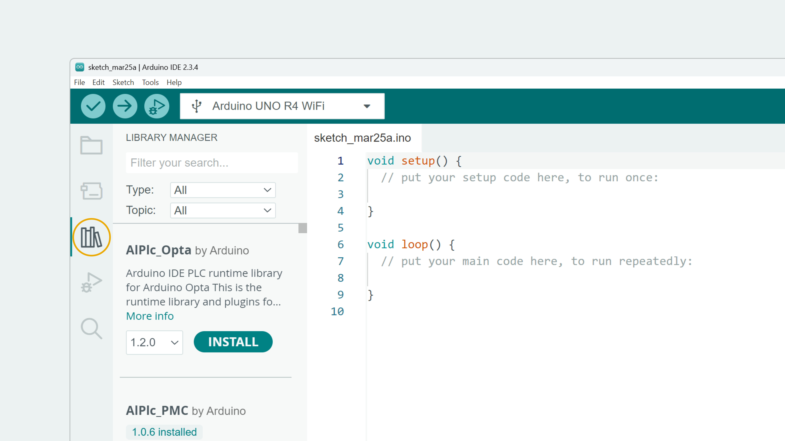
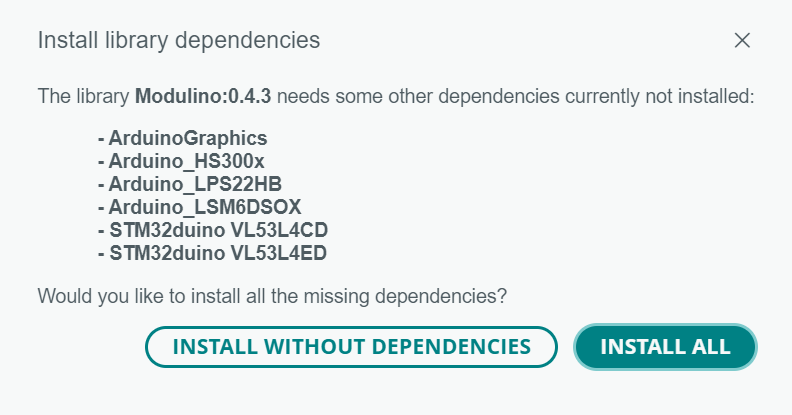
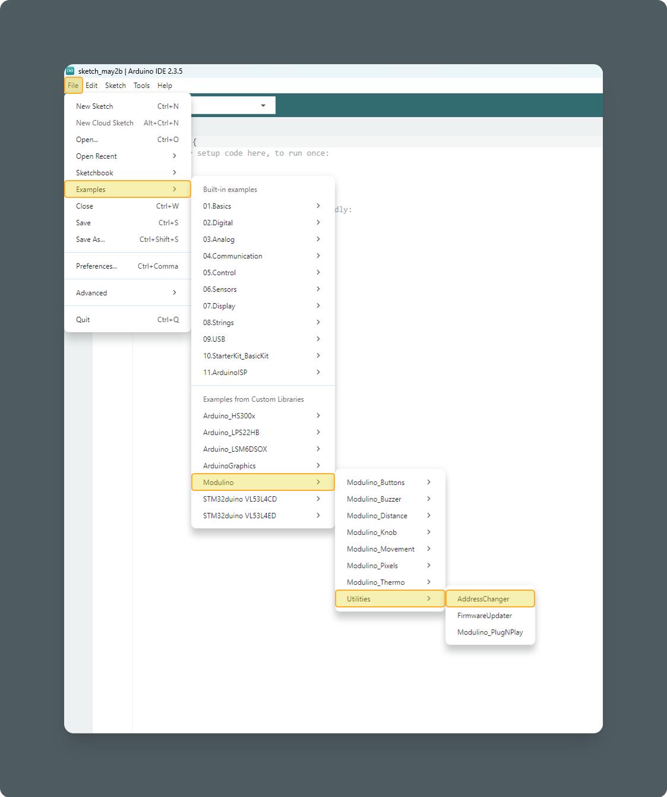

The Modulino Knob is a modular sensor based on a quadrature rotary encoder that translates angular motion (rotation) into a digital signal. The sensor value will increase or decrease according to the rotation direction. Also, it includes an SPST switch that is activated when the knob is pressed.  
It uses the Modulino form factor, streamlining integration through the I2C protocol. It provides QWIIC connectors and exposed solderable pins (for boards without a QWIIC interface).

## General Characteristics

The Modulino Knob has the following measurement specifications:


| **Parameter** | **Condition** | **Minimum** | **Typical**      | **Maximum** | **Unit** |
| -------------- | ------------- | ----------- | ---------------- | ----------- | -------- |
| Sensor         | Angle         | -           | 360 (continuous) | -           | °        |
| Steps          | -             | -           | 30               | -           | -        |
| Resolution     | -             | -           | 12               | -           | bit      |

## Sensor Details

The PEC11J-9215F-S0015 rotary encoder is the core component of this module. This sensor output is processed by an STM32C011F4 microcontroller for digital communication (I2C), meaning that the encoder is communicated through the I2C pins using the mentioned microcontroller as an intermediary.
The default address for the Module is:

| **Modulino I2C Address** | **Hardware I2C Address** |
| ------------------------ | ------------------------ |
| 0x76                     | 0x3A                     |

When scanning for I²C address on the bus, you might find the modulino using the **Hardware I²C Address**. However, you should always use the **Modulino I²C Address** when using the official Modulino library.
Later in this article we teach how to [change the address](#how-to-change-i2c-address).


## Pinout

The rotary encoder is the core component of this module. This input device is controlled by an onboard STM32 microcontroller, which supports digital communication (I²C), meaning it connects directly to the I²C bus on the module without requiring additional conversion circuitry.



The board also includes direct connections to the rotary encoder bypassing the built-in microcontroller.

### Input/Output Headers

| Pin | Function |
|----------|-----------------| 
| Button | PA2 Button Signal |
| Encoder A | PA0 Encoder A Signal |
| Encoder B | PA1 Encoder B Signal |
| RX1 | UART Receive |
| TX1 | UART Transmit |
| SWDIO | SWD Data |
| SWCLK | SWD Clock |
| PF2 | NRST |

- **Button** – This pin connects directly to the built-in button of the rotary encoder.
- **Encoder A/B** – These pins connect directly to the rotary encoder's quadrature outputs.
- **RX1: UART Receive** – Used for receiving data over UART communication.
- **TX1: UART Transmit** – Used for transmitting data over UART communication.
- **SWDIO: SWD Data** – Used for debugging, as part of the Serial Wire Debug (SWD) interface.
- **SWCLK: SWD Clock** – Used for providing the clock signal in the SWD interface.
- **PF2: NRST** – The reset pin for the microcontroller, which can be used to reset the system.

### 1x4 Header (I2C)

The pinout for the Modulino Knob is shown below. While the recommended connection method is via the QWIIC connectors, this solderable header provides a connection option when using the modulino with a non-QWIIC compatible board.

| Pin | Function |
|-------|--------------|
| GND | Ground |
| 3.3 V | Power Supply |
| SDA | I²C Data |
| SCL | I²C Clock |

## Power Specifications

The board must be powered **only** by +3.3 VDC when using the solderable pins or the QWIIC interface as per the standard. 

| Parameter       | Minimum | Typical | Maximum | Unit |
| --------------- | ------- | ------- | ------- | ---- |
| Supply Voltage  | 2.0     | 3.3     | 3.6     | V    |
| Average Current |         | 3.4     |         | mA   |

The module includes a power LED that draws 1 mA and turns on as soon as it is powered. J1 (Qwiic connector), J2 (Qwiic connector), and the headers all share the same power branch. The power distribution of the module is therefore as follows:


## Schematic

The Modulino Knob uses a simple circuit, as shown in the schematic below:



The main components are the **rotary encoder with integrated pushbutton** (PECHL-9215E-S0015) and the **STM32C011F4U6TR** microcontroller (U1), which handles encoder position reading, button state detection, as well as I²C communication.
You can connect to the I²C pins (SDA and SCL) using either the **QWIIC connectors** (J1 and J2, this is the recommended method) or the **solderable pins** (J3). The board runs on **3.3V**, which comes from the QWIIC cable or the **3V3 pin** on J3.
There's also a small power LED indicator (green) that lights up when the board is on.

You can grab the full schematic and PCB files from the [Modulino Knob](https://docs.arduino.cc/hardware/modulinos/modulino-knob) product page.

## How To Connect Your Modulino

The easiest and most reliable way to connect your Modulino is through the QWIIC Connect System. It's plug-and-play, uses standard I²C, and makes it easy to join multiple modules. If your board supports QWIIC, this is the recommended way to go. Note that the dedicated I²C pins will differ from board to board meaning it is always a good idea to check your specific model.



### QWIIC Connector

Whenever available, the **QWIIC Connect System** is the preferred method. Connecting to the Modulino is extremely simple, just use a standard QWIIC cable to connect your board to either of the QWIIC connectors on the Modulino. Because the cable and connectors are polarized, there is no need to worry about accidentally swapping connections.

QWIIC is a plug-and-play I²C Connect System that uses standardized 4-pin connectors:
- GND
- 3.3V
- SDA (Data)
- SCL (Clock)



The Modulino features two QWIIC connectors, which are internally connected in parallel. This means you can daisy-chain multiple modules easily by connecting additional QWIIC cables between them.

### Solderable Header

When QWIIC is not available, you can use the exposed solderable pins on the module. You can solder pins to the unpopulated pads; just remember the pinout provided in this guide to connect to the right pins of your board.



### Daisy-Chaining Multiple Modulinos

Regardless of whether you connect the first Modulino via QWIIC or through the solderable pins, you can still take advantage of the extra QWIIC connector to daisy-chain additional modules. Each Modulino includes two QWIIC connectors wired in parallel, allowing you to connect one module to the next in a chain. As long as each module is configured with a unique I²C address, they can all communicate on the same bus. This approach keeps your setup clean, modular, and expandable without adding extra wiring complexity.



***The number of modules you can connect will depend on what modules you are chaining together, as this system allows for multiple sensors from different manufacturers to be added. Also, the cables you use for these connections will play a significant role in the setup's performance. Ensure your cables are properly connected and capable of handling the required data transfer.

Each module should have a unique address on a chain if you plan to address them individually. Later in this article we teach how to [change the address](#how-to-change-i2c-address). Multiple modules with the same address will cause conflicts on the I²C bus and will not allow you to address them individually.***

## How To Program Your Modulino

### Installing The Modulino Library

You need the official Modulino library available [here](https://github.com/arduino-libraries/Modulino) to use the Modulino Knob.
With the Arduino IDE, you get some tools that make adding a library easier. To learn how to install the IDE, please visit our [page](https://docs.arduino.cc/micropython/first-steps/install-guide/).
After opening the IDE, a tab should be visible on the left. Press the book icon for "library" as highlighted in the image.


You can now search for the library `Modulino` by filling in the `Filter your search` text box. A prompt might appear saying that additional dependencies are required. This is not a problem, as they will be automatically added when you confirm the prompt.


The libraries should now start to install. A message will appear after the installation is successful.
The process should be like this:


### Getting Knob Data

Data can be obtained from the sensor using the `Modulino` library.

For the **Knob** there are two important functions:

- `get()`: Returns a numerical value relative to the knob rotation.
- `isPressed()`: Returns the state of the knob built-in button.
- `knob.get();` retrieves a unitless value relative to the knob rotation. 
- `knob.isPressed();` retrieves the knob button state.
- `knob.set();` changes the initial position of the encoder.
- `Modulino.begin();`: By default the Modulino library uses ```Wire1``` if your connection is in a different Wire you will have to edit it, check [here](https://docs.arduino.cc/language-reference/en/functions/communication/wire/) (by default the Modulino library uses ```Wire1``` if your board model has a different pinout for the dedicated I²C pins you might have to edit it. More information on **Wire** can be found [here](https://docs.arduino.cc/language-reference/en/functions/communication/wire/)) for the library's hardware compatibility. More information on **Wire** can be found [here](https://docs.arduino.cc/language-reference/en/functions/communication/wire/).

Here is an example sketch of how to implement these functions to acquire data:

```arduino
#include <Arduino_Modulino.h>

ModulinoKnob knob;

void setup() {
   Serial.begin(9600);
   Modulino.begin();
   knob.begin();
}

void loop(){
   int position = knob.get();
   bool click = knob.isPressed();

   Serial.print("Current position is: ");
   Serial.println(position);

   if(click){
      Serial.println("Clicked!");
   }

}
```

### How To Change I2C Address

An example sketch, AddressChanger, is also included with the library inside the `Utilities` folder and available [here](https://github.com/arduino-libraries/Modulino/blob/main/examples/Utilities/AddressChanger/AddressChanger.ino). This sketch changes the I²C address at a software level on the Module's microcontroller.


- Connect the module to your board, remove any other modules that might be in the chain. Connection must be via I²C.
- Upload the sketch.
- Open the Serial Monitor.
- Text should now appear. Make sure the correct bauld-rate is selected if the displayed characters seem corrupted.
  
- Select the address and confirm. Valid I²C addresses range from 0x08 to 0x77 (7-bit values in hexadecimal format, e.g., 0x42).
- Your address should now have changed. Make sure to take note of the selected address.

To keep track of the address in use the module has a white rectangle on the back. Feel free to use this to write the address that was chosen.

When using a custom address in your sketch, you'll need to specify this address when creating the module object. For example:
```arduino
ModulinoKnob knob(0x3E); // Replace 0x3E with your specific address
```


## Conclusion

The **Modulino Knob** provides a simple solution for UI interface, volume control or rotational measurement in any project. With its **I2C interface**, compact **Modulino form factor**, and **robustness**, it seamlessly integrates into both beginner and advanced applications.  

By leveraging the **Modulino library**, users can quickly access sensor data and implement functionalities such as **user interface control and angle measurement tool**. With just a few lines of code, you can start **controlling your projects**, making it easier than ever to bring intelligent sensing to your applications.

## What Next?

After mastering the basics of the Modulino Knob, try these project ideas:
- Calculate what is the encoder rotation angle per step to convert the arbitrary output into a rotation angle output.
- Control the Arduino onboard LED with the press of the knob button.
- Use the Modulino Knob to control the navigation on a UI display on an LCD or OLED screen.