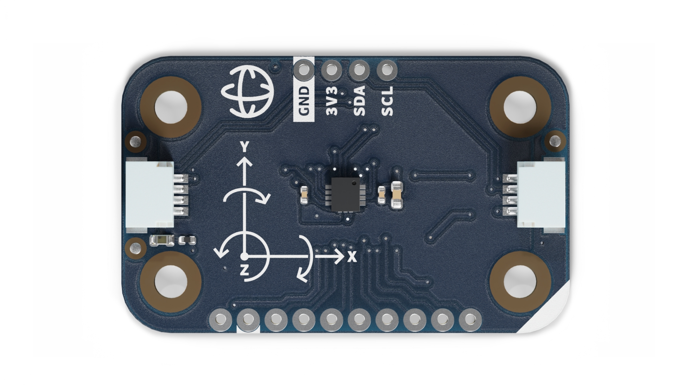
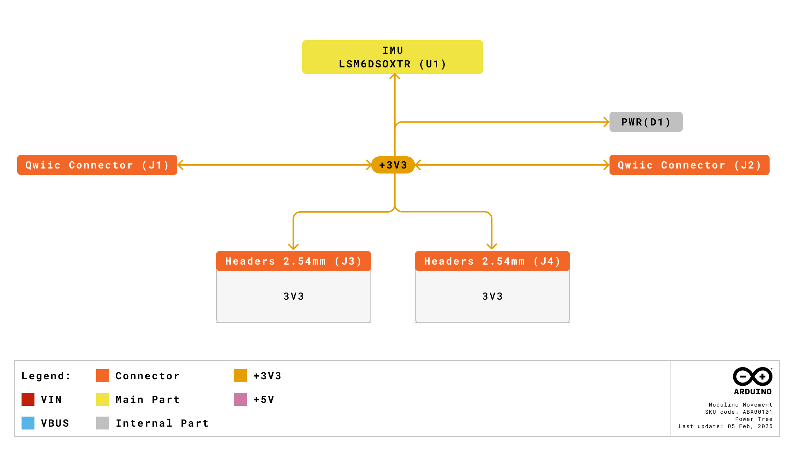
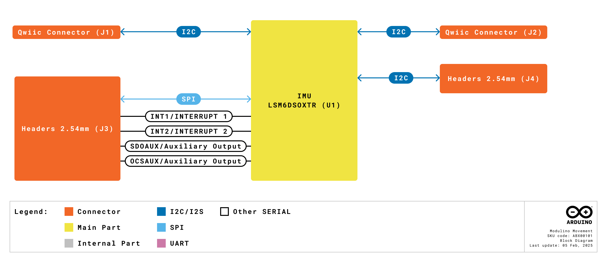
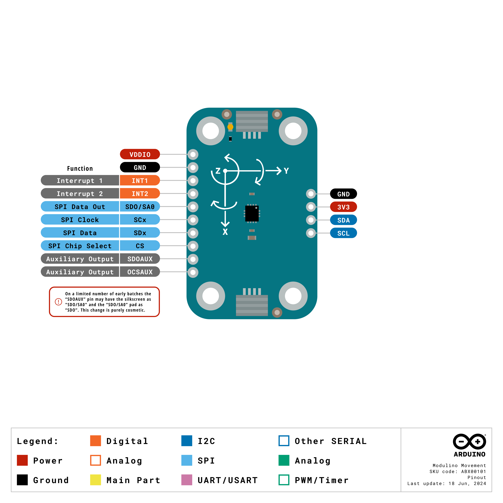
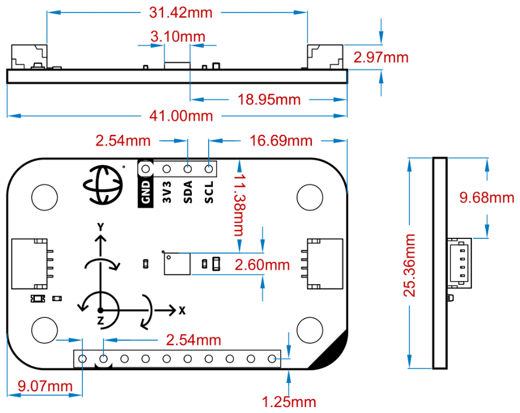

# Description

The Modulino® Movement, featuring the LSM6DSOXTR sensor, measures acceleration and rotation providing comprehensive data for motion detection applications. It’s ideal for projects involving gesture recognition, pedometers, and vibration monitoring.

# Target Areas

Maker, beginner, education

# Contents
## Application Examples

Below are some project ideas focused on the Modulino® Movement module and its built-in LSM6DSOXTR sensor:

- **Gesture Recognition:** Harness the 6-axis motion data (accelerometer + gyroscope) to detect custom gestures. You can create interactive controls for games, user interfaces, or home automation—triggering actions when certain patterns (e.g., wrist flicks or device shakes) are recognized.
  
- **Step Counter or Pedometer:** Use the accelerometer data to count steps accurately in wearable or fitness-related projects. Log daily movements or design health-oriented applications that notify users of their activity progress.
  
- **Vibration Monitoring:** Monitor vibrations in appliances, machinery, or vehicles using the sensor’s high-sensitivity accelerometer. Detect anomalies, implement predictive maintenance strategies, or create alert systems for sudden impact or shock events.
  
- **Orientation and Tilt Control:** Measure real-time orientation in space. Ideal for creating tilt-based controls in interactive art installations, DIY game controllers, or robotics projects that respond to angular displacement.

- **IMU-based Stabilization:** Leverage both gyroscope and accelerometer data for advanced applications like robotics or drones, where real-time inertial measurements are used to maintain stability and smooth motion control.

## Features

- Incorporates the LSM6DSOXTR sensor to measure acceleration and rotation.
- Communicates via I2C (Qwiic connector) or SPI (optional).
- Powered by 3.3 V from the Qwiic/I2C bus; supports 1.71 V–3.6 V sensor supply range.
- Designed with an additional 1×10 header for advanced signals and a cuttable jumper to isolate VDDIO if needed.
- Ideal for motion-detection and wearable applications (gesture recognition, pedometers, vibration monitoring).

### Contents

| **SKU**  | **Name**             | **Purpose**                            | **Quantity** |
| -------- | -------------------- | -------------------------------------- | ------------ |
| ABX00101 | Modulino® Movement   | Measure acceleration and rotation      | 1            |
|  | I2C Qwiic cable   | Compatible with the Qwiic standard        | 1            |

## Related Products

- **SKU: ASX00027** - [Arduino® Sensor Kit](https://store.arduino.cc/products/arduino-sensor-kit)
- **SKU: K000007** - [Arduino® Starter Kit](https://store.arduino.cc/products/arduino-starter-kit-multi-language)
- **SKU: AKX00026** - [Arduino® Oplà IoT Kit](https://store.arduino.cc/products/opla-iot-kit)

## Rating

### Recommended Operating Conditions

-Sensor supply range: 1.71 V – 3.6 V
-Powered at 3.3 V through the Qwiic interface (in accordance with the Qwiic standard)
-Operating temperature: –40 °C to +85 °C

**Typical current consumption:**
Accelerometer: ~170 µA
Gyroscope: ~0.55 mA

## Power Tree
The power tree for the Modulino® node can be consulted below:

## Block Diagram
This module is designed to be placed on an I2C bus, allowing the on-board LSM6DSOXTR sensor to communicate with a host microcontroller via I2C or, optionally, SPI.

## Functional Overview
The Modulino® Movement node uses the LSM6DSOXTR sensor for 3‑axis acceleration and 3‑axis gyroscopic measurements. It can detect motion, orientation. Data is accessed through I2C (via the Qwiic connector at 3.3 V) or SPI (through the additional header).

### Technical Specifications
| **Specification**       | **Details**                                                              |
| ----------------------- | ------------------------------------------------------------------------ |
| **Sensor**              | LSM6DSOXTR                                                               |
| **Supply Voltage**      | Min: 1.71 V, Max: 3.6 V                                                  |
| **Power Consumption**   | Accel: 170 µA, Gyro: 0.55 mA                                             |
| **Range (Gyro)**        | ±125 dps to ±2000 dps                                                    |
| **Accuracy**            | Accel: ±20 mg, Gyro: ±1 dps                                              |
| **Resolution**          | Accel: 0.061 mg/LSB to 0.488 mg/LSB; Gyro: 4.375 mdps/LSB to 70 mdps/LSB |
| **Communication**       | SPI, I2C, MIPI I3CSM                                                     |

### Pinout

**Qwiic / I2C (1×4 Header)**  
| **Pin** | **Function**      |
|---------|-------------------|
| GND     | Ground            |
| 3.3 V   | Power Supply (3.3 V) |
| SDA     | I2C Data          |
| SCL     | I2C Clock         |

These pads and the Qwiic connectors share the same I2C bus. You can optionally solder header pins here.

**Additional 1×10 Header (LSM6DSOXTR Signals)**  
| **Pin** | **Function**                  |
|---------|------------------------------|
| VDDIO   | Power            |
| GND     | Ground           |
| INT1    | Interrupt 1      |
| INT2    | Interrupt 2      |
| SDO/SA0 | SPI Data Out     |
| SCx     | SPI Clock        |
| SDx     | SPI Data         |
| CS      | SPI Chip Select  |
| SDOAUX  | Auxiliary Output |
| OCSAUX  | Auxiliary Output |

**Note:** By cutting its solder jumper, you can isolate **VDDIO** from 3.3 V if needed.

### Power Specifications
- **Nominal operating voltage:** 3.3 V via Qwiic
- **Sensor voltage range:** 1.71 V–3.6 V

### Mechanical Information

- Board dimensions: 41 mm × 25.36 mm
- Thickness: 1.6 mm (±0.2 mm)
- Four mounting holes (Ø 3.2 mm)
  - Hole spacing: 16 mm vertically, 32 mm horizontally

### I2C Address Reference
| **Board Silk Name** | **Sensor**    | **Modulino® I2C Address (HEX)** | **Editable Addresses (HEX)**       | **Hardware I2C Address (HEX)** |
|---------------------|--------------|--------------------------------|------------------------------------|--------------------------------|
| MODULINO MOVEMENT   | LSM6DSOXTR   | 0x6A                           | 0x6A, 0x6B (via solder jumper)     | 0x6A & 0x7E                    |

 **Note:**  
 - By default, you use **0x6A** in your code.  
 - The “Hardware I2C Address” might appear when scanning the bus.  
 - You can flip the address to **0x6B** by bridging or cutting the relevant solder jumper.  
 - A white rectangle on the bottom silk allows you to note a custom address.

## Device Operation
The Modulino® Movement node acts as an I2C target device on the Qwiic bus. Simply connect it via a Qwiic cable to the 3.3 V I2C interface of your microcontroller. If desired, SPI signals can be used instead via the additional header.

### Getting Started
Use any standard Arduino workflow—desktop IDE or Arduino Cloud Editor. Libraries are available to simplify reading the LSM6DSOXTR sensor outputs (acceleration, gyroscope). Ensure your controller and this node share the same 3.3 V reference when using the Qwiic connection.

# Certifications

## Certifications Summary

| **Certification** | **Status** |
|:-----------------:|:----------:|
|  CE/RED (Europe)  |     Yes    |
|     UKCA (UK)     |     Yes    |
|     FCC (USA)     |     Yes    |
|    IC (Canada)    |     Yes    |
|        RoHS       |     Yes    |
|       REACH       |     Yes    |
|        WEEE       |     Yes    |

## Declaration of Conformity CE DoC (EU)

We declare under our sole responsibility that the products above are in conformity with the essential requirements of the following EU Directives and therefore qualify for free movement within markets comprising the European Union (EU) and European Economic Area (EEA).

## Declaration of Conformity to EU RoHS & REACH 211 01/19/2021

Arduino boards are in compliance with RoHS 2 Directive 2011/65/EU of the European Parliament and RoHS 3 Directive 2015/863/EU of the Council of 4 June 2015 on the restriction of the use of certain hazardous substances in electrical and electronic equipment.

| Substance                              | **Maximum limit (ppm)** |
|----------------------------------------|-------------------------|
| Lead (Pb)                              | 1000                    |
| Cadmium (Cd)                           | 100                     |
| Mercury (Hg)                           | 1000                    |
| Hexavalent Chromium (Cr6+)             | 1000                    |
| Poly Brominated Biphenyls (PBB)        | 1000                    |
| Poly Brominated Diphenyl ethers (PBDE) | 1000                    |
| Bis(2-Ethylhexyl) phthalate (DEHP)     | 1000                    |
| Benzyl butyl phthalate (BBP)           | 1000                    |
| Dibutyl phthalate (DBP)                | 1000                    |
| Diisobutyl phthalate (DIBP)            | 1000                    |

Exemptions: No exemptions are claimed.

Arduino Boards are fully compliant with the related requirements of European Union Regulation (EC) 1907 /2006 concerning the Registration, Evaluation, Authorization and Restriction of Chemicals (REACH). We declare none of the SVHCs (https://echa.europa.eu/web/guest/candidate-list-table), the Candidate List of Substances of Very High Concern for authorization currently released by ECHA, is present in all products (and also package) in quantities totaling in a concentration equal or above 0.1%. To the best of our knowledge, we also declare that our products do not contain any of the substances listed on the "Authorization List" (Annex XIV of the REACH regulations) and Substances of Very High Concern (SVHC) in any significant amounts as specified by the Annex XVII of Candidate list published by ECHA (European Chemical Agency) 1907 /2006/EC.

## FCC WARNING

This device complies with part 15 of the FCC Rules.

Operation is subject to the following two conditions: 

(1) This device may not cause harmful interference, and (2) this device must accept any interference received, including interference that may cause undesired operation.

## IC Caution

This device complies with Industry Canada licence-exempt RSS standard(s). 

Operation is subject to the following two conditions: 

(1) This device may not cause interference, and (2) this device must accept any interference, including interference that may cause undesired operation of the device.

## Conflict Minerals Declaration

As a global supplier of electronic and electrical components, Arduino is aware of our obligations with regard to laws and regulations regarding Conflict Minerals, specifically the Dodd-Frank Wall Street Reform and Consumer Protection Act, Section 1502. Arduino does not directly source or process conflict minerals such as Tin, Tantalum, Tungsten, or Gold. Conflict minerals are contained in our products in the form of solder or as a component in metal alloys. As part of our reasonable due diligence, Arduino has contacted component suppliers within our supply chain to verify their continued compliance with the regulations. Based on the information received thus far we declare that our products contain Conflict Minerals sourced from conflict-free areas.

# Company Information

| Company name    | Arduino SRL                                   |
|-----------------|-----------------------------------------------|
| Company Address | Via Andrea Appiani, 25 - 20900 MONZA（Italy)  |

# Reference Documentation

| Ref                       | Link                                                                                                                                                                                           |
| ------------------------- | ---------------------------------------------------------------------------------------------------------------------------------------------------------------------------------------------- |
| Arduino IDE (Desktop)     | [https://www.arduino.cc/en/Main/Software](https://www.arduino.cc/en/Main/Software)                                                                                                             |
| Arduino Courses           | [https://www.arduino.cc/education/courses](https://www.arduino.cc/education/courses)                                                                                                           |
| Arduino Documentation     | [https://docs.arduino.cc/](https://docs.arduino.cc/)                                                                                                           |
| Arduino IDE (Cloud)       | [https://create.arduino.cc/editor](https://create.arduino.cc/editor)                                                                                                                           |
| Cloud IDE Getting Started | [https://docs.arduino.cc/cloud/web-editor/tutorials/getting-started/getting-started-web-editor](https://docs.arduino.cc/cloud/web-editor/tutorials/getting-started/getting-started-web-editor) |
| Project Hub               | [https://projecthub.arduino.cc/](https://projecthub.arduino.cc/)                                                                                                                               |
| Library Reference         | [https://github.com/arduino-libraries/](https://github.com/arduino-libraries/)                                                                                                                 |
| Online Store              | [https://store.arduino.cc/](https://store.arduino.cc/)                                                                                                                      |

# Revision History
| **Date**   | **Revision** | **Changes**                       |
| ---------- | ------------ | --------------------------------- |
| 01/07/2025 | 4            | Certification                     |
| 17/06/2025 | 3            | Nomenclature updates              |
| 23/05/2025 | 2            | Fixed pinout table and power info |
| 14/05/2025 | 1            | First release                     |

