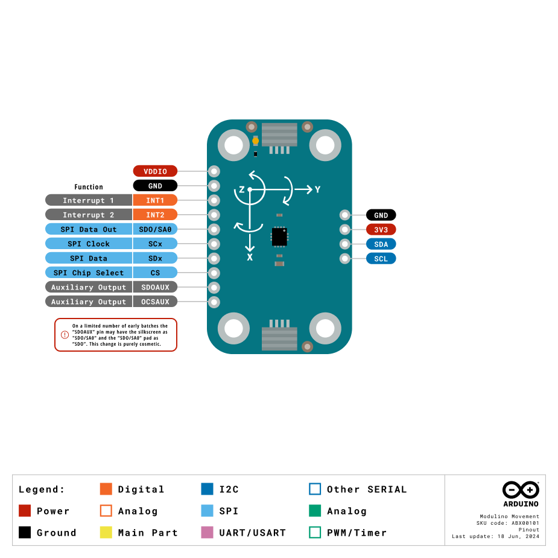
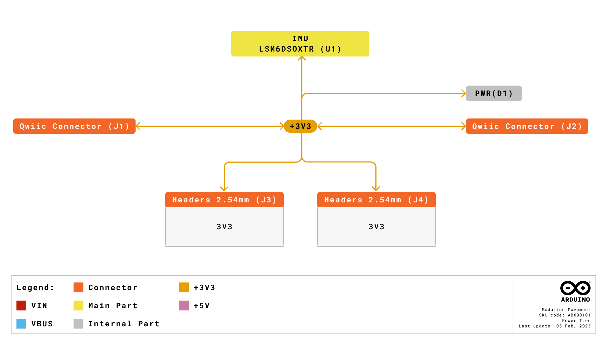
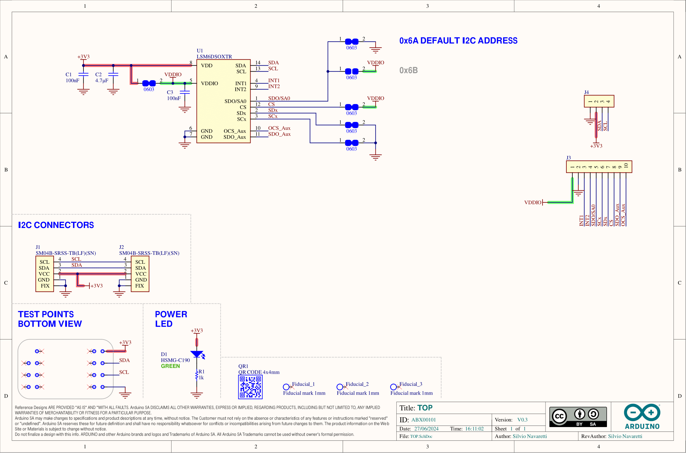
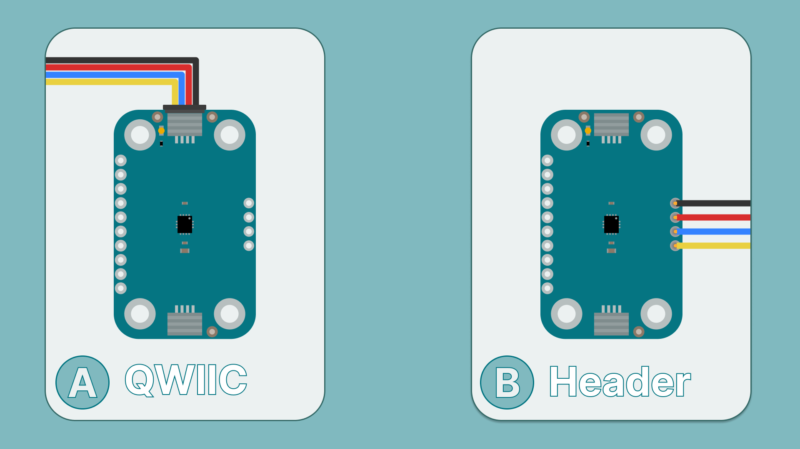
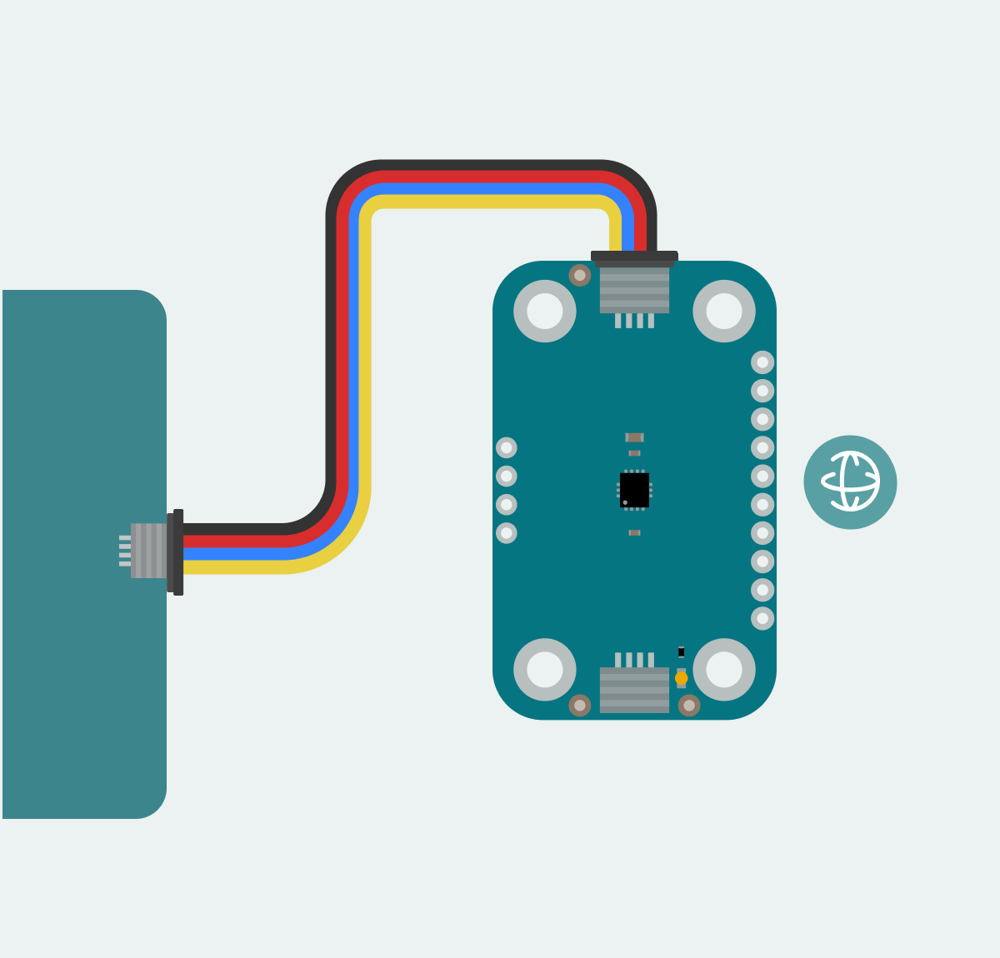
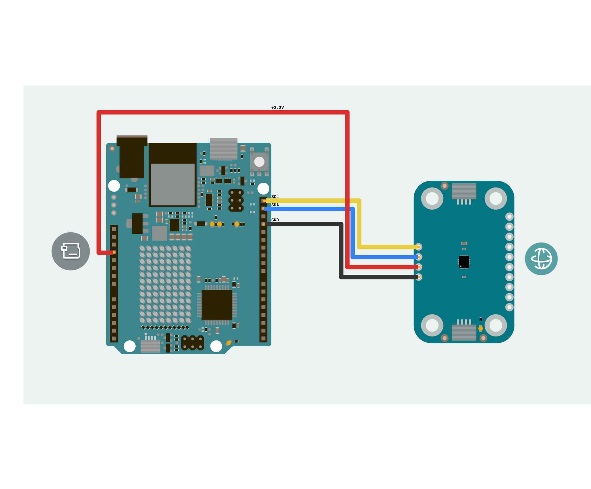
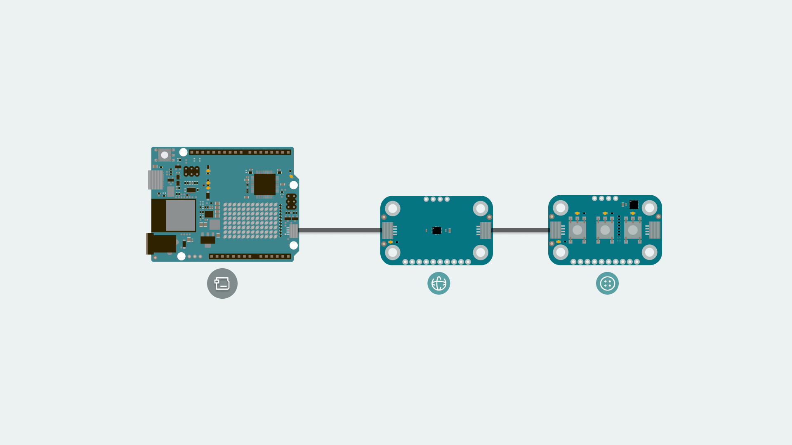
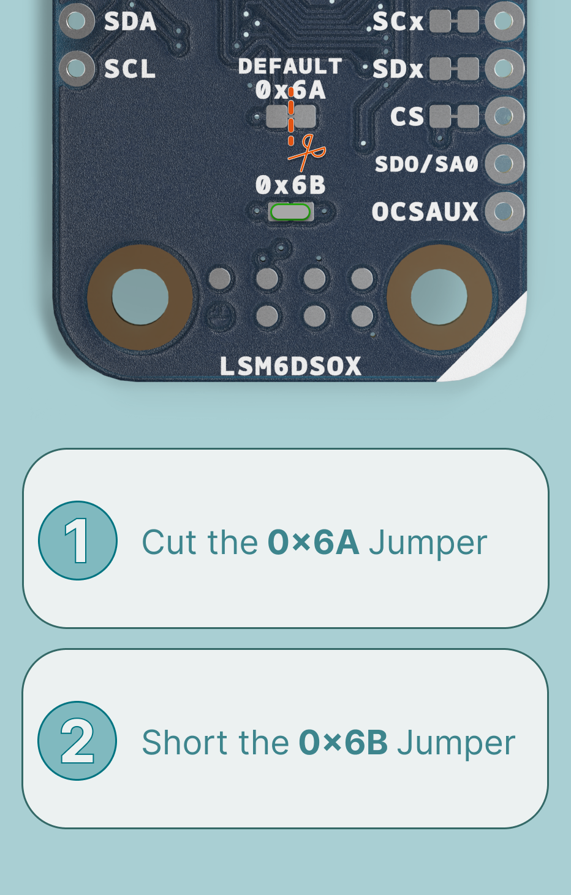
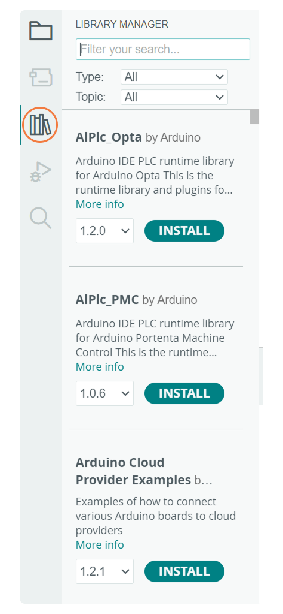
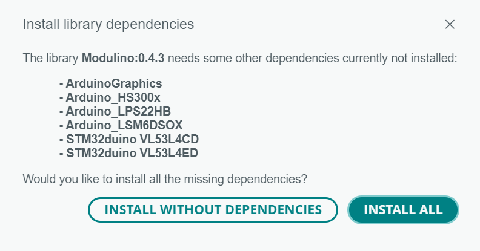

The Modulino Movement is a modular sensor that measures acceleration and angular velocity, making it perfect to add motion sensing to your projects! The Modulino form factor is shaped with two QWIIC connectors and the I²C protocol integration, allowing the connection and programming of multiple Modulino nodes in a very simple way. In addition to the QWIIC's connectors, the Modulino nodes also expose solderable pins that can be used in multiple ways and make them compatible with boards that are not QWIIC compatible.


The Modulino form factor is shaped with two QWIIC connectors and the I²C protocol integration, allowing the connection and programming of multiple modulinos in a very simple way. In addition to the QWIIC's connectors, the Modulinos also expose solderable pins that can be used in multiple ways and make them compatible with boards that are not QWIIC compatible.

## General Characteristics

The Modulino Movement is capable of measuring acceleration and angular velocity. Take a look at the following table to know more about its measuring ranges:

| Parameter                       | Condition               | Minimum | Typical | Maximum | Unit     |
|---------------------------------|-------------------------|---------|---------|---------|----------|
| **Accelerometer Range**         | Configurable Full Scale | ±2      | ±8      | ±16     | g        |
| **Gyroscope Range**             | Configurable Full Scale | ±125    | ±1000   | ±2000   | dps      |
| **Accelerometer Sensitivity**   | @ ±2g                   | 0.061   | -       | -       | mg/LSB   |
| **Gyroscope Sensitivity**       | @ ±125dps               | 4.375   | -       | -       | mdps/LSB |
| **Accelerometer Noise Density** | High-performance mode   | -       | 70      | -       | µg/√Hz   |
| **Gyroscope Noise Density**     | High-performance mode   | -       | 3.8     | -       | mdps/√Hz |
| **Temperature Sensor Range**    | -                       | -40     | -       | +85     | °C       |
| **FIFO Buffer**                 | -                       | -       | 9       | -       | KB       |
| **Sampling Rate**               | Output Data Rate        | 1.6     | -       | 6664    | Hz       |

### Sensor Details

The LSM6DSOXTR sensor from STMicroelectronics is the core component of this module. This 6-axis IMU (accelerometer and gyroscope) natively supports digital communication (I²C and SPI), meaning it connects directly to the I²C bus on the module without requiring additional conversion circuitry.
The default address for the Module is:

| Modulino I²C Address | Hardware I²C Address |
|----------------------|----------------------|
| 0x6A or 0x7E         | 0x6A or 0x7E         |

When scanning for I²C address on the bus, you might find the modulino using the **Hardware I²C Address**. However, you should always use the **Modulino I²C Address** when using the official Modulino library.
Later in this article we teach how to [change the address](#how-to-change-i2c-address).

## Pinout

The pinout for the Modulino Movement is shown below. Please note that the exposed solderable pins are directly connected to the QWIIC connectors using the same I²C interface.



Depending on the board connected to the modulino, the I²C pin names to program it may differ. Please check the [board tutorials](https://docs.arduino.cc/hardware/) on your modulino's compatible board or the [Modulino library](https://github.com/arduino-libraries/Modulino/tree/main/docs) to learn more.

### 1x10 Header

| Pin     | Function         |
|---------|------------------|
| VDDIO   | Power            |
| GND     | Ground           |
| INT1    | Interrupt 1      |
| INT2    | Interrupt 2      |
| SDO/SA0 | SPI Data Out     |
| SCx     | SPI Clock        |
| SDx     | SPI Data         |
| CS      | SPI Chip Select  |
| SDOAUX  | Auxiliary Output |
| OCSAUX  | Auxiliary Output |

- **VDDIO: Power** – I/O voltage supply pin for the sensor.
- **GND: Ground** – Ground connection for power and signal reference.
- **INT1: Interrupt 1** – Programmable interrupt output pin.
- **INT2: Interrupt 2** – Programmable interrupt output pin.
- **SDO/SA0: SPI Data Out** – SPI data output pin, also used as I2C address selection.
- **SCx: SPI Clock** – Clock signal for SPI communication.
- **SDx: SPI Data** – SPI data input pin.
- **CS: SPI Chip Select** – Chip select pin for SPI communication.
- **SDOAUX: Auxiliary Output** – Auxiliary data output pin.
- **OCSAUX: Auxiliary Output** – Auxiliary output control signal pin.

### 1x4 Header (I2C)

| Pin   | Function     |
|-------|--------------|
| GND   | Ground       |
| 3.3 V | Power Supply |
| SDA   | I2C Data     |
| SCL   | I2C Clock    |

## Power Specifications

The board is typically powered by +3.3 VDC when using the QWIIC interface as per the I²C standard.

| Parameter                                     | Condition           | Minimum | Typical     | Maximum | Unit |
|-----------------------------------------------|---------------------|---------|-------------|---------|------|
| Supply Voltage                                | -                   | 1.71    | 3.3 (QWIIC) | 3.6     | V    |
| I/O Voltage                                   | -                   | 1.62    | -           | 3.6     | V    |
| Gyro + Accel Current (High Performance Mode)  | Both sensors active | -       | 0.55        | -       | mA   |
| Accelerometer Current (High Performance Mode) | -                   | -       | 170         | -       | µA   |
| Accelerometer Current (Low Power Mode)        | ODR = 50 Hz         | -       | 26          | -       | µA   |
| Accelerometer Current (Ultra-Low Power Mode)  | ODR = 50 Hz         | -       | 9.5         | -       | µA   |

The module additionally includes a power LED that draws 1 mA and turns on as soon as it is powered. J1 (Qwiic connector), J2 (Qwiic connector), and the headers all share the same power branch. The power distribution of the module is therefore as follows:



## Schematic

The Modulino Movement uses a simple circuit, as shown in the schematic below:



The main component is the **LSM6DSOXTR** sensor (U1), which handles both acceleration and gyroscope measurements, as well as I²C communication.

You can connect to the I²C pins (SDA and SCL) using either the **QWIIC connectors** (J1 and J2, this is the recommended method) or the **solderable pins** (J4). The board runs on **3.3V**, which comes from the QWIIC cable or the **3V3 pin** on J4.

There's also a small power indicator LED that lights up when the board is on.

Some options for customizing the module's features via onboard solder jumpers are available:

### **VDDIO Independence:**  

- By default, **VDDIO is connected to +3V3**.  
- To make **VDDIO independent**, cut the corresponding solder jumper.

### SPI Mode Selection: 

- The LSM6DSOXTR supports both **3-wire and 4-wire SPI**.  
- You can configure SPI communication and connect additional sensors by cutting or soldering the appropriate jumpers. Please take a look at the IMU's datasheet for more information.

You can grab the full schematic and PCB files from the [Modulino Movement](https://docs.arduino.cc/hardware/modulinos/modulino-movement) product page.

## How To Connect Your Modulino

The easiest and most reliable way to connect your Modulino is through the QWIIC Connect System. It's plug-and-play, uses standard I²C, and makes it easy to join multiple modules. If your board supports QWIIC, this is the recommended way to go. Note that the dedicated I²C pins will differ from board to board meaning it is always a good idea to check your specific model.

If your board doesn't have a QWIIC connector, you can still access the same I²C bus and power the module using the solderable header pads just make sure you wire it to 3.3V and match the I²C pinout.



### QWIIC Connector

Whenever available, the **QWIIC Connect System** is the preferred method. Connecting to the Modulino is extremely simple, just use a standard QWIIC cable to connect your board to either of the QWIIC connectors on the Modulino. Because the cable and connectors are polarized, there is no need to worry about accidentally swapping connections.

QWIIC is a plug-and-play I²C Connect System that uses standardized 4-pin connectors:

- GND
- 3.3V
- SDA (Data)
- SCL (Clock)



The Modulino features two QWIIC connectors, which are internally connected in parallel. This means you can daisy-chain multiple modules easily by connecting additional QWIIC cables between them.

When connecting multiple I²C devices, address conflicts may occur if two or more devices share the same default I²C address. The Modulino addresses this potential issue by allowing you to select a different address through a simple hardware modification. We cover this process in detail in the [**Changing I²C Address**](#changing-i2c-address) section, enabling you to integrate multiple identical modules or different devices that share the same default address in your project.

### Solderable Header

When QWIIC is not available, you can use the exposed solderable pins on the module. You can solder pins to the unpopulated pads; just remember the pinout provided in this guide to connect to the right pins of your board.



## Daisy-Chaining Multiple Modulino Nodes

Regardless of whether you connect the first Modulino via QWIIC or through the solderable pins, you can still take advantage of the extra QWIIC connector to daisy-chain additional modules. Each Modulino includes two QWIIC connectors wired in parallel, allowing you to connect one module to the next in a chain. As long as each module is configured with a unique I²C address, they can all communicate on the same bus as long as you select the correct I²C pins depending on your board. This approach keeps your setup clean, modular, and expandable without adding extra wiring complexity.



***The number of modules you can connect will depend on what modules you are chaining together, as this system allows for multiple sensors from different manufacturers to be added. Also, the cables you use for these connections will play a significant role in the setup's performance. Ensure your cables are correctly connected and capable of handling the required data transfer.
Each module should have a unique address on a chain if you plan to address them individually. Later in this article we teach how to [change the address](#how-to-change-i2c-address). Multiple modules with the same address will cause conflicts on the I²C bus and will not allow you to address them individually.***

### Changing I2C Address

The Modulino Movement can be configured to use an alternative I2C address (0x6B) instead of the default address (0x6A). To change the address, follow these steps carefully:

1. Disconnect all power from the module
2. Locate the address selection solder jumpers on the back of the board
3. Cut the trace on the jumper marked **Default** (0x6A)
4. Solder closed the jumper marked **0x6B**

After completing these modifications, your module will use the new address (0x6B) when powered on again.

**IMPORTANT**: Ensure the module remains unpowered during this entire process. Never have both jumpers closed simultaneously when power is applied, as this will create a short circuit between power and ground that could damage your module.



When using a custom address in your sketch, you'll need to specify this address when creating the module object. For example:
```arduino
ModulinoMovement movement(0x7E);
```


## How To Use Your Modulino

### Installing The Modulino Library

You need the official Modulino library available [here](https://docs.arduino.cc/libraries/modulino/) to use the Modulino Movement. With the Arduino IDE you get some tools that make adding a library easier. To learn how to install the IDE please visit our [page](https://www.support.arduino.cc/hc/en-us/articles/360019833020-Download-and-install-Arduino-IDE).

After opening the IDE, a tab should be visible on the left. Press the book icon for "library" as highlighted in the image.



You can now look for the library ```Modulino``` by filling in the ```Filter your search``` textbox.

A prompt might appear saying that additional dependencies are required. This is not a problem, as they will be automatically added when you confirm the prompt.



The process should look like this:


A message will appear after the installation is successful.

### Getting Acceleration Data

Getting data from the sensor is fairly simple using the ```Modulino``` library. For the **Modulino Movement** there are four important functions:

- ```update()```: Updates the sensor readings.
- ```getX()```: Retrieves the acceleration value on the **X-axis** in **g**.
- ```getY()```: Retrieves the acceleration value on the **Y-axis** in **g**.
- ```getZ()```: Retrieves the acceleration value on the **Z-axis** in **g**.
- ```getRoll()```: Retrieves the angular rotation around the X-axis in **dps**.
- ```getPitch()```: Retrieves the angular rotation around the Y-axis in **dps**.
- ```getYaw()```: Retrieves the angular rotation around the Z-axis in **dps**.
- ```Modulino.begin();```: By default the Modulino library uses ```Wire1``` if your connection is in a different Wire you will have to edit it, check [here](https://docs.arduino.cc/language-reference/en/functions/communication/wire/) (by default the Modulino library uses ```Wire1``` if your board model has a different pinout for the dedicated I²C pins you might have to edit it. More information on **Wire** can be found [here](https://docs.arduino.cc/language-reference/en/functions/communication/wire/)) for the library's hardware compatibility. More information on **Wire** can be found [here](https://docs.arduino.cc/language-reference/en/functions/communication/wire/).

Here is an example sketch of how to implement these functions to acquire data and show it using the serial monitor:

```arduino
#include "Modulino.h"

// Create a ModulinoMovement
ModulinoMovement movement;


float x, y, z;
float roll, pitch, yaw;


void setup() {
  Serial.begin(9600);
  // Initialize Modulino I2C communication
  Modulino.begin();
  // Detect and connect to movement sensor module
  movement.begin();
}

void loop() {
  // Read new movement data from the sensor
  movement.update();

  // Get acceleration and gyroscope values
  x = movement.getX();
  y = movement.getY();
  z = movement.getZ();
  roll = movement.getRoll();
  pitch = movement.getPitch();
  yaw = movement.getYaw();

  // Print acceleration values
  Serial.print("A: ");
  Serial.print(x, 3);
  Serial.print(", ");
  Serial.print(y, 3);
  Serial.print(", ");
  Serial.print(z, 3);
  
  // Print divider between acceleration and gyroscope
  Serial.print(" | G: ");
  
  // Print gyroscope values
  Serial.print(roll, 1);
  Serial.print(", ");
  Serial.print(pitch, 1);
  Serial.print(", ");
  Serial.println(yaw, 1);
  
  delay(200);
}
```

The code example provided shows how to initialize the sensor, read the acceleration data, and display it on the serial monitor. The data is continuously updated, showing the current acceleration values in real time.

It can be easily adapted to trigger actions at certain movement thresholds or to detect specific motion patterns in your projects.

## Troubleshooting

### Sensor Not Reachable

If your Modulino's power LED isn't on or the sensor isn't responsive, first check that the board is properly connected:

- Ensure both the board and the Modulino are connected to your computer, and that the power LEDs on both are lit.
- If the issue persists, make sure the Qwiic cable is properly clicked into place.

### Library Not Installed Properly

If you encounter an issue with the `#include "modulino.h"` command, verify that the Modulino library is correctly installed:

- Check your IDE to ensure the library is installed and up-to-date.
- Re-install the library through the Library Manager.

### Inaccurate Values

If the sensor values are not accurate, make sure:

- The sensor is not placed on an unstable surface that might cause unwanted vibrations.
- All exposed electronics are not touching any conductive surfaces, as this could interfere with readings.
- The board is mounted securely when measuring precise movements.

## Conclusion

The **Modulino Movement** is a digital 6-axis IMU sensor that communicates over I²C and follows the Modulino form factor. It includes standard Qwiic connectors for quick, solderless connections and easy daisy-chaining with other modules. Paired with the Modulino library, it makes accessing motion data straightforward, allowing you to focus on experimenting or building your system logic. It's a small, reliable module suited for both quick tests and longer-term setups.

## What Is Next?

Now that you've learned how to use your Modulino Movement, you're all set to integrate it into your projects!

- Use the movement data to detect different patterns and use these as inputs for your projects.
- Create a motion-activated alarm that triggers when unexpected movement is detected.
- Build a balance game that challenges players to keep the sensor level within certain parameters.
- Make a pedometer that counts steps based on the characteristic motion patterns of walking.