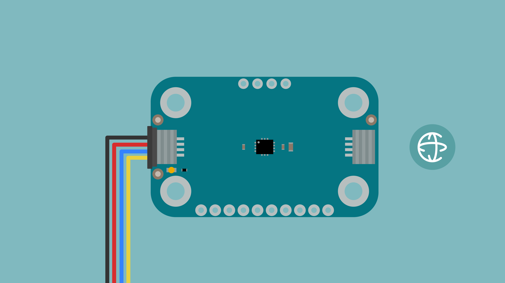
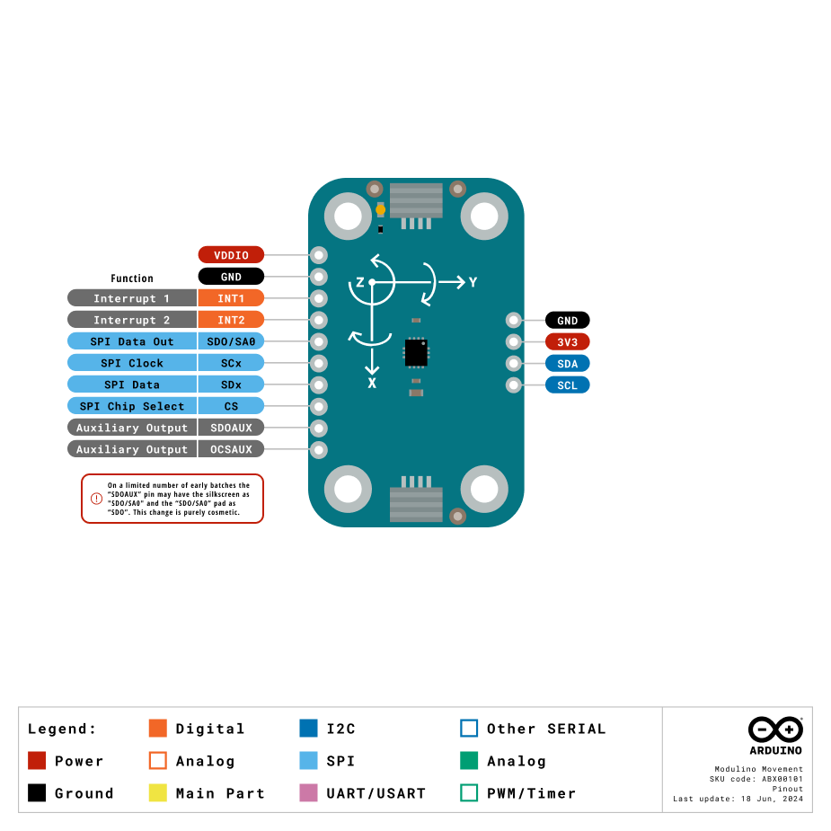

The Modulino Movement is a modular sensor that measures acceleration and angular velocity, making it perfect to add motion sensing to your projects! It provides 6-axis motion detection through its integrated accelerometer and gyroscope.

## Hardware Overview

### General Characteristics

The Modulino Movement is capable of measuring acceleration and angular velocity with the following specifications:

| Parameter                       | Condition               | Minimum | Typical | Maximum | Unit     |
|---------------------------------|-------------------------|---------|---------|---------|----------|
| **Accelerometer Range**         | Configurable Full Scale | ±2      | ±8      | ±16     | g        |
| **Gyroscope Range**             | Configurable Full Scale | ±125    | ±1000   | ±2000   | dps      |
| **Accelerometer Sensitivity**   | @ ±2g                   | 0.061   | -       | -       | mg/LSB   |
| **Gyroscope Sensitivity**       | @ ±125dps               | 4.375   | -       | -       | mdps/LSB |
| **Accelerometer Noise Density** | High-performance mode   | -       | 70      | -       | µg/√Hz   |
| **Gyroscope Noise Density**     | High-performance mode   | -       | 3.8     | -       | mdps/√Hz |
| **Temperature Sensor Range**    | -                       | -40     | -       | +85     | °C       |
| **FIFO Buffer**                 | -                       | -       | 9       | -       | KB       |
| **Sampling Rate**               | Output Data Rate        | 1.6     | -       | 6664    | Hz       |

### Sensor Details

The LSM6DSOXTR sensor from STMicroelectronics is the core component of this module. This 6-axis IMU (accelerometer and gyroscope) natively supports digital communication (I²C and SPI), meaning it connects directly to the I²C bus on the module without requiring additional conversion circuitry.

The default address for the Module is:

| Modulino I²C Address | Hardware I²C Address |
|----------------------|----------------------|
| 0x6A or 0x7E         | 0x6A or 0x7E         |

The address can be changed through hardware modification (see the generic guide for details).


1. Disconnect all power from the module
2. Locate the address selection solder jumpers on the back of the board
3. Cut the trace on the jumper marked **Default** (0x6A)
4. Solder closed the jumper marked **0x6B**

**IMPORTANT**: Never have both jumpers closed simultaneously when power is applied, as this will create a short circuit that could damage your module.

### Pinout



#### 1x10 Header

| Pin     | Function         |
|---------|------------------|
| VDDIO   | Power            |
| GND     | Ground           |
| INT1    | Interrupt 1      |
| INT2    | Interrupt 2      |
| SDO/SA0 | SPI Data Out     |
| SCx     | SPI Clock        |
| SDx     | SPI Data         |
| CS      | SPI Chip Select  |
| SDOAUX  | Auxiliary Output |
| OCSAUX  | Auxiliary Output |

#### 1x4 Header (I2C)

| Pin   | Function     |
|-------|--------------|
| GND   | Ground       |
| 3.3 V | Power Supply |
| SDA   | I²C Data     |
| SCL   | I²C Clock    |

### Power Specifications

| Parameter                                     | Condition           | Minimum | Typical     | Maximum | Unit |
|-----------------------------------------------|---------------------|---------|-------------|---------|------|
| Supply Voltage                                | -                   | 1.71    | 3.3 (QWIIC) | 3.6     | V    |
| I/O Voltage                                   | -                   | 1.62    | -           | 3.6     | V    |
| Gyro + Accel Current (High Performance Mode)  | Both sensors active | -       | 0.55        | -       | mA   |
| Accelerometer Current (High Performance Mode) | -                   | -       | 170         | -       | µA   |
| Accelerometer Current (Low Power Mode)        | ODR = 50 Hz         | -       | 26          | -       | µA   |
| Accelerometer Current (Ultra-Low Power Mode)  | ODR = 50 Hz         | -       | 9.5         | -       | µA   |

## Programming with Arduino

### Prerequisites

- Install the Modulino library via the Arduino IDE Library Manager
- Connect your Modulino Knob via QWIIC or solderable headers

For detailed instructions on setting up your Arduino environment and installing libraries, please refer to the [Getting Started with Modulinos guide](./how-general).

Library repository available [here](https://github.com/arduino-libraries/Arduino_Modulino).

### Basic Example

```arduino
#include "Modulino.h"

// Create a ModulinoMovement
ModulinoMovement movement;

float x, y, z;
float roll, pitch, yaw;

void setup() {
  Serial.begin(9600);
  // Initialize Modulino I2C communication
  Modulino.begin();
  // Detect and connect to movement sensor module
  movement.begin();
}

void loop() {
  // Read new movement data from the sensor
  movement.update();

  // Get acceleration and gyroscope values
  x = movement.getX();
  y = movement.getY();
  z = movement.getZ();
  roll = movement.getRoll();
  pitch = movement.getPitch();
  yaw = movement.getYaw();

  // Print acceleration values
  Serial.print("A: ");
  Serial.print(x, 3);
  Serial.print(", ");
  Serial.print(y, 3);
  Serial.print(", ");
  Serial.print(z, 3);
  
  // Print divider between acceleration and gyroscope
  Serial.print(" | G: ");
  
  // Print gyroscope values
  Serial.print(roll, 1);
  Serial.print(", ");
  Serial.print(pitch, 1);
  Serial.print(", ");
  Serial.println(yaw, 1);
  
  delay(200);
}
```

### Key Functions

- `update()`: Updates the sensor readings
- `getX()`, `getY()`, `getZ()`: Retrieve acceleration values in g
- `getRoll()`, `getPitch()`, `getYaw()`: Retrieve angular rotation in dps

### Advanced Example - Motion Detection System

```arduino
#include "Modulino.h"

ModulinoMovement movement;

// Motion detection thresholds
const float MOTION_THRESHOLD = 0.15;  // g units for acceleration
const float ROTATION_THRESHOLD = 20.0;  // degrees per second

// Calibration variables
float baseX = 0, baseY = 0, baseZ = 1.0;  // Expect 1g on Z when flat
float baseRoll = 0, basePitch = 0, baseYaw = 0;
bool isCalibrated = false;

// Motion state tracking
bool inMotion = false;
unsigned long motionStartTime = 0;
unsigned long stillStartTime = 0;
const unsigned long STILL_TIMEOUT = 2000;  // 2 seconds to detect stillness

void setup() {
  Serial.begin(9600);
  Modulino.begin();
  movement.begin();
  
  Serial.println("Motion Detection System");
  Serial.println("======================");
  Serial.println("Keep device still for calibration...");
  
  delay(2000);
  calibrateSensor();
}

void calibrateSensor() {
  const int samples = 50;
  float sumX = 0, sumY = 0, sumZ = 0;
  float sumRoll = 0, sumPitch = 0, sumYaw = 0;
  
  for (int i = 0; i < samples; i++) {
    movement.update();
    sumX += movement.getX();
    sumY += movement.getY();
    sumZ += movement.getZ();
    sumRoll += movement.getRoll();
    sumPitch += movement.getPitch();
    sumYaw += movement.getYaw();
    delay(20);
  }
  
  baseX = sumX / samples;
  baseY = sumY / samples;
  baseZ = sumZ / samples;
  baseRoll = sumRoll / samples;
  basePitch = sumPitch / samples;
  baseYaw = sumYaw / samples;
  
  isCalibrated = true;
  Serial.println("✓ Calibration complete!");
  Serial.println();
}

void detectMotion() {
  movement.update();
  
  // Calculate deltas from baseline
  float deltaX = abs(movement.getX() - baseX);
  float deltaY = abs(movement.getY() - baseY);
  float deltaZ = abs(movement.getZ() - baseZ);
  float deltaRoll = abs(movement.getRoll() - baseRoll);
  float deltaPitch = abs(movement.getPitch() - basePitch);
  float deltaYaw = abs(movement.getYaw() - baseYaw);
  
  // Check if any threshold is exceeded
  bool motionDetected = (deltaX > MOTION_THRESHOLD || 
                         deltaY > MOTION_THRESHOLD || 
                         deltaZ > MOTION_THRESHOLD ||
                         deltaRoll > ROTATION_THRESHOLD ||
                         deltaPitch > ROTATION_THRESHOLD ||
                         deltaYaw > ROTATION_THRESHOLD);
  
  // State machine for motion detection
  if (motionDetected && !inMotion) {
    // Motion just started
    inMotion = true;
    motionStartTime = millis();
    Serial.println("🏃 MOTION DETECTED!");
    
    // Identify type of motion
    if (deltaRoll > ROTATION_THRESHOLD || deltaPitch > ROTATION_THRESHOLD) {
      Serial.println("   Type: Rotation");
    }
    if (deltaX > MOTION_THRESHOLD || deltaY > MOTION_THRESHOLD) {
      Serial.println("   Type: Linear movement");
    }
    if (deltaZ > MOTION_THRESHOLD * 2) {
      Serial.println("   Type: Vertical movement");
    }
  }
  else if (!motionDetected && inMotion) {
    // Motion might have stopped
    if (stillStartTime == 0) {
      stillStartTime = millis();
    }
    else if (millis() - stillStartTime > STILL_TIMEOUT) {
      // Device has been still for timeout period
      inMotion = false;
      unsigned long duration = (millis() - motionStartTime) / 1000;
      Serial.print("✋ Motion stopped. Duration: ");
      Serial.print(duration);
      Serial.println(" seconds");
      stillStartTime = 0;
    }
  }
  else if (motionDetected && inMotion) {
    // Still in motion, reset still timer
    stillStartTime = 0;
  }
}

void loop() {
  if (isCalibrated) {
    detectMotion();
    delay(50);
  }
}
```

## Programming with MicroPython

The Modulino Movement is fully compatible with MicroPython through the official Modulino MicroPython library. The following examples demonstrate how to read motion data from the 6-axis IMU and implement motion detection features in your MicroPython projects.

### Prerequisites

- Install the Modulino MicroPython library
- Ensure Arduino Lab for MicroPython is installed

For detailed instructions on setting up your MicroPython environment and installing packages, please refer to the [Getting Started with Modulinos guide](./how-general).

### Basic Example

```python
from modulino import ModulinoMovement
from time import sleep_ms

movement = ModulinoMovement()

while True:
    acc = movement.accelerometer
    gyro = movement.gyro
    
    print(f"🏃 Accelerometer: x:{acc.x:>8.3f} y:{acc.y:>8.3f} z:{acc.z:>8.3f} g")
    print(f"🌀 Gyroscope:     x:{gyro.x:>8.3f} y:{gyro.y:>8.3f} z:{gyro.z:>8.3f} dps")
    print("")
    sleep_ms(100)
```

### Key Properties

- `.accelerometer`: Returns acceleration values (x, y, z) in g
- `.gyro`: Returns angular velocity (x, y, z) in dps

### Advanced Example - Step Counter

```python
from modulino import ModulinoMovement
from time import sleep_ms, ticks_ms
import math

movement = ModulinoMovement()

# Step detection parameters
STEP_THRESHOLD = 1.2  # Magnitude threshold for step detection
MIN_STEP_INTERVAL = 300  # Minimum time between steps (ms)
MAX_STEP_INTERVAL = 2000  # Maximum time between steps (ms)

# State tracking
step_count = 0
last_step_time = 0
last_magnitude = 0
peak_detected = False

# Calibration
calibration_samples = []
baseline_magnitude = 1.0

def calculate_magnitude(x, y, z):
    """Calculate the magnitude of acceleration vector"""
    return math.sqrt(x*x + y*y + z*z)

def calibrate():
    """Calibrate the baseline acceleration magnitude"""
    global baseline_magnitude
    
    print("Calibrating... Keep device still")
    samples = []
    
    for _ in range(50):
        acc = movement.accelerometer
        mag = calculate_magnitude(acc.x, acc.y, acc.z)
        samples.append(mag)
        sleep_ms(20)
    
    baseline_magnitude = sum(samples) / len(samples)
    print(f"Calibration complete. Baseline: {baseline_magnitude:.3f}g")

def detect_step():
    """Detect steps based on acceleration patterns"""
    global step_count, last_step_time, last_magnitude, peak_detected
    
    current_time = ticks_ms()
    acc = movement.accelerometer
    
    # Calculate acceleration magnitude
    magnitude = calculate_magnitude(acc.x, acc.y, acc.z)
    
    # Detect peaks in acceleration
    if magnitude > STEP_THRESHOLD and magnitude > last_magnitude and not peak_detected:
        # Check if enough time has passed since last step
        time_since_last = current_time - last_step_time
        
        if time_since_last > MIN_STEP_INTERVAL:
            if time_since_last < MAX_STEP_INTERVAL or step_count == 0:
                step_count += 1
                last_step_time = current_time
                peak_detected = True
                
                # Calculate step rate
                if step_count > 1:
                    step_rate = 60000 / time_since_last  # steps per minute
                    print(f"👣 Step {step_count} detected! Rate: {step_rate:.0f} spm")
                else:
                    print(f"👣 Step {step_count} detected!")
    
    # Reset peak detection when magnitude drops
    if magnitude < last_magnitude:
        peak_detected = False
    
    last_magnitude = magnitude

def calculate_distance(steps, stride_length=0.7):
    """Estimate distance traveled based on steps"""
    return steps * stride_length

def calculate_calories(steps, weight_kg=70):
    """Estimate calories burned based on steps"""
    # Rough estimate: 0.04 calories per step per kg of body weight
    return steps * 0.04 * weight_kg / 70

# Main program
print("🚶 Step Counter Application")
print("=" * 30)

calibrate()
print("\nStart walking!")
print("Press Ctrl+C to see statistics\n")

try:
    while True:
        detect_step()
        sleep_ms(50)
        
except KeyboardInterrupt:
    # Display statistics
    distance = calculate_distance(step_count)
    calories = calculate_calories(step_count)
    
    print("\n" + "=" * 30)
    print("📊 Walking Statistics:")
    print(f"  Total Steps: {step_count}")
    print(f"  Distance: {distance:.2f} meters")
    print(f"  Calories: {calories:.1f} kcal")
    print("=" * 30)
```

## Troubleshooting

### Sensor Not Reachable

If your Modulino's power LED isn't on or the sensor isn't responsive:
- Ensure both the board and the Modulino are connected properly
- Verify that the power LEDs on both are lit
- Check that the QWIIC cable is properly clicked into place

### Inaccurate Values

If the sensor values are not accurate:
- Ensure the sensor is not on an unstable surface causing unwanted vibrations
- Verify exposed electronics are not touching conductive surfaces
- Mount the board securely when measuring precise movements
- Consider calibrating the sensor before use

## Project Ideas

- **Motion-Activated Alarm**: Trigger alerts when unexpected movement is detected
- **Balance Game**: Challenge players to keep the sensor level
- **Pedometer**: Count steps based on characteristic motion patterns
- **Gesture Recognition**: Detect specific motion patterns for control
- **Tilt Controller**: Use tilt angles to control games or robots
- **Vibration Monitor**: Detect and log vibrations in machinery
- **Fall Detection**: Identify sudden acceleration changes indicating falls
- **Orientation Tracker**: Monitor device orientation in 3D space