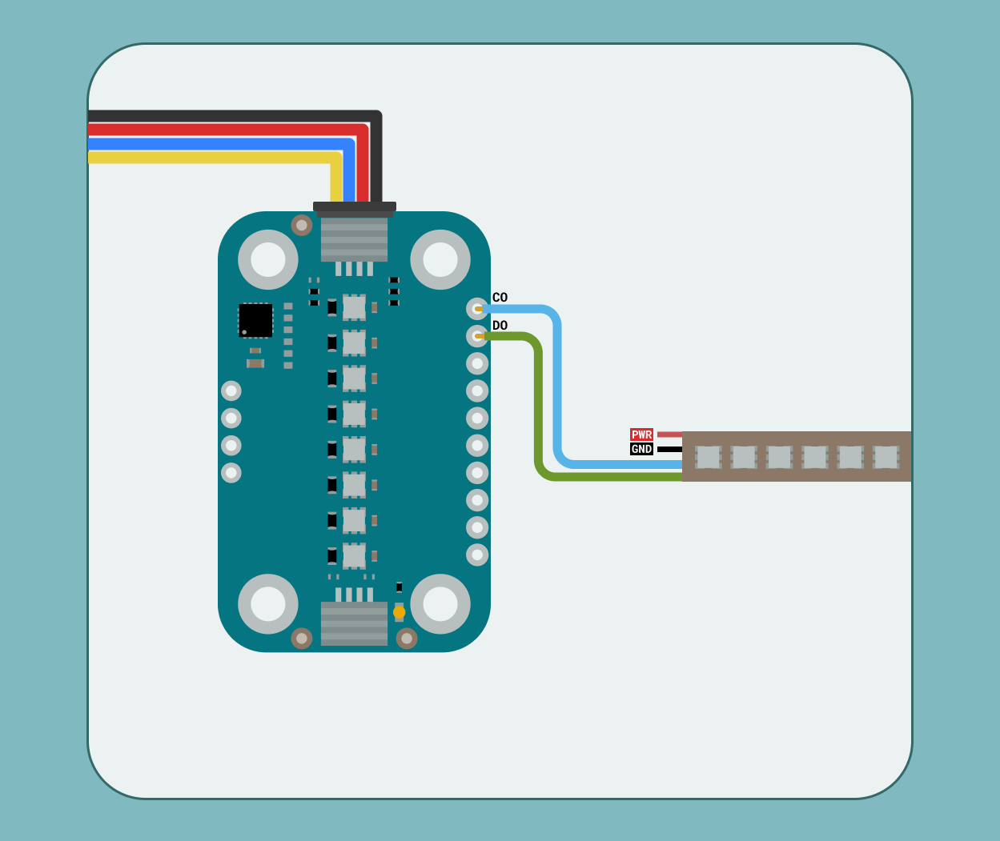

The Modulino Pixels is a modular sensor that generates RGB light effects, making it perfect to add colorful visual feedback to your projects! 
The Modulino form factor is shaped with two QWIIC connectors and the I²C protocol integration, allowing the connection and programming of multiple modulinos in a very simple way. In addition to the QWIIC's connectors, the Modulinos also expose solderable pins that can be used in multiple ways and make them compatible with boards that are not QWIIC compatible.

## Hardware Specifications

The Modulino Pixels based on 8 LC8822-2020 addressable LEDs is capable of generating colorful light patterns and effects. Take a look at the following table to know more about its characteristics:

| Parameter        | Condition         | Minimum | Typical | Maximum | Unit |
|------------------|-------------------|---------|---------|---------|------|
| Supply Voltage   | -                 | 2.0     | 3.3     | 3.6     | V    |
| Resolution (ADC) | Default           | -       | 12-bit  | -       | mcd  |
| Communication    | I²C,USART,SPI | -       | I²C     | -       | -    |

## Pinout

The LC8822-2020 addressable LEDs are the core components of this module. These RGB light output devices are controlled by an onboard STM32C011F4U6TR microcontroller, which supports digital communication (I²C), meaning it connects directly to the I²C bus on the module without requiring additional conversion circuitry.


### 1x10 Header (LC8822-2020 and Microcontroller Signals)

| Pin    | Function        |
|--------|-----------------|
| GND    | Ground          |
| GND    | Ground          |
| 3V3    | 3.3V Power      |
| RESET  | Reset           |
| SWCLK  | SWD Clock       |
| SWDIO  | SWD Data        |
| TX1    | USART Transmit  |
| RX1    | USART Receive   |
| D0     | Pixels Data Out |
| C0     | Pixels Clock Out|

- **GND: Ground**: Provides ground reference for the circuit. Multiple ground pins ensure stable power distribution.
- **3V3: 3.3V Power**: Supplies 3.3V power to connected components and modules.
- **RESET: Reset**: Used to reset the microcontroller or connected system.
- **SWCLK and SWDIO: SWD Interface**: Used for debugging, programming, and reprogramming the microcontroller via Serial Wire Debug protocol.
- **TX1 and RX1: USART Communication**: Enable serial communication for data transmission and reception with other devices or modules.
- **D0: Pixels Data Out**: Sends pixel data to addressable LED strips in a daisy chain configuration for lighting control.
- **C0: Pixels Clock Out**: Provides clock signal synchronization for addressable LED strips, ensuring proper timing for pixel data.

### 1x4 Header (I2C)
The pinout for the Modulino Pixels is shown below. While the recommended connection method is via the QWIIC connectors, this solderable header provides a connection option when using the modulino with a non-QWIIC compatible board.

| Pin   | Function     |
|-------|--------------|
| GND   | Ground       |
| 3.3 V | Power Supply |
| SDA   | I²C Data     |
| SCL   | I²C Clock    |

## I2C Address

The **Modulino Pixels** module uses **LC8822-2020** addressable LEDs, which do not have native I²C capabilities. Instead, the LED array is controlled by the Modulino's onboard microcontroller (STM32C011F4U6TR). This microcontroller provides I²C communication, allowing for flexible control of the LEDs.
One unique feature of this setup is the ability to change the I²C address via software. This means the address can be modified based on your application needs, making it adaptable to different system configurations. The default I²C address for the **Modulino Pixels** module is:

| Modulino I²C Address | Hardware I²C Address | Editable Addresses (HEX)          |
|----------------------|----------------------|-----------------------------------|
| 0x6C                 | 0x36                 | Any custom address (via software) |

When scanning for I²C address on the bus, you might find the modulino using the **Hardware I²C Address**. However, you should always use the **Modulino I²C Address** when using the official Modulino library.
Later in this article we teach how to [change the address](#how-to-change-i2c-address).

## Power Specifications

The board is typically powered by +3.3 VDC when using the QWIIC interface as per the I²C standard.

| Parameter              | Condition      | Typical | Maximum | Unit |
|------------------------|----------------|---------|---------|------|
| Operating Voltage      | -              | 3.3     | -       | V    |
| Power Dissipation      | -              | -       | 350     | mW   |
| Standby Current        | No data signal | -       | 1       | mA   |
| Max LED Output Current | Per Channel    | 18      | -       | mA   |


The module additionally includes a power LED  that draws 1 mA and turns on as soon as it is powered.
J1 (Qwiic connector), J2 (Qwiic connector), and the headers all share the same power branch. The power distribution of the module is therefore as follows:


## Schematic

The Modulino Pixels uses a simple circuit, as shown in the schematic below:


The main components are the **8 LC8822-2020 addressable LEDs** and the **STM32C011F4U6TR** microcontroller (U1), which handles LED control as well as I²C communication.
You can connect to the I²C pins (SDA and SCL) using either the **QWIIC connectors** (J1 and J2, this is the recommended method) or the **solderable pins** (J4). The board runs on **3.3V**, which comes from the QWIIC cable or the **3V3 pin** on J4.

The **LC8822-2020** LEDs are connected in a daisy chain, with the first LED receiving clock and data signals from the microcontroller. The **CO (Clock Out)** and **DO (Data Out)** of the last LED in the chain are accessible via the **1x10 header**, allowing for expansion. 

These can also be found in small pads near the STM32 microcontroller alongside a few user defines pads that can be used by editing the firmware:


There's also a small power LED indicator that lights up when the board is on.

You can grab the full schematic and PCB files from the [Modulino Pixels](https://docs.arduino.cc/hardware/modulinos/modulino-pixels) product page.

## How To Connect Your Modulino

The easiest and most reliable way to connect your Modulino is through the QWIIC Connect System. It’s plug-and-play, uses standard I²C, and makes it easy to join multiple modules. If your board supports QWIIC, this is the recommended way to go. 
Note that the dedicated I²C pins will differ from board to board meaning it is always a good idea to check your specific model.


 

## QWIIC Connector
Whenever available, the **QWIIC Connect System** is the preferred method. Connecting to the Modulino is extremely simple, just use a standard QWIIC cable to connect your board to either of the QWIIC connectors on the Modulino. Because the cable and connectors are polarized, there is no need to worry about accidentally swapping connections.

QWIIC is a plug-and-play I²C Connect System that uses standardized 4-pin connectors:
- GND  
- 3.3V  
- SDA (Data)  
- SCL (Clock)


The Modulino features two QWIIC connectors, which are internally connected in parallel. This means you can daisy-chain multiple modules easily by connecting additional QWIIC cables between them.

## Solderable Header
When QWIIC is not available, you can use the exposed solderable pins on the module. You can solder pins to the unpopulated pads; just remember the pinout provided in this guide to connect to the right pins of your board.


## Daisy-Chaining Multiple Modulinos

Regardless of whether you connect the first Modulino via QWIIC or through the solderable pins, you can still take advantage of the extra QWIIC connector to daisy-chain additional modules.

Each Modulino includes two QWIIC connectors wired in parallel, allowing you to connect one module to the next in a chain. As long as each module is configured with a unique I²C address, they can all communicate on the same bus.

This approach keeps your setup clean, modular, and expandable without adding extra wiring complexity.


***The number of modules you can connect will depend on what modules you are chaining together, as this system allows for multiple sensors from different manufacturers to be added. Also, the cables you use for these connections will play a significant role in the setup’s performance. Ensure your cables are properly connected and capable of handling the required data transfer.
Each module should have a unique address on a chain if you plan to address them individually. Later in this article we teach how to [change the address](#how-to-change-i2c-address). Multiple modules with the same address will cause conflicts on the I²C bus and will not allow you to address them individually.***

## How To Program Your Modulino
To program the Modulino the official library available [here](https://docs.arduino.cc/libraries/modulino/) is recommended, it is fully compatible with the Arduino IDE.
For information on how to install the IDE please visit our [page](https://docs.arduino.cc/software/ide-v2/tutorials/getting-started/ide-v2-downloading-and-installing/).

### Installing The Modulino Library
You need the official Modulino library available [here](https://github.com/arduino-libraries/Modulino) to use the Modulino Thermo.

With the Arduino IDE you get some tools that make adding a library easier. To learn how to install the IDE please visit our [page](https://docs.arduino.cc/software/ide-v2/tutorials/getting-started/ide-v2-downloading-and-installing/).
After opening the IDE, a tab should be visible on the left. Press the book icon for "library" as highlighted in the image.

The process should look like this:
 
A message will appear after the installation is successful.

### Set LED Colors

Controlling RGB LEDs using the **Modulino Pixels** module is straightforward with the `Modulino` library. 
For the **Pixels**, there are two important functions:
- `set(index, color, brightness)`: Sets a specific LED to a chosen color and brightness level. (`RED`,`BLUE`,`GREEN`,`VIOLET`,`WHITE`)
- `show()`: Applies the changes to the LEDs.
- ```Modulino.begin();```: By default the Modulino library uses ```Wire1``` if your connection is in a different Wire you will have to edit it, check [here](https://docs.arduino.cc/language-reference/en/functions/communication/wire/) (by default the Modulino library uses ```Wire1``` if your board model has a different pinout for the dedicated I²C pins you might have to edit it. More information on **Wire** can be found [here](https://docs.arduino.cc/language-reference/en/functions/communication/wire/)) for the library's hardware compatibility. More information on **Wire** can be found [here](https://docs.arduino.cc/language-reference/en/functions/communication/wire/).

Here is an example of how to implement these functions to control the LEDs:

```arduino
#include <Arduino_Modulino.h>

ModulinoPixels leds;

int brightness = 25;

void setup(){
  Modulino.begin();
  leds.begin();
}

void loop(){
  // Set all LEDs to blue
  for (int i = 0; i < 8; i++) {
    leds.set(i, BLUE, brightness);
    leds.show();
  }
}
```
The code example provided demonstrates how to initialize the LED module and set all 8 LEDs to blue with a brightness level of 25%. The for-loop cycles through each LED (indexed 0-7), sets its color and brightness, and then uses the show() function to apply the change. This creates a simple blue light display that can be easily modified to create more complex lighting patterns or visual indicators for your projects.

### How To Change I²C Address

An example sketch, AddressChanger, is also included with the library inside the `Utilities` folder and available [here](https://github.com/arduino-libraries/Modulino/blob/main/examples/Utilities/AddressChanger/AddressChanger.ino). This sketch changes the I²C address at a software level on the Module's microcontroller.


- Connect the module to your board, remove any other modules that might be in the chain. Connection must be via I²C.
- Upload the sketch.
- Open the Serial Monitor.
- Text should now appear. Make sure the correct bauld-rate is selected if the displayed characters seem corrupted.
  
- Select the address and confirm.
- Your address should now have changed. Make sure to take note of the selected address.

To keep track of the address in use the module has a white rectangle on the back. Feel free to use this to write the address that was chosen.

When using a custom address in your sketch, you'll need to specify this address when creating the module object. For example:
```arduino
ModulinoPixels pixels(0x3E); // Replace 0x3E with your specific address
```

## Troubleshooting

### LEDs Not Lighting
If your Modulino's power LED isn't on or the RGB LEDs aren't responsive, first check that the board is properly connected:
- Ensure both the board and the Modulino are connected to your computer, and that the power LEDs on both are lit.
- If the issue persists, make sure the Qwiic cable is properly clicked into place.

### Library Not Installed Properly
If you encounter an issue with the `#include "modulino.h"` command, verify that the Modulino library is correctly installed:
- Check your IDE to ensure the library is installed and up-to-date.
- Re-install the library through the Library Manager.

### Incorrect Colors or Flickering
If the LED colors are incorrect or the LEDs are flickering unexpectedly, make sure:
- The brightness values are within the appropriate range (typically 0-255).
- All exposed electronics are not touching any conductive surfaces, as this could interfere with the LED output.
- The power supply is stable and providing sufficient current for all LEDs at the desired brightness.

# Conclusion

The **Modulino Pixels** is a digital RGB LED control module that communicates over I²C and follows the Modulino form factor. It includes standard Qwiic connectors for quick, solderless connections and easy daisy-chaining with other modules. Paired with the Modulino library, it makes generating colorful light effects straightforward, allowing you to focus on experimenting or building your system logic. It's a small, reliable module suited for both visual feedback and creative lighting projects.

# What Is Next?

Now that you've learned how to use your Modulino Pixels, you're all set to integrate it into your projects!
- Create an animated progress bar that visually displays status, or battery charge level using a gradient of colors.
- Build a live sound level indicator that responds to ambient noise.
- Design a pomodoro timer with color coded work and rest periods to boost your productivity.
- Program an interactive game where players must match patterns of colors in the correct sequence, with difficulty increasing as they progress.
