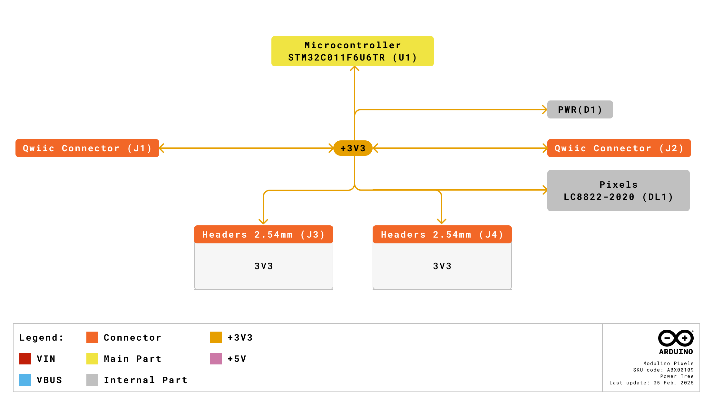
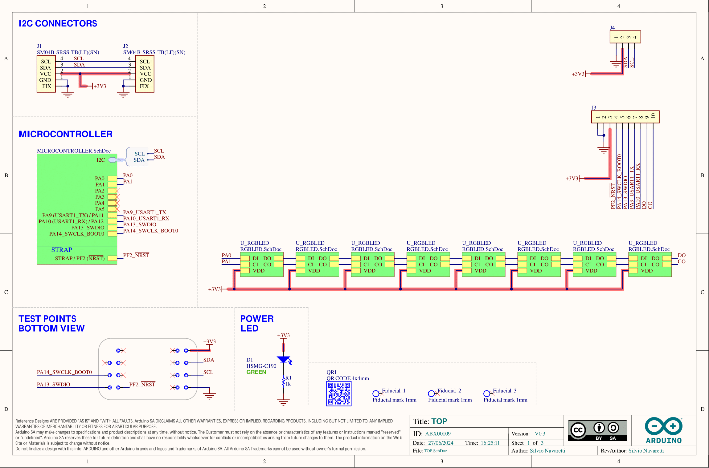
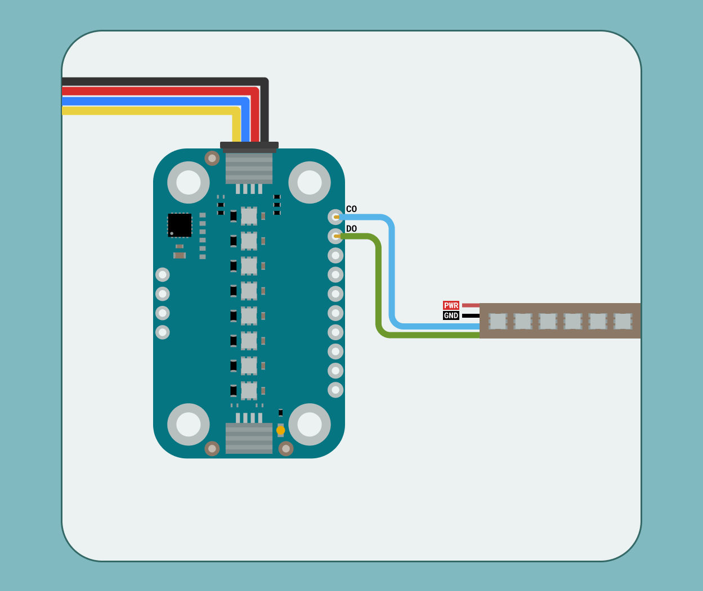
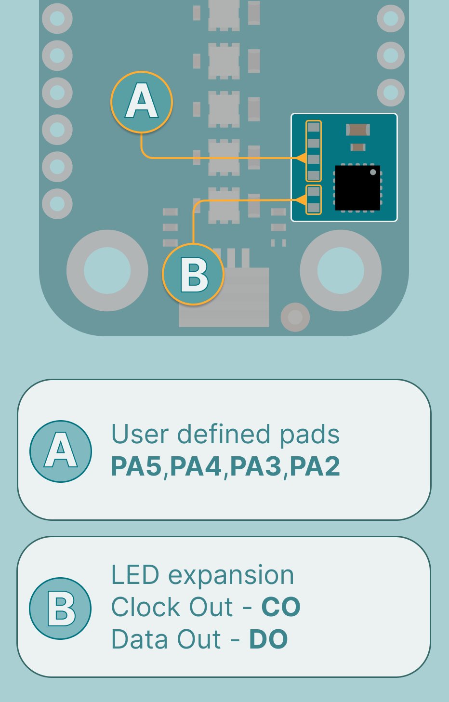
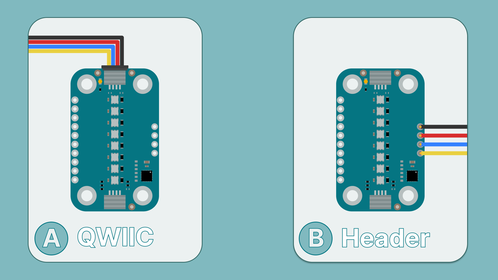
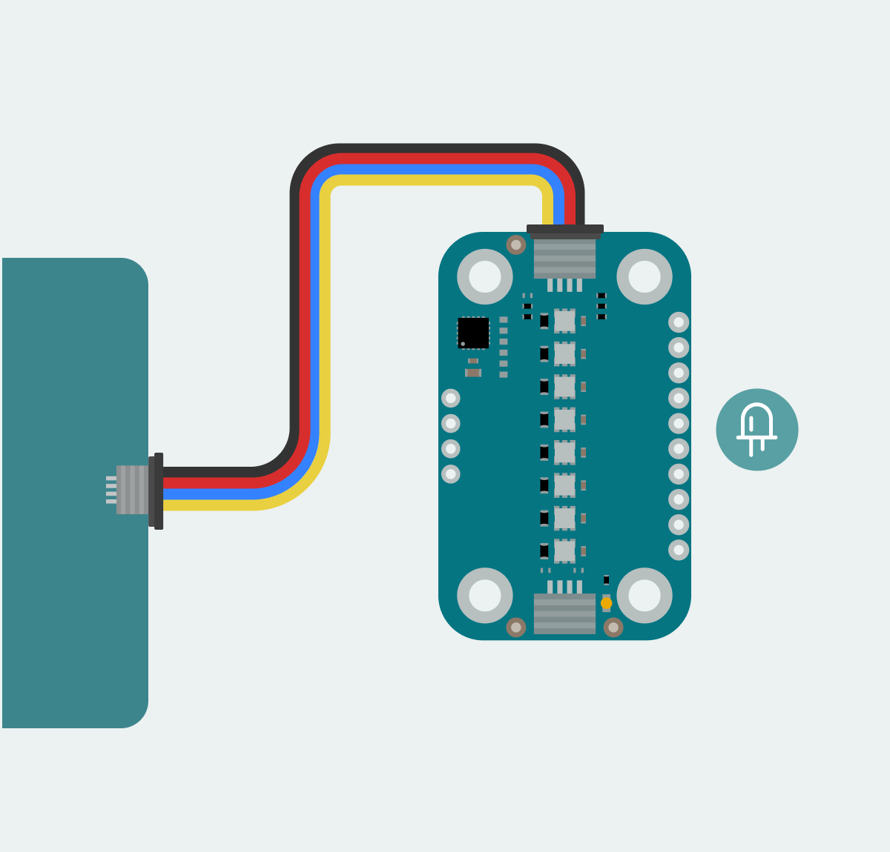
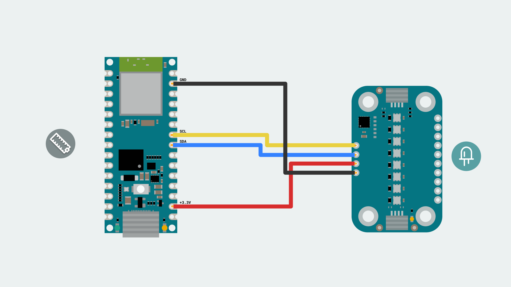
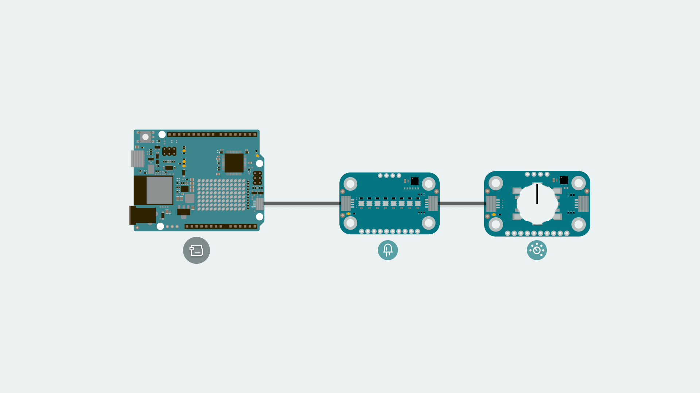

The Modulino Pixels is a modular sensor that generates RGB light effects, making it perfect to add colorful visual feedback to your projects! 
The Modulino form factor is shaped with two QWIIC connectors and the I²C protocol integration, allowing the connection and programming of multiple Modulino nodes in a very simple way. In addition to the QWIIC's connectors, the Modulino nodes also expose solderable pins that can be used in multiple ways and make them compatible with boards that are not QWIIC compatible.

## Hardware Specifications

The Modulino Pixels based on 8 LC8822-2020 addressable LEDs is capable of generating colorful light patterns and effects. Take a look at the following table to know more about its characteristics:

| Parameter        | Condition         | Minimum | Typical | Maximum | Unit |
|------------------|-------------------|---------|---------|---------|------|
| Supply Voltage   | -                 | 2.0     | 3.3     | 3.6     | V    |
| Resolution (ADC) | Default           | -       | 12-bit  | -       | mcd  |
| Communication    | I²C,USART,SPI,I2S | -       | I²C     | -       | -    |

## Pinout

The LC8822-2020 addressable LEDs are the core components of this module. These RGB light output devices are controlled by an onboard STM32C011F4U6TR microcontroller, which supports digital communication (I²C), meaning it connects directly to the I²C bus on the module without requiring additional conversion circuitry.


### 1x10 Header (LC8822-2020 and Microcontroller Signals)
| Pin  | Function       |
|------|----------------|
| PA0  | Clock Out (CO) |
| PA1  | Data Out (DO)  |
| PA2  | User Defined   |
| PA3  | User Defined   |
| PA4  | User Defined   |
| PA5  | User Defined   |
| PA9  | USART TX       |
| PA10 | USART RX       |
| PA14 | SWCLK          |
| PA13 | SWDIO          |

- **PA0: Clock Out (CO)**:  Used to send the clock signal to the first LED in the daisy chain. (Expand LED strip)
- **PA1: Data Out (DO)**: Used to send data to the first LED in the daisy chain.  (Expand LED strip)
- **PA2-PA5: Free pins**: Available for user defined functionality.  
- **PA9 and PA10: UART TX/RX**: Can be used for serial communication.  
- **PA14 and PA13: SWD Interface**: Used for debugging or reprogramming the microcontroller.

### 1x4 Header (I2C)
The pinout for the Modulino Pixels is shown below. While the recommended connection method is via the QWIIC connectors, this solderable header provides a connection option when using the modulino with a non-QWIIC compatible board.

| Pin   | Function     |
|-------|--------------|
| GND   | Ground       |
| 3.3 V | Power Supply |
| SDA   | I²C Data     |
| SCL   | I²C Clock    |

## I2C Address

The **Modulino Pixels** module uses **LC8822-2020** addressable LEDs, which do not have native I²C capabilities. Instead, the LED array is controlled by the Modulino's onboard microcontroller (STM32C011F4U6TR). This microcontroller provides I²C communication, allowing for flexible control of the LEDs.
One unique feature of this setup is the ability to change the I²C address via software. This means the address can be modified based on your application needs, making it adaptable to different system configurations. The default I²C address for the **Modulino Pixels** module is:

| Modulino I²C Address | Hardware I²C Address | Editable Addresses (HEX)          |
|----------------------|----------------------|-----------------------------------|
| 0x6C                 | 0x36                 | Any custom address (via software) |

When scanning for I²C address on the bus, you might find the modulino using the **Hardware I²C Address**. However, you should always use the **Modulino I²C Address** when using the official Modulino library.
Later in this article we teach how to [change the address](#how-to-change-i2c-address).


## Power Specifications

The board is typically powered by +3.3 VDC when using the QWIIC interface as per the I²C standard.

| Parameter              | Condition      | Minimum | Typical | Maximum | Unit |
|------------------------|----------------|---------|---------|---------|------|
| Operating Voltage      | -              | 4.5     | 3.3     | 5.5     | V    |
| Power Dissipation      | -              | -       | -       | 350     | mW   |
| Standby Current        | No data signal | -       | -       | 1       | mA   |
| Max LED Output Current | Per Channel    | -       | 18      | -       | mA   |


The module includes a power LED  that draws 1 mA and turns on as soon as it is powered.
J1 (Qwiic connector), J2 (Qwiic connector), and the headers all share the same power branch. The power distribution of the module is therefore as follows:


## Schematic

The Modulino Pixels uses a simple circuit, as shown in the schematic below:



The main components are the **8 LC8822-2020 addressable LEDs** and the **STM32C011F4U6TR** microcontroller (U1), which handles LED control as well as I²C communication.
You can connect to the I²C pins (SDA and SCL) using either the **QWIIC connectors** (J1 and J2, this is the recommended method) or the **solderable pins** (J4). The board runs on **3.3V**, which comes from the QWIIC cable or the **3V3 pin** on J4.

The **LC8822-2020** LEDs are connected in a daisy chain, with the first LED receiving clock and data signals from the microcontroller. The **CO (Clock Out)** and **DO (Data Out)** of the last LED in the chain are accessible via the **1x10 header**, allowing for expansion. 


These can also be found in small pads near the STM32 microcontroller alongside a few user defines pads that can be used by editing the firmware:


There's also a small power LED indicator that lights up when the board is on.

You can grab the full schematic and PCB files from the [Modulino Pixels](https://docs.arduino.cc/hardware/modulinos/modulino-pixels) product page.

## How To Connect Your Modulino

The easiest and most reliable way to connect your Modulino is through the QWIIC Connect System. It’s plug-and-play, uses standard I²C, and makes it easy to join multiple modules. If your board supports QWIIC, this is the recommended way to go. 
Note that the dedicated I²C pins will differ from board to board meaning it is always a good idea to check your specific model.


 

## QWIIC Connector
Whenever available, the **QWIIC Connect System** is the preferred method. Connecting to the Modulino is extremely simple, just use a standard QWIIC cable to connect your board to either of the QWIIC connectors on the Modulino. Because the cable and connectors are polarized, there is no need to worry about accidentally swapping connections.

QWIIC is a plug-and-play I²C Connect System that uses standardized 4-pin connectors:
- GND  
- 3.3V  
- SDA (Data)  
- SCL (Clock)



The Modulino features two QWIIC connectors, which are internally connected in parallel. This means you can daisy-chain multiple modules easily by connecting additional QWIIC cables between them.

## Solderable Header
When QWIIC is not available, you can use the exposed solderable pins on the module. You can solder pins to the unpopulated pads; just remember the pinout provided in this guide to connect to the right pins of your board.



## Daisy-Chaining Multiple Modulino Nodes

Regardless of whether you connect the first Modulino via QWIIC or through the solderable pins, you can still take advantage of the extra QWIIC connector to daisy-chain additional modules.

Each Modulino includes two QWIIC connectors wired in parallel, allowing you to connect one module to the next in a chain. As long as each module is configured with a unique I²C address, they can all communicate on the same bus.

This approach keeps your setup clean, modular, and expandable without adding extra wiring complexity.


***The number of modules you can connect will depend on what modules you are chaining together, as this system allows for multiple sensors from different manufacturers to be added. Also, the cables you use for these connections will play a significant role in the setup’s performance. Ensure your cables are properly connected and capable of handling the required data transfer.
Each module should have a unique address on a chain if you plan to address them individually. Later in this article we teach how to [change the address](#how-to-change-i2c-address). Multiple modules with the same address will cause conflicts on the I²C bus and will not allow you to address them individually.***
Later in this article we teach how to [change the address](#how-to-change-i2c-address).

### How To Program Your Modulino
To program your Modulino it is recommended you use the official ```Modulino``` micropython library available [here](https://github.com/arduino/arduino-modulino-mpy). The library is fully compatible with the no **Arduino Lab for MicroPython**.
For information on installing the **Arduino Lab for MicroPython** please visit our [page](https://docs.arduino.cc/micropython/first-steps/install-guide/).

### Installing The Modulino Library
The ```Modulino``` library is not available by default on MicroPython devices hence installation is needed.
To simplify the process the [MicroPython Package Installer](https://github.com/arduino/lab-micropython-package-installer/releases) is recommended as it will provide a graphical interface to guide installation.
After installation, you should now be able to:

1. Open the tool.
2. Plug in your board to the computer.


If the board does not appear in the Detected Boards section, click Reload. If the board is still undetected, ensure no other programs (e.g., a code editor) are using the board's COM port.

4. Search for the ```Modulino``` package by filling in the text box on the search feature.
5. Click Install and wait for the installation confirmation.
6. Disconnect the board from the tool before returning to your code editor to avoid conflicts due to a busy COM port.


The module should now be includable in your program using:
```from modulino import ModulinoBuzzer```

### Control RGB LEDs with MicroPython

Getting LED data from the **Modulino Pixels** module is simple using the `Modulino` library. The crucial functions to control the LEDs are:
- `set_rgb(index, r, g, b, brightness)`: Sets a specific LED to an RGB color with the specified brightness.
- `set_all_rgb(r, g, b, brightness)`: Sets all LEDs to an RGB color with the specified brightness.
- `set_all_color(color, brightness)`: Sets all LEDs to a predefined color. (`RED`,`BLUE`,`GREEN`,`VIOLET`,`WHITE`)
- `clear_all()`: Turns off all LEDs.
- `show()`: Sends the updated data to the LEDs.
- By default the Modulino library uses ```Wire1``` if your board model has a different pinout for the dedicated I²C pins you might have to edit it as instructed [here](https://github.com/arduino/arduino-modulino-mpy/tree/main/docs#%E2%84%B9%EF%B8%8F-using-3rd-party-boards). More information on **Wire** can be found [here](https://docs.arduino.cc/language-reference/en/functions/communication/wire/).

Here’s an example demonstrating how to set colors and create a **Knight Rider animation**:

```python
from modulino import ModulinoPixels, ModulinoColor
from time import sleep

pixels = ModulinoPixels()

# Set each LED to a different color from a color wheel
for index in range(0, 8):
    color_wheel_colors = [
        (255, 0, 0),
        (255, 85, 0),
        (255, 255, 0),
        (0, 255, 0),
        (0, 255, 255),
        (0, 0, 255),
        (255, 0, 255),
        (255, 0, 0)
    ]
    pixels.set_rgb(index, *color_wheel_colors[index], 100)
pixels.show()
sleep(1)

# Set all LEDs to solid colors
pixels.set_all_rgb(255, 0, 0, 100)  # Red
pixels.show()
sleep(1)

pixels.set_all_color(ModulinoColor.GREEN, 100)
pixels.show()
sleep(1)

pixels.set_all_color(ModulinoColor.BLUE, 100)
pixels.show()
sleep(1)

# Knight Rider animation
def set_glowing_led(index, r, g, b, brightness):
    """
    Set the color of the LED at the given index with its 
    neighboring LEDs slightly dimmed to create a glowing effect.
    """
    pixels.clear_all()
    pixels.set_rgb(index, r, g, b, brightness)

    if index > 0:
        pixels.set_rgb(index - 1, r, g, b, brightness // 8) # Left LED
    if index < 7:
        pixels.set_rgb(index + 1, r, g, b, brightness // 8) # Right LED
    
    pixels.show()

for j in range(3):
    for i in range(8):
        set_glowing_led(i, 255, 0, 0, 100)
        sleep(0.05)

    for i in range(7, -1, -1):
        set_glowing_led(i, 255, 0, 0, 100)
        sleep(0.05)

# Turn off all LEDs
pixels.clear_all().show()
```
This example shows different ways to control the Pixels. It starts by creating a rainbow pattern using different colors for each LED. Next, it demonstrates setting all LEDs to the same color, using both RGB values and predefined color constants. The final section implements a Knight Rider animation by lighting one main LED at full brightness while slightly illuminating adjacent LEDs at reduced brightness. The `set_glowing_led()` function handles this effect by managing the primary LED and its neighbors, creating a back-and-forth scanning pattern that repeats three times before turning off all LEDs.

### How To Change Address

A sketch is also available included with the library named `AddressChanger` and also available [here](https://github.com/arduino/arduino-modulino-mpy/blob/main/examples/change_address.py). This sketch changes the I2C address at a software level on the Module's microcontroller.

- Connect the module to your board via I2C, ensuring no other modules are in the chain.
- Run the script in a MicroPython environment.
- Follow the on-screen instructions (REPL) to select the device and enter a new address. Valid I²C addresses range from 0x08 to 0x77 (7-bit values in hexadecimal format, e.g., 0x42).
- The script will attempt to change the address and confirm success.

To keep track of the address in use, the module has a white rectangle on the back. Feel free to use this to write the address that was chosen.

When using a custom address in your MicroPython sketch, you'll need to specify this address when creating the module object. For example:
```python
pixels_module = ModulinoPixels(address=0x45)  # Replace 0x45 with your specific address
```

## Troubleshooting

### LEDs Not Lighting
If your Modulino's power LED isn't on or the RGB LEDs aren't responsive, first check that the board is properly connected:
- Ensure both the board and the Modulino are connected to your computer, and that the power LEDs on both are lit.
- If the issue persists, make sure the Qwiic cable is properly clicked into place.

### Library Not Installed Properly
If you encounter an issue with the `import ModulinoPixels"` command, verify that the Modulino library is correctly installed:
- Check your IDE to ensure the library is installed and up-to-date.
- Re-install the library through the Library Manager.

### Incorrect Colors or Flickering
If the LED colors are incorrect or the LEDs are flickering unexpectedly, make sure:
- The brightness values are within the appropriate range (typically 0-255).
- All exposed electronics are not touching any conductive surfaces, as this could interfere with the LED output.
- The power supply is stable and providing sufficient current for all LEDs at the desired brightness.

# Conclusion

The **Modulino Pixels** is a digital RGB LED control module that communicates over I²C and follows the Modulino form factor. It includes standard Qwiic connectors for quick, solderless connections and easy daisy-chaining with other modules. Paired with the Modulino library, it makes generating colorful light effects straightforward, allowing you to focus on experimenting or building your system logic. It's a small, reliable module suited for both visual feedback and creative lighting projects.

# What Is Next?

Now that you've learned how to use your Modulino Pixels, you're all set to integrate it into your projects!
- Create an animated progress bar that visually displays status, or battery charge level using a gradient of colors.
- Build a live sound level indicator that responds to ambient noise.
- Design a pomodoro timer with color coded work and rest periods to boost your productivity.
- Program an interactive game where players must match patterns of colors in the correct sequence, with difficulty increasing as they progress.
