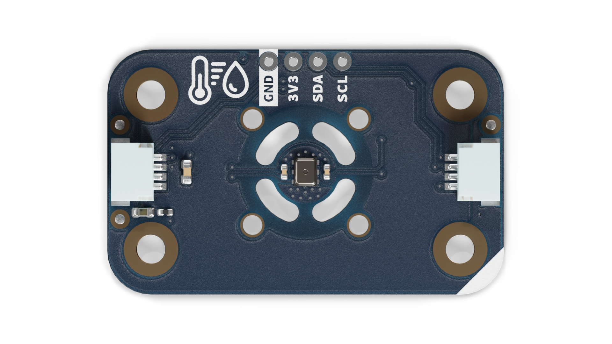
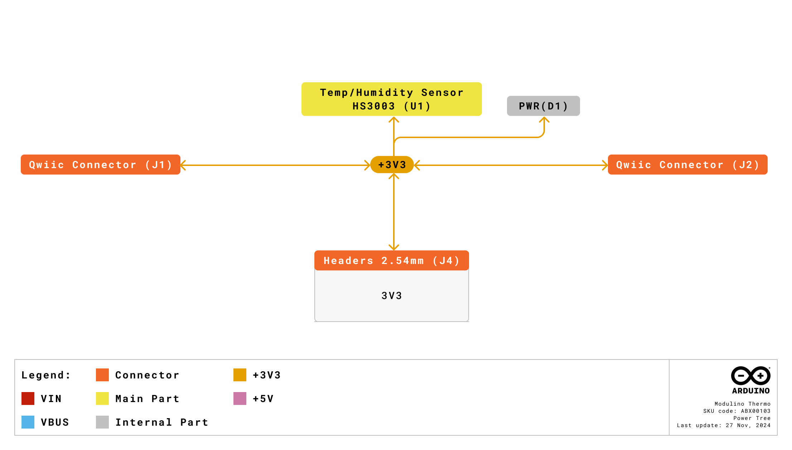
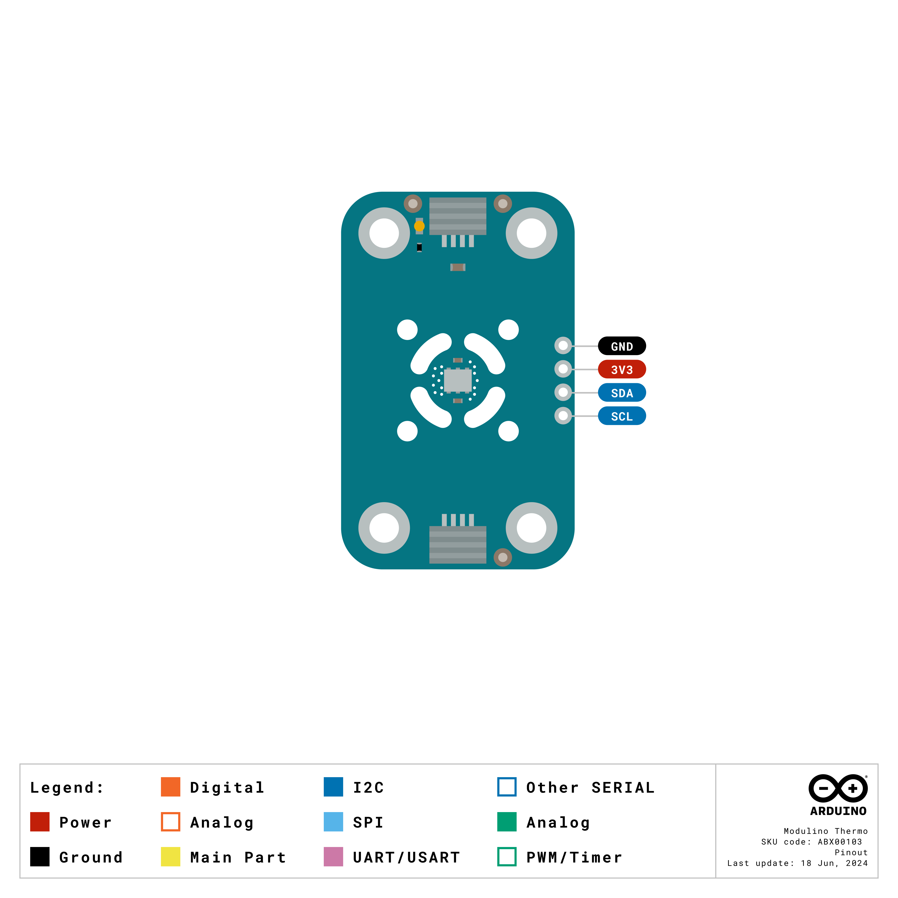

# Description
The Modulino® Thermo, featuring the HS3003 sensor, measures both temperature and humidity, making it ideal for environmental monitoring, indoor climate control, and various IoT applications. It provides accurate readings in a compact form factor and integrates seamlessly into the Qwiic ecosystem.

# Target Areas
Maker, beginner, education

# Contents

## Application Examples
The Modulino® Thermo node can be used in numerous scenarios within IoT and electronics projects:

- **Indoor Climate Control**
  Monitor real-time temperature and humidity levels to automatically adjust HVAC systems or trigger alerts.

- **Greenhouse Monitoring**
  Maintain precise growing conditions by tracking changes in humidity and temperature, ensuring plant health and growth.

- **Smart Home Automation**
  Combine the Modulino® Thermo with other nodes, such as movement or distance sensors, to create fully automated home systems that respond to environmental changes.

## Features
- Utilizes the **HS3003** sensor to measure temperature and humidity.
- Communicates via **I2C** (Qwiic connector) at 3.3 V (standard).
- Designed with an **additional header** for optional connections.
- Ideal for **environmental monitoring** in IoT and home automation applications.

### Contents
| **SKU**  | **Name**           | **Purpose**                             | **Quantity** |
| -------- | ------------------ | --------------------------------------- | ------------ |
| ABX00103 | Modulino® Thermo   | Measure temperature and humidity        | 1            |
|          | I2C Qwiic cable    | Compatible with the Qwiic standard      | 1            |

## Related Products
- *SKU: ASX00027* – [Arduino® Sensor Kit](https://store.arduino.cc/products/arduino-sensor-kit)
- *SKU: K000007* – [Arduino® Starter Kit](https://store.arduino.cc/products/arduino-starter-kit-multi-language)
- *SKU: AKX00026* – [Arduino® Oplà IoT Kit](https://store.arduino.cc/products/opla-iot-kit)

## Rating

### Recommended Operating Conditions
- **Sensor supply range:** 2.3 V – 5.5 V
- **Powered at 3.3 V** through the Qwiic interface (in accordance with the Qwiic standard)
- **Operating temperature:** –40 °C to +125 °C

**Typical current consumption:**
- ~24.4 µA (at 14-bit resolution, 3.3 V)

## Power Tree
The power tree for the Modulino® node can be consulted below:

  
## Block Diagram
This module is designed to be placed on an I2C bus, allowing the on-board HS3003 sensor to communicate with a host microcontroller via I2C.

## Functional Overview
The Modulino® Thermo node uses the HS3003 sensor to measure both temperature and humidity. Data is accessed through I2C (via the Qwiic connector at 3.3 V). It is well-suited for climate control, environmental logging, and wearable IoT.

### Technical Specifications
| **Specification**       | **Details**                                 |
| ----------------------- | ------------------------------------------- |
| **Sensor**              | HS3003                                      |
| **Supply Voltage**      | 3.3 V                   |
| **Power Consumption**   | 24.4 µA (14-bit resolution, 3.3 V supply)   |
| **Range**               | 0–100% RH, –40 °C to +125 °C                |
| **Accuracy**            | Humidity: ±2.8% RH, Temperature: ±0.25 °C   |
| **Resolution**          | 14-bit humidity, 14-bit temperature         |
| **Communication**       | I2C                                         |

### Pinout
**Qwiic / I2C (1×4 Header)**
| **Pin** | **Function**            |
|---------|-------------------------|
| GND     | Ground                 |
| 3.3 V   | Power Supply (3.3 V)   |
| SDA     | I2C Data               |
| SCL     | I2C Clock              |

These pads and the Qwiic connectors share the same I2C bus. You can optionally solder header pins here.

**Note:** The board may also include pads for mounting pull-up resistors, not installed by default.

### Power Specifications
- **Nominal operating voltage:** 3.3 V via Qwiic 

### Mechanical Information

- Board dimensions: 41 mm × 25.36 mm  
- Thickness: 1.6 mm (±0.2 mm)  
- Four mounting holes (Ø 3.2 mm)  
  - Hole spacing: 16 mm vertically, 32 mm horizontally

### I2C Address Reference
| **Board Silk Name** | **Sensor** | **Modulino® I2C Address (HEX)** | **Editable Addresses (HEX)**             | **Hardware I2C Address (HEX)** |
|---------------------|-----------|--------------------------------|------------------------------------------|--------------------------------|
| MODULINO THERMO     | HS3003    | 0x44                           | Any custom address (via software config) | 0x44                           |

**Note:** Default address is **0x44**. Adjustments may be made via software if multiple identical sensors are on the same bus.

## Device Operation
The Modulino® Thermo node acts as an I2C target device on the Qwiic bus. Simply connect it via a Qwiic cable to the 3.3 V I2C interface of your microcontroller. Read humidity and temperature values via standard I2C transactions.

### Getting Started
Use the Arduino IDE or Arduino Cloud Editor to program your microcontroller. Libraries for HS3003 or generic humidity/temperature sensors can help streamline data acquisition. Ensure your microcontroller and this node operate on the same 3.3 V reference for the Qwiic bus.

# Company Information

| Company name    | Arduino SRL                                   |
|-----------------|-----------------------------------------------|
| Company Address | Via Andrea Appiani, 25 - 20900 MONZA（Italy)  |

# Reference Documentation

| Ref                       | Link                                                                                                                                                                                           |
| ------------------------- | ---------------------------------------------------------------------------------------------------------------------------------------------------------------------------------------------- |
| Arduino IDE (Desktop)     | [https://www.arduino.cc/en/Main/Software](https://www.arduino.cc/en/Main/Software)                                                                                                             |
| Arduino Courses           | [https://www.arduino.cc/education/courses](https://www.arduino.cc/education/courses)                                                                                                           |
| Arduino Documentation     | [https://docs.arduino.cc/](https://docs.arduino.cc/)                                                                                                                                           |
| Arduino IDE (Cloud)       | [https://create.arduino.cc/editor](https://create.arduino.cc/editor)                                                                                                                           |
| Cloud IDE Getting Started | [https://docs.arduino.cc/cloud/web-editor/tutorials/getting-started/getting-started-web-editor](https://docs.arduino.cc/cloud/web-editor/tutorials/getting-started/getting-started-web-editor) |
| Project Hub               | [https://projecthub.arduino.cc/](https://projecthub.arduino.cc/)                                                                                                                               |
| Library Reference         | [https://github.com/arduino-libraries/](https://github.com/arduino-libraries/)                                                                                                                 |
| Online Store              | [https://store.arduino.cc/](https://store.arduino.cc/)                                                                                                                                         |
|                           |                                                                                                                                                                                                |

# Revision History
| **Date**   | **Revision** | **Changes**   |
| ---------- | ------------ | ------------- |
| 23/05/2025 | 2            | Power info    |
| 14/05/2025 | 1            | First release |
