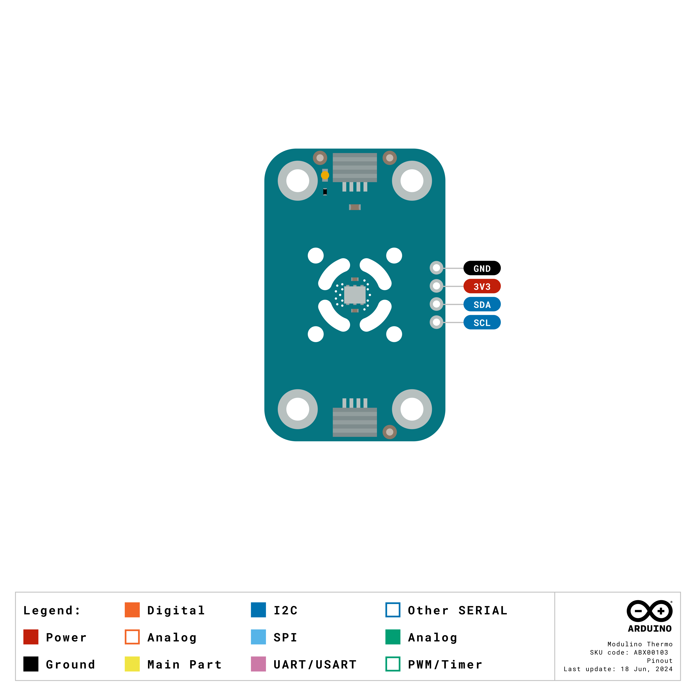
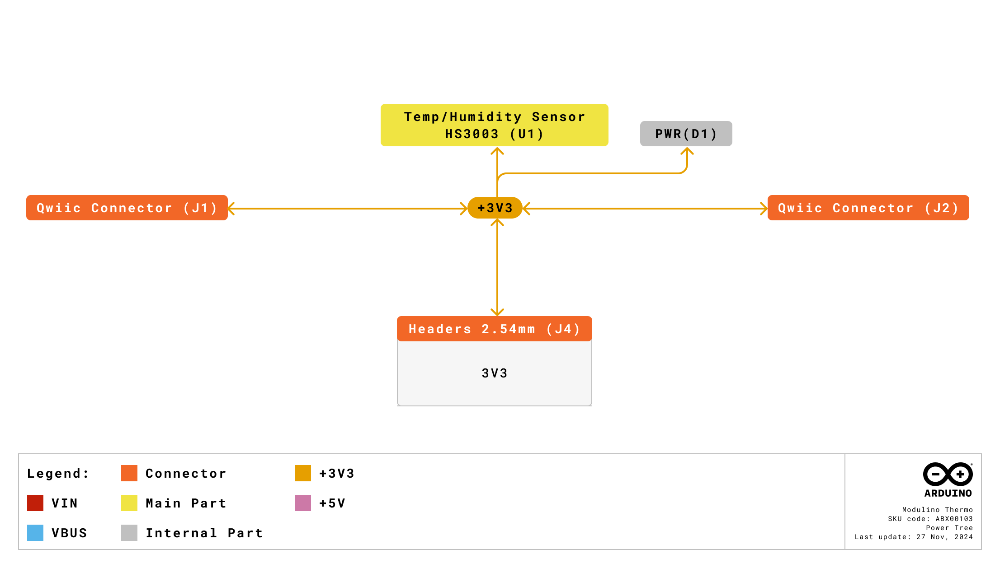
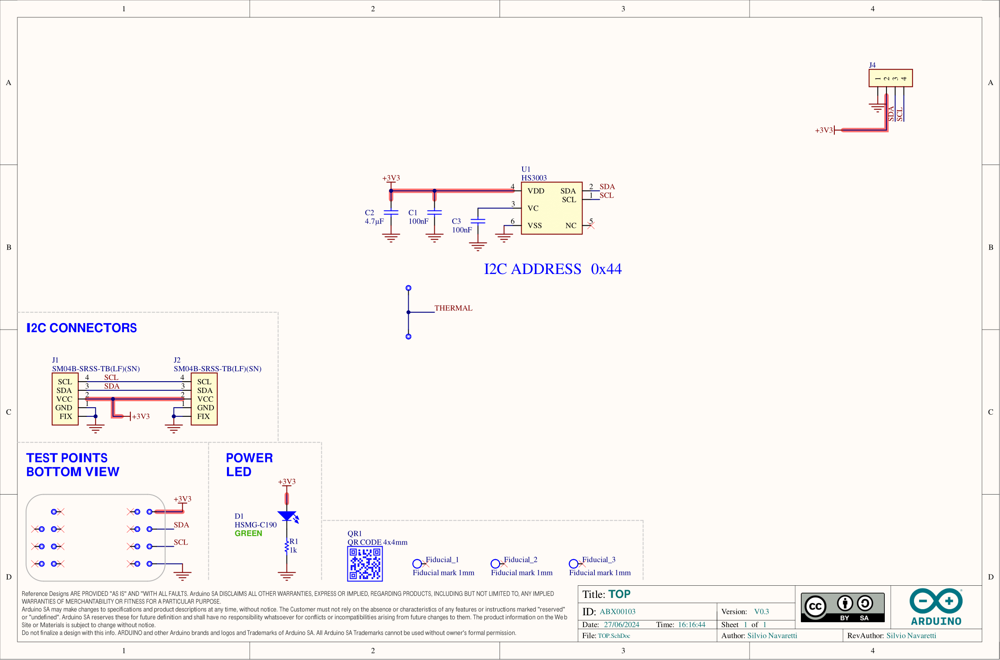
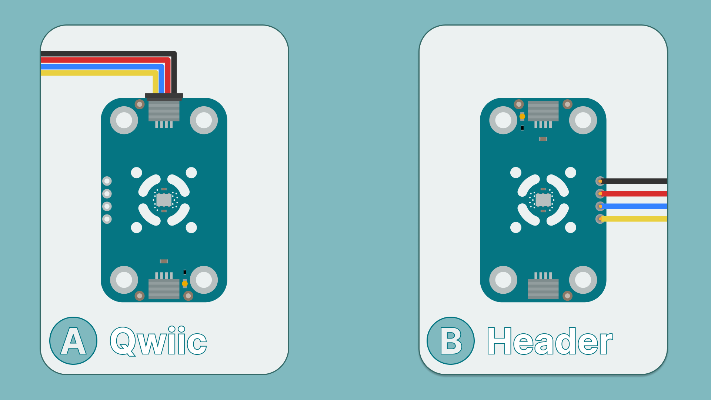
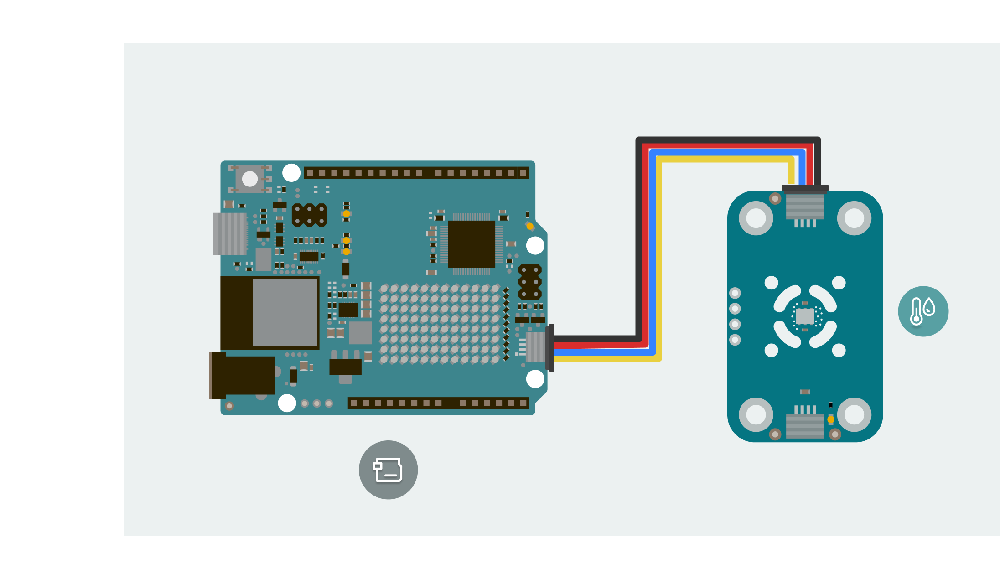
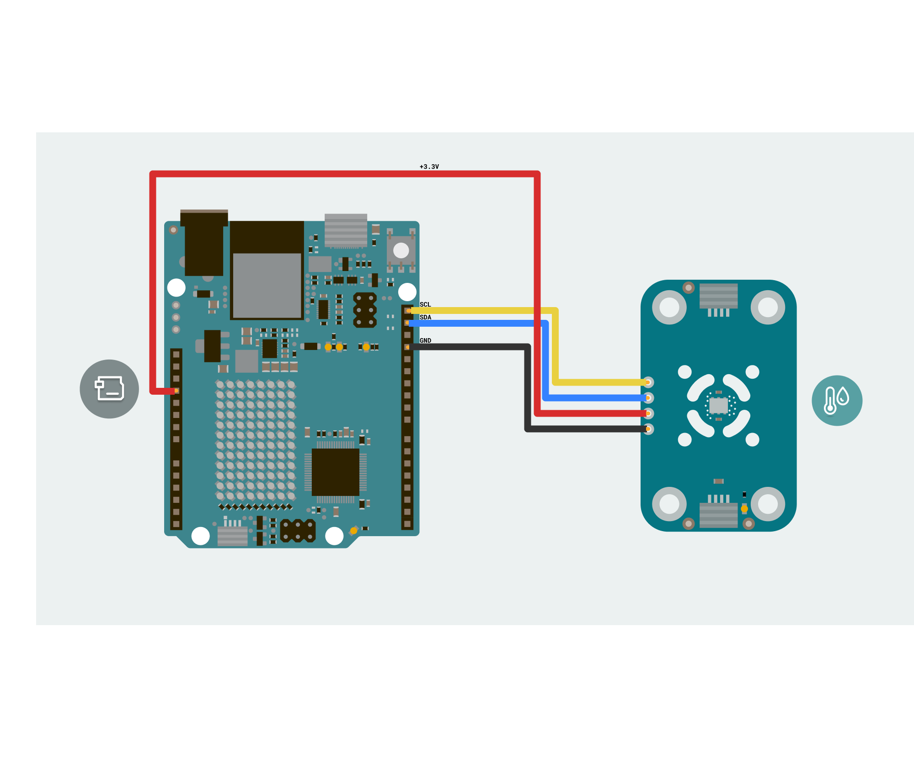
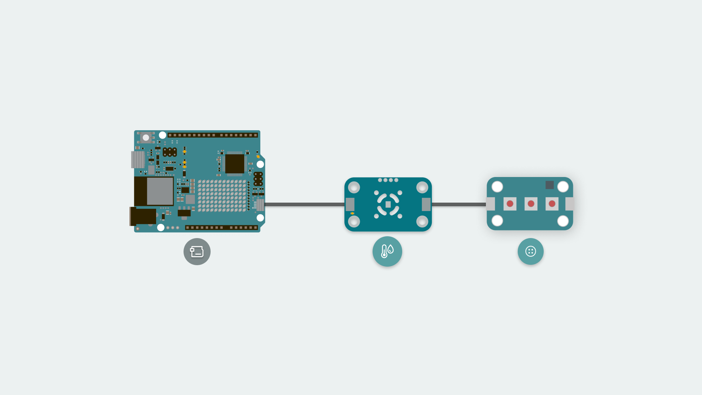

The Modulino Thermo is a modular sensor that measures temperature and humidity, making it perfect to add environmental monitoring to your projects!

The Modulino form factor is shaped with two QWIIC connectors and the I²C protocol integration, allowing the connection and programming of multiple modulinos in a very simple way. In addition to the QWIIC's connectors, the Modulinos also expose solderable pins that can be used in multiple ways and make them compatible with boards that are not QWIIC compatible.

## General Characteristics

The Modulino Thermo is capable of measuring temperature and relative humidity. Take a look at the following table to know more about its measuring ranges:


| Parameter | Condition   | Minimum | Typical | Maximum | Unit |
|-----------|-------------|---------|---------|---------|------|
| Range     | Temperature | \-40    | \-      | +125    | °C   |
| \-        | Humidity    | 0       | \-      | 100%    | φ RH |
| Accuracy  | Temperature | \-      | ±0,25   | \-      | °C   |
| \-        | Humidity    | \-      | ±2.8%   | \-      | φ    |

### Sensor Details

The HS3003 sensor from Renesas is the core component of this module. This temperature and humidity sensor natively supports digital communication (I²C), meaning it connects directly to the I²C bus on the module without requiring additional conversion circuitry.

The default address for the Module is:

| Modulino I²C Address | Hardware I²C Address |
|----------------------|----------------------|
| 0x44                 | 0x44                 |

***Note: Since the address cannot be changed on this Modulino specifically, using two or more identical modules on the same I²C bus will result in address conflicts and cause communication issues.***

## Pinout

The pinout for the Modulino Thermo is shown below. Please note that the exposed solderable pins are directly connected to the QWIIC connectors using the same I²C interface.



Depending on the board connected to the modulino, the I²C pin names to program it may differ. Please check the [board tutorials](https://docs.arduino.cc/hardware/) on your modulino's compatible board or the [Modulino library](https://github.com/arduino-libraries/Modulino/tree/main/docs) to learn more.

### 1x4 Header (I2C)

The pinout for the Modulino Buzzer is shown below. While the recommended connection method is via the QWIIC connectors, this solderable header provides a connection option when using the modulino with a non-QWIIC compatible board.

| Pin   | Function     |
|-------|--------------|
| GND   | Ground       |
| 3.3 V | Power Supply |
| SDA   | I²C Data     |
| SCL   | I²C Clock    |

## Power Specifications

The board is typically powered by +3.3 VDC when using the QWIIC interface as per the I²C standard.

| Parameter       | Condition                                                         | Minimum | Typical     | Maximum | Unit |
|-----------------|-------------------------------------------------------------------|---------|-------------|---------|------|
| Supply Voltage  | \-                                                                | 2.3     | 3.3 (QWIIC) | 5.5     | V    |
| Average Current | 1 humidity + temperature measurement/s 3.3 VDD - Max 5,5@ 3.3 VDD | \-      | 1024.4      | 24.4    | µA   |

The module additionally includes a power LED that draws 1 mA and turns on as soon as it is powered.

J1 (Qwiic connector), J2 (Qwiic connector), and the headers all share the same power branch. The power distribution of the module is therefore as follows:



## Schematic

The Modulino Thermo uses a simple circuit, as shown in the schematic below:



The main component is the **HS3003** sensor (U1), which handles both temperature and humidity measurements, as well as I²C communication.

You can connect to the I²C pins (SDA and SCL) using either the **QWIIC connectors** (J1 and J2, this is the recommended method) or the **solderable pins** (J4). The board runs on **3.3V**, which comes from the QWIIC cable or the **3V3 pin** on J4.

There's also a small power indicator LED that lights up when the board is on.
You can grab the full schematic and PCB files from the [Modulino Thermo](https://docs.arduino.cc/hardware/modulinos/modulino-thermo) product page.

## How To Connect Your Modulino

The easiest and most reliable way to connect your Modulino is through the QWIIC Connect System. It’s plug-and-play, uses standard I²C, and makes it easy to join multiple modules. If your board supports QWIIC, this is the recommended way to go. Note that the dedicated I²C pins will differ from board to board meaning it is always a good idea to check your specific model.

If your board doesn’t have a QWIIC connector, you can still access the same I²C bus and power the module using the solderable header pads just make sure you wire it to 3.3V and match the I²C pinout.

 

### QWIIC Connector

Whenever available, the **QWIIC Connect System** is the preferred method. Connecting to the Modulino is extremely simple, just use a standard QWIIC cable to connect your board to either of the QWIIC connectors on the Modulino. Because the cable and connectors are polarized, there is no need to worry about accidentally swapping connections.

QWIIC is a plug-and-play I²C Connect System that uses standardized 4-pin connectors:

- GND  
- 3.3V  
- SDA (Data)  
- SCL (Clock)



The Modulino features two QWIIC connectors, which are internally connected in parallel. This means you can daisy-chain multiple modules easily by connecting additional QWIIC cables between them.

### Solderable Header

When QWIIC is not available, you can use the exposed solderable pins on the module. You can solder pins to the unpopulated pads; just remember the pinout provided in this guide to connect to the right pins of your board.



### Daisy-Chaining Multiple Modulinos

Regardless of whether you connect the first Modulino via QWIIC or through the solderable pins, you can still take advantage of the extra QWIIC connector to daisy-chain additional modules.

Each Modulino includes two QWIIC connectors wired in parallel, allowing you to connect one module to the next in a chain. As long as each module is configured with a unique I²C address, they can all communicate on the same bus as long as you select the correct I²C pins depending on your board.

This approach keeps your setup clean, modular, and expandable without adding extra wiring complexity.



***The number of modules you can connect will depend on what modules you are chaining together, as this system allows for multiple sensors from different manufacturers to be added. Also, the cables you use for these connections will play a significant role in the setup’s performance. Ensure your cables are correctly connected and capable of handling the required data transfer.
Each module should have a unique address on a chain if you plan to address them individually. Multiple modules with the same address will cause conflicts on the I²C bus.***

## How To Use Your Modulino

### Installing The Modulino Library

You need the official Modulino library available [here](https://docs.arduino.cc/libraries/modulino/) to use the Modulino Thermo.

With the Arduino IDE you get some tools that make adding a library easier. To learn how to install the IDE please visit our [page](https://docs.arduino.cc/software/ide-v2/tutorials/getting-started/ide-v2-downloading-and-installing/).

After opening the IDE, a tab should be visible on the left. Press the book icon for "library" as highlighted in the image.


The process should look like this:

 

A message will appear after the installation is successful.


### Getting Temperature And Humidity Data

Getting data from the sensor is fairly simple using the ```Modulino``` library. For the **Modulino Thermo** there are two important functions:

- ```getTemperature()```: Provides the temperature measurement from the sensor. (default in Celsius C)
- ```getHumidity()```: Provides the relative humidity measurement from the sensor. (default in Relative Percentage %)
- ```Modulino.begin();```: By default the Modulino library uses ```Wire1``` if your connection is in a different Wire you will have to edit it, check [here](https://docs.arduino.cc/language-reference/en/functions/communication/wire/) (by default the Modulino library uses ```Wire1``` if your board model has a different pinout for the dedicated I²C pins you might have to edit it. More information on **Wire** can be found [here](https://docs.arduino.cc/language-reference/en/functions/communication/wire/)) for the library's hardware compatibility. More information on **Wire** can be found [here](https://docs.arduino.cc/language-reference/en/functions/communication/wire/).

Here is an example sketch of how to implement these functions to acquire data and show it using the serial monitor:

```arduino
#include <Modulino.h>

// Create object instance
ModulinoThermo thermo;

// Global Variables
float celsius = 0;
float humidity = 0;

void setup(){
  // Initialization of the serial port, modulino object and thermo one

  Serial.begin(115200);
  Modulino.begin();
  thermo.begin();
}

void loop(){
  celsius = thermo.getTemperature();
  humidity = thermo.getHumidity();

  Serial.print("Temperature (C) is: ");
  Serial.println(celsius);

  Serial.print("Humidity (rH) is: ");
  Serial.println(humidity);

  delay(1000);
}
```

The code example provided shows how to initialize the sensor, read the data, and display it on the serial monitor. The data is updated every second, showing the current temperature and humidity values in real time.

It can be easily adapted to trigger actions at certain temperature/humidity thresholds or to log data for analysis.

## Troubleshooting

### Sensor Not Reachable
  
If your Modulino's power LED isn't on or the sensor isn't responsive, first check that the board is properly connected: 

- Ensure both the board and the Modulino are connected to your computer, and that the power LEDs on both are lit.  
- If the issue persists, make sure the Qwiic cable is properly clicked into place.

### Library Not Installed Properly
  
If you encounter an issue with the `#include "modulino.h"` command, verify that the Modulino library is correctly installed:  

- Check your IDE to ensure the library is installed and up-to-date.  
- Re-install the library through the Library Manager.

### Inaccurate Values
  
If the sensor values are not accurate, make sure:

- The sensor is not placed near any components that might generate heat (like motors or power supplies).
- All exposed electronics are not touching any conductive surfaces, as this could interfere with readings.

## Conclusion

The **Modulino Thermo** is a digital temperature and humidity sensor that communicates over I²C and follows the Modulino form factor. It includes standard Qwiic connectors for quick, solderless connections and easy daisy-chaining with other modules. Paired with the Modulino library, it makes accessing sensor data straightforward, allowing you to focus on experimenting or building your system logic. It’s a small, reliable module suited for both quick tests and longer-term setups.

## What Is Next?

Now that you've learned how to use your Modulino Thermo, you're all set to integrate it into your projects!

- Experiment with temperature and humidity. What happens if you place your Modulino in the refrigerator? 
- Try breathing near the sensor. Does the humidity change? 
- Place your Modulino on the outside of your mug and fill it with a hot beverage. Can you create an automatic system to know when your tea has cooled down?
- How does the temperature change throughout the day at home? Let your Modulino run for an entire day and check out the data!