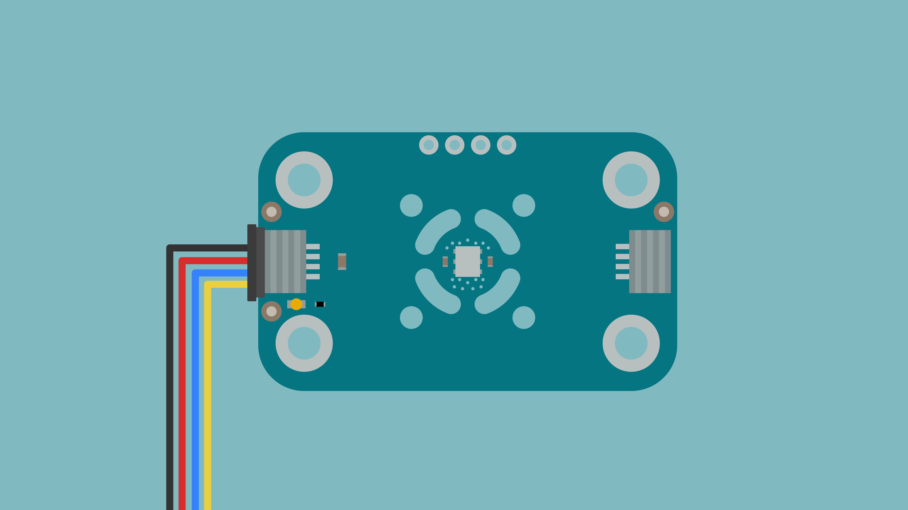
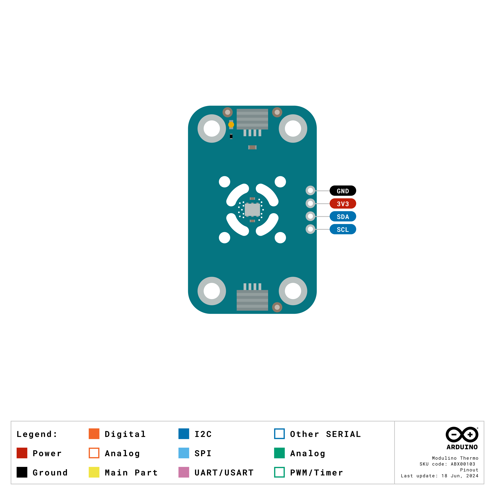

The Modulino Thermo is a modular sensor that measures temperature and humidity, making it perfect to add environmental monitoring to your projects! It uses the standardised Modulino form factor with QWIIC connectors for easy integration.

## Hardware Overview

### General Characteristics

The Modulino Thermo is capable of measuring temperature and relative humidity with the following specifications:

| Parameter | Condition   | Minimum | Typical | Maximum | Unit |
|-----------|-------------|---------|---------|---------|------|
| Range     | Temperature | -40     | -       | +125    | °C   |
| -         | Humidity    | 0       | -       | 100     | φ RH |
| Accuracy  | Temperature | -       | ±0.25   | -       | °C   |
| -         | Humidity    | -       | ±2.8    | -       | φ    |

### Sensor Details

The **HS3003** sensor from Renesas is the core component of this module. This temperature and humidity sensor natively supports digital communication (I2C), meaning it connects directly to the I2C bus on the module without requiring additional conversion circuitry.

The default address for the Module is:

| Modulino I2C Address | Hardware I2C Address |
|----------------------|----------------------|
| 0x44                 | 0x44                 |

***Note: Since the address cannot be changed on this Modulino specifically, using two or more identical modules on the same I2C bus will result in address conflicts and cause communication issues.***

### Pinout



#### 1x4 Header (I2C)

| Pin   | Function     |
|-------|--------------|
| GND   | Ground       |
| 3.3 V | Power Supply |
| SDA   | I2C Data     |
| SCL   | I2C Clock    |

### Power Specifications

The board is typically powered by +3.3 VDC when using the QWIIC interface as per the I2C standard.

| Parameter       | Condition                                          | Minimum | Typical     | Maximum | Unit |
|-----------------|---------------------------------------------------|---------|-------------|---------|------|
| Supply Voltage  | -                                                 | 2.3     | 3.3 (QWIIC) | 5.5     | V    |
| Average Current | 1 humidity + temperature measurement/s @ 3.3 VDD | -       | 24.4        | 1024.4  | µA   |

The module includes a power LED that draws 1 mA and turns on as soon as it is powered. J1 (QWIIC connector), J2 (QWIIC connector), and the headers all share the same power branch.

### Schematic

The Modulino Thermo uses a simple circuit built around the **HS3003** sensor (U1), which handles both temperature and humidity measurements, as well as I2C communication.

You can connect to the I2C pins (SDA and SCL) using either the **QWIIC connectors** (J1 and J2, recommended) or the **solderable pins** (J4). The board runs on **3.3V** from the QWIIC cable or the **3V3 pin** on J4.

Full schematic and PCB files are available from the [Modulino Thermo page](https://docs.arduino.cc/hardware/modulinos/modulino-thermo).

## Programming with Arduino

### Prerequisites

- Install the Modulino library via the Arduino IDE Library Manager
- Connect your Modulino Knob via QWIIC or solderable headers

For detailed instructions on setting up your Arduino environment and installing libraries, please refer to the [Getting Started with Modulinos guide](./how-general).

Library repository available [here](https://github.com/arduino-libraries/Arduino_Modulino).

### Basic Example

```arduino
#include <Modulino.h>

// Create object instance
ModulinoThermo thermo;

// Global Variables
float celsius = 0;
float humidity = 0;

void setup(){
  // Initialization of the serial port, modulino object and thermo one
  Serial.begin(115200);
  Modulino.begin();
  thermo.begin();
}

void loop(){
  celsius = thermo.getTemperature();
  humidity = thermo.getHumidity();

  Serial.print("Temperature (C) is: ");
  Serial.println(celsius);

  Serial.print("Humidity (rH) is: ");
  Serial.println(humidity);

  delay(1000);
}
```

### Key Functions

- `getTemperature()`: Returns temperature measurement in Celsius
- `getHumidity()`: Returns relative humidity as a percentage
- `Modulino.begin()`: Initialises the Modulino system (uses `Wire1` by default)

### Advanced Example - Temperature Alert System

```arduino
#include <Modulino.h>

ModulinoThermo thermo;
const float TEMP_THRESHOLD = 25.0;  // Alert above 25°C
const float HUMIDITY_THRESHOLD = 70.0;  // Alert above 70% humidity

void setup(){
  Serial.begin(115200);
  Modulino.begin();
  thermo.begin();
  
  Serial.println("Environmental Monitor Started");
}

void loop(){
  float temp = thermo.getTemperature();
  float hum = thermo.getHumidity();
  
  // Check temperature threshold
  if(temp > TEMP_THRESHOLD) {
    Serial.print("⚠️ HIGH TEMPERATURE: ");
    Serial.print(temp);
    Serial.println("°C");
  }
  
  // Check humidity threshold
  if(hum > HUMIDITY_THRESHOLD) {
    Serial.print("⚠️ HIGH HUMIDITY: ");
    Serial.print(hum);
    Serial.println("%");
  }
  
  // Normal readings
  if(temp <= TEMP_THRESHOLD && hum <= HUMIDITY_THRESHOLD) {
    Serial.print("Normal - Temp: ");
    Serial.print(temp);
    Serial.print("°C, Humidity: ");
    Serial.print(hum);
    Serial.println("%");
  }
  
  delay(5000);  // Check every 5 seconds
}
```

## Programming with MicroPython

### Prerequisites

- Install the Modulino MicroPython library (see [Getting Started with Modulinos](./how-general) for detailed instructions)
- Ensure Arduino Lab for MicroPython is installed

### Basic Example

```python
from modulino import ModulinoThermo
from time import sleep

thermo_module = ModulinoThermo()

while True:
    temperature = thermo_module.temperature
    humidity = thermo_module.relative_humidity
    
    if temperature != None and humidity != None:
        print(f"🌡️ Temperature: {temperature:.1f} °C")
        print(f"💧 Humidity: {humidity:.1f} %")
        print()
        
    sleep(2)
```

### Key Properties

- `.temperature`: Returns temperature measurement in Celsius
- `.relative_humidity`: Returns relative humidity as a percentage

### Advanced Example - Data Logger

```python
from modulino import ModulinoThermo
from time import sleep, ticks_ms

thermo = ModulinoThermo()

# Configuration
LOG_INTERVAL = 60000  # Log every minute (in milliseconds)
SAMPLES_TO_KEEP = 60  # Keep last hour of data

# Data storage
data_log = []
last_log_time = ticks_ms()

def calculate_average(values):
    """Calculate average of a list of values"""
    if not values:
        return 0
    return sum(values) / len(values)

def log_data():
    """Log temperature and humidity data"""
    temp = thermo.temperature
    hum = thermo.relative_humidity
    
    if temp is not None and hum is not None:
        timestamp = ticks_ms()
        data_log.append({
            'time': timestamp,
            'temp': temp,
            'humidity': hum
        })
        
        # Keep only recent samples
        if len(data_log) > SAMPLES_TO_KEEP:
            data_log.pop(0)
        
        return True
    return False

def print_statistics():
    """Print statistics from logged data"""
    if not data_log:
        print("No data collected yet")
        return
    
    temps = [d['temp'] for d in data_log]
    hums = [d['humidity'] for d in data_log]
    
    print("\n📊 Statistics (last hour):")
    print(f"  Samples: {len(data_log)}")
    print(f"  Avg Temp: {calculate_average(temps):.1f}°C")
    print(f"  Min Temp: {min(temps):.1f}°C")
    print(f"  Max Temp: {max(temps):.1f}°C")
    print(f"  Avg Humidity: {calculate_average(hums):.1f}%")
    print(f"  Min Humidity: {min(hums):.1f}%")
    print(f"  Max Humidity: {max(hums):.1f}%")

# Main loop
print("🌡️ Environmental Data Logger Started")
print("Logging data every minute...")

while True:
    current_time = ticks_ms()
    
    # Log data at intervals
    if current_time - last_log_time >= LOG_INTERVAL:
        if log_data():
            print(f"✅ Data logged: {thermo.temperature:.1f}°C, {thermo.relative_humidity:.1f}%")
            print_statistics()
        last_log_time = current_time
    
    # Show current readings
    temp = thermo.temperature
    hum = thermo.relative_humidity
    if temp is not None and hum is not None:
        print(f"Current: {temp:.1f}°C, {hum:.1f}%", end='\r')
    
    sleep(1)
```

## Troubleshooting

### Sensor Not Reachable

If your Modulino's power LED isn't on or the sensor isn't responsive:
- Ensure both the board and the Modulino are connected to your computer
- Verify that the power LEDs on both are lit
- Check that the QWIIC cable is properly clicked into place

### Inaccurate Values

If the sensor values are not accurate:
- Ensure the sensor is not placed near heat-generating components (motors, power supplies)
- Verify all exposed electronics are not touching conductive surfaces
- Allow the sensor time to stabilise after power-on

### Library Issues

See the [Getting Started with Modulinos](./how-general) guide for library installation troubleshooting.

## Project Ideas

Now that you've learned how to use your Modulino Thermo, try these projects:

- **Smart Greenhouse Monitor**: Track temperature and humidity for optimal plant growth
- **Weather Station**: Combine with other Modulinos to create a complete weather monitoring system
- **HVAC Controller**: Monitor room conditions and trigger heating/cooling systems
- **Food Storage Monitor**: Ensure proper conditions in pantries or wine cellars
- **Data Logger**: Record environmental conditions over time for analysis
- **Comfort Zone Indicator**: Use with Modulino Pixels to show comfort levels with colours
- **Morning Routine Assistant**: Check if the bathroom is warm enough before your shower
- **Pet Habitat Monitor**: Ensure reptile or tropical fish environments stay optimal