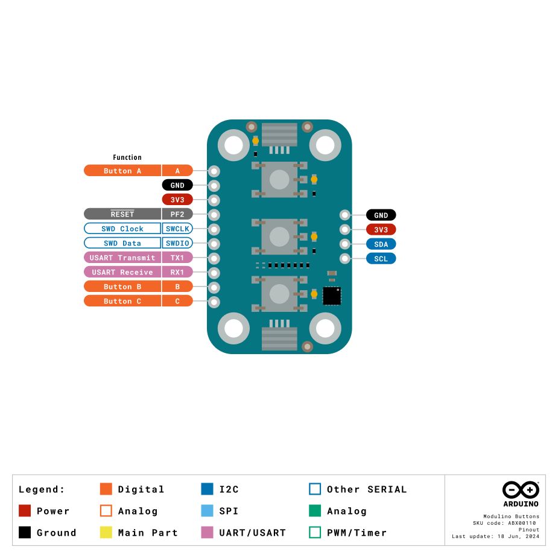
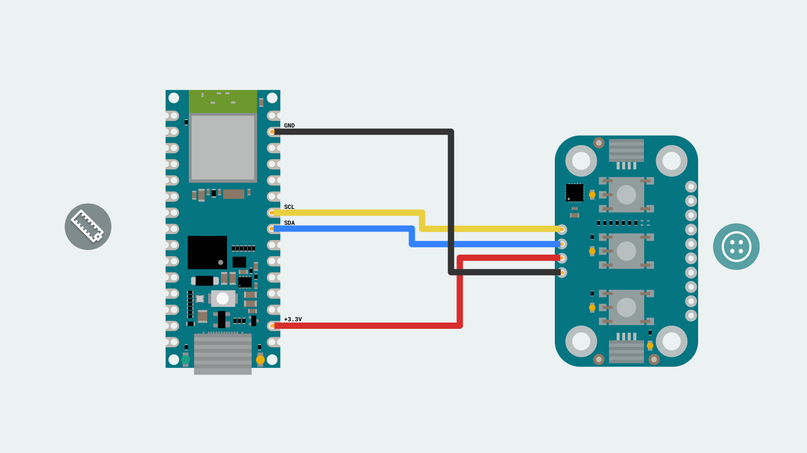

The Modulino Buttons is a modular sensor that provides tactile input and visual feedback, making it perfect to add interactive controls to your projects! 
The Modulino form factor is shaped with two QWIIC connectors and the I²C protocol integration, allowing the connection and programming of multiple modulinos in a very simple way. In addition to the QWIIC's connectors, the Modulinos also expose solderable pins that can be used in multiple ways and make them compatible with boards that are not QWIIC compatible.


Pressing a button pulls the signal LOW, and each button has an onboard pull-up resistor. The LEDs can be controlled independently through the onboard microcontroller.

The **Modulino Buttons** module uses three tactile buttons and LEDs, which do not have native I²C capabilities. Instead, the buttons and LEDs are controlled by the Modulino's onboard microcontroller (STM32C011F4U6TR). This microcontroller provides I²C communication, allowing for flexible reading of button states and control of the LEDs. One unique feature of this setup is the ability to change the I²C address via software. This means the address can be modified based on your application needs, making it adaptable to different system configurations. 

The default I²C address for the **Modulino Buttons** module is:

| Modulino I²C Address | Hardware I²C Address | Editable Addresses (HEX)                        |
|----------------------|----------------------|-------------------------------------------------|
| 0x7C                 | 0x3E                 | Any custom address (via software configuration) |

When scanning for I²C address on the bus, you might find the modulino using the **Hardware I²C Address**. However, you should always use the **Modulino I²C Address** when using the official Modulino library.
Later in this article we teach how to [change the address](#how-to-change-i2c-address).

## Pinout

The tactile buttons and LEDs are the core components of this module. These input and output devices are controlled by an onboard STM32 microcontroller, which supports digital communication (I²C), meaning it connects directly to the I²C bus on the module without requiring additional conversion circuitry.



### Input/Output Headers

| Pin      | Function        |
|----------|-----------------|
| Button A | Button A Signal |
| Button B | Button B Signal |
| Button C | Button C Signal |
| RX1      | UART Receive    |
| TX1      | UART Transmit   |
| SWDIO    | SWD Data        |
| SWCLK    | SWD Clock       |
| PF2      | NRST            |

**Button A/B/C** – These pins connect directly to the three tactile buttons on the board.
**RX1: UART Receive** – Used for receiving data over UART communication.
**TX1: UART Transmit** – Used for transmitting data over UART communication.
**SWDIO: SWD Data** – Used for debugging, as part of the Serial Wire Debug (SWD) interface.
**SWCLK: SWD Clock** – Used for providing the clock signal in the SWD interface.
**PF2: NRST** – The reset pin for the microcontroller, which can be used to reset the system.

### 1x4 Header (I2C)

The pinout for the Modulino Buttons is shown below. While the recommended connection method is via the QWIIC connectors, this solderable header provides a connection option when using the modulino with a non-QWIIC compatible board.

| Pin   | Function     |
|-------|--------------|
| GND   | Ground       |
| 3.3 V | Power Supply |
| SDA   | I²C Data     |
| SCL   | I²C Clock    |

## Power Specifications

The board is typically powered by +3.3 VDC when using the QWIIC interface as per the I²C standard.

| Parameter        | Condition         | Minimum | Typical     | Maximum | Unit |
|------------------|-------------------|---------|-------------|---------|------|
| Supply Voltage   | -                 | 2.3     | 3.3 (QWIIC) | 3.6     | V    |
| LED Current Draw | Single LED Active | -       | 2.5         | -       | mA   |

The module includes a power LED that draws 1 mA and turns on as soon as it is powered. J1 (Qwiic connector), J2 (Qwiic connector), and the headers all share the same power branch. The power distribution of the module is therefore as follows:


## Schematic

The Modulino Buttons uses a simple circuit, as shown in the schematic below:


The main components are the **three tactile buttons**, **three user-programmable LEDs** and the **STM32C011F4U6TR** microcontroller (U1), which handles button state reading, LED control, as well as I²C communication.
You can connect to the I²C pins (SDA and SCL) using either the **QWIIC connectors** (J1 and J2, this is the recommended method) or the **solderable pins** (J4). The board runs on **3.3V**, which comes from the QWIIC cable or the **3V3 pin** on J4.
There's also a small power LED indicator that lights up when the board is on.
You can grab the full schematic and PCB files from the [Modulino Buttons](https://docs.arduino.cc/hardware/modulinos/modulino-buttons) product page.

## How To Connect Your Modulino

The easiest and most reliable way to connect your Modulino is through the QWIIC Connect System. It’s plug-and-play, uses standard I²C, and makes it easy to join multiple modules. If your board supports QWIIC, this is the recommended way to go. 
Note that the dedicated I²C pins will differ from board to board meaning it is always a good idea to check your specific model.

 

## QWIIC Connector
Whenever available, the **QWIIC Connect System** is the preferred method. Connecting to the Modulino is extremely simple, just use a standard QWIIC cable to connect your board to either of the QWIIC connectors on the Modulino. Because the cable and connectors are polarized, there is no need to worry about accidentally swapping connections.
QWIIC is a plug-and-play I²C Connect System that uses standardized 4-pin connectors:
- GND  
- 3.3V  
- SDA (Data)  
- SCL (Clock)


The Modulino features two QWIIC connectors, which are internally connected in parallel. This means you can daisy-chain multiple modules easily by connecting additional QWIIC cables between them.

## Solderable Header
When QWIIC is not available, you can use the exposed solderable pins on the module. You can solder pins to the unpopulated pads; just remember the pinout provided in this guide to connect to the right pins of your board.



## Daisy-Chaining Multiple Modulinos

Regardless of whether you connect the first Modulino via QWIIC or through the solderable pins, you can still take advantage of the extra QWIIC connector to daisy-chain additional modules.
Each Modulino includes two QWIIC connectors wired in parallel, allowing you to connect one module to the next in a chain. As long as each module is configured with a unique I²C address, they can all communicate on the same bus.
This approach keeps your setup clean, modular, and expandable without adding extra wiring complexity.


***The number of modules you can connect will depend on what modules you are chaining together, as this system allows for multiple sensors from different manufacturers to be added. Also, the cables you use for these connections will play a significant role in the setup’s performance. Ensure your cables are properly connected and capable of handling the required data transfer.
Each module should have a unique address on a chain if you plan to address it independently. Later in this article we teach how to [change the address](#how-to-change-i2c-address). Multiple modules with the same address will cause conflicts on the I²C bus and will not allow you to address them individually.***


# How To Program Your Modulino

## Installing The Modulino Library
To program your Modulino it is recommended you use the official ```Modulino``` micropython library available [here](https://github.com/arduino/arduino-modulino-mpy). The library is fully compatible with the no **Arduino Lab for MicroPython**.
For information on installing the **Arduino Lab for MicroPython** please visit our [page](https://docs.arduino.cc/micropython/first-steps/install-guide/).

The ```Modulino``` library is not available by default on MicroPython devices hence installation is needed.
To simplify the process the [MicroPython Package Installer](https://github.com/arduino/lab-micropython-package-installer/releases) is recommended as it will provide a graphical interface to guide installation.
After installation, you should now be able to:

1. Open the tool.
2. Plug in your board to the computer.


If the board does not appear in the Detected Boards section, click Reload. If the board is still undetected, ensure no other programs (e.g., a code editor) are using the board's COM port.

4. Search for the ```Modulino``` package by filling in the text box on the search feature.
5. Click Install and wait for the installation confirmation.
6. Disconnect the board from the tool before returning to your code editor to avoid conflicts due to a busy COM port.


The module should now be includable in your program using:
```from modulino import ModulinoThermo```

# Getting Button Input and Controlling LEDs

Interacting with buttons using the `Modulino` library is straightforward. For the **Modulino Buttons** module, there are key functions to detect button presses and control the LEDs associated with each button.

## Detecting Button Presses

Each button supports different interactions:
- **`.on_button_a_press`**, **`.on_button_b_press`**, **`.on_button_c_press`**
   Triggers when a button is pressed.
- **`.on_button_a_long_press`**, **`.on_button_b_long_press`**, **`.on_button_c_long_press`**
   Triggers when a button is held down for a longer duration.
- **`.on_button_a_release`**, **`.on_button_b_release`**, **`.on_button_c_release`**
   Triggers when a button is released.
By default the Modulino library uses ```Wire1``` if your board model has a different pinout for the dedicated I²C pins you might have to edit it as instructed [here](https://github.com/arduino/arduino-modulino-mpy/tree/main/docs#%E2%84%B9%EF%B8%8F-using-3rd-party-boards). More information on **Wire** can be found [here](https://docs.arduino.cc/language-reference/en/functions/communication/wire/).

## Reading Button Inputs And Controlling LEDs

```python
from modulino import ModulinoButtons
from time import sleep

buttons = ModulinoButtons()

# Define button press actions
buttons.on_button_a_press = lambda : print("Button A pressed")
buttons.on_button_a_long_press = lambda : print("Button A long press")
buttons.on_button_a_release = lambda : print("Button A released")

buttons.on_button_b_press = lambda : print("Button B pressed")
buttons.on_button_b_long_press = lambda : print("Button B long press")
buttons.on_button_b_release = lambda : print("Button B released")

buttons.on_button_c_press = lambda : print("Button C pressed")
buttons.on_button_c_long_press = lambda : print("Button C long press")
buttons.on_button_c_release = lambda : print("Button C released")

# LED Sequence: Turn each LED on with a delay, then turn them off
buttons.led_a.on()
sleep(0.5)
buttons.led_b.on()
sleep(0.5)
buttons.led_c.on()
sleep(0.5)
buttons.set_led_status(False, False, False)  # Turn off all LEDs

while True:
    buttons_state_changed = buttons.update()
    
    if buttons_state_changed:
        led_a_status = buttons.is_pressed(0)  # Turn LED A on if button A is pressed
        led_b_status = buttons.is_pressed(1)  # Turn LED B on if button B is pressed
        led_c_status = buttons.is_pressed(2)  # Turn LED C on if button C is pressed
        buttons.set_led_status(led_a_status, led_b_status, led_c_status)
```

### How To Change Address

A sketch is also available included with the library named `AddressChanger` and also available [here](https://github.com/arduino/arduino-modulino-mpy/blob/main/examples/change_address.py). This sketch changes the I2C address at a software level on the Module's microcontroller.

- Connect the module to your board via I2C, ensuring no other modules are in the chain.
- Run the script in a MicroPython environment.
- Follow the on-screen instructions (REPL) to select the device and enter a new address. Valid I²C addresses range from 0x08 to 0x77 (7-bit values in hexadecimal format, e.g., 0x42).
- The script will attempt to change the address and confirm success.

To keep track of the address in use, the module has a white rectangle on the back. Feel free to use this to write the address that was chosen.

When using a custom address in your MicroPython sketch, you'll need to specify this address when creating the module object. For example:
```python
buttons_module = ModulinoButtons(address=0x45)  # Replace 0x45 with your specific address
```

# Troubleshooting

## Buttons Not Responding
If your Modulino's power LED isn't on or the buttons aren't responsive, first check that the board is properly connected:
- Ensure both the board and the Modulino are connected to your computer, and that the power LEDs on both are lit.
- If the issue persists, make sure the Qwiic cable is properly clicked into place.

## Library Not Installed Properly
If you encounter an issue with the `import ModulinoButtons` command, verify that the Modulino library is correctly installed:
- Check your library installer to ensure the library is installed and up-to-date.
- Re-install the library through the Library Manager.

## LEDs Not Working
If the LEDs aren't lighting up as expected, make sure:
- The correct LED states are being set in your code (true for on, false for off).
- All exposed electronics are not touching any conductive surfaces, as this could interfere with the operation.

# Conclusion

The **Modulino Buttons** is a digital input and output device that communicates over I²C and follows the Modulino form factor. It includes standard Qwiic connectors for quick, solderless connections and easy daisy-chaining with other modules. Paired with the Modulino library, it makes detecting button presses and controlling LEDs straightforward, allowing you to focus on experimenting or building your system logic. It's a small, reliable module suited for both user interfaces and interactive control systems.

# What Is Next?

Now that you've learned how to use your Modulino Buttons, you're all set to integrate it into your projects!
- Create a simple menu system where each button performs a different function.
- Build a game controller for a simple arcade-style game.
- Use the buttons to control other Modulino devices in your project.
- Design an interactive installation where button presses trigger different visual and audio effects.