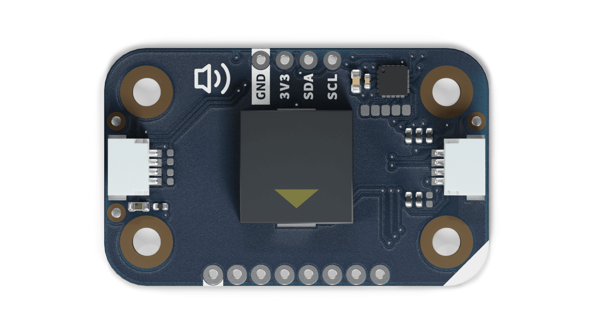
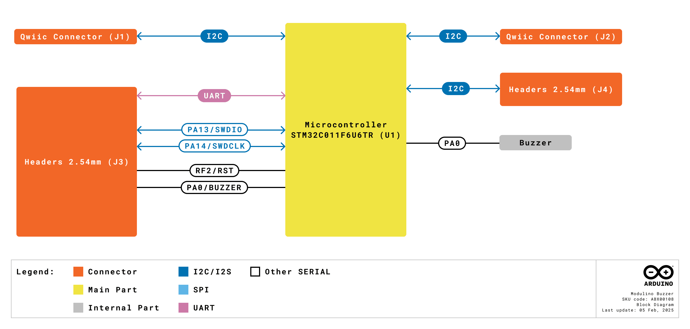

# Description
The Modulino® Buzzer, powered by an on-board **STM32C011F4** microcontroller, provides a compact and versatile way to generate sound alerts and tones through I2C control. Perfect for audible notifications, alarm systems, or simple musical applications in IoT and maker projects.

# Target Areas
Maker, beginner, education

# Contents
## Application Examples

- **Audible Alerts**
  Integrate a buzzer notification when a sensor reading crosses a threshold (e.g., temperature limit, motion detected).

- **Alarm & Security Systems**
  Produce warning tones in response to environment triggers or user-defined events.

- **Interactive Learning Tools**
  Combine with other Modulino® nodes (e.g., buttons, sensors) to create hands-on educational projects showcasing real-time sound feedback.

## Features
- **PKLCS1212E4001** buzzer controlled by an **STM32C011F4** microcontroller over I2C (Qwiic).
- Operates at **3.3 V** (in line with Qwiic standards, 2.0–3.6 V MCU range).
- **SWD** header for optional reprogramming or custom sound logic.
- Ideal for **alarm tones**, **status beeps**, or **simple audio feedback**.

### Contents
| **SKU**    | **Name**          | **Purpose**                               | **Quantity** |
| ---------- | ----------------- | ----------------------------------------- | ------------ |
| ABX00108   | Modulino® Buzzer  | Produce sounds or alerts via I2C control | 1            |
|            | I2C Qwiic cable   | Compatible with the Qwiic standard       | 1            |

## Related Products
- **SKU: ASX00027** – [Arduino® Sensor Kit](https://store.arduino.cc/products/arduino-sensor-kit)
- **SKU: K000007** – [Arduino® Starter Kit](https://store.arduino.cc/products/arduino-starter-kit-multi-language)  
- **SKU: AKX00026** – [Arduino® Oplà IoT Kit](https://store.arduino.cc/products/opla-iot-kit)

## Rating

### Recommended Operating Conditions
- **Microcontroller supply range:** 2.0 V – 3.6 V (STM32C011F4)
- **Powered at 3.3 V** through the Qwiic interface (in accordance with the Qwiic standard)
- **Operating temperature:** –40 °C to +85 °C

**Typical current consumption:**
- ~6.4 mA when buzzer is active

## Power Tree
The power tree for the Modulino® node can be consulted below:

## Block Diagram

This module features an STM32C011F4 microcontroller that drives a PKLCS1212E4001 buzzer. It communicates with the host over I2C (Qwiic). Advanced users can reprogram the MCU for custom audio patterns or logic.

## Functional Overview
The Modulino® Buzzer node receives sound commands or frequency/tone data via I2C. The STM32C011F4 microcontroller then drives the buzzer, producing audible tones or beeps. For more advanced usage, users can re-flash the firmware via SWD to generate custom waveforms or integrate additional logic.

### Technical Specifications (Module-Specific)
| **Specification**     | **Details**                                     |
| --------------------- | ----------------------------------------------- |
| **Microcontroller**   | STM32C011F4                                     |
| **Actuator**          | PKLCS1212E4001 buzzer                           |
| **Supply Voltage**    | Min: 2.0 V, Max: 3.6 V                          |
| **Power Consumption** | ~6.4 mA (buzzer active)                         |
| **Communication**     | I2C (Qwiic), SWD, optional UART if reprogrammed |

### Pinout

**Qwiic / I2C (1×4 Header)**  
| **Pin** | **Function**              |
|---------|---------------------------|
| GND     | Ground                   |
| 3.3 V   | Power Supply (3.3 V)     |
| SDA     | I2C Data                 |
| SCL     | I2C Clock                |

These pads and the Qwiic connectors share the same I2C bus at 3.3 V.

**Additional 1×8 Header (Buzzer & MCU Signals)**
| **Pin** | **Function**   |
|---------|----------------|
| GND    | Ground          |
| 3V3    | 3.3 V Power      |
| RESET  | Reset           |
| SWCLK  | SWD Clock       |
| SWDIO  | SWD Data        |
| TX1    | USART Transmit  |
| RX1    | USART Receive   |
| PA0    | Buzzer          |

**Note:** You can drive the buzzer with custom signals (PWM supplied to the PA0 pin) or reprogram the STM32C011F4 via SWD for alternate modes or advanced functionality.

### Power Specifications
- **Nominal operating voltage:** 3.3 V via Qwiic
- **MCU voltage range:** 2.0 V–3.6 V

### Mechanical Information

- Board dimensions: 41 mm × 25.36 mm
- Thickness: 1.6 mm (±0.2 mm)
- Four mounting holes (Ø 3.2 mm)
  - Hole spacing: 16 mm vertically, 32 mm horizontally

### I2C Address Reference
| **Board Silk Name** | **Sensor/Actuator** | **Modulino® I2C Address (HEX)** | **Editable Addresses (HEX)**          | **Hardware I2C Address (HEX)** |
|---------------------|---------------------|--------------------------------|---------------------------------------|--------------------------------|
| MODULINO BUZZER     | 1× Buzzer          | 0x3C                           | Any custom address (via FW config)    | 0x1E                           |

**Note:** Default address is **0x3C**, but custom firmware can reassign it. Check your library or code for details.

#### Pull-up Resistors

The module has pads for optional I2C pull-up mounting in both data lines. No resistors are mounted by default but in case the resistors are need 4.7 K resistors in an SMD 0402 format are recommended.

These are positioned near the Qwiic connector on the power LED side.

## Device Operation
By default, the Modulino® Buzzer node responds to I2C commands to produce tones or beep patterns. You can integrate it with the Arduino IDE or any 3.3 V microcontroller environment. Advanced users may flash custom code via the SWD header to implement unique waveforms or logic.

# Certifications
## Certifications Summary

| **Certification** | **Status** |
|:-----------------:|:----------:|
|  CE/RED (Europe)  |     Yes    |
|     UKCA (UK)     |     Yes    |
|     FCC (USA)     |     Yes    |
|    IC (Canada)    |     Yes    |
|        RoHS       |     Yes    |
|       REACH       |     Yes    |
|        WEEE       |     Yes    |

## Declaration of Conformity CE DoC (EU)

We declare under our sole responsibility that the products above are in conformity with the essential requirements of the following EU Directives and therefore qualify for free movement within markets comprising the European Union (EU) and European Economic Area (EEA).

## Declaration of Conformity to EU RoHS & REACH 211 01/19/2021

Arduino boards are in compliance with RoHS 2 Directive 2011/65/EU of the European Parliament and RoHS 3 Directive 2015/863/EU of the Council of 4 June 2015 on the restriction of the use of certain hazardous substances in electrical and electronic equipment.

| Substance                              | **Maximum limit (ppm)** |
|----------------------------------------|-------------------------|
| Lead (Pb)                              | 1000                    |
| Cadmium (Cd)                           | 100                     |
| Mercury (Hg)                           | 1000                    |
| Hexavalent Chromium (Cr6+)             | 1000                    |
| Poly Brominated Biphenyls (PBB)        | 1000                    |
| Poly Brominated Diphenyl ethers (PBDE) | 1000                    |
| Bis(2-Ethylhexyl) phthalate (DEHP)     | 1000                    |
| Benzyl butyl phthalate (BBP)           | 1000                    |
| Dibutyl phthalate (DBP)                | 1000                    |
| Diisobutyl phthalate (DIBP)            | 1000                    |

Exemptions: No exemptions are claimed.

Arduino Boards are fully compliant with the related requirements of European Union Regulation (EC) 1907 /2006 concerning the Registration, Evaluation, Authorization and Restriction of Chemicals (REACH). We declare none of the SVHCs (https://echa.europa.eu/web/guest/candidate-list-table), the Candidate List of Substances of Very High Concern for authorization currently released by ECHA, is present in all products (and also package) in quantities totaling in a concentration equal or above 0.1%. To the best of our knowledge, we also declare that our products do not contain any of the substances listed on the "Authorization List" (Annex XIV of the REACH regulations) and Substances of Very High Concern (SVHC) in any significant amounts as specified by the Annex XVII of Candidate list published by ECHA (European Chemical Agency) 1907 /2006/EC.

## FCC WARNING

This device complies with part 15 of the FCC Rules.

Operation is subject to the following two conditions: 

(1) This device may not cause harmful interference, and (2) this device must accept any interference received, including interference that may cause undesired operation.

## IC Caution

This device complies with Industry Canada licence-exempt RSS standard(s). 

Operation is subject to the following two conditions: 

(1) This device may not cause interference, and (2) this device must accept any interference, including interference that may cause undesired operation of the device.

## Conflict Minerals Declaration

As a global supplier of electronic and electrical components, Arduino is aware of our obligations with regard to laws and regulations regarding Conflict Minerals, specifically the Dodd-Frank Wall Street Reform and Consumer Protection Act, Section 1502. Arduino does not directly source or process conflict minerals such as Tin, Tantalum, Tungsten, or Gold. Conflict minerals are contained in our products in the form of solder or as a component in metal alloys. As part of our reasonable due diligence, Arduino has contacted component suppliers within our supply chain to verify their continued compliance with the regulations. Based on the information received thus far we declare that our products contain Conflict Minerals sourced from conflict-free areas.

# Company Information

| Company name    | Arduino SRL                                   |
|-----------------|-----------------------------------------------|
| Company Address | Via Andrea Appiani, 25 - 20900 MONZA（Italy)  |

# Reference Documentation

| Ref                       | Link                                                                                                                                                                                           |
| ------------------------- | ---------------------------------------------------------------------------------------------------------------------------------------------------------------------------------------------- |
| Arduino IDE (Desktop)     | [https://www.arduino.cc/en/Main/Software](https://www.arduino.cc/en/Main/Software)                                                                                                             |
| Arduino Courses           | [https://www.arduino.cc/education/courses](https://www.arduino.cc/education/courses)                                                                                                           |
| Arduino Documentation     | [https://docs.arduino.cc/](https://docs.arduino.cc/)                                                                                                           |
| Arduino IDE (Cloud)       | [https://create.arduino.cc/editor](https://create.arduino.cc/editor)                                                                                                                           |
| Cloud IDE Getting Started | [https://docs.arduino.cc/cloud/web-editor/tutorials/getting-started/getting-started-web-editor](https://docs.arduino.cc/cloud/web-editor/tutorials/getting-started/getting-started-web-editor) |
| Project Hub               | [https://projecthub.arduino.cc/](https://projecthub.arduino.cc/)                                                                                                                               |
| Library Reference         | [https://github.com/arduino-libraries/](https://github.com/arduino-libraries/)                                                                                                                 |
| Online Store              | [https://store.arduino.cc/](https://store.arduino.cc/)                                                                                                                                         |

# Revision History
| **Date**   | **Revision** | **Changes**                                                   |
| ---------- | ------------ | ------------------------------------------------------------- |
| 01/07/2025 | 4            | Certification                                                 |
| 17/06/2025 | 3            | Nomenclature updates                                          |
| 23/05/2025 | 2            | Fixed pinout table, power info, and unrelated characteristics |
| 14/05/2025 | 1            | First release                                                 |
