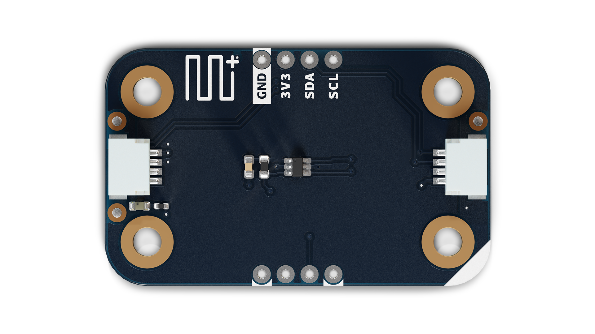
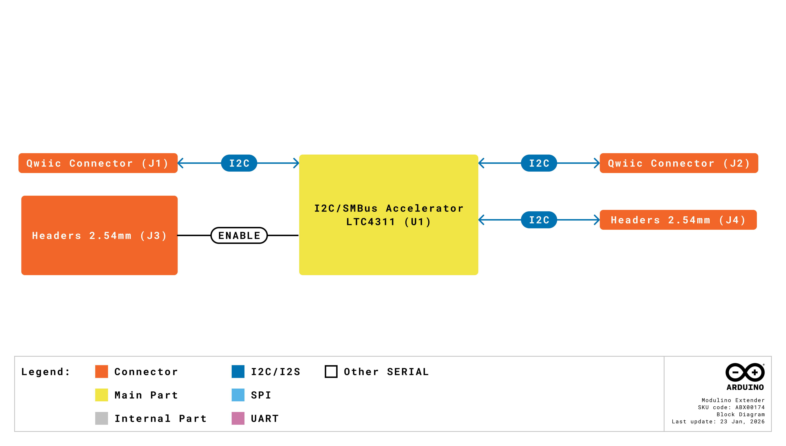
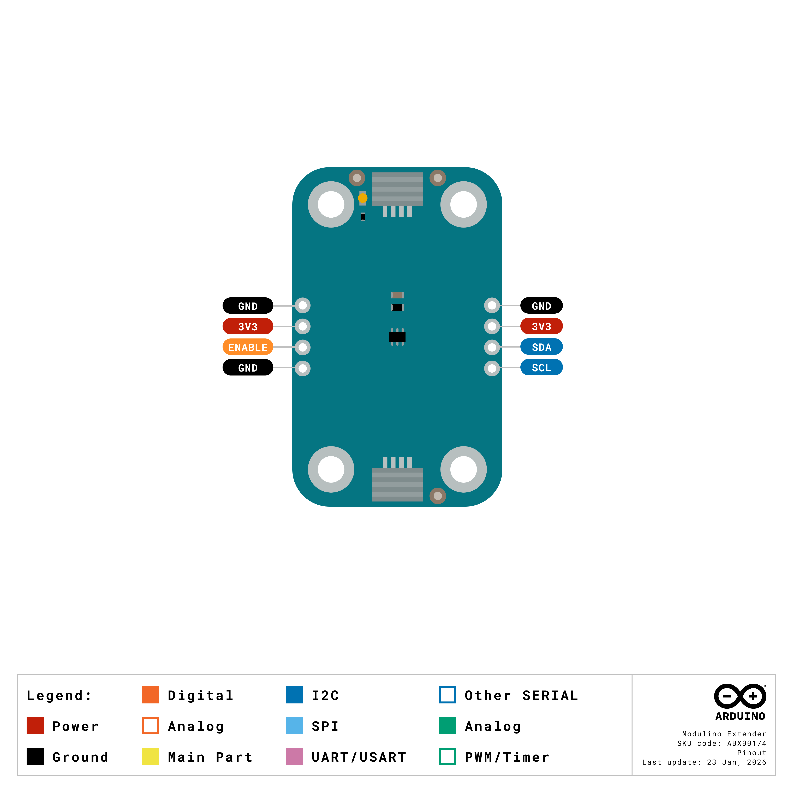
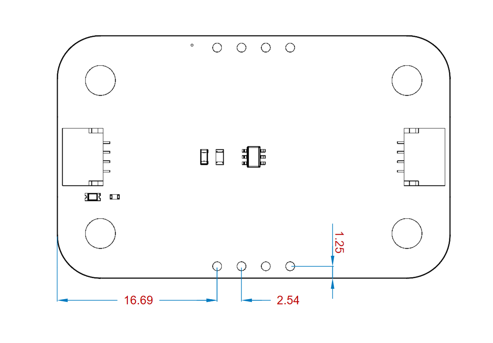

# Description
The Modulino Extender features the LTC4311 I2C accelerator, enabling reliable I2C communication over long cable distances and with high-capacitance loads. By providing boosted pull-up current during bus transitions, this transparent module allows extended cable runs up to 30 meters while maintaining signal integrity and communication speed.

# Target Areas
Maker, beginner, education, advanced prototyping

# Contents
## Application Examples

- **Long-Distance Sensor Networks**
  Connect sensors and modules over extended cable runs (tested up to 30 m).

- **High-Capacitance Systems**
  Maintain reliable I2C communication when bus capacitance exceeds the standard 400 pF limit.

- **Remote Installations**
  Place sensors and actuators at greater distances from the main controller for flexible project layouts.

## Features
- **LTC4311** I2C/SMBus accelerator for enhanced signal integrity.
- **Transparent operation** requiring no address configuration or special commands.
- **Boosted pull-up current** during positive bus transitions for fast edge rates.
- Supports bus capacitances **beyond 400 pF** standard limit.
- **Wide supply voltage range:** 1.6 V – 5.5 V.
- **Two 1×4 headers** (not mounted) for optional direct connections.
- **Two unpopulated pull-up resistor pads** for additional customization.
- Operates at **3.3 V** via the Qwiic interface.

### Contents
| **SKU**    | **Name**              | **Purpose**                                    | **Quantity** |
| ---------- | --------------------- | ---------------------------------------------- | ------------ |
| ABX00174   | Modulino Extender    | I2C signal accelerator for long cables         | 1            |
|            | I2C Qwiic cable       | Compatible with the Qwiic standard             | 1            |

## Related Products
- **SKU: ASX00027** – [Arduino® Sensor Kit](https://store.arduino.cc/products/arduino-sensor-kit)
- **SKU: K000007** – [Arduino® Starter Kit](https://store.arduino.cc/products/arduino-starter-kit-multi-language)
- **SKU: AKX00026** – [Arduino® Oplà IoT Kit](https://store.arduino.cc/products/opla-iot-kit)

## Rating

### Recommended Operating Conditions
- **Supply voltage:** 1.6 V – 5.5 V (LTC4311)
- **Powered at 3.3 V** through the Qwiic interface (in accordance with the Qwiic standard)
- **Operating temperature:** –40 °C to +85 °C
- **Maximum I2C speed:** Up to 400 kHz (supports standard and fast-mode)

**Typical current consumption:**
- LTC4311I supply current: ~200 µA typical
- Additional current during bus transitions for accelerated pull-up

## Power Tree
The power tree for the Modulino node can be consulted below:

## Block Diagram
This module features an LTC4311 I2C accelerator that sits transparently between I2C devices. It detects bus transitions and provides boosted current to speed up rising edges, improving signal integrity for long cables and high-capacitance loads.

## Functional Overview
The Modulino Extender solves a common problem in I2C systems: signal degradation over long cables or with many connected devices. Standard I2C pull-up resistors provide constant current, resulting in slow rise times when bus capacitance is high. The LTC4311 monitors the I2C bus and injects additional pull-up current only during positive transitions (low-to-high), significantly increasing the slew rate and maintaining square waveforms. This acceleration is transparent to the I2C protocol and requires no configuration. The device automatically handles both standard-mode (100 kHz) and fast-mode (400 kHz) I2C communication. Testing has confirmed reliable operation with cables up to 30 m in length.

### Technical Specifications (Module-Specific)
| **Specification**       | **Details**                                     |
| ----------------------- | ----------------------------------------------- |
| **I2C Accelerator**     | LTC4311ISC6#TRMPBF                              |
| **Supply Voltage**      | Min: 1.6 V, Max: 5.5 V                          |
| **Supply Current**      | ~200 µA typical                                 |
| **I2C Speed**           | Up to 400 kHz (Fast-mode)                       |
| **Bus Capacitance**     | Supports loads beyond standard 400 pF limit     |
| **Operation Mode**      | Transparent (no addressing required)            |
| **Communication**       | I2C pass-through                                |
| **Enable Pin**          | Optional control for power-down mode            |

### Pinout

**Qwiic Connectors (2×, 1×4 each)**
| **Pin** | **Function**              |
|---------|---------------------------|
| GND     | Ground                   |
| 3.3 V   | Power Supply (3.3 V)     |
| SDA     | I2C Data                 |
| SCL     | I2C Clock                |

The Extender sits between two Qwiic connectors, transparently accelerating signals passing through.

**Optional 1×4 Headers (2×, not mounted, holes provided)**

**Header 1 (Input Side)**
| **Pin** | **Function**   |
|---------|----------------|
| GND     | Ground         |
| 3V3     | 3.3 V Power    |
| SCL     | I2C Clock      |
| SDA     | I2C Data       |
| ENABLE  | Enable control |

**Header 2 (Output Side)**
| **Pin** | **Function**   |
|---------|----------------|
| GND     | Ground         |
| 3V3     | 3.3 V Power    |
| SCL     | I2C Clock      |
| SDA     | I2C Data       |
| ENABLE  | Enable control |

**Note:**
- Pull-up resistor pads (unpopulated) are available if additional pull-ups are needed.
- ENABLE pin can be used to disable the accelerator for low-power applications (active high).

### Power Specifications
- **Nominal operating voltage:** 3.3 V via Qwiic
- **LTC4311 voltage range:** 1.6 V–5.5 V

### Mechanical Information

- Board dimensions: 41 mm × 25.36 mm
- Thickness: 1.6 mm (±0.2 mm)
- Four mounting holes (Ø 3.2 mm)
  - Hole spacing: 16 mm vertically, 32 mm horizontally

### I2C Address Reference
The Modulino Extender has no I2C address. It operates transparently on the bus, accelerating signals without appearing as a device.

| **Board Silk Name**   | **Component**     | **Modulino I2C Address (HEX)** | **Notes** |
|-----------------------|-------------------|---------------------------------|-----------|
| MODULINO EXTENDER     | LTC4311           | N/A (transparent)               | No addressing required, pass-through operation |

## Device Operation
The Extender requires no configuration or addressing. Simply insert it into your I2C chain between the controller and remote devices. The LTC4311 automatically detects bus activity and provides accelerated pull-up during positive transitions. For best results, place the Extender close to the controller (beginning of the cable run) or in the middle of long cable segments.

### Performance Characteristics
Testing has demonstrated:
- Standard Qwiic cables: Improved waveform squareness, faster rise times
- 30 m cables: Maintains reliable communication
- Compatible with all Modulino modules and standard I2C devices

# Company Information

| Company name    | Arduino SRL                                   |
|-----------------|-----------------------------------------------|
| Company Address | Via Andrea Appiani, 25 - 20900 MONZA（Italy)  |

# Reference Documentation

| Ref                       | Link                                                                                                                                                                                           |
| ------------------------- | ---------------------------------------------------------------------------------------------------------------------------------------------------------------------------------------------- |
| Arduino IDE (Desktop)     | [https://www.arduino.cc/en/Main/Software](https://www.arduino.cc/en/Main/Software)                                                                                                             |
| Arduino Courses           | [https://www.arduino.cc/education/courses](https://www.arduino.cc/education/courses)                                                                                                           |
| Arduino Documentation     | [https://docs.arduino.cc/](https://docs.arduino.cc/)                                                                                                           |
| Arduino IDE (Cloud)       | [https://create.arduino.cc/editor](https://create.arduino.cc/editor)                                                                                                                           |
| Cloud IDE Getting Started | [https://docs.arduino.cc/cloud/web-editor/tutorials/getting-started/getting-started-web-editor](https://docs.arduino.cc/cloud/web-editor/tutorials/getting-started/getting-started-web-editor) |
| Project Hub               | [https://projecthub.arduino.cc/](https://projecthub.arduino.cc/)                                                                                                                          |
| Library Reference         | [https://github.com/arduino-libraries/](https://github.com/arduino-libraries/)                                                                                                            |
| Online Store              | [https://store.arduino.cc/](https://store.arduino.cc/)                                                                                                                                    |

# Revision History
| **Date**   | **Revision** | **Changes**       |
|------------|--------------|-------------------|
| 23/03/2026 | 1            | First release     |
