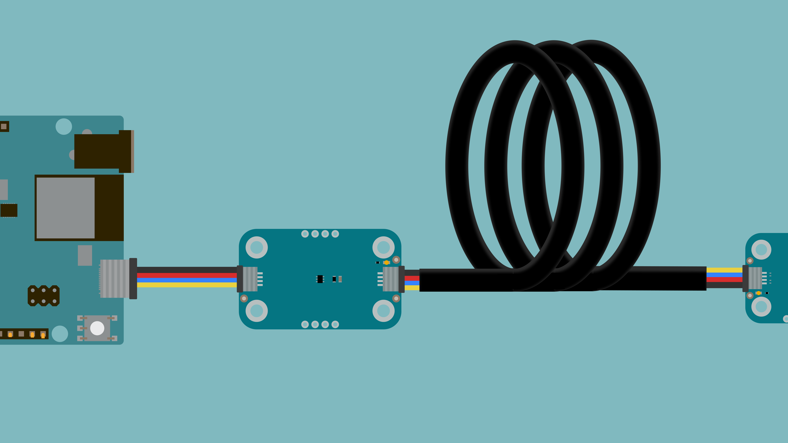
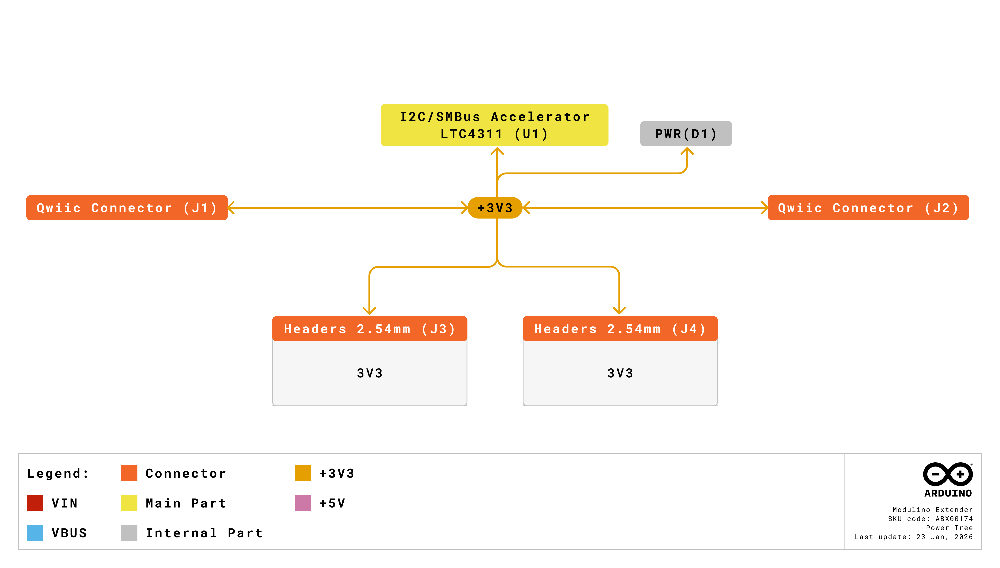

The Modulino Extender enables reliable I2C communication over extended distances up to 30 meters. Built around the LTC4311 I2C accelerator, it transparently boosts signal integrity for long cable runs and high-capacitance loads without requiring any configuration or addressing.

## Hardware Overview

### General Characteristics

The **Modulino Extender** features the **LTC4311** I2C accelerator, which monitors I2C bus transitions and provides boosted pull-up current during rising edges. This transparent operation maintains signal integrity over extended cables and with multiple devices.

| Specification | Details |
|---------------|---------|
| I2C Accelerator | LTC4311ISC6#TRMPBF |
| Supply Voltage | 1.6V to 5.5V |
| Operating Voltage | 3.3V (via Qwiic) |
| Supply Current | ~200 µA typical |
| I2C Speed | Up to 400 kHz (Fast-mode) |
| Bus Capacitance | Supports loads beyond 400 pF |
| Maximum Cable Distance | 30m (with Cat5e/Cat6 STP/FTP) |
| Operation Mode | Transparent (no addressing) |

The module enables:
- **Long-distance sensor networks** - Connect devices up to 30 meters away
- **High-capacitance systems** - Reliable communication when bus capacitance exceeds 400 pF
- **Remote installations** - Place sensors and actuators at greater distances

### Pinout


#### Qwiic Connectors (2×, 1×4 Each)

| Pin | Function |
|-----|----------|
| GND | Ground |
| 3.3V | Power Supply (3.3V) |
| SDA | I2C Data |
| SCL | I2C Clock |

The Extender sits between two Qwiic connectors, transparently accelerating signals passing through.

#### Optional 1×4 Headers (2×, Not Mounted)

**Header 1 (Input Side)**

| Pin | Function |
|-----|----------|
| GND | Ground |
| 3V3 | 3.3V Power |
| SCL | I2C Clock |
| SDA | I2C Data |
| ENABLE | Enable control |

**Header 2 (Output Side)**

| Pin | Function |
|-----|----------|
| GND | Ground |
| 3V3 | 3.3V Power |
| SCL | I2C Clock |
| SDA | I2C Data |
| ENABLE | Enable control |

**Note:** Pull-up resistor pads (unpopulated) are available if additional pull-ups are needed. ENABLE pin can be used to disable the accelerator for low-power applications (active high).

### Power Specifications

| Parameter | Condition | Minimum | Typical | Maximum | Unit |
|-----------|-----------|---------|---------|---------|------|
| Supply Voltage | - | 1.6 | 3.3 (QWIIC) | 5.5 | V |
| Supply Current | - | - | 200 | - | µA |

### Block Diagram


The Extender receives I2C signals through its input connectors. The **LTC4311** monitors bus transitions and injects additional pull-up current during positive transitions (low-to-high), significantly increasing the slew rate and maintaining square waveforms over long cables.

### Power Tree



Power is passed through from the input QWIIC connector to the output, with the LTC4311 drawing minimal current (~200 µA) for its operation.

## Why Use the Modulino Extender?

Standard I2C communication works well over short distances (typically under 1 meter), but signal quality degrades with longer cables due to increased capacitance. The Extender solves this by actively boosting the I2C signals, allowing you to place sensors and devices much farther from your controller.

The most common scenarios for using the Extender are:

**Long-Distance Installations**
When you need to monitor or control devices far from your main board, such as environmental sensors in different rooms, outdoor weather stations, or distributed industrial sensors. The Extender enables reliable communication up to 30 meters using Cat5e or Cat6 STP/FTP cables.

**High-Capacitance Networks**
If you're connecting many I2C devices or using multiple Hubs, the combined capacitance can exceed the I2C standard limit of 400 pF. The Extender's accelerated pull-up helps maintain signal integrity even with high capacitance.

**Flexible Project Layouts**
The Extender gives you freedom to organize your project without being constrained by cable length. Place actuators where they're needed, not where cable limits force you to.

## How to Connect

The Extender requires no configuration - simply insert it into your I2C chain:

1. Connect the first QWIIC cable from your Arduino board to the **input side** of the Extender
2. Connect the second QWIIC cable from the **output side** of the Extender to your sensor or device
3. For extended distances (up to 30m), use Cat5e or Cat6 STP/FTP cable between the Extender and remote device

**Recommended Placement:**
- For best results, place the Extender close to the controller (beginning of the cable run)
- Alternatively, place it in the middle of long cable segments
- Multiple Extenders can be used for very long runs or complex networks

## Programming with Arduino

**Important:** The Extender requires **NO code changes whatsoever**. It operates completely transparently, your existing code works exactly the same whether the Extender is present or not.

### No Programming Required

Unlike other Modulino nodes that require library calls and initialization, the Extender:
- Has **no I2C address** to configure
- Requires **no initialization** code
- Needs **no library** to function
- Works with **any I2C device** automatically

Simply connect it physically between your Arduino and your I2C devices. That's it.

### Using Your Existing Code

Any code you've already written for Modulino sensors or other I2C devices will work without modification. Here's an example showing that the code is identical with or without an Extender:

**Setup WITHOUT Extender:**
```
Arduino → (short cable) → Modulino Distance
```

**Setup WITH Extender:**
```
Arduino → (short cable) → Extender → (long cable up to 30m) → Modulino Distance
```

**The Code (identical in both cases):**
```arduino
#include <Arduino_Modulino.h>

ModulinoDistance distance;

void setup() {
  Serial.begin(115200);
  Modulino.begin();
  distance.begin();
}

void loop() {
  if (distance.update()) {
    Serial.println(distance.get());
  }
  delay(100);
}
```

**That's it.** The Extender transparently handles all signal acceleration. You don't call it, configure it, or even acknowledge its existence in code.

### What Actually Happens

While your code stays the same, the Extender is actively working in the background:
1. Your Arduino sends I2C signals as normal
2. The Extender detects rising edges on the I2C bus
3. It automatically injects extra current to speed up the signal transition
4. Your remote sensor receives clean, fast signals
5. The response travels back through the Extender the same way
6. Your Arduino receives the data as if the sensor were right next to it

All of this happens in hardware, completely transparent to your code.

## Cable Requirements

For reliable long-distance communication:

**Short Runs (< 1 meter):**
- Standard QWIIC cables work perfectly
- No special requirements

**Medium Runs (1-10 meters):**
- Use quality twisted-pair cable
- Shielded cable recommended

**Long Runs (10-30 meters):**
- **Required:** Cat5e or Cat6 cable
- **Required:** Shielded Twisted Pair (STP) or Foiled Twisted Pair (FTP)
- Keep cable runs away from sources of electrical noise
- Avoid running parallel to power lines

## Troubleshooting

### Communication Not Working

If your I2C devices aren't communicating through the Extender:
- Verify both QWIIC connections are secure
- Check that the Extender is receiving power (verify voltage at 3.3V pin if needed)
- Ensure cable length doesn't exceed 30 meters
- For long runs, confirm you're using Cat5e/Cat6 STP/FTP cable
- Test with a shorter cable to isolate whether it's a distance issue

### Intermittent Communication

If communication works sometimes but not always:
- Check cable quality, poor terminations can cause intermittent issues
- Verify cable shielding is intact and properly grounded
- Reduce cable length to test if it's a signal integrity issue
- Keep I2C cables away from noise sources (motors, power supplies, RF transmitters)
- Consider adding external pull-up resistors using the unpopulated pads

### Slow or Unreliable Performance

If devices respond slowly or unreliably:
- Reduce I2C bus speed if your application allows
- Check total bus capacitance, too many devices can still cause issues
- Consider using a Modulino Hub to segment your network
- For very long runs, place the Extender closer to the controller
- Verify all devices on the bus have unique addresses

## Technical Notes

### How It Works

The LTC4311 monitors the I2C bus for transitions. During normal operation (low-to-high transitions), it provides additional current drive to speed up the rise time. This active acceleration compensates for the capacitance added by long cables.

The acceleration is automatic and transparent:
- No I2C address required
- No configuration needed
- No special commands
- Works with any I2C device at standard or fast-mode speeds (up to 400 kHz)

### Performance Characteristics

Testing has demonstrated:
- Standard Qwiic cables: Improved waveform quality, faster rise times
- Cat5e/Cat6 cables up to 30m: Maintains reliable 400 kHz I2C communication
- Compatible with all Modulino modules and standard I2C devices
- Minimal power consumption (~200 µA)

### Multiple Extenders

You can use multiple Extenders in series for very long runs or complex topologies:
- Each Extender adds signal boost
- Total distance can exceed 30m with proper placement
- Monitor signal quality with oscilloscope for critical applications

## Conclusion

The Modulino Extender removes distance limitations from your I2C projects. Its transparent operation means you can focus on your application logic without worrying about signal integrity or bus acceleration. Simply insert it into your I2C chain and enjoy reliable communication over extended distances.

For more information and advanced usage, check out:
- [Modulino Extender Product Page](https://docs.arduino.cc/hardware/modulino-extender)
- [LTC4311 Datasheet](https://www.analog.com/en/products/ltc4311.html)
- [I2C Specification](https://www.nxp.com/docs/en/user-guide/UM10204.pdf)
