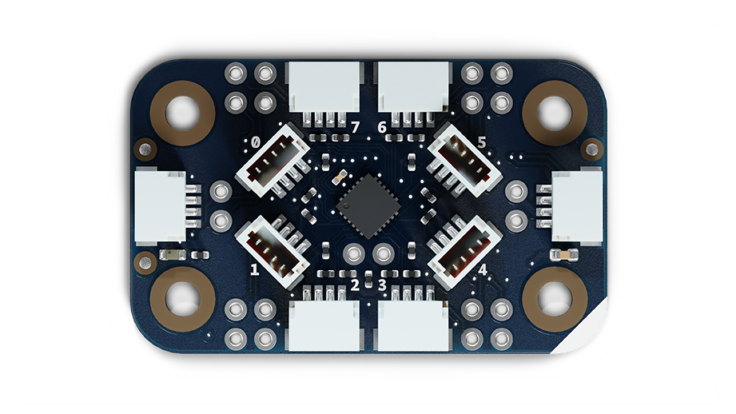
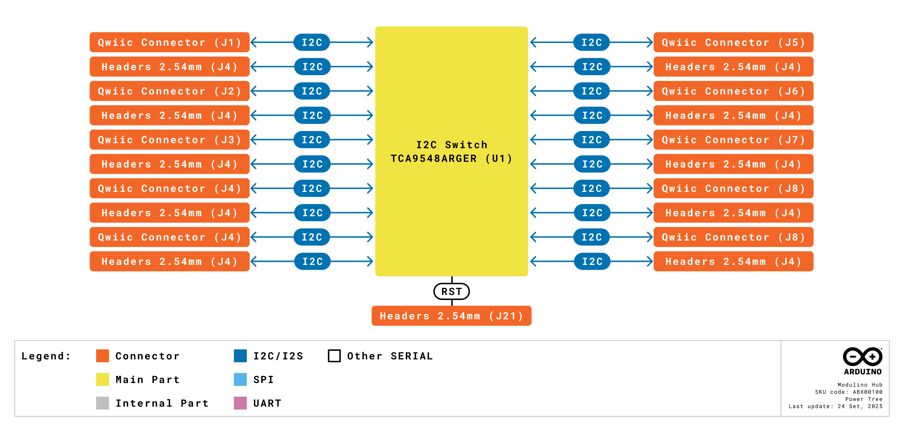
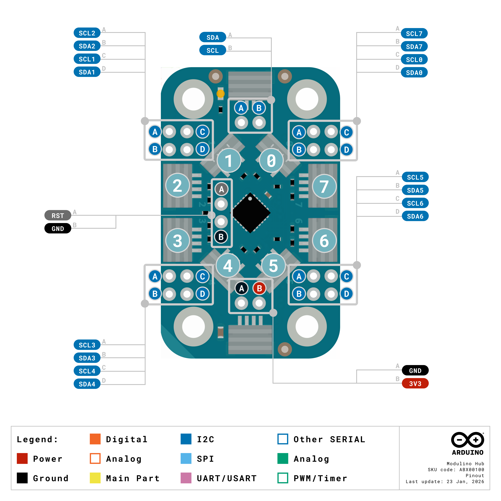
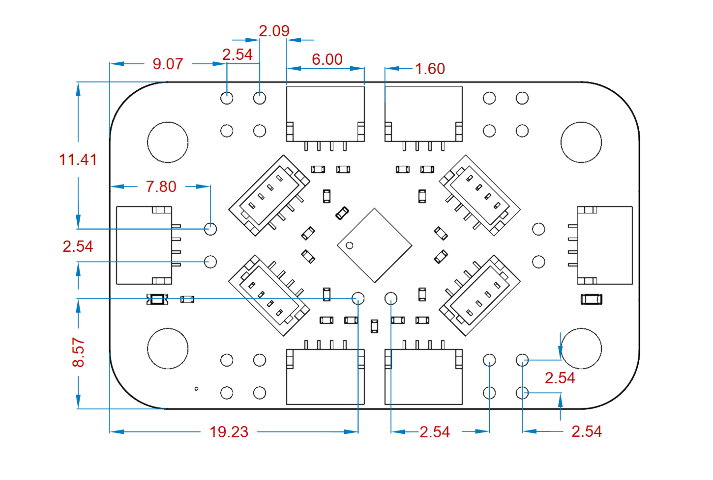
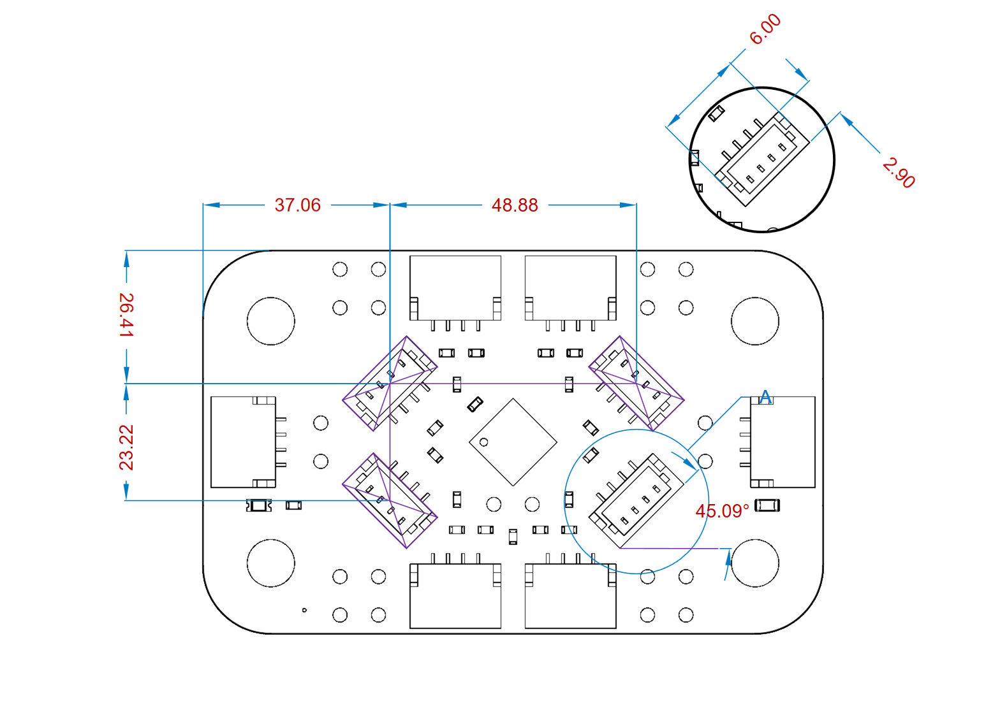
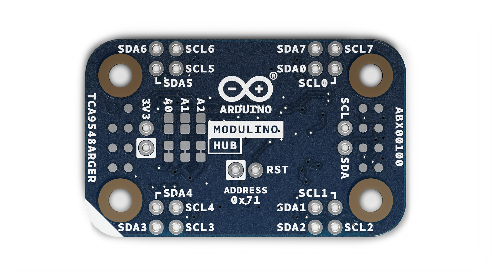

# Contents
## Features
- **TCA9548ARGER** I2C multiplexer with **eight independent channels**.
- Each channel includes **4.7 kΩ pull-up resistors** for reliable I2C operation.
- **Voltage translation** capability for mixed-voltage I2C systems.
- **Ten Qwiic connectors**: 2 main bus, 8 channel outputs (4 horizontal, 4 vertical).
- **Three address selection jumpers** allowing up to **8 Hubs** on the same bus (64 total channels).
- **Default I2C address 0x70** with seven additional addresses available.
- **Optional RESET pin** for manual or programmatic channel reset.
- Operates at **3.3 V** via the Qwiic interface.

### Contents
| **SKU**    | **Name**            | **Purpose**                                    | **Quantity** |
| ---------- | ------------------- | ---------------------------------------------- | ------------ |
| ABX00100   | Modulino Hub       | I2C multiplexer with 8 independent channels    | 1            |
|            | I2C Qwiic cable     | Compatible with the Qwiic standard             | 1            |

## Rating

### Recommended Operating Conditions
- **Supply voltage:** 3.3 V
- **Powered at 3.3 V** through the Qwiic interface (in accordance with the Qwiic standard)
- **Operating temperature:** –40 °C to +85 °C

**Typical current consumption:**
- TCA9548ARGER idle: ~3 µA
- Active operation: ~50 µA (varies with number of active channels)

## Power Tree
The power tree for the Modulino node can be consulted below:

## Block Diagram
This module features a TCA9548ARGER I2C multiplexer that creates eight independent I2C channels from a single main bus. Each channel can be individually enabled or disabled via I2C commands to the multiplexer.

## Functional Overview
The Modulino Hub acts as an intelligent I2C switch, routing the main I2C bus to any combination of its eight output channels. The TCA9548ARGER allows multiple channels to be active simultaneously or individually, controlled by writing to its configuration register. Each channel has independent 4.7 kΩ pull-up resistors to ensure signal integrity. This design solves the common problem of I2C address conflicts by isolating devices with identical addresses on separate channels.

### Technical Specifications (Module-Specific)
| **Specification**       | **Details**                                     |
| ----------------------- | ----------------------------------------------- |
| **I2C Multiplexer**     | TCA9548ARGER                                    |
| **Number of Channels**  | 8 independent I2C channels                      |
| **Pull-up Resistors**   | 4.7 kΩ on each channel (SDA and SCL)            |
| **Communication**       | I2C (Qwiic)                                     |
| **Address Range**       | 0x70–0x77 (selectable via jumpers)              |

### Pinout

**Main Qwiic Connectors (2×, 1×4 each)**
| **Pin** | **Function**              |
|---------|---------------------------|
| GND     | Ground                   |
| 3.3 V   | Power Supply (3.3 V)     |
| SDA     | I2C Data (main bus)      |
| SCL     | I2C Clock (main bus)     |

These two connectors allow daisy-chaining the Hub with other Modulino nodes on the main I2C bus.

**Channel Connectors**

**Horizontal Connectors (4×, on long sides)**
- Channel 2 (SC2/SD2)
- Channel 3 (SC3/SD3)
- Channel 6 (SC6/SD6)
- Channel 7 (SC7/SD7)

**Vertical Connectors (4×)**
- Channel 0 (SC0/SD0)
- Channel 1 (SC1/SD1)
- Channel 4 (SC4/SD4)
- Channel 5 (SC5/SD5)

Each channel connector provides: GND, 3.3 V, SDA (channel), SCL (channel)

**Optional Headers (not mounted, holes provided)**

**1×4 Main Bus Header**
| **Pin** | **Function**   |
|---------|----------------|
| GND     | Ground         |
| 3V3     | 3.3 V Power    |
| SDA     | I2C Data       |
| SCL     | I2C Clock      |

**1×2 Headers for Each Channel (8 total)**
Each provides access to that channel's SDA and SCL lines for custom connections.

**1×1 RESET Header**
Optional connection for manual or programmatic reset of the TCA9548ARGER.

**Note:**
- Address selection via three solder jumpers on the bottom of the board (A0, A1, A2).
- Default address is 0x70 (all jumpers open).
- Up to 8 Hubs can share the same main bus with different addresses.

### Power Specifications
- **Nominal operating voltage:** 3.3 V via Qwiic
- **TCA9548ARGER voltage range:** 1.65 V–3.6 V

### Mechanical Information

- Board dimensions: 41 mm × 25.36 mm
- Thickness: 1.6 mm (±0.2 mm)
- Four mounting holes (Ø 3.2 mm)
  - Hole spacing: 16 mm vertically, 32 mm horizontally

### I2C Address Reference
| **Board Silk Name** | **Component**     | **Modulino I2C Address (HEX)** | **Editable Addresses (HEX)**                | **Hardware I2C Address (HEX)** |
|---------------------|-------------------|---------------------------------|---------------------------------------------|--------------------------------|
| MODULINO HUB        | TCA9548ARGER      | 0x70 (default)                  | 0x70–0x77 (via solder jumpers A0, A1, A2)  | 0x70                           |

**Address Selection via Solder Jumpers:**

| **A2** | **A1** | **A0** | **Address** |
|--------|--------|--------|-------------|
| Open   | Open   | Open   | 0x70        |
| Open   | Open   | Closed | 0x71        |
| Open   | Closed | Open   | 0x72        |
| Open   | Closed | Closed | 0x73        |
| Closed | Open   | Open   | 0x74        |
| Closed | Open   | Closed | 0x75        |
| Closed | Closed | Open   | 0x76        |
| Closed | Closed | Closed | 0x77        |

**Note:**
- Default configuration (all jumpers open) uses address **0x70**.
- Three solder jumpers (A0, A1, A2) on the bottom of the board can be bridged to select different addresses.

# Company Information

| Company name    | Arduino SRL                                   |
|-----------------|-----------------------------------------------|
| Company Address | Via Andrea Appiani, 25 - 20900 MONZA（Italy)  |

# Reference Documentation

| Ref                       | Link                                                                                                                                                                                           |
| ------------------------- | ---------------------------------------------------------------------------------------------------------------------------------------------------------------------------------------------- |
| Arduino IDE (Desktop)     | [https://www.arduino.cc/en/Main/Software](https://www.arduino.cc/en/Main/Software)                                                                                                             |
| Arduino Courses           | [https://www.arduino.cc/education/courses](https://www.arduino.cc/education/courses)                                                                                                           |
| Arduino Documentation     | [https://docs.arduino.cc/](https://docs.arduino.cc/)                                                                                                           |
| Arduino IDE (Cloud)       | [https://create.arduino.cc/editor](https://create.arduino.cc/editor)                                                                                                                           |
| Cloud IDE Getting Started | [https://docs.arduino.cc/cloud/web-editor/tutorials/getting-started/getting-started-web-editor](https://docs.arduino.cc/cloud/web-editor/tutorials/getting-started/getting-started-web-editor) |
| Project Hub               | [https://projecthub.arduino.cc/](https://projecthub.arduino.cc/)                                                                                                                          |
| Library Reference         | [https://github.com/arduino-libraries/](https://github.com/arduino-libraries/)                                                                                                            |
| Online Store              | [https://store.arduino.cc/](https://store.arduino.cc/)                                                                                                                                    |

# Revision History
| **Date**   | **Revision** | **Changes**       |
|------------|--------------|-------------------|
| 23/03/2026 | 1            | First release     |
