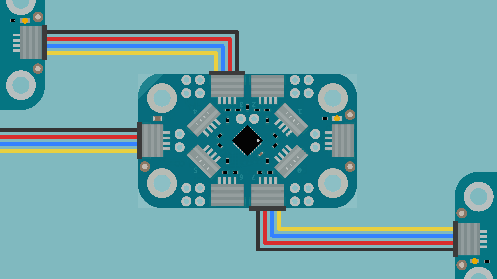
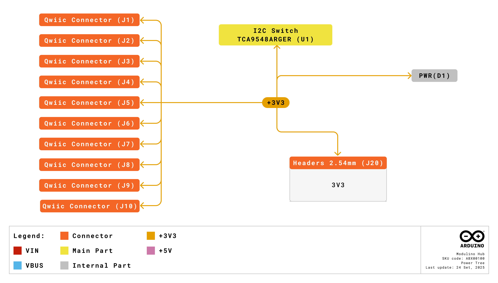
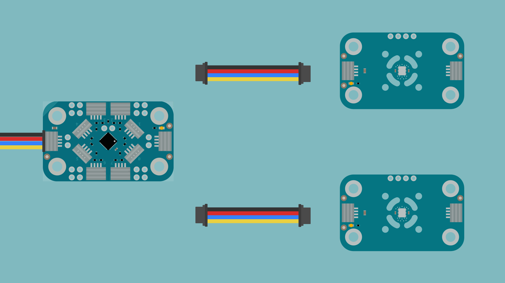

The Modulino Hub is an I2C multiplexer that expands your prototyping capabilities by providing eight independent I2C channels. When you need to connect multiple sensors with the same address or simply want to organize your I2C network more efficiently, the Hub acts as a traffic controller for your I2C communication.

## Hardware Overview

### General Characteristics

The **Modulino Hub** is built around the **TCA9548ARGER**, an 8-channel I2C switch that enables independent control of eight separate I2C buses. This allows you to connect multiple devices with identical addresses or create organized segments in your I2C network.

| Specification     | Details                       |
|-------------------|-------------------------------|
| Channels          | 8 independent I2C buses       |
| IC                | TCA9548ARGER                  |
| Power Supply      | 3.3 V                         |
| Interface         | I2C                           |
| Pull-up Resistors | 4.7kΩ on all 8 channels       |
| QWIIC Connectors  | 10 total (2 input + 8 output) |

The Hub includes built-in pull-up resistors on all eight channels, ensuring reliable communication without additional components. Each channel can be enabled independently through software, giving you complete control over which I2C buses are active.

The default I2C address for the **Modulino Hub** is:

| Modulino I2C Address | Hardware I2C Address | Configurable Addresses |
|----------------------|----------------------|------------------------|
| 0x70                 | 0x70                 | 0x70-0x77 (hardware)   |

### Pinout


The Hub features three types of QWIIC connectors:

#### Input Connectors (Modulino Chain)
- **2 horizontal connectors** on the short sides
- Connect to your main Modulino I2C chain
- Wired in parallel for daisy-chaining

#### Output Connectors - Horizontal (Channels 2, 3, 6, 7)
- **4 horizontal connectors** on the long sides
- TCA9548ARGER channels 2, 3, 6, 7
- Convenient for side-mounted connections

#### Output Connectors - Vertical (Channels 0, 1, 4, 5)
- **4 vertical connectors**
- TCA9548ARGER channels 0, 1, 4, 5
- Useful for stacking configurations

#### Optional Headers (Not Populated)

The Hub includes unpopulated header holes for advanced users:

| Header Type     | Pins                        |
|-----------------|-----------------------------|
| Power & Control | 3V3, GND, SDA, SCL          |
| Channel Pairs   | SDAx, SCLx for each channel |
| Reset           | RST pin access              |

### Power Specifications

| Parameter         | Condition             | Minimum | Typical     | Maximum | Unit |
|-------------------|-----------------------|---------|-------------|---------|------|
| Supply Voltage    | -                     | -       | 3.3 (QWIIC) | -       | V    |
| Operating Current | All channels inactive | -       | 1.5         | -       | mA   |
| Operating Current | All channels active   | -       | 3.5         | -       | mA   |

### Address Configuration

The Hub supports **hardware address configuration** through three solder jumpers on the bottom of the board:

| A2 | A1 | A0 | I2C Address    |
|----|----|----|----------------|
| L  | L  | L  | 0x70 (default) |
| L  | L  | H  | 0x71           |
| L  | H  | L  | 0x72           |
| L  | H  | H  | 0x73           |
| H  | L  | L  | 0x74           |
| H  | L  | H  | 0x75           |
| H  | H  | L  | 0x76           |
| H  | H  | H  | 0x77           |

This addressing scheme allows up to **8 Modulino Hubs** on the same I2C bus, providing a total of **64 independent I2C channels**.

### Block Diagram


The Hub receives I2C commands through its main input connectors. The TCA9548ARGER then routes communication to the selected channel(s), with each output having dedicated pull-up resistors for signal integrity.

### Power Tree



Power is distributed from the input QWIIC connectors to all eight output channels, maintaining consistent 3.3V across the entire network.

## Why Use the Modulino Hub?

The most common scenario for using the Hub is when you want to connect multiple identical sensors. Since I2C devices use addresses to identify themselves on the bus, having two sensors with the same address creates a conflict - your board can't tell them apart. The Hub solves this by letting you isolate each sensor on its own channel. When you want to read from a specific sensor, you simply select that channel, and only that sensor is connected to the main I2C bus.

Beyond solving address conflicts, the Hub helps organize larger projects. You can dedicate specific channels to different parts of your system - maybe all your environmental sensors on channels 0-2, and all your input devices on channels 3-5. This segmentation also helps with signal integrity on larger I2C networks, where long cable runs and many devices can cause capacitance issues.

If your project grows, you can add more Hubs. Each Hub provides eight additional channels, and up to eight Hubs can share the same I2C bus (using different addresses), giving you up to 64 independent I2C channels.

## How to Connect

### Basic Connection



1. Connect your Arduino board to one of the Hub's **input QWIIC connectors** (short sides)
2. Connect your Modulino sensors to any of the eight **output QWIIC connectors**
3. Power your board - the Hub will be ready to use

Here's a simple example using two temperature sensors connected to channels 0 and 1:

```arduino
#include <Modulino.h>

ModulinoHub hub;                      // Create Hub object (default address 0x70)
ModulinoThermo sensor1(hub.port(0));  // Temperature sensor on channel 0
ModulinoThermo sensor2(hub.port(1));  // Temperature sensor on channel 1

void setup() {
  Serial.begin(9600);
  Modulino.begin();
  sensor1.begin();
  sensor2.begin();
}

void loop() {
  // Read from sensor 1
  if (sensor1.update()) {
    Serial.print("Sensor 1 - ");
    Serial.print(sensor1.getTemperature());
    Serial.println(" °C");
  }

  // Read from sensor 2
  if (sensor2.update()) {
    Serial.print("Sensor 2 - ");
    Serial.print(sensor2.getTemperature());
    Serial.println(" °c");
  }

  delay(1000);
}
```

The Hub automatically handles channel selection when you call `update()` on each sensor. You don't need to manually switch channels - the library takes care of it.

### Multiple Hubs

When using multiple Hubs, configure their addresses using the solder jumpers before connecting:

1. Locate the three solder jumpers (A2, A1, A0) on the bottom
2. Bridge the appropriate jumpers to set your desired address
3. Connect the Hubs in a daisy-chain configuration

## Troubleshooting

### Hub Not Responding

If the Hub isn't detected on the I2C bus:
- Confirm you're using the correct I2C address (default 0x70)
- If using custom address jumpers, verify the correct bridges are soldered

### Devices on Channels Not Responding

If devices connected to Hub channels aren't responding:
- Ensure you've selected the correct channel before attempting communication
- Verify devices are connected to output connectors, not input connectors
- Check that the device works when connected directly (bypass the Hub)

### Address Conflicts with Multiple Hubs

If you're experiencing issues with multiple Hubs:
- Verify each Hub has a unique address configured via solder jumpers
- Document addresses on each Hub's white label area
- Scan the I2C bus to confirm all Hubs are detected at their configured addresses

### Communication Errors

If you're seeing I2C communication errors:
- Disable unused channels
- Keep QWIIC cable lengths reasonable
- Check that power supply can handle all connected devices

## What's Next?

Now that you understand how to use the Modulino Hub:
- Experiment with connecting multiple identical sensors
- Organize your Modulino network into logical segments
- Explore using multiple Hubs for large-scale projects
- Share your Hub configurations with the Arduino community
