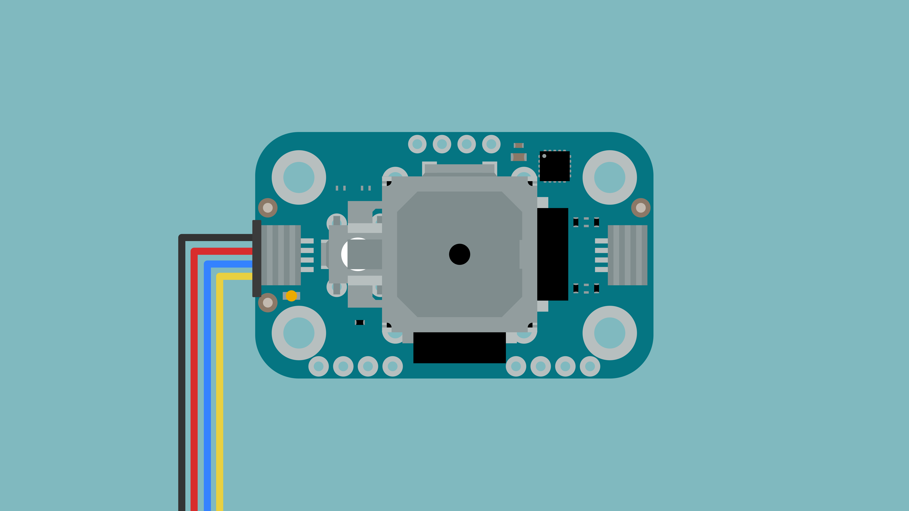
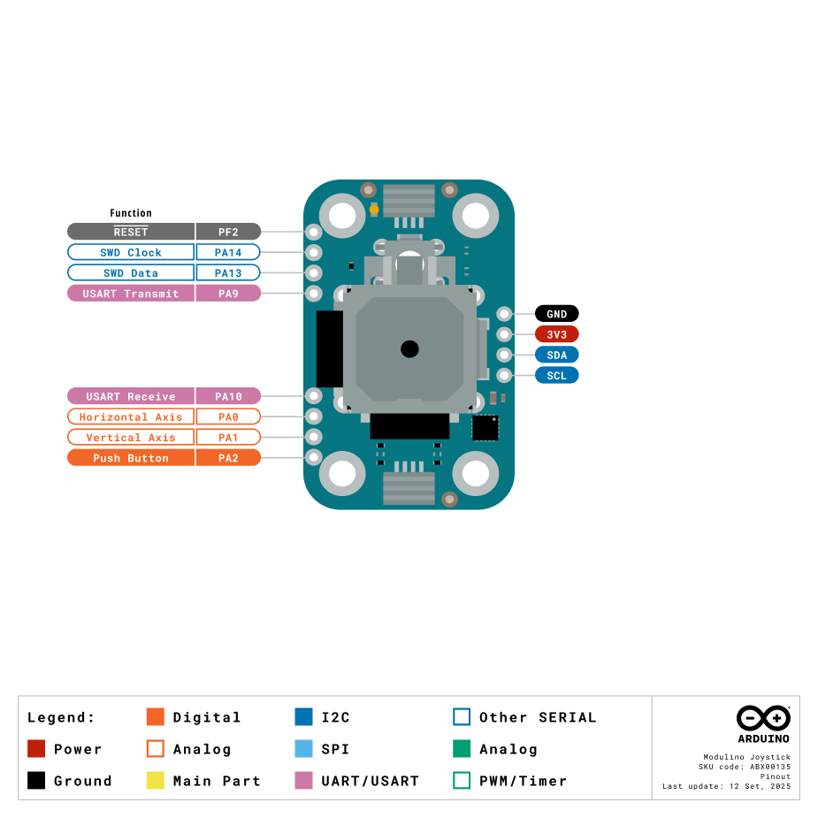

The Modulino Joystick is a modular input device that provides two-axis analogue control with an integrated push button, making it perfect to add intuitive directional input to your projects! It uses the standardised Modulino form factor with QWIIC connectors for easy integration.

## Hardware Overview

### General Characteristics

The Modulino Joystick features a two-axis analogue joystick with push button functionality:

| Parameter | Condition | Minimum | Typical | Maximum | Unit |
|-----------|-----------|---------|---------|---------|------|
| X-Axis Range | - | 0 | 2048 | 4095 | - |
| Y-Axis Range | - | 0 | 2048 | 4095 | - |
| Resolution | - | - | 12 | - | bit |

### Sensor Details

The **Modulino Joystick** module features an analogue joystick with two potentiometers (horizontal and vertical axes) and an integrated push button. The joystick does not have native I²C capabilities. Instead, the readings are processed by the Modulino's onboard microcontroller (STM32C011F4), which provides I²C communication.

One unique feature of this setup is the ability to change the I²C address via software, making it adaptable to different system configurations.

The default I²C address for the **Modulino Joystick** module is:

| Modulino I²C Address | Hardware I²C Address | Editable Addresses (HEX)                        |
|----------------------|----------------------|--------------------------------------------------|
| 0x40                 | 0x20                 | Any custom address (via software configuration) |

### Pinout



**Qwiic / I2C (1×4 Header)**
| **Pin** | **Function**              |
|---------|---------------------------|
| GND     | Ground                   |
| 3.3 V    | Power Supply (3.3 V)     |
| SDA     | I2C Data                 |
| SCL     | I2C Clock                |

These pads and the Qwiic connectors share the same I2C bus at 3.3 V.

**Additional 1×4 Header (MCU Debug Signals)**
| **Pin** | **Function**      |
|---------|-------------------|
| PF2     | RESET (NRST)      |
| SWCLK   | SWD Clock (PA14)  |
| SWDIO   | SWD Data (PA13)   |
| TX1     | USART Transmit (PA9) |

**1×4 Header (Joystick & MCU Signals)**
| **Pin** | **Function**              |
|---------|---------------------------|
| RX1     | USART Receive (PA10)      |
| PA0     | Joystick Horizontal Axis  |
| PA1     | Joystick Vertical Axis    |
| PA2     | Joystick Pushbutton       |

**Note:** The board is breadboard compatible with 1×4 headers spaced by 900 mil (22.86 mm). The joystick axes provide analogue values from 0-4095 (12-bit resolution), with centre position at approximately 2048.

### Power Specifications

| Parameter           | Condition | Typical | Unit |
|---------------------|-----------|---------|------|
| Operating Voltage   | -         | 3.3     | V    |
| Current Consumption | -         | ~3.4    | mA   |

The module includes a power LED that draws 1 mA and turns on as soon as it is powered.

### Schematic

The Modulino Joystick features an analogue joystick controlled through a microcontroller for I²C communication.

The main components are the analogue joystick with two potentiometers and the **STM32C011F4** microcontroller (U1), which reads the analogue values and handles I²C communication.

You can connect to the I²C pins (SDA and SCL) using either the **QWIIC connectors** (J1 and J2, this is the recommended method) or the **solderable pins** (J4). The board runs on **3.3V**, which comes from the QWIIC cable or the **3V3 pin** on J4.

There's also a small power LED indicator that lights up when the board is on.

You can grab the full schematic and PCB files from the [Modulino Joystick page](https://docs.arduino.cc/hardware/modulinos/modulino-joystick).

## Programming with Arduino

The Modulino Joystick is fully compatible with the Arduino IDE and the official Modulino library. The following examples showcase how to read joystick position and button state for gaming and control applications.

### Prerequisites

- Install the Modulino library via the Arduino IDE Library Manager
- Connect your Modulino Joystick via QWIIC or solderable headers

For detailed instructions on setting up your Arduino environment and installing libraries, please refer to the [Getting Started with Modulinos guide](../how-general).

Library repository available [here](https://github.com/arduino-libraries/Arduino_Modulino).

### Basic Example

```arduino
#include <Modulino.h>

ModulinoJoystick joystick;

void setup() {
  Serial.begin(9600);
  Modulino.begin();
  joystick.begin();
}

void loop() {
  // Update joystick readings
  if (joystick.update()) {
    // Read X and Y axes (range: -128 to 127)
    int8_t x = joystick.getX();
    int8_t y = joystick.getY();
    
    // Check button state
    bool pressed = joystick.isPressed();
    
    // Display readings
    Serial.print("X: ");
    Serial.print(x);
    Serial.print("\tY: ");
    Serial.print(y);
    Serial.print("\tButton: ");
    Serial.println(pressed ? "PRESSED" : "Released");
  }
  
  delay(50);
}
```

### Key Functions

- `update()`: Updates joystick state, returns `true` if values changed
- `getX()`: Returns horizontal position (-128 to 127, centre = 0)
- `getY()`: Returns vertical position (-128 to 127, centre = 0)
- `isPressed()`: Returns button state (`HIGH` when pressed)
- `setDeadZone(threshold)`: Sets the centre dead zone threshold (default 26)

### Advanced Example - Direction Detection

```arduino
#include <Modulino.h>

ModulinoJoystick joystick;

// Movement thresholds
const int8_t MOVE_THRESHOLD = 50;

void setup() {
  Serial.begin(9600);
  Modulino.begin();
  joystick.begin();
  
  // Set custom dead zone (smaller = more sensitive)
  joystick.setDeadZone(20);
  
  Serial.println("Joystick Direction Detector");
}

void loop() {
  if (joystick.update()) {
    int8_t x = joystick.getX();
    int8_t y = joystick.getY();
    bool button = joystick.isPressed();
    
    // Determine direction
    String direction = "CENTRE";
    
    if (y > MOVE_THRESHOLD) {
      direction = "DOWN";
    } else if (y < -MOVE_THRESHOLD) {
      direction = "UP";
    }
    
    if (x > MOVE_THRESHOLD) {
      direction += (direction == "CENTRE") ? "RIGHT" : " RIGHT";
    } else if (x < -MOVE_THRESHOLD) {
      direction += (direction == "CENTRE") ? "LEFT" : " LEFT";
    }
    
    // Display state
    Serial.print("Direction: ");
    Serial.print(direction);
    
    if (button) {
      Serial.println(" [ACTION!]");
    } else {
      Serial.println();
    }
  }
  
  delay(50);
}
```

## Programming with MicroPython

The Modulino Joystick is fully compatible with MicroPython through the official Modulino MicroPython library. The following examples demonstrate how to read joystick position and button state in your MicroPython projects.

### Prerequisites

- Install the Modulino MicroPython library (see [Getting Started with Modulinos](./how-general) for detailed instructions)
- Ensure Arduino Lab for MicroPython is installed

### Basic Example

```python
from modulino import ModulinoJoystick
from time import sleep

joystick = ModulinoJoystick()

while True:
    x = joystick.x
    y = joystick.y
    pressed = joystick.is_pressed
    
    if x is not None and y is not None:
        print(f"X: {x:4d}  Y: {y:4d}  Button: {'PRESSED' if pressed else 'Released'}")
    
    sleep(0.1)
```

### Key Properties

- `.x`: Returns horizontal position (-128 to 127, centre = 0)
- `.y`: Returns vertical position (-128 to 127, centre = 0)
- `.is_pressed`: Returns button state (True when pressed)

### Advanced Example - Game Controller

```python
from modulino import ModulinoJoystick
from time import sleep

joystick = ModulinoJoystick()

MOVE_THRESHOLD = 50

def get_direction(x, y):
    """Determine joystick direction"""
    direction = "CENTRE"
    
    if y > MOVE_THRESHOLD:
        direction = "DOWN"
    elif y < -MOVE_THRESHOLD:
        direction = "UP"
    
    if x > MOVE_THRESHOLD:
        direction += " RIGHT" if direction == "CENTRE" else " RIGHT"
    elif x < -MOVE_THRESHOLD:
        direction += " LEFT" if direction == "CENTRE" else " LEFT"
    
    return direction

print("🎮 Game Controller Ready")
print("Move joystick to control")

while True:
    x = joystick.x
    y = joystick.y
    pressed = joystick.is_pressed
    
    if x is not None and y is not None:
        direction = get_direction(x, y)
        action = " [ACTION!]" if pressed else ""
        print(f"Direction: {direction:15s}{action}")
    
    sleep(0.1)
```

## Troubleshooting

### Sensor Not Reachable

If your Modulino's power LED isn't on or the sensor isn't responsive:
- Ensure both the board and the Modulino are connected to your computer
- Verify that the power LEDs on both are lit
- Check that the QWIIC cable is properly clicked into place

### Inaccurate Values

If the joystick values are not centred or accurate:
- Allow the joystick to self-centre (release it completely)
- Adjust the dead zone using `setDeadZone()` if needed
- Ensure the module is on a stable surface

### Library Issues

See the [Getting Started with Modulinos](./how-general) guide for library installation troubleshooting.

## Project Ideas

Now that you've learned how to use your Modulino Joystick, try these projects:

- **Robot Controller**: Control a wheeled robot with intuitive directional input
- **Game Console**: Build retro-style games with joystick control
- **Camera Pan/Tilt**: Control servo motors for camera movement
- **Drone Controller**: Create a ground station for RC vehicles
- **Menu Navigation**: Navigate through LCD menu systems
- **Drawing Pad**: Control cursor position for digital art applications
- **Lighting Control**: Adjust RGB LED colours by moving the joystick
- **Mechanical Arm**: Control robotic arm positioning
