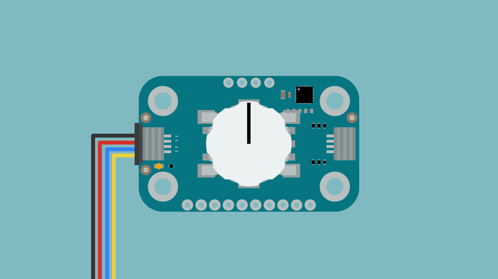
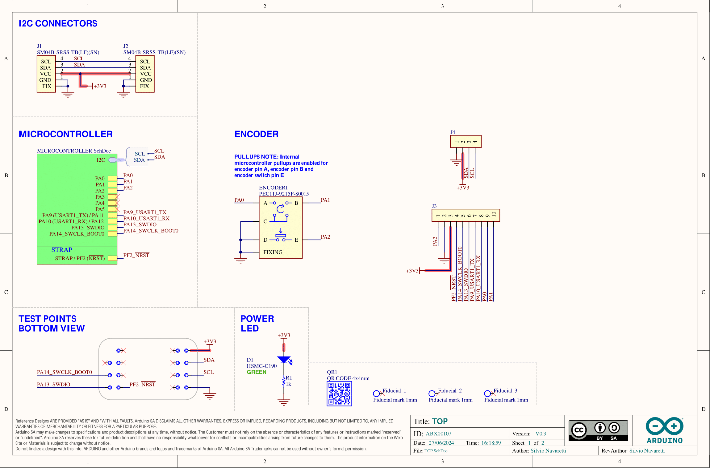

The Modulino Knob is a modular sensor based on a quadrature rotary encoder that translates angular motion (rotation) into a digital signal. The sensor value will increase or decrease according to the rotation direction. Also, it includes an SPST switch that is activated when the knob is pressed.

## Hardware Overview

### General Characteristics

The Modulino Knob has the following measurement specifications:

| Parameter  | Condition | Minimum | Typical          | Maximum | Unit |
|------------|-----------|---------|------------------|---------|------|
| Sensor     | Angle     | -       | 360 (continuous) | -       | °    |
| Steps      | -         | -       | 30               | -       | -    |
| Resolution | -         | -       | 12               | -       | bit  |

### Sensor Details

The PEC11J-9215F-S0015 rotary encoder is the core component of this module. This sensor output is processed by an STM32C011F4 microcontroller for digital communication (I²C), meaning that the encoder is communicated through the I²C pins using the mentioned microcontroller as an intermediary.

The default address for the Module is:

| Modulino I²C Address | Hardware I²C Address |
|----------------------|----------------------|
| 0x76                 | 0x3A                 |

The I²C address can be changed via software configuration.

### Pinout


#### 1x10 Header

| Pin   | Function       |
|-------|----------------|
| PA2   | Button         |
| GND   | Ground         |
| 3V3   | 3.3 V Power    |
| PF2   | RESET          |
| SWCLK | SWD Clock      |
| SWDIO | SWD Data       |
| TX1   | USART Transmit |
| RX1   | USART Receive  |
| PA0   | Encoder A      |
| PA1   | Encoder B      |

The board includes direct connections to the rotary encoder (PA0, PA1, PA2) bypassing the built-in microcontroller.

#### 1x4 Header (I2C)

| Pin   | Function     |
|-------|--------------|
| GND   | Ground       |
| 3.3 V | Power Supply |
| SDA   | I²C Data     |
| SCL   | I²C Clock    |

### Power Specifications

| Parameter       | Typical | Unit |
|-----------------|---------|------|
| Supply Voltage  | 3.3     | V    |
| Average Current | 3.4     | mA   |

The module includes a power LED that draws 1 mA and turns on as soon as it is powered.

### Schematic

The Modulino Knob features a robust circuit design for rotational input and button detection.



The main components are the **rotary encoder with integrated pushbutton** (PECHL-9215E-S0015) and the **STM32C011F4U6TR** microcontroller (U1), which handles encoder position reading, button state detection, as well as I²C communication.

You can connect to the I²C pins (SDA and SCL) using either the **QWIIC connectors** (J1 and J2, this is the recommended method) or the **solderable pins** (J3). The board runs on **3.3V**, which comes from the QWIIC cable or the **3V3 pin** on J3.

There's also a small power LED indicator (green) that lights up when the board is on.

You can grab the full schematic and PCB files from the [Modulino Knob page](https://docs.arduino.cc/hardware/modulinos/modulino-knob).

## Programming with Arduino

The Modulino Knob is fully compatible with the Arduino IDE and the official Modulino library. The following examples showcase how to read rotational input, detect button presses, and implement user interface controls in your Arduino projects.

### Prerequisites

- Install the Modulino library via the Arduino IDE Library Manager
- Connect your Modulino Knob via QWIIC or solderable headers

For detailed instructions on setting up your Arduino environment and installing libraries, please refer to the [Getting Started with Modulinos guide](./how-general).

Library repository available [here](https://github.com/arduino-libraries/Arduino_Modulino).

### Basic Example

```arduino
#include <Modulino.h>

ModulinoKnob knob;

void setup() {
   Serial.begin(9600);
   Modulino.begin();
   knob.begin();
}

void loop(){
   int position = knob.get();
   bool click = knob.isPressed();

   Serial.print("Current position is: ");
   Serial.println(position);

   if(click){
      Serial.println("Clicked!");
   }
}
```

### Key Functions

- `get()`: Returns a numerical value relative to the knob rotation
- `isPressed()`: Returns the state of the knob's built-in button
- `set()`: Changes the initial position of the encoder

### Advanced Example - Menu Navigation

```arduino
#include <Modulino.h>

ModulinoKnob knob;

// Menu configuration
const int MENU_ITEMS = 5;
String menuOptions[] = {"Settings", "Display", "Audio", "Network", "Exit"};
int currentSelection = 0;
int lastPosition = 0;
bool lastButtonState = false;

void setup() {
  Serial.begin(9600);
  Modulino.begin();
  knob.begin();
  
  // Set initial position to 0
  knob.set(0);
  lastPosition = 0;
  
  displayMenu();
}

void displayMenu() {
  Serial.println("\n======= MENU =======");
  for (int i = 0; i < MENU_ITEMS; i++) {
    if (i == currentSelection) {
      Serial.print("> ");  // Selection indicator
    } else {
      Serial.print("  ");
    }
    Serial.println(menuOptions[i]);
  }
  Serial.println("==================");
  Serial.println("Rotate to navigate, press to select");
}

void selectMenuItem() {
  Serial.print("\n✓ Selected: ");
  Serial.println(menuOptions[currentSelection]);
  
  // Handle selection
  switch(currentSelection) {
    case 0:
      Serial.println("Opening Settings...");
      break;
    case 1:
      Serial.println("Opening Display options...");
      break;
    case 2:
      Serial.println("Opening Audio settings...");
      break;
    case 3:
      Serial.println("Opening Network configuration...");
      break;
    case 4:
      Serial.println("Exiting menu...");
      break;
  }
  
  delay(1000);
  displayMenu();
}

void loop() {
  int currentPosition = knob.get();
  bool buttonPressed = knob.isPressed();
  
  // Check for rotation
  int rotation = currentPosition - lastPosition;
  
  if (rotation != 0) {
    // Update selection based on rotation direction
    if (rotation > 0) {
      currentSelection++;
      if (currentSelection >= MENU_ITEMS) {
        currentSelection = 0;  // Wrap around
      }
    } else {
      currentSelection--;
      if (currentSelection < 0) {
        currentSelection = MENU_ITEMS - 1;  // Wrap around
      }
    }
    
    lastPosition = currentPosition;
    displayMenu();
  }
  
  // Check for button press (on release to avoid multiple triggers)
  if (!buttonPressed && lastButtonState) {
    selectMenuItem();
  }
  
  lastButtonState = buttonPressed;
  
  delay(50);  // Small delay for debouncing
}
```

## Programming with MicroPython

The Modulino Knob is fully compatible with MicroPython through the official Modulino MicroPython library. The following examples demonstrate how to read rotational input, handle button events, and create interactive controls in your MicroPython projects.

### Prerequisites

- Install the Modulino MicroPython library
- Ensure Arduino Lab for MicroPython is installed

For detailed instructions on setting up your MicroPython environment and installing packages, please refer to the [Getting Started with Modulinos guide](./how-general).

### Basic Example

```python
from modulino import ModulinoKnob
from time import sleep

knob = ModulinoKnob()
knob.value = 0 # (Optional) Set an initial value
knob.range = (-10, 10) # (Optional) Set a value range

def on_release():
    knob.reset()
    print("🔘 Released! Knob's value was reset.")

knob.on_press = lambda: print("🔘 Pressed!")
knob.on_release = on_release
knob.on_rotate_clockwise = lambda steps, value: print(f"🎛️ Rotated {steps} steps clockwise! Value: {value}")
knob.on_rotate_counter_clockwise = lambda steps, value: print(f"🎛️ Rotated {steps} steps counter clockwise! Value: {value}")

while True:
    if(knob.update()):
        print("👀 Knob value or state changed!")

    sleep(0.1)
```

### Key Functions and Properties

- `.value`: Set/get the sensor's current value
- `.range`: Set the minimum and maximum possible value
- `.on_press`: Callback for button press
- `.on_release`: Callback for button release
- `.on_rotate_clockwise`: Callback for clockwise rotation
- `.on_rotate_counter_clockwise`: Callback for counter-clockwise rotation
- `.update()`: Check for new values and trigger callbacks
- `.reset()`: Reset the encoder value

### Advanced Example - Volume Control with Visual Feedback

```python
from modulino import ModulinoKnob
from time import sleep

knob = ModulinoKnob()

# Volume control configuration
knob.value = 50  # Start at 50%
knob.range = (0, 100)  # Volume range 0-100%

# State tracking
is_muted = False
last_volume = 50

def draw_volume_bar(volume, muted=False):
    """Draw a visual representation of the volume"""
    bar_length = 20
    filled = int((volume / 100) * bar_length)
    empty = bar_length - filled
    
    if muted:
        bar = "[" + "X" * bar_length + "]"
        status = "🔇 MUTED"
    else:
        bar = "[" + "█" * filled + "░" * empty + "]"
        if volume == 0:
            status = "🔈"
        elif volume < 33:
            status = "🔉"
        elif volume < 66:
            status = "🔊"
        else:
            status = "🔊"
    
    print(f"\rVolume: {bar} {volume:3d}% {status}  ", end="")

def toggle_mute():
    """Toggle mute state"""
    global is_muted, last_volume
    
    is_muted = not is_muted
    
    if is_muted:
        last_volume = knob.value
        knob.value = 0
        print("\n🔇 Muted!")
    else:
        knob.value = last_volume
        print(f"\n🔊 Unmuted! Volume: {last_volume}%")

def volume_change(steps, value):
    """Handle volume changes"""
    global is_muted
    
    if is_muted:
        is_muted = False  # Unmute when rotating
    
    draw_volume_bar(value)

# Configure callbacks
knob.on_press = toggle_mute
knob.on_rotate_clockwise = volume_change
knob.on_rotate_counter_clockwise = volume_change

print("🎛️ Volume Control System")
print("Rotate: Change volume | Press: Mute/Unmute")
print("-" * 40)

# Initial display
draw_volume_bar(knob.value)

# Main loop
while True:
    knob.update()
    sleep(0.01)
```

## Troubleshooting

### Knob Not Responding

If your Modulino's power LED isn't on or the knob isn't responsive:
- Ensure both the board and the Modulino are connected properly
- Verify that the power LEDs on both are lit
- Check that the QWIIC cable is properly clicked into place

### Erratic Values

If the encoder values jump unexpectedly:
- Check for loose connections
- Ensure the module is not near sources of electromagnetic interference
- Try adjusting the debounce time if using button events

## Project Ideas

- **Volume Control**: Adjust audio levels with tactile feedback
- **Menu Navigation**: Navigate through LCD or OLED display menus
- **Parameter Adjustment**: Fine-tune values in real-time applications
- **Game Controller**: Use rotation for steering or aiming in games
- **Light Dimmer**: Control LED brightness smoothly
- **Frequency Tuner**: Adjust frequencies for signal generators
- **Camera Control**: Pan/tilt control for camera systems
- **Smart Thermostat**: Set temperature with precise control