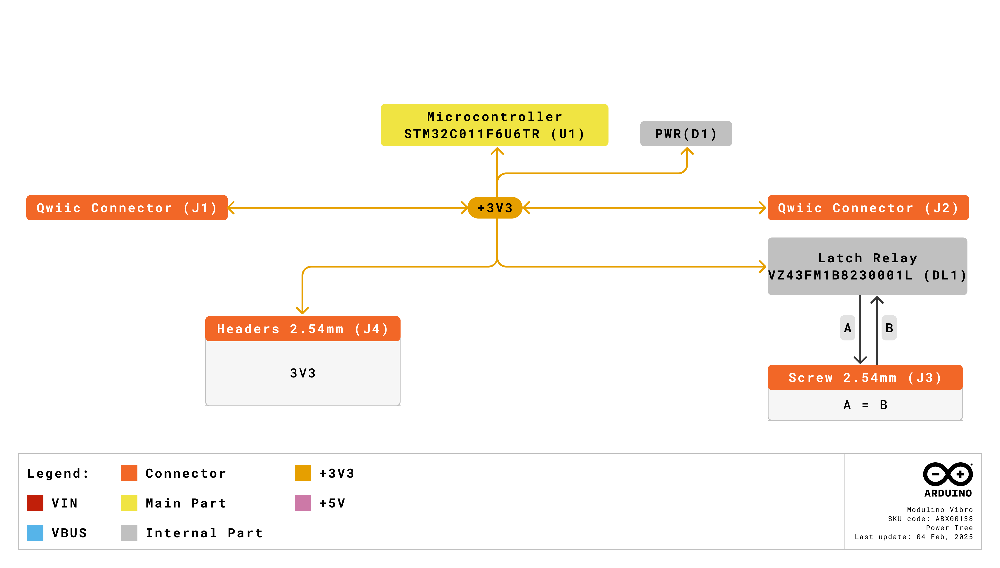
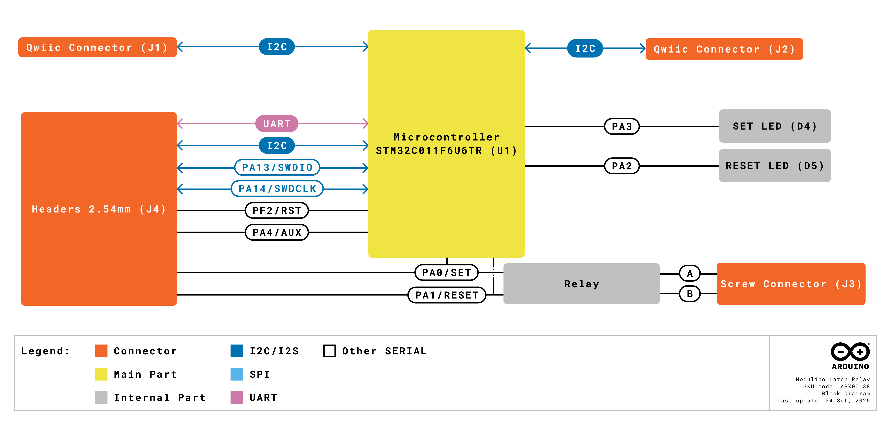
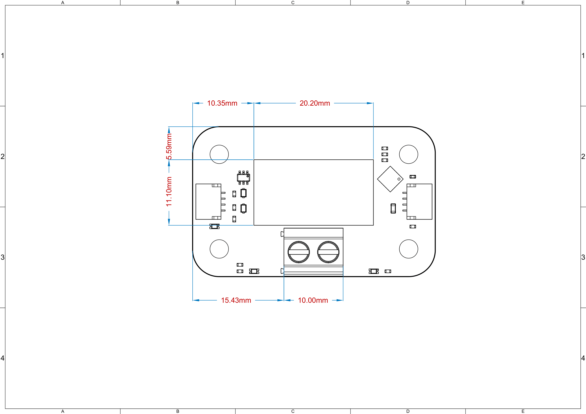
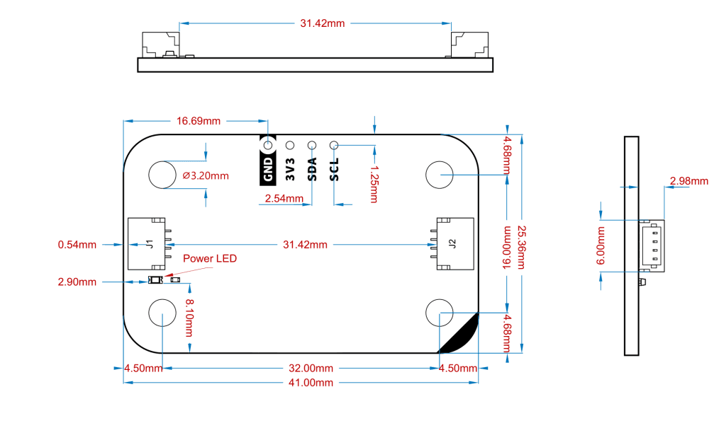
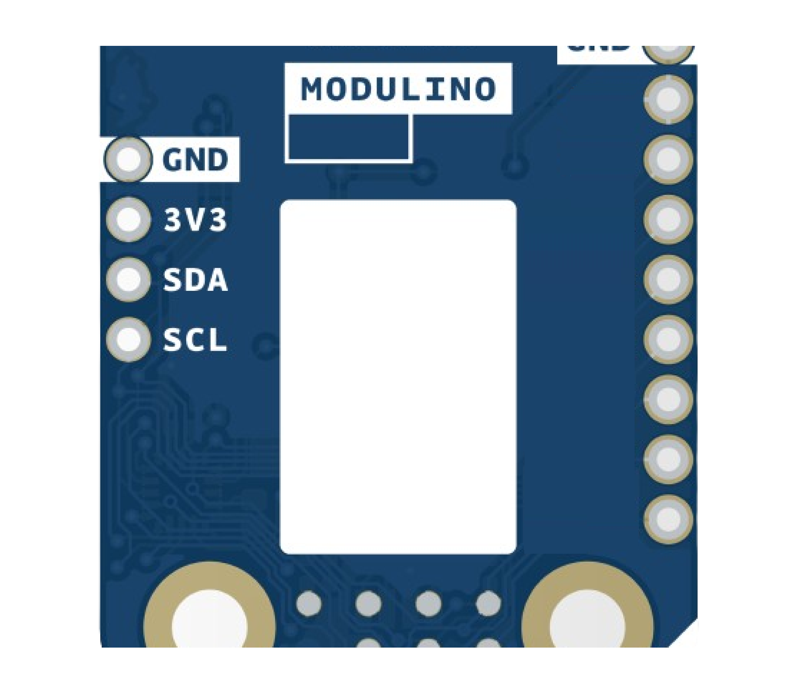
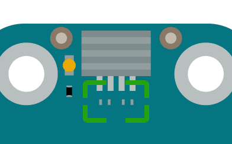

# Description

The Arduino® Modulino Latch Relay, powered by an on-board STM32C011F4 microcontroller, features an electromechanical bistable latching relay (HFE60/3-1HT-L2) capable of switching high-power loads. This setup enables both simple relay control via I2C and maintains its last state even when power is removed. 

**IMPORTANT SAFETY NOTE: This board is NOT SAFE for 250VAC switching and must only be used for DC loads (maximum 30V DC) due to exposed metal contacts.**

# Target Areas

Maker, beginner, education

# Contents
## Application Examples

- **DC Power Control**
  Switch DC motors, pumps, heaters, or lighting systems in automation projects with high current capacity.

- **Smart Home Automation**
  Control appliances and devices that require bistable switching, where maintaining state during power outages is critical.

- **Industrial Control**
  Implement safety interlocks or control systems where the relay state must be maintained regardless of control system power status.

## Features
- **Electromechanical bistable latching relay** (HFE60/3-1HT-L2) that maintains state without power.
- Integrated **STM32C011F4** microcontroller providing I2C interface by default.
- **Dual coil design** with SET and RESET functionality controlled via I2C.
- Designed for **3.3V** operation via the Qwiic connector (I2C).

### Contents
| **SKU**    | **Name**                    | **Purpose**                                  | **Quantity** |
| ---------- | --------------------------- | -------------------------------------------- | ------------ |
| ABX00138   | Modulino® Latch Relay       | Bistable relay for high-power switching     | 1            |
|            | I2C Qwiic cable             | Compatible with the Qwiic standard          | 1            |

## Related Products
- *SKU: ASX00027* - [Arduino® Sensor Kit](https://store.arduino.cc/products/arduino-sensor-kit)
- *SKU: K000007* - [Arduino® Starter Kit](https://store.arduino.cc/products/arduino-starter-kit-multi-language)
- *SKU: AKX00026* - [Arduino® Oplà IoT Kit](https://store.arduino.cc/products/opla-iot-kit)
- *SKU: AKX00069* - [Arduino® Plug and Make Kit](https://store.arduino.cc/products/plug-and-make-kit)

## Rating

### Recommended Operating Conditions
- **Powered at 3.3 V** through the Qwiic interface (in accordance with the Qwiic standard)
- **Operating temperature:** -40 °C to +85 °C

**Typical current consumption:**
- Microcontroller: ~3.4mA
- Coil activation: ~100mA for 50ms (during switching only)

## Power Tree
The power tree for the Modulino® node can be consulted below:

## Block Diagram
This module includes an STM32C011F4 microcontroller handling relay control via dual MOSFETs. The bistable relay maintains its state without continuous power. It communicates via I2C by default, but can be reprogrammed via SWD for custom functionality.

## Functional Overview
The Modulino® Latch Relay features a bistable latching relay that retains its last state (OPEN/CLOSED) even when power is removed. The on-board STM32C011F4 controls dual N-MOSFETs (2N7002PS,115) that drive the SET and RESET coils. LED indicators show the current state, and the relay can switch DC loads up to 30V DC.

### Technical Specifications (Module-Specific)
| **Specification**           | **Details**                                     |
| --------------------------- | ----------------------------------------------- |
| **Microcontroller**         | STM32C011F4                                     |
| **Relay Type**              | HFE60/3-1HT-L2 bistable latching               |
| **Supply Voltage**          | Rec: 3.3 V                           |
| **Power Consumption**       | ~3.4 mA idle, ~100 mA during switching           |
| **Coil Voltage**            | 3 V nominal, 2.4 V min, 3.9 V max                 |
| **Communication**           | I2C (Qwiic), SWD (reprogramming)               |

### Pinout

**1×10 Header**  

| **Pin** | **Function** |
|---------|--------------|
| PA0     | SET Coil Control    |
| PA1     | RESET Coil Control  |
| GND     | Ground         |
| 3V3     | 3.3 V Power    |
| PF2     | RESET          |
| SDA     | I2C Data       |
| SCL     | I2C Clock      |
| SWCLK   | SWD Clock      |
| SWDIO   | SWD Data       |
| PA4     | Additional GPIO |

 **Note:**
 - Never set both PA0 and PA1 HIGH simultaneously as this creates an undefined state.
 - LED indicators: PA3 (SET yellow LED), PA2 (RESET red LED).

### Power Specifications
- **Nominal operating voltage:** 3.3 V via Qwiic

### Mechanical Information

- Board dimensions: 41 mm × 25.36 mm
- Thickness: 1.6 mm (±0.2 mm)
- Four mounting holes (⌀ 3.2 mm)
  - Hole spacing: 16 mm vertically, 32 mm horizontally

### I2C Address Reference
| **Board Silk Name** | **Sensor/Actuator**     | **Modulino® I2C Address (HEX)** | **Editable Addresses (HEX)**                | **Hardware I2C Address (HEX)** |
|---------------------|-------------------------|--------------------------------|---------------------------------------------|--------------------------------|
| MODULINO LATCH RELAY| Bistable Latch Relay    | 0x2A                           | Any custom address (via software config.)   | 0x15                           |

 **Note:**
 - Default I2C address is **0x2A**.
 - A white rectangle on the bottom silk allows users to write a new address after reconfiguration.
  

#### Pull-up Resistors

This module has pads for optional I2C pull-up mounting in both data lines. No resistors are mounted by default but in case the resistors are needed 4.7 K resistors in an SMD 0402 format are recommended.

These are positioned near the Qwiic connector on the power LED side.

## Device Operation
By default, the board is an I2C target device. It manages relay switching through integrated firmware that drives the SET and RESET coils via dual MOSFETs. The bistable nature means the relay maintains its state without continuous power. **DANGER: Never activate both SET and RESET coils simultaneously.**

### Relay Control States
| **PA0 (SET)** | **PA1 (RESET)** | **Relay State** |
|---------------|-----------------|-----------------|
| HIGH (≥50ms)  | LOW             | CLOSED (Latched) |
| LOW           | HIGH (≥50ms)    | OPEN (Latched)   |
| LOW           | LOW             | No change        |
| HIGH          | HIGH            | **DANGER - UNDEFINED** |

# Important Safety Warning

**The board NODE36 RELAY ABX00138 IS NOT SAFE TO BE USED WHILE SWITCHING AC LOADS AND MUST ONLY BE USED TO SWITCH DC LOADS.**

**Maximum DC voltage: 30V**

# Certifications

## Certifications Summary

| **Certification** | **Status** |
|:-----------------:|:----------:|
|  CE/RED (Europe)  |     Yes    |
|     UKCA (UK)     |     Yes    |
|     FCC (USA)     |     Yes    |
|    IC (Canada)    |     Yes    |
|        RoHS       |     Yes    |
|       REACH       |     Yes    |
|        WEEE       |     Yes    |

## Declaration of Conformity CE DoC (EU)

We declare under our sole responsibility that the products above are in conformity with the essential requirements of the following EU Directives and therefore qualify for free movement within markets comprising the European Union (EU) and European Economic Area (EEA).

## Declaration of Conformity to EU RoHS & REACH 211 01/19/2021

Arduino boards are in compliance with RoHS 2 Directive 2011/65/EU of the European Parliament and RoHS 3 Directive 2015/863/EU of the Council of 4 June 2015 on the restriction of the use of certain hazardous substances in electrical and electronic equipment.

| Substance                              | **Maximum limit (ppm)** |
|----------------------------------------|-------------------------|
| Lead (Pb)                              | 1000                    |
| Cadmium (Cd)                           | 100                     |
| Mercury (Hg)                           | 1000                    |
| Hexavalent Chromium (Cr6+)             | 1000                    |
| Poly Brominated Biphenyls (PBB)        | 1000                    |
| Poly Brominated Diphenyl ethers (PBDE) | 1000                    |
| Bis(2-Ethylhexyl) phthalate (DEHP)     | 1000                    |
| Benzyl butyl phthalate (BBP)           | 1000                    |
| Dibutyl phthalate (DBP)                | 1000                    |
| Diisobutyl phthalate (DIBP)            | 1000                    |

Exemptions: No exemptions are claimed.

Arduino Boards are fully compliant with the related requirements of European Union Regulation (EC) 1907 /2006 concerning the Registration, Evaluation, Authorization and Restriction of Chemicals (REACH). We declare none of the SVHCs (https://echa.europa.eu/web/guest/candidate-list-table), the Candidate List of Substances of Very High Concern for authorization currently released by ECHA, is present in all products (and also package) in quantities totaling in a concentration equal or above 0.1%. To the best of our knowledge, we also declare that our products do not contain any of the substances listed on the "Authorization List" (Annex XIV of the REACH regulations) and Substances of Very High Concern (SVHC) in any significant amounts as specified by the Annex XVII of Candidate list published by ECHA (European Chemical Agency) 1907 /2006/EC.

## FCC WARNING

This device complies with part 15 of the FCC Rules.

Operation is subject to the following two conditions: 

(1) This device may not cause harmful interference, and (2) this device must accept any interference received, including interference that may cause undesired operation.

## IC Caution

This device complies with Industry Canada licence-exempt RSS standard(s). 

Operation is subject to the following two conditions: 

(1) This device may not cause interference, and (2) this device must accept any interference, including interference that may cause undesired operation of the device.

## Conflict Minerals Declaration

As a global supplier of electronic and electrical components, Arduino is aware of our obligations with regard to laws and regulations regarding Conflict Minerals, specifically the Dodd-Frank Wall Street Reform and Consumer Protection Act, Section 1502. Arduino does not directly source or process conflict minerals such as Tin, Tantalum, Tungsten, or Gold. Conflict minerals are contained in our products in the form of solder or as a component in metal alloys. As part of our reasonable due diligence, Arduino has contacted component suppliers within our supply chain to verify their continued compliance with the regulations. Based on the information received thus far we declare that our products contain Conflict Minerals sourced from conflict-free areas.

# Company Information

| Company name    | Arduino SRL                                   |
|-----------------|-----------------------------------------------|
| Company Address | Via Andrea Appiani, 25 - 20900 MONZA（Italy)  |

# Reference Documentation

| Ref                       | Link                                                                                                                                                                                           |
| ------------------------- | ---------------------------------------------------------------------------------------------------------------------------------------------------------------------------------------------- |
| Arduino IDE (Desktop)     | [https://www.arduino.cc/en/software/](https://www.arduino.cc/en/software/)                                                                                                             |
| Arduino Courses           | [https://www.arduino.cc/education/courses](https://www.arduino.cc/education/courses)                                                                                                           |
| Arduino Documentation     | [https://docs.arduino.cc/](https://docs.arduino.cc/)                                                                                                           |
| Arduino IDE (Cloud)       | [https://create.arduino.cc/editor](https://create.arduino.cc/editor)                                                                                                                           |
| Cloud IDE Getting Started | [https://docs.arduino.cc/cloud/web-editor/tutorials/getting-started/getting-started-web-editor](https://docs.arduino.cc/cloud/web-editor/tutorials/getting-started/getting-started-web-editor) |
| Project Hub               | [https://projecthub.arduino.cc/](https://projecthub.arduino.cc/)                                                                                                                          |
| Library Reference         | [https://github.com/arduino-libraries/](https://github.com/arduino-libraries/)                                                                                                            |
| Online Store              | [https://store.arduino.cc/](https://store.arduino.cc/)                                                                                                                                    |

# Revision History
| **Date**   | **Revision** | **Changes**                       |
|------------|--------------|-----------------------------------|
| 01/07/2025 | 1            | First release                     |