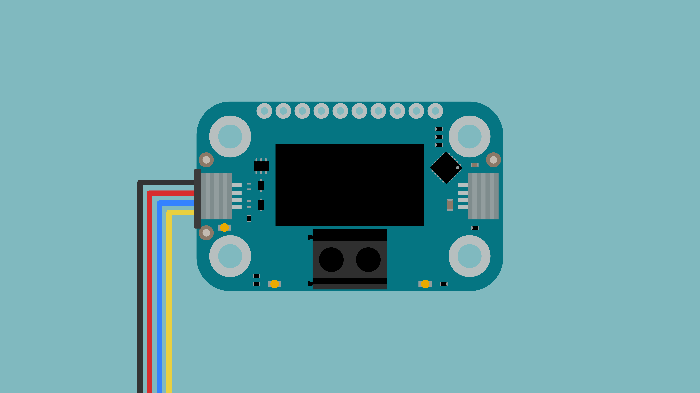
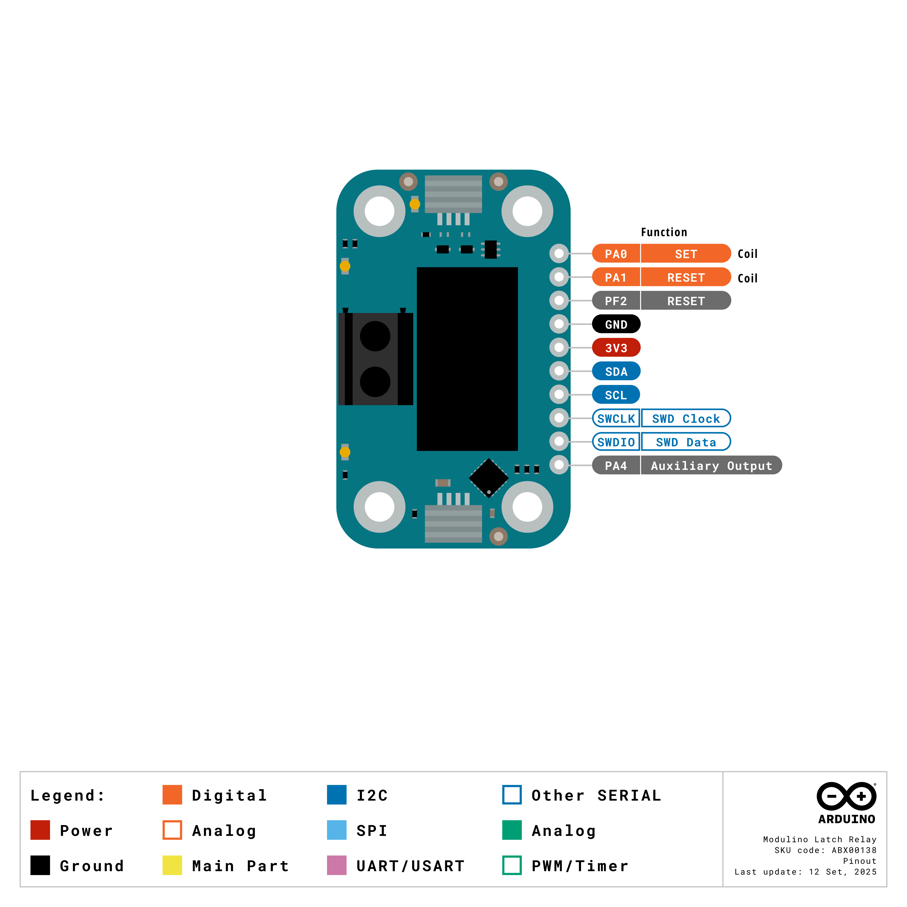

The Modulino Relay is a modular latching relay that can switch DC electrical loads, making it perfect to add power control to your projects! It uses the standardised Modulino form factor with QWIIC connectors for easy integration.

**IMPORTANT SAFETY NOTE: This board is NOT SAFE for 250VAC switching and must only be used for DC loads (maximum 30V DC) due to exposed metal contacts.**

## Hardware Overview

### General Characteristics

The Modulino Relay features a bistable latching relay capable of switching DC loads up to 2 A at 30 VDC.

| Parameter     | Condition | Minimum | Typical | Maximum | Unit |
|---------------|-----------|---------|---------|---------|------|
| Voltage (DC)  | -         | -       | -       | 30      | VDC  |
| Current (DC)  | -         | -       | -       | 2       | A    |

### Sensor Details

The **Modulino Relay** module uses a latching relay, which does not have native I²C capabilities. Instead, the relay is controlled by the Modulino's onboard microcontroller (STM32C011F4), which manages the relay coil switching and provides I²C communication.

A latching relay maintains its state without continuous power, making it energy-efficient for applications where the relay state changes infrequently.

One unique feature of this setup is the ability to change the I²C address via software, making it adaptable to different system configurations.

The default I²C address for the **Modulino Relay** module is:

| Modulino I²C Address | Hardware I²C Address | Editable Addresses (HEX)                        |
|----------------------|----------------------|--------------------------------------------------|
| 0x2A                 | 0x15                 | Any custom address (via software configuration) |

### Pinout



**1×10 Header**

| **Pin** | **Function** |
|---------|--------------|
| PA0     | SET Coil Control    |
| PA1     | RESET Coil Control  |
| GND     | Ground         |
| 3V3     | 3.3 V Power    |
| PF2     | RESET          |
| SDA     | I2C Data       |
| SCL     | I2C Clock      |
| SWCLK   | SWD Clock      |
| SWDIO   | SWD Data       |
| PA4     | Additional GPIO |

**Note:**
- Never set both PA0 and PA1 HIGH simultaneously as this creates an undefined state.
- LED indicators: PA3 (SET yellow LED), PA2 (RESET red LED).

#### Relay Contacts

The relay provides normally open (NO) and normally closed (NC) contacts for switching loads:

- **Common (COM)**: Connect to your power source
- **NO (Normally Open)**: Closes when relay is activated
- **NC (Normally Closed)**: Opens when relay is activated

### Power Specifications

| Parameter           | Condition | Typical | Unit |
|---------------------|-----------|---------|------|
| Operating Voltage   | -         | 3.3     | V    |
| Current Consumption | -         | ~3.4    | mA   |
| Coil Current        | Switching | Brief   | mA   |

The module includes a power LED that draws 1 mA and turns on as soon as it is powered.

***Important Safety Notice:*** This relay must ONLY be used for DC loads up to 30V DC. Never use this module for AC switching or mains voltage applications due to exposed metal contacts which create a safety hazard.

### Schematic

The Modulino Relay features a latching relay design for efficient power control.

The main components are the latching relay and the **STM32C011F4** microcontroller (U1), which controls the relay coils and handles I²C communication.

You can connect to the I²C pins (SDA and SCL) using either the **QWIIC connectors** (J1 and J2, this is the recommended method) or the **solderable pins** (J4). The board runs on **3.3V**, which comes from the QWIIC cable or the **3V3 pin** on J4.

There's also a small power LED indicator that lights up when the board is on.

You can grab the full schematic and PCB files from the [Modulino Relay page](https://docs.arduino.cc/hardware/modulinos/modulino-relay).

## Programming with Arduino

The Modulino Relay is fully compatible with the Arduino IDE and the official Modulino library. The following examples showcase how to control loads and create automated switching systems.

### Prerequisites

- Install the Modulino library via the Arduino IDE Library Manager
- Connect your Modulino Relay via QWIIC or solderable headers

For detailed instructions on setting up your Arduino environment and installing libraries, please refer to the [Getting Started with Modulino Nodes guide](../how-general).

Library repository available [here](https://github.com/arduino-libraries/Arduino_Modulino).

### Basic Example

```arduino
/*
 * Modulino Latch Relay - Basic
 *
 * This example demonstrates how to control the Modulino Latch Relay module via serial commands.
 * A latch relay maintains its state (ON or OFF) even when power is removed, making it
 * energy-efficient for applications that need to maintain a state.
 *
 * Serial Commands:
 * - 's': Set the relay to ON position (energize/close the relay)
 * - 'r': Reset the relay to OFF position (de-energize/open the relay)
 * - 'x': Check and display the current relay status
 *
 * Relay Status Values:
 * - 0: Relay is OFF (open circuit)
 * - 1: Relay is ON (closed circuit)
 * - Negative value: Status unknown or error
 *
 * Usage:
 * 1. Open the Serial Monitor (set to 115200 baud)
 * 2. Type 's' and press Enter to turn the relay ON
 * 3. Type 'r' and press Enter to turn the relay OFF
 * 4. Type 'x' and press Enter to check the current status
 *
 * This example code is in the public domain.
 * Copyright (c) 2025 Arduino
 * SPDX-License-Identifier: MPL-2.0
 */

#include <Arduino_Modulino.h>

ModulinoLatchRelay relay;

void setup() {
  Modulino.begin();
  Serial.begin(115200);
  relay.begin();
}

void loop() {
  if (Serial.available()) {
    char c = Serial.read();
    switch (c) {
      case 's':
        relay.set();
        break;
      case 'r':
        relay.reset();
        break;
      case 'x':
        auto status = relay.getStatus();
        if (status == 0) {
          Serial.println("Relay OFF");
        }
        if (status == 1) {
          Serial.println("Relay ON");
        }
        if (status < 0) {
          Serial.println("Relay status unknown");
        }
        break;
    }
  }
}
```

### Key Functions

- `set()`: Energizes the relay to the ON position (closes NO contacts, opens NC contacts)
- `reset()`: De-energizes the relay to the OFF position (opens NO contacts, closes NC contacts)
- `getStatus()`: Returns current relay state (`0` = OFF, `1` = ON, negative value = error/unknown)

## Programming with MicroPython

The Modulino Relay is fully compatible with MicroPython through the official Modulino MicroPython library. The following example demonstrates how to control the relay in your MicroPython projects.

### Prerequisites

- Install the Modulino MicroPython library (see [Getting Started with Modulino Nodes](./how-general) for detailed instructions)
- Ensure Arduino Lab for MicroPython is installed

### Basic Example

```python
"""
This example demonstrates how to use the Modulino Latch Relay module
to turn a relay on and off repeatedly.

Initial author: Sebastian Romero
"""

from modulino import ModulinoLatchRelay
from time import sleep_ms

relay = ModulinoLatchRelay()
initial_state = relay.is_on

if initial_state is None:
    print("Relay state is unknown (last state before poweroff is maintained)")
else:
    print(f"Relay is currently {'on' if initial_state else 'off'}")

while True:
    print("Turning relay on")
    relay.on()
    sleep_ms(150) # Wait for the relay to settle
    print(f"Relay is currently {'on' if relay.is_on else 'off'}")
    sleep_ms(1000)  # Keep the relay on for 1 second
    print("Turning relay off")
    relay.off()
    sleep_ms(150) # Wait for the relay to settle
    print(f"Relay is currently {'on' if relay.is_on else 'off'}")
    sleep_ms(1000)  # Keep the relay off for 1 second
```

### Key Methods

- `.on()`: Energizes the relay to the ON position
- `.off()`: De-energizes the relay to the OFF position
- `.is_on`: Returns current relay state (`True` = ON, `False` = OFF, `None` = unknown)

## Troubleshooting

### Sensor Not Reachable

If your Modulino's power LED isn't on or the sensor isn't responsive:
- Ensure both the board and the Modulino are connected to your computer
- Verify that the power LEDs on both are lit
- Check that the QWIIC cable is properly clicked into place

### Relay Not Switching

If the relay doesn't switch:
- Verify that the relay coils are receiving proper signals
- Check that your load doesn't exceed the relay's ratings
- Ensure proper wiring of NO/NC/COM contacts

### Load Not Operating

If your connected load doesn't operate:
- Verify correct wiring (check NO vs NC connections)
- Ensure load voltage and current are within relay specifications
- Test relay operation with a multimeter in continuity mode

### Library Issues

See the [Getting Started with Modulino nodes](./how-general) guide for library installation troubleshooting.

## Project Ideas

Now that you've learned how to use your Modulino Relay, try these projects:

- **Smart Light Switch**: Control room lighting automatically
- **Irrigation System**: Schedule watering times for gardens
- **Appliance Controller**: Turn coffee makers or heaters on/off remotely
- **Security System**: Control door locks or alarm sirens
- **Temperature Controller**: Switch heating/cooling based on sensor readings
- **Timer Switch**: Create countdown timers for equipment
- **Energy Monitor**: Log when devices are powered on/off
- **Automated Greenhouse**: Control fans, lights, and pumps

## Safety Warnings

⚠️ **Important Safety Information:**

- Never exceed the relay's voltage and current ratings
- Always disconnect power before wiring
- Use appropriate wire gauge for your current requirements
- Provide proper isolation for high-voltage applications
- Consider using a fuse for overcurrent protection
- Never use for mains voltage or AC applications - DC only (max 30V DC)
- Follow all local electrical codes and regulations
- Ensure proper ventilation if switching high-power loads
