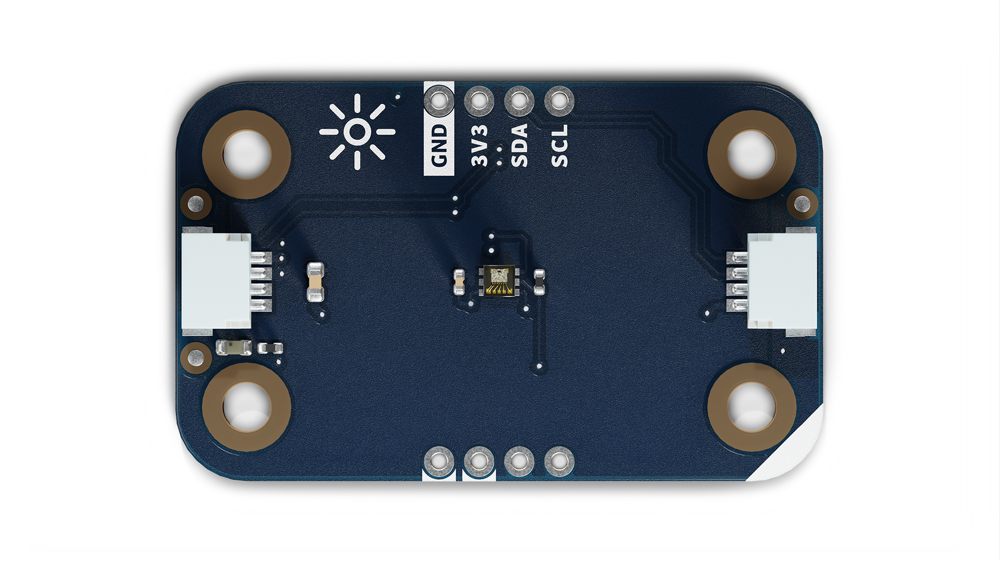
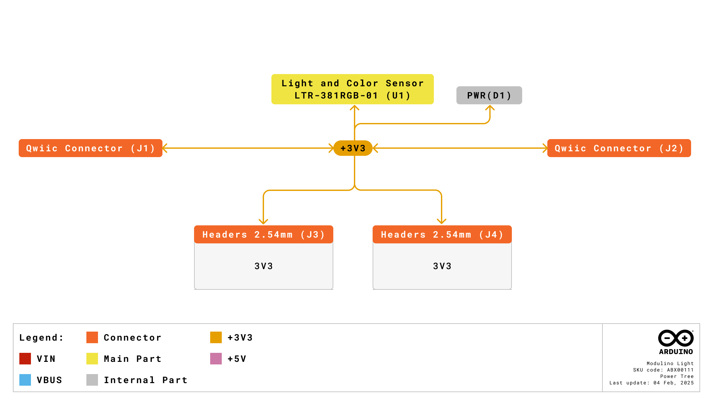
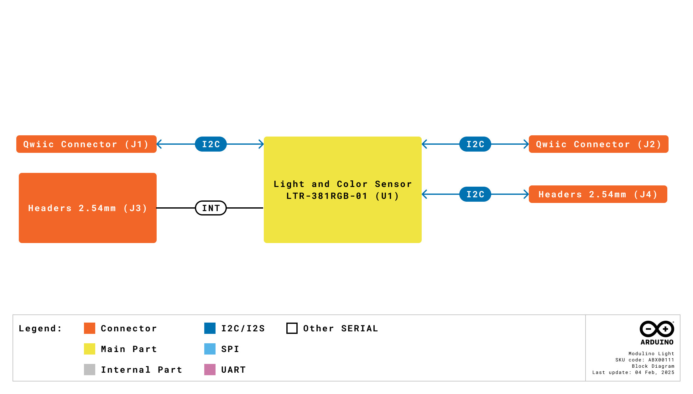
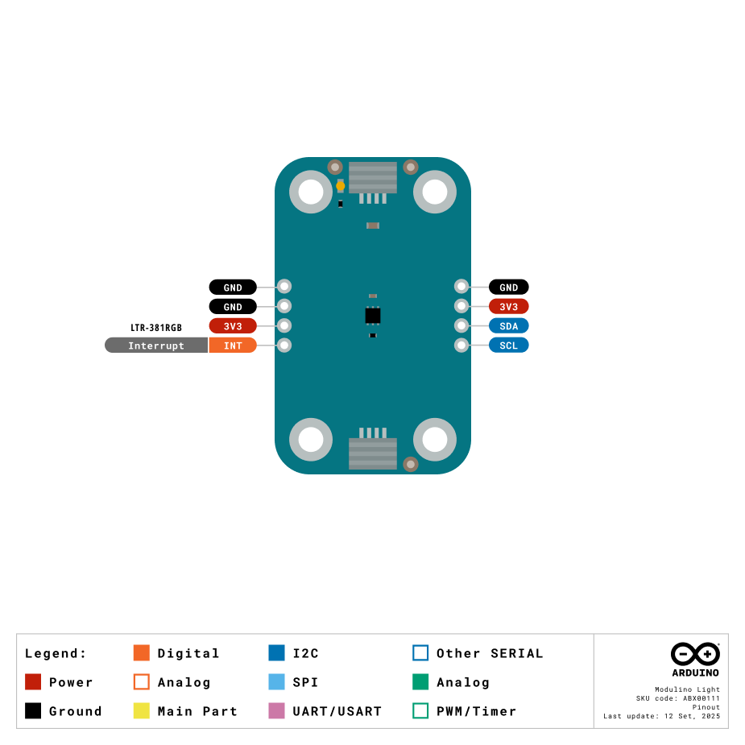
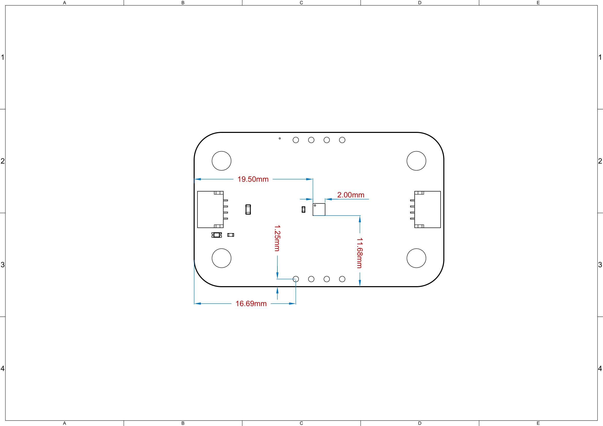

# Description

The Arduino Modulino® Light features the LTR-381RGB-01 ambient light, RGB, and infrared sensor, providing comprehensive optical sensing capabilities in a compact form factor. This sensor enables colour recognition, ambient light measurement, and infrared detection for a wide range of interactive and automation applications.

# Target Areas

Maker, beginner, education

# Contents
## Application Examples

- **Colour Recognition**
  Detect and identify colours in objects, liquids, or environments for sorting systems, art projects, or interactive installations.

- **Ambient Light Control**
  Automatically adjust LED brightness, screen intensity, or activate lighting systems based on surrounding light conditions for smart home applications.

- **Infrared Detection**
  Monitor infrared radiation for proximity sensing, temperature indication, or remote control applications in various IoT projects.

## Features
- **LTR-381RGB-01 sensor** providing ambient light, RGB colour, and infrared measurements.
- **High-precision colour detection** with separate red, green, and blue channels for accurate colour identification.
- **Ambient light sensing** with wide dynamic range for automatic lighting control.
- **Infrared detection** for proximity and thermal sensing applications.
- **I2C (Qwiic)** interface for solder-free integration; operates at **3.3V**.

### Contents
| **SKU**    | **Name**            | **Purpose**                                   | **Quantity** |
| ---------- | ------------------- | --------------------------------------------- | ------------ |
| ABX00111   | Modulino® Light     | Ambient light, RGB and infrared sensor       | 1            |
|            | I2C Qwiic cable     | Compatible with the Qwiic standard            | 1            |

## Related Products
- *SKU: ASX00027* - [Arduino® Sensor Kit](https://store.arduino.cc/products/arduino-sensor-kit)
- *SKU: K000007* - [Arduino® Starter Kit](https://store.arduino.cc/products/arduino-starter-kit-multi-language)
- *SKU: AKX00026* - [Arduino® Oplà IoT Kit](https://store.arduino.cc/products/opla-iot-kit)
- *SKU: AKX00069* - [Arduino® Plug and Make Kit](https://store.arduino.cc/products/plug-and-make-kit)

## Rating

### Recommended Operating Conditions
- **Powered at 3.3 V** through the Qwiic interface (in accordance with the Qwiic standard)
- **Operating temperature:** -30 °C to +70 °C

**Typical current consumption:**
- ~200 µA active measurement

## Power Tree
The power tree for the Modulino® Light can be consulted below:

## Block Diagram
This node is designed to be placed on an I2C bus, allowing the on-board LTR-381RGB-01 sensor to communicate with a host microcontroller via I2C.

## Functional Overview
The Modulino® Light uses the LTR-381RGB-01 sensor to measure ambient light levels, detect RGB colour components, and sense infrared radiation. The sensor communicates via I2C (through the Qwiic connector at 3.3V) and provides an interrupt output for event-driven applications. The sensor can distinguish between different light sources and accurately measure colour characteristics.

### Technical Specifications
| **Specification**       | **Details**                                      |
| ----------------------- | ------------------------------------------------ |
| **Sensor**              | LTR-381RGB-01                                    |
| **Supply Voltage**      | Rec:3.3 V                           |
| **Power Consumption**   | ~200 µA active                    |
| **Ambient Light Range** | 0.01 lux to 120,000 lux                        |
| **Spectral Response**   | Red: 600-700 nm, Green: 500-600 nm, Blue: 400-500 nm |
| **Resolution**          | 20-bit ADC                                       |
| **Communication**       | I2C                                             |

### Pinout

**Qwiic / I2C (1×4 Header)**  
| **Pin** | **Function**            |
| ------- | ----------------------- |
| GND     | Ground                 |
| 3.3 V    | Power Supply (3.3 V)   |
| SDA     | I2C Data               |
| SCL     | I2C Clock              |

These pads and the Qwiic connectors share the same I2C bus. You can optionally solder header pins here.

**Additional 1×4 Header (LTR-381RGB-01 Signals)**  
| **Pin** | **Function**                         |
| ------- | ------------------------------------ |
| GND     | Ground                              |
| GND     | Ground                              |
| 3V3     | 3.3 V Power                         |
| INT     | Interrupt Output      |

**Note:** INT pin features a 10 kΩ pull-up resistor to 3.3 V and provides interrupt signalling for threshold detection and data ready events.

### Power Specifications
- **Nominal operating voltage:** 3.3 V via Qwiic

### Mechanical Information
### Mechanical Information

- Board dimensions: 41 mm × 25.36 mm
- Thickness: 1.6 mm (±0.2 mm)
- Four mounting holes (⌀ 3.2 mm)
  - Hole spacing: 16 mm vertically, 32 mm horizontally

### I2C Address Reference
| **Board Silk Name** | **Sensor**       | **Modulino® I2C Address (HEX)** | **Editable Addresses (HEX)**              | **Hardware I2C Address (HEX)** |
|---------------------|------------------|--------------------------------|-------------------------------------------|--------------------------------|
| MODULINO LIGHT      | LTR-381RGB-01    | 0x53                           | Fixed hardware address                     | 0x53                           |

**Note:** The default and only address is **0x53**. This sensor has a fixed I2C address that cannot be changed.

## Device Operation
The Modulino® Light operates as an I2C target device on the Qwiic bus. A host microcontroller can read ambient light values, RGB colour components, and infrared levels.  The INT pin can be configured to trigger interrupts when measurements exceed programmed thresholds.

### Getting Started
Use any standard Arduino or microcontroller environment at 3.3 V. The Arduino_LTR381RGB library provides comprehensive functions for colour detection, ambient light measurement, and infrared sensing. The sensor should be positioned to face the light source or object being measured, with the sensing area unobstructed.

# Certifications

## Certifications Summary

| **Certification** | **Status** |
|:-----------------:|:----------:|
|  CE/RED (Europe)  |     Yes    |
|     UKCA (UK)     |     Yes    |
|     FCC (USA)     |     Yes    |
|    IC (Canada)    |     Yes    |
|        RoHS       |     Yes    |
|       REACH       |     Yes    |
|        WEEE       |     Yes    |

## Declaration of Conformity CE DoC (EU)

We declare under our sole responsibility that the products above are in conformity with the essential requirements of the following EU Directives and therefore qualify for free movement within markets comprising the European Union (EU) and European Economic Area (EEA).

## Declaration of Conformity to EU RoHS & REACH 211 01/19/2021

Arduino boards are in compliance with RoHS 2 Directive 2011/65/EU of the European Parliament and RoHS 3 Directive 2015/863/EU of the Council of 4 June 2015 on the restriction of the use of certain hazardous substances in electrical and electronic equipment.

| Substance                              | **Maximum limit (ppm)** |
|----------------------------------------|-------------------------|
| Lead (Pb)                              | 1000                    |
| Cadmium (Cd)                           | 100                     |
| Mercury (Hg)                           | 1000                    |
| Hexavalent Chromium (Cr6+)             | 1000                    |
| Poly Brominated Biphenyls (PBB)        | 1000                    |
| Poly Brominated Diphenyl ethers (PBDE) | 1000                    |
| Bis(2-Ethylhexyl) phthalate (DEHP)     | 1000                    |
| Benzyl butyl phthalate (BBP)           | 1000                    |
| Dibutyl phthalate (DBP)                | 1000                    |
| Diisobutyl phthalate (DIBP)            | 1000                    |

Exemptions: No exemptions are claimed.

Arduino Boards are fully compliant with the related requirements of European Union Regulation (EC) 1907 /2006 concerning the Registration, Evaluation, Authorization and Restriction of Chemicals (REACH). We declare none of the SVHCs (https://echa.europa.eu/web/guest/candidate-list-table), the Candidate List of Substances of Very High Concern for authorization currently released by ECHA, is present in all products (and also package) in quantities totaling in a concentration equal or above 0.1%. To the best of our knowledge, we also declare that our products do not contain any of the substances listed on the "Authorization List" (Annex XIV of the REACH regulations) and Substances of Very High Concern (SVHC) in any significant amounts as specified by the Annex XVII of Candidate list published by ECHA (European Chemical Agency) 1907 /2006/EC.

## FCC WARNING

This device complies with part 15 of the FCC Rules.

Operation is subject to the following two conditions: 

(1) This device may not cause harmful interference, and (2) this device must accept any interference received, including interference that may cause undesired operation.

## IC Caution

This device complies with Industry Canada licence-exempt RSS standard(s). 

Operation is subject to the following two conditions: 

(1) This device may not cause interference, and (2) this device must accept any interference, including interference that may cause undesired operation of the device.

## Conflict Minerals Declaration

As a global supplier of electronic and electrical components, Arduino is aware of our obligations with regard to laws and regulations regarding Conflict Minerals, specifically the Dodd-Frank Wall Street Reform and Consumer Protection Act, Section 1502. Arduino does not directly source or process conflict minerals such as Tin, Tantalum, Tungsten, or Gold. Conflict minerals are contained in our products in the form of solder or as a component in metal alloys. As part of our reasonable due diligence, Arduino has contacted component suppliers within our supply chain to verify their continued compliance with the regulations. Based on the information received thus far we declare that our products contain Conflict Minerals sourced from conflict-free areas.

# Company Information

| Company name    | Arduino SRL                                   |
|-----------------|-----------------------------------------------|
| Company Address | Via Andrea Appiani, 25 - 20900 MONZA（Italy)  |

# Reference Documentation

| Ref                       | Link                                                                                                                                                                                           |
| ------------------------- | ---------------------------------------------------------------------------------------------------------------------------------------------------------------------------------------------- |
| Arduino IDE (Desktop)     | [https://www.arduino.cc/en/software/](https://www.arduino.cc/en/software/)                                                                                                             |
| Arduino Courses           | [https://www.arduino.cc/education/courses](https://www.arduino.cc/education/courses)                                                                                                           |
| Arduino Documentation     | [https://docs.arduino.cc/](https://docs.arduino.cc/)                                                                                                           |
| Arduino IDE (Cloud)       | [https://create.arduino.cc/editor](https://create.arduino.cc/editor)                                                                                                                           |
| Cloud IDE Getting Started | [https://docs.arduino.cc/cloud/web-editor/tutorials/getting-started/getting-started-web-editor](https://docs.arduino.cc/cloud/web-editor/tutorials/getting-started/getting-started-web-editor) |
| Project Hub               | [https://projecthub.arduino.cc/](https://projecthub.arduino.cc/)                                                                                                                          |
| Library Reference         | [https://github.com/arduino-libraries/](https://github.com/arduino-libraries/)                                                                                                            |
| Online Store              | [https://store.arduino.cc/](https://store.arduino.cc/)                                                                                                                                    |

# Revision History
| **Date**   | **Revision** | **Changes**                       |
|------------|--------------|-----------------------------------|
| 14/10/2025 | 1            | First release                     |