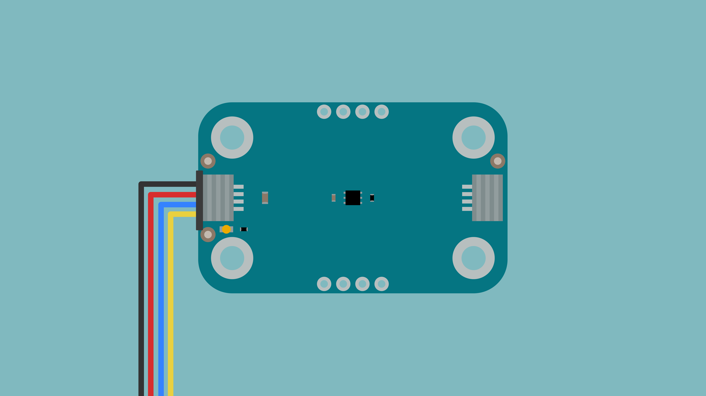
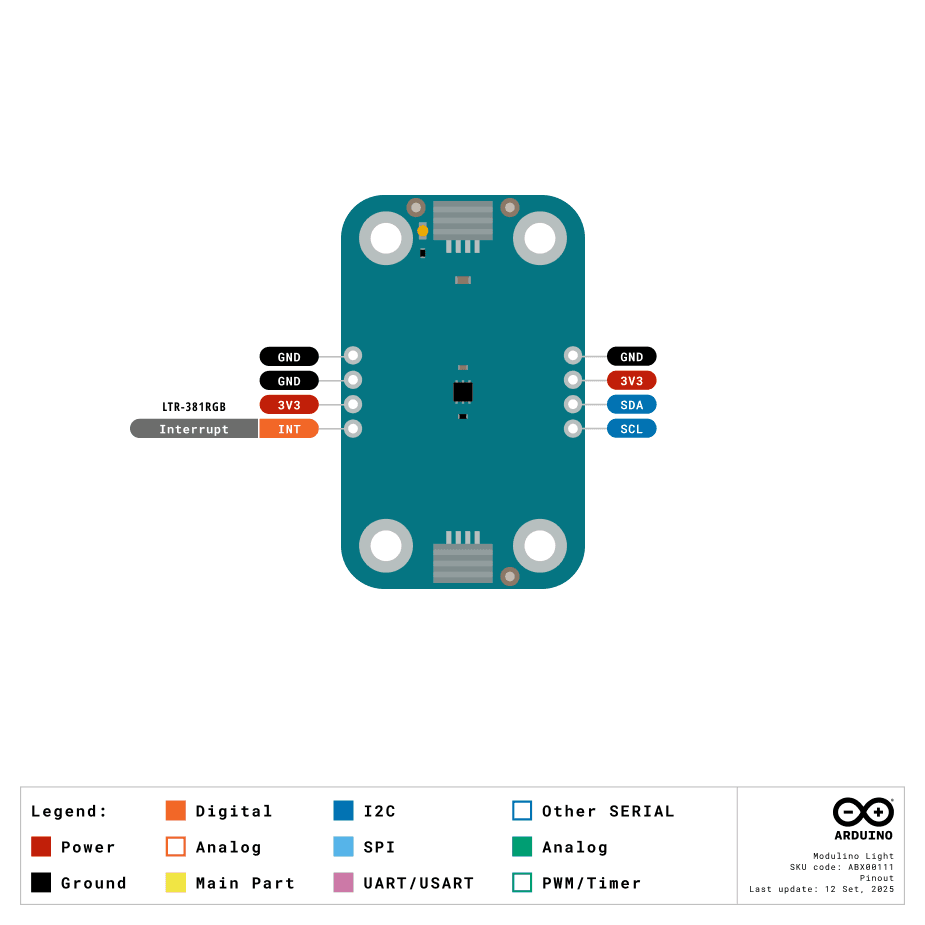

The Modulino Light is a modular colour sensor that measures ambient light, RGB colour components, and infrared levels, making it perfect to add colour detection and light sensing to your projects! It uses the standardised Modulino form factor with QWIIC connectors for easy integration.

## Hardware Overview

### General Characteristics

The Modulino Light is based on the LTR-381RGB-01 sensor, capable of detecting colours and measuring light intensity.

| Parameter         | Condition | Minimum | Typical | Maximum | Unit |
|-------------------|-----------|---------|---------|---------|------|
| Operating Voltage | -         | 1.7     | 3.3     | 3.6     | V    |
| Light Range       | -         | 0       | -       | 64,000  | lux  |

### Sensor Details

The **Modulino Light** module uses the **LTR-381RGB-01** colour sensor from Lite-On. This sensor natively supports digital communication (I²C), meaning it connects directly to the I²C bus without requiring additional conversion circuitry.

The sensor provides measurements for:
- Red, Green, and Blue colour channels
- Ambient light level
- Infrared (IR) level

The default address for the module is:

| Modulino I²C Address | Hardware I²C Address | Editable Addresses (HEX) |
|----------------------|----------------------|--------------------------|
| 0x53                 | 0x53                 | Fixed hardware address   |

***Note: Since the address cannot be changed on this Modulino specifically, using two or more identical modules on the same I²C bus will result in address conflicts and cause communication issues.***

### Pinout



**Qwiic / I2C (1×4 Header)**
| **Pin** | **Function**            |
| ------- | ----------------------- |
| GND     | Ground                 |
| 3.3 V    | Power Supply (3.3 V)   |
| SDA     | I2C Data               |
| SCL     | I2C Clock              |

These pads and the Qwiic connectors share the same I2C bus. You can optionally solder header pins here.

**Additional 1×4 Header (LTR-381RGB-01 Signals)**
| **Pin** | **Function**                         |
| ------- | ------------------------------------ |
| GND     | Ground                              |
| GND     | Ground                              |
| 3V3     | 3.3 V Power                         |
| INT     | Interrupt Output      |

**Note:** INT pin features a 10 kΩ pull-up resistor to 3.3 V and provides interrupt signalling for threshold detection and data ready events.

### Power Specifications

The board is typically powered by +3.3 VDC when using the QWIIC interface as per the I²C standard.

| Parameter           | Condition | Typical | Unit |
|---------------------|-----------|---------|------|
| Operating Voltage   | -         | 3.3     | V    |
| Current Consumption | -         | Variable| µA   |

The module includes a power LED that draws 1 mA and turns on as soon as it is powered.

### Schematic

The Modulino Light uses a simple circuit built around the **LTR-381RGB-01** sensor (U1), which handles colour detection, ambient light measurement, and I²C communication.

You can connect to the I²C pins (SDA and SCL) using either the **QWIIC connectors** (J1 and J2, recommended) or the **solderable pins** (J4). The board runs on **3.3V** from the QWIIC cable or the **3V3 pin** on J4.

Full schematic and PCB files are available from the [Modulino Light page](https://docs.arduino.cc/hardware/modulinos/modulino-light).

## Programming with Arduino

The Modulino Light is fully compatible with the Arduino IDE and the official Modulino library. The following examples showcase how to detect colours, measure light intensity, and create colour-based applications.

### Prerequisites

- Install the Modulino library via the Arduino IDE Library Manager
- Connect your Modulino Light via QWIIC or solderable headers

For detailed instructions on setting up your Arduino environment and installing libraries, please refer to the [Getting Started with Modulinos guide](../how-general).

Library repository available [here](https://github.com/arduino-libraries/Arduino_Modulino).

### Basic Example

```arduino
#include <Modulino.h>

ModulinoLight light;

void setup() {
  Serial.begin(9600);
  Modulino.begin();
  light.begin();
}

void loop() {
  // Update sensor readings
  light.update();
  
  // Get colour approximation
  String colourName = light.getColorApproximate();
  
  // Get RGB values
  ModulinoColor colour = light.getColor();
  int r = (0xFF000000 & colour) >> 24;
  int g = (0x00FF0000 & colour) >> 16;
  int b = (0x0000FF00 & colour) >> 8;
  
  // Get light intensity values
  int lux = light.getAL();              // Ambient light (raw)
  int luxCalibrated = light.getLux();   // Calibrated lux
  int ir = light.getIR();               // Infrared level
  
  // Display readings
  Serial.print("Colour: ");
  Serial.print(colourName);
  Serial.print("\tRGB: (");
  Serial.print(r);
  Serial.print(", ");
  Serial.print(g);
  Serial.print(", ");
  Serial.print(b);
  Serial.print(")\tLux: ");
  Serial.print(luxCalibrated);
  Serial.print("\tIR: ");
  Serial.println(ir);
  
  delay(500);
}
```

### Key Functions

- `update()`: Updates sensor readings, returns `true` if successful
- `getColor()`: Returns colour as ModulinoColor object (extract RGB with bit shifting)
- `getColorApproximate()`: Returns colour name as String (e.g., "RED", "BLUE", "GREEN")
- `getAL()`: Returns raw ambient light value
- `getLux()`: Returns calibrated lux value
- `getIR()`: Returns infrared level

### Advanced Example - Colour Sorting

```arduino
#include <Modulino.h>

ModulinoLight light;

// Colour thresholds for sorting
const int MIN_LUX = 50;  // Minimum light level for detection

void setup() {
  Serial.begin(9600);
  Modulino.begin();
  light.begin();
  
  Serial.println("Colour Sorting System");
  Serial.println("Place coloured objects under sensor");
  Serial.println("-------------------------------------");
}

void loop() {
  light.update();
  
  // Check if there's enough light to detect
  int lux = light.getLux();
  if (lux < MIN_LUX) {
    Serial.println("Waiting for object...");
    delay(1000);
    return;
  }
  
  // Get colour information
  String colour = light.getColorApproximate();
  ModulinoColor rgb = light.getColor();
  
  int r = (0xFF000000 & rgb) >> 24;
  int g = (0x00FF0000 & rgb) >> 16;
  int b = (0x0000FF00 & rgb) >> 8;
  
  // Categorise the colour
  String category = categoriseColour(colour);
  
  // Display results
  Serial.println("=== OBJECT DETECTED ===");
  Serial.print("Detected Colour: ");
  Serial.println(colour);
  Serial.print("RGB Values: (");
  Serial.print(r);
  Serial.print(", ");
  Serial.print(g);
  Serial.print(", ");
  Serial.print(b);
  Serial.println(")");
  Serial.print("Category: ");
  Serial.println(category);
  Serial.print("Light Level: ");
  Serial.print(lux);
  Serial.println(" lux");
  Serial.println();
  
  delay(2000);
}

String categoriseColour(String colour) {
  // Convert to uppercase for comparison
  colour.toUpperCase();
  
  if (colour.indexOf("RED") >= 0 || colour.indexOf("ROSE") >= 0 || 
      colour.indexOf("ORANGE") >= 0) {
    return "WARM COLOURS";
  } else if (colour.indexOf("BLUE") >= 0 || colour.indexOf("CYAN") >= 0 || 
             colour.indexOf("AZURE") >= 0) {
    return "COOL COLOURS";
  } else if (colour.indexOf("GREEN") >= 0 || colour.indexOf("LIME") >= 0) {
    return "NATURAL COLOURS";
  } else if (colour.indexOf("PURPLE") >= 0 || colour.indexOf("VIOLET") >= 0 || 
             colour.indexOf("MAGENTA") >= 0) {
    return "PURPLE TONES";
  } else if (colour.indexOf("YELLOW") >= 0) {
    return "BRIGHT COLOURS";
  } else if (colour.indexOf("WHITE") >= 0 || colour.indexOf("GRAY") >= 0 || 
             colour.indexOf("BLACK") >= 0) {
    return "NEUTRAL COLOURS";
  } else {
    return "UNKNOWN";
  }
}
```

## Programming with MicroPython

The Modulino Light is fully compatible with MicroPython through the official Modulino MicroPython library. The following examples demonstrate how to detect colours and measure light intensity in your MicroPython projects.

### Prerequisites

- Install the Modulino MicroPython library (see [Getting Started with Modulinos](./how-general) for detailed instructions)
- Ensure Arduino Lab for MicroPython is installed

### Basic Example

```python
from modulino import ModulinoLight
from time import sleep

light = ModulinoLight()

while True:
    # Get colour name
    colour_name = light.colour_name
    
    # Get RGB values
    r, g, b = light.colour
    
    # Get light intensity
    lux = light.lux
    ir = light.ir
    
    if colour_name:
        print(f"Colour: {colour_name:20s} RGB: ({r:3d}, {g:3d}, {b:3d})  Lux: {lux:5d}  IR: {ir:5d}")
    
    sleep(0.5)
```

### Key Properties

- `.colour_name`: Returns colour name as string
- `.colour`: Returns tuple of (red, green, blue) values
- `.lux`: Returns calibrated lux value
- `.ir`: Returns infrared level

### Advanced Example - Colour Detection

```python
from modulino import ModulinoLight
from time import sleep

light = ModulinoLight()

MIN_LUX = 50

def categorise_colour(colour_name):
    """Categorise colour into groups"""
    colour_upper = colour_name.upper()
    
    if any(x in colour_upper for x in ["RED", "ROSE", "ORANGE"]):
        return "WARM COLOURS"
    elif any(x in colour_upper for x in ["BLUE", "CYAN", "AZURE"]):
        return "COOL COLOURS"
    elif any(x in colour_upper for x in ["GREEN", "LIME"]):
        return "NATURAL COLOURS"
    elif any(x in colour_upper for x in ["PURPLE", "VIOLET", "MAGENTA"]):
        return "PURPLE TONES"
    elif "YELLOW" in colour_upper:
        return "BRIGHT COLOURS"
    elif any(x in colour_upper for x in ["WHITE", "GRAY", "BLACK"]):
        return "NEUTRAL COLOURS"
    else:
        return "UNKNOWN"

print("🎨 Colour Detection System")
print("Place coloured objects under sensor")

while True:
    lux = light.lux
    
    if lux < MIN_LUX:
        print("Waiting for object...")
        sleep(1)
        continue
    
    # Get colour information
    colour_name = light.colour_name
    r, g, b = light.colour
    
    # Categorise
    category = categorise_colour(colour_name)
    
    # Display results
    print("\n=== OBJECT DETECTED ===")
    print(f"Detected Colour: {colour_name}")
    print(f"RGB Values: ({r}, {g}, {b})")
    print(f"Category: {category}")
    print(f"Light Level: {lux} lux")
    
    sleep(2)
```

## Troubleshooting

### Sensor Not Reachable

If your Modulino's power LED isn't on or the sensor isn't responsive:
- Ensure both the board and the Modulino are connected to your computer
- Verify that the power LEDs on both are lit
- Check that the QWIIC cable is properly clicked into place

### Inaccurate Colour Detection

If the colour readings are not accurate:
- Ensure adequate lighting conditions
- Position the sensor facing the object directly
- Avoid mixed lighting sources (e.g., daylight + artificial light)
- Keep the sensor at a consistent distance from objects

### Library Issues

See the [Getting Started with Modulinos](./how-general) guide for library installation troubleshooting.

## Project Ideas

Now that you've learned how to use your Modulino Light, try these projects:

- **Colour Sorting Machine**: Automatically sort objects by colour
- **Ambient Light Controller**: Adjust LED brightness based on room lighting
- **Colour Matching Game**: Create interactive colour identification games
- **Paint Colour Identifier**: Help identify paint or material colours
- **Plant Monitor**: Track light levels for optimal plant growth
- **Display Calibration**: Measure screen colour output
- **Art Installation**: Create colour-reactive light displays
- **Quality Control**: Detect colour defects in manufacturing
