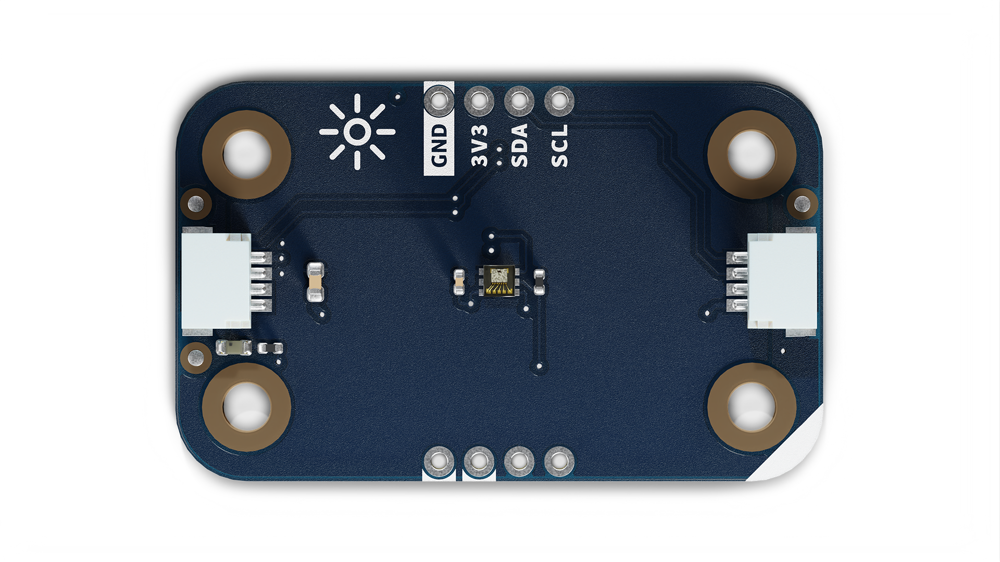
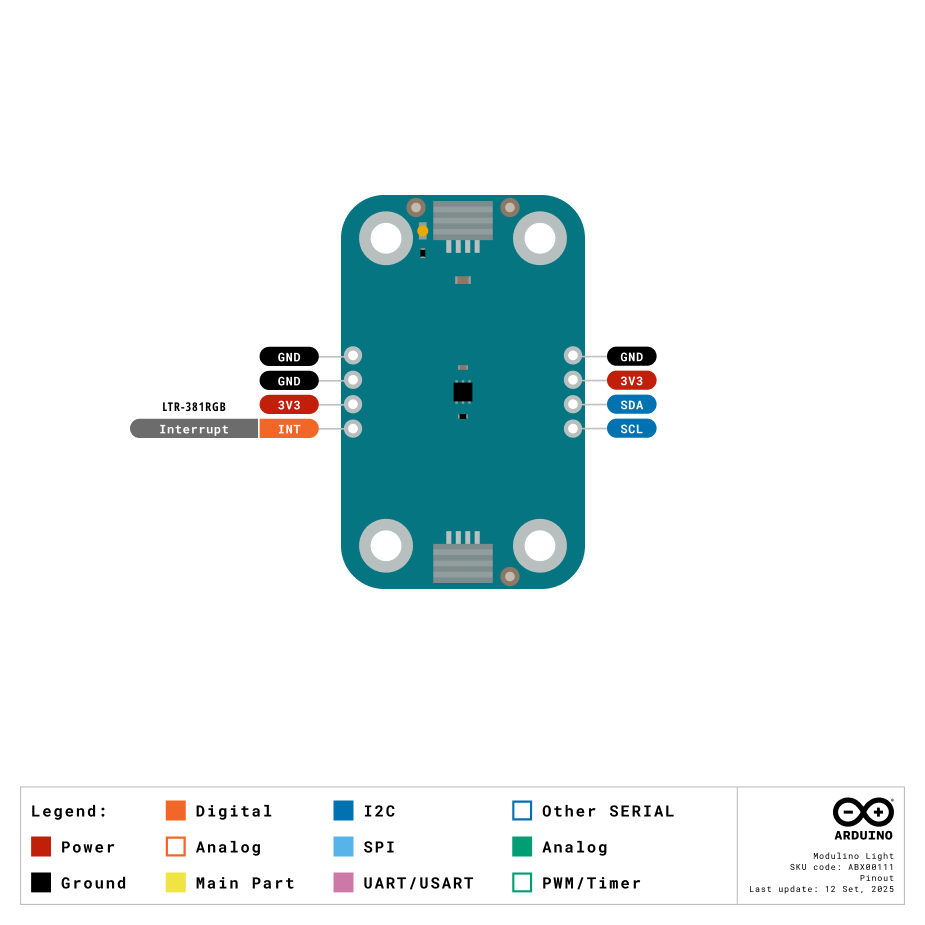

The Modulino Light is a modular colour sensor that measures ambient light, RGB colour components, and infrared levels, making it perfect to add colour detection and light sensing to your projects. It uses the Modulino form factor with QWIIC connectors for easy integration.

## Hardware Overview

### General Characteristics

The Modulino Light is based on the LTR-381RGB-01 sensor from Lite-On, an integrated ambient light sensor (ALS) and colour sensor (CS) in a single package.

|     **Parameter**     | **Minimum** | **Typical** | **Maximum** | **Unit** |
|:---------------------:|:-----------:|:-----------:|:-----------:|:--------:|
| Sensor Supply Voltage |     1.7     |      -      |     3.6     |     V    |
| Operating Temperature |     -40     |      -      |     +85     |    °C    |
|     ADC Resolution    |      16     |      -      |      20     |    bit   |
|    Integration Time   |      25     |      -      |     400     |    ms    |
|      Lux Accuracy     |     -10     |      -      |     +10     |     %    |

<Alert type="note">

The sensor supply range above is the specification of the LTR-381RGB-01 itself. On the Modulino Light node, the sensor is always supplied at +3.3 VDC through the QWIIC connector or the 3V3 pin.

</Alert>

### Sensor Details

The **Modulino Light** node uses the **LTR-381RGB-01** colour sensor from Lite-On. This sensor natively supports digital communication (I²C), meaning it connects directly to the I²C bus without requiring additional conversion circuitry. The sensor provides measurements for the following:

- Red, green and blue colour channels
- Ambient light level
- Infrared (IR) level

The sensor supports I²C standard mode at 100 kHz and fast mode at 400 kHz. The Modulino library configures the bus at 100 kHz. The default address for the module is:

| **Modulino I²C Address** | **Hardware I²C Address** | **Editable Addresses (HEX)** |
|:------------------------:|:------------------------:|:----------------------------:|
|           0x53           |           0x53           |    Fixed hardware address    |

<Alert type="note">

Since the address cannot be changed on this Modulino specifically, using two or more identical modules on the same I²C bus will result in address conflicts and cause communication issues. To use several Modulino Light modules at the same time, connect them through a [Modulino Hub](https://store.arduino.cc/products/modulino-hub).

</Alert>

### Pinout



**Qwiic / I2C (1×4 Header)**

| **Pin** |     **Function**     |
|:-------:|:--------------------:|
|   GND   |        Ground        |
|  3.3 V  | Power supply (3.3 V) |
|   SDA   |       I²C data       |
|   SCL   |       I²C clock      |

These pads and the Qwiic connectors share the same I²C bus. You can optionally solder header pins here.

**Additional 1×4 Header (LTR-381RGB-01 Signals)**

| **Pin** |   **Function**   |
|:-------:|:----------------:|
|   GND   |      Ground      |
|   GND   |      Ground      |
|   3V3   |    3.3 V power   |
|   INT   | Interrupt output |

<Alert type="note">

The INT pin is an open-drain, active-low interrupt output with a 10 kΩ pull-up resistor to 3.3 V on the board. The sensor can assert it on threshold and data-ready events. The Modulino Arduino library does not use this pin.

</Alert>

### Power Specifications

The board is powered at +3.3 VDC through the QWIIC interface, as per the Qwiic standard.

|         Parameter         |          Condition          | Typical | Unit |
|:-------------------------:|:---------------------------:|:-------:|:----:|
|     Operating Voltage     |              -              |   3.3   |   V  |
| ALS Active Supply Current | Default duty cycle, gain 3x |   120   |  µA  |
|  CS Active Supply Current |      Default duty cycle     |   120   |  µA  |
|      Standby Current      |         Standby mode        |   1.2   |  µA  |

<Alert type="note">

The currents above are those of the LTR-381RGB-01 sensor alone. Total module consumption is higher, as the board also includes an always-on power LED.

</Alert>

### Schematic

The Modulino Light uses a simple circuit built around the **LTR-381RGB-01** sensor (U1), which handles colour detection, ambient light measurement, and I²C communication.

You can connect to the I²C pins (SDA and SCL) using either the **QWIIC connectors** (J1 and J2, recommended) or the **solderable pins** (J4). The board runs on **3.3 V** from the QWIIC cable or the **3V3 pin** on J4.

Full schematic and PCB files are available from the [Modulino Light page](https://docs.arduino.cc/hardware/modulinos/modulino-light).

## Programming with Arduino

The Modulino Light is fully compatible with the Arduino IDE and the official Modulino library. The following examples show how to read colours, measure light intensity, and build a colour-based application.

### Prerequisites

- Install the Modulino library via the Arduino IDE Library Manager
- Connect your Modulino Light via QWIIC or solderable headers

For detailed instructions on setting up your Arduino environment and installing libraries, please refer to the [Getting Started with Modulinos guide](../how-general).

Library repository available [here](https://github.com/arduino-libraries/Arduino_Modulino).

### Basic Example

```arduino
#include <Arduino_Modulino.h>

ModulinoLight light;

void setup() {
  Serial.begin(9600);
  Modulino.begin();

  // Always check the return value: if the sensor is not detected,
  // calling the reading methods afterwards leads to undefined behaviour.
  if (!light.begin()) {
    Serial.println("Modulino Light not detected. Check the QWIIC connection.");
    while (1);
  }
}

void loop() {
  // Take a new reading. This call is blocking and takes several tens of
  // milliseconds, since the sensor performs two acquisition cycles.
  if (!light.update()) {
    Serial.println("Reading failed");
    delay(500);
    return;
  }

  // Approximate colour name, derived from the RGB channels
  String colourName = light.getColorApproximate();

  // RGB components, packed into a 32-bit value
  ModulinoColor colour = light.getColor();
  int r = (0xFF000000 & colour) >> 24;  // Red:   bits 24-31
  int g = (0x00FF0000 & colour) >> 16;  // Green: bits 16-23
  int b = (0x0000FF00 & colour) >> 8;   // Blue:  bits 8-15

  int rawAmbient = light.getAL();   // Raw ambient light count
  int lux = light.getLux();         // Ambient light, converted to lux
  int ir = light.getIR();           // Infrared level

  Serial.print("Colour: ");
  Serial.print(colourName);
  Serial.print("\tRGB: (");
  Serial.print(r);
  Serial.print(", ");
  Serial.print(g);
  Serial.print(", ");
  Serial.print(b);
  Serial.print(")\tRaw AL: ");
  Serial.print(rawAmbient);
  Serial.print("\tLux: ");
  Serial.print(lux);
  Serial.print("\tIR: ");
  Serial.println(ir);

  delay(500);
}
```

### Key Functions

- `begin()`: Initialises the sensor at address 0x53. Returns `true` if the sensor responded.
- `update()`: Takes a new reading of colour, ambient light and IR. Returns `true` if successful. All the getters below return values cached by this call, so `update()` must be called on every iteration.
- `getColor()`: Returns a `ModulinoColor` object. Extract the individual channels with the bit shifting shown above. Each channel is scaled to the range 0 to 255.
- `getColorApproximate()`: Returns an approximate colour name as a `String`. See the section below for the full vocabulary.
- `getAL()`: Returns the **raw** ambient light count, not a value in lux.
- `getLux()`: Returns the ambient light converted to lux using the datasheet formula.
- `getIR()`: Returns the infrared level.

<Alert type="note">

`getLux()` applies the conversion formula from the LTR-381RGB-01 datasheet using the gain and integration time configured by the library. It is not a factory-calibrated photometric measurement, and it does not compensate for any enclosure or cover placed over the sensor. Treat it as a relative indication of brightness.

</Alert>

### Understanding the Colour Names

`getColorApproximate()` converts the RGB reading to the HSL colour space and builds a name from three parts: an optional saturation qualifier, an optional lightness qualifier, and a hue name.

The twelve hue names are:

`RED` · `ORANGE` · `YELLOW` · `LIME` · `GREEN` · `SPRING GREEN` · `CYAN` · `AZURE` · `BLUE` · `VIOLET` · `MAGENTA` · `ROSE`

The qualifiers are `VERY DARK`, `DARK`, `LIGHT` and `VERY LIGHT` for lightness, and `VERY PALE`, `PALE`, `VIVID` and `VERY VIVID` for saturation. A typical result therefore looks like `PALE DARK AZURE` rather than a single word.

Very bright, very dark or very desaturated readings return one of the neutral names instead: `WHITE`, `BLACK`, `LIGHT GRAY` or `DARK GRAY`.

***When you compare the result against a colour, match a substring rather than the whole string. `colourName == "BLUE"` will fail for a reading of `VIVID LIGHT BLUE`, while `colourName.indexOf("BLUE") >= 0` will succeed.***

### Advanced Example - Colour Categorisation

This example groups the detected colour into families and prints the result. It matches substrings, so it works with the compound names returned by the library.

```arduino
#include <Arduino_Modulino.h>

ModulinoLight light;

void setup() {
  Serial.begin(9600);
  Modulino.begin();

  if (!light.begin()) {
    Serial.println("Modulino Light not detected. Check the QWIIC connection.");
    while (1);
  }

  Serial.println("Colour Categorisation");
  Serial.println("Place coloured objects under the sensor");
  Serial.println("---------------------------------------");
}

void loop() {
  if (!light.update()) {
    Serial.println("Reading failed");
    delay(1000);
    return;
  }

  String colour = light.getColorApproximate();

  ModulinoColor rgb = light.getColor();
  int r = (0xFF000000 & rgb) >> 24;
  int g = (0x00FF0000 & rgb) >> 16;
  int b = (0x0000FF00 & rgb) >> 8;

  Serial.print("Detected colour: ");
  Serial.print(colour);
  Serial.print("\tRGB: (");
  Serial.print(r);
  Serial.print(", ");
  Serial.print(g);
  Serial.print(", ");
  Serial.print(b);
  Serial.print(")\tCategory: ");
  Serial.println(categoriseColour(colour));

  delay(1000);
}

// Groups a colour name returned by getColorApproximate() into a family.
// The comparison uses indexOf() because the library returns compound
// names such as "PALE DARK AZURE".
String categoriseColour(String colour) {
  colour.toUpperCase();

  // Neutrals are checked first: they are returned instead of a hue name.
  if (colour.indexOf("WHITE") >= 0 || colour.indexOf("BLACK") >= 0 ||
      colour.indexOf("GRAY") >= 0) {
    return "NEUTRAL COLOURS";
  }

  // SPRING GREEN and LIME are checked before GREEN is matched on its own.
  if (colour.indexOf("RED") >= 0 || colour.indexOf("ROSE") >= 0 ||
      colour.indexOf("ORANGE") >= 0) {
    return "WARM COLOURS";
  } else if (colour.indexOf("YELLOW") >= 0) {
    return "BRIGHT COLOURS";
  } else if (colour.indexOf("GREEN") >= 0 || colour.indexOf("LIME") >= 0) {
    return "NATURAL COLOURS";
  } else if (colour.indexOf("CYAN") >= 0 || colour.indexOf("AZURE") >= 0 ||
             colour.indexOf("BLUE") >= 0) {
    return "COOL COLOURS";
  } else if (colour.indexOf("VIOLET") >= 0 || colour.indexOf("MAGENTA") >= 0) {
    return "VIOLET TONES";
  }

  return "UNKNOWN";
}
```

<Alert type="note">

For repeatable colour readings, keep the object at a constant distance from the sensor and shield it from changing ambient light. The sensor has no built-in illumination source, so the colour it reports depends on the light falling on the object.

</Alert>

## Programming with MicroPython

The Modulino Light is fully compatible with MicroPython through the official Modulino MicroPython library.

### Prerequisites

- Install the Modulino MicroPython library. The recommended method uses `mpremote` and `mip`:

  ```
  mpremote mip install github:arduino/arduino-modulino-mpy
  ```

  This also installs the `ltr381rgb` sensor driver, which the Modulino Light depends on.

- Ensure Arduino Lab for MicroPython is installed

See [Getting Started with Modulinos](../how-general) for detailed instructions.

### Basic Example

```python
from modulino import ModulinoLight
from time import sleep

light = ModulinoLight()

while True:
    r, g, b = light.rgb

    print(f"Colour: {light.color_name:8s}  RGB: ({r:3d}, {g:3d}, {b:3d})", end="")
    print(f"  Lux: {light.lux:8.1f}  IR: {light.infrared:6d}")

    # Returns None when there is not enough light to estimate it
    temperature = light.color_temperature
    if temperature is not None:
        print(f"Colour temperature: {temperature} K")

    sleep(0.5)
```

### Key Properties

- `.lux`: Ambient brightness in lux, as a `float`. Computed from the datasheet formula, not factory calibrated.
- `.rgb`: Tuple of `(red, green, blue)` values in the range 0 to 255.
- `.color_name`: Approximate colour name as a lowercase `str`.
- `.color_temperature`: Colour temperature in kelvin as an `int`, or `None` when there is not enough light to estimate it.
- `.infrared`: Infrared level as an `int`.
- `.sensor`: The underlying `LTR381RGB` driver object, for advanced configuration.

***Note the spelling: the API uses `color`, not `colour`.***

### Differences from the Arduino Library

The MicroPython implementation is not a direct port of the Arduino one. Keep these differences in mind when moving an application between the two.

|     **Aspect**     |                 **Arduino**                 |                       **MicroPython**                       |
|:------------------:|:-------------------------------------------:|:-----------------------------------------------------------:|
|    Colour names    | Compound, uppercase, e.g. `PALE DARK AZURE` |             Single word, lowercase, e.g. `azure`            |
|  Colour vocabulary |  12 hues, plus qualifiers and neutral names |           12 hues only, no qualifiers, no neutrals          |
|     RGB scaling    |   Absolute, relative to the ADC resolution  | Normalised per sample: the highest channel is mapped to 255 |
|      Lux type      |                    `int`                    |                           `float`                           |
| Colour temperature |                Not available                |                          Available                          |
|   Sensor settings  |                 Not exposed                 |       Gain and integration time exposed via `.sensor`       |

The twelve names returned by `.color_name` in MicroPython are:

`red` · `orange` · `yellow` · `lime` · `green` · `spring` · `cyan` · `azure` · `blue` · `violet` · `magenta` · `rose`

***In very dark or very desaturated conditions the MicroPython driver falls back to `red`. Do not treat a `red` reading as a confident detection without checking the brightness first.***

### Advanced Example - Tuning the Sensor

The `ModulinoLight` class covers the most common readings, but the sensor can do more. Reach it directly through the `.sensor` attribute to change the gain, which amplifies weak light, and the integration time, which is how long the sensor collects light for each reading. Higher values help in dim conditions; lower values work better in bright environments.

```python
from modulino import ModulinoLight
from ltr381rgb import Gain, IntegrationTime
from time import sleep

light = ModulinoLight()

# Increase gain and integration time for better readings in low light
light.sensor.gain = Gain.X9
light.sensor.integration_time = IntegrationTime.MS200

print("Sensor reconfigured for low-light readings")
print(f"Integration time: {light.sensor.integration_time_ms} ms")
print("")

MIN_LUX = 50

def categorise_colour(colour_name):
    """Group a colour name returned by .color_name into a family."""
    name = colour_name.lower()

    if name in ("red", "rose", "orange"):
        return "WARM COLOURS"
    elif name == "yellow":
        return "BRIGHT COLOURS"
    elif name in ("green", "lime", "spring"):
        return "NATURAL COLOURS"
    elif name in ("cyan", "azure", "blue"):
        return "COOL COLOURS"
    elif name in ("violet", "magenta"):
        return "VIOLET TONES"

    return "UNKNOWN"

while True:
    lux = light.lux

    # The driver returns "red" as a fallback when there is not enough
    # light or saturation, so check the brightness before trusting the name.
    if lux < MIN_LUX:
        print("Not enough light for a reliable colour reading")
        sleep(1)
        continue

    colour_name = light.color_name
    r, g, b = light.rgb

    print(f"Colour: {colour_name:8s}  RGB: ({r:3d}, {g:3d}, {b:3d})", end="")
    print(f"  Lux: {lux:8.1f}  Category: {categorise_colour(colour_name)}")

    sleep(1)
```

***`MIN_LUX` is an empirical threshold. Because the lux value is not factory calibrated, tune it for your own lighting conditions rather than reusing this number directly.***

## Troubleshooting

### Sensor Not Reachable

If your Modulino's power LED isn't on or the sensor isn't responsive:

- Ensure both the board and the Modulino are connected to your computer
- Verify that the power LEDs on both are lit
- Check that the QWIIC cable is properly clicked into place
- Check the return value of `light.begin()` in Arduino. If it returns `false`, the sensor did not answer at address 0x53
- If you have more than one Modulino Light on the bus, remove all but one: the address is fixed and cannot be changed

### Inaccurate Colour Detection

If the colour readings are not accurate:

- Ensure adequate lighting conditions. The sensor has no built-in light source and reports the light reflected from the object
- Position the sensor facing the object directly
- Avoid mixed lighting sources, for example daylight combined with artificial light
- Keep the sensor at a consistent distance from objects
- In MicroPython, increase the gain and the integration time for dim environments, as shown in the advanced example

### Readings Do Not Change

In Arduino, all getters return values cached by the last call to `update()`. If you call `getColor()` or `getColorApproximate()` without calling `update()` first in the same iteration, you will read the same values indefinitely.

### Library Issues

See the [Getting Started with Modulinos](../how-general) guide for library installation troubleshooting.

## Project Ideas

Now that you've learned how to use your Modulino Light, try these projects:

- **Colour Sorting Machine**: Automatically sort objects by colour
- **Ambient Light Controller**: Adjust LED brightness based on room lighting
- **Colour Matching Game**: Create interactive colour identification games
- **Paint Colour Identifier**: Help identify paint or material colours
- **Plant Monitor**: Track light levels for optimal plant growth
- **Colour-Reactive Art Installation**: Drive a Modulino Pixels strip from the detected colour
- **Light Logger**: Record ambient light across a day to profile a room