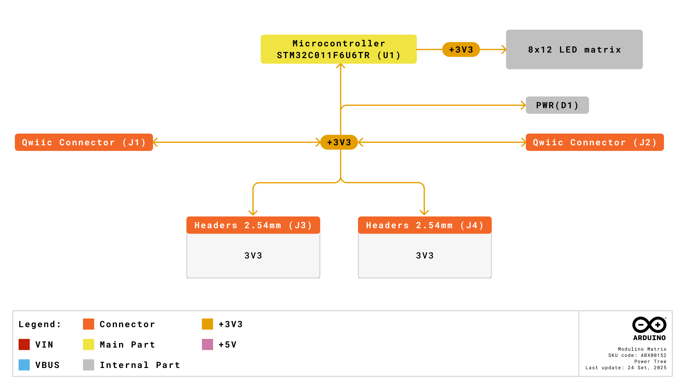
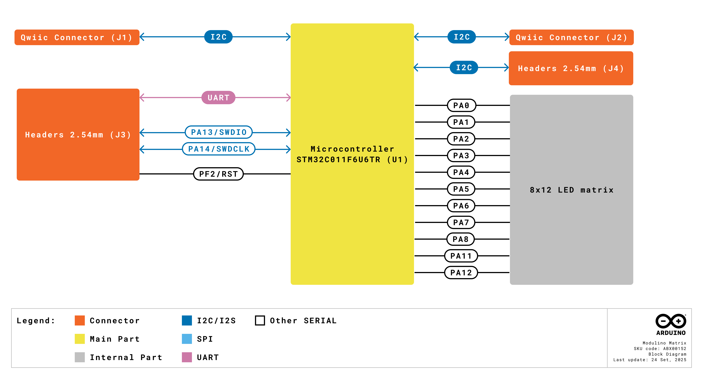
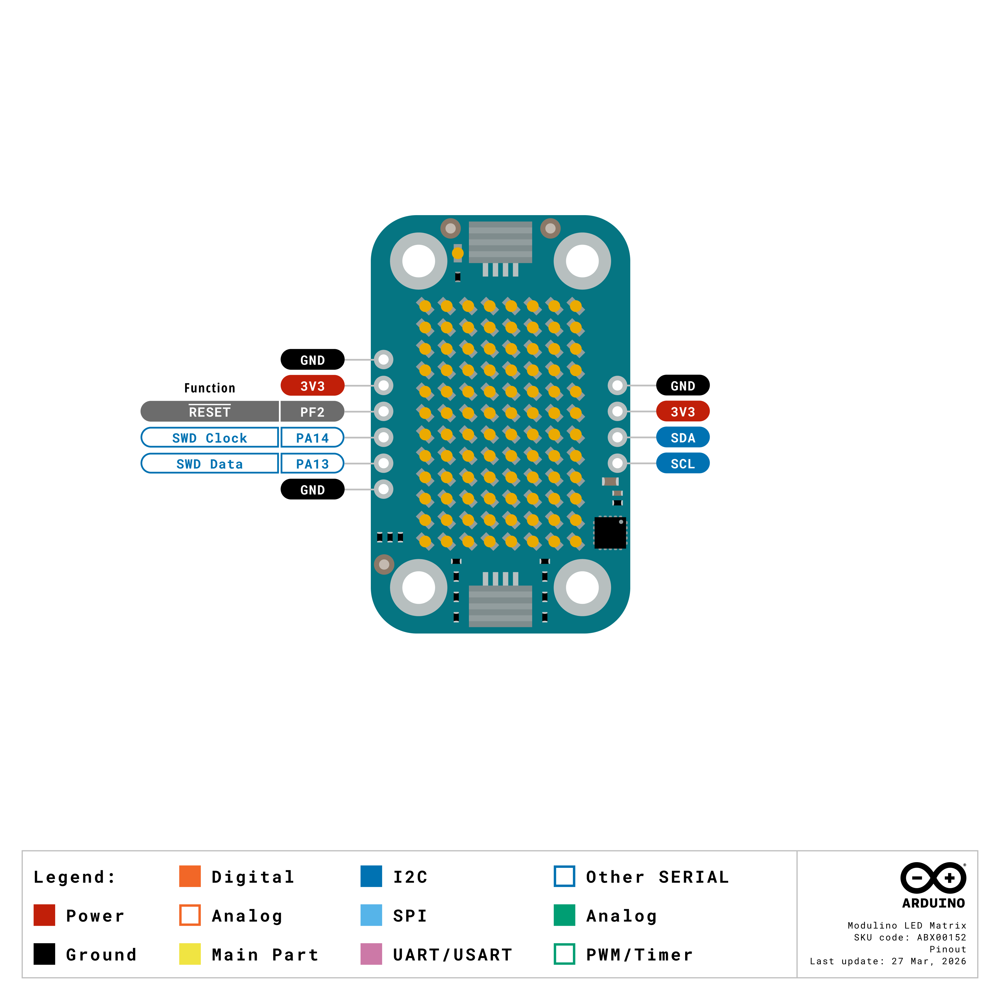
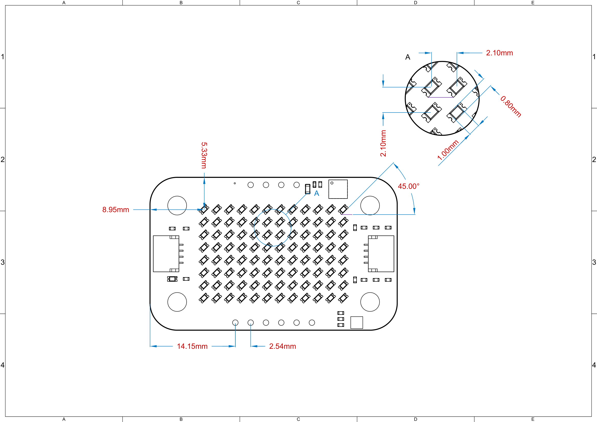
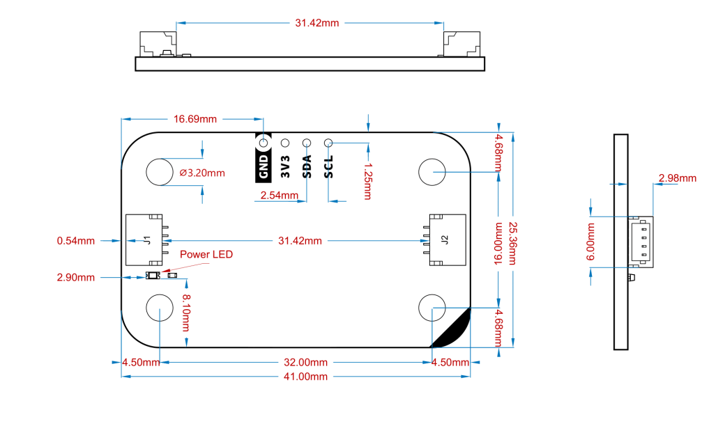
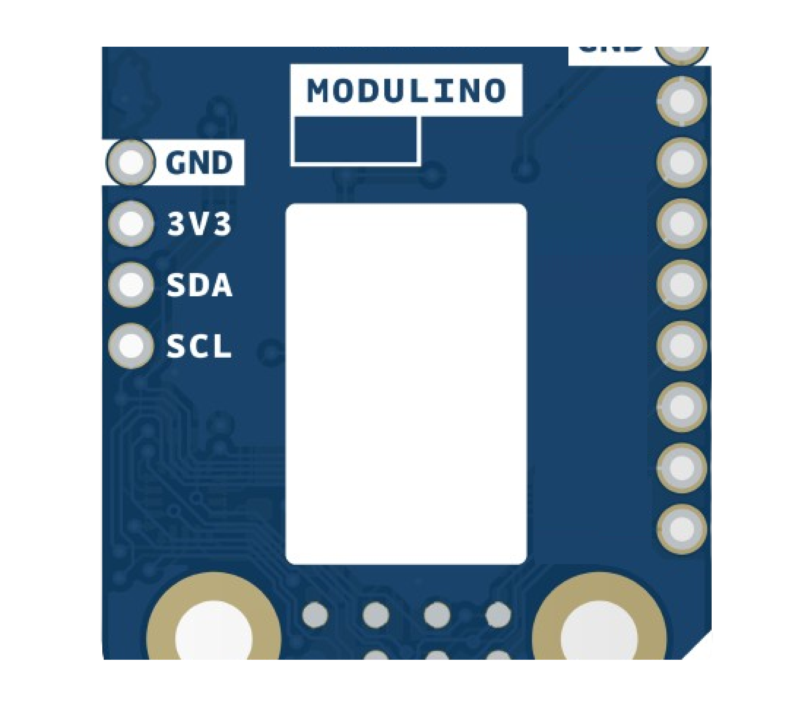
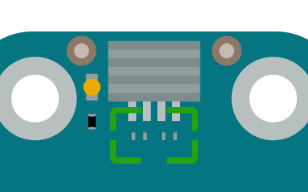

# Description

The Arduino Modulino LED Matrix features an 8×12 LED matrix (96 blue LEDs total) controlled by an on-board STM32C011F4U6TR microcontroller using charlieplexing technology. This display module provides LED matrix functionality for enabling text, graphics, animations, and visual feedback for a wide range of interactive projects.

# Target Areas

Maker, beginner, education

# Contents
## Application Examples

- **Text and Graphics Display**
  Show scrolling text, numbers, symbols, or simple graphics for status displays, counters, or informational interfaces.

- **Visual Notifications**
  Create eye-catching alerts, progress bars, or status indicators for IoT projects, alarms, or system monitoring applications.

- **Interactive Art and Games**
  Design animated displays, simple games, or artistic patterns with programmable LED matrix effects and real-time graphics.

## Features
- **8×12 LED matrix** (96 blue LEDs total) providing versatile display capabilities.
- **Charlieplexing control** using 11 microcontroller pins for efficient LED driving.
- Integrated **STM32C011F4U6TR** microcontroller providing I2C interface.
- Designed for **3.3V** operation via the Qwiic connector (I2C).

### Contents
| **SKU**    | **Name**              | **Purpose**                            | **Quantity** |
| ---------- | --------------------- | -------------------------------------- | ------------ |
| ABX00152   | Modulino LED Matrix  | 8×12 programmable LED display          | 1            |
|            | I2C Qwiic cable       | Compatible with the Qwiic standard     | 1            |

## Related Products
- *SKU: ASX00027* - [Arduino® Sensor Kit](https://store.arduino.cc/products/arduino-sensor-kit)
- *SKU: K000007* - [Arduino® Starter Kit](https://store.arduino.cc/products/arduino-starter-kit-multi-language)
- *SKU: AKX00026* - [Arduino® Oplà IoT Kit](https://store.arduino.cc/products/opla-iot-kit)
- *SKU: AKX00069* - [Arduino® Plug and Make Kit](https://store.arduino.cc/products/plug-and-make-kit)

## Rating

### Recommended Operating Conditions
- **Powered at 3.3 V** through the Qwiic interface (in accordance with the Qwiic standard)
- **Operating temperature:** -40 °C to +85 °C

**Typical current consumption:**
- Microcontroller: ~3.4 mA
- LED matrix: Variable based on number of active LEDs (up to ~200 mA peak)

## Power Tree
The power tree for the Modulino LED Matrix can be consulted below:

## Block Diagram
This node includes an STM32C011F4U6TR microcontroller that drives an 8×12 LED matrix using charlieplexing with 11 GPIO pins. It communicates via I2C by default, but can be reprogrammed via SWD for custom display functions.

## Functional Overview
The Modulino LED Matrix uses charlieplexing technology to control 96 blue LEDs (LTST-C191TBK) with only 11 microcontroller pins (PA0-PA8, PA11, PA12). This efficient multiplexing technique allows individual LED control whilst minimising pin usage. The STM32C011F4U6TR manages the complex timing required for charlieplexing and provides simple I2C commands for drawing text, graphics, and animations.

### Technical Specifications (Module-Specific)
| **Specification**       | **Details**                                     |
| ----------------------- | ----------------------------------------------- |
| **Microcontroller**     | STM32C011F4U6TR                                 |
| **LED Matrix**          | 8×12 LEDs (96 total)                           |
| **LED Color**           | Blue                                            |
| **LED Part Number**     | LTST-C191TBK                                    |
| **Control Method**      | Charlieplexing with 11 pins                    |
| **Supply Voltage**      | 3.3 V                           |
| **Power Consumption**   | ~3.4 mA (MCU) + variable (LEDs, up to 200 mA)    |
| **Display Resolution** | 8 rows × 12 columns                            |

### Pinout

**Qwiic / I2C (1×4 Solderable Pads)**
| **Pin** | **Function**              |
|---------|---------------------------|
| GND     | Ground                   |
| 3.3 V    | Power Supply (3.3 V)     |
| SDA     | I2C Data                 |
| SCL     | I2C Clock                |

These solderable pads and the Qwiic connectors share the same I2C bus at 3.3 V.

**Note:** The 1×4 header is not mounted by default; only the solderable pads are provided for custom wiring solutions.

**Additional 1×6 Header (Debug & Power)**
| **Pin** | **Function**      |
|---------|-------------------|
| GND     | Ground            |
| 3V3     | 3.3 V Power       |
| PF2     | RESET (NRST)      |
| SWCLK   | SWD Clock (PA14)  |
| SWDIO   | SWD Data (PA13)   |
| GND     | Ground            |

**Note:** The LED matrix is controlled by pins PA0, PA1, PA2, PA3, PA4, PA5, PA6, PA7, PA8, PA11, and PA12 using charlieplexing. Due to space constraints on the specialised PCB, only the RESET strap is populated.

### Power Specifications
- **Nominal operating voltage:** 3.3 V via Qwiic
- **LED matrix current:** Variable, up to 200 mA peak

### Mechanical Information

- Board dimensions: 41 mm × 25.36 mm
- Thickness: 1.6 mm (±0.2 mm) 
- Four mounting holes (⌀ 3.2 mm)
  - Hole spacing: 16 mm vertically, 32 mm horizontally

### I2C Address Reference
| **Board Silk Name** | **Sensor/Actuator**     | **Modulino I2C Address (HEX)** | **Editable Addresses (HEX)**                | **Hardware I2C Address (HEX)** |
|---------------------|-------------------------|--------------------------------|---------------------------------------------|--------------------------------|
| MODULINO LED MATRIX | 8×12 LED Matrix         | 0x32                           | Any custom address (via software config.)   | 0x19                           |

 **Note:**
 - Default I2C address is **0x32**.
 - A white rectangle on the bottom silk allows users to write a new address after reconfiguration.
  
  

#### Pull-up Resistors

This module has pads for optional I2C pull-up mounting in both data lines. No resistors are mounted by default but in case the resistors are needed 4.7 K resistors in an SMD 0402 format are recommended.

These are positioned near the Qwiic connector on the power LED side.

## Device Operation
By default, the board is an I2C target device that manages the complex charlieplexing required to control the 8×12 LED matrix. The STM32C011F4U6TR handles all timing-critical operations whilst providing simple I2C commands for drawing pixels, text, and graphics. The matrix provides the same dimensions as the Arduino® UNO R4 WiFi LED matrix (but with blue LEDs instead of red), ensuring code compatibility.

### Getting Started
Use any standard Arduino workflow-desktop IDE or Arduino Cloud Editor. The official Modulino library provides comprehensive graphics functions compatible with Arduino® UNO R4 WiFi matrix code. Power considerations should account for LED matrix current draw when multiple LEDs are illuminated simultaneously.

# Certifications

## Certifications Summary

| **Certification** | **Status** |
|:-----------------:|:----------:|
|  CE/RED (Europe)  |     Yes    |
|     UKCA (UK)     |     Yes    |
|     FCC (USA)     |     Yes    |
|    IC (Canada)    |     Yes    |
|        RoHS       |     Yes    |
|       REACH       |     Yes    |
|        WEEE       |     Yes    |

## Declaration of Conformity CE DoC (EU)

We declare under our sole responsibility that the products above are in conformity with the essential requirements of the following EU Directives and therefore qualify for free movement within markets comprising the European Union (EU) and European Economic Area (EEA).

## Declaration of Conformity to EU RoHS & REACH 211 01/19/2021

Arduino boards are in compliance with RoHS 2 Directive 2011/65/EU of the European Parliament and RoHS 3 Directive 2015/863/EU of the Council of 4 June 2015 on the restriction of the use of certain hazardous substances in electrical and electronic equipment.

| Substance                              | **Maximum limit (ppm)** |
|----------------------------------------|-------------------------|
| Lead (Pb)                              | 1000                    |
| Cadmium (Cd)                           | 100                     |
| Mercury (Hg)                           | 1000                    |
| Hexavalent Chromium (Cr6+)             | 1000                    |
| Poly Brominated Biphenyls (PBB)        | 1000                    |
| Poly Brominated Diphenyl ethers (PBDE) | 1000                    |
| Bis(2-Ethylhexyl) phthalate (DEHP)     | 1000                    |
| Benzyl butyl phthalate (BBP)           | 1000                    |
| Dibutyl phthalate (DBP)                | 1000                    |
| Diisobutyl phthalate (DIBP)            | 1000                    |

Exemptions: No exemptions are claimed.

Arduino Boards are fully compliant with the related requirements of European Union Regulation (EC) 1907 /2006 concerning the Registration, Evaluation, Authorization and Restriction of Chemicals (REACH). We declare none of the SVHCs (https://echa.europa.eu/web/guest/candidate-list-table), the Candidate List of Substances of Very High Concern for authorization currently released by ECHA, is present in all products (and also package) in quantities totaling in a concentration equal or above 0.1%. To the best of our knowledge, we also declare that our products do not contain any of the substances listed on the "Authorization List" (Annex XIV of the REACH regulations) and Substances of Very High Concern (SVHC) in any significant amounts as specified by the Annex XVII of Candidate list published by ECHA (European Chemical Agency) 1907 /2006/EC.

## FCC WARNING

This device complies with part 15 of the FCC Rules.

Operation is subject to the following two conditions: 

(1) This device may not cause harmful interference, and (2) this device must accept any interference received, including interference that may cause undesired operation.

## IC Caution

This device complies with Industry Canada licence-exempt RSS standard(s). 

Operation is subject to the following two conditions: 

(1) This device may not cause interference, and (2) this device must accept any interference, including interference that may cause undesired operation of the device.

## Conflict Minerals Declaration

As a global supplier of electronic and electrical components, Arduino is aware of our obligations with regard to laws and regulations regarding Conflict Minerals, specifically the Dodd-Frank Wall Street Reform and Consumer Protection Act, Section 1502. Arduino does not directly source or process conflict minerals such as Tin, Tantalum, Tungsten, or Gold. Conflict minerals are contained in our products in the form of solder or as a component in metal alloys. As part of our reasonable due diligence, Arduino has contacted component suppliers within our supply chain to verify their continued compliance with the regulations. Based on the information received thus far we declare that our products contain Conflict Minerals sourced from conflict-free areas.

# Company Information

| Company name    | Arduino SRL                                   |
|-----------------|-----------------------------------------------|
| Company Address | Via Andrea Appiani, 25 - 20900 MONZA（Italy)  |

# Reference Documentation

| Ref                       | Link                                                                                                                                                                                           |
| ------------------------- | ---------------------------------------------------------------------------------------------------------------------------------------------------------------------------------------------- |
| Arduino IDE (Desktop)     | [https://www.arduino.cc/en/software/](https://www.arduino.cc/en/software/)                                                                                                             |
| Arduino Courses           | [https://www.arduino.cc/education/courses](https://www.arduino.cc/education/courses)                                                                                                           |
| Arduino Documentation     | [https://docs.arduino.cc/](https://docs.arduino.cc/)                                                                                                           |
| Arduino IDE (Cloud)       | [https://create.arduino.cc/editor](https://create.arduino.cc/editor)                                                                                                                           |
| Cloud IDE Getting Started | [https://docs.arduino.cc/cloud/web-editor/tutorials/getting-started/getting-started-web-editor](https://docs.arduino.cc/cloud/web-editor/tutorials/getting-started/getting-started-web-editor) |
| Project Hub               | [https://projecthub.arduino.cc/](https://projecthub.arduino.cc/)                                                                                                                          |
| Library Reference         | [https://github.com/arduino-libraries/](https://github.com/arduino-libraries/)                                                                                                            |
| Online Store              | [https://store.arduino.cc/](https://store.arduino.cc/)                                                                                                                                    |

# Revision History
| **Date**   | **Revision** | **Changes**                       |
|------------|--------------|-----------------------------------|
| 27/03/2026 | 1            | First release                     |