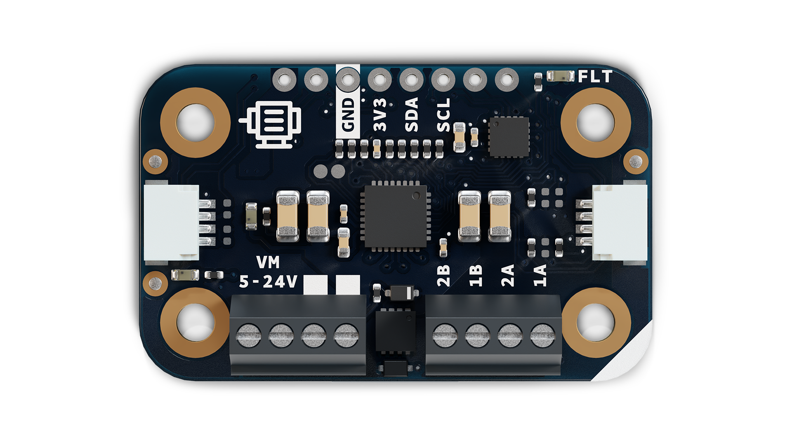
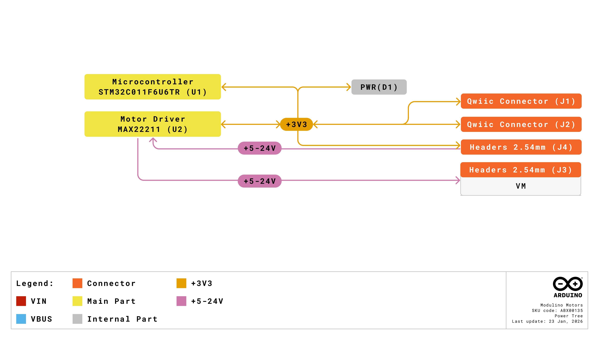
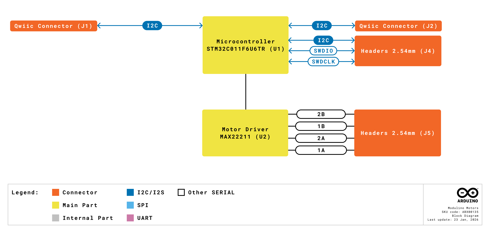
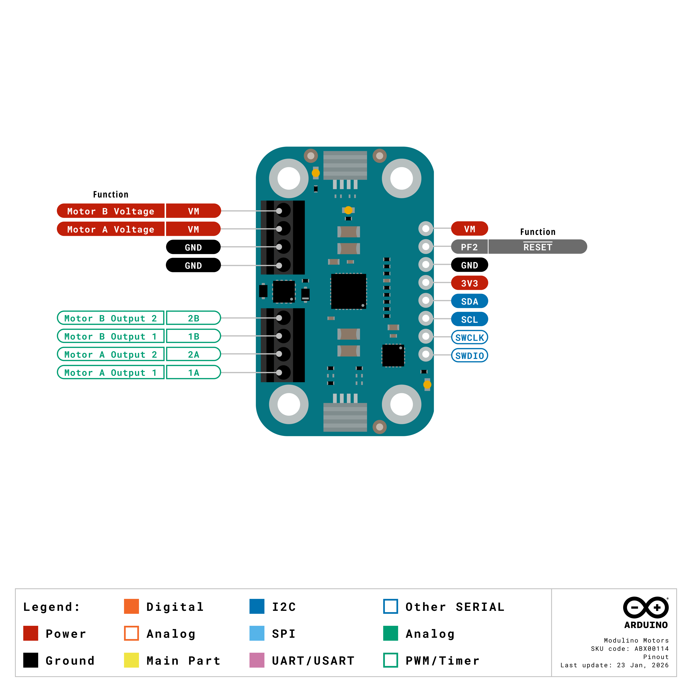
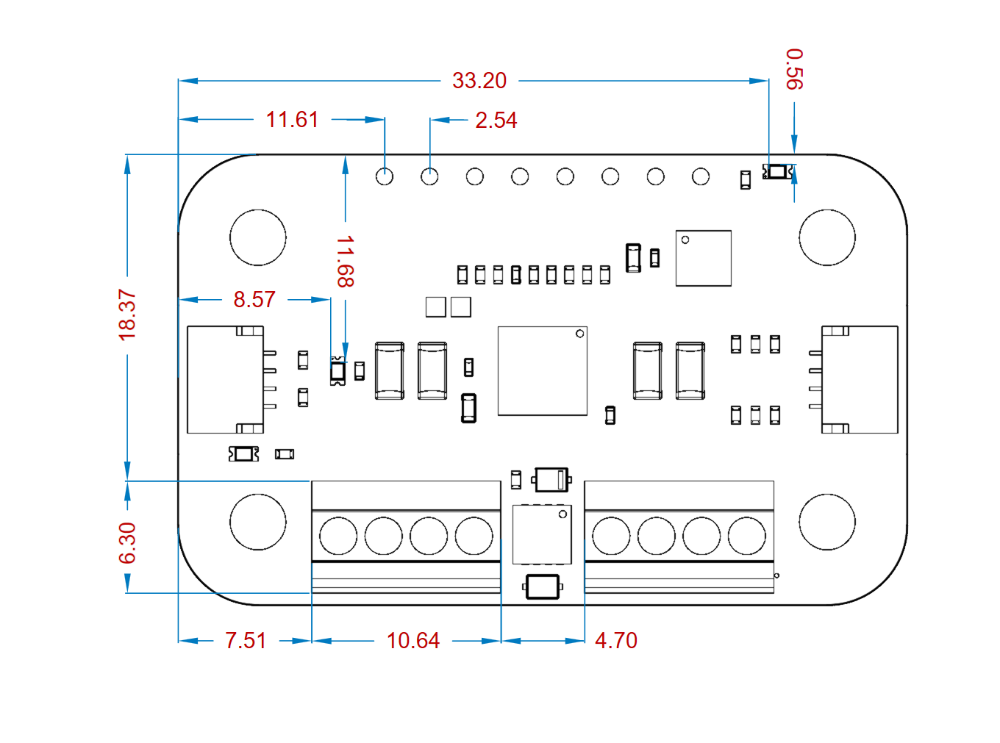
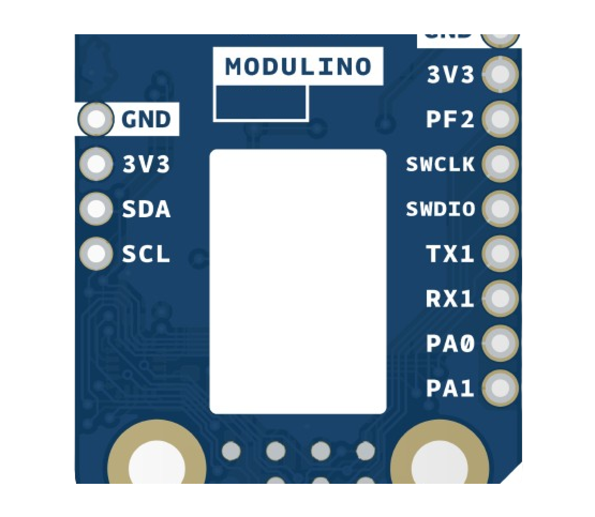

# Description
The Modulino Motors, powered by an on-board STM32C011F6 microcontroller and featuring the MAX22211 dual H-bridge driver, delivers precise motor control for up to two brushed DC motors, two solenoids, two latched valves, or one stepper motor. Designed for high-current applications, it handles motor voltages from 5 V to 24 V while maintaining safe operation with reverse polarity protection and transient voltage suppression.

# Target Areas
Maker, beginner, education, robotics

# Contents
## Application Examples

- **Mobile Robotics**
  Drive two independent brushed DC motors for differential steering in mobile robots and vehicles.

- **Automation & Control**
  Actuate solenoids, valves, or small industrial actuators with precise timing and current control.

- **Stepper Motor Projects**
  Control a single bipolar stepper motor for CNC machines, 3D printers, or precise positioning systems.

## Features
- **MAX22211** dual H-bridge driver supporting up to **3.8 A** per channel.
- Separate **motor supply input** (VM) ranging from **5 V to 24 V**.
- **STM32C011F6** microcontroller providing I2C interface and motor control logic.
- **Reverse polarity protection** via PMOS and **transient overvoltage protection** with 24 V TVS.
- **Fault detection** with dedicated indicator LED and open-drain fault pin.
- **Two 1×4 screw terminal blocks** for motor connections and power input.

### Contents
| **SKU**    | **Name**            | **Purpose**                                    | **Quantity** |
| ---------- | ------------------- | ---------------------------------------------- | ------------ |
| ABX00114   | Modulino Motors     | Dual H-bridge motor driver with I2C control    | 1            |
|            | I2C Qwiic cable     | Compatible with the Qwiic standard             | 1            |

## Related Products

- **SKU: ABX00087** – [Arduino® UNO R4 WiFi](https://store.arduino.cc/products/uno-r4-wifi)
- **SKU: ABX00162** – [Arduino® UNO Q](https://store.arduino.cc/products/uno-q)
- **SKU: ABX00142/ABX00143** – [Arduino® Nano R4](https://store.arduino.cc/products/nano-r4)
- **SKU: ASX00061** – [Nano Connector Carrier](https://store.arduino.cc/products/nano-connector-carrier)
- **SKU: AKX00069** – [Plug and Make Kit](https://store.arduino.cc/products/plug-and-make-kit)

## Rating

### Recommended Operating Conditions
- **Microcontroller supply range:** 2.0 V – 3.6 V (STM32C011F6)
- **Motor supply voltage (VM):** 5 V – 24 V
- **Powered at 3.3 V** through the Qwiic interface (in accordance with the Qwiic standard)
- **Operating temperature:** –40 °C to +85 °C
- **Maximum output current:** 3.8 A per channel

**Typical current consumption:**
- Microcontroller: ~3.4 mA idle
- Motor driver: Depends on connected motors (up to 3.8 A per channel)
- Power LED: ~1 mA
- Fault LED: ~2 mA (when active)

## Power Tree
The power tree for the Modulino node can be consulted below:

## Block Diagram
This module includes an STM32C011F6 microcontroller that controls the MAX22211 dual H-bridge driver. It communicates via I2C by default.

## Functional Overview
The Modulino Motors node provides a complete motor control solution with integrated protection features. The STM32C011F6 microcontroller receives commands via I2C and translates them into control signals for the MAX22211 H-bridge driver. The driver can operate in multiple modes including PWM speed control, brake, coast, and decay modes for optimal motor performance. The separate VM input allows motor voltages up to 24 V while the control logic operates safely at 3.3 V. Built-in reverse polarity protection and a 24 V TVS diode protect against common wiring errors and voltage transients.

### Technical Specifications (Module-Specific)
| **Specification**       | **Details**                                     |
| ----------------------- | ----------------------------------------------- |
| **Microcontroller**     | STM32C011F6                                   |
| **Motor Driver**        | MAX22211 (dual H-bridge)                   |
| **Supply Voltage**      | Logic: 3.3 V, Motor (VM): 5 V – 24 V           |
| **Maximum Current**     | 3.8 A per channel                               |
| **Power Consumption**   | Variable, depends on motor load                 |
| **Protection**          | Reverse polarity, overvoltage transient (24 V TVS) |
| **Communication**       | I2C (Qwiic)                                     |
| **Indicators**          | Yellow power LED (VM), Red fault LED            |

### Pinout

**Qwiic / I2C (1×4 Header)**
| **Pin** | **Function**              |
|---------|---------------------------|
| GND     | Ground                   |
| 3.3 V   | Power Supply (3.3 V)     |
| SDA     | I2C Data                 |
| SCL     | I2C Clock                |

These pads and the Qwiic connectors share the same I2C bus at 3.3 V.

**Left Screw Terminal (1×4, 2.54 mm pitch, black)**
| **Pin** | **Function**                 |
|---------|------------------------------|
| VM      | Motor power input (5–24 V)   |
| VM      | Motor power input (5–24 V)   |
| GND     | Ground                       |
| GND     | Ground                       |

**Right Screw Terminal (1×4, 2.54 mm pitch, black)**
| **Pin** | **Function**        |
|---------|---------------------|
| 1A      | Motor A output 1    |
| 2A      | Motor A output 2    |
| 1B      | Motor B output 1    |
| 2B      | Motor B output 2    |

**Additional 1×8 Header**

| **Pin** | **Function**   |
|---------|----------------|
| RESET   | Reset (PF2)    |
| SWCLK   | SWD Clock      |
| SWDIO   | SWD Data       |
| SDA     | I2C Data       |
| SCL     | I2C Clock      |
| VM      | Motor voltage  |
| 3V3     | 3.3 V Power    |
| GND     | Ground         |

**Note:**
- VM input includes reverse polarity protection and 24 V TVS for transient suppression.
- Do not exceed 24 V on VM input to avoid damage to protection circuitry.

### Power Specifications
- **Nominal operating voltage:** 3.3 V logic, 24 V motor (VM)
- **Motor voltage range:** 5 V–24 V
- **Microcontroller voltage range:** 2.0 V–3.6 V

### Mechanical Information

- Board dimensions: 41 mm × 25.36 mm
- Thickness: 1.6 mm (±0.2 mm)
- Four mounting holes (Ø 3.2 mm)
  - Hole spacing: 16 mm vertically, 32 mm horizontally

### I2C Address Reference
| **Board Silk Name** | **Motor Driver**     | **Modulino I2C Address (HEX)** | **Editable Addresses (HEX)**                | **Hardware I2C Address (HEX)** |
|---------------------|----------------------|--------------------------------|---------------------------------------------|--------------------------------|
| MODULINO MOTOR      | MAX22211        | 0x6A                           | Any custom address (via software config.)   | 0x35                           |

**Note:**
- Default I2C address is **0x6A**.
- A white rectangle on the bottom silk allows users to write a new address after reconfiguration.

## Device Operation
By default, the board operates as an I2C target device. It manages motor direction, speed (via PWM), and braking through integrated firmware. Connect motors to the right screw terminal and supply appropriate voltage to VM on the left terminal. The fault LED illuminates when overcurrent, overtemperature, or other fault conditions are detected by the MAX22211.

### Motor Connection Examples
- **Two DC motors:** Connect motor A to 1A/2A and motor B to 1B/2B
- **One stepper motor:** Connect coil A to 1A/2A and coil B to 1B/2B
- **Solenoids/valves:** Connect each device across respective output pairs

# Company Information

| Company name    | Arduino SRL                                   |
|-----------------|-----------------------------------------------|
| Company Address | Via Andrea Appiani, 25 - 20900 MONZA（Italy)  |

# Reference Documentation

| Ref                       | Link                                                                                                                                                                                           |
| ------------------------- | ---------------------------------------------------------------------------------------------------------------------------------------------------------------------------------------------- |
| Arduino IDE (Desktop)     | [https://www.arduino.cc/en/Main/Software](https://www.arduino.cc/en/Main/Software)                                                                                                             |
| Arduino Courses           | [https://www.arduino.cc/education/courses](https://www.arduino.cc/education/courses)                                                                                                           |
| Arduino Documentation     | [https://docs.arduino.cc/](https://docs.arduino.cc/)                                                                                                           |
| Arduino IDE (Cloud)       | [https://create.arduino.cc/editor](https://create.arduino.cc/editor)                                                                                                                           |
| Cloud IDE Getting Started | [https://docs.arduino.cc/cloud/web-editor/tutorials/getting-started/getting-started-web-editor](https://docs.arduino.cc/cloud/web-editor/tutorials/getting-started/getting-started-web-editor) |
| Project Hub               | [https://projecthub.arduino.cc/](https://projecthub.arduino.cc/)                                                                                                                          |
| Library Reference         | [https://github.com/arduino-libraries/](https://github.com/arduino-libraries/)                                                                                                            |
| Online Store              | [https://store.arduino.cc/](https://store.arduino.cc/)                                                                                                                                    |

# Revision History
| **Date**   | **Revision** | **Changes**       |
|------------|--------------|-------------------|
| 23/03/2026 | 1            | First release     |
