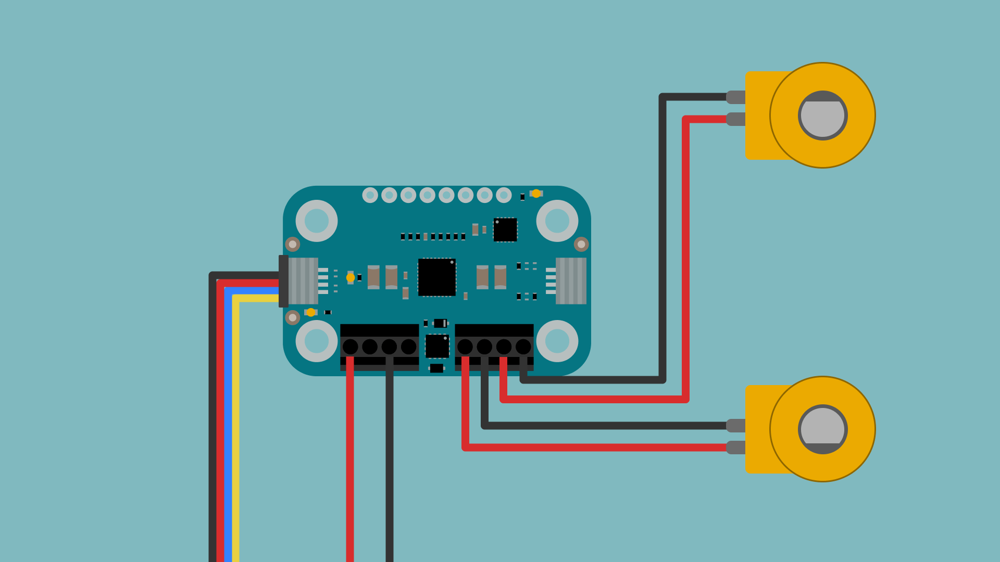
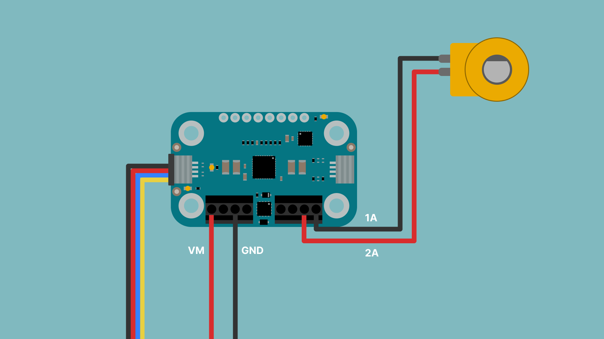
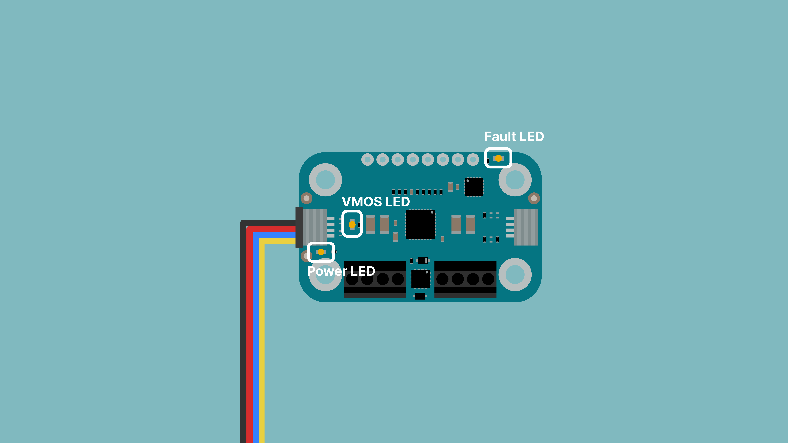

The Modulino Motors is a dual H-bridge motor driver that provides precise control for brushed DC motors, stepper motors, solenoids, and valves. Built around the MAX22211 driver and controlled by an STM32C011F6 microcontroller, it handles up to 3.8A per channel with built-in protection against reverse polarity and voltage transients.

## Hardware Overview

### General Characteristics

The **Modulino Motors** features the **MAX22211** dual H-bridge driver, providing independent control of two motor channels through I²C communication. Each channel delivers up to 3.8A, suitable for small to medium-sized motors and actuators.

| Specification | Details |
|---------------|---------|
| Motor Driver | MAX22211 (dual H-bridge) |
| Microcontroller | STM32C011F6 |
| Motor Voltage (VM) | 5V to 24V |
| Maximum Current | 3.8A per channel |
| Logic Voltage | 3.3V (via Qwiic) |
| Interface | I2C, Screw terminals |
| Protection | Reverse polarity, 24V TVS |

The module can control:
- **2 brushed DC motors** - Independent control for differential drive robots
- **1 stepper motor** - Bipolar stepper control for precise positioning
- **2 solenoids or valves** - On/off control for pneumatic or hydraulic actuators

The default I²C address for the **Modulino Motors** is:

| Modulino I²C Address | Hardware I²C Address | Editable Addresses (HEX) |
|----------------------|----------------------|--------------------------|
| 0x6A | 0x35 | Any custom address (via software configuration) |

### Pinout


#### Left Screw Terminal (Motor Power)

| Pin | Function |
|-----|----------|
| VM  | Motor power input (5-24V) |
| VM  | Motor power input (5-24V) |
| GND | Ground |
| GND | Ground |

#### Right Screw Terminal (Motor Outputs)

| Pin | Function |
|-----|----------|
| 1A  | Motor A output 1 |
| 2A  | Motor A output 2 |
| 1B  | Motor B output 1 |
| 2B  | Motor B output 2 |

#### 1x4 Header (I2C)

| Pin | Function |
|-----|----------|
| GND | Ground |
| 3.3V | Power Supply |
| SDA | I²C Data |
| SCL | I²C Clock |

#### 1x8 Header

| Pin | Function |
|-----|----------|
| RESET | Reset (PF2) |
| SWCLK | SWD Clock |
| SWDIO | SWD Data |
| SDA | I²C Data |
| SCL | I²C Clock |
| VM | Motor voltage |
| 3V3 | 3.3V Power |
| GND | Ground |

### Power Specifications

| Parameter | Condition | Minimum | Typical | Maximum | Unit |
|-----------|-----------|---------|---------|---------|------|
| Logic Supply Voltage | - | - | 3.3 (QWIIC) | - | V |
| Motor Supply Voltage (VM) | Nominal | 5 | 24 | - | V |
| Motor Supply Voltage (VM) | Transient | - | - | 36 | V |
| Output Current | Per channel | - | - | 3.8 | A |
| Logic Current | Idle | - | 3.4 | - | mA |

The module includes a power LED (yellow) that draws 1 mA when VM is connected, and a fault LED (red) that draws 2 mA when active.

### Schematic

The Modulino Motors uses the STM32C011F6 microcontroller to control the MAX22211 dual H-bridge driver via I²C communication.

The main components are the **MAX22211 H-bridge driver**, **STM32C011F6 microcontroller** (U1), and the **screw terminals** for motor connections. The separate VM input allows motor voltages up to 24V while control logic operates safely at 3.3V.

You can connect to the I²C pins (SDA and SCL) using either the **QWIIC connectors** (recommended) or the **solderable pins**. The board's logic runs on **3.3V** from the QWIIC cable or the **3V3 pin**.

You can grab the full schematic and PCB files from the [Modulino Motors page](https://docs.arduino.cc/hardware/modulinos/modulino-motor).

## Programming with Arduino

The Modulino Motors is fully compatible with the Arduino IDE and the official Modulino library. The following examples showcase basic motor control functionality for DC motors and stepper motors.

### Prerequisites

- Install the Modulino library via the Arduino IDE Library Manager
- Connect your Modulino Motors via QWIIC
- Connect motor power supply to VM (5-24V) and ground (GND) terminals



For detailed instructions on setting up your Arduino environment and installing libraries, please refer to the [Getting Started with Modulinos guide](./how-general).

Library repository available [here](https://github.com/arduino-libraries/Arduino_Modulino).

### DC Motor Control Example

```arduino
/*
 * Modulino Motors - Basic
 *
 * This example demonstrates basic DC motor control using ModulinoMotors.
 * It ramps motor A forward/reverse, then motor B, and finally stops both.
 *
 * This example code is in the public domain.
 * Copyright (C) Arduino s.r.l. and/or its affiliated companies
 * SPDX-License-Identifier: MPL-2.0
 */

#include <Arduino_Modulino.h>

ModulinoMotors motors;

void setup() {
  Serial.begin(9600);
  Modulino.begin();
  motors.begin();

  motors.setStepperModeEnabled(false);  // DC mode

  // The decay mode defines what happens when the motor is commanded to stop or change speed/direction:
  // - SLOW decay mode allows current to decrease gradually, which can provide smoother stops and better low-speed torque, but may cause more heat and less efficient braking.
  // - FAST decay mode allows current to decrease rapidly (reverses H-bridge), which can provide quicker stops and more efficient braking, but may cause more audible noise and less torque at low speeds.
  // - Mixed decay modes provide a balance between the two by using a combination of fast and slow decay.
  motors.setDecay(ModulinoMotors::DecayMode::SLOW);
}

void loop() {
  Serial.println("Motor A forward");
  motors.setInvertA(false);
  motors.setSpeedA(55); // Set speed to 55% of full scale
  motors.setSpeedB(0); // Ensure motor B is stopped
  delay(1200);

  Serial.println("Motor A reverse");
  motors.setInvertA(true);
  motors.setSpeedA(55);
  delay(1200);

  motors.setSpeedA(0);
  delay(300);

  Serial.println("Motor B forward");
  motors.setInvertB(false);
  motors.setSpeedB(55);
  delay(1200);

  Serial.println("Motor B reverse");
  motors.setInvertB(true);
  motors.setSpeedB(55);
  delay(1200);

  Serial.println("Stop");
  motors.stop();
  delay(1500);
}
```

### Stepper Motor Example

```arduino
/*
 * Modulino Motors - Stepper RPM
 *
 * This example demonstrates stepper mode with RPM-based movement
 * and the difference between holding torque and releasing coils
 * after a move completes.
 *
 * This example code is in the public domain.
 * Copyright (C) Arduino s.r.l. and/or its affiliated companies
 * SPDX-License-Identifier: MPL-2.0
 */

#include <Arduino_Modulino.h>

// Uses default address and no hub port, with 200 full-steps/rev.
ModulinoMotors motors(200);

void setup() {
  Serial.begin(9600);
  Modulino.begin();
  motors.begin();

  motors.setStepperModeEnabled(true);
  // Half stepping provides smoother motion by using twice as many steps per revolution,
  // but it also reduces the maximum speed and holding torque
  motors.setHalfStepEnabled(false);  // full-step
  motors.setDecay(ModulinoMotors::DecayMode::FAST);
}

// Wait until the motors are no longer busy
void waitUntilIdle() {
  while (true) {
    if (!motors.update()) {
      delay(10);
      continue;
    }
    if (!motors.busy()) {
      break;
    }
    delay(10);
  }
}

// Run a stepper move with specified parameters
void runMove(const char* label, int32_t steps, float rpm, uint8_t releaseDelayMs) {
  Serial.print(label);
  Serial.print(" | release_delay_ms=");
  Serial.println(releaseDelayMs);
  motors.moveStepperRpm(steps, rpm, releaseDelayMs);
  waitUntilIdle();
}

void loop() {
  runMove("Forward: 1 rev at 60 RPM, hold at target", 200, 60.0f, 0);
  delay(600);

  runMove("Backward: 1 rev at 120 RPM, release after 50ms", -200, 120.0f, 50);
  delay(600);

  Serial.println("Half-step mode: hold, then release");
  motors.setHalfStepEnabled(true);  // effective steps/rev doubles to 400
  runMove("Half-step forward: 1 rev at 90 RPM", 400, 90.0f, 0);
  delay(600);
  runMove("Half-step backward: 1 rev at 45 RPM", -400, 45.0f, 50);
  delay(600);

  motors.setHalfStepEnabled(false);
  delay(1200);
}
```

### Key Functions

**DC Motor Control:**
- `motors.setSpeedA(percent)` / `motors.setSpeedB(percent)`: Set motor speed (0-100%)
- `motors.setInvertA(bool)` / `motors.setInvertB(bool)`: Reverse motor direction
- `motors.stop()`: Stop both motors immediately
- `motors.setDecay(DecayMode)`: Set decay mode (SLOW or FAST)

**Stepper Motor Control:**
- `motors.setStepperModeEnabled(true)`: Enable stepper motor mode
- `motors.moveStepperRpm(steps, rpm, releaseDelayMs)`: Move stepper with RPM control
- `motors.setHalfStepEnabled(bool)`: Enable/disable half-stepping
- `motors.busy()`: Check if stepper movement is in progress
- `motors.update()`: Update motor status (required for telemetry)

**Configuration:**
- `motors.setFrequency(Hz)`: Set PWM frequency
- `motors.setStepsPerRevolution(steps)`: Configure stepper resolution

## Troubleshooting

### Motors Not Running

If your motors aren't running:
- Verify the yellow VM power LED is lit
- Check motor power supply voltage (5-24V range)
- Ensure motor power supply can deliver sufficient current (up to 3.8A per motor)
- Verify QWIIC cable is properly connected
- Check motor wiring to screw terminals

### Fault LED On

If the red fault LED is illuminated:



- **Overcurrent**: Motors drawing more than 3.8A per channel
- **Overtemperature**: Driver IC overheating, allow cooling time
- **Short circuit**: Check motor wiring for shorts
- **Undervoltage**: VM voltage dropped below minimum threshold

Disconnect power, inspect all connections, and verify motor specifications.

### Erratic Motor Behavior

If motors behave unpredictably:
- Tighten all screw terminal connections
- Verify adequate power supply current capacity
- Ensure common ground between Arduino and motor power supply
- Check for electromagnetic interference (motor wires twisted together)
- Reduce PWM frequency if motors stutter

### I2C Communication Issues

If the module isn't responding:
- Verify Wire library configuration (Wire vs Wire1)
- Confirm I2C address is 0x6A (default)
- Scan I2C bus to verify device detection
- Check 3.3V power delivery from Qwiic

## Project Ideas

- **Differential Drive Robot**: Build a two-wheeled robot with independent motor control
- **Automated Valve Controller**: Control solenoid valves for irrigation or fluid systems
- **CNC Plotter**: Use stepper motors for precise X-Y movement
- **Camera Pan-Tilt**: Create smooth camera movement with stepper or DC motors
- **Conveyor Belt System**: Control speed and direction of belt motors
- **Remote Control Car**: Combine with wireless modules for RC vehicle
- **3D Printer Axis**: Control stepper motors for 3D printer or laser cutter
