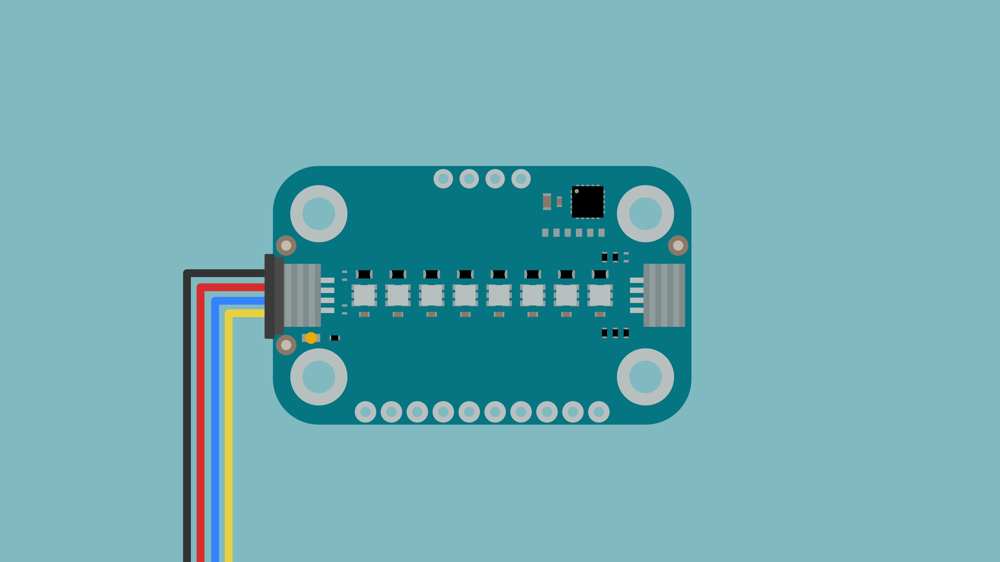
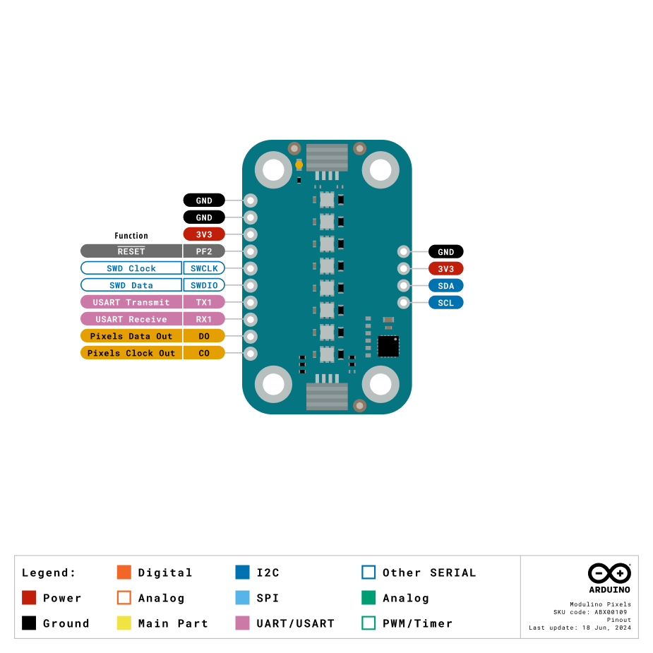
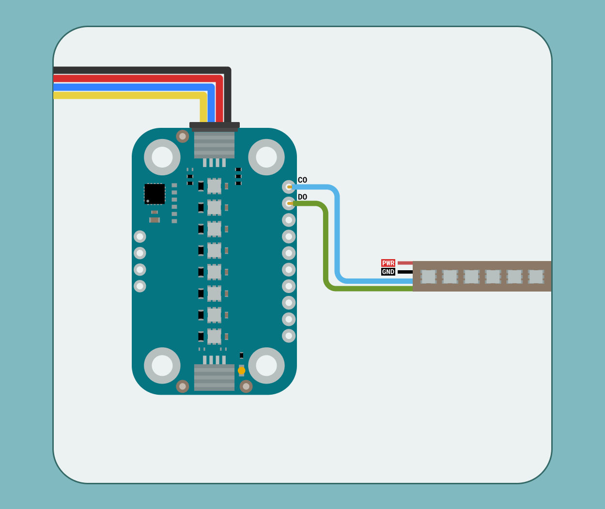

The Modulino Pixels is a modular sensor that generates RGB light effects, making it perfect to add colourful visual feedback to your projects! It features 8 individually addressable RGB LEDs controlled through I2C.

## Hardware Overview

### General Characteristics

The Modulino Pixels is based on 8 LC8822-2020 addressable LEDs capable of generating colourful light patterns and effects.

| Parameter        | Condition      | Minimum | Typical | Maximum | Unit |
|------------------|----------------|---------|---------|---------|------|
| Supply Voltage   | -              | 2.0     | 3.3     | 3.6     | V    |
| Resolution (ADC) | Default        | -       | 12-bit  | -       | -    |
| Communication    | I2C,USART,SPI  | -       | I2C     | -       | -    |

### Module Details

The **Modulino Pixels** module uses **LC8822-2020** addressable LEDs, which do not have native I2C capabilities. Instead, the LED array is controlled by the Modulino's onboard microcontroller (STM32C011F4U6TR). This microcontroller provides I2C communication, allowing for flexible control of the LEDs.

One unique feature of this setup is the ability to change the I2C address via software, making it adaptable to different system configurations.

The default I2C address for the **Modulino Pixels** module is:

| Modulino I2C Address | Hardware I2C Address | Editable Addresses (HEX)          |
|----------------------|----------------------|-----------------------------------|
| 0x6C                 | 0x36                 | Any custom address (via software) |

### Pinout



#### 1x10 Header (LC8822-2020 and Microcontroller Signals)

| Pin    | Function        |
|--------|-----------------|
| GND    | Ground          |
| GND    | Ground          |
| 3V3    | 3.3V Power      |
| RESET  | Reset           |
| SWCLK  | SWD Clock       |
| SWDIO  | SWD Data        |
| TX1    | USART Transmit  |
| RX1    | USART Receive   |
| D0     | Pixels Data Out |
| C0     | Pixels Clock Out|

The **D0** and **C0** pins allow for expansion by daisy-chaining additional LED strips.


#### 1x4 Header (I2C)

| Pin   | Function     |
|-------|--------------|
| GND   | Ground       |
| 3.3 V | Power Supply |
| SDA   | I2C Data     |
| SCL   | I2C Clock    |

### Power Specifications

| Parameter              | Condition      | Typical | Maximum | Unit |
|------------------------|----------------|---------|---------|------|
| Operating Voltage      | -              | 3.3     | -       | V    |
| Power Dissipation      | -              | -       | 350     | mW   |
| Standby Current        | No data signal | -       | 1       | mA   |
| Max LED Output Current | Per Channel    | 18      | -       | mA   |

The module includes a power LED that draws 1 mA and turns on as soon as it is powered.

## Programming with Arduino

### Prerequisites

- Install the Modulino library via the Arduino IDE Library Manager
- Connect your Modulino Knob via QWIIC or solderable headers

For detailed instructions on setting up your Arduino environment and installing libraries, please refer to the [Getting Started with Modulinos guide](./how-general).

Library repository available [here](https://github.com/arduino-libraries/Arduino_Modulino).

### Basic Example

```arduino
#include <Modulino.h>

ModulinoPixels leds;

int brightness = 25;

void setup(){
  Modulino.begin();
  leds.begin();
}

void loop(){
  // Set all LEDs to blue
  for (int i = 0; i < 8; i++) {
    leds.set(i, BLUE, brightness);
    leds.show();
  }
}
```

### Key Functions

- `set(index, color, brightness)`: Sets a specific LED (0-7) to a colour with brightness
- `show()`: Applies the changes to the LEDs
- Available colours: `RED`, `BLUE`, `GREEN`, `VIOLET`, `WHITE`

### Advanced Example - Rainbow Animation

```arduino
#include <Modulino.h>

ModulinoPixels leds;

// Color definitions for rainbow
const int NUM_LEDS = 8;
int colors[][3] = {
  {255, 0, 0},     // Red
  {255, 127, 0},   // Orange
  {255, 255, 0},   // Yellow
  {0, 255, 0},     // Green
  {0, 0, 255},     // Blue
  {75, 0, 130},    // Indigo
  {148, 0, 211},   // Violet
  {255, 0, 0}      // Back to Red
};

void setup() {
  Serial.begin(9600);
  Modulino.begin();
  leds.begin();
  
  Serial.println("Rainbow Animation Started");
}

void rainbowCycle() {
  static int offset = 0;
  
  for (int i = 0; i < NUM_LEDS; i++) {
    int colorIndex = (i + offset) % NUM_LEDS;
    
    // Custom color setting using RGB values
    // Since the library uses predefined colors, we'll use 
    // the closest match or cycle through available colors
    switch(colorIndex) {
      case 0:
      case 7:
        leds.set(i, RED, 50);
        break;
      case 1:
      case 2:
        leds.set(i, GREEN, 50);
        break;
      case 3:
      case 4:
        leds.set(i, BLUE, 50);
        break;
      case 5:
      case 6:
        leds.set(i, VIOLET, 50);
        break;
    }
  }
  
  leds.show();
  offset = (offset + 1) % NUM_LEDS;
}

void breathingEffect() {
  static int brightness = 0;
  static int direction = 1;
  
  // Update brightness
  brightness += direction * 5;
  
  if (brightness >= 100 || brightness <= 0) {
    direction = -direction;
  }
  
  // Set all LEDs to same color with varying brightness
  for (int i = 0; i < NUM_LEDS; i++) {
    leds.set(i, BLUE, brightness);
  }
  leds.show();
}

void chaseEffect() {
  static int position = 0;
  
  // Turn off all LEDs
  for (int i = 0; i < NUM_LEDS; i++) {
    leds.set(i, WHITE, 0);
  }
  
  // Light up current position and trailing LEDs
  leds.set(position, WHITE, 100);
  if (position > 0) {
    leds.set(position - 1, WHITE, 30);
  } else {
    leds.set(NUM_LEDS - 1, WHITE, 30);
  }
  
  leds.show();
  position = (position + 1) % NUM_LEDS;
}

void loop() {
  // Cycle through different effects
  for (int i = 0; i < 50; i++) {
    rainbowCycle();
    delay(100);
  }
  
  for (int i = 0; i < 100; i++) {
    breathingEffect();
    delay(30);
  }
  
  for (int i = 0; i < 30; i++) {
    chaseEffect();
    delay(80);
  }
}
```

## Programming with MicroPython

### Prerequisites

- Install the Modulino MicroPython library
- Ensure Arduino Lab for MicroPython is installed

### Basic Example

```python
from modulino import ModulinoPixels, ModulinoColor
from time import sleep

pixels = ModulinoPixels()

# Set all LEDs to green
pixels.set_all_color(ModulinoColor.GREEN, 100)
pixels.show()
sleep(1)

# Turn off all LEDs
pixels.clear_all().show()
```

### Key Functions

- `set_rgb(index, r, g, b, brightness)`: Set specific LED to RGB colour
- `set_all_rgb(r, g, b, brightness)`: Set all LEDs to RGB colour
- `set_all_color(color, brightness)`: Set all LEDs to predefined colour
- `clear_all()`: Turn off all LEDs
- `show()`: Send updated data to LEDs

### Advanced Example - Interactive Light Patterns

```python
from modulino import ModulinoPixels, ModulinoColor
from time import sleep, ticks_ms

pixels = ModulinoPixels()

def wheel(pos):
    """Generate rainbow colors across 0-255 positions"""
    if pos < 85:
        return (255 - pos * 3, pos * 3, 0)
    elif pos < 170:
        pos -= 85
        return (0, 255 - pos * 3, pos * 3)
    else:
        pos -= 170
        return (pos * 3, 0, 255 - pos * 3)

def rainbow_cycle(wait=0.01):
    """Draw rainbow that uniformly distributes itself across all LEDs"""
    for j in range(256):
        for i in range(8):
            pixel_index = (i * 256 // 8) + j
            r, g, b = wheel(pixel_index & 255)
            pixels.set_rgb(i, r, g, b, 50)
        pixels.show()
        sleep(wait)

def color_wipe(r, g, b, wait=0.05):
    """Wipe color across display a pixel at a time"""
    for i in range(8):
        pixels.set_rgb(i, r, g, b, 100)
        pixels.show()
        sleep(wait)

def theater_chase(r, g, b, wait=0.1):
    """Movie theater light style chaser animation"""
    for q in range(3):
        for i in range(0, 8, 3):
            if i + q < 8:
                pixels.set_rgb(i + q, r, g, b, 100)
        pixels.show()
        sleep(wait)
        
        for i in range(0, 8, 3):
            if i + q < 8:
                pixels.set_rgb(i + q, 0, 0, 0, 0)

def pulse_color(r, g, b, duration=2):
    """Pulse all LEDs with specified color"""
    steps = 50
    for i in range(steps):
        brightness = int((1 + i) * 100 / steps)
        pixels.set_all_rgb(r, g, b, brightness)
        pixels.show()
        sleep(duration / (steps * 2))
    
    for i in range(steps, 0, -1):
        brightness = int(i * 100 / steps)
        pixels.set_all_rgb(r, g, b, brightness)
        pixels.show()
        sleep(duration / (steps * 2))

def fire_effect():
    """Simulate fire/flame effect"""
    import random
    
    # Base fire colors
    base_r = 255
    base_g = 80
    base_b = 0
    
    for _ in range(100):
        for i in range(8):
            # Add random flicker
            flicker = random.randint(-40, 40)
            r = max(0, min(255, base_r + flicker))
            g = max(0, min(255, base_g + flicker // 2))
            b = base_b
            
            brightness = random.randint(30, 100)
            pixels.set_rgb(i, r, g, b, brightness)
        
        pixels.show()
        sleep(0.05)

def progress_bar(percentage, color_r=0, color_g=255, color_b=0):
    """Display a progress bar"""
    pixels.clear_all()
    
    # Calculate how many LEDs to light
    leds_to_light = int((percentage / 100) * 8)
    
    for i in range(leds_to_light):
        pixels.set_rgb(i, color_r, color_g, color_b, 100)
    
    # Partial LED for precise percentage
    if leds_to_light < 8 and percentage > 0:
        remainder = (percentage / 100 * 8) - leds_to_light
        if remainder > 0:
            brightness = int(remainder * 100)
            pixels.set_rgb(leds_to_light, color_r, color_g, color_b, brightness)
    
    pixels.show()

# Demo menu
print("LED Pattern Showcase")
print("====================")
patterns = [
    ("Rainbow Cycle", lambda: rainbow_cycle()),
    ("Color Wipe - Red", lambda: color_wipe(255, 0, 0)),
    ("Color Wipe - Green", lambda: color_wipe(0, 255, 0)),
    ("Color Wipe - Blue", lambda: color_wipe(0, 0, 255)),
    ("Theater Chase", lambda: theater_chase(127, 127, 127)),
    ("Pulse White", lambda: pulse_color(255, 255, 255)),
    ("Fire Effect", lambda: fire_effect()),
    ("Progress Demo", lambda: [progress_bar(i) for i in range(0, 101, 5)])
]

for i, (name, _) in enumerate(patterns, 1):
    print(f"{i}. {name}")

while True:
    choice = input("\nSelect pattern (1-8): ")
    
    try:
        idx = int(choice) - 1
        if 0 <= idx < len(patterns):
            name, pattern_func = patterns[idx]
            print(f"Running: {name}")
            pattern_func()
            pixels.clear_all().show()
        else:
            print("Invalid selection")
    except ValueError:
        print("Please enter a number")
    except KeyboardInterrupt:
        pixels.clear_all().show()
        print("\nExiting...")
        break
```

## Troubleshooting

### LEDs Not Lighting

If your Modulino's power LED isn't on or the RGB LEDs aren't responsive:
- Ensure both the board and the Modulino are connected properly
- Verify that the power LEDs on both are lit
- Check that the QWIIC cable is properly clicked into place

### Incorrect Colours or Flickering

If the LED colours are incorrect or the LEDs are flickering:
- Verify brightness values are within the appropriate range (0-255)
- Check that exposed electronics are not touching conductive surfaces
- Ensure stable power supply with sufficient current for all LEDs

## Project Ideas

- **Progress Bar**: Visually display status or battery charge level
- **Sound Level Indicator**: Respond to ambient noise with light
- **Pomodoro Timer**: Colour-coded work and rest periods
- **Simon Game**: Match colour patterns in sequence
- **Notification System**: Different colours for different alerts
- **Mood Lighting**: Create ambient lighting effects
- **Temperature Indicator**: Use with Modulino Thermo for visual temperature feedback
- **Music Visualiser**: Sync lights to music or sounds