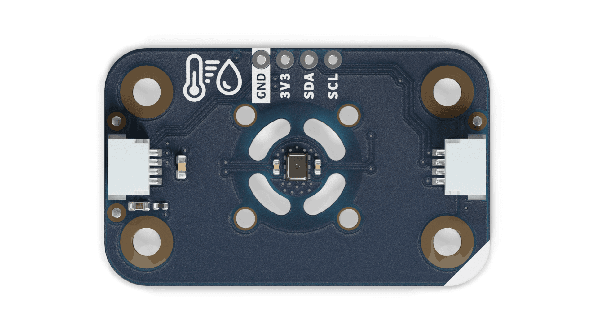
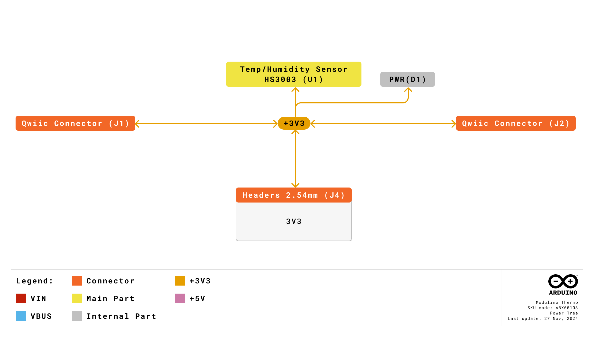
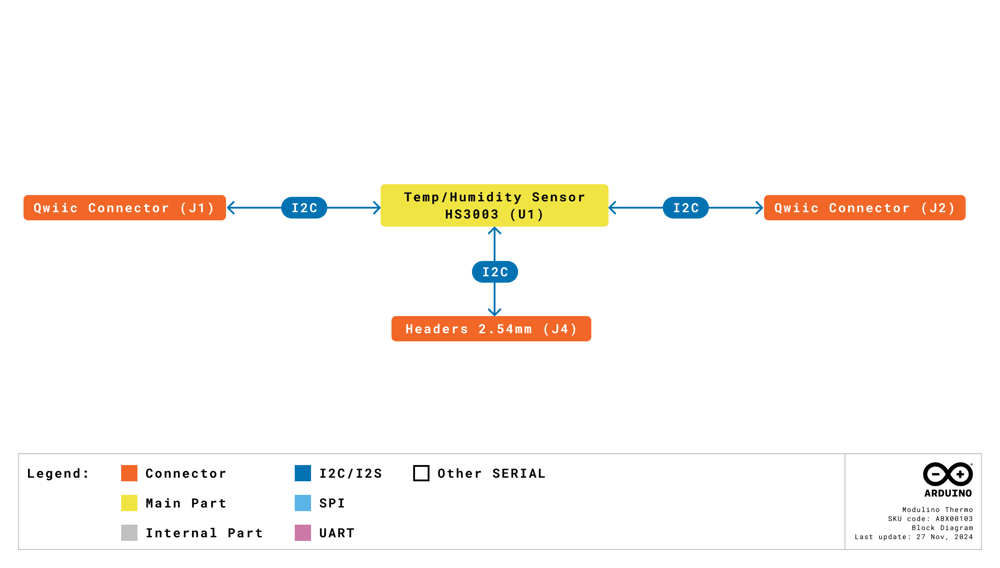
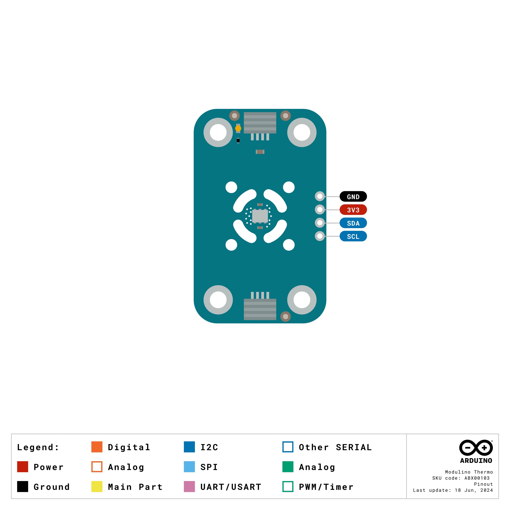

# Description
The Modulino® Thermo, featuring the HS3003 sensor, measures both temperature and humidity, making it ideal for environmental monitoring, indoor climate control, and various IoT applications. It provides accurate readings in a compact form factor and integrates seamlessly into the Qwiic ecosystem.

# Target Areas
Maker, beginner, education

# Contents

## Application Examples
The Modulino® Thermo node can be used in numerous scenarios within IoT and electronics projects:

- **Indoor Climate Control**
  Monitor real-time temperature and humidity levels to automatically adjust HVAC systems or trigger alerts.

- **Greenhouse Monitoring**
  Maintain precise growing conditions by tracking changes in humidity and temperature, ensuring plant health and growth.

- **Smart Home Automation**
  Combine the Modulino® Thermo with other nodes, such as movement or distance sensors, to create fully automated home systems that respond to environmental changes.

## Features
- Utilizes the **HS3003** sensor to measure temperature and humidity.
- Communicates via **I2C** (Qwiic connector) at 3.3 V (standard).
- Designed with an **additional header** for optional connections.
- Ideal for **environmental monitoring** in IoT and home automation applications.

### Contents
| **SKU**  | **Name**           | **Purpose**                             | **Quantity** |
| -------- | ------------------ | --------------------------------------- | ------------ |
| ABX00103 | Modulino® Thermo   | Measure temperature and humidity        | 1            |
|          | I2C Qwiic cable    | Compatible with the Qwiic standard      | 1            |

## Related Products
- **SKU: ASX00027** – [Arduino® Sensor Kit](https://store.arduino.cc/products/arduino-sensor-kit)
- **SKU: K000007** – [Arduino® Starter Kit](https://store.arduino.cc/products/arduino-starter-kit-multi-language)
- **SKU: AKX00026** – [Arduino® Oplà IoT Kit](https://store.arduino.cc/products/opla-iot-kit)

## Rating

### Recommended Operating Conditions
- **Sensor supply range:** 2.3 V – 5.5 V
- **Powered at 3.3 V** through the Qwiic interface (in accordance with the Qwiic standard)
- **Operating temperature:** –40 °C to +125 °C

**Typical current consumption:**
- ~24.4 µA (at 14-bit resolution, 3.3 V)

## Power Tree
The power tree for the Modulino® node can be consulted below:

  
## Block Diagram
This module is designed to be placed on an I2C bus, allowing the on-board HS3003 sensor to communicate with a host microcontroller via I2C.

## Functional Overview
The Modulino® Thermo node uses the HS3003 sensor to measure both temperature and humidity. Data is accessed through I2C (via the Qwiic connector at 3.3 V). It is well-suited for climate control, environmental logging, and wearable IoT.

### Technical Specifications
| **Specification**       | **Details**                                 |
| ----------------------- | ------------------------------------------- |
| **Sensor**              | HS3003                                      |
| **Supply Voltage**      | 3.3 V                   |
| **Power Consumption**   | 24.4 µA (14-bit resolution, 3.3 V supply)   |
| **Range**               | 0–100% RH, –40 °C to +125 °C                |
| **Accuracy**            | Humidity: ±2.8% RH, Temperature: ±0.25 °C   |
| **Resolution**          | 14-bit humidity, 14-bit temperature         |
| **Communication**       | I2C                                         |

### Pinout
**Qwiic / I2C (1×4 Header)**
| **Pin** | **Function**            |
|---------|-------------------------|
| GND     | Ground                 |
| 3.3 V   | Power Supply (3.3 V)   |
| SDA     | I2C Data               |
| SCL     | I2C Clock              |

These pads and the Qwiic connectors share the same I2C bus. You can optionally solder header pins here.

**Note:** The board may also include pads for mounting pull-up resistors, not installed by default.

### Power Specifications
- **Nominal operating voltage:** 3.3 V via Qwiic 

### Mechanical Information

- Board dimensions: 41 mm × 25.36 mm  
- Thickness: 1.6 mm (±0.2 mm)  
- Four mounting holes (Ø 3.2 mm)  
  - Hole spacing: 16 mm vertically, 32 mm horizontally

### I2C Address Reference
| **Board Silk Name** | **Sensor** | **Modulino® I2C Address (HEX)** | **Editable Addresses (HEX)**             | **Hardware I2C Address (HEX)** |
|---------------------|-----------|--------------------------------|------------------------------------------|--------------------------------|
| MODULINO THERMO     | HS3003    | 0x44                           | Custom address not supported | 0x44                           |

## Device Operation
The Modulino® Thermo node acts as an I2C target device on the Qwiic bus. Simply connect it via a Qwiic cable to the 3.3 V I2C interface of your microcontroller. Read humidity and temperature values via standard I2C transactions.

### Getting Started
Use the Arduino IDE or Arduino Cloud Editor to program your microcontroller. Libraries for HS3003 or generic humidity/temperature sensors can help streamline data acquisition. Ensure your microcontroller and this node operate on the same 3.3 V reference for the Qwiic bus.

# Certifications
## Certifications Summary

| **Certification** | **Status** |
|:-----------------:|:----------:|
|  CE/RED (Europe)  |     Yes    |
|     UKCA (UK)     |     Yes    |
|     FCC (USA)     |     Yes    |
|    IC (Canada)    |     Yes    |
|        RoHS       |     Yes    |
|       REACH       |     Yes    |
|        WEEE       |     Yes    |

## Declaration of Conformity CE DoC (EU)

We declare under our sole responsibility that the products above are in conformity with the essential requirements of the following EU Directives and therefore qualify for free movement within markets comprising the European Union (EU) and European Economic Area (EEA).

## Declaration of Conformity to EU RoHS & REACH 211 01/19/2021

Arduino boards are in compliance with RoHS 2 Directive 2011/65/EU of the European Parliament and RoHS 3 Directive 2015/863/EU of the Council of 4 June 2015 on the restriction of the use of certain hazardous substances in electrical and electronic equipment.

| Substance                              | **Maximum limit (ppm)** |
|----------------------------------------|-------------------------|
| Lead (Pb)                              | 1000                    |
| Cadmium (Cd)                           | 100                     |
| Mercury (Hg)                           | 1000                    |
| Hexavalent Chromium (Cr6+)             | 1000                    |
| Poly Brominated Biphenyls (PBB)        | 1000                    |
| Poly Brominated Diphenyl ethers (PBDE) | 1000                    |
| Bis(2-Ethylhexyl) phthalate (DEHP)     | 1000                    |
| Benzyl butyl phthalate (BBP)           | 1000                    |
| Dibutyl phthalate (DBP)                | 1000                    |
| Diisobutyl phthalate (DIBP)            | 1000                    |

Exemptions: No exemptions are claimed.

Arduino Boards are fully compliant with the related requirements of European Union Regulation (EC) 1907 /2006 concerning the Registration, Evaluation, Authorization and Restriction of Chemicals (REACH). We declare none of the SVHCs (https://echa.europa.eu/web/guest/candidate-list-table), the Candidate List of Substances of Very High Concern for authorization currently released by ECHA, is present in all products (and also package) in quantities totaling in a concentration equal or above 0.1%. To the best of our knowledge, we also declare that our products do not contain any of the substances listed on the "Authorization List" (Annex XIV of the REACH regulations) and Substances of Very High Concern (SVHC) in any significant amounts as specified by the Annex XVII of Candidate list published by ECHA (European Chemical Agency) 1907 /2006/EC.

## FCC WARNING

This device complies with part 15 of the FCC Rules.

Operation is subject to the following two conditions: 

(1) This device may not cause harmful interference, and (2) this device must accept any interference received, including interference that may cause undesired operation.

## IC Caution

This device complies with Industry Canada licence-exempt RSS standard(s). 

Operation is subject to the following two conditions: 

(1) This device may not cause interference, and (2) this device must accept any interference, including interference that may cause undesired operation of the device.

## Conflict Minerals Declaration

As a global supplier of electronic and electrical components, Arduino is aware of our obligations with regard to laws and regulations regarding Conflict Minerals, specifically the Dodd-Frank Wall Street Reform and Consumer Protection Act, Section 1502. Arduino does not directly source or process conflict minerals such as Tin, Tantalum, Tungsten, or Gold. Conflict minerals are contained in our products in the form of solder or as a component in metal alloys. As part of our reasonable due diligence, Arduino has contacted component suppliers within our supply chain to verify their continued compliance with the regulations. Based on the information received thus far we declare that our products contain Conflict Minerals sourced from conflict-free areas.

# Company Information

| Company name    | Arduino SRL                                   |
|-----------------|-----------------------------------------------|
| Company Address | Via Andrea Appiani, 25 - 20900 MONZA（Italy)  |

# Reference Documentation

| Ref                       | Link                                                                                                                                                                                           |
| ------------------------- | ---------------------------------------------------------------------------------------------------------------------------------------------------------------------------------------------- |
| Arduino IDE (Desktop)     | [https://www.arduino.cc/en/Main/Software](https://www.arduino.cc/en/Main/Software)                                                                                                             |
| Arduino Courses           | [https://www.arduino.cc/education/courses](https://www.arduino.cc/education/courses)                                                                                                           |
| Arduino Documentation     | [https://docs.arduino.cc/](https://docs.arduino.cc/)                                                                                                                                           |
| Arduino IDE (Cloud)       | [https://create.arduino.cc/editor](https://create.arduino.cc/editor)                                                                                                                           |
| Cloud IDE Getting Started | [https://docs.arduino.cc/cloud/web-editor/tutorials/getting-started/getting-started-web-editor](https://docs.arduino.cc/cloud/web-editor/tutorials/getting-started/getting-started-web-editor) |
| Project Hub               | [https://projecthub.arduino.cc/](https://projecthub.arduino.cc/)                                                                                                                               |
| Library Reference         | [https://github.com/arduino-libraries/](https://github.com/arduino-libraries/)                                                                                                                 |
| Online Store              | [https://store.arduino.cc/](https://store.arduino.cc/)                                                                                                                                         |

# Revision History
| **Date**   | **Revision** | **Changes**          |
| ---------- | ------------ | -------------------- |
| 24/11/2025 | 5            | I2C information changed        |
| 01/07/2025 | 4            | Certification        |
| 17/06/2025 | 3            | Nomenclature updates |
| 23/05/2025 | 2            | Power info           |
| 14/05/2025 | 1            | First release        |
