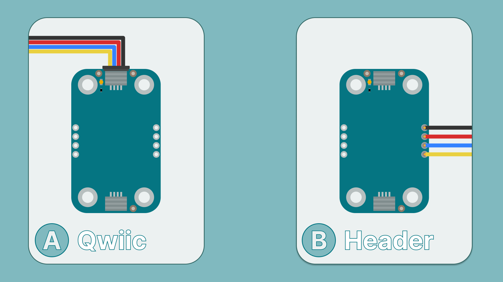
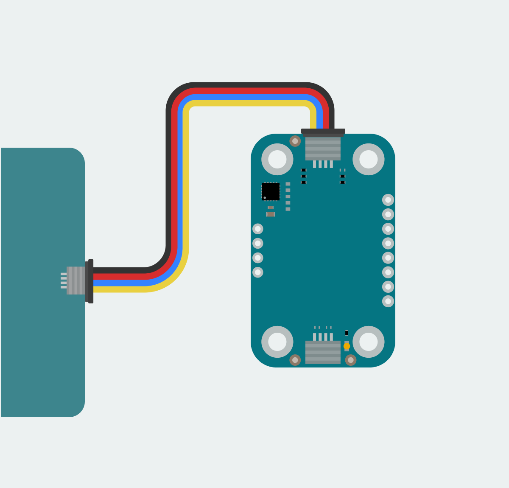
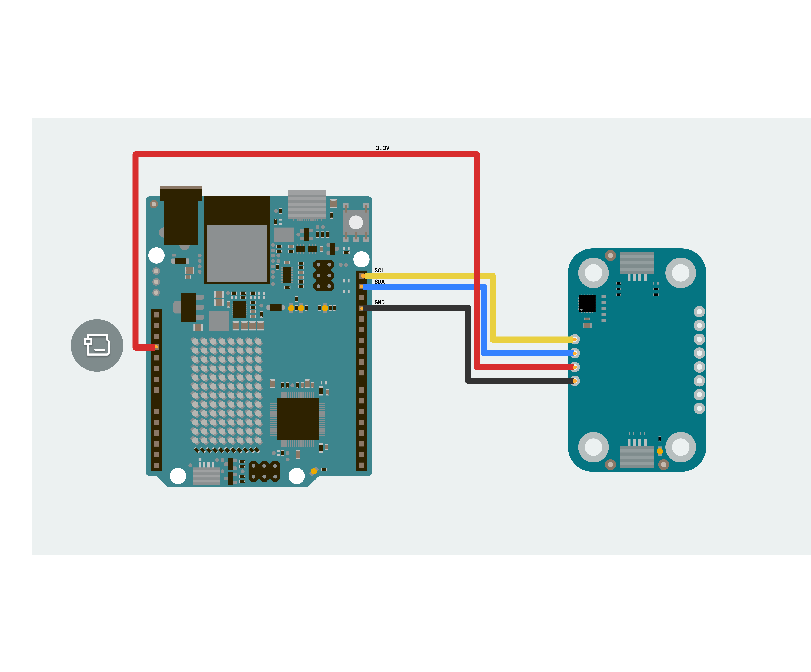
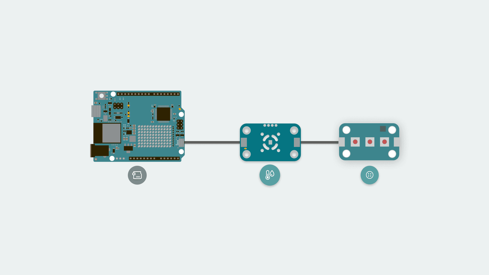
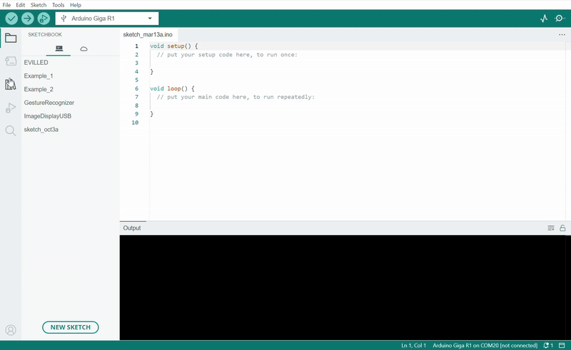
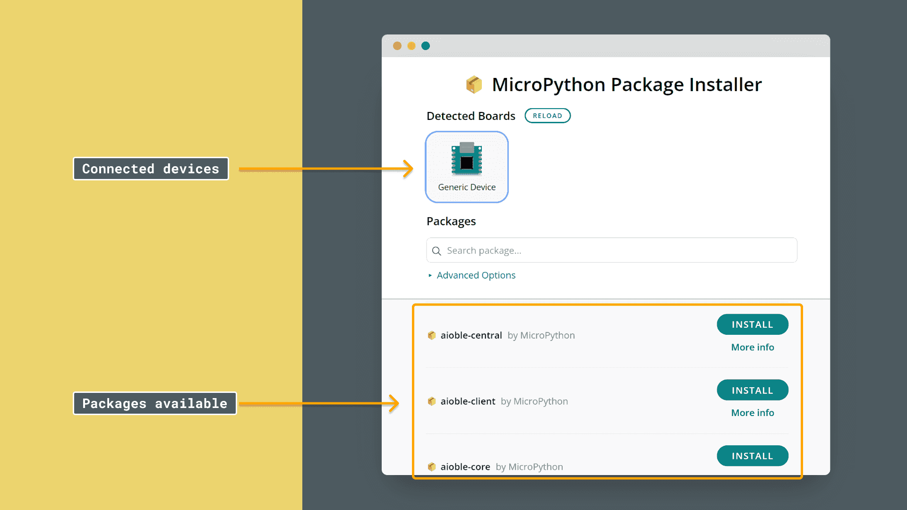
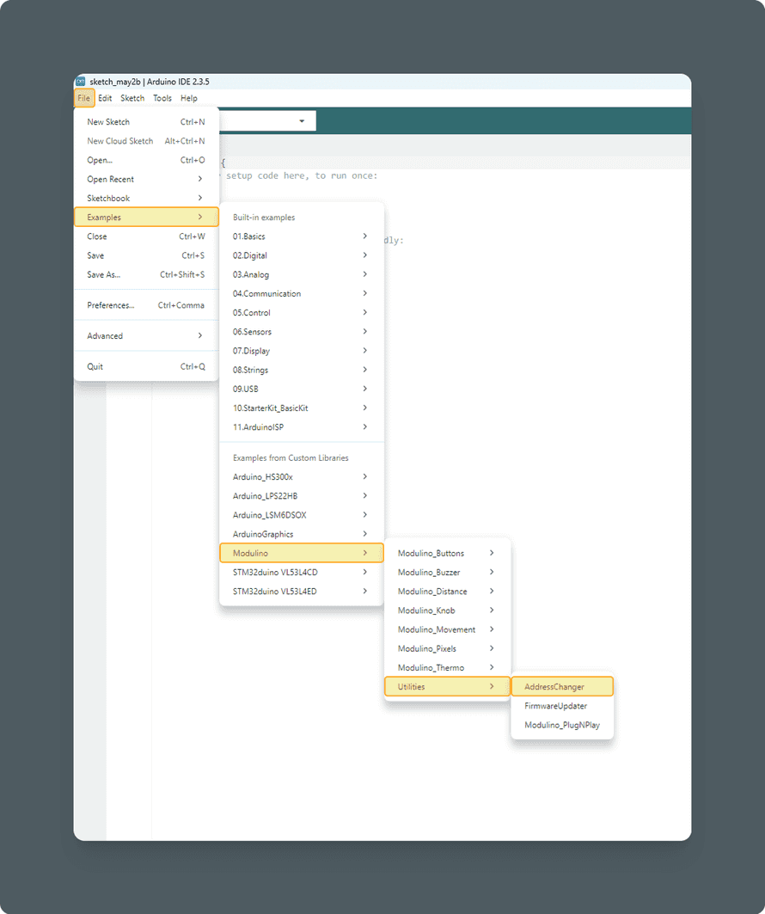

The Modulino ecosystem provides modular sensors and actuators that streamline prototyping and development. Each module follows a standardised form factor with QWIIC connectors and I²C protocol integration, allowing simple connection and programming of multiple nodes. In addition to QWIIC connectors, Modulino nodes expose solderable pins for compatibility with boards that don't support QWIIC.

## The Modulino System

Modulinos are designed to work seamlessly together through:
- **Standardised QWIIC connectors** for plug-and-play connectivity
- **I²C communication** for simple two-wire data transfer
- **Daisy-chain capability** for connecting multiple nodes
- **Compact form factor** for space-efficient designs
- **Cross-platform support** for Arduino and MicroPython

## How To Connect Your Modulino

The easiest and most reliable way to connect your Modulino is through the QWIIC Connect System. It's plug-and-play, uses standard I²C, and makes it easy to join multiple nodes. If your board supports QWIIC, this is the recommended way to go.

Note that the dedicated I²C pins will differ from board to board, meaning it is always a good idea to check your specific model.



### QWIIC Connector (Recommended)

Whenever available, the **QWIIC Connect System** is the preferred method. Connecting to the Modulino is extremely simple—just use a standard QWIIC cable to connect your board to either of the QWIIC connectors on the Modulino. Because the cable and connectors are polarised, there is no need to worry about accidentally swapping connections.



QWIIC is a plug-and-play I²C Connect System that uses standardised 4-pin connectors:
- GND
- 3.3V
- SDA (Data)
- SCL (Clock)

The Modulino features two QWIIC connectors, which are internally connected in parallel. This means you can daisy-chain multiple modules easily by connecting additional QWIIC cables between them.

### Solderable Header

When QWIIC is not available, you can use the exposed solderable pins on the node. You can solder pins to the unpopulated pads; just remember the pinout provided in each node's guide to connect to the right pins of your board.



### Daisy-Chaining Multiple Modulino Nodes

Regardless of whether you connect the first Modulino via QWIIC or through the solderable pins, you can still take advantage of the extra QWIIC connector to daisy-chain additional nodes.



Each Modulino includes two QWIIC connectors wired in parallel, allowing you to connect one node to the next in a chain. As long as each node is configured with a unique I²C address, they can all communicate on the same bus.

This approach keeps your setup clean, modular, and expandable without adding extra wiring complexity.

***Important considerations for daisy-chaining:***
- The number of nodes you can connect will depend on what nodes you are chaining together, as this system allows for multiple sensors from different manufacturers to be added
- The cables you use for these connections will play a significant role in the setup's performance
- Ensure your cables are properly connected and capable of handling the required data transfer
- Each node should have a unique address on a chain if you plan to address them individually
- Multiple nodes with the same address will cause conflicts on the I²C bus and will not allow you to address them individually

## Power Specifications

All Modulino nodes are typically powered by **+3.3 VDC** when using the QWIIC interface as per the I²C standard. Each node includes:
- Power LED indicator (typically draws 1 mA)
- Shared power distribution between QWIIC connectors and headers
- Protection against reverse polarity (on most nodes)

Always check your specific node's documentation for detailed power consumption specifications.

## Installing The Modulino Library

### For Arduino IDE

You need the official Modulino library to use any Modulino node with Arduino. The Arduino IDE provides tools that make adding a library straightforward.

To install the IDE, please visit our [getting started page](https://docs.arduino.cc/software/ide-v2/tutorials/getting-started/ide-v2-downloading-and-installing/).

After opening the IDE:
1. Look for the tab on the left side
2. Click the book icon for "Library Manager"

3. Search for "Modulino" in the search box
4. Click "Install"


A prompt might appear saying that additional dependencies are required. This is not a problem, as they will be automatically added when you confirm the prompt.

**Important Wire Configuration:**
By default, the Modulino library uses `Wire1`. If your board model has a different pinout for the dedicated I²C pins, you might have to edit it. Check [here](https://docs.arduino.cc/language-reference/en/functions/communication/wire/) for more information on Wire configuration.

### For MicroPython

To program your Modulino with MicroPython, use the official `Modulino` MicroPython library available [here](https://github.com/arduino/arduino-modulino-mpy). The library is fully compatible with the Arduino Lab for MicroPython.

For information on installing the **Arduino Lab for MicroPython**, please visit our [installation guide](https://docs.arduino.cc/micropython/first-steps/install-guide/).

The `Modulino` library is not available by default on MicroPython devices, hence installation is needed.

#### Using the MicroPython Package Installer

To simplify the process, the [MicroPython Package Installer](https://github.com/arduino/lab-micropython-package-installer/releases) is recommended as it provides a graphical interface to guide installation.

1. Open the tool
2. Plug in your board to the computer
  If the board does not appear in the Detected Boards section, click Reload
  If the board is still undetected, ensure no other programs are using the board's COM port
  
1. Search for the `Modulino` package by filling in the text box on the search feature
2. Click Install and wait for the installation confirmation
3. Disconnect the board from the tool before returning to your code editor to avoid conflicts due to a busy COM port

After installation, you can import modules using:
```python
from modulino import ModulinoThermo, ModulinoBuzzer, ModulinoButtons
# Import the specific modules you need
```

**Wire Configuration for MicroPython:**
By default, the Modulino library uses `Wire1`. If your board model has a different pinout for the dedicated I²C pins, you might have to edit it as instructed [here](https://github.com/arduino/arduino-modulino-mpy/tree/main/docs#ℹ️-using-3rd-party-boards).

## How To Change I²C Address

Some Modulino nodes support software-configurable I²C addresses, allowing multiple identical nodes to work on the same bus. Nodes with fixed addresses cannot be changed and will require alternative solutions for multiple units.

### For Arduino (Software-Configurable Modules)

An example sketch, `AddressChanger`, is included with the library inside the `Utilities` folder and available [here](https://github.com/arduino-libraries/Modulino/blob/main/examples/Utilities/AddressChanger/AddressChanger.ino).



To change the address:
1. Connect the node to your board (remove any other nodes from the chain)
2. Upload the AddressChanger sketch
3. Open the Serial Monitor (115200 baud)
4. The sketch will scan and display all detected Modulino nodes with their current addresses
5. When prompted, enter two hexadecimal numbers separated by a space in the format: `<current_address> <new_address>`
6. **Important:** Enter addresses **without** the "0x" prefix and with a space between them (example: `3A 3B`)
7. Special commands: Enter `<address> 0` to reset the device at the specified address to its default, or `0 0` to reset all devices to their defaults
8. Valid I²C addresses range from **0x08 to 0x77** (7-bit hexadecimal format)

**Example usage:**
```
> 3A 3B          (changes address from 0x3A to 0x3B)
> 3C 0           (resets device at 0x3C to default address)
> 0 0            (resets all devices to default addresses)
```

When using a custom address in your sketch, specify this address when creating the module object:
```arduino
ModulinoBuzzer buzzer(0x3E); // Replace 0x3E with your specific address
```

### For MicroPython (Software-Configurable Modules)

A script is available [here](https://github.com/arduino/arduino-modulino-mpy/blob/main/examples/change_address.py).

To change the address:
1. Connect the node to your board via I²C (ensure no other modules are in the chain)
2. Run the script in a MicroPython environment
3. Follow the on-screen instructions (REPL) to select the device and enter a new address
4. The script will attempt to change the address and confirm success

When using a custom address in MicroPython:
```python
buzzer_module = ModulinoBuzzer(address=0x45)  # Replace 0x45 with your specific address
```

### Tracking Address Changes

To keep track of the address in use, nodes have a white rectangle on the back. Use this space to write the selected address for future reference.

## Node Addressing Reference

| Node | Default Modulino Address | Hardware Address | Configurable |
|--------|-------------------------|------------------|--------------|
| Buttons | 0x7C | 0x3E | Software |
| Buzzer | 0x3C | 0x1E | Software |
| Distance | 0x52 | 0x52 | No |
| Knob | 0x76 | 0x3A | Software |
| Movement | 0x6A | 0x6A | Hardware (0x6A/0x6B) |
| Pixels | 0x6C | 0x36 | Software |
| Thermo | 0x44 | 0x44 | No |

When scanning for I²C addresses on the bus, you might find the Modulino node using the **Hardware I²C Address**. However, you should always use the **Modulino I²C Address** when using the official Modulino library.

## General Troubleshooting

### Node Not Responding

If your Modulino's power LED isn't on or the node isn't responsive:
- Ensure both the board and the Modulino are connected to your computer
- Verify that the power LEDs on both are lit
- Check that the QWIIC cable is properly clicked into place
- Verify the node is receiving 3.3V power

### Library Not Installed Properly

**Arduino IDE:**
If you encounter an issue with the `#include "Modulino.h"` command:
- Check your IDE to ensure the library is installed and up-to-date
- Re-install the library through the Library Manager
- Verify all dependencies were installed

**MicroPython:**
If you encounter an issue with `from modulino import` commands:
- Check the package installer to ensure the library is installed
- Re-install the library through the Package Installer
- Ensure the board was disconnected from other programs during installation

### I²C Communication Issues

- Verify correct Wire configuration (Wire vs Wire1)
- Check for address conflicts between modules
- Ensure pull-up resistors are present on the I²C bus
- Verify cable length isn't exceeding I²C specifications
- Check that all connections are secure

### Inaccurate Sensor Values

- Ensure all exposed electronics are not touching conductive surfaces
- Verify the module is not placed near interference sources
- Check that power supply is stable and within specifications
- Allow sensors time to stabilise after power-on

## Best Practices

1. **Power Management**: Always use 3.3V for QWIIC connections. Never exceed voltage specifications.

2. **Cable Management**: Use appropriate length QWIIC cables. Excessive cable length can cause signal degradation.

3. **Address Management**: Document all address changes on the white label provided on each node.

4. **Environmental Considerations**: Keep nodes away from sources of electromagnetic interference, excessive heat, or moisture unless specifically rated for such conditions.

5. **Development Workflow**: Test nodes individually before connecting them in a chain to isolate any issues.

## What's Next?

Now that you understand the fundamentals of the Modulino system:
- Explore individual node guides for specific features and capabilities
- Experiment with combining multiple nodes in your projects
- Share your creations with the Arduino community
- Check for updates and new nodes in the Modulino ecosystem

For detailed information about specific nodes, refer to their individual documentation pages, which include pinouts, specifications, and programming examples for both Arduino and MicroPython.