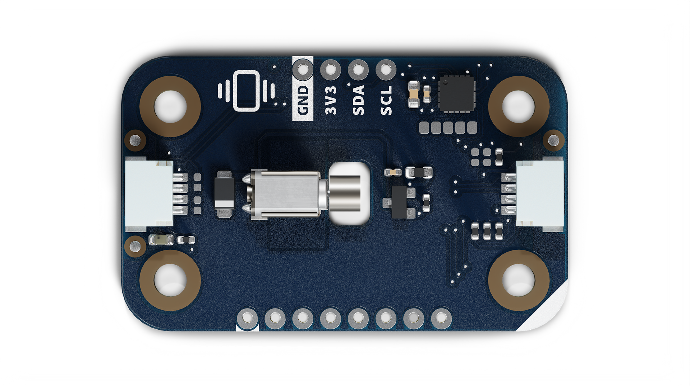
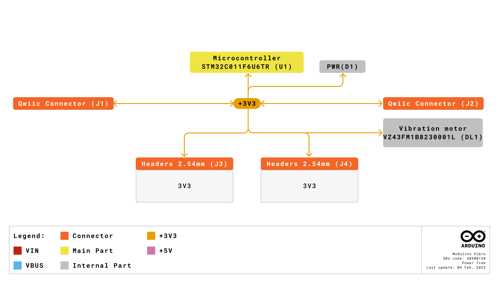
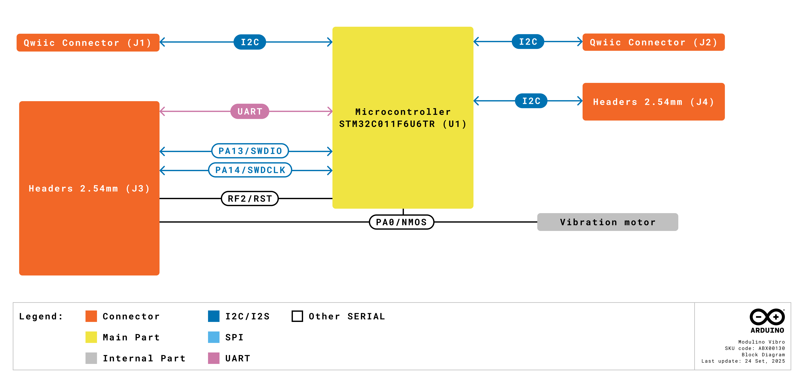
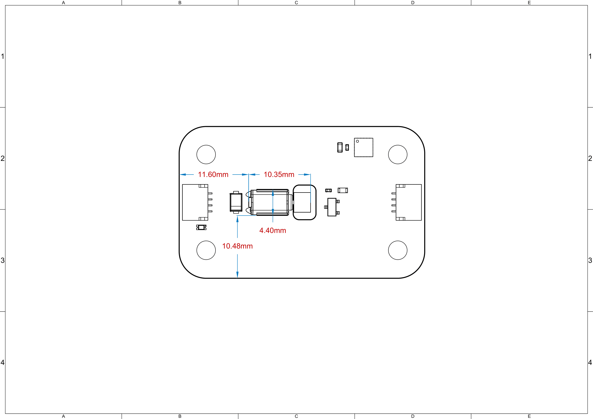

# Description

The Arduino Modulino® Vibro, powered by an on-board STM32C011F4 microcontroller, features a compact vibration motor (VZ43FM1B8230001L) for haptic feedback and alert applications. This setup enables simple vibration control via I2C and provides tactile notifications for various interactive projects.

# Target Areas

Maker, beginner, education

# Contents
## Application Examples

- **Haptic Feedback**
  Provide tactile notifications in wearable devices, gaming controllers, or interactive interfaces to enhance user experience.

- **Alert Systems**
  Create vibration-based alerts for notifications, alarms, or status indicators in IoT projects where audio alerts might not be suitable.

- **Interactive Art**
  Integrate tactile feedback into art installations, musical instruments, or sensory experiences to create engaging multi-modal interactions.

## Features
- **Compact vibration motor** (VZ43FM1B8230001L) providing strong tactile feedback at 12,000 rpm.
- Integrated **STM32C011F4** microcontroller providing I2C interface by default.
- **N-channel MOSFET** (2N7002KT1G) for efficient motor control..
- Designed for **3.3V** operation via the Qwiic connector (I2C).
- Ideal for **haptic feedback** and **vibration alerts** in interactive projects.

### Contents
| **SKU**    | **Name**              | **Purpose**                            | **Quantity** |
| ---------- | --------------------- | -------------------------------------- | ------------ |
| ABX00130   | Modulino® Vibro       | Vibration motor for haptic feedback    | 1            |
|            | I2C Qwiic cable       | Compatible with the Qwiic standard     | 1            |

## Related Products
- *SKU: ASX00027* - [Arduino® Sensor Kit](https://store.arduino.cc/products/arduino-sensor-kit)
- *SKU: K000007* - [Arduino® Starter Kit](https://store.arduino.cc/products/arduino-starter-kit-multi-language)
- *SKU: AKX00026* - [Arduino® Oplà IoT Kit](https://store.arduino.cc/products/opla-iot-kit)
- *SKU: AKX00069* - [Arduino® Plug and Make Kit](https://store.arduino.cc/products/plug-and-make-kit)

## Rating

### Recommended Operating Conditions
- **Powered at 3.3 V** through the Qwiic interface (in accordance with the Qwiic standard)
- **Operating temperature:** -40 °C to +85 °C

**Typical current consumption:**
- Microcontroller: ~3.4 mA
- Motor active: ~67 mA typical, 85 mA maximum

## Power Tree
The power tree for the Modulino® Vibro can be consulted below:

## Block Diagram
This node includes an STM32C011F4 microcontroller that controls a vibration motor through an N-channel MOSFET. It communicates via I2C by default, but can be reprogrammed via SWD for custom functionality.

## Functional Overview
The Modulino® Vibro node receives vibration commands via I2C and controls the VZ43FM1B8230001L motor through a 2N7002KT1G N-channel MOSFET. The STM32C011F4 microcontroller manages PWM control for variable intensity vibration patterns. Advanced users can re-flash the microcontroller via SWD for custom vibration sequences or additional logic.

### Technical Specifications (Module-Specific)
| **Specification**       | **Details**                                     |
| ----------------------- | ----------------------------------------------- |
| **Microcontroller**     | STM32C011F4                                     |
| **Motor**               | VZ43FM1B8230001L vibration motor               |
| **Motor Speed**         | 12,000 rpm rated                               |
| **Supply Voltage**      | 3.3 V                           |
| **Power Consumption**   | ~3.4 mA (MCU) + 67 mA typical (motor active)     |
| **Motor Current**       | 67 mA typical, 85 mA maximum                     |
| **Communication**       | I2C (Qwiic), SWD (reprogramming), UART (option) |

### Pinout

**Qwiic / I2C (1×4 Header)**  
| **Pin** | **Function**              |
|---------|---------------------------|
| GND     | Ground                   |
| 3.3 V    | Power Supply (3.3 V)     |
| SDA     | I2C Data                 |
| SCL     | I2C Clock                |

These pads and the Qwiic connectors share the same I2C bus at 3.3 V.

**Additional 1×8 Header (Motor & MCU Signals)**
| **Pin** | **Function**   |
|---------|----------------|
| GND     | Ground          |
| 3V3     | 3.3 V Power      |
| PF2     | RESET (NRST)    |
| SWCLK   | SWD Clock (PA14) |
| SWDIO   | SWD Data (PA13)  |
| TX1     | USART Transmit (PA9) |
| RX1     | USART Receive (PA10) |
| PA2     | Motor Control (MOSFET gate) |

**Note:** PA0 controls the N-channel MOSFET gate to switch the vibration motor on/off. You can also access additional microcontroller pins (PA1, PA2, PA3, PA5) via test pads for custom applications.

### Power Specifications
- **Nominal operating voltage:** 3.3 V via Qwiic

### Mechanical Information

- Board dimensions: 41 mm × 25.36 mm
- Thickness: 1.6 mm (±0.2 mm)
- Four mounting holes (⌀ 3.2 mm)
  - Hole spacing: 16 mm vertically, 32 mm horizontally
- **Breadboard compatible:** 1×4 header and 1×8 header spaced by 900 mil (22.86 mm)

### I2C Address Reference
| **Board Silk Name** | **Sensor/Actuator**     | **Modulino® I2C Address (HEX)** | **Editable Addresses (HEX)**                | **Hardware I2C Address (HEX)** |
|---------------------|-------------------------|--------------------------------|---------------------------------------------|--------------------------------|
| MODULINO VIBRO      | Vibration Motor         | 0x3A                           | Any custom address (via software config.)   | 0x1D                           |

 **Note:**
 - Default I2C address is **0x3A**.
 - A white rectangle on the bottom silk allows users to write a new address after reconfiguration.

    

#### Pull-up Resistors

This module has pads for optional I2C pull-up mounting in both data lines. No resistors are mounted by default but in case the resistors are needed 4.7 K resistors in an SMD 0402 format are recommended.

These are positioned near the Qwiic connector on the power LED side.
These are positioned near the Qwiic connector on the power LED side.

## Device Operation
By default, the board is an I2C target device. It manages motor control through integrated firmware via PWM signals to the MOSFET gate. Simply connect it to a 3.3 V Qwiic interface and send I2C commands for various vibration patterns. If needed, you can reprogram the STM32C011F4 via SWD to modify or extend functionality.

### Getting Started
Use any standard Arduino workflow-desktop IDE or Arduino Cloud Editor. The official Modulino library provides simple commands for vibration control including intensity and duration settings. Ensure your power supply can handle the additional 67-85 mA current when the motor is active.

# Certifications

## Certifications Summary

| **Certification** | **Status** |
|:-----------------:|:----------:|
|  CE/RED (Europe)  |     Yes    |
|     UKCA (UK)     |     Yes    |
|     FCC (USA)     |     Yes    |
|    IC (Canada)    |     Yes    |
|        RoHS       |     Yes    |
|       REACH       |     Yes    |
|        WEEE       |     Yes    |

## Declaration of Conformity CE DoC (EU)

We declare under our sole responsibility that the products above are in conformity with the essential requirements of the following EU Directives and therefore qualify for free movement within markets comprising the European Union (EU) and European Economic Area (EEA).

## Declaration of Conformity to EU RoHS & REACH 211 01/19/2021

Arduino boards are in compliance with RoHS 2 Directive 2011/65/EU of the European Parliament and RoHS 3 Directive 2015/863/EU of the Council of 4 June 2015 on the restriction of the use of certain hazardous substances in electrical and electronic equipment.

| Substance                              | **Maximum limit (ppm)** |
|----------------------------------------|-------------------------|
| Lead (Pb)                              | 1000                    |
| Cadmium (Cd)                           | 100                     |
| Mercury (Hg)                           | 1000                    |
| Hexavalent Chromium (Cr6+)             | 1000                    |
| Poly Brominated Biphenyls (PBB)        | 1000                    |
| Poly Brominated Diphenyl ethers (PBDE) | 1000                    |
| Bis(2-Ethylhexyl) phthalate (DEHP)     | 1000                    |
| Benzyl butyl phthalate (BBP)           | 1000                    |
| Dibutyl phthalate (DBP)                | 1000                    |
| Diisobutyl phthalate (DIBP)            | 1000                    |

Exemptions: No exemptions are claimed.

Arduino Boards are fully compliant with the related requirements of European Union Regulation (EC) 1907 /2006 concerning the Registration, Evaluation, Authorization and Restriction of Chemicals (REACH). We declare none of the SVHCs (https://echa.europa.eu/web/guest/candidate-list-table), the Candidate List of Substances of Very High Concern for authorization currently released by ECHA, is present in all products (and also package) in quantities totaling in a concentration equal or above 0.1%. To the best of our knowledge, we also declare that our products do not contain any of the substances listed on the "Authorization List" (Annex XIV of the REACH regulations) and Substances of Very High Concern (SVHC) in any significant amounts as specified by the Annex XVII of Candidate list published by ECHA (European Chemical Agency) 1907 /2006/EC.

## FCC WARNING

This device complies with part 15 of the FCC Rules.

Operation is subject to the following two conditions: 

(1) This device may not cause harmful interference, and (2) this device must accept any interference received, including interference that may cause undesired operation.

## IC Caution

This device complies with Industry Canada licence-exempt RSS standard(s). 

Operation is subject to the following two conditions: 

(1) This device may not cause interference, and (2) this device must accept any interference, including interference that may cause undesired operation of the device.

## Conflict Minerals Declaration

As a global supplier of electronic and electrical components, Arduino is aware of our obligations with regard to laws and regulations regarding Conflict Minerals, specifically the Dodd-Frank Wall Street Reform and Consumer Protection Act, Section 1502. Arduino does not directly source or process conflict minerals such as Tin, Tantalum, Tungsten, or Gold. Conflict minerals are contained in our products in the form of solder or as a component in metal alloys. As part of our reasonable due diligence, Arduino has contacted component suppliers within our supply chain to verify their continued compliance with the regulations. Based on the information received thus far we declare that our products contain Conflict Minerals sourced from conflict-free areas.

# Company Information

| Company name    | Arduino SRL                                   |
|-----------------|-----------------------------------------------|
| Company Address | Via Andrea Appiani, 25 - 20900 MONZA（Italy)  |

# Reference Documentation

| Ref                       | Link                                                                                                                                                                                           |
| ------------------------- | ---------------------------------------------------------------------------------------------------------------------------------------------------------------------------------------------- |
| Arduino IDE (Desktop)     | [https://www.arduino.cc/en/software/](https://www.arduino.cc/en/software/)                                                                                                             |
| Arduino Courses           | [https://www.arduino.cc/education/courses](https://www.arduino.cc/education/courses)                                                                                                           |
| Arduino Documentation     | [https://docs.arduino.cc/](https://docs.arduino.cc/)                                                                                                           |
| Arduino IDE (Cloud)       | [https://create.arduino.cc/editor](https://create.arduino.cc/editor)                                                                                                                           |
| Cloud IDE Getting Started | [https://docs.arduino.cc/cloud/web-editor/tutorials/getting-started/getting-started-web-editor](https://docs.arduino.cc/cloud/web-editor/tutorials/getting-started/getting-started-web-editor) |
| Project Hub               | [https://projecthub.arduino.cc/](https://projecthub.arduino.cc/)                                                                                                                          |
| Library Reference         | [https://github.com/arduino-libraries/](https://github.com/arduino-libraries/)                                                                                                            |
| Online Store              | [https://store.arduino.cc/](https://store.arduino.cc/)                                                                                                                                    |

# Revision History
| **Date**   | **Revision** | **Changes**                       |
|------------|--------------|-----------------------------------|
| 14/10/2025 | 1            | First release                     |