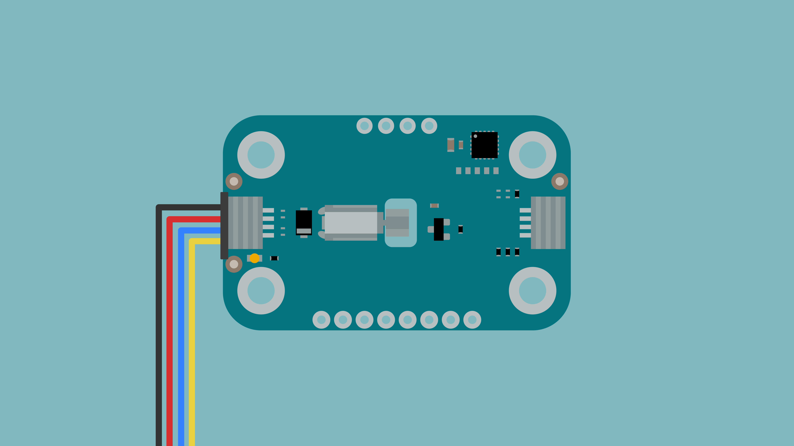
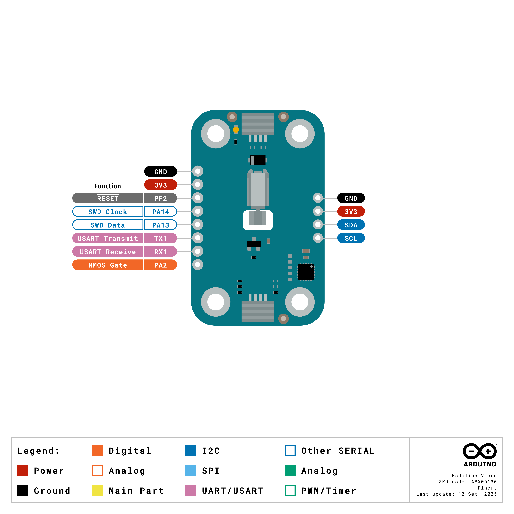

The Modulino Vibra is a modular haptic feedback device that provides tactile notifications through vibration, making it perfect to add physical feedback to your projects! It uses the standardised Modulino form factor with QWIIC connectors for easy integration.

## Hardware Overview

### General Characteristics

The Modulino Vibra is based on the VZ43FM1B8230001L vibration motor, capable of generating different vibration patterns for haptic feedback.

| Parameter  | Condition | Minimum | Typical | Maximum | Unit |
|------------|-----------|---------|---------|---------|------|
| Speed      | -         | -       | 12,000  | -       | rpm  |
| Voltage    | Motor     | 2.3     | 3.3     | 3.6     | V    |
| Current    | Motor     | -       | 67      | 85      | mA   |

### Sensor Details

The **Modulino Vibra** module uses the **VZ43FM1B8230001L** vibration motor, which does not have native I²C capabilities. Instead, the motor is controlled by the Modulino's onboard microcontroller (STM32C011F4), which drives the motor through an N-channel MOSFET. This microcontroller provides I²C communication, allowing for flexible control of vibration intensity and duration.

One unique feature of this setup is the ability to change the I²C address via software, making it adaptable to different system configurations.

The default I²C address for the **Modulino Vibra** module is:

| Modulino I²C Address | Hardware I²C Address | Editable Addresses (HEX)                        |
|----------------------|----------------------|--------------------------------------------------|
| 0x3A                 | 0x1D                 | Any custom address (via software configuration) |

### Pinout



**Qwiic / I2C (1×4 Header)**
| **Pin** | **Function**              |
|---------|---------------------------|
| GND     | Ground                   |
| 3.3 V    | Power Supply (3.3 V)     |
| SDA     | I2C Data                 |
| SCL     | I2C Clock                |

These pads and the Qwiic connectors share the same I2C bus at 3.3 V.

**Additional 1×8 Header (Motor & MCU Signals)**
| **Pin** | **Function**   |
|---------|----------------|
| GND     | Ground          |
| 3V3     | 3.3 V Power      |
| PF2     | RESET (NRST)    |
| SWCLK   | SWD Clock (PA14) |
| SWDIO   | SWD Data (PA13)  |
| TX1     | USART Transmit (PA9) |
| RX1     | USART Receive (PA10) |
| PA2     | Motor Control (MOSFET gate) |

**Note:** PA0 controls the N-channel MOSFET gate to switch the vibration motor on/off. You can also access additional microcontroller pins (PA1, PA2, PA3, PA5) via test pads for custom applications.

### Power Specifications

| Parameter           | Condition     | Typical | Unit |
|---------------------|---------------|---------|------|
| Operating Voltage   | -             | 3.3     | V    |
| Current Consumption | Idle          | ~3.4    | mA   |
| Current Consumption | Motor Active  | 67      | mA   |
| Current Consumption | Motor Maximum | 85      | mA   |

The module includes a power LED that draws 1 mA and turns on as soon as it is powered.

### Schematic

The Modulino Vibra features a simple yet effective circuit design for haptic feedback.

The main components are the **VZ43FM1B8230001L** vibration motor and the **STM32C011F4** microcontroller (U1), which handles motor control via PWM signals to the MOSFET gate as well as I²C communication.

You can connect to the I²C pins (SDA and SCL) using either the **QWIIC connectors** (J1 and J2, this is the recommended method) or the **solderable pins** (J4). The board runs on **3.3V**, which comes from the QWIIC cable or the **3V3 pin** on J4.

There's also a small power LED indicator that lights up when the board is on.

You can grab the full schematic and PCB files from the [Modulino Vibra page](https://docs.arduino.cc/hardware/modulinos/modulino-vibra).

## Programming with Arduino

The Modulino Vibra is fully compatible with the Arduino IDE and the official Modulino library. The following examples showcase how to generate vibration patterns and add haptic feedback to your Arduino projects.

### Prerequisites

- Install the Modulino library via the Arduino IDE Library Manager
- Connect your Modulino Vibra via QWIIC or solderable headers

For detailed instructions on setting up your Arduino environment and installing libraries, please refer to the [Getting Started with Modulinos guide](../how-general).

Library repository available [here](https://github.com/arduino-libraries/Arduino_Modulino).

### Basic Example

```arduino
#include <Modulino.h>

ModulinoVibro vibro;

void setup() {
  Modulino.begin();
  vibro.begin();
}

void loop() {
  // Vibrate for 1000 milliseconds (1 second)
  vibro.on(1000);
  delay(1000);
  
  // Turn off vibration
  vibro.off();
  delay(1000);
}
```

### Key Functions

- `on(duration_ms)`: Activates vibration for specified duration in milliseconds
- `on(duration_ms, power)`: Activates vibration with custom power level
- `on(duration_ms, blocking, power)`: Activates vibration, optionally blocking execution
- `off()`: Stops vibration immediately

**Power Levels:** `STOP`, `GENTLE`, `MODERATE`, `MEDIUM`, `INTENSE`, `POWERFUL`, `MAXIMUM` (default)

### Advanced Example - Haptic Patterns

```arduino
#include <Modulino.h>

ModulinoVibro vibro;

void setup() {
  Serial.begin(9600);
  Modulino.begin();
  vibro.begin();
  
  Serial.println("Haptic Pattern Demo");
}

void loop() {
  // Pattern 1: Quick double pulse
  Serial.println("Double Pulse");
  vibro.on(100, INTENSE);
  delay(150);
  vibro.on(100, INTENSE);
  delay(1000);
  
  // Pattern 2: Escalating intensity
  Serial.println("Escalating");
  vibro.on(200, GENTLE);
  delay(250);
  vibro.on(200, MODERATE);
  delay(250);
  vibro.on(200, POWERFUL);
  delay(1000);
  
  // Pattern 3: Long gentle pulse
  Serial.println("Gentle Wave");
  vibro.on(500, GENTLE);
  delay(1000);
  
  // Pattern 4: Alert pattern
  Serial.println("Alert");
  for (int i = 0; i < 3; i++) {
    vibro.on(150, MAXIMUM);
    delay(200);
  }
  delay(2000);
}
```

## Programming with MicroPython

The Modulino Vibra is fully compatible with MicroPython through the official Modulino MicroPython library. The following examples demonstrate how to generate vibration patterns and implement haptic feedback in your MicroPython projects.

### Prerequisites

- Install the Modulino MicroPython library (see [Getting Started with Modulinos](./how-general) for detailed instructions)
- Ensure Arduino Lab for MicroPython is installed

### Basic Example

```python
from modulino import ModulinoVibro
from time import sleep

vibro = ModulinoVibro()

while True:
    # Vibrate for 1 second
    vibro.on(duration=1000)
    sleep(1)
    
    # Turn off
    vibro.off()
    sleep(1)
```

### Key Methods

- `.on(duration=ms, power=level)`: Activates vibration for specified duration and power
- `.off()`: Stops vibration immediately

**Power Levels:** Available as constants: `GENTLE`, `MODERATE`, `MEDIUM`, `INTENSE`, `POWERFUL`, `MAXIMUM`

### Advanced Example - Notification System

```python
from modulino import ModulinoVibro
from time import sleep

vibro = ModulinoVibro()

def double_pulse():
    """Quick double pulse pattern"""
    vibro.on(duration=100, power=40)
    sleep(0.15)
    vibro.on(duration=100, power=40)

def escalating():
    """Escalating intensity pattern"""
    for power in [25, 35, 45]:
        vibro.on(duration=200, power=power)
        sleep(0.25)

def alert_pattern():
    """Emergency alert pattern"""
    for _ in range(3):
        vibro.on(duration=150, power=50)
        sleep(0.2)

print("📳 Haptic Feedback Demo")

while True:
    print("Double Pulse")
    double_pulse()
    sleep(1)
    
    print("Escalating")
    escalating()
    sleep(1)
    
    print("Alert")
    alert_pattern()
    sleep(2)
```

## Troubleshooting

### Sensor Not Reachable

If your Modulino's power LED isn't on or the sensor isn't responsive:
- Ensure both the board and the Modulino are connected to your computer
- Verify that the power LEDs on both are lit
- Check that the QWIIC cable is properly clicked into place

### Weak Vibration

If the vibration feels weak:
- Ensure your power supply can provide sufficient current (85 mA peak)
- Try increasing the power level parameter
- Check that all connections are secure

### Library Issues

See the [Getting Started with Modulinos](./how-general) guide for library installation troubleshooting.

## Project Ideas

Now that you've learned how to use your Modulino Vibra, try these projects:

- **Notification Device**: Create haptic alerts for incoming messages or calls
- **Game Controller**: Add force feedback to gaming projects
- **Wearable Alert**: Build a silent alarm or reminder system
- **Assistive Device**: Create tactile feedback for accessibility applications
- **Timer Notification**: Add haptic alerts to countdown timers
- **Proximity Alert**: Vibrate when sensors detect obstacles
- **Fitness Tracker**: Provide haptic feedback for workout milestones
- **Musical Metronome**: Feel the beat through vibration patterns
