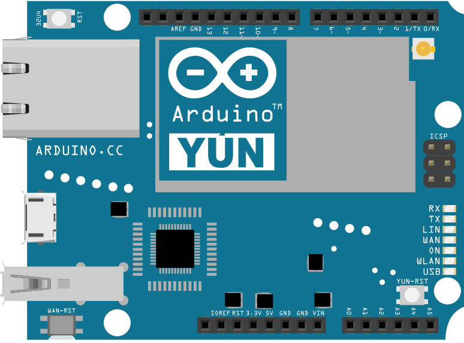

This example for a Yún device demonstrates how to print to the Console by generating a table of characters and their ASCII values in decimal, hexadecimal, octal, and binary. For more on ASCII, see [asciitable.com](http://asciitable.com).

The Console, based on Bridge, enables you to send information from the Yún device to a computer just as you would with the serial monitor, but wirelessly. It creates a secure connection between the Yún device and your computer via SSH.

When your Yún device and computer are on the same network, you can find the Yún device in the Tools>Ports menu item in the Arduino Software (IDE).

## Hardware Required

- Yún board or shield

- computer and Yún on the same wireless network

## Circuit

There is no circuit for this example.



image developed using [Fritzing](http://www.fritzing.org). For more circuit examples, see the [Fritzing project page](http://fritzing.org/projects/)

## Code

Include the Console library, which inherits from Bridge.
`#include <Console.h>`

Create a variable that will hold the value to print out to the Console window. ASCII characters of values 32 and below are invisible, so initialize the variable with a value of 33 (which corresponds to "!" ).
`int byte = 33;`

In `setup()`, initialize the Bridge and Console, and wait for the port to open. Once a connection has been made, print out a small bit of information describing what is going to follow :

```arduino
void setup() {

  Bridge.begin();

  Console.begin();

  while (!Console) {

    ; // wait for Console port to connect.

  }

  Console.println("ASCII Table ~ Character Map");
}
```

In `loop()`, you will print the value in a number of different formats.

To see the ASCII value of the variable, you can write the byte with `Console.write()`. The Console interprets all bytes as ASCII characters.
`Console.write(thisByte);`

`Console.print()` prints the value as a string of ASCII encoded decimals by default.
`Console.print(thisByte);`

`Console.print()` and `Console.println()` can also send strings to the Console window that represent hexadecimal, octal, and binary number values with the appropriate modifier. `Console.println()` will add newline and carriage return characters to the string, creating a line break in the Console window.

```arduino
Console.print(thisByte, HEX);

Console.print(thisByte, OCT);

Console.println(thisByte, BIN);
```

In this example, you're only printing out the alphanumeric characters that appear on a USA keyboard, so there's no need to print any values past 126. To make sure all the data gets sent before stopping the sketch, make a call to `Console.flush()`.

```arduino
if(thisByte == 126) {

    Console.flush();

    while(true) {

      continue;

    }

  }
```

If the sketch hasn't printed out all the values, increment `thisByte` before running through the `loop()` again.
`thisByte++;`

The complete sketch is below :

```arduino

/*

 Console ASCII table for YunShield/Yún

 Prints out byte values in all possible formats:

 * as raw binary values

 * as ASCII-encoded decimal, hex, octal, and binary values

 For more on ASCII, see http://www.asciitable.com and http://en.wikipedia.org/wiki/ASCII

 The circuit:

 - YunShield/Yún

 created 2006

 by Nicholas Zambetti

 http://www.zambetti.com

 modified 9 Apr 2012

 by Tom Igoe

 modified 22 May 2013

 by Cristian Maglie

 This example code is in the public domain.

 http://www.arduino.cc/en/Tutorial/ConsoleAsciiTable

 */

#include <Console.h>

void setup() {

  //Initialize Console and wait for port to open:

  Bridge.begin();

  Console.begin();

  // Uncomment the following line to enable buffering:

  // - better transmission speed and efficiency

  // - needs to call Console.flush() to ensure that all

  //   transmitted data is sent

  //Console.buffer(64);

  while (!Console) {

    ; // wait for Console port to connect.

  }

  // prints title with ending line break

  Console.println("ASCII Table ~ Character Map");
}

// first visible ASCIIcharacter '!' is number 33:
int thisByte = 33;
// you can also write ASCII characters in single quotes.
// for example. '!' is the same as 33, so you could also use this:
//int thisByte = '!';

void loop() {

  // prints value unaltered, i.e. the raw binary version of the

  // byte. The Console monitor interprets all bytes as

  // ASCII, so 33, the first number,  will show up as '!'

  Console.write(thisByte);

  Console.print(", dec: ");

  // prints value as string as an ASCII-encoded decimal (base 10).

  // Decimal is the  default format for Console.print() and Console.println(),

  // so no modifier is needed:

  Console.print(thisByte);

  // But you can declare the modifier for decimal if you want to.

  //this also works if you uncomment it:

  // Console.print(thisByte, DEC);

  Console.print(", hex: ");

  // prints value as string in hexadecimal (base 16):

  Console.print(thisByte, HEX);

  Console.print(", oct: ");

  // prints value as string in octal (base 8);

  Console.print(thisByte, OCT);

  Console.print(", bin: ");

  // prints value as string in binary (base 2)

  // also prints ending line break:

  Console.println(thisByte, BIN);

  // if printed last visible character '~' or 126, stop:

  if (thisByte == 126) {    // you could also use if (thisByte == '~') {

    // ensure the latest bit of data is sent

    Console.flush();

    // This loop loops forever and does nothing

    while (true) {

      continue;

    }

  }

  // go on to the next character

  thisByte++;
}
```

**Last revision 2016/05/25 by SM**
