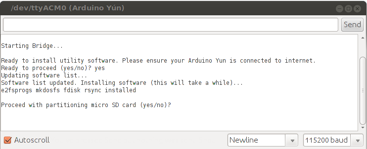
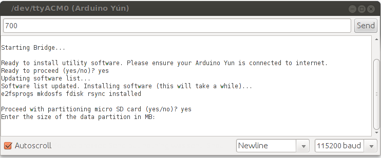
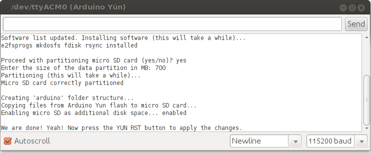

OpenWrt-Yun, the GNU/Linux operating system based on OpenWrt and installed on the Yún, takes around 9 of the 16 MB available of the onboard flash memory. This means you can run out of space if you install many software packages or applications.

In order to increase storage space, you can plug a micro SD card into your Arduino Yún and configure it to become your new Linux file system. Once configured, everything you will do on the the Linux side of the Yún will be stored on the SD.

The procedure to configure the Yún to recognize the SD card as a root file system is not complex but it still needs a basic Linux knowledge. So we have automated all the steps and made a sketch. The sketch uses the Bridge library to configure the Yún and the SD card. Just insert the SD card and follow the interactive steps in the Serial Monitor.

The sketch will split the SD card in two parts. The first part will be formatted as FAT32 and could be read from any computer: you can use it to share files between your computer and your Yún. The second part contains the Linux file system. Every software you've installed and every configuration file will be copied to the SD card, so you won't need to reinstall or reconfigure anything: your Yún will be the same as before, just with much more disk space. Be aware that this second part won't be accessible to your computer, if you use Windows or Mac.

## A Look to the Procedure

Connect your Yún to your computer and wait a minute or so. Make sure the Yún is connected to internet, because the procedure needs some additional software. Unplug any other device you may have plugged to your Yún. Insert a micro SD card.


***Warning: Your SD card will be formatted and you will lose the files it contains. Be sure you have backed it up before using it for expanding Yún's disk space.***

Download the zip file containing the sketch, unzip it and copy the unzipped folder to your Arduino sketchbook folder. Open the IDE and upload the YunDiskSpaceExpander sketch.

- [YunDiskSpaceExpander.zip for 1.5.2 images (first gen boards)](https://www.arduino.cc/en/uploads/Tutorial/YunDiskSpaceExpander.zip)
- [YunDiskSpaceExpander.ino for 17.11 images or later (Rev.2 boards or updated firmware)](https://github.com/arduino/yun-go-updater/blob/master/YunDiskSpaceExpander/YunDiskSpaceExpander.ino)

Open the Serial Monitor and double check the dropdown menu "Newline" has been selected.

**Start**
When you open the serial monitor, a message warns you to unplug any other mass storage device you may have connected to the Yún. Only the micro SD card should be plugged into the Yún. Type "yes" and press enter if you want to proceed.


**Install software**
First step of the procedure is to install the software needed to format the SD card. Before typing "yes", make sure that the Yún is connected to internet, otherwise installation will fail.


**Format the SD card**
Now the additional software is correctly installed. Type "yes" and press enter to start to formatting the SD card.



Specify the size of the first part of the SD card, the one you'll use to share files with your computer. The remaining part of the SD will be dedicated to the Linux file system.
In this example we used a 2 GB SD card and we decided to leave 700 MB to the first part. The remaining 1.3 GB is dedicated to Linux.



Once done, all your previous configuration and files stored on the internal flash memory will be copied to the second part of the SD card.
In order to apply all the changes, you need to reboot the Yún. Press the YUN RST button (the one near the leds).



The sketch will continue showing the Yún Linux shell and you will see lots of messages telling you the Yún is starting up. Once the boot is finished type:

```arduino
df -h / /mnt/sda1
```

The output should look like this:

```arduino
Filesystem              Size    Used Available Use% Mounted on

rootfs                  1.2G    51.7M   1.0G   5% /
/dev/sda1               698.6M  12.0K   698.6M   0% /mnt/sda1
```

As you can see we have 1.0 GB of free disk space.
If you are into OpenWrt what we have set up is named extroot. Additional information can be found on the [OpenWrt website](http://wiki.openwrt.org/doc/howto/extroot).