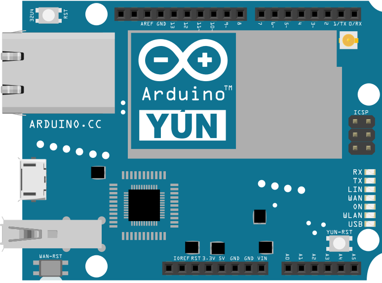

This example for a Yún device shows how create a basic HTTP client that connects to the internet and downloads content. In this case, you'll connect to the Arduino website and download a version of the logo as ASCII text.

Open the Serial Monitor in the IDE once you've programmed the board.

## Hardware Required

- Yún board or shield

- a wireless network connection to the internet

## Circuit

There is no circuit for this example.



image developed using [Fritzing](http://www.fritzing.org). For more circuit examples, see the [Fritzing project page](http://fritzing.org/projects/)

## Code

Include both the Bridge and HttpClient libraries

```arduino
#include <Bridge.h>
#include <HttpClient.h>
```

In `setup()` start Bridge, and wait for a serial connection before going into `loop()`.

```arduino
void setup() {

  pinMode(13, OUTPUT);

  digitalWrite(13, LOW);

  Bridge.begin();

  Serial.begin(9600);

  while(!Serial);
}
```

In `loop()`, create a named instance of HttpClient, and call a URL with `client.get(url)`.

```arduino
void loop() {

  HttpClient client;

  client.get("http://arduino.tips/asciilogo.txt");
```

As long as there are bytes from the server in the client buffer, read the bytes and print them to the serial monitor. Repeat every 5 seconds.

```arduino
while (client.available()) {

    char c = client.read();

    Serial.print(c);

  }

  Serial.flush();

  delay(5000);
}
```

The complete sketch is below :

<iframe src='https://create.arduino.cc/example/library/bridge_1_7_0/bridge_1_7_0%5Cexamples%5CHttpClient/HttpClient/preview?embed' style='height:510px;width:100%;margin:10px 0' frameborder='0'></iframe>
