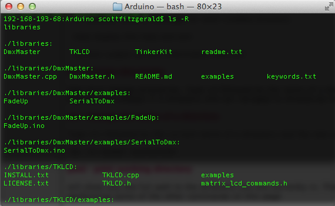

The Arduino Yún has a Linux computer on-board. Instead of using the computer through a graphical interface (sometimes referred to as a GUI), you can send commands through a command line interpreter (CLI). The CLI accepts commands that run applications, configure the operating system, display diagnostic information, and just about anything else you would want to do with a computer. For additional information on the basics of the Command Line, see [the Debian documentation](https://wiki.debian.org/CommandLineInterface).

Operating systems like OSX and Linux ship with programs called terminal emulators. These can open a connection between the Yún and your computer, allowing you to send and receive information, as well as run applications from the Yun's Linux distribution.

## Opening the Terminal Application

- OSX : The "Terminal" program can be found in the **Applications > Utilities** folder.

- Windows: [PuTTY](http://www.chiark.greenend.org.uk/~sgtatham/putty/) is a third-party application that acts as a terminal emulator that supports SSH (see below for details).

- Linux : Different versions of Linux place the terminal in various locations. On Ubuntu, it can be accessed via **Dash > More Apps > Accessories > Terminal**

## Entering Commands Through CLI

To list the items in a directory, you would type :

`ls`

and press return. The output will appear below the command in the window.


Commands can also accept various commands, also called flags. If you wanted to list the files in a directory and also display  anything in their sub directory, you would follow the command with '-R'.

`ls -R`

and press return.



Some typical commands are `mkdir` for creating directories, `cd` to change directories, `chmod` to change a file's permissions, and `cp` to copy files. A list of common Linux commands and flags can be found on the [Debian help site](http://www.debianhelp.co.uk/commands.htm).

This document has additional information about [using the CLI and OpenWRT](http://wiki.openwrt.org/doc/howto/user.beginner.cli).

## SSH

SSH is shorthand for Secure Shell, a terminal protocol for securely connecting between two computers. You'll use SSH to connect between your computer and the Yún.

To connect via SSH, you need the IP address of the Yún, the administrator password, and you'll need to have the Arduino and the computer you're using on the same network. To find the Yun's IP address, make sure you're on the same wireless network, and open the Arduino software. Check the **Ports** list, the Yún should be listed with its address.

To connect to your Yún via SSH, open your terminal application, type the following, substituting the IP address for that of your Yún :

`ssh root@172.16.1.190`

The 'ssh' command tells your local computer to open a connection to the user ('root') at the remote IP you entered. 'root' is a special type of user who can execute any commands on a computer. Think of it as a super-admin.

The first time you try to connect to your Yun from a computer, the terminal will reply with a message like this :

```
The authenticity of host '172.16.1.190 (172.16.1.190)' can't be established.
RSA key fingerprint is d2:f2:e1:23:d7:29:dc:f1:68:48:58:99:ae:c3:64:6f.
Are you sure you want to continue connecting (yes/no)?
```

Type `yes` at this prompt to continue the process. You'll get a response that says  :

```
Warning: Permanently added '172.16.1.190' (RSA) to the list of known hosts.
```

You'll now be prompted for a password. Enter the password you selected in the Yún configuration page.

## CURL

cURL is a tool that allows you to move data to or from a server. It supports a large number of protocols like HTTP and FTP. On the Yun, it's likely you'll want to use it for HTTP requests, asking for the contents of webpages. However, it supports other protocols like FTP, POP3, IMAP and others.

To call cURL from the command line to retrieve the the contents of a URL, simply type `curl www.example.com`. On the Yún, this would return the HTML of example.com.

The cURL website has more about [structuring requests](http://curl.haxx.se/docs/httpscripting.html).