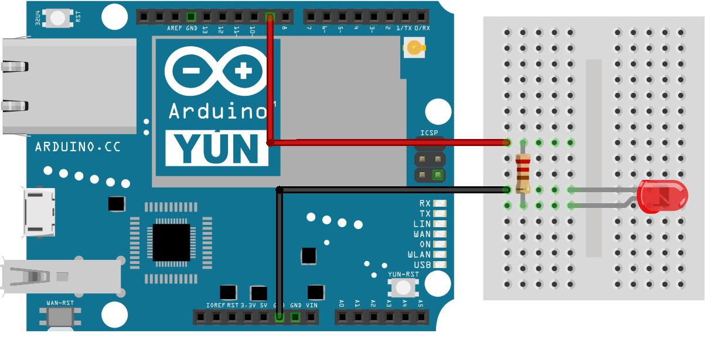
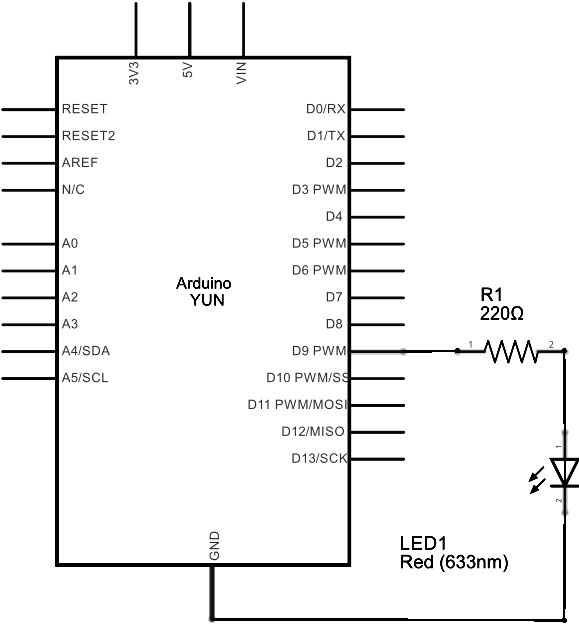

This sketch demonstrates running Linux shell commands on a Yún device.

It runs the wifiCheck script (located at /usr/bin/pretty-wifi-info.lua) on the Linux processor, then uses grep to get the signal strength.

On the board, parseInt() is called to read the Wi-Fi signal strength as an integer, and uses that number to fade an LED with `analogWrite()`.

## Hardware Required

- Yún board or shield

- Yún device connected to a wireless network

- 220 ohm resistor

- LED

- hook-up wires

- breadboard

## Circuit

A red LED connected to digital pin 9 through a 220 ohm resistor on the breadboard.



image developed using [Fritzing](http://www.fritzing.org). For more circuit examples, see the [Fritzing project page](http://fritzing.org/projects/)

## Schematic



image developed using [Fritzing](http://www.fritzing.org). For more circuit examples, see the [Fritzing project page](http://fritzing.org/projects/)

## Code

Include the Process class in your sketch.
`#include <Process.h>`

In `setup()`, you'll want to initialize Bridge and start a serial connection. Before running the rest of the sketch, wait for a serial connection to become active.

```arduino
void setup() {

  Bridge.begin();

  Serial.begin(9600);

  while (!Serial);
}
```

Create a named Process with which you'll use to run the Wi-Fi status script and grep.

```arduino
void loop() {

  Process p;
```

Pass `runShellCommand()` the path of the script you wish to run, along with any additional commands. In this case, you'll call "grep Signal" to pull out just the signal strength of the Wi-Fi connection.

`p.runShellCommand("/usr/bin/pretty-wifi-info.lua | grep Signal");`

Wait until the process finishes so you get the entire output

`while(p.running());`

Once the process has finished running, use `parseInt()` to look for an integer that represents the signal strength. It should be in the range of 0 - 100. Map the result to a value between 0 and 255 with `map()` and use that value to adjust the brightness of the LED on pin 9 with `analogWrite()`. Print the signal strength to the serial monitor and wait for a few seconds before starting again.

```arduino
while (p.available()) {

    int result = p.parseInt();

    int signal = map(result, 0, 100, 0, 255);

    analogWrite(9, signal);

    Serial.println(result);

  }

  delay(5000);
}
```

The LED should change its brightness as the Wi-Fi signal strength fluctuates.

## Complete Sketch

The complete sketch is below:

```arduino

/*

  Running shell commands using Process class.

 This sketch demonstrate how to run linux shell commands

 using a YunShield/Yún. It runs the wifiCheck script on the Linux side

 of the Yún, then uses grep to get just the signal strength line.

 Then it uses parseInt() to read the wifi signal strength as an integer,

 and finally uses that number to fade an LED using analogWrite().

 The circuit:

 * YunShield/Yún with LED connected to pin 9

 created 12 Jun 2013

 by Cristian Maglie

 modified 25 June 2013

 by Tom Igoe

 This example code is in the public domain.

 http://www.arduino.cc/en/Tutorial/ShellCommands

 */

#include <Process.h>

void setup() {

  Bridge.begin();   // Initialize the Bridge

  SerialUSB.begin(9600);    // Initialize the Serial

  // Wait until a Serial Monitor is connected.

  while (!SerialUSB);
}

void loop() {

  Process p;

  // This command line runs the WifiStatus script, (/usr/bin/pretty-wifi-info.lua), then

  // sends the result to the grep command to look for a line containing the word

  // "Signal:"  the result is passed to this sketch:

  p.runShellCommand("/usr/bin/pretty-wifi-info.lua | grep Signal");

  // do nothing until the process finishes, so you get the whole output:

  while (p.running());

  // Read command output. runShellCommand() should have passed "Signal: xx&":

  while (p.available()) {

    int result = p.parseInt();          // look for an integer

    int signal = map(result, 0, 100, 0, 255);   // map result from 0-100 range to 0-255

    analogWrite(9, signal);         // set the brightness of LED on pin 9

    SerialUSB.println(result);          // print the number as well

  }

  delay(5000);  // wait 5 seconds before you do it again
}
```


**Last revision 2016/05/25 by SM**