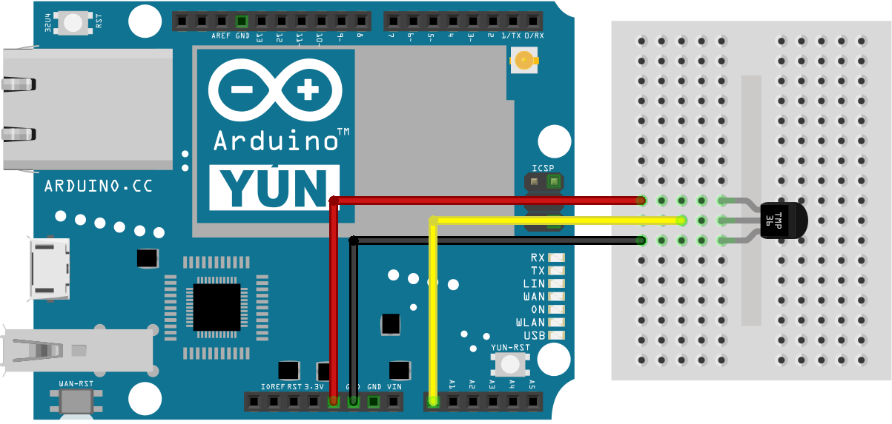
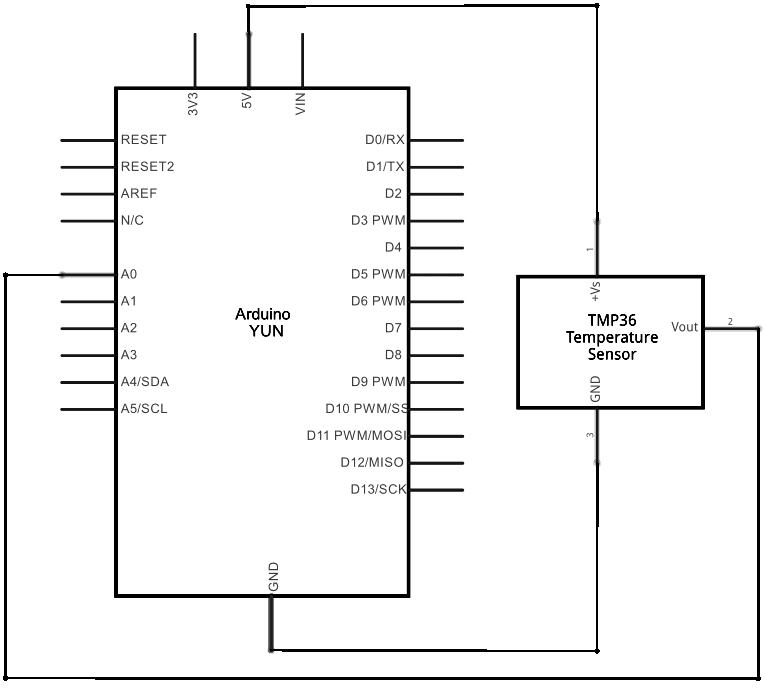

This example shows how to serve data from an analog input via the Yún device's built-in webserver using the Bridge library.

Prepare your SD card or USB Flash memory stick with an empty folder in the root named "arduino" and a subfolder of that named "www". This will ensure that the Yún device will create a link to the memory to the "/mnt/sd" path.

In this sketch folder is a basic webpage and a copy of zepto.js, a minimized version of jQuery.  When you upload your sketch, these files will be placed in the /arduino/www/TemperatureWebPanel folder on your removable memory.

You can then go to  http://arduino.local/sd/TemperatureWebPanel  to see the output of this sketch.

You can remove the SD card or USB Flash memory stick while the Linux and the sketch are running but be careful not to remove it while the system is writing to it.

## Hardware Required

- Yún board or shield

- computer and Yún device on the same wireless or wired network

- TMP36 temperature sensor on analog pin A1

- SD card or USB Flash memory stick

- hook-up wies

- breadboard

## Circuit

Attach a TMP36 temperature sensor on A1, and insert a micro-SD card into the slot on the Yún or the USB host of the shield.



image developed using [Fritzing](http://www.fritzing.org). For more circuit examples, see the [Fritzing project page](http://fritzing.org/projects/)

## Schematic



image developed using [Fritzing](http://www.fritzing.org). For more circuit examples, see the [Fritzing project page](http://fritzing.org/projects/)

## Code

You need to include the Bridge, YunServer, and YunClient libraries :

```arduino
#include <Bridge.h>
#include <YunServer.h>
#include <YunClient.h>
```

Instantiate a server enabling the the Yún to listen for connected clients.

`YunServer server;`

Create a string to hold the time the sketch started, and a variable to keep track of the number of times the page has been visited.

```arduino
String startString;
long hits = 0;
```

In `setup()` , start serial communication and Bridge. It's helpful to use the on-board LED as a status light to know when Bridge has started.

```arduino
void setup() {

  Serial.begin(9600);

  pinMode(13,OUTPUT);

  digitalWrite(13, LOW);

  Bridge.begin();

  digitalWrite(13, HIGH);
```

Set A0 and A2 as power and ground for the TMP36 sensor (this helps avoid using a breadboard).

```arduino
pinMode(A0, OUTPUT);

  pinMode(A2, OUTPUT);

  digitalWrite(A0, HIGH);

  digitalWrite(A2, LOW);
```

Tell the server to listen for incoming connections only from localhost and start it

```arduino
server.listenOnLocalhost();

  server.begin();
```

Create an instance of Process to get the time the sketch started by running the `date` command and storing it in the string you created earlier.

```arduino
Process startTime;

  startTime.runShellCommand("date");

  while(startTime.available()) {

    char c = startTime.read();

    startString += c;

  }
}
```

In `loop()`, create a named instance of YunClient to get any clients coming from the server.

`YunClient client = server.accept();`

If there is a new client connected, read the command the client sent and print it out.

```arduino
if (client) {

    String command = client.readString();

    command.trim();        //kill whitespace

    Serial.println(command);
```

If the command is "temperature", get the current time and read the value of the temperature sensor.

```arduino
if (command == "temperature") {

      Process time;

      time.runShellCommand("date");

      String timeString = "";

      while(time.available()) {

        char c = time.read();

        timeString += c;

      }

      Serial.println(timeString);

      int sensorValue = analogRead(A1);
```

Convert the sensor's reading to temperature Celsius :

```arduino
// convert the reading to millivolts:

      float voltage = sensorValue *  (5000/ 1024);

      // convert the millivolts to temperature celsius:

      float temperature = (voltage - 500)/10;
```

Print the current time, temperature, time the sketch was started, and the number of hits since starting to the connected client with `client.print()`.

```arduino
client.print("Current time on the Yun: ");

      client.println(timeString);

      client.print("<br>Current temperature: ");

      client.print(temperature);

      client.print(" degrees C");

      client.print("<br>This sketch has been running since ");

      client.print(startString);

      client.print("<br>Hits so far: ");

      client.print(hits);

    }
```

Close the connection to free up any unused resources and increment the hit counter.

```arduino
client.stop();

    hits++;

  }
```

Pause for a few moments before polling anew

```arduino
delay(50); // Poll every 50ms
}
```

The complete code is below :

```arduino

/*

  Temperature web interface

 This example shows how to serve data from an analog input

 via the YunShield/Yún built-in webserver using the Bridge library.

 The circuit:

 * TMP36 temperature sensor on analog pin A1

 * SD card attached to SD card slot of the YunShield/Yún

 This sketch must be uploaded via wifi. REST API must be set to "open".

 Prepare your SD card with an empty folder in the SD root

 named "arduino" and a subfolder of that named "www".

 This will ensure that the Yún will create a link

 to the SD to the "/mnt/sd" path.

 In this sketch folder is a basic webpage and a copy of zepto.js, a

 minimized version of jQuery.  When you upload your sketch, these files

 will be placed in the /arduino/www/TemperatureWebPanel folder on your SD card.

 You can then go to http://arduino.local/sd/TemperatureWebPanel

 to see the output of this sketch.

 You can remove the SD card while the Linux and the

 sketch are running but be careful not to remove it while

 the system is writing to it.

 created  6 July 2013

 by Tom Igoe

 This example code is in the public domain.

 http://www.arduino.cc/en/Tutorial/TemperatureWebPanel

 */

#include <Bridge.h>
#include <BridgeServer.h>
#include <BridgeClient.h>

// Listen on default port 5555, the webserver on the Yún
// will forward there all the HTTP requests for us.

BridgeServer server;

String startString;
long hits = 0;

void setup() {

  SerialUSB.begin(9600);

  // Bridge startup

  pinMode(13, OUTPUT);

  digitalWrite(13, LOW);

  Bridge.begin();

  digitalWrite(13, HIGH);

  // using A0 and A2 as vcc and gnd for the TMP36 sensor:

  pinMode(A0, OUTPUT);

  pinMode(A2, OUTPUT);

  digitalWrite(A0, HIGH);

  digitalWrite(A2, LOW);

  // Listen for incoming connection only from localhost

  // (no one from the external network could connect)

  server.listenOnLocalhost();

  server.begin();

  // get the time that this sketch started:

  Process startTime;

  startTime.runShellCommand("date");

  while (startTime.available()) {

    char c = startTime.read();

    startString += c;

  }
}

void loop() {

  // Get clients coming from server

  BridgeClient client = server.accept();

  // There is a new client?

  if (client) {

    // read the command

    String command = client.readString();

    command.trim();        //kill whitespace

    SerialUSB.println(command);

    // is "temperature" command?

    if (command == "temperature") {

      // get the time from the server:

      Process time;

      time.runShellCommand("date");

      String timeString = "";

      while (time.available()) {

        char c = time.read();

        timeString += c;

      }

      SerialUSB.println(timeString);

      int sensorValue = analogRead(A1);

      // convert the reading to millivolts:

      float voltage = sensorValue * (5000.0f / 1024.0f);

      // convert the millivolts to temperature celsius:

      float temperature = (voltage - 500.0f) / 10.0f;

      // print the temperature:

      client.print("Current time on the Y&uacute;n: ");

      client.println(timeString);

      client.print("<br>Current temperature: ");

      client.print(temperature);

      client.print(" &deg;C");

      client.print("<br>This sketch has been running since ");

      client.print(startString);

      client.print("<br>Hits so far: ");

      client.print(hits);

    }

    // Close connection and free resources.

    client.stop();

    hits++;

  }

  delay(50); // Poll every 50ms
}
```

**Last revision 2016/05/25 by SM**