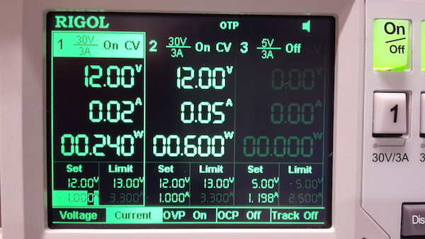

## Arduino Zero Low Power Overview

This tutorial aims to show the low power characteristics of the Arduino Zero. The Arduino Zero has on board an ATMEL SAMD21G18 that is a low power microcontroller using the 32 bit Arm® Cortex®-M0+ architecture.

The device has two different software selectable sleep modes: idle & standby.
- In idle mode the CPU is stopped while all the other functions can be kept running.
- In standby all clocks and functions are stopped except those selected to continue running.

The device also supports SleepWalking that allows the peripheral to wake up from sleep based on predefined threshold or when a result is ready.

The SAMD21 series has a dedicated module called Power Manager (PM) that controls the reset, clock generation and sleep modes of the microcontroller. In the architecture there are many clock domains that can run at different speeds, enabling the user to save power by running peripherals at a relatively low clock frequency, while maintaining high CPU performance. Furthermore, the clock of each peripheral can be disabled (mask operation), enabling the user to minimize power consumption due to unused peripherals. In particular when the device enters a sleep mode, program execution is stopped and some modules and clock domains are automatically switched off by the PM according to the sleep mode. The application code decides which sleep mode to enter and when.

## Voltage Regulator

In order to reduce power consumption due to the 3.3V voltage regulator, the Arduino Zero has a DC-DC converter plus an LDO voltage regulator instead of just the LDO, like in the most of the other Arduino boards. This kind of combination reduces dramatically the power consumption because the dissipated power of a linear regulator is proportional to the voltage drop between input and output of the regulator times the  supplied current. Using the DC-DC converter instead, the input voltage on the VIN pin is scaled to the minimum input value allowed by the LDO, therefore the dissipated power stays the same if  the input voltage is increased.

## Comparison

Here is a comparison of an Arduino UNO and an Arduino ZERO running the same code and powered by the same voltage source with the same parameters. In particular Arduino Zero is connected to the output 1 while the Arduino Uno to the output 2.



As it can be easily seen, in the same conditions the Arduino Zero requires less than half power compared to the Arduino Uno with performances that are far, far away from the Uno's! This result is obtained thanks to the better power management detailed above.

## Circuit

There is no circuit for this example.

## Code

```arduino
/*

  AnalogReadSerialPWM

  Reads an analog input on pin 0, prints the result to the serial monitor and map it to the 9 PWM pin.

 This example code is in the public domain.

 */

// the setup routine runs once when you press reset:
void setup() {

  // initialize serial communication at 115200 bits per second:

  Serial.begin(115200);
}

// the loop routine runs over and over again forever:
void loop() {

  // read the input on analog pin 0:

  int sensorValue = analogRead(A0);

  // print out the value you read:

  Serial.println(sensorValue);

  analogWrite(9, map(sensorValue, 0, 1023, 0, 255));

  delay(1);        // delay in between reads for stability
}


```