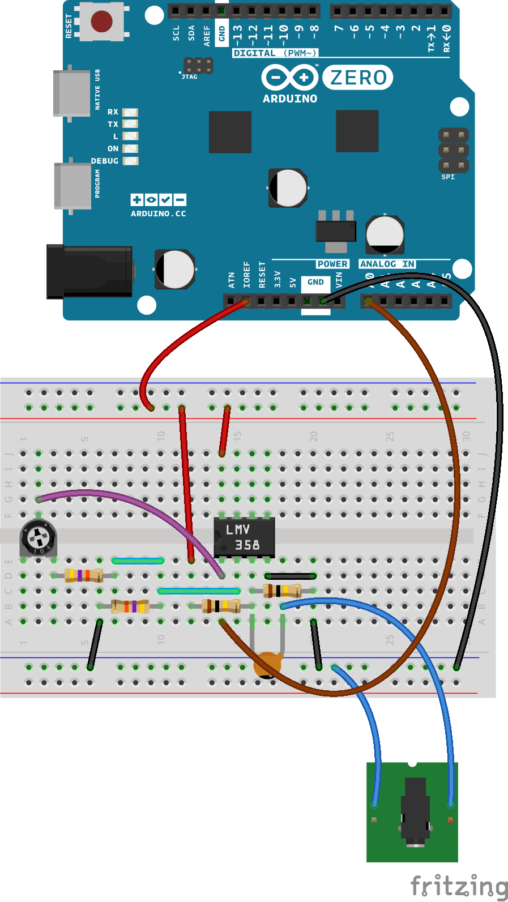
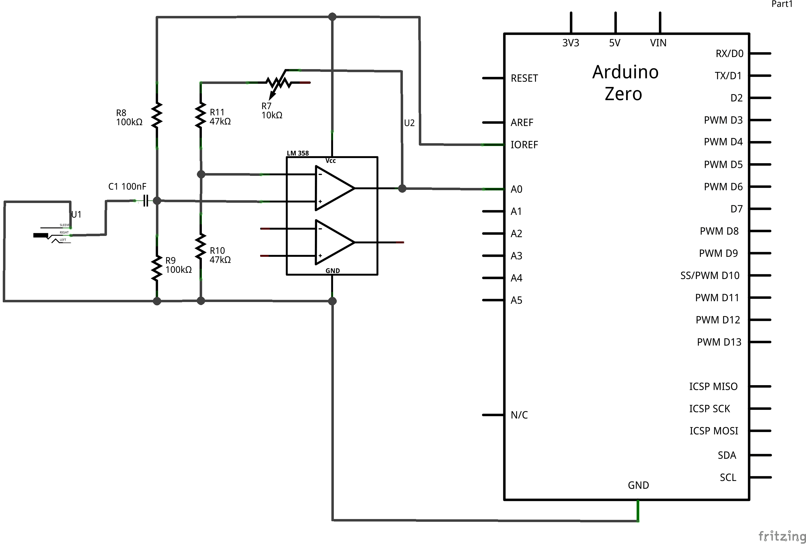

This tutorial explains how to use the [Audio Frequency Meter Library](https://github.com/agdl/AudioFrequencyMeter) for Arduino Zero boards. The code uses a method of the library to measure the frequency of a signal connented to A0 and amplified through an electronic circuit, in order to get the frequency of a generic input signal. The range currently measured by the library spans from 60 to 1500 Hz and it can be narrowed by the setBandwidth() method.
The library can be installed using the [arduino library manager](https://arduino.cc/en/Guide/Libraries#toc3)

## Hardware Required

- Arduino Zero Board

- 10k ohm trimmer

- 1x [LMV358](http://www.ti.com/lit/ds/symlink/lmv324.pdf) or [TLV2462](http://www.ti.com/lit/ds/symlink/tlv2462-q1.pdf)
- 2 100k ohm resistors

- 2 47k ohm resistors

- 100n farad capacitor

- 3.5mm jack

## Circuit



In order to get the most dynamic range even from low level inputs, the circuit consist of a [non-inverting amplifier](https://en.wikipedia.org/wiki/Operational_amplifier_applications#Non-inverting_amplifier) that brings the amplitude of the signal to the full input voltage range supported by the ADC. Sampling at full [resolution](https://en.wikipedia.org/wiki/Analog-to-digital_converter#Resolution) means a better accuracy.

The 10k trimpot allows to adjust the [gain of the amplifier](https://en.wikipedia.org/wiki/Gain_%28electronics%29) matching the signal level with the ADC input range. This adjustment should be made looking at the output on the Arduino Software (IDE) Serial Monitor: when the frequency reading is stable, the gain is properly set.

As an alternative, you may purchase the [Electret microphone amplifier - MAX4466 with adjustable gain](https://www.adafruit.com/product/1063) that was designed specifically for this purpose.

## Schematic



## Code

```arduino

/*

  Simple Frequency Meter for Arduino Zero

  Demonstrates how to sample an input signal and get back its frequency

  This example code is in the public domain

  https://www.arduino.cc/en/Tutorial/SimpleAudioFrequencyMeter

  created by Arturo Guadalupi <a.guadalupi@arduino.cc>

  10 Nov 2015

*/

#include <AudioFrequencyMeter.h>

AudioFrequencyMeter meter;

void setup() {

  // put your setup code here, to run once:

  Serial.begin(115200);

  Serial.println("started");

  meter.setBandwidth(70.00, 1500);    // Ignore frequency out of this range

  meter.begin(A0, 45000);             // Initialize A0 at sample rate of 45kHz
}

void loop() {

  // put your main code here, to run repeatedly:

  float frequency = meter.getFrequency();

  if (frequency > 0)

  {

    Serial.print(frequency);

    Serial.println(" Hz");

  }
}
```