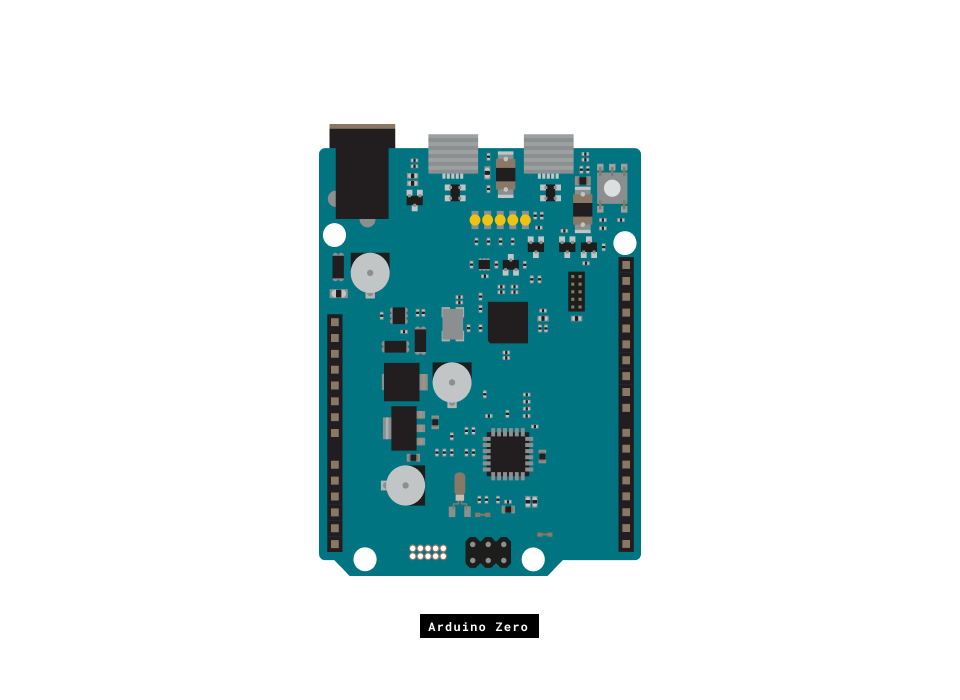
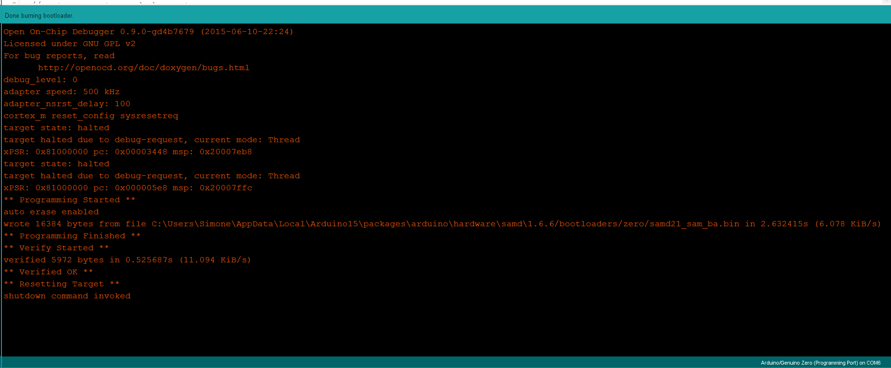

## Introduction
On the Zero you can write the bootloader on the main microcontroller without the need of an external programmer. It's possible because on the board there is an Atmel EDBG chip, which is a real programmer and you can connect to it through the Programming USB port and program every part of the SAMD21 Flash. The bootloader comes with the Board Package and you don't need to download it as a separate file. Each time a new bootloader is needed for some reason, it will be included in the latest Board Package and we will inform our users about it.

## Goals

- How to update the bootloader on the Arduino Zero.
  

 ## Hardware & Software needed

- [Arduino Zero](https://store.arduino.cc/arduino-zero) board.
- Arduino IDE ([online](https://create.arduino.cc/) or [offline](https://www.arduino.cc/en/main/software)).
- Micro USB cable.

### Circuit

This tutorial requires only an Arduino Zero board.
 
 

## Board Package Download

The Board Manager available in the Arduino Software (IDE) allows you to find and download the Board Packages available for our and third party boards. To update the Zero Board Package, you need to choose **Tools > Board > Boards Manager...**

The Boards Manager window will open up and initiate the update process for the available Board Packages. When you gain access to the interface, please select **Type > Updatable** and look for **Arduino SAMD** in the list. If an update is available it will show up, otherwise you may check if you have the most recent version searching directly for SAMD.

Clicking in the cell will show the available options. if you see a button on the left saying **Update** there is a new version available, otherwise you will see **Remove** if you already have the latest version.

Please press **Update** if available, let the Boards Manager download and install all the files and go ahead with the rest of this procedure.

## Setting up the Hardware

Please Select from **Tools > Board > Arduino Zero (Programming Port)** and connect your board to the computer, using the MicroUSB **Programming port** that is the one close to the black power socket.

Then select the COM port to which your Zero board has been connected. If you have more than one COM port in the list, you can check which is the one of the Zero using your computer Hardware Properties page.

The last step of the setup is choosing the proper programmer under **Tools > Programmer > Atmel EDBG**

## Programming the Bootloader

If all the settings of the Arduino Software (IDE) are as described above, you may go ahead and update the bootloader of your Zero Board. Go to **Tools > Burn Bootloader** and wait until you get on the status line the **Done burning bootloader** message. 

## Testing It Out

To confirm the success of the procedure you may read the messages printed in the serial monitor. It should be similar to the ones in the screenshot below.

### Troubleshoot

If you are experiencing problems, there are some common issues we can troubleshoot:

- You are using the incorrect port.
- You are using the incorrect programmer.

## Conclusion

Congratulations! You have successfully updated the bootloader on your Arduino Zero. It is possible to do this because of the  Atmel EDBG chip on the board.
