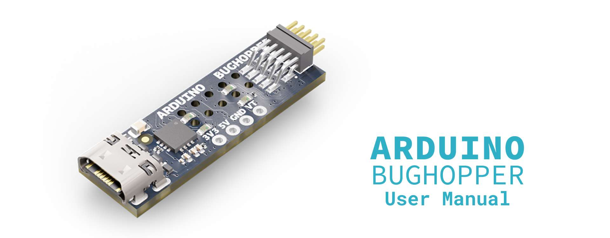
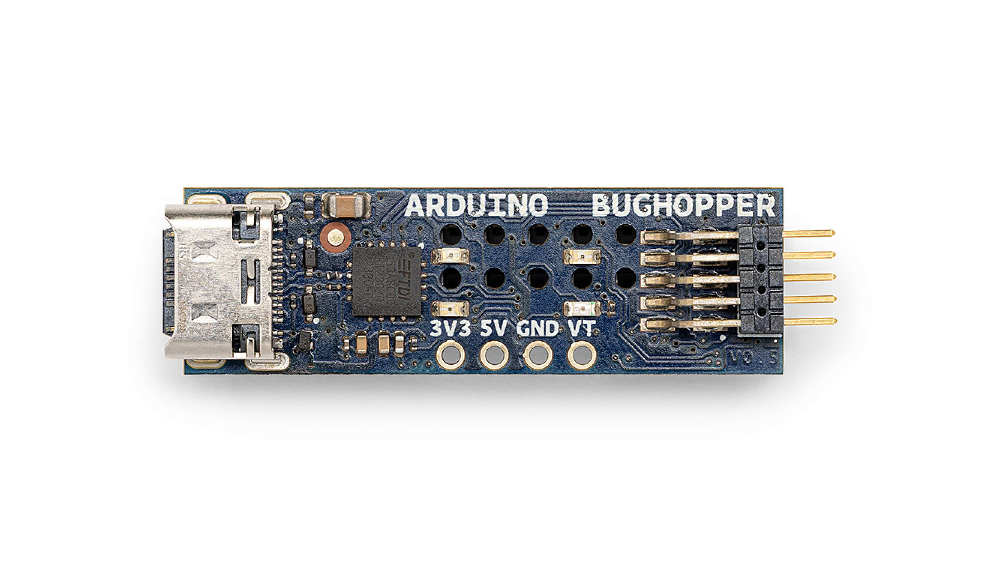
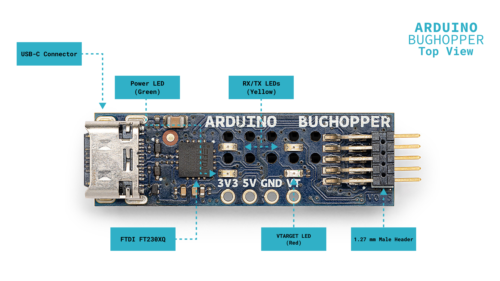
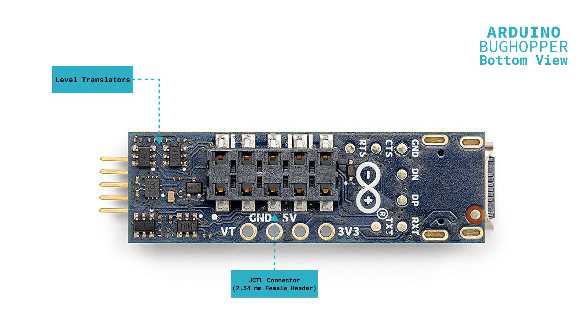
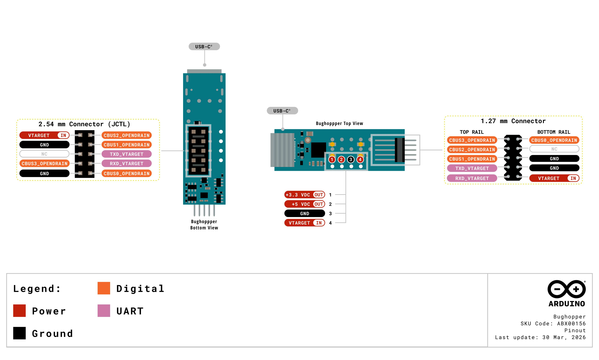
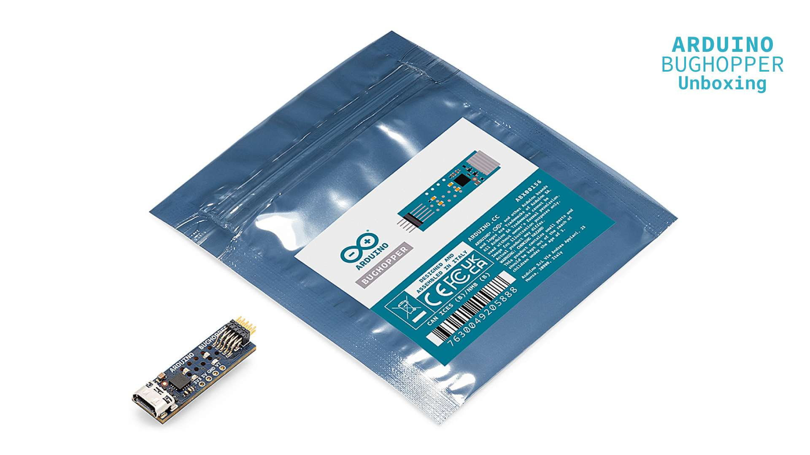
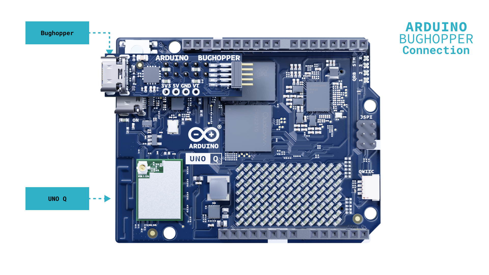
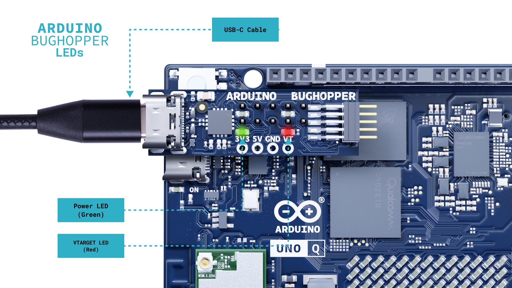

This user manual provides a comprehensive overview of Bughopper hardware and setup. You will learn to connect, configure, and use it as an independent serial debug channel for your Arduino-compatible board.

## Hardware and Software Requirements

### Hardware Requirements

- [Bughopper (SKU: ABX00156)](https://store.arduino.cc/products/bughopper) (x1)
- Compatible Arduino board with a JCTL 2.54 mm connector (x1)
- [USB-C® cable (SKU: TPX00094)](https://store.arduino.cc/products/usb-cable2in1-type-c) (x1)

### Software Requirements

- [FTDI VCP drivers](https://ftdichip.com/drivers/vcp-drivers/) (software that allows your computer to communicate with USB-to-Serial devices; required on Windows, included by default on macOS and Linux OS distributions)
- A serial terminal application (software for displaying and sending data through a serial port), such as the [Arduino IDE Serial Monitor](https://docs.arduino.cc/software/ide-v2/tutorials/ide-v2-serial-monitor/), [PuTTY](https://www.chiark.greenend.org.uk/~sgtatham/putty/latest.html), or any other terminal emulator

## Bughopper Overview

The Bughopper is a compact USB-to-UART bridge that enables communication between a computer’s USB port and a device’s UART (Universal Asynchronous Receiver/Transmitter) serial interface. It provides **a dedicated serial debug channel for your Arduino-compatible board**. Built around the [FTDI FT230XQ chip](https://ftdichip.com/wp-content/uploads/2025/06/DS_FT230X.pdf), it establishes a reliable, high-speed serial link between your development machine and the target through its JCTL 2.54 mm connector (a type of pin header with 2.54 mm spacing), without occupying the main I/O (Input/Output) pins or interfering with the primary USB-C connection.

Its compact 38.5 × 11 mm footprint, USB-C connectivity, and dual header options make it easy to integrate into any workspace, enclosure, or automated test setup.

### Bughopper Architecture Overview

The top view of the Bughopper is shown in the image below:

The bottom view of the Bughopper is shown in the image below:

Here is an overview of the board's main components, shown in the images above:

- **USB-C connector**: This is the primary power and communication interface. It connects the Bughopper to a USB host, such as your development machine. It provides +5 VDC power and the USB data link for serial communication.
- **FTDI FT230XQ**: This is the main integrated circuit (IC) of the board. It manages the USB protocol and converts USB data to UART signals. It also generates +3.3 VDC via its built-in voltage regulator, and offers four configurable general-purpose input/output (GPIO) lines (CBUS0–CBUS3).
- **Level translators (SN74AVC2T245RSWR)**: It performs two-way (bidirectional) voltage-level translation between the FT230XQ's +3.3 VDC UART signals and the VTARGET domain (the voltage level supplied by the connected target board), enabling safe communication across devices that use different operating voltages.
- **JCTL 2.54 mm female header (J2)**: It connects the Bughopper directly to the target board's JCTL 10-pin 2.54 mm male header. This connector carries UART (serial communication) signals, CBUS GPIO lines (configurable outputs from the FTDI chip mapped to the target board's control pins) and the VTARGET (target voltage) from the target board.
- **1.27 mm male header (J3)**: An alternative connection option for compact ribbon cable setups or custom test fixtures (specialized hardware tools for testing).
- **Status LEDs**: Four onboard LEDs provide at-a-glance feedback. A green LED for the +3.3 VDC power rail (shows Bughopper power status), a red LED for the VTARGET rail (shows target board voltage), and two yellow LEDs for TXD (transmit) and RXD (receive) serial activity.

### Pinout

The full pinout is available as a downloadable PDF from the link below:

- [Bughopper pinout](https://docs.arduino.cc/resources/pinouts/ABX00156-full-pinout.pdf)

## First Use

### Unboxing the Bughopper

When you open the Bughopper antistatic bag, you will find the board and its corresponding documentation. **The Bughopper does not include a USB-C cable**, so you will need one ([available separately here](https://store.arduino.cc/products/usb-cable2in1-type-c)) to connect the board to your development machine.

<Alert type="warning">The Bughopper is a companion board that works alongside a compatible Arduino board with a JCTL 2.54 mm connector. <strong>It does not operate as a standalone device</strong>.</Alert>

### Connecting the Bughopper to the Target Board

Before connecting the Bughopper to your development machine, connect it to the target board first. Align the Bughopper's female 2.54 mm header (J2) with the JCTL 2.54 mm male header on the target board and press firmly until the connector is fully seated as shown in the image below.

In the image above, the Bughopper is connected to the Arduino UNO Q, which is used here as an example of a compatible target board.

<Alert type="danger"><strong>Safety note</strong>: Ensure that the JCTL 2.54 mm connector is properly aligned before applying pressure. Misalignment can damage the header pins on both boards.</Alert>

Once connected, the Bughopper receives VTARGET from the target board through the JCTL connector. This voltage is used as the reference for the level translator and the VTARGET status LED. Refer to your target board's documentation for its specific VTARGET value. For example, on the UNO Q, VTARGET is +1.8 VDC.

<Alert type="note">Beyond serial monitoring, the Bughopper's CBUS GPIO lines (CBUS0–CBUS3) can be used to remotely control the target board, for example, to trigger a USB recovery mode or reboot the system. This makes the Bughopper a useful tool for automated testing and continuous integration setups that require hands-free board control.</Alert>

### Connecting the Bughopper to Your Computer

With the Bughopper connected to the target board, connect it to your development machine using a USB-C cable. The green power LED will turn on to confirm that the +3.3 VDC rail is active. If the target board is also powered on, the red VTARGET LED will turn on as well.

The Bughopper will appear as a standard COM port on your development machine via FTDI's Virtual COM Port (VCP) drivers.

<Alert type="note"><strong>Note</strong>: The Bughopper provides a separate serial channel from the target board's main USB-C connection. You can monitor debug output through the Bughopper while your development tools communicate with the target board through its own USB-C or network connection, without any interference between the two channels.</Alert>

### Installing FTDI Drivers

The Bughopper uses the FTDI FT230XQ, which requires FTDI's VCP drivers to appear as a serial COM port on your development machine. On most systems, these drivers are installed automatically when the Bughopper is connected for the first time. If the board is not recognized, or if you need to update existing drivers, download the latest version from the [FTDI website](https://ftdichip.com/drivers/vcp-drivers/) and follow the installation instructions for your operating system.

Once the drivers are active, the Bughopper will appear as a new serial port on your system.

- On Windows, it will show as a `COMx` port (where `x` is a number assigned by the system) in the Device Manager.
- On macOS, it will appear as `/dev/cu.usbserial-XXXXXXXX` in the terminal, where `XXXXXXXX` is the chip's serial number.
- On Linux, it will appear as `/dev/ttyUSBx`, where `x` is an index assigned in order of connection, starting from `0`.

### Opening a Serial Terminal

With the Bughopper connected and the drivers active, open a serial terminal application of your choice. The [Arduino IDE Serial Monitor](https://docs.arduino.cc/software/ide-v2/tutorials/ide-v2-serial-monitor/), [PuTTY](https://www.putty.org/), and [CoolTerm](https://freeware.the-meiers.org/) are all compatible options.

Select the Bughopper's COM port in your terminal application and set the baud rate to match the target board's debug output configuration. Refer to your target board's documentation for the correct baud rate. Once the connection is open, the yellow TXD (DL2) and RXD (DL4) LEDs will flash to indicate serial activity.
**Note**: When used with the UNO Q, the Bughopper connects to the SE4 system console UART which is the SoC's main TTY. It provides access to boot logs, bootloader output and the Linux shell, not the Arduino sketch's serial output.
## Troubleshooting

If you experience issues when setting up the Bughopper, the table below covers the most common problems and their solutions.

|                    **Issue**                    |                                                      **Possible Cause**                                                      |                                                        **Solution**                                                        |
|:-----------------------------------------------:|:----------------------------------------------------------------------------------------------------------------------------:|:--------------------------------------------------------------------------------------------------------------------------:|
|  The Bughopper is not recognized as a COM port  |                                              FTDI VCP drivers are not installed                                              |       Download and install the latest VCP drivers from the [FTDI website](https://ftdichip.com/drivers/vcp-drivers/)       |
|       The green power LED does not turn on      |                                 The USB-C cable is not carrying power, or the cable is faulty                                |                          Try a different USB-C cable and make sure it supports both power and data                         |
| The red VTARGET LED does not turn on |                         The target board is not powered on, or the JCTL connector is not fully seated                        |              Power on the target board and verify that the JCTL connector is properly aligned and fully seated             |
|       The yellow TXD/RXD LEDs do not flash      | The wrong COM port is selected in the terminal application, or the baud rate does not match the target board's configuration |  Verify that the correct COM port is selected and that the baud rate matches the target board's debug output configuration |
|   No output is visible in the serial terminal   |                                   The target board has not started transmitting serial data                                  | Wait for the target board to complete its boot sequence, or verify that serial debug output is enabled on the target board |

## Conclusion

This user manual has covered the setup and first use of the Bughopper. You have learned how to connect the Bughopper to a compatible target board via the JCTL 2.54 mm connector, install the required FTDI drivers, and open a serial terminal to monitor debug output. 

With its dedicated serial debug channel and CBUS GPIO lines, the Bughopper is a practical tool for firmware development, system debugging, and automated testing workflows. For additional resources, tutorials, and community projects, visit the [Arduino Bughopper documentation page](https://docs.arduino.cc/hardware/bughopper/).

## Support

If you encounter any issues or have questions while working with your Bughopper, we provide various support resources to help you find answers and solutions.

### Help Center

Explore our Help Center, which offers a comprehensive collection of articles and guides for the Bughopper. The Help Center is designed to provide in-depth technical assistance and help you make the most of your device.

- [Arduino help center page](https://support.arduino.cc/)

### Forum

Join our community forum to connect with other Bughopper users, share your experiences, and ask questions. The Forum is an excellent place to learn from others, discuss issues, and discover new ideas and projects related to the Bughopper.

- [Bughopper category in the Arduino Forum](https://forum.arduino.cc/c/official-hardware/accessories/bughopper/231)

### Contact Us

Please get in touch with our support team if you need personalized assistance or have questions not covered by the help and support resources described before. We're happy to help you with any issues or inquiries about the Nano family boards.

- [Contact us page](https://www.arduino.cc/en/contact-us/)