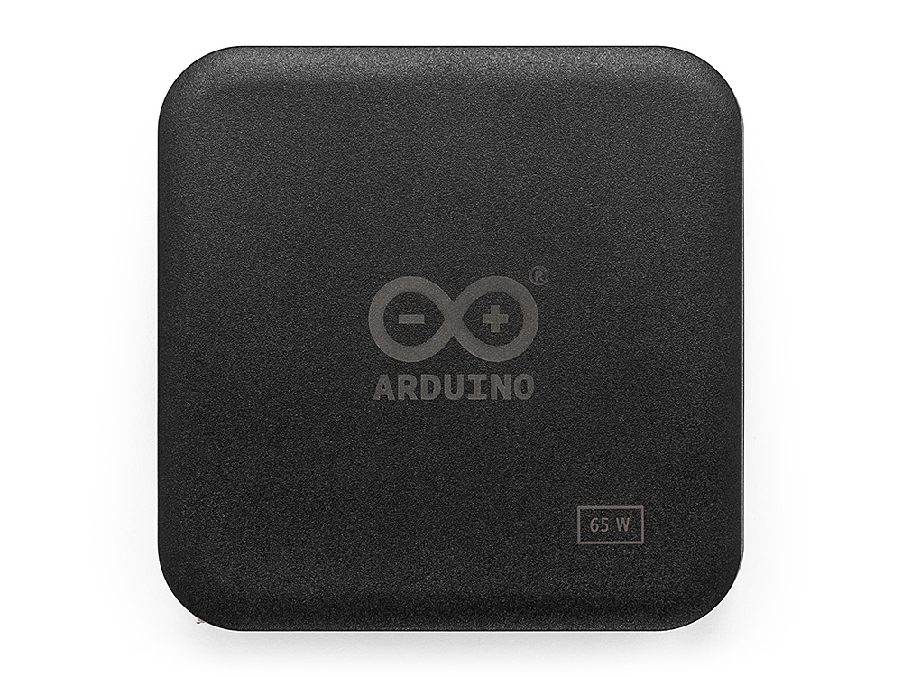
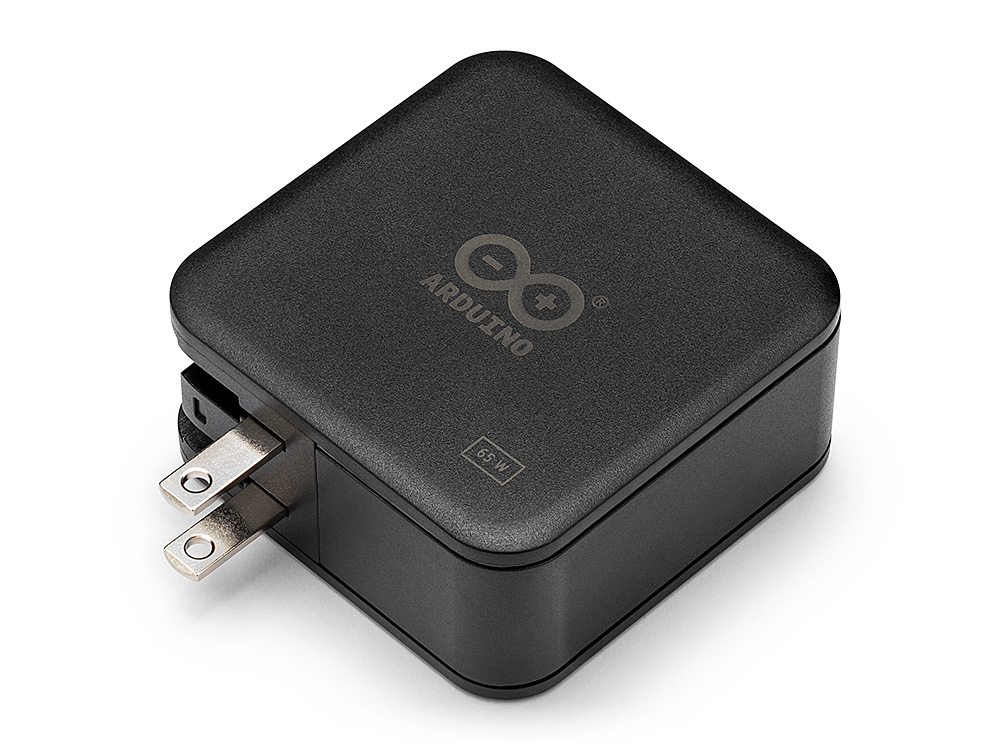
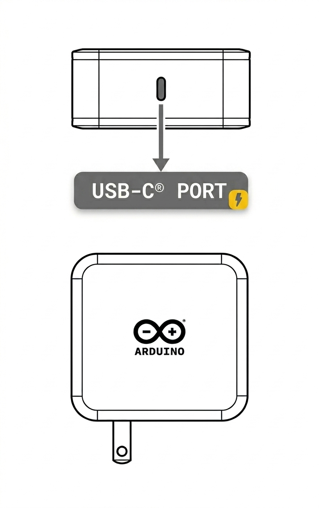
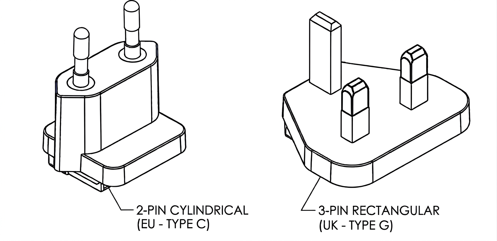
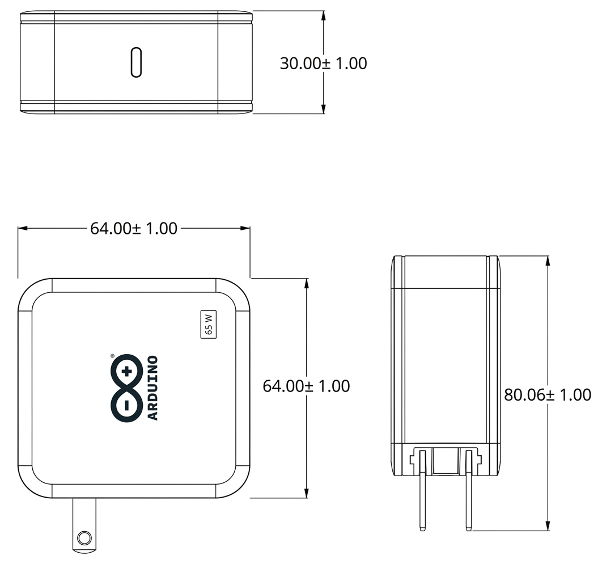
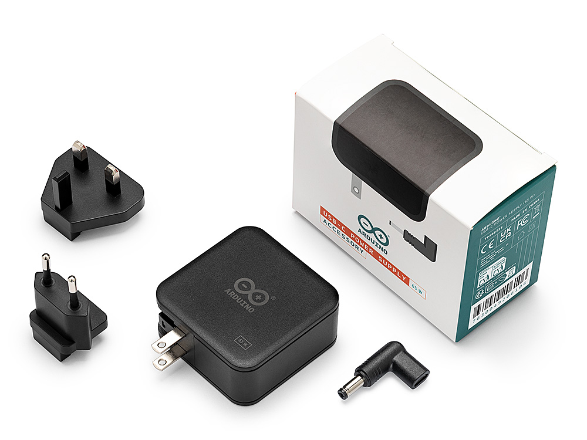

# Description

The Arduino® USB-C Power Supply (65W) is a compact wall adapter providing up to 65 W via USB-C using the USB Power Delivery (PD) protocol. It is the recommended power source for the Arduino® VENTUNO™ Q and its peripherals. The adapter supports 5 VDC, 9 VDC, 12 VDC, 15 VDC (up to 3.0 A), and 20 VDC (up to 3.25 A), automatically matching the device's needs. It features a foldable plug for easy transport and interchangeable EU and UK plugs.

# CONTENTS

## Features

### General Specifications

The table below summarizes the general specifications of the power supply:

|    **Feature**    | **Specification**                                                |
|:-----------------:|------------------------------------------------------------------|
|    Model Number   | TPX00256                                                         |
|    Adapter Type   | Plug-in wall adapter (foldable plug)                             |
|  Output Connector | USB-C (USB Type-C)                                               |
| Dimensions (Body) | 64 × 64 × 30 mm (folded plug)/64 × 80.06 × 30 mm (unfolded plug) |
|      Material     | PC (Polycarbonate) housing                                       |

### Input Specifications

The following table lists the AC input characteristics of the power supply:

|     **Parameter**     |   **Specification**   |
|:---------------------:|:---------------------:|
|  Rated Input Voltage  |     100 - 240 VAC     |
|  Input Voltage Range  |      90 - 264 VAC     |
|    Input Frequency    | 47 - 63 Hz (50/60 Hz) |
| Maximum Input Current |         1.5 A         |

### Output Specifications

The power supply delivers the following USB Power Delivery output profiles:

| **Output Voltage** | **Maximum Current** | **Maximum Power** |
|:------------------:|:-------------------:|:-----------------:|
|      5.0 VDC       |        3.0 A        |        15 W       |
|      9.0 VDC       |        3.0 A        |        27 W       |
|      12.0 VDC      |        3.0 A        |        36 W       |
|      15.0 VDC      |        3.0 A        |        45 W       |
|      20.0 VDC      |        3.25 A       |        65 W       |

  <strong>Combined maximum output power:</strong> 65 W

  
<strong>Important note:</strong> The power supply negotiates voltage and current using the PD protocol based on device needs.

### Regional Plug Options

The power supply is available with the following regional plug options:

| **Region**              | **Plug Type**   | **IEC Type** | **Dimensions (W × H × D)**       |
|-------------------------|-----------------|--------------|----------------------------------|
| United States (Default) | Foldable        | Type A       | Integrated (foldable)            |
| Europe (EU)             | Interchangeable | Type C       | 34.6 - 36.0 × 27.5 × 37 mm       |
| United Kingdom (UK)     | Interchangeable | Type G       | 48.98 × 39.83 × 22.23 - 23.23 mm |

  
<strong>Important note:</strong> The EU and UK plugs are interchangeable and can be replaced without tools. Make sure the correct plug is attached for your region before use.

## Usage

The USB-C Power Supply (65W) provides power for USB-C devices and their peripherals through the USB Power Delivery (PD) protocol. Within the Arduino ecosystem, it is the recommended power source for the VENTUNO Q. When used with USB-C hubs or docks, the power supply can sustain a connected device together with multiple peripherals such as displays, USB devices, and network adapters.

### Key Use Cases

The power supply supports the following use cases:

- **Direct device power:** Powers USB-C devices directly during development and operation.
- **Hub or dock power delivery:** Supplies USB-C hubs and docks with enough headroom to power a device and several peripherals at once.
- **Fast charging:** Charges USB-C devices through automatic power negotiation.
- **Multi-device support:** Compatible with single-board computers, microcontroller boards, and other USB-C devices.

### Connection Method

For standalone operation, connect the power supply's USB-C output directly to the device's USB-C port, then plug the adapter into a mains outlet within the rated input range of 100 - 240 VAC. The adapter and the connected device automatically negotiate the appropriate voltage and current, so no manual configuration is needed.

For expanded I/O, connect the power supply to a USB-C hub or dock, such as the Arduino® USB-C Hub (TPX00241), through its PD input port, then connect the hub to the device. The hub distributes power to the device and the attached peripherals simultaneously.

For devices that use a DC barrel jack input, connect the included USB-C to jack adapter (20 VDC X 3A) to the power supply's USB-C output, then plug the barrel jack into the device. The adapter provides a fixed output of 20 VDC/3A through a 5.5 × 2.1 mm center-positive barrel jack.

  
<strong>Important note:</strong> When powering USB-C hubs or docks (for example, the Arduino® USB-C Hub) with multiple high-power peripherals, connect the power supply to the hub's PD input port. The hub distributes power to the device and the connected peripherals simultaneously. Make sure the total power consumption does not exceed 65 W.

## Technical Specifications

### Output Characteristics

#### Voltage Regulation

The output voltage range for each Power Delivery profile is shown below.

| **Output Voltage** | **Voltage Range** |
|:------------------:|:-----------------:|
|      5.0 VDC       |  4.65 - 5.25 VDC  |
|      9.0 VDC       |  8.55 - 9.45 VDC  |
|      12.0 VDC      |  11.4 - 12.6 VDC  |
|      15.0 VDC      | 14.25 - 15.75 VDC |
|      20.0 VDC      |  19.0 - 21.0 VDC  |

#### Ripple and Noise

The ripple and noise characteristics are specified as follows:

|         **Parameter**        |         **Specification**        |
|:----------------------------:|:--------------------------------:|
| Ripple and Noise (all modes) | 200 mVp-p maximum (at full load) |
|     Measurement Bandwidth    |              20 MHz              |

  
<strong>Measurement conditions:</strong> Ripple and noise are measured using a 20 MHz oscilloscope, with a 0.1 μF ceramic and 10 μF electrolytic capacitor at rated input/output.

#### Dynamic Response

The dynamic response of the power supply is characterized by the following parameters:

| **Parameter** |              **Specification**             |
|:-------------:|:------------------------------------------:|
| Turn-on Delay |   3 seconds maximum @ 115 VAC, full load   |
|  Hold-up Time |      5 ms minimum @ 230 VAC, full load     |
|   Rise Time   | 80 ms maximum (10% to 90% of rated output) |

### Efficiency

The minimum average efficiency for each output mode, measured at 115 VAC and 230 VAC, is listed below.

| **Output Mode** | **Average Efficiency** |
|:---------------:|:----------------------:|
|  5.0 VDC/3.0 A  |     81.39% minimum     |
|  9.0 VDC/3.0 A  |     86.62% minimum     |
|  12.0 VDC/3.0 A |     87.40% minimum     |
|  15.0 VDC/3.0 A |     87.73% minimum     |
| 20.0 VDC/3.25 A |     88.00% minimum     |

  <strong>No-load power consumption:</strong> ≤ 0.21 W @ 115 - 230 VAC

### EU Ecodesign (ErP) Compliance

The following table lists the efficiency and no-load power values reported for compliance with EU Regulation 2019/1782 on ecodesign requirements for external power supplies.

|     **Parameter**          | **Value** |
|:--------------------------:|:---------:|
| Average Active Efficiency  |  89.76%   |
| Efficiency at 10% Load     |  80.21%   |
| No-Load Power Consumption  |  0.122 W  |

  
<strong>Important note:</strong> These values are measured according to the test conditions defined by EU Regulation 2019/1782. The minimum efficiency values per output profile listed in the Efficiency section are derived from the manufacturer specification and represent guaranteed minimums, whereas the ErP values reflect measured compliance results.

### Protection Features

The power supply includes three built-in protection mechanisms that safeguard both the adapter and the connected device against fault conditions:

|         **Protection**         | **Description**                                                                                                                                                     |
|:------------------------------:|---------------------------------------------------------------------------------------------------------------------------------------------------------------------|
|  Over Current Protection (OCP) | Triggers when the output current reaches 105% - 150% of the maximum rated load. The output enters hiccup mode and recovers automatically once the fault is removed. |
| Short Circuit Protection (SCP) | Reduces the input power if the output is short-circuited, preventing damage. The supply recovers automatically once the short circuit is removed.                   |
|  Over Voltage Protection (OVP) | Triggers if the output voltage exceeds its rated value. The output enters hiccup mode and recovers automatically once the fault is removed.                         |

### Operating Conditions

The power supply is designed to operate and be stored within the following conditions:

|     **Parameter**     |           **Range**          |
|:---------------------:|:----------------------------:|
| Operating Temperature |           0 - 35 °C          |
|   Operating Humidity  | 10 - 90% RH (non-condensing) |
|  Storage Temperature  |          -40 - 70 °C         |
|    Storage Humidity   |  5 - 95% RH (non-condensing) |

### Safety and EMC Specifications

#### Electrical Safety

The electrical safety characteristics are listed in the table below.

|      **Parameter**     |            **Specification**           |
|:----------------------:|:--------------------------------------:|
|   Dielectric Strength  | 3000 VAC @ 50 Hz, 5 mA max, 60 seconds |
| Production Hi-Pot Test |  3600 VAC @ 50 Hz, 5 mA max, 3 seconds |
|     Leakage Current    |     0.25 mA maximum @ 230 VAC/50 Hz    |
|  Insulation Resistance |     10 MΩ minimum @ 500 VDC, 90% RH    |
|   Flammability Rating  |            UL94V-0 (minimum)           |
|    Protection Class    |       Class II (double insulated)      |

#### EMI/EMC Compliance

The power supply complies with the following EMI and EMC standards:

|          **Standard**          | **Compliance**                                            |
|:------------------------------:|-----------------------------------------------------------|
| Conducted & Radiated Emissions | EN 55032/35, BS EN 55032/35, FCC Part 15                  |
|          ESD Immunity          | EN 61000-4-2 (±4 kV contact, ±8 kV air)                   |
|       EFT/Burst Immunity       | EN 61000-4-4 (±1 kV, AC input)                            |
|         Surge Immunity         | EN 61000-4-5 (±2 kV common mode, ±1 kV differential mode) |

## Mechanical Information

### Dimensions

The power supply has a compact form factor. The integrated US plug folds flat for easy transport and storage, and interchangeable EU and UK plugs are available for regional use, as described in the <a href="#regional-plug-options">Regional Plug Options</a> section.

The overall dimensions in the folded and unfolded configurations are listed below.

|   **Configuration**   | **Dimensions (W × L × H)** |
|:---------------------:|:--------------------------:|
|  With US plug folded  |       64 × 64 × 30 mm      |
| With US plug unfolded |     64 × 80.06 × 30 mm     |

### Package Contents

The package includes the following items:

- Arduino® USB-C Power Supply (65W) (x1)
- Region-specific plug (x2)
- USB-C to jack adapter 20V X 3A (x1)

## Environmental and Reliability

### Reliability Requirements

The reliability requirements for the power supply are summarized below.

|     **Parameter**     | **Specification**                                                         |
|:---------------------:|---------------------------------------------------------------------------|
|          MTBF         | 30,000 hours minimum @ 25 °C, 80% load, nominal input                     |
| High Temperature Test | Normal operation @ 240 VAC, full load, 35 °C ambient                      |
|    Salt Spray Test    | 24 hours @ 5% salt mist; no corrosion or oxidation on USB and metal parts |

### Mechanical Stress Tests

The power supply is validated against the following mechanical stress tests:

|    **Test Type**   | **Specification**                                                                             |
|:------------------:|-----------------------------------------------------------------------------------------------|
|   Vibration Test   | 10 - 300 Hz sweep, 1.0 G constant (3.5 mm displacement), 1 hour per axis (X, Y, Z)            |
| Vibration Criteria | No visible damage, normal operation after test                                                |
|      Drop Test     | 6 faces, 1 meter height onto a concrete surface (one drop per face)                           |
|    Drop Criteria   | Plug may bend, and housing may scratch, but no structural damage; normal operation after test |

### Environmental Compliance

The power supply complies with the following environmental regulation:

| **Regulation** |
|:--------------:|
|      RoHS      |

## Certifications

### Safety Certifications

The Arduino USB-C Power Supply (65W) holds the following safety certifications:

| **Certification** |   **Region**   |     **Standard**     |
|:-----------------:|:--------------:|:--------------------:|
|       UL/CUL      |   USA/Canada   | UL62368-1, CSA C22.2 |
|         CE        |     Europe     |        EN62368       |
|        UKCA       | United Kingdom |        EN62368       |
|        FCC        |       USA      |    Part 15 Class B   |

  <strong>Important note:</strong> All certifications are maintained and updated regularly. For the most current certification status, please contact Arduino support or refer to product documentation.

### Declaration of Conformity CE DoC (EU)

English: We declare under our sole responsibility that the products above are in conformity with the essential requirements of the following EU Directives and therefore qualify for free movement within markets comprising the European Union (EU) and European Economic Area (EEA).

French: Nous déclarons sous notre seule responsabilité que les produits indiqués ci-dessus sont conformes aux exigences essentielles des directives de l'Union européenne mentionnées ci-après, et qu'ils remplissent à ce titre les conditions permettant la libre circulation sur les marchés de l'Union européenne (UE) et de l'Espace économique européen (EEE).

### Declaration of Conformity to EU RoHS & REACH

Arduino products are in compliance with Directive 2011/65/EU of the European Parliament and Directive 2015/863/EU of the Council of 4 June 2015 on the restriction of the use of certain hazardous substances in electrical and electronic equipment.

| **Substance**                          | **Maximum Limit (ppm)** |
|----------------------------------------|-------------------------|
| Lead (Pb)                              | 1000                    |
| Cadmium (Cd)                           | 100                     |
| Mercury (Hg)                           | 1000                    |
| Hexavalent Chromium (Cr6+)             | 1000                    |
| Poly Brominated Biphenyls (PBB)        | 1000                    |
| Poly Brominated Diphenyl ethers (PBDE) | 1000                    |
| Bis(2-Ethylhexyl) phthalate (DEHP)     | 1000                    |
| Benzyl butyl phthalate (BBP)           | 1000                    |
| Dibutyl phthalate (DBP)                | 1000                    |
| Diisobutyl phthalate (DIBP)            | 1000                    |

Exemptions: No exemptions are claimed.

Arduino products are fully compliant with the related requirements of European Union Regulation (EC) 1907/2006 concerning the Registration, Evaluation, Authorization and Restriction of Chemicals (REACH). We declare none of the SVHCs (https://echa.europa.eu/web/guest/candidate-list-table), the Candidate List of Substances of Very High Concern for authorization currently released by ECHA, is present in all products (and also package) in quantities totaling in a concentration equal or above 0.1%. To the best of our knowledge, we also declare that our products do not contain any of the substances listed on the "Authorization List" (Annex XIV of the REACH regulations) and Substances of Very High Concern (SVHC) in any significant amounts as specified by the Annex XVII of Candidate list published by ECHA (European Chemical Agency) 1907/2006/EC.

### Conflict Minerals Declaration

As a global supplier of electronic and electrical components, Arduino is aware of our obligations with regards to laws and regulations regarding Conflict Minerals, specifically the Dodd-Frank Wall Street Reform and Consumer Protection Act, Section 1502. Arduino does not directly source or process conflict minerals such as Tin, Tantalum, Tungsten, or Gold. Conflict minerals are contained in our products in the form of solder, or as a component in metal alloys. As part of our reasonable due diligence Arduino has contacted component suppliers within our supply chain to verify their continued compliance with the regulations. Based on the information received thus far we declare that our products contain Conflict Minerals sourced from conflict-free areas.

## FCC Caution

Any changes or modifications not expressly approved by the party responsible for compliance could void the user's authority to operate the equipment.

This device complies with Part 15 of the FCC Rules. Operation is subject to the following two conditions:

(1) This device may not cause harmful interference.

(2) This device must accept any interference received, including interference that may cause undesired operation.

**FCC RF Radiation Exposure Statement:**

This equipment complies with FCC radiation exposure limits set forth for an uncontrolled environment.

## Company Information

The power supply is manufactured by the company listed below.

| Company name    | Arduino S.r.l.                             |
|-----------------|--------------------------------------------|
| Company address | Via Andrea Appiani 25, 20900 Monza (Italy) |

## Related Products

This power supply can be used with the following Arduino products:

- Arduino® UNO™ Q 2GB (SKU: ABX00162)
- Arduino® UNO™ Q 4GB (SKU: ABX00173)
- Arduino® VENTUNO™ Q (SKU: ABX00181)
- Arduino® USB-C Hub (8 in 1) (SKU: TPX00241)

## Reference Documentation

The following table lists additional resources related to this product.
| No. | Reference                      | Link                                                                                                                 |
|:---:|--------------------------------|----------------------------------------------------------------------------------------------------------------------|
|  1  | Arduino Store                  | [https://store.arduino.cc/](https://store.arduino.cc/)                                                               |
|  2  | 65 W Power Supply Product Page | [https://docs.arduino.cc/hardware/usb-c-power-supply-65w/](https://docs.arduino.cc/hardware/usb-c-power-supply-65w/) |
|  3  | Arduino USB-C Hub (8 in 1)     | [https://store.arduino.cc/products/usb-c-hub-8-in-1/](https://docs.arduino.cc/hardware/usb-c-hub-8-in-1/)            |

## Document Revision History

|  **Date**  | **Revision** |  **Changes**  |
|:----------:|:------------:|:-------------:|
| 25/08/2026 |       1      | First release |