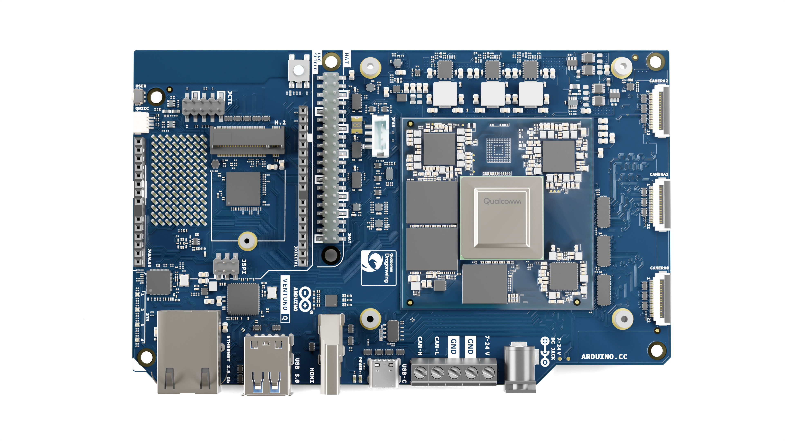

# 中文

# 描述

Arduino® VENTUNO™ Q 是一款专为新一代人工智能和机器人技术设计的高性能边缘 AI 计算机。通过将工业级计算与实时执行无缝融合，VENTUNO Q 为您提供部署复杂 AI 模型所需的处理能力，以及操控物理世界所需的精准控制，所有功能均集成于单一紧凑的边缘设备之中。

其核心采用革命性的“双脑”架构：强大的Qualcomm Dragonwing™ IQ8 (QCS8275) 微处理器 (MPU) 可提供高达 40 密集 TOPS 的 AI 计算能力，用于支持先进的计算机视觉和本地大型语言模型 (LLM)，并运行完整的 Ubuntu Linux 操作系统（也支持 Debian）；而运行基于 Zephyr OS 的 Arduino Core 的专用 STMicroelectronics STM32H5F5 微控制器 (MCU) 则确保了复杂电机控制和机器人技术所需的低延迟精度。

VENTUNO Q 助您保持连接并随时准备部署。它集成了 Wi-Fi® 6（三频）和 Bluetooth® 5.3 蓝牙模块连接功能，并配备了一套全面的内置连接器，包括高速 USB 3.0、HDMI、2.5 Gb 以太网以及用于可扩展 NVMe Gen 4 存储的 M.2 接口。 该开发板原生支持庞大的 Arduino UNO 扩展板和载板生态系统，还可通过 40 针排针连接 Raspberry Pi® HAT 扩展板，并通过 Qwiic 连接器连接 Arduino Modulino® 节点。

# 应用领域

边缘AI、本地LLM/VLM、智能家居、机器人、运动控制、智慧城市、工业视觉、教育与研究

# 目录

## 应用示例

VENTUNO Q 将支持 AI 的 Linux 处理器与实时微控制器相结合，兼具高级计算与确定性控制的优势。它专为希望利用 AI 直接塑造物理世界的创客和开发者而设计。

- **AI 助手与智能家居：** 构建离线语音助手、本地代理中心、免接触式交互亭以及实时语音翻译器。
- **机器人与运动控制：** 采用视觉 SLAM 技术的自主移动机器人（AMR）、视觉引导式机械臂，以及伴侣机器人和服务机器人。
- **智慧城市与工业视觉：** 边缘交通监测、装配线上的自动化质量检测、主动式现场安防以及基于视觉的库存监控。
- **教育与研究：** 高级 AI 学习套件、快速研究原型制作、语音编程助手以及移动操作研究平台。

## 功能

### VENTUNO Q 型号

VENTUNO Q 提供一种配置：

- **ABX00181**：16 GB LPDDR5 内存，64 GB eMMC 存储

### 基本规格概览

#### 处理器与内存

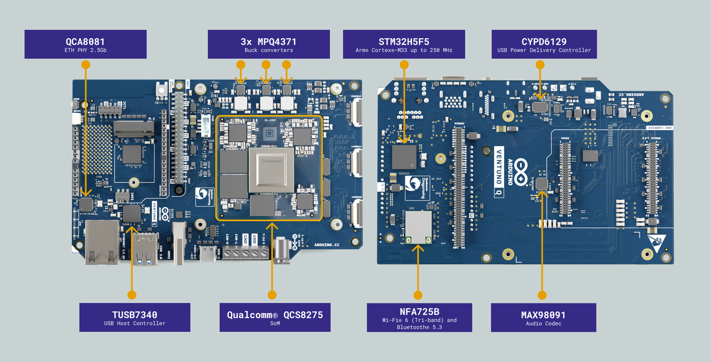

| **子系统** | **详细信息**                                                        |
| ------- | --------------------------------------------------------------- |
| 主 MPU   | Qualcomm Dragonwing™ IQ8 (QCS8275)                              |
|         | CPU：八核 Arm® Cortex®                                             |
|         | Adreno™ 623 GPU（3D 图形与 OpenCL）                                  |
|         | Adreno™ VPU 623 （视频处理）                                          |
|         | Hexagon™ Tensor AI 处理器（NPU）：最高 40 密集 TOPS                       |
|         | Qualcomm Spectra 692 ISP                                        |
|         | Ubuntu Linux 操作系统（也支持 Debian）                                   |
| 实时 MCU  | ST STM32H5F5 (MCU)，Arm® Cortex®-M33，最高 250 MHz                  |
|         | Zephyr 操作系统上的 Arduino Core                                      |
|         | 4 MB 闪存，1.5 MB RAM                                              |
| 系统内存    | 64 GB eMMC 用于操作系统/数据                                            |
|         | OSPI SAIL 内存 (MX25UW25345GXDI00-TR) 用于 MCU 启动/共享数据              |
|         | 用于 NVMe Gen 4 存储的 M.2 Key M 2230 接口（通过 SOM 直接连接 PCIe x4，不可用于启动） |
|         | 2×8 GB LPDDR5 RAM（总计 16 GB）                                     |

#### 连接与媒体

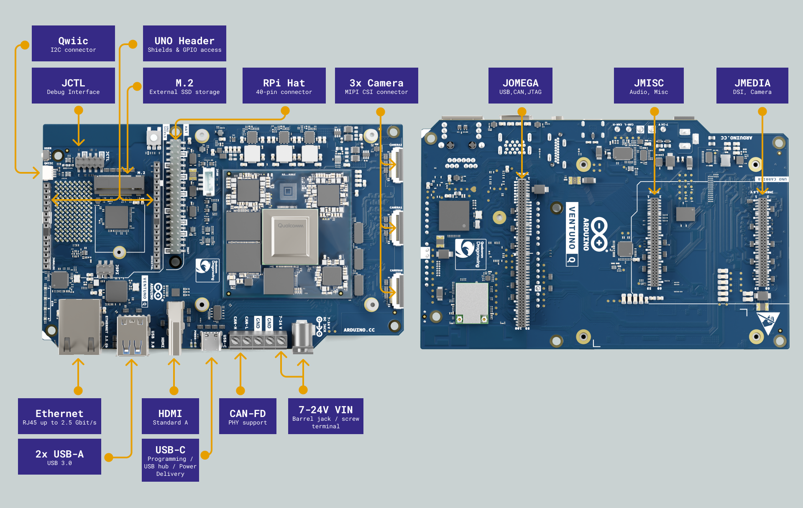

| **子系统** | **详细信息**                                                                                         |
| ------- | ------------------------------------------------------------------------------------------------ |
| 网络与无线   | Wi-Fi® 6 2.4/5/6 GHz（三频段），配备 2 个板载天线（NFA725B 模块）                                                 |
|         | Bluetooth® 5.3 蓝牙模块，配备板载天线                                                                       |
|         | 1 个 2.5 Gbit RJ45 以太网端口（QCA-8081 PHY）                                                            |
| USB 接口  | 1× USB-C 端口，支持主机/设备角色切换、供电角色切换及视频输出                                                              |
|         | 2x USB 3.0 Type A                                                                                |
|         | 2x USB 3.0（位于 JOMEGA 接头）                                                                         |
| 视频      | 1x HDMI 输出，通过板载 ADV7535 DSI 转 HDMI 桥接器实现。 HDMI 与 MIPI DSI 共享                                     |
|         | 相同的 DSI 线路，当 HDMI 处于活动状态时，JMEDIA 接头上的 MIPI DSI 会被多路复用切出                                          |
|         | 通过 USB-C 输出视频（DP 替代模式）                                                                           |
| 摄像头     | 板载 3 个 MIPI CSI 连接器（J3_1、J3_2、J3_3）                                                              |
|         | JMEDIA 接头处还提供 2 条 MIPI CSI 通道（与板载连接器复用）                                                          |
|         | 通过 USB Type-A 或 USB-C 支持 USB 摄像头                                                                 |
| 音频      | 音频编解码器：MAX98091ETM+T（Maxim）                                                                      |
|         | 在 JMISC 上： 1个单声道线路输出（LINE OUT）、1个单声道扬声器输出（SPEAKER OUT）、1个立体声耳机输出（HEADPHONES OUT）、1个麦克风输入（MIC IN） |
|         | 在JOMEGA上：1个麦克风输入（MIC IN）                                                                         |
| CAN接口   | 1个带PHY（ATA6563-GBQW1）的CAN-FD接口，位于螺丝端子上，由MCU (STM32H5F5)                                          |
|         | CAN-H 和 CAN-L 线路采用 TVS 保护（PJGBLC24C-AU_R1_000A1，双向，24 V，350 W）                                   |
|         | 螺丝端子上的 CAN 总线内置分立终端（2× 60.4 Ω + 100 nF）                                                          |
|         | JOMEGA 接头上的 3 个 CAN-FD 接口（无 PHY），通过 MCU 进行引脚复用                                                   |
|         | UNO Shield 接头（D4/D5）上的 1 个 CAN-FD 接口（无 PHY），通过 MCU 进行引脚复用                                        |

>📝 **注意：** 螺丝端子上的 CAN 总线包含板载分立终端电阻（2× 60.4 Ω + 100 nF）。如果该板卡并非位于总线末端，在设计网络拓扑时应考虑此终端电阻。

#### 扩展与排针

| **接口（连接器）**   | **详细信息**                                                                                  |
| ------------- | ----------------------------------------------------------------------------------------- |
| UNO Shield 排针 | - 兼容标准 Arduino UNO Shield（3.3 V 逻辑电平）                                                     |
|               | - 大多数数字引脚支持 5 V 电压。JANALOG 上的 A0 和 A1 为直接 ADC 输入，不支持 5 V 电压                               |
| 扩展排针（JOMEGA）  | - 丰富的扩展功能，包括 USB 3.0、CAN-FD、JTAG、MIC IN、MPU SPI                                           |
| 载板接头          | - JMEDIA：1.8 V 电压的 MIPI CSI0/CSI1 摄像头通道和 MIPI-DSI 显示通道                                    |
|               | - JMISC：音频端点、1.8 V 电压的 MPU GPIO 以及 3.3 V 电压的 MCU 信号                                       |
| Qwiic 连接器     | - I2C（3.3V）连接至MCU，可即时即插即用访问Modulino®节点                                                    |
| JHAT连接器       | - 兼容Raspberry Pi®的40针排针（MPU GPIO，通过TXS0108ERKSR和TXS0104ERUTR进行电平转换至3.3V以兼容HAT）            |
| JCTL（MPU远程调试） | - 用于MPU远程调试的10针（2×5）排针，兼容[Arduino Bughopper](https://docs.arduino.cc/hardware/bughopper/) |

## 额定值

### 输入电源

| **电源**            | **电压范围** | **最大电流** | **连接器**         |
| ----------------- | -------: | -------: | --------------- |
| USB-C PD          |   9-20 V |   最高 3 A | USB-C 接口        |
| 圆柱插头 (5.5×2.1 mm) |   7-24 V |   最高 5 A | 5.5×2.1 mm 圆柱插头 |
| 螺丝端子              |   7-24 V |  最高 10 A | 螺丝端子            |

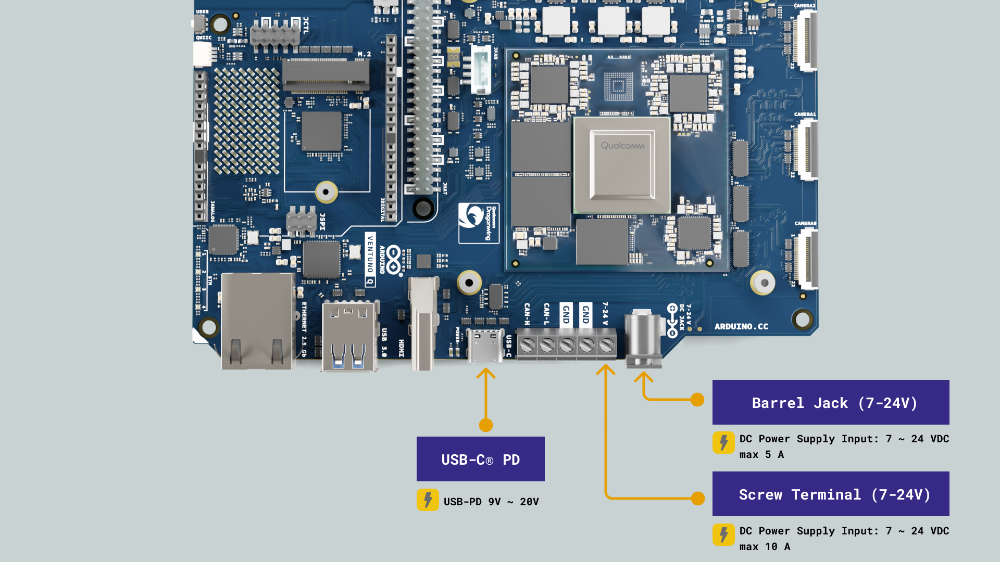

两条输入路径均采用 TVS 保护（SMBJ24CA，24 V 双向），并通过独立的电源开关（KTS1900GXAA-TA + SQS414CENW-T1_GE3）连接至电流检测级（INA232AIDDFR）。 两个多相降压转换器（MPQ4371GVE-1001-AECC901-Z）生成主 3.3 V 电源轨，而另一个降压转换器（MPQ4371GVE-1001-AECC901-Z）生成 5 V 电源轨。 USB-C® PD 控制器（CYPD6129-52LQXI）可与兼容的 USB-C® 电源协商最高 20 V 的电压配置文件。

> 📝 **关于直流输入电流和功耗预算的说明：** 桶形插孔的额定最大电流为 5 A。可用功耗预算取决于输入电压：在 7 V（5 A）时，最大可提供功率为 35 W；在 12 V 时为 60 W； 在 24 V 时为 120 W。在最坏情况下，当 MPU、NPU 和 GPU 同时以全性能运行时，仅 SoM 自身就可能消耗约 23-25 W。包括以太网 PHY、音频编解码器、USB 集线器及其他板载 IC 在内的整块电路板将消耗更多功率，因此在 7 V 时，达到连接器极限前的余量非常有限。
>
> 当以 7 V 为电路板供电时，请务必考虑线缆压降，因为电路板连接器处需要至少 7 V 的电压，电压低于 7 V 时无法启动。
>
> 两个 USB Type-A 端口每个最多可提供 5 V × 1.71 A = 8.55 W，合计最大额外功耗约为 17 W。 当板子满载且两个 USB-A 端口均处于最大负载时，总功耗可能接近 42 W，这将超过 7 V 直流插孔 35 W 的限制，并可能导致连接器损坏。
>
> 用于 UNO 扩展板、HAT 和 Qwiic 的 3.3 V 电源轨（`+3V3_LIMITED`）限流为 2.8 A（最大约 9.3 W）。 扩展板和 HAT 的 5 V 电源轨（`+5V_LIMITED`）同样限制在 2.8 A（最大约 14 W）。请注意，提供给 UNO 载板连接器和 JOMEGA 的 3.3 V 及 5 V 电源轨**不**受限流。
>
> **强烈建议使用 12 V 或 24 V 供电**，适用于同时涉及 AI 推理、USB 外设以及连接的扩展板或 HAT 的任何部署场景。
>
> 对于涉及 AI 推理、USB 外设或扩展应用的重负载场景，建议所有电源的额定功率均达到 **60 W 或更高**，以确保在可能出现的峰值功耗期间运行保持稳定。 使用**圆柱插头**（5.5×2.1 mm，最大 5 A）时，建议采用**12 V / 5 A 或 24 V / 3 A**的电源作为示例。

### 推荐工作条件

| **参数**         | **符号**           | **最小值** | **典型值** | **最大值** | **单位** |
| -------------- | ---------------- | :-----: | :-----: | :-----: | :----: |
| USB-C PD 输入    | VUSBC |    9    |    -    |  20.0   |   V    |
| 直流输入（插孔/螺丝）    | VIN   |   7.0   |    -    |  24.0   |   V    |
| 5.0 V 电源轨（输出）  | V+5V  |  4.75   |   5.0   |  5.25   |   V    |
| 3.3 V 电源轨 （输出） | V3P3  |  3.14   |   3.3   |  3.47   |   V    |
| 工作温度           | TOP   |   -10   |    -    |   60    |   °C   |

>📝 **注意：** 当连接到支持 PD 的电源时，USB-C® PD 控制器支持多种电压配置文件（9 V、15 V、20 V）。

### 板载电压轨

| **电压** | **电源轨**               | **来源/稳压器**                                                       |
| :----: | --------------------- | ---------------------------------------------------------------- |
| 7-24 V | VIN        | 插孔/螺丝端子输入（带 TVS 保护，SMBJ24CA）                                     |
| 5.0 V  | +5V                   | MPQ4371GVE 降压转换器                                                 |
| 3.3 V  | +3V3                  | 2个 MPQ4371GVE 降压转换器                                              |
| 1.8 V  | SOM_VREG_MDPX3_1P8    | SOM 主应用域 1.8 V 电源轨（用户可通过 JMISC、JCTL 访问）                          |
| 1.8 V  | SOM_VREG_S5S_SPX3_1P8 | 仅限 SOM 安全子系统 (RTSS) 域，不可用于一般用途                                   |
| 1.8 V  | +1V8                  | MPQ2179GQHE 降压转换器（用于板载 IC QCA8081、ADV7535、 MAX98091)             |
| 1.28 V | +1.28V                | MP20312GTF LDO（用于音频编解码器 MAX98091）                                |
| 1.1 V  | +1V1                  | MPQ2179GQHE 降压转换器 （用于板载 IC TUSB7340RKMR、QCA8081 和 PI7C9X2G304EV） |

>📝 **注意：** 该板卡配备三个独立的 1.8 V 电源轨。`SOM_VREG_MDPX3_1P8` 是 QCS8275 SoM 主应用域电源轨，也是所有用户可访问的 1.8 V 接口（包括 JMISC 和 JCTL）的推荐参考电压。 `SOM_VREG_S5S_SPX3_1P8` 是 SoM 安全子系统 (RTSS) 域电源轨，不应作为通用电源或参考电压使用。 `+1V8` 是由 MPQ2179GQHE 降压转换器生成的板级 1.8 V 电源轨，为 QCA-8081 以太网 PHY、ADV7535 显示桥和 MAX98091 音频编解码器供电。

>📝 **注意：** 除上述电源轨外，JMISC 第 59 引脚可接入最高 3.3 V 的 RTC 备用电池，用于在电路板断电时维持 SOM 和 MCU 的实时时钟。 `SOM_VCOIN`（SOM RTC）和 `VBAT`（MCU RTC）是两个 RTC 备用电池输入，它们在该单个引脚上物理上连接在一起，而非共用一条电源轨。每个输入均通过各自的 0 Ω 电阻连接到一个公共节点，该节点由一个参考地电位的双向 TVS 二极管（Vr = 5.5 V）提供保护。 预期电流消耗非常低，且该引脚不会提供用于维持电路板其余部分通电的电源。

### 典型功耗

以下测量结果基于 24.4°C 的环境温度，使用功率分析仪，针对 12 V 直流、24 V 直流和 20 V USB-C® PD 三种电源输入方式进行测试。Arduino App Lab 中提供了 MCU 上的“Blink”、MPU 上的“Hello World”、智能手机摄像头上的“Edge AI Assistant”和“Detect Objects”等内置示例。“智能镜”示例基于一份专门的应用说明。

#### 典型功耗 - 12 V 直流

| **场景**              | **平均功耗** | **最小功耗** | **最大功耗** |
| ------------------- | -------: | -------: | -------: |
| 启动                  |   7.07 W |        – |   17.9 W |
| MCU 闪烁              |   7.42 W |   5.30 W |   12.6 W |
| MPU 运行“Hello World” |   7.52 W |   5.32 W |   13.3 W |
| 边缘 AI 助手            |   13.5 W |   6.13 W |   24.6 W |
| 智能镜示例¹              |   14.7 W |   7.65 W |   33.0 W |
| 智能手机摄像头物体检测         |   9.63 W |   5.80 W |   21.2 W |

#### 典型功耗 - 24 V 直流

| **场景**             | **平均功耗** | **最小功耗** | **最大功耗** |
| ------------------ | -------: | -------: | -------: |
| 启动                 |   9.71 W |        – |   23.7 W |
| MCU 上的 Blink 程序    |   10.6 W |   7.04 W |   18.9 W |
| MPU 上的 Hello World |   10.8 W |   7.09 W |   18.3 W |
| 边缘AI助手             |   15.5 W |   7.44 W |   28.8 W |
| 智能镜子示例¹            |   17.3 W |   8.47 W |   36.6 W |
| 智能手机摄像头物体检测        |   11.5 W |   7.88 W |   24.7 W |

#### 典型功耗 - USB-C® PD (20 V)

| **场景**             | **平均功率** | **最小功率** | **最大功率** |
| ------------------ | -------: | -------: | -------: |
| 启动                 |   6.56 W |        – |   20.2 W |
| MCU 上闪烁            |   7.84 W |   6.33 W |   16.1 W |
| MPU 上“Hello World” |   9.68 W |   6.42 W |   16.1 W |
| 边缘AI助手             |   15.3 W |   6.61 W |   25.6 W |
| 智能镜子示例¹            |   15.1 W |   8.05 W |   34.2 W |
| 智能手机摄像头物体检测        |   11.3 W |   7.85 W |   23.1 W |

¹ 智能镜测试配置：连接了罗技 BRIO 4K USB 摄像头、USB 耳机（麦克风和扬声器）以及一台 HDMI 显示器。

>📝 **注：** 测量数据使用 Otii Ace Pro 功耗分析仪获取，仅供参考。所有场景和输入源中记录到的最高峰值功耗为 36.6 W（“智能镜”示例，24 V 直流电），符合上述 60 W 或更高电源的推荐要求。

## 功能概述

### 引脚布局

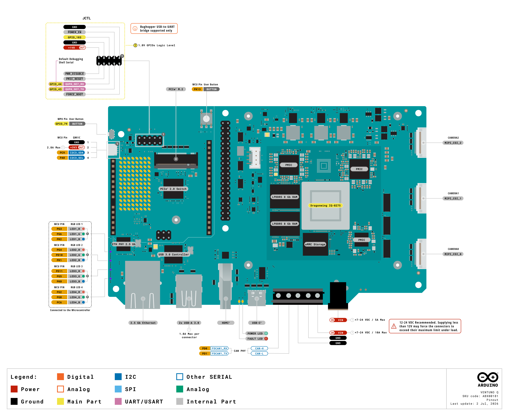

### 框图

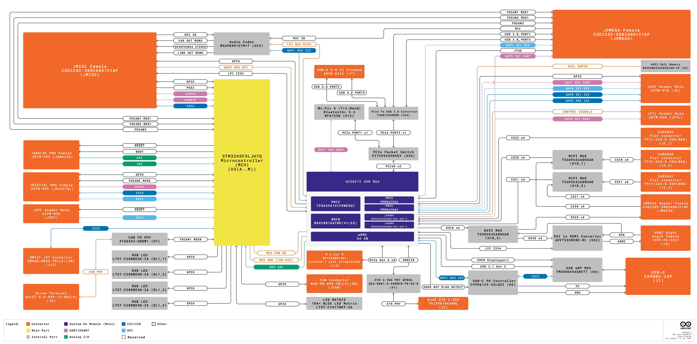

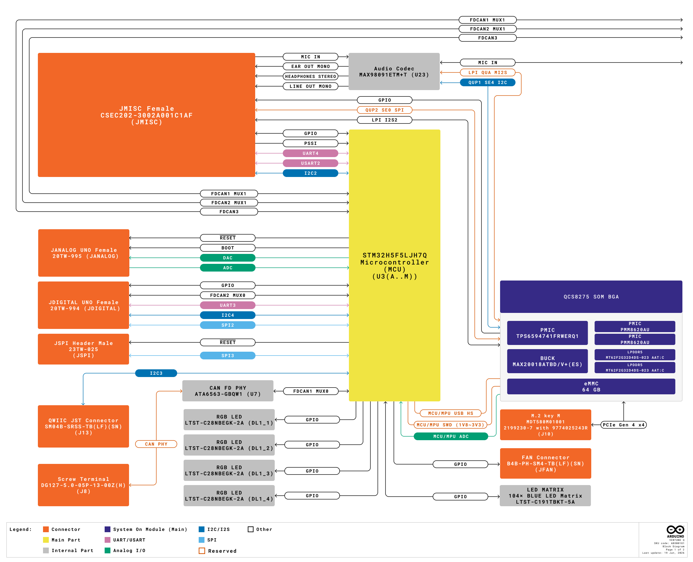

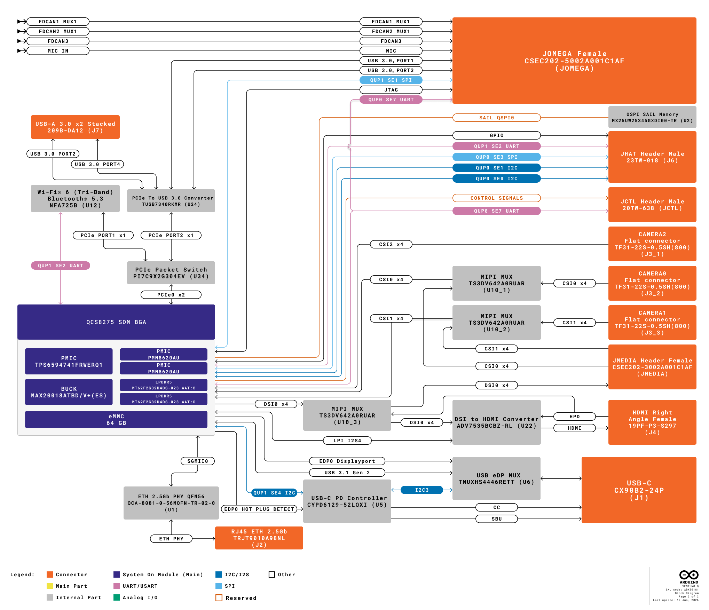

### 电源

VENTUNO Q 支持两条独立的电源输入路径：一个支持最高 20 V Power Delivery (PD) 协商的 USB-C® 端口，以及通过 5.5×2.1 mm 圆柱形插孔或螺丝端子输入的 7-24 V 直流电源。 这两条路径均由双向 24V TVS 提供保护，并在进入降压转换器之前，通过由独立、具有反极性保护和反向电流保护功能的电源开关（KTS1900 + 2x NMOS）组成的电源或门电路进行路由。

一个电流检测 IC（INA232AIDDFR）用于监测工作路径上的总输入电流。 两个多相降压转换器（MPQ4371GVE-1001-AECC901-Z）生成主 `+3V3` 电源轨，为 SOM（QCS8275）和电路板上的 3.3 V 外设供电。第三个 MPQ4371GVE 降压转换器生成 `+5V` 电源轨。

一个 MPQ2179GQHE 降压转换器生成 `+1V8` 电源轨，为 QCA-8081 以太网 PHY、ADV7535 显示桥和 MAX98091 音频编解码器供电。 一个 MPQ2179GQHE 降压转换器生成 `+1V1` 电源轨，为 TUSB7340RKMR、QCA-8081 以及 PI7C9X2G304EV PCIe 交换机供电。

该SOM通过其内部PMIC（`SOM_VREG_MDPX3_1P8`）提供`MDPX3_1P8`（1.8 V）主应用域电源轨，用户可通过JMISC和JCTL访问该电源轨。 独立的 `SOM_VREG_S5S_SPX3_1P8` 电源轨专用于实时安全子系统（RTSS）。该电源轨不应作为通用参考电压使用。一个 MP20312GTF LDO 为 MAX98091 音频编解码器生成 `+1.28V` 电源轨。

专用的 MP5077GG-Z 负载开关分别独立控制 M.2 NVMe 插槽、`+3V3_LIMITED` 电源轨（用于 UNO 扩展板、HAT 和 Qwiic）以及 `+5V_LIMITED` 电源轨（用于扩展板和 HAT）。 每个 USB Type-A 端口的 VBUS 电源轨均由 TUSB7340RKMR 启用并提供保护。所有其他外设负载开关均由 SOM 的 GPIO 控制使能线控制，从而允许 MPU 对未使用的子系统进行电源门控。

## 用户界面与指示灯

| **指示灯**     | **类型**                        | **控制器**                              | **备注**            |
| ----------- | ----------------------------- | ------------------------------------ | ----------------- |
| LED 矩阵      | 104 个蓝色 LED（LTST-C191TBKT-5A） | 通过 MCU 的 GPIO                        | 可编程显示矩阵           |
| 4 个 RGB LED | LTST-C28NBEGK-2A              | 通过 MCU 的 GPIO                        | 用户可寻址状态指示灯        |
| 电源 LED      | 绿色 (LTST-C190KGKT)            | 硬件 (+3V3 电源轨)                        | 指示 +3V3 电源轨处于激活状态 |
| 故障 LED      | 红色 (XHY-STB0603SR)            | USB-C® PD 控制器 (CYPD6129, GPIO9/P4.1) | 指示 PD 控制器检测到故障状态  |

- **4× RGB LED：** 四个三色LED，由STM32H5F5微控制器（MCU）通过12个独立的GPIO引脚（每个LED占用3个引脚）驱动。这些LED可由用户寻址，并可用于指示应用程序状态、连接状态或Arduino程序中的自定义事件。

| **标识符** | **RGB LED** | **红** | **绿** | **蓝** |
| ------- | ----------- | ----- | ----- | ----- |
| DL1_1   | RGB LED 1   | PG3   | PG6   | PK2   |
| DL1_2   | RGB LED 2   | PG4   | PD10  | PK1   |
| DL1_3   | RGB LED 3   | PD11  | PG5   | PK0   |
| DL1_4   | RGB LED 4   | PG2   | PG8   | PC6   |

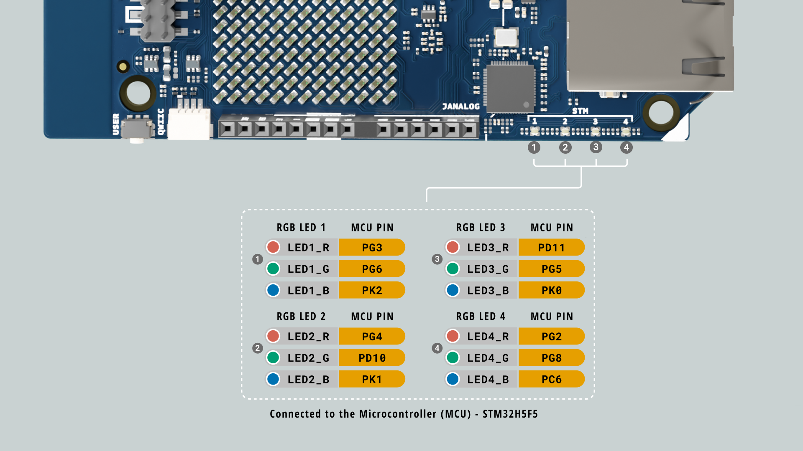

>📝 这些 RGB LED 采用低电平有效工作模式，当驱动至逻辑 `0` 时点亮。

- **LED 矩阵：** 由 STM32H5F5 MCU 驱动的 8×13 单色蓝色 LED 矩阵（104 个像素）。在 Linux 启动过程中，它会显示约 20-30 秒的启动动画。在启动完成前访问该矩阵可能会干扰 MCU 的运行。

>📝 **注意:** 启动动画仅在加载了 MCU 引导加载程序且正在运行有效程序时才会显示。如果未出现该动画，请参阅 [《VENTUNO Q 用户手册》](https://docs.arduino.cc/tutorials/ventuno-q/user-manual/) 以获取更多详细信息。

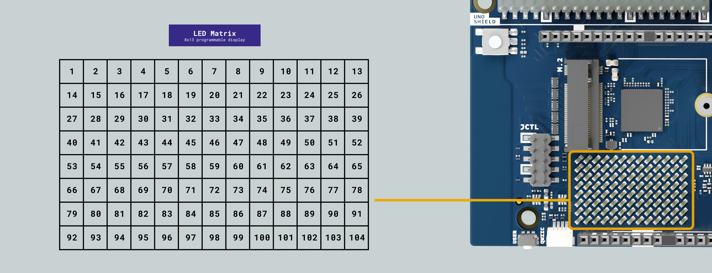

- **电源 LED：** 绿色指示灯（LTST-C190KGKT），连接至 `+3V3` 电源轨。只要电路板通电，该指示灯就会点亮。

- **故障指示灯：** 红色指示灯，由 USB-C® PD 控制器（CYPD6129，GPIO9/P4.1）驱动。当 PD 控制器检测到故障状况时，该指示灯将亮起。

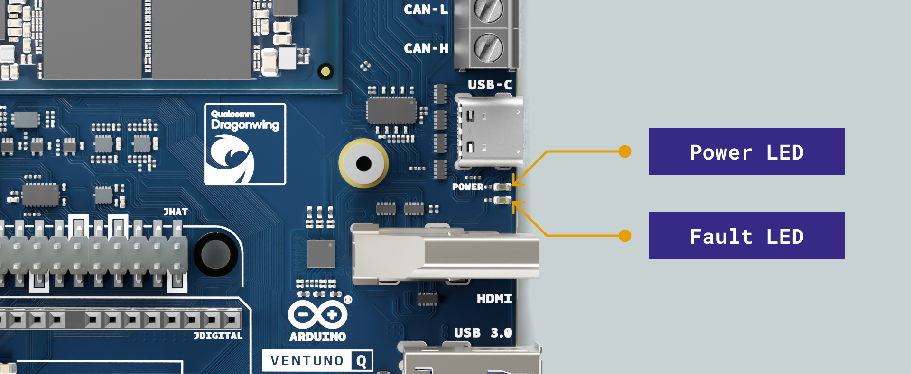

## MPU 与 MCU

MPU（微处理器单元）是一种高性能的应用处理器，旨在运行完整的操作系统和复杂的软件。MCU（微控制器单元）是一种小型、节能的控制器，专为实现快速、精确的I/O和控制时序而设计。VENTUNO Q将二者结合，在单块板上实现了操作系统级计算与响应迅速、时间关键型控制的协同工作，并通过“Bridge”（一种在双方均实现的RPC层）进行通信。

### 应用处理器 (MPU)

Qualcomm® Dragonwing™ IQ8（QCS8275）是一款八核 Arm® Cortex® 处理器，运行 Ubuntu Linux 操作系统（也支持 Debian）。其 I/O 工作电压为 1.8 V，可处理高速媒体接口和 AI 推理。

- 电压域：MPU（SoC）GPIO 和高速接口为 1.8 V。
- 驱动 JMEDIA：MIPI CSI 摄像头通道和 MIPI-DSI 显示通道。
- 驱动载板接头上的 1.8 V MPU GPIO 和音频端点（JMEDIA、JMISC）。
- USB-C：角色切换由 CYPD6129 PD 控制器管理，该控制器独立处理 PD 协商（支持高达 20 V 的配置文件）。
- 通过 USB-C 接口上的 USB eDP 多路复用器（TMUXHS4446RETT）实现 DisplayPort 输出。
- 运行 Hexagon™ NPU（最高 40 密集型 TOPS）和 Adreno™ 623 GPU，以处理边缘 AI 和图形工作负载。

### 实时微控制器 (MCU)

意法半导体® STM32H5F5 是一款基于 Arm® Cortex®-M33 架构的微控制器，运行基于 Zephyr OS 的 Arduino Core，主频为 250 MHz。它为机器人、电机控制和通用 I/O 提供快速、确定性的时序控制。

- 电压域：3.3 V，用于 GPIO 和模拟接口。
- 管理 ADC、PWM、LED 矩阵、RGB LED 和定时器。
- 处理 3.3 V 接头：JDIGITAL、JANALOG 和 JSPI。
- 控制所有 CAN-FD 接口：螺丝端子上的 PHY 以及 JOMEGA 和 UNO Shield 接头上的无 PHY 端口。

JMISC同时处理两个电压域：1.8 V MPU线路与3.3 V MCU信号（PSSI、I²C、GPIO）以及模拟音频并存。将载板或外部逻辑连接至JMISC时，务必核对电压电平。

>📝 **关于 VDDIO2 的说明：** STM32H5F5 具有一个由 `SOM_VREG_MDPX3_1P8`（1.8 V）供电的辅助 I/O 电源域（VDDIO2）。这使得特定的 MCU 引脚能够以 1.8 V 电压直接与 MPU 通信，而无需外部电平转换器。 以下接口在 VDDIO2 域中工作：
>
>- **MCU I2C1** 用于 MCU 与 MPU 之间的直接通信
>- **MCU GPIO 引脚 PG9、PG10、PG11、PG12、PG13 和 PG14** 以 1.8 V 电压直接与 MPU 通信
>
> 请勿向这些引脚施加 3.3 V 逻辑电平。 所有其他 MCU GPIO 信号均在标准 VDDIO 域上以 3.3 V 工作。

>⚠️ **电压电平警告：** MPU 的 GPIO 信号工作电压为 1.8 V，而 MCU 的 GPIO 信号工作电压为 3.3 V。请确保连接到扩展接头的任何外部设备均与相应处理器域的电压电平兼容，以防止硬件损坏。

## 处理器间通信

Qualcomm® Dragonwing™ IQ8 (QCS8275)（MPU）和 STM32H5F5（MCU）通过 Arduino Bridge 进行通信，这是一个在 Linux 和 MCU 两端均实现的基于软件的远程过程调用（RPC）层。 Bridge 提供了一个面向服务的 API，允许任一处理器向另一处理器暴露可调用的服务，同时支持异步事件的单向通知。它管理处理器之间的消息路由，并支持多种物理传输协议。

通过其 API，Bridge 实现了类型安全的函数调用，使微控制器程序能够调用 Linux 服务，并接收结构化响应或通过通知推送数据。

两个处理器之间的物理传输层包括以下接口：

| **接口**  | **方向**         | **用途**                   |
| ------- | -------------- | ------------------------ |
| USB 2.0 | SoC -> MCU（主机） | 高带宽数据传输                  |
| SWD     | SoC -> MCU     | 调试接口（1.8 V 至 3.3 V 电平转换） |

如果载板或外部逻辑需要硬件指示灯，固件可将 JMISC 上的 1.8 V MPU GPIO 或可用的 JCTL GPIO 专门用作就绪或唤醒输出。该信号可通过电平兼容电路（例如电平转换器或带上拉电阻的开漏配置）在 MCU GPIO 上接收。

>📝 MPU GPIO 信号在应用处理器的低电压域（1.8 V）中工作。请确保与微控制器的任何连接都与其 I/O 电压轨（3.3 V）电平兼容。例如，使用电平转换器，或采用带上拉电阻的开漏配置连接至微控制器的 I/O 电压轨。

## 硬件加速

VENTUNO Q 通过集成的 Hexagon™ Tensor AI 处理器 (NPU)、Adreno™ 623 GPU 和 Adreno™ VPU 623，为边缘 AI、3D 图形以及视频编解码提供硬件加速。

### AI 加速（NPU）

板载的 Hexagon™ Tensor AI 处理器可提供高达 40 密集型 TOPS（每秒万亿次运算）的神经网络计算能力。这使得 VENTUNO Q 能够离线运行本地 LLM（大型语言模型）、VLM（视觉语言模型）以及复杂的计算机视觉处理流程。

该 NPU 与 Qualcomm AI 技术栈集成，并在 Arduino App Lab 中获得原生支持。开发者可以部署通过 **TensorFlow Lite、ONNX Runtime 和 PyTorch** 优化过的模型。VENTUNO Q 还支持与 **Edge Impulse Studio** 直接集成，无需编写冗余代码即可快速训练和部署自定义边缘 AI 模型。

| **组件** | **规格**                                                |
| ------ | ----------------------------------------------------- |
| 处理器    | Hexagon™ Tensor AI 处理器                                |
| 峰值性能   | 高达 40 密集 TOPS                                         |
| 架构     | Hexagon DSP + 四核 HVX + 双 HMX 协处理器                     |
| 支持的框架  | TensorFlow Lite、ONNX Runtime、PyTorch                  |
| 集成     | Qualcomm AI Stack、Arduino App Lab、Edge Impulse Studio |

### 图形加速（GPU）

Adreno™ 623 GPU 在 QCS8275 SoM 上提供硬件加速的 3D 图形处理和通用计算 (GPGPU) 功能。在 Qualcomm Linux 系统上，GPU 加速通过 Qualcomm 专有的 Adreno 驱动程序栈，借助 KGSL 内核驱动程序实现。

有关完整的 GPU 硬件规格，请参阅 [QCS8275 数据手册 (80-73475-1)](https://docs.qualcomm.com/doc/80-73475-1/topic/device-description.html) 以及 [Qualcomm Linux 图形指南](https://docs.qualcomm.com/doc/80-70018-19/topic/)。

>📝 **注意：** Adreno 驱动程序库和固件文件位于设备上的 `/lib/firmware/` 目录中。 QCS8275 文档中列出的并非所有 GPU 功能都可在 VENTUNO Q 随附的软件中使用。有关当前支持的功能列表，请参阅 [VENTUNO Q 文档](https://docs.arduino.cc/hardware/ventuno-q/)。

### 视频加速 (VPU)

Adreno™ VPU 623 在 QCS8275 SoM 上提供硬件加速的视频处理功能。支持的编解码器、分辨率及集成细节取决于随主板分发的软件栈。 完整的硬件规格请参阅 [QCS8275 数据手册 (80-73475-1)](https://docs.qualcomm.com/doc/80-73475-1/topic/device-description.html)。

>📝 **注意：** VENTUNO Q 随附的软件可能并不包含 QCS8275 文档中列出的所有编解码器或框架。有关当前支持的功能列表，请参阅 [VENTUNO Q 文档](https://docs.arduino.cc/hardware/ventuno-q/)。

>📝 **注意：** VENTUNO Q 随附的 Ubuntu 镜像中默认未包含 Qualcomm 专用的 GStreamer 插件（`gstreamer1.0-plugins-qcom`）。当需要硬件加速的摄像头捕获或视频处理管道时，可手动安装这些插件。 有关设置的详细信息，请参阅 [VENTUNO Q 用户手册](https://docs.arduino.cc/tutorials/ventuno-q/user-manual/)。

## 外设与接口

VENTUNO Q 通过一套全面的接口和连接器展现其双核架构。由 MCU 驱动的接口工作在 **3.3 V** 逻辑电平，而由 MPU 驱动的接口工作在 **1.8 V**。在连接外部外设之前，请务必核实任何接口的电压域，以防止硬件损坏。

### JANALOG

JANALOG 接口提供模拟输入、电源轨和 MCU 控制信号。它与标准 Arduino UNO 模拟接口布局兼容。模拟输入以 3.3 V 电源轨上的 `VREF+` 为基准，且电压不应超过 `VDD + 0.3 V`（约 3.6 V）。 **请勿向模拟引脚施加 5 V 电压**。`IOREF` 是一个 3.3 V 参考输出，因此请勿通过它反向供电。

| **引脚** | **名称**  | **网络**                | **域**     | **MCU 引脚** | **备注**             |
| -----: | ------- | --------------------- | --------- | ---------- | ------------------ |
|      1 | NC      | JANALOG_BOOT_MCU_3V3  | 3.3 V MCU | BOOT0      | MCU 引导链路           |
|      2 | IOREF   | +3V3_LIMITED          | 电源        | -          | I/O 电压基准输出         |
|      3 | RESET   | JANALOG_RESET_MCU_3V3 | 3.3 V MCU | NRST       | MCU 复位             |
|      4 | +3V3 输出 | +3V3_LIMITED          | 电源        | -          | 3.3 V 电源输出         |
|      5 | +5V USB | +5V_LIMITED           | 电源        | -          | 5 V 电源输出（USB限压）    |
|      6 | GND     | GND                   | 电源        | -          | 地                  |
|      7 | GND     | GND                   | 电源        | -          | 地                  |
|      8 | VIN     | 7-24V                 | 电源        | -          | 直流输入（仅供电）          |
|      9 | A0      | JANALOG_A0_MCU_3V3    | 模拟        | PA4        | ADC输入，不耐受5 V       |
|     10 | A1      | JANALOG_A1_MCU_3V3    | 模拟        | PA5        | ADC输入， 不耐受5 V      |
|     11 | A2      | JANALOG_A2_MCU_3V3    | 模拟        | PE12       | ADC输入 / SPI4_SCK   |
|     12 | A3      | JANALOG_A3_MCU_3V3    | 模拟        | PE13       | ADC输入 / SPI4_MISO  |
|     13 | A4      | JANALOG_A4_MCU_3V3    | 模拟        | PE14       | ADC 输入 / SPI4_MOSI |
|     14 | A5      | JANALOG_A5_MCU_3V3    | 模拟        | PE15       | ADC 输入             |

>📝 **注意：** A0 和 A1 是 MCU 的直接 ADC 输入，不支持 5 V 耐压。有效输入范围为 0 V 至 `VREF+`（约 3.3 V）。 第 8 引脚上的 VIN 仅为电源输入，不应作为通用输入输出（GPIO）使用。VIN 引脚由 1.1 A PTC 保险丝保护，在 24 V 时功率限制约为 26 W。不建议在满载情况下通过此引脚为主板供电。该引脚更适合用于提取电源以供扩展板或外设使用，而非作为主板的主电源。

>📝 **注意：** A4（PE14）和 A5（PE15）仅为模拟和 SPI 功能引脚，不具备硬件 I2C 外设。需要通过 A4 和 A5 进行 I2C 通信的扩展板，必须使用软件 I2C（位操作）。 硬件 I2C 功能可通过 JDIGITAL 引脚 17（SDA，PH12）和 18（SCL，PH11）实现。

### JDIGITAL

JDIGITAL 接头提供由 MCU 以 3.3 V 逻辑电平驱动的数字 I/O、UART、SPI、I2C 和 PWM 信号。它与标准 Arduino UNO 数字接头布局兼容。

| **引脚** | **名称**     | **净线**                | **域**     | **MCU 引脚** | **备注**                 |
| -----: | ---------- | --------------------- | --------- | ---------- | ---------------------- |
|      1 | D0 / RX    | JDIGITAL_MCU_UART_3V3 | 3.3 V MCU | PB11       | UART RX                |
|      2 | D1 / TX    | JDIGITAL_MCU_UART_3V3 | 3.3 V MCU | PB10       | UART TX                |
|      3 | D2         | JDIGITAL_D2_MCU_3V3   | 3.3 V MCU | PB0        | GPIO                   |
|      4 | D3         | JDIGITAL_D3_MCU_3V3   | 3.3 V MCU | PB1        | GPIO / PWM             |
|      5 | D4         | JDIGITAL_D4_MCU_3V3   | 3.3 V MCU | PB6        | GPIO / FDCAN2_TX       |
|      6 | D5         | JDIGITAL_D5_MCU_3V3   | 3.3 V MCU | PB5        | GPIO / PWM / FDCAN2_RX |
|      7 | D6         | JDIGITAL_D6_MCU_3V3   | 3.3 V MCU | PB2        | GPIO / PWM             |
|      8 | D7         | JDIGITAL_D7_MCU_3V3   | 3.3 V MCU | PB3        | GPIO                   |
|      9 | D8         | JDIGITAL_D8_MCU_3V3   | 3.3 V MCU | PB4        | GPIO                   |
|     10 | D9         | JDIGITAL_D9_MCU_3V3   | 3.3 V MCU | PB7        | GPIO / PWM             |
|     11 | D10 / CS   | JDIGITAL_MCU_SPI_3V3  | 3.3 V MCU | PB12       | SPI 芯片选择               |
|     12 | D11 / MOSI | JDIGITAL_MCU_SPI_3V3  | 3.3 V MCU | PB15       | SPI MOSI / PWM         |
|     13 | D12 / MISO | JDIGITAL_MCU_SPI_3V3  | 3.3 V MCU | PB14       | SPI MISO               |
|     14 | D13 / SCK  | JDIGITAL_MCU_SPI_3V3  | 3.3 V MCU | PB13       | SPI 时钟                 |
|     15 | GND        | GND                   | 电源        | -          | 接地                     |
|     16 | AREF       | JDIGITAL_AREF_MCU_3V3 | 模拟        | -          | 模拟电压基准                 |
|     17 | SDA        | JDIGITAL_MCU_I2C_3V3  | 3.3 V MCU | PH12       | I2C 数据 (I2C4 / I3C1)   |
|     18 | SCL        | JDIGITAL_MCU_I2C_3V3  | 3.3 V MCU | PH11       | I2C时钟 (I2C4 / I3C1)    |

>📝 **注意：** 所有 JDIGITAL 线路均为 3.3 V MCU 逻辑电平。在数字模式下，大多数引脚作为输入时可耐受 5 V 电压。AREF 是 MCU ADC 的模拟电压参考输入。该信号通过板载模拟开关（U28，SGM3157YC6/TR）传输，仅当 MCU 引脚 PI8 设置为 HIGH 时才有效。

### JSPI

JSPI 接口提供了一条专用的 SPI 总线，用于连接 SD 卡读卡器、显示驱动器或传感器等外设。它还提供 RESET 和电源。所有信号均属于 3.3 V MCU 域。

| **引脚** | **名称** | **网络**           | **电压域**   | **MCU 引脚** | **备注**   |
| -----: | ------ | ---------------- | --------- | ---------- | -------- |
|      1 | MISO   | JSPI_MCU_SPI_3V3 | 3.3 V MCU | PF14       | SPI MISO |
|      2 | +5V    | +5V_LIMITED      | 电源        | -          | 5 V 电源输出 |
|      3 | SCK    | JSPI_MCU_SPI_3V3 | 3.3 V MCU | PC10       | SPI 时钟   |
|      4 | MOSI   | JSPI_MCU_SPI_3V3 | 3.3 V MCU | PC12       | SPI MOSI |
|      5 | RESET  | MCU_NRST         | 3.3 V MCU | NRST       | MCU 复位   |
|      6 | GND    | GND              | 电源        | -          | 地        |

>⚠️ **关于电源保护的说明：** JSPI 和 UNO Shield 接头上的 3.3 V 和 5 V 电源轨均由专用负载开关（MP5077GG-Z）进行保护，每个开关的限流值为 **2.8 A**。这些开关可防止连接的外设汲取过大电流，并保护电路板免受反向供电的影响。请勿尝试绕过或禁用这些开关。

### Qwiic

Qwiic 连接器提供 3.3 V I2C 总线，可与 Modulino® 节点及兼容的第三方传感器实现即插即用连接，无需焊接。该连接器具有极性，仅支持一种连接方向。

| **引脚** | **名称** | **网络**       | **域**     | **MCU 引脚** | **备注**       |
| -----: | ------ | ------------ | --------- | ---------- | ------------ |
|      1 | GND    | GND          | 电源        | -          | 接地           |
|      2 | VCC    | +3V3_LIMITED | 电源        | -          | 设备用 3.3 V 电源 |
|      3 | SDA    | I2C3_SDA     | 3.3 V MCU | PC9        | I2C 数据       |
|      4 | SCL    | I2C3_SCL     | 3.3 V MCU | PA8        | I2C 时钟       |

>📝 **注意：** Qwiic 连接器支持链式扩展，多个模块可串联连接在同一条 I2C 总线上。I2C 总线连接至 MCU。

### JCTL（MPU远程调试）

JCTL 接头是一个 10 针（2×5）连接器，提供 MPU UART 控制台访问、引导覆盖控制和电源管理信号。Arduino Bughopper 是与该接头进行接口连接的推荐工具。大多数有效信号引脚均通过 TVS 二极管进行了 ESD 保护（第 10 引脚除外）。 信号引脚在 1.8 V、3.3 V 和 7-24 V 的混合电压域中工作，请参阅下方的引脚表。第 9 引脚直接暴露 `SOM_VREG_MDPX3_1P8` 电源轨；请勿向该引脚施加任何外部电压。

| **引脚** | **名称**                 | **网络**             | **电压域**        | **MPU 引脚** | **备注**                                                                                         |
| -----: | ---------------------- | ------------------ | -------------- | ---------- | ---------------------------------------------------------------------------------------------- |
|      1 | GND                    | GND                | 电源             | -          | 接地                                                                                             |
|      2 | FORCED_USB_BOOT_N      | FORCE_BOOT_3V3     | 3.3 V          | -          | 3.3 V 域。 控制两个驱动 MD_FORCE_USB_BOOT_1V8 和 RTSS_FORCE_USB_BOOT_1V8 的 NMOS 管。拉低该引脚可在下次重启时进入 EDL 模式 |
|      3 | PMIC_POWER_EN          | PMIC_POWER_EN      | 1.8 V MPU      | -          | PMIC 电源使能                                                                                      |
|      4 | TX                     | UART_DBG_1V8       | 1.8 V MPU      | GPIO_43    | MPU 调试 UART 发送                                                                                 |
|      5 | GPIO                   | MD_GPIO_103        | 1.8 V MPU      | GPIO_103   | 通用 GPIO                                                                                        |
|      6 | RX                     | UART_DBG_1V8       | 1.8 V MPU      | GPIO_44    | MPU 调试 UART 接收                                                                                 |
|      7 | GND                    | GND                | 电源             | -          | 地                                                                                              |
|      8 | RESIN_N                | RESIN_N            | 3.3 V          | -          | 开漏输出，带 TVS 保护。拉低可进行热重启（电压轨保持导通）                                                                |
|      9 | +1V8 OUT               | SOM_VREG_MDPX3_1P8 | 电源             | -          | MDPX3 域 1.8 V 直接供电，请勿施加外部电压                                                                    |
|     10 | POWER_SWITCH_DISABLE_N | PWR_DISABLE        | 7-24 V（最大 5 V） | -          | 无 TVS 保护。拉低电平以进行热重启（控制主电源）                                                                     |

> ⚠️ **在将任何设备连接至 JCTL 之前请务必阅读**
>
> 第 9 引脚直接暴露 `SOM_VREG_MDPX3_1P8`（约 1.8 V），请勿向该引脚施加任何外部电压。 引脚在混合电压域中工作：引脚 2 和 8 属于 3.3 V 域，引脚 4 和 6（UART）属于 1.8 V 域， 第 10 引脚是主 VIN 电源开关的使能输入，其内部分压器允许直接连接至 VIN；将电压拉低至 0.85 V 以下可禁用主电源，保持在 1 V 以上可正常工作，且外部电压不得超过 5 V。 第 10 引脚未配备 TVS 保护。向任何处于活动状态的 JCTL 引脚施加错误电压可能会永久损坏 QCS8275 SoM。
>
> **强烈建议使用 Arduino Bughopper** 进行大多数调试场景，因为它包含专门为安全连接 JCTL 而设计的电平转换器和开漏兼容输出级。
>
> 如果您选择使用其他 USB 转 UART 适配器或自定义调试硬件，请确保所有信号线均以各自电压域的正确电压驱动，第 10 引脚的电压绝不超过 5 V，且不存在通向 `SOM_VREG_MDPX3_1P8` 电源轨的反向供电路径。

> 📝 **启动控制摘要：**
> - **热重启**（仅限 MPU，电压轨保持激活）：通过开漏将第 8 引脚（RESIN_N）拉低。
> - **冷重启**（完整电源循环，主电源被切断）： 通过开漏方式将第 10 引脚 (POWER_SWITCH_DISABLE_N) 拉低。
> - **EDL / 紧急下载模式**：通过开漏方式将第 2 引脚 (FORCED_USB_BOOT_N) 拉低，然后通过第 8 引脚或第 10 引脚触发重启。
>
> 此连接器专用于开发和调试。

### JHAT

JHAT 接头是一个符合 Raspberry Pi® 标准的 40 针接头，由 MPU（QCS8275）以 **3.3 V** 逻辑电平驱动。它提供了来自 MPU 的 I2C、SPI、UART、I2S 以及通用 GPIO 信号。电源引脚为连接的 HAT 模块提供 3.3 V 和 5 V 电压。

所有 GPIO 信号均通过板载的四个双向电平转换器（三个 8 通道 TXS0108ERKSR 器件（U33_2、U33_3、 U33_4）以及一个 4 通道 TXS0104ERUTR 器件（U21），从而无需额外的电平转换即可与标准 Raspberry Pi® HAT 设计直接兼容。

| **引脚** | **名称**         | **MPU 引脚**  | **替代功能**          | **域**     | **备注**            |
| -----: | -------------- | ----------- | ----------------- | --------- | ----------------- |
|      1 | +3V3 输出        | -           | -                 | 电源        | 3.3 V 供电输出        |
|      2 | +5V 输出         | -           | -                 | 电源        | 5 V 供电输出          |
|      3 | GPIO 2 (SDA)   | MD_GPIO_17  | QUP0_SE0_I2C_SDA  | 3.3 V MPU | I2C1 数据           |
|      4 | +5V 输出         | -           | -                 | 电源        | 5 V 供电输出          |
|      5 | GPIO 3 (SCL)   | MD_GPIO_18  | QUP0_SE0_I2C_SCL  | 3.3 V MPU | I2C1 时钟           |
|      6 | GND            | -           | -                 | 电源        | 地                 |
|      7 | GPIO 4         | MD_GPIO_83  | GPCLK0            | 3.3 V MPU | 通用 GPIO           |
|      8 | GPIO 14 (TX)   | MD_GPIO_86  | QUP1_SE2_UART_TX  | 3.3 V MPU | UART0 TX          |
|      9 | GND            | -           | -                 | 电源        | 地                 |
|     10 | GPIO 15 (RX)   | MD_GPIO_87  | QUP1_SE2_UART_RX  | 3.3 V MPU | UART0 RX          |
|     11 | GPIO 17        | MD_GPIO_85  | QUP1_SE2_UART_RFR | 3.3 V MPU | UART RFR/RTS      |
|     12 | GPIO 18 (CLK)  | MD_GPIO_116 | LPI_I2S1_SCK      | 3.3 V MPU | PCM 时钟            |
|     13 | GPIO 27        | MD_GPIO_109 | GPIO              | 3.3 V MPU | 通用 GPIO           |
|     14 | GND            | -           | -                 | 电源        | 地                 |
|     15 | GPIO 22        | MD_GPIO_90  | GPIO              | 3.3 V MPU | 通用 GPIO           |
|     16 | GPIO 23        | MD_GPIO_105 | GPIO              | 3.3 V MPU | 通用 GPIO           |
|     17 | +3V3 输出        | -           | -                 | 电源        | 3.3 V 供电输出        |
|     18 | GPIO 24        | MD_GPIO_106 | GPIO              | 3.3 V MPU | 通用 GPIO           |
|     19 | GPIO 10 (MOSI) | MD_GPIO_26  | QUP0_SE3_SPI_MOSI | 3.3 V MPU | SPI0 MOSI         |
|     20 | GND            | -           | -                 | 电源        | 接地                |
|     21 | GPIO 9 (MISO)  | MD_GPIO_25  | QUP0_SE3_SPI_MISO | 3.3 V MPU | SPI0 MISO         |
|     22 | GPIO 25        | MD_GPIO_107 | GPIO              | 3.3 V MPU | 通用 GPIO           |
|     23 | GPIO 11 (SCLK) | MD_GPIO_27  | QUP0_SE3_SPI_SCK  | 3.3 V MPU | SPI0 时钟           |
|     24 | GPIO 8 (CE0)   | MD_GPIO_28  | QUP0_SE3_SPI_CS   | 3.3 V MPU | SPI0 CE0          |
|     25 | GND            | -           | -                 | 电源        | 地                 |
|     26 | GPIO 7 (CE1)   | MD_GPIO_88  | GPIO              | 3.3 V MPU | SPI0 CE1          |
|     27 | GPIO 0 (SDA)   | MD_GPIO_19  | QUP0_SE1_I2C_SDA  | 3.3 V MPU | I2C0 / EEPROM SDA |
|     28 | GPIO 1 (SCL)   | MD_GPIO_20  | QUP0_SE1_I2C_SCL  | 3.3 V MPU | I2C0 / EEPROM SCL |
|     29 | GPIO 5         | MD_GPIO_89  | GPIO              | 3.3 V MPU | 通用 GPIO           |
|     30 | GND            | -           | -                 | 电源        | 地                 |
|     31 | GPIO 6         | MD_GPIO_80  | GPIO              | 3.3 V MPU | 通用 GPIO           |
|     32 | GPIO 12 (PWM0) | MD_GPIO_77  | GPIO              | 3.3 V MPU | 通用 GPIO           |
|     33 | GPIO 13 (PWM1) | MD_GPIO_81  | GPIO              | 3.3 V MPU | 通用 GPIO           |
|     34 | GND            | -           | -                 | 电源        | 地                 |
|     35 | GPIO 19 (FS)   | MD_GPIO_117 | LPI_I2S1_WS       | 3.3 V MPU | PCM 帧同步           |
|     36 | GPIO 16        | MD_GPIO_84  | QUP1_SE2_UART_CTS | 3.3 V MPU | UART CTS          |
|     37 | GPIO 26        | MD_GPIO_108 | GPIO              | 3.3 V MPU | 通用 GPIO           |
|     38 | GPIO 20 (DIN)  | MD_GPIO_118 | LPI_I2S1_DATA0    | 3.3 V MPU | PCM 数据输入          |
|     39 | GND            | -           | -                 | 电源        | 接地                |
|     40 | GPIO 21 (DOUT) | MD_GPIO_119 | LPI_I2S1_DATA1    | 3.3 V MPU | PCM 数据输出          |

>📝 **注意：** 尽管 MPU 的 GPIO 信号内部为 1.8 V，但板载的 TXS0108ERKSR 和 TXS0104ERUTR 电平转换器会将其以 3.3 V 的电平输出至 JHAT 连接器，因此可与标准 Raspberry Pi® HAT 逻辑电平直接兼容。 请勿向任何 JHAT 信号引脚施加高于 3.3 V 的电压。电源引脚（3.3 V 和 5 V）是电路板的输出端，请勿通过这些引脚从连接的 HAT 向电路板反向供电。

>📝 **注意：**JHAT 的 UART 引脚 8、10、11 和 36（TX、RX、RFR 和 CTS）与板载 Wi-Fi®/Bluetooth® LE 蓝牙模块共用同一个 QUP1_SE2 UART。 TX、RX 和 RFR 通过 U33_4（TXS0108ERKSR）进行电平转换，而 CTS 则与 GPIO 26、GPIO 20（I2S_DATA0）和 GPIO 21 （I2S_DATA1）的电平转换，分别连接至引脚 37、38 和 40。只要 Bluetooth蓝牙模块处于活动状态，这些引脚就无法用于外部 HAT。

### JMISC

JMISC 接头是一个 60 针高密度连接器，集成了 MCU PSSI 并行摄像头总线、MCU GPIO、MCU I2C、音频（麦克风、耳机、单声道扬声器输出、线路输出）、MPU SoC SPI、MPU GPIO 和 MPU I2S 信号。 这是一个混合电压接头：**MCU 信号为 3.3 V**，**MPU 信号为 1.8 V**，而音频/麦克风引脚为模拟信号。

| **引脚** | **名称**             | **域**     | **MCU 引脚** | **MPU 引脚** | **备注**               |
| -----: | ------------------ | --------- | ---------- | ---------- | -------------------- |
|      1 | MCU_PSSI_D0        | 3.3 V MCU | PA9        | -          | PSSI 数据位 0           |
|      2 | MCU_TRACE_CLK      | 3.3 V MCU | PE2        | -          | MCU 跟踪时钟             |
|      3 | MCU_PSSI_D1        | 3.3 V MCU | PC7        | -          | PSSI 数据位 1           |
|      4 | MCU_TRACE_D0       | 3.3 V MCU | PE3        | -          | MCU 跟踪数据 0           |
|      5 | MCU_PSSI_D2        | 3.3 V MCU | PC8        | -          | PSSI 数据位 2           |
|      6 | MCU_TRACE_D1       | 3.3 V MCU | PE4        | -          | MCU 跟踪数据 1           |
|      7 | MCU_PSSI_D3        | 3.3 V MCU | PE1        | -          | PSSI 数据位 3           |
|      8 | MCU_TRACE_D2       | 3.3 V MCU | PE5        | -          | MCU 跟踪数据 2           |
|      9 | MCU_PSSI_D4        | 3.3 V MCU | PC11       | -          | PSSI 数据位 4           |
|     10 | MCU_TRACE_D3       | 3.3 V MCU | PE6        | -          | MCU 跟踪数据 3           |
|     11 | MCU_PSSI_D5        | 3.3 V MCU | PD3        | -          | PSSI 数据位 5           |
|     12 | MCU_USART2_RX      | 3.3 V MCU | PE7        | -          | MCU USART2 接收        |
|     13 | MCU_PSSI_D6        | 3.3 V MCU | PF4        | -          | PSSI 数据位 6           |
|     14 | MCU_USART2_TX      | 3.3 V MCU | PE8        | -          | MCU USART2 发送        |
|     15 | MCU_PSSI_D7        | 3.3 V MCU | PI7        | -          | PSSI 第 7 位数据位        |
|     16 | MCU_I2C_SCL        | 3.3 V MCU | PF1        | -          | MCU I2C2 时钟          |
|     17 | MCU_PSSI_PDCK      | 3.3 V MCU | PA6        | -          | PSSI 像素时钟            |
|     18 | MCU_I2C_SDA        | 3.3 V MCU | PF0        | -          | MCU I2C2 数据          |
|     19 | MCU_PSSI_RDY       | 3.3 V MCU | PI5        | -          | PSSI就绪               |
|     20 | MCU_GPIO_PA0       | 3.3 V MCU | PA0        | -          | MCU GPIO             |
|     21 | MCU_PSSI_DE        | 3.3 V MCU | PH8        | -          | PSSI 数据使能            |
|     22 | MCU_GPIO_PA1       | 3.3 V MCU | PA1        | -          | MCU GPIO             |
|     23 | MCU_UART4_RX       | 3.3 V MCU | PA11       | -          | MCU UART4 接收端        |
|     24 | MCU_GPIO_PA2       | 3.3 V MCU | PA2        | -          | MCU GPIO             |
|     25 | MCU_UART4_TX       | 3.3 V MCU | PA12       | -          | MCU UART4 发送端        |
|     26 | GND                | 电源        | -          | -          | 地                    |
|     27 | GND                | 电源        | -          | -          | 地                    |
|     28 | EAR_P              | 模拟        | -          | -          | 扬声器输出 P（单声道）         |
|     29 | MIC_INP            | 模拟        | -          | -          | 麦克风输入+               |
|     30 | EAR_M              | 模拟        | -          | -          | 扬声器输出 M（单声道）         |
|     31 | MIC_INN            | 模拟        | -          | -          | 麦克风输入−               |
|     32 | LINEOUT_P          | 模拟        | -          | -          | 线路输出 P               |
|     33 | MIC_BIAS           | 模拟        | -          | -          | 麦克风偏置                |
|     34 | LINEOUT_M          | 模拟        | -          | -          | 线路输出 M               |
|     35 | GND                | 电源        | -          | -          | 接地                   |
|     36 | HPH_L              | 模拟        | -          | -          | 耳机左声道                |
|     37 | SOC_SPI_MISO       | 1.8 V MPU | -          | GPIO_10    | MPU SPI MISO (SE0)   |
|     38 | HPH_R              | 模拟        | -          | -          | 耳机左声道                |
|     39 | SOC_SPI_MOSI       | 1.8 V MPU | -          | GPIO_11    | MPU SPI MOSI (SE0)   |
|     40 | HPH_REF            | 模拟        | -          | -          | 耳机参考                 |
|     41 | SOC_SPI_SCK        | 1.8 V MPU | -          | GPIO_12    | MPU SPI 时钟 (SE0)     |
|     42 | HS_DET             | 模拟        | -          | -          | 耳机检测                 |
|     43 | SOC_SPI_CS0        | 1.8 V MPU | -          | GPIO_13    | MPU SPI 片选 0 (SE0)   |
|     44 | GND                | 电源        | -          | -          | 地                    |
|     45 | SOC_SPI_CS2        | 1.8 V MPU | -          | GPIO_15    | MPU SPI 片选 2 (SE0)   |
|     46 | SOC_MI2S_SCK       | 1.8 V MPU | -          | GPIO_120   | I2S 时钟               |
|     47 | SOC_SPI_CS1        | 1.8 V MPU | -          | GPIO_14    | MPU SPI 片选 1 (SE0)   |
|     48 | SOC_MI2S_WS        | 1.8 V MPU | -          | GPIO_121   | I2S 字选择              |
|     49 | SOC_GPIO_73        | 1.8 V MPU | -          | GPIO_73    | MPU SoC GPIO         |
|     50 | SOC_MI2S_DATA0     | 1.8 V MPU | -          | GPIO_122   | I2S 数据 0             |
|     51 | SOC_GPIO_74        | 1.8 V MPU | -          | GPIO_74    | MPU SoC GPIO         |
|     52 | SOC_MI2S_DATA1     | 1.8 V MPU | -          | GPIO_123   | I2S 数据 1             |
|     53 | +3V3 OUT           | 电源        | -          | -          | 3.3 V 供电输出           |
|     54 | +5V OUT            | 电源        | -          | -          | 5 V 供电输出             |
|     55 | +3V3 OUT           | 电源        | -          | -          | 3.3 V 电源输出           |
|     56 | +5V OUT            | 电源        | -          | -          | 5 V 电源输出             |
|     57 | SOM_VREG_MDPX3_1P8 | 电源        | -          | -          | SOM 1.8 V 电源轨        |
|     58 | GND                | 电源        | -          | -          | 地                    |
|     59 | SOM_VCOIN / VBAT   | RTC 备用电源  | -          | -          | SOM 和 MCU RTC 备用电池输入 |
|     60 | 未连接                | -         | -          | -          | -                    |

>📝 **注意：** MCU 引脚为 3.3 V，MPU SoC 引脚为 1.8 V，音频/麦克风引脚为模拟信号。请勿混用不同电压域。JMISC 上的 SoC GPIO 线路专用于特定接口，并非通用创客 GPIO。

>📝 **注意：** JMISC 的第 59 引脚可接入最高 3.3 V 的 RTC 备用电池，用于在电路板断电时维持 SOM 和 MCU 的实时时钟。 `SOM_VCOIN`（SOM RTC）和 `VBAT`（MCU RTC）是两个 RTC 备用电池输入，它们在该单个引脚上物理上连接在一起，而非共用同一电源轨。每个输入均通过各自的 0 Ω 电阻连接到一个公共节点，该节点由参考地电位的双向 TVS 二极管（Vr = 5.5 V）提供保护。 预期电流消耗非常低，且该引脚不会提供电源来维持电路板其余部分的供电。

### JMEDIA

JMEDIA 接头是一个 60 针高密度连接器，传输 MIPI DSI（显示）、MIPI CSI0 和 CSI1、摄像头时钟信号以及摄像头控制 I2C 总线。所有信号均处于 **1.8 V MPU 域**。电源引脚提供 3.3 V 输出，并接受 7-24 V 直流输入。

| **引脚** | **名称**          | **域**      | **MPU 引脚** | **备注**                         |
| -----: | --------------- | ---------- | ---------- | ------------------------------ |
|      1 | GND             | 电源         | -          | 接地                             |
|      2 | GND             | 电源         | -          | 接地                             |
|      3 | MIPI_DSI0_CLK_M | MIPI D-PHY | -          | DSI时钟 −                        |
|      4 | MIPI_DSI0_L1_P  | MIPI D-PHY | -          | DSI通道1 +                       |
|      5 | MIPI_DSI0_CLK_P | MIPI D-PHY | -          | DSI时钟 +                        |
|      6 | MIPI_DSI0_L1_M  | MIPI D-PHY | -          | DSI通道1 −                       |
|      7 | GND             | 电源         | -          | 地                              |
|      8 | GND             | 电源         | -          | 地                              |
|      9 | MIPI_DSI0_L2_M  | MIPI D-PHY | -          | DSI 通道 2 −                     |
|     10 | MIPI_DSI0_L0_P  | MIPI D-PHY | -          | DSI 通道 0 +                     |
|     11 | MIPI_DSI0_L2_P  | MIPI D-PHY | -          | DSI 通道 2 +                     |
|     12 | MIPI_DSI0_L0_M  | MIPI D-PHY | -          | DSI通道0 −                       |
|     13 | GND             | 电源         | -          | 接地                             |
|     14 | GND             | 电源         | -          | 接地                             |
|     15 | MIPI_DSI0_L3_M  | MIPI D-PHY | -          | DSI 第 3 通道 −                   |
|     16 | SOC_CAM_MCLK0   | 1.8 V MPU  | GPIO_67    | 摄像头主时钟 0                       |
|     17 | MIPI_DSI0_L3_P  | MIPI D-PHY | -          | DSI通道3 +                       |
|     18 | SOC_CAM_MCLK1   | 1.8 V MPU  | GPIO_68    | 摄像头主时钟1                        |
|     19 | GND             | 电源         | -          | 地                              |
|     20 | GND             | 电源         | -          | 地                              |
|     21 | CSI0_LN0_M      | MIPI D-PHY | -          | CSI0 数据通道 0 −                  |
|     22 | CCI_I2C2_SDA    | 1.8 V MPU  | GPIO_59    | 摄像头控制 I2C2 SDA                 |
|     23 | CSI0_LN0_P      | MIPI D-PHY | -          | CSI0 数据通道 0 +                  |
|     24 | CCI_I2C2_SCL    | 1.8 V MPU  | GPIO_60    | 摄像头控制 I2C2 SCL                 |
|     25 | GND             | 电源         | -          | 地                              |
|     26 | GND             | 电源         | -          | 地                              |
|     27 | CSI0_LN1_M      | MIPI D-PHY | -          | CSI0 数据通道 1 −                  |
|     28 | CSI1_LN3_P      | MIPI D-PHY | -          | CSI1 数据通道 3 +                  |
|     29 | CSI0_LN1_P      | MIPI D-PHY | -          | CSI0 数据通道 1 +                  |
|     30 | CSI1_LN3_M      | MIPI D-PHY | -          | CSI1 数据通道 3 −                  |
|     31 | GND             | 电源         | -          | 接地                             |
|     32 | GND             | 电源         | -          | 接地                             |
|     33 | CSI0_CLK_M      | MIPI D-PHY | -          | CSI0 时钟 −                      |
|     34 | CSI1_LN2_P      | MIPI D-PHY | -          | CSI1 数据通道 2 +                  |
|     35 | CSI0_CLK_P      | MIPI D-PHY | -          | CSI0 时钟 +                      |
|     36 | CSI1_LN2_M      | MIPI D-PHY | -          | CSI1 数据通道 2 −                  |
|     37 | GND             | 电源         | -          | 接地                             |
|     38 | GND             | 电源         | -          | 地                              |
|     39 | CSI0_LN2_M      | MIPI D-PHY | -          | CSI0 数据通道 2 −                  |
|     40 | CSI1_CLK_P      | MIPI D-PHY | -          | CSI1 时钟 +                      |
|     41 | CSI0_LN2_P      | MIPI D-PHY | -          | CSI0 数据通道 2 +                  |
|     42 | CSI1_CLK_M      | MIPI D-PHY | -          | CSI1 时钟 −                      |
|     43 | GND             | 电源         | -          | 接地                             |
|     44 | GND             | 电源         | -          | 接地                             |
|     45 | CSI0_LN3_M      | MIPI D-PHY | -          | CSI0 数据通道 3 −                  |
|     46 | CSI1_LN1_P      | MIPI D-PHY | -          | CSI1 数据通道 1 +                  |
|     47 | CSI0_LN3_P      | MIPI D-PHY | -          | CSI0 数据通道 3 +                  |
|     48 | CSI1_LN1_M      | MIPI D-PHY | -          | CSI1 数据通道 1 −                  |
|     49 | GND             | 电源         | -          | 地                              |
|     50 | GND             | 电源         | -          | 地                              |
|     51 | CCI_I2C0_SCL    | 1.8 V MPU  | GPIO_58    | 相机控制 I2C0 SCL                  |
|     52 | CSI1_LN0_P      | MIPI D-PHY | -          | CSI1 数据通道 0 +                  |
|     53 | CCI_I2C0_SDA    | 1.8 V MPU  | GPIO_57    | 摄像头控制 I2C0 SDA                 |
|     54 | CSI1_LN0_M      | MIPI D-PHY | -          | CSI1 数据通道 0 −                  |
|     55 | GND             | 电源         | -          | 地                              |
|     56 | GND             | 电源         | -          | 地                              |
|     57 | VIN IN          | 电源         | -          | 7-24 V 直流输入（最大 1.5 A，带 PTC 保护） |
|     58 | +3V3 OUT        | 电源         | -          | 3.3 V 电源输出                     |
|     59 | VIN IN          | 电源         | -          | 7-24 V 直流输入（最大 1.5 A，带 PTC 保护） |
|     60 | +3V3 输出         | 电源         | -          | 3.3 V 电源输出                     |

>📝 **注意：** JMEDIA 上的 VIN 引脚（第 57 和 59 引脚）属于同一网络，由 1.5 A PTC 保险丝（F3，MF-MSMF150/24X）和 24 V TVS 二极管提供保护。 它们可为载板供电，但不应通过外部电源为整个 VENTUNO Q 板供电。

>📝 **注意：** MIPI CSI/DSI 差分对属于 D-PHY 信号，不应作为通用 I/O 使用。所有控制信号（CCI_I2C、CAM_MCLK）均属于 1.8 V MPU 域。第 57 和 59 引脚上的 VIN 仅为直流输入电压电源。

### JOMEGA

JOMEGA 接头是一个 100 针高密度扩展连接器，提供 USB 3.0、CAN-FD、JTAG、MPU GPIO、SPI 和 UART 调试及电源管理信号。电压域混合：USB 和部分控制信号以 3.3 V 驱动，而 JTAG、SPI 和 UART 调试信号则在 MPU 域中以 1.8 V 驱动。

| **引脚** | **名称**                    | **电压域**   | **MCU 引脚** | **MPU 引脚** | **备注**                     |
| -----: | ------------------------- | --------- | ---------- | ---------- | -------------------------- |
|      1 | VIN                       | 电源        | -          | -          | 7-24 V 直流输入                |
|      2 | GND                       | 电源        | -          | -          | 接地                         |
|      3 | VIN                       | 电源        | -          | -          | 7-24 V 直流输入                |
|      4 | GND                       | 电源        | -          | -          | 地                          |
|      5 | VIN                       | 电源        | -          | -          | 7-24 V 直流输入                |
|      6 | GND                       | 电源        | -          | -          | 地                          |
|      7 | VIN                       | 电源        | -          | -          | 7-24 V 直流输入                |
|      8 | GND                       | 电源        | -          | -          | 接地                         |
|      9 | VIN                       | 电源        | -          | -          | 7-24 V 直流输入                |
|     10 | GND                       | 电源        | -          | -          | 接地                         |
|     11 | VIN                       | 电源        | -          | -          | 7-24 V 直流输入                |
|     12 | GND                       | 电源        | -          | -          | 接地                         |
|     13 | VIN                       | 电源        | -          | -          | 7-24 V 直流输入                |
|     14 | GND                       | 电源        | -          | -          | 接地                         |
|     15 | GND                       | 电源        | -          | -          | 接地                         |
|     16 | GND                       | 电源        | -          | -          | 接地                         |
|     17 | GND                       | 电源        | -          | -          | 地                          |
|     18 | USB3.0_1_SS_TX_P          | USB 3.0   | -          | -          | USB 1号端口 SuperSpeed TX+    |
|     19 | GND                       | 电源        | -          | -          | 地                          |
|     20 | USB3.0_1_SS_TX_N          | USB 3.0   | -          | -          | USB 1 号端口 SuperSpeed TX−   |
|     21 | GND                       | 电源        | -          | -          | 地                          |
|     22 | GND                       | 电源        | -          | -          | 地                          |
|     23 | GND                       | 电源        | -          | -          | 地                          |
|     24 | USB3.0_1_HS_D_P           | USB 3.0   | -          | -          | USB 端口 1 高速 D+             |
|     25 | GND                       | 电源        | -          | -          | 地                          |
|     26 | USB3.0_1_HS_D_N           | USB 3.0   | -          | -          | USB 1号端口高速 D−              |
|     27 | GND                       | 电源        | -          | -          | 地                          |
|     28 | GND                       | 电源        | -          | -          | 地                          |
|     29 | GND                       | 电源        | -          | -          | 地                          |
|     30 | USB3.0_1_SS_RX_P          | USB 3.0   | -          | -          | USB 1 端口 SuperSpeed RX+    |
|     31 | GND                       | 电源        | -          | -          | 地                          |
|     32 | USB3.0_1_SS_RX_N          | USB 3.0   | -          | -          | USB 1号端口 SuperSpeed RX−    |
|     33 | GND                       | 电源        | -          | -          | 地                          |
|     34 | GND                       | 电源        | -          | -          | 地                          |
|     35 | GND                       | 电源        | -          | -          | 地                          |
|     36 | USB3.0_2_SS_TX_P          | USB 3.0   | -          | -          | USB 端口 2 SuperSpeed TX+    |
|     37 | GND                       | 电源        | -          | -          | 地                          |
|     38 | USB3.0_2_SS_TX_N          | USB 3.0   | -          | -          | USB 2 号端口 SuperSpeed TX−   |
|     39 | IO0_3V3                   | 3.3 V MCU | PC0        | -          | MCU GPIO                   |
|     40 | GND                       | 电源        | -          | -          | 接地                         |
|     41 | IO1_3V3                   | 3.3 V MCU | PC1        | -          | MCU GPIO                   |
|     42 | USB3.0_2_HS_D_P           | USB 3.0   | -          | -          | USB 2 端口 高速 D+             |
|     43 | IO2_3V3                   | 3.3 V MCU | PC2        | -          | MCU GPIO                   |
|     44 | USB3.0_2_HS_D_N           | USB 3.0   | -          | -          | USB 2号端口 高速 D−             |
|     45 | IO3_3V3                   | 3.3 V MCU | PC3        | -          | MCU GPIO                   |
|     46 | GND                       | 电源        | -          | -          | 地                          |
|     47 | IO4_3V3                   | 3.3 V MCU | PD12       | -          | MCU GPIO                   |
|     48 | USB3.0_2_SS_RX_P          | USB 3.0   | -          | -          | USB 2 号端口 SuperSpeed RX+   |
|     49 | IO5_3V3                   | 3.3 V MCU | PD13       | -          | MCU GPIO                   |
|     50 | USB3.0_2_SS_RX_N          | USB 3.0   | -          | -          | USB 2 号端口 SuperSpeed RX−   |
|     51 | IO6_3V3                   | 3.3 V MCU | PD14       | -          | MCU GPIO                   |
|     52 | GND                       | 电源        | -          | -          | 接地                         |
|     53 | IO7_3V3                   | 3.3 V MCU | PD15       | -          | MCU GPIO                   |
|     54 | USB3.0_1_PWRON_3V3        | 3.3 V     | -          | -          | USB 端口 1 电源使能              |
|     55 | IO8_3V3                   | 3.3 V MCU | PI2        | -          | MCU GPIO                   |
|     56 | USB3.0_1_OVERCUR_3V3      | 3.3 V     | -          | -          | USB 端口 1 过流标志              |
|     57 | MIC_INP                   | 模拟        | -          | -          | 麦克风输入+                     |
|     58 | USB3.0_2_PWRON_3V3        | 3.3 V     | -          | -          | USB 端口 2 电源使能              |
|     59 | MIC_INN                   | 模拟        | -          | -          | 麦克风输入−                     |
|     60 | USB3.0_2_OVERCUR_3V3      | 3.3 V     | -          | -          | USB 端口 2 过流标志              |
|     61 | MIC_BIAS                  | 模拟        | -          | -          | 麦克风偏置                      |
|     62 | SPI_ICS_MISO              | 1.8 V MPU | -          | GPIO_39    | MPU SPI MISO (SPI_ICS_1V8) |
|     63 | TMS                       | 1.8 V MPU | -          | -          | JTAG TMS (JTAG_1V8)        |
|     64 | SPI_ICS_MOSI              | 1.8 V MPU | -          | GPIO_40    | MPU SPI MOSI               |
|     65 | TDO                       | 1.8 V MPU | -          | -          | JTAG TDO                   |
|     66 | SPI_ICS_SCK               | 1.8 V MPU | -          | GPIO_37    | MPU SPI 时钟                 |
|     67 | TDI                       | 1.8 V MPU | -          | -          | JTAG TDI                   |
|     68 | SPI_ICS_CS                | 1.8 V MPU | -          | GPIO_38    | MPU SPI 片选                 |
|     69 | TCK                       | 1.8 V MPU | -          | -          | JTAG 时钟                    |
|     70 | PM_PS_HOLD_1V8            | 1.8 V MPU | -          | -          | MPU 电源状态保持                 |
|     71 | SRST_N                    | 1.8 V MPU | -          | -          | JTAG 系统复位                  |
|     72 | FORCED_USB_BOOT_1V8       | 1.8 V MPU | -          | GPIO_52    | 强制 USB 启动模式                |
|     73 | TRST_N                    | 1.8 V MPU | -          | -          | JTAG TAP 复位                |
|     74 | PWR_EN_N                  | 1.8 V MPU | -          | -          | 电源使能（低电平有效）                |
|     75 | GND                       | 电源        | -          | -          | 地                          |
|     76 | USER_BUTTON               | 3.3 V     | -          | GPIO_79    | 用户按钮输入                     |
|     77 | SOM_VREG_S5S_SPX3_1P8     | 电源        | -          | -          | SOM RTSS 1.8 V 电源轨         |
|     78 | PM_RESIN_N_3V3            | 3.3 V     | -          | -          | MPU PMIC 复位输入              |
|     79 | SOM_VREG_MDPX3_1P8        | 电源        | -          | -          | SOM 1.8 V 电源轨              |
|     80 | RTSS_RESIN_N_1V8          | 1.8 V MPU | -          | -          | RTSS 复位输入                  |
|     81 | SOM_VREG_MDPX3_1P8        | 电源        | -          | -          | SOM 1.8 V 电源轨              |
|     82 | RTSS_PS_HOLD_SPX3_1P8_1V8 | 1.8 V MPU | -          | -          | RTSS 电源状态保持                |
|     83 | UART_DBG_TX               | 1.8 V MPU | -          | GPIO_71    | MPU 调试 UART 发送             |
|     84 | GND                       | 电源        | -          | -          | 地                          |
|     85 | UART_DBG_RX               | 1.8 V MPU | -          | GPIO_72    | MPU 调试 UART 接收             |
|     86 | CAN1_TX                   | 3.3 V MCU | PD5        | -          | CAN-FD 总线 1 发送 (无 PHY)     |
|     87 | PWR_DISABLE_7-24V         | 系统        | -          | -          | 禁用 VIN 供电路径                |
|     88 | CAN1_RX                   | 3.3 V MCU | PI9        | -          | CAN-FD 总线 1 接收端 （无 PHY）    |
|     89 | FORCE_BOOT_3V3            | 3.3 V     | -          | -          | 强制启动覆盖                     |
|     90 | GND                       | 电源        | -          | -          | 接地                         |
|     91 | +3V3 OUT                  | 电源        | -          | -          | 3.3 V 供电输出                 |
|     92 | CAN2_TX                   | 3.3 V MCU | PA10       | -          | CAN-FD 总线 2 发送 （无 PHY）     |
|     93 | +3V3 OUT                  | 电源        | -          | -          | 3.3 V 供电输出                 |
|     94 | CAN2_RX                   | 3.3 V MCU | PD9        | -          | CAN-FD 总线 2 接收（无 PHY）      |
|     95 | +3V3 OUT                  | 电源        | -          | -          | 3.3 V 电源输出                 |
|     96 | GND                       | 电源        | -          | -          | 接地                         |
|     97 | +5V OUT                   | 电源        | -          | -          | 5 V 电源输出                   |
|     98 | CAN3_TX                   | 3.3 V MCU | PF6        | -          | CAN-FD总线3 TX（无PHY）         |
|     99 | +5V OUT                   | 电源        | -          | -          | 5 V电源输出                    |
|    100 | CAN3_RX                   | 3.3 V MCU | PF7        | -          | CAN-FD总线3 RX（无PHY）         |

>📝 **注意：** JTAG 和 SPI ICS 信号属于 1.8 V MPU 域。请勿直接施加 3.3 V 逻辑电平。JOMEGA 上的 CAN FD 总线没有物理 PHY 层，需要外部 CAN 收发器。VIN 引脚仅用于电源输入。

### MIPI CSI 摄像头连接器 (J3_1, J3_2, J3_3)

VENTUNO Q 提供三个独立的 MIPI CSI 摄像头连接器（J3_1、J3_2、J3_3），每个均为 22 针 FPC 连接器（TF31-22S-0.5SH，0.5 mm 间距）。每个连接器均支持 4 通道 MIPI CSI-2 摄像头。 控制信号（I2C、GPIO）的工作电压均为 **3.3 V**，包括第 17 引脚上的使能 GPIO 以及第 20–21 引脚上的 I2C 总线。I2C 信号在到达 SoM `CCI_I2C` 总线之前，会在内部进行电平转换至 1.8 V。MIPI 差分对属于 D-PHY，不应作为 GPIO 使用。

#### J3_1 - 摄像头 2

| **引脚** | **名称**         | **域**      | **MPU 引脚** | **备注**                            |
| -----: | -------------- | ---------- | ---------- | --------------------------------- |
|      1 | GND            | 电源         | -          | 接地                                |
|      2 | LN0_M          | MIPI D-PHY | -          | CSI2 数据通道 0 −                     |
|      3 | LN0_P          | MIPI D-PHY | -          | CSI2 数据通道 0 +                     |
|      4 | GND            | 电源         | -          | 地                                 |
|      5 | LN1_M          | MIPI D-PHY | -          | CSI2 数据通道 1 −                     |
|      6 | LN1_P          | MIPI D-PHY | -          | CSI2 数据通道 1 +                     |
|      7 | GND            | 电源         | -          | 地                                 |
|      8 | CLK_M          | MIPI D-PHY | -          | CSI2 时钟通道 −                       |
|      9 | CLK_P          | MIPI D-PHY | -          | CSI2时钟通道+                         |
|     10 | GND            | 电源         | -          | 地                                 |
|     11 | LN2_M          | MIPI D-PHY | -          | CSI2数据通道2−                        |
|     12 | LN2_P          | MIPI D-PHY | -          | CSI2 数据通道 2 +                     |
|     13 | GND            | 电源         | -          | 地                                 |
|     14 | LN3_M          | MIPI D-PHY | -          | CSI2 数据通道 3 −                     |
|     15 | LN3_P          | MIPI D-PHY | -          | CSI2 数据通道 3 +                     |
|     16 | GND            | 电源         | -          | 地                                 |
|     17 | GPIO_PIN17_3V3 | 3.3 V      | GPIO_82    | 摄像头 GPIO                          |
|     18 | 未连接            | -          | -          | -                                 |
|     19 | GND            | 电源         | -          | 地                                 |
|     20 | SCL            | 3.3 V      | GPIO_62    | 摄像头 I2C 时钟 (CCI_I2C4，电平转换为 1.8 V) |
|     21 | SDA            | 3.3 V      | GPIO_61    | 摄像头 I2C 数据 (CCI_I2C4，电平转换为 1.8 V) |
|     22 | +3V3           | 电源         | -          | 摄像头模块的 3.3 V 供电                   |

#### J3_2 - 摄像头 0

| **引脚** | **名称**         | **域**      | **MPU 引脚** | **备注**                            |
| -----: | -------------- | ---------- | ---------- | --------------------------------- |
|      1 | GND            | 电源         | -          | 接地                                |
|      2 | LN0_M          | MIPI D-PHY | -          | CSI0 数据通道 0 −                     |
|      3 | LN0_P          | MIPI D-PHY | -          | CSI0 数据通道 0 +                     |
|      4 | GND            | 电源         | -          | 地                                 |
|      5 | LN1_M          | MIPI D-PHY | -          | CSI0 数据通道 1 −                     |
|      6 | LN1_P          | MIPI D-PHY | -          | CSI0 数据通道 1 +                     |
|      7 | GND            | 电源         | -          | 地                                 |
|      8 | CLK_M          | MIPI D-PHY | -          | CSI0 时钟通道 −                       |
|      9 | CLK_P          | MIPI D-PHY | -          | CSI0 时钟通道 +                       |
|     10 | GND            | 电源         | -          | 地                                 |
|     11 | LN2_M          | MIPI D-PHY | -          | CSI0 数据通道 2 −                     |
|     12 | LN2_P          | MIPI D-PHY | -          | CSI0 数据通道 2 +                     |
|     13 | GND            | 电源         | -          | 地                                 |
|     14 | LN3_M          | MIPI D-PHY | -          | CSI0 数据通道 3 −                     |
|     15 | LN3_P          | MIPI D-PHY | -          | CSI0 数据通道 3 +                     |
|     16 | GND            | 电源         | -          | 地                                 |
|     17 | GPIO_PIN17_3V3 | 3.3 V      | GPIO_64    | 摄像头 GPIO                          |
|     18 | 未连接            | -          | -          | -                                 |
|     19 | GND            | 电源         | -          | 地                                 |
|     20 | SCL            | 3.3 V      | GPIO_58    | 摄像头 I2C 时钟 (CCI_I2C0，电平转换为 1.8 V) |
|     21 | SDA            | 3.3 V      | GPIO_57    | 摄像头 I2C 数据 (CCI_I2C0，电平转换为 1.8 V) |
|     22 | +3V3           | 电源         | -          | 摄像头模块的 3.3 V 供电                   |

#### J3_3 - 摄像头 1

| **引脚** | **名称**         | **域**      | **MPU 引脚** | **备注**                            |
| -----: | -------------- | ---------- | ---------- | --------------------------------- |
|      1 | GND            | 电源         | -          | 接地                                |
|      2 | LN0_M          | MIPI D-PHY | -          | CSI1 数据通道 0 −                     |
|      3 | LN0_P          | MIPI D-PHY | -          | CSI1 数据通道 0 +                     |
|      4 | GND            | 电源         | -          | 地                                 |
|      5 | LN1_M          | MIPI D-PHY | -          | CSI1 数据通道 1 −                     |
|      6 | LN1_P          | MIPI D-PHY | -          | CSI1 数据通道 1 +                     |
|      7 | GND            | 电源         | -          | 地                                 |
|      8 | CLK_M          | MIPI D-PHY | -          | CSI1 时钟通道 −                       |
|      9 | CLK_P          | MIPI D-PHY | -          | CSI1 时钟通道 +                       |
|     10 | GND            | 电源         | -          | 地                                 |
|     11 | LN2_M          | MIPI D-PHY | -          | CSI1 数据通道 2 −                     |
|     12 | LN2_P          | MIPI D-PHY | -          | CSI1 数据通道 2 +                     |
|     13 | GND            | 电源         | -          | 地                                 |
|     14 | LN3_M          | MIPI D-PHY | -          | CSI1 数据通道 3 −                     |
|     15 | LN3_P          | MIPI D-PHY | -          | CSI1 数据通道 3 +                     |
|     16 | GND            | 电源         | -          | 地                                 |
|     17 | GPIO_PIN17_3V3 | 3.3 V      | GPIO_75    | 摄像头 GPIO                          |
|     18 | 未连接            | -          | -          | -                                 |
|     19 | GND            | 电源         | -          | 地                                 |
|     20 | SCL            | 3.3 V      | GPIO_60    | 摄像头 I2C 时钟 (CCI_I2C2，电平转换为 1.8 V) |
|     21 | SDA            | 3.3 V      | GPIO_59    | 摄像头 I2C 数据 (CCI_I2C2，电平转换为 1.8 V) |
|     22 | +3V3           | 电源         | -          | 摄像头模块的 3.3 V 供电                   |

>📝 **注意：** MIPI D-PHY 差分通道并非通用输入输出（GPIO）。

## 高速外设

### 网络

通过 NFA725B 集成模块支持三频段 Wi-Fi® 6（2.4/5/6 GHz）和 Bluetooth® 5.3蓝牙模块。有线连接通过 2.5 Gbps RJ45 以太网（QCA-8081 PHY）实现。

### 存储

通过 M.2 2230 Key M 连接器（MDT580M01001）支持可扩展的 NVMe Gen 4 存储，该连接器通过 4 通道 PCIe Gen 4 接口直接连接至 QCS8275 SOM。 根据 QCS8275 规范，该 M.2 插槽不可用于启动。插槽电源通过由 MPU 控制的 MP5077GG-Z 负载开关独立切换。

板载的 PI7C9X2G304EV PCIe Gen 2 数据包交换机专用于 USB 3.0 xHCI 主机控制器（TUSB7340RKMR）和 Wi-Fi® 模块（NFA725B）。

> 📝 **注意：** MPU 负责控制 M.2 插槽的供电。如果 MPU 尚未完成启动，或者电源控制功能尚未启用，则已安装的 NVMe 驱动器将无法获得电源，也不会被枚举。这是早期启动阶段的预期行为。

### USB-C

USB-C 接口支持主机/设备角色切换、供电角色切换、DisplayPort 替代模式输出，并可通过 CYPD6129-52LQXI PD 控制器进行最高 20 V 的 USB 电源传输（PD）协商。 USB-C 连接器上的 SuperSpeed 差分对通过板载 USB eDP 多路复用器 (TMUXHS4446RETT) 在 USB 3.0 SuperSpeed 数据和 DisplayPort Alt-Mode 之间共享。

**当 DisplayPort 替代模式处于活动状态时**，SuperSpeed 通道将重新分配给 DisplayPort。此时，USB 数据传输仅限于 HS_D+/D− 线对上的 USB 2.0 速率（HighSpeed，480 Mbps）。只有在 DisplayPort 替代模式未处于活动状态时，才能实现完整的 USB 3.0 SuperSpeed 数据传输。

CYPD6129 同时监控 VBUS 和 VIN 以确定电路板的电源状态，并据此协商 PD 配置文件。故障 LED（红色，CYPD6129 上的 GPIO9/P4.1）用于指示故障状况。主要电源场景总结如下：

| **场景**                                  | **预期结果**                           |
| --------------------------------------- | ---------------------------------- |
| VIN 已连接，USB 未连接                         | 系统由 VIN 供电，PD 控制器处于电池模式            |
| VIN 已连接，USB 已连接                         | 系统由 VIN 供电，允许进行 PD 协商和数据传输         |
| VIN 未连接，USB-C 至 USB-C                   | 系统由 VBUS 供电，PD 协商开始，目标为 20 V @ 3 A |
| VIN 未连接， USB-C 至 USB-A                  | PD 检测到非 PD 电源，系统关闭，故障 LED 闪烁       |
| VIN 未连接，USB-C 至 USB-A → VIN 在运行中连接      | PD 识别 VIN，解除 VIN 禁用，保持 VBUS 禁用     |
| VIN 未连接，USB-C 至 USB-C （电源协商）→ VIN在运行中连接 | 系统由VBUS供电，VIN被闸断，故障LED显示不同模式       |

>📝 **注意：** CYPD6129 已预设为：必须在 PD 电压曲线高于 5 V 时才会启用主供电路径。若通过标准 USB-C 转 USB-A 数据线连接，或连接至仅提供 5 V 且未进行 PD 协商的 USB-C 端口，将无法为电路板供电，并会导致故障 LED 闪烁。 为确保可靠的 USB-C 供电运行，请务必使用支持 9 V、15 V 或 20 V 的 USB-C PD 供电设备。
>
> CYPD6129 始终通过专用降压转换器（LMR51440SDRRR，U26）由任何连接的电源供电，从而使其能够在启用主板供电路径之前独立监测和协商电源。

### USB Type-A

两个 USB 3.0 Type-A 端口均由专用负载开关（MP5077GG-Z）独立保护。每个端口的 VBUS 电流通过 ILIM 电阻网络被硬限制在 1.71 A。每个端口的供电使能由 TUSB7340RKMR 管理。

| **参数**  | **值**                 |
| ------- | --------------------- |
| VBUS 电压 | 5 V                   |
| 每端口最大电流 | 1.71 A（由 ILIM 设定，每端口） |
| 保护措施    | MP5077GG-Z 负载开关       |
| 使能控制    | TUSB7340RKMR          |

>📝 **注意：** 每端口 1.71 A 的电流限制由硬件设定，无法通过软件覆盖。请勿尝试绕过负载开关。

### 显示

该板提供以下显示输出：

- **HDMI**：通过专用 HDMI 接口输出，由板载 ADV7535 DSI 转 HDMI 桥接器驱动。ADV7535 使用 SoM 提供的 MIPI DSI 信号线。当 HDMI 处于活动状态时，JMEDIA 接头上的 MIPI-DSI 信号线将不可用。
- **DisplayPort 替代模式**：通过 USB-C 接口，经由板载 USB eDP 多路复用器（TMUXHS4446RETT）输出。
- **JMEDIA 上的 MIPI DSI**：当 HDMI 输出未激活时可用（需要 DSI 叠加配置）。

### 摄像头

VENTUNO Q 支持通过三个板载 MIPI CSI 连接器（J3_1、J3_2、J3_3）以及 JMEDIA 载板接头接收摄像头输入。

**VENTUNO Q 独立模式（默认）：**

三个板载 CSI 连接器（J3_1、J3_2、J3_3）均可同时用于摄像头输入。此为纯摄像头配置，默认情况下 MIPI DSI 处于非活动状态。显示输出可通过 HDMI 连接器或 USB-C DisplayPort 替代模式实现。

>📝 **注意：** [Arducam IMX577 迷你摄像头模块](https://www.arducam.com/arducam-imx577-mini-camera-module-for-Qualcomm-RB3G2.html)（SKU B0488）可通过其板载 MIPI CSI 接口与 VENTUNO Q 兼容。 有关测试和设置说明，请参阅 [VENTUNO Q 用户手册](https://docs.arduino.cc/tutorials/ventuno-q/user-manual/)。

**配备兼容载板的 VENTUNO Q：**

连接到 JMEDIA 的载板可在板载摄像头之外启用 MIPI DSI 显示屏。如果启用了载板的 DSI 叠加功能，则摄像头 0（J3_2）将不可用，因为它与 JMEDIA 接头共享 CCI_I2C0 总线（GPIO_57/58）。 摄像头 1（J3_3）和 2（J3_1）仍可正常使用。

>📝 **注意：**连接载板时摄像头的可用性取决于具体载板的配置。详情请参阅载板自身的文档。

## 设备操作

### 入门指南 - Arduino App Lab

Arduino App Lab [1] 是一个统一的编辑器，可在 VENTUNO Q 的两个处理器上构建和运行项目。它将嵌入式（sketch）编程、Linux 开发和边缘 AI 整合到单一环境中。

项目即为一个**App**，其中可包含：

- 在 Linux 系统（Qualcomm Dragonwing™ IQ8）上运行的 Python® 程序
- 在微控制器（STM32H5F5）上运行的 Arduino 程序
- 可选的 **Bricks**（预打包服务，如 AI 模型、Web 服务器或 API 客户端），这些服务与 App 一起部署并在 Linux 系统上运行。

App 通过 **Bridge** 在 Linux 端与微控制器之间交换数据。

**三种配置，一种体验。**

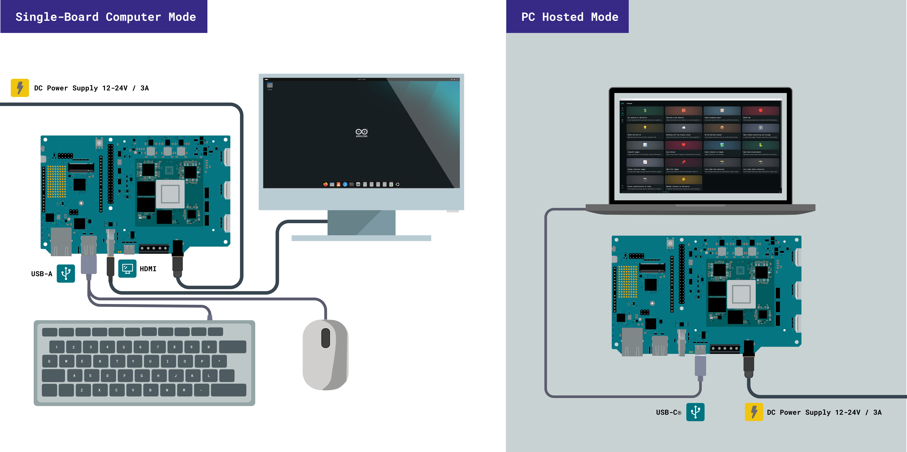

- **单板计算机模式：** App Lab 直接在 VENTUNO Q 上运行。通过 HDMI（或 USB-C）连接显示器，并接入键盘和鼠标，即可构建一体化开发环境。无需电脑。
- **PC 主机模式：** 通过 USB-C 或网络将 VENTUNO Q 连接至电脑，并在电脑上运行 App Lab。
- **网络模式：** VENTUNO Q 以无头模式运行，无需显示器、键盘或鼠标。可通过 Wi-Fi® 或以太网远程访问开发板。

>📝 **注意：** 在 **PC 托管** 模式下，首次设置需要 USB 数据连接。之后，您可以通过局域网 (SSH) 使用 **网络** 目标。

在 **单板计算机** 模式下，无需 USB 数据连接，只需为开发板供电，待其加入网络后即可使用 **网络** 目标。USB 外设（键盘、鼠标、USB 摄像头、麦克风）可直接连接至板载 USB-A 端口。当 USB-C 端口启用 DisplayPort Alt-Mode 时，USB 数据传输速率会降低。

有关完整的设置说明、初始配置和首次使用指南，请参阅 [VENTUNO Q 用户手册](https://docs.arduino.cc/tutorials/ventuno-q/user-manual/)。

>📝 **注意：** 若首次通过 USB-C 供电，连接至计算机或非 PD 标准的 USB-C 端口时，故障指示灯可能会闪烁。该开发板启动时需要至少 9 V 的 PD 供电。 若要实现包括 AI 推理、连接外设和附加 HAT 在内的全性能运行，建议通过 USB-C PD（最高 20 V）或圆柱插头或螺丝端子（7-24 V）提供 12 V 或更高的电源。有关各电源的电压和电流限制，请参阅 [输入电源](#输入电源) 部分。

>📝 **注意：**首次启动时，Linux 系统加载需要 20-30 秒。当 MCU 引导加载程序加载完成且有效程序正在运行时，LED 矩阵会显示启动动画。请等待动画结束后再操作该开发板。如果未出现动画，请参阅 [VENTUNO Q 用户手册](https://docs.arduino.cc/tutorials/ventuno-q/user-manual/) 以获取更多详细信息。

### Bricks

在 Arduino App Lab 中，“Bricks” 是预打包的构建模块，包括 AI 模型、Web 服务、传感器集成、数据库和用户界面，它们会随您的 App 在 Linux 端一同部署，而无需您编写底层基础设施代码。 有关选择和使用 Bricks 的完整指南，请参阅 [VENTUNO Q 用户手册](https://docs.arduino.cc/tutorials/ventuno-q/user-manual/)。

>📝 **注意：** 当 App 已绑定并正在运行时，USB 接口可能会被系统占用。若需通过 USB 使用外部 CLI 工具，请停止 App 或断开开发板连接。

### 按钮与启动模式

VENTUNO Q 包含两个板载按钮：一个 **垂直按键** 和一个 **用户按钮**。

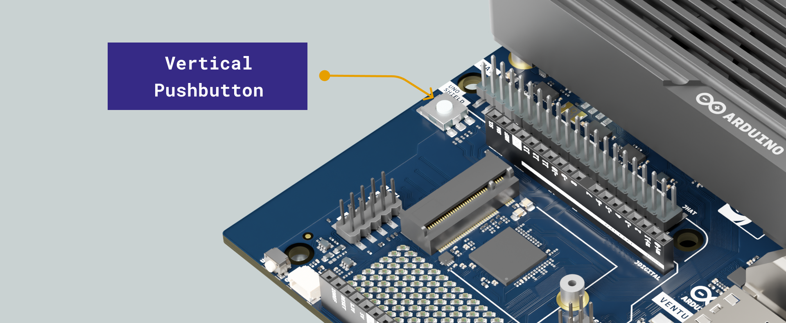

### 垂直按键

垂直按钮连接至 MCU 的 GPIO PK13 引脚。它可用于与开发板交互以及关闭开发板。

- **单次按下（单板计算机模式）：** 在屏幕上弹出关机对话框。用户可确认立即关机，或取消以关闭对话框并继续正常运行。若无任何操作，主板将在 60 秒后自动关机。
- **长按（10 秒以上，SSH / ADB 模式）：** 完全关闭系统。主板将保持关机状态，直至断开并重新连接电源。

>📝 **注意：** 长按关机将完全终止 Linux 环境，并中断所有正在运行的 App。请保存工作进度，并在适用情况下确保外部进程已安全停止。当供电恢复时，开发板会自动启动，正常启动时无需按下按钮。

### 用户按钮

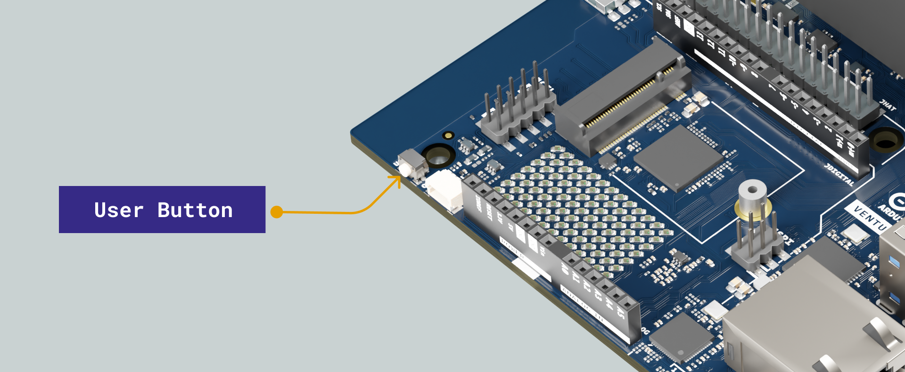

用户按钮连接至 MPU（GPIO_79），可用作通用输入。可通过标准 GPIO 接口从 Linux 应用程序和脚本中读取其状态。使用示例请参阅 [VENTUNO Q 用户手册](https://docs.arduino.cc/tutorials/ventuno-q/user-manual/)。

## 机械信息

电路板尺寸为 160 mm × 100 mm。不包含 SoM 散热片和风扇时的总高度为 25.8 mm。40 针 JHAT 排针符合标准 Raspberry Pi® HAT 机械规范，可与符合该规范的 HAT 配件实现物理兼容。

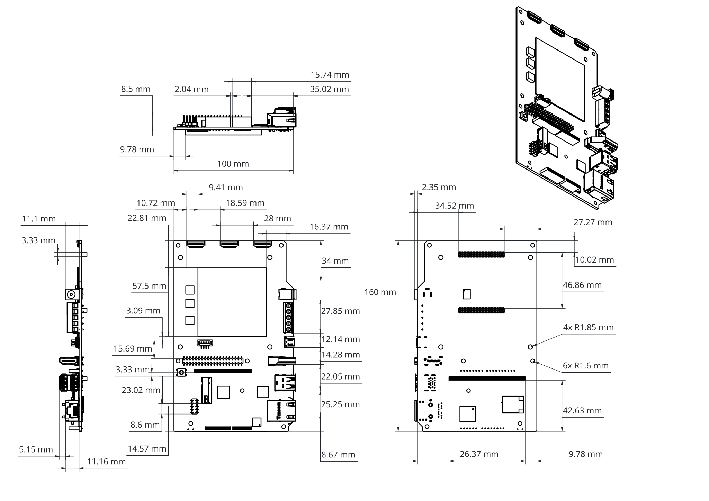

UNO Shield 接头保持了标准 Arduino UNO 的焊盘间距，可与 UNO Shield 生态系统直接实现机械和电气兼容。

该电路板设有三组用于不同机械功能的孔位：

- **4× M2.5 间隔柱**（高度 5 毫米，焊接在电路板上），用于安装散热片，距右边缘 9.78 毫米，距顶边缘 10.02 毫米和 42.63 毫米。
- **4× 3.2 毫米** 角安装孔，用于安装在机箱内、面板上或自定义载板上及配件上。
- **2× 3.2 mm** HAT 安装孔，符合标准 Raspberry Pi® HAT 机械规范，兼容 M3 隔离柱，用于安装 HAT 配件。
- **1× M2 隔离柱**（高度 4 mm），用于将 M.2 2230 NVMe 存储卡固定在 M.2 插槽中。

VENTUNO Q 随附 4× M3 六角支架和 4× M3 螺母，装在单独的袋子中。在静电敏感环境中，请将一个支架和一个螺母安装在四个角上的安装孔中，以将电路板抬离工作台面并增加间隙。

| **项目**  | **尺寸**                          |
| ------- | ------------------------------- |
| M3 六角支架 | 六角长度 20 mm，螺纹长度 6 mm，螺纹直径 3 mm  |
| M3 螺母   | 高度 2.4 mm，六角对边长度 5.6 mm，内径 3 mm |

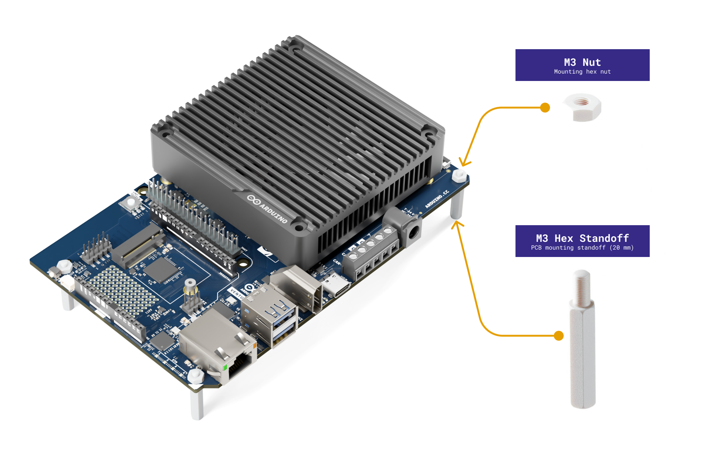

### SoM 散热片与热设计

Qualcomm® Dragonwing™ IQ8 (QCS8275) SoM 需要主动散热才能在满负载下持续运行。 该 SoM 在电路板上的占位面积为 **57.5 毫米 × 57.5 毫米**，中心点距左边缘 **14.26 毫米**、距底边缘 **14.73 毫米**，相对于 SoM 有效区域的水平偏移量为 **8.95 毫米**，垂直偏移量为 **8.55 毫米**。

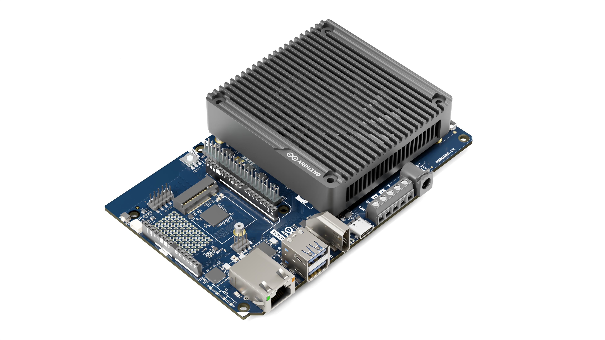

四个 M2.5 间隔柱界定了随附散热片和风扇组件的安装布局，这些组件对称地分布在 SoM 占位周围，以确保 SoM 盖板上的夹紧力均匀分布。

在最坏情况下，当 MPU、NPU 和 GPU 同时以全性能运行时，电路板的功耗可能达到约 25 W 或更高。随附的主动散热解决方案已针对此热负载进行了优化。请确保在持续的高性能工作负载期间风扇保持正常运行。

>📝 **注意：** 在未采取充分散热措施的情况下，若在高强度 AI 或计算工作负载下运行该板卡，可能会触发 QCS8275 SoM 的热节流，从而降低性能。请务必针对您的目标用例和机箱环境验证散热余量。

# Safety Information

Maintain a minimum separation distance of 20 cm between the device and the user during operation. The 5 GHz frequency band may be subject to operational restrictions depending on the country of use.

**Bulgarian (BG):**

Поддържайте минимално разстояние от 20 см между устройството и потребителя по време на работа.
Честотната лента 5 GHz може да бъде обект на ограничения за използване в зависимост от държавата.

**Croatian (HR):**

Održavajte minimalnu udaljenost od 20 cm između uređaja i korisnika tijekom rada.
Frekvencijski pojas od 5 GHz može podlijegati ograničenjima ovisno o zemlji uporabe.

**Czech (CS):**

Udržujte minimální vzdálenost 20 cm mezi zařízením a uživatelem během provozu.
Pásmo 5 GHz může podléhat provozním omezením v závislosti na zemi použití.

**Danish (DA):**

Oprethold en minimumsafstand på 20 cm mellem enheden og brugeren under drift.
5 GHz-båndet kan være underlagt driftsmæssige begrænsninger afhængigt af brugslandet.

**Dutch (NL):**

Houd tijdens gebruik een minimale afstand van 20 cm tussen het apparaat en de gebruiker aan.
De 5GHz-band kan onderhevig zijn aan gebruiksbeperkingen afhankelijk van het land van gebruik.

**Estonian (ET):**

Hoidke seadme ja kasutaja vahel töötamise ajal vähemalt 20 cm kaugust.
5 GHz sagedusribale võivad kehtida kasutuspiirangud sõltuvalt kasutusriigist.

**Finnish (FI):**

Pidä laitteen ja käyttäjän välillä vähintään 20 cm etäisyys käytön aikana.
5 GHz taajuuskaistaan voi kohdistua käyttörajoituksia käyttömaasta riippuen.

**French (FR):**

Maintenez une distance minimale de 20 cm entre l’appareil et l’utilisateur pendant son fonctionnement.
La bande de fréquences 5 GHz peut être soumise à des restrictions d’utilisation selon le pays.

**German (DE):**

Halten Sie während des Betriebs einen Mindestabstand von 20 cm zwischen dem Gerät und dem Benutzer ein.
Das 5‑GHz‑Frequenzband kann je nach Einsatzland Nutzungsbeschränkungen unterliegen.

**Greek (EL):**

Διατηρείτε ελάχιστη απόσταση 20 cm μεταξύ της συσκευής και του χρήστη κατά τη λειτουργία.
Η ζώνη συχνοτήτων 5 GHz ενδέχεται να υπόκειται σε περιορισμούς ανάλογα με τη χώρα χρήσης.

**Hungarian (HU):**

A működés során tartson legalább 20 cm távolságot az eszköz és a felhasználó között.
Az 5 GHz-es frekvenciasáv használata országtól függően korlátozott lehet.

**Irish (GA):**

Coinnigh ar a laghad fad 20 cm idir an gléas agus an t‑úsáideoir le linn úsáide.
D’fhéadfadh srianta oibriúcháin a bheith ar an mbanda minicíochta 5 GHz ag brath ar an tír.

**Italian (IT):**

Mantenere una distanza minima di 20 cm tra il dispositivo e l’utente durante il funzionamento.
La banda di frequenza a 5 GHz può essere soggetta a restrizioni operative a seconda del paese.

**Latvian (LV):**

Uzturiet vismaz 20 cm attālumu starp ierīci un lietotāju darbības laikā.
5 GHz frekvenču joslai var būt izmantošanas ierobežojumi atkarībā no valsts.

**Lithuanian (LT):**

Naudojimo metu laikykite bent 20 cm atstumą tarp įrenginio ir naudotojo.
5 GHz dažnių juostai gali būti taikomi naudojimo apribojimai priklausomai nuo šalies.

**Maltese (MT):**

Żomm distanza minima ta’ 20 cm bejn l-apparat u l-utent waqt l-użu.
Il-medda tal-frekwenza 5 GHz tista’ tkun soġġetta għal restrizzjonijiet skont il-pajjiż.

**Polish (PL):**

Podczas pracy zachowaj minimalną odległość 20 cm między urządzeniem a użytkownikiem.
Pasmo częstotliwości 5 GHz może podlegać ograniczeniom w zależności od kraju użytkowania.

**Portuguese (PT):**

Mantenha uma distância mínima de 20 cm entre o dispositivo e o utilizador durante o funcionamento.
A banda de frequência de 5 GHz pode estar sujeita a restrições de utilização dependendo do país.

**Romanian (RO):**

Mențineți o distanță minimă de 20 cm între dispozitiv și utilizator în timpul funcționării.
Banda de frecvență de 5 GHz poate face obiectul unor restricții în funcție de țara de utilizare.

**Slovak (SK):**

Počas prevádzky dodržiavajte minimálnu vzdialenosť 20 cm medzi zariadením a používateľom.
Pásmo 5 GHz môže podliehať prevádzkovým obmedzeniam v závislosti od krajiny použitia.

**Slovenian (SL):**

Med delovanjem ohranjajte najmanj 20 cm razdalje med napravo in uporabnikom.
Pas frekvenc 5 GHz je lahko omejen glede na državo uporabe.

**Spanish (ES):**

Mantenga una distancia mínima de 20 cm entre el dispositivo y el usuario durante su funcionamiento.
La banda de frecuencia de 5 GHz puede estar sujeta a restricciones según el país de uso.

**Swedish (SV):**

Håll ett minsta avstånd på 20 cm mellan enheten och användaren under drift.
5 GHz-bandet kan vara föremål för driftbegränsningar beroende på användningsland.

## ESD Warning

This product is a development board that contains ESD-sensitive components. Appropriate anti-static precautions should be taken when handling the device. Avoid touching exposed connectors, pins, or circuitry. Where a heatsink is installed, handle the board by the heatsink to minimise the risk of electrostatic discharge damage. Improper handling or exposure to electrostatic discharge may result in permanent damage to the product.

## Antenna Use and Compliance

- This product is approved to operate with the built-in (internal) antenna only
- The internal antenna is part of the certified module configuration and must be used for normal operation
- RF connectors may be present for development or testing purposes only
- Use of an external antenna is not part of the approved configuration
- External antenna use requires additional regulatory assessment before use

### Warning - External Antenna Use

- Connecting an external antenna may result in non-compliance with regulatory requirements
- This includes the module approval associated with FCC ID J9C-QCNFA725
- Use of an external antenna may change RF output power
- Use of an external antenna may change frequency behavior
- Use of an external antenna may change radiation characteristics
- These changes may cause the product to exceed allowed regulatory limits
- Use of an external antenna may invalidate device approval
- Use of an external antenna may void the authorization to operate the device
- Unauthorized changes, including antenna modifications, may void regulatory approvals

### Requirements for Integrators

- End products must use the internal antenna to maintain regulatory compliance
- If an external antenna is used, the integrator must perform a full regulatory assessment
- If an external antenna is used, the integrator must obtain required certifications for the final product
- Any antenna used must meet the approved gain, radiation pattern, and performance characteristics
- Approved antenna characteristics are defined in the applicable regulatory documentation, including the Qualcomm module label guide

### Operation in the 6 GHz Band

- Operation in the 6 GHz band is only permitted with the approved internal antenna configuration
- If an external antenna is used, 6 GHz operation must be disabled
- If an external antenna is used, the product must not transmit in the 6 GHz band
- Operation outside the approved configuration may violate regional regulations

### Responsibility

- The manufacturer or integrator is responsible for ensuring the final product complies with all applicable regulatory requirements
- Changes to the antenna system or RF design may require additional testing and certification

# Certifications

## RED / UK

| CE                     | Europe - EU Declaration of Conformity                                                                                                                                                            |
| ---------------------- | ------------------------------------------------------------------------------------------------------------------------------------------------------------------------------------------------ |
| Česky [Czech]          | Arduino S.r.l tímto prohlašuje, že tento Radiolan je ve shodě se základními požadavky a dalšími příslušnými ustanoveními směrnice 2014/53/EU.                                                    |
| Dansk [Danish]         | Undertegnede Arduino S.r.l erklærer herved, at følgende udstyr Radiolan overholder de væsentlige krav og øvrige relevante krav i direktiv 2014/53/EU.                                            |
| Deutsch [German]       | Hiermit erklärt Arduino S.r.l dass sich das Gerät Radiolan in Übereinstimmung mit den grundlegenden Anforderungen und den übrigen einschlägigen Bestimmungen der Richtlinie 2014/53/EU befindet. |
| Eesti [Estonian]       | Käesolevaga kinnitab Arduino S.r.l seadme Radiolan vastavust direktiivi 2014/53/EU põhinõuetele ja nimetatud direktiivist tulenevatele teistele asjakohastele sätetele.                          |
| English                | Hereby, Arduino S.r.l, declares that this Radiolan is in compliance with the essential requirements and other relevant provisions of Directive 2014/53/EU.                                       |
| Español [Spanish]      | Por medio de la presente Arduino S.r.l declara que el Radiolan cumple con los requisitos esenciales y cualesquiera otras disposiciones aplicables o exigibles de la Directiva 2014/53/EU.        |
| Ελληνική [Greek]       | ΜΕ ΤΗΝ ΠΑΡΟΥΣΑ Arduino S.r.l ΔΗΛΩΝΕΙ ΟΤΙ Radiolan ΣΥΜΜΟΡΦΩΝΕΤΑΙ ΠΡΟΣ ΤΙΣ ΟΥΣΙΩΔΕΙΣ ΑΠΑΙΤΗΣΕΙΣ ΚΑΙ ΤΙΣ ΛΟΙΠΕΣ ΣΧΕΤΙΚΕΣ ΔΙΑΤΑΞΕΙΣ ΤΗΣ ΟΔΗΓΙΑΣ 2014/53/EU.                                          |
| Français [French]      | Par la présente Arduino S.r.l déclare que l'appareil Radiolan est conforme aux exigences essentielles et aux autres dispositions pertinentes de la directive 2014/53/EU.                         |
| Íslenska [Icelandic]   | Hér með lýsir Arduino S.r.l yfir því að Radiolan er í samræmi við grunnkröfur og aðrar kröfur, sem gerðar eru í tilskipun 2014/53/EU.                                                            |
| Italiano [Italian]     | Con la presente Arduino S.r.l dichiara che questo Radiolan è conforme ai requisiti essenziali ed alle altre disposizioni pertinenti stabilite dalla direttiva 2014/53/EU.                        |
| Latviski [Latvian]     | Ar šo Arduino S.r.l deklarē, ka Radiolan atbilst Direktīvas 2014/53/EU būtiskajām prasībām un citiem ar to saistītajiem noteikumiem.                                                             |
| Lietuvių [Lithuanian]  | Šiuo Arduino S.r.l deklaruoja, kad šis Radiolan atitinka esminius reikalavimus ir kitas 2014/53/EU Direktyvos nuostatas.                                                                         |
| Malti [Maltese]        | Hawnhekk, Arduino S.r.l, jiddikjara li dan Radiolan jikkonforma mal-ħtiġijiet essenzjali u ma provvedimenti oħrajn relevanti li hemm fid-Dirrettiva 2014/53/EU.                                  |
| Magyar [Hungarian]     | Alulírott, Arduino S.r.l nyilatkozom, hogy a Radiolan megfelel a vonatkozó alapvetõ követelményeknek és az 2014/53/EU irányelv egyéb elõírásainak.                                               |
| Nederlands [Dutch]     | Hierbij verklaart Arduino S.r.l dat het toestel Radiolan in overeenstemming is met de essentiële eisen en de andere relevante bepalingen van richtlijn 2014/53/EU.                               |
| Norsk [Norwegian]      | Arduino S.r.l erklærer herved at utstyret Radiolan er i samsvar med de grunnleggende krav og øvrige relevante krav i direktiv 2014/53/EU.                                                        |
| Polski [Polish]        | Niniejszym Arduino S.r.l oświadcza, że Radiolan jest zgodny z zasadniczymi wymogami oraz pozostałymi stosownymi postanowieniami Dyrektywy 2014/53/EU.                                            |
| Português [Portuguese] | Arduino S.r.l declara que este Radiolan está conforme com os requisitos essenciais e outras disposições da Directiva 2014/53/EU.                                                                 |
| Slovensko [Slovenian]  | Arduino S.r.l izjavlja, da je ta Radiolan v skladu z bistvenimi zahtevami in ostalimi relevantnimi določili direktive 2014/53/EU.                                                                |
| Slovensky [Slovak]     | Arduino S.r.l týmto vyhlasuje, že Radiolan spĺňa základné požiadavky a všetky príslušné ustanovenia Smernice 2014/53/EU.                                                                         |
| Suomi [Finnish]        | Arduino S.r.l vakuuttaa täten että Radiolan tyyppinen laite on direktiivin 2014/53/EU oleellisten vaatimusten ja sitä koskevien direktiivin muiden ehtojen mukainen.                             |
| Svenska [Swedish]      | Härmed intygar Arduino S.r.l att denna Radiolan står I överensstämmelse med de väsentliga egenskapskrav och övriga relevanta bestämmelser som framgår av direktiv 2014/53/EU.                    |
| **UK**                 | **United Kingdom - UKCA Declaration of Conformity**                                                                                                                                              |
| United Kingdom         | Hereby, Arduino S.r.l, declares that this Radiolan is in compliance with the essential requirements and other relevant provisions of The Radio Equipment Regulations 2017.                       |

Requirements in:

Belgium (BE), Bulgaria (BG), Czech Republic (CZ), Denmark (DK), Germany (DE), Iceland (IS), Estonia (EE), Ireland (IE), Greece (EL), Spain (ES), France (FR), Croatia (HR), Italy (IT), Cyprus (CY), Latvia (LV), Liechtenstein (LI), Lithuania (LT), Luxembourg (LU), Hungary (HU), Malta (MT), Netherlands (NL), Norway (NO), Austria (AT), Poland (PL), Portugal (PT), Romania (RO), Slovenia (SI), Slovakia (SK), Turkey (TR), Finland (FI), Sweden (SE), Switzerland (CH), United Kingdom (North Irland) (UK(NI)), and United Kingdom (UK).

Operations in the 5.15-5.35GHz band are restricted to indoor usage only.

For Low power indoor (LPI use): Operations in the 5955 - 6415MHz are restricted to indoor usage only.

This equipment should be installed and operated with a minimum distance of 20 cm between the radiator and your body.

### Radio Equipment Information (RED Compliance)

This radio equipment operates in the following frequency bands and with the maximum radio-frequency power indicated below:

| **Radio Technology**      | **Frequency Band** | **Maximum Transmit Power** |
| ------------------------- | ------------------ | -------------------------- |
| Bluetooth® EDR            | 2400 - 2483.5 MHz  | 18.31 dBm                  |
| Bluetooth® LE             | 2400 - 2483.5 MHz  | 9.97 dBm                   |
| Wi-Fi® 2.4 GHz            | 2400 - 2483.5 MHz  | 19.91 dBm EIRP             |
| Wi-Fi® 5 GHz              | 5150 - 5350 MHz    | 22.92 dBm EIRP             |
| Wi-Fi® 5 GHz              | 5470 - 5725 MHz    | 22.97 dBm EIRP             |
| Wi-Fi® 5 GHz              | 5725 - 5850 MHz    | 13.84 dBm EIRP             |
| Wi-Fi® 6 GHz (LPI client) | 5945 - 6425 MHz    | 22.83 dBm EIRP             |
| Wi-Fi® 6 GHz (VLP)        | 5945 - 6425 MHz    | 13.77 dBm EIRP             |

In accordance with EU regulations (RED Directive 2014/53/EU), the use of the 5 GHz band may be subject to national restrictions.

## UKCA Declaration of Conformity

Arduino S.r.l. hereby declares that this product is in compliance with the essential requirements and other relevant provisions of the applicable UK regulations. A copy of the UK Declaration of Conformity is available at: <https://docs.arduino.cc/certifications>

## FCC

Contains FCC ID: J9C-QCNFA725

**FCC Compliance Information**

This device complies with Part 15 of the FCC Rules. Operation is subject to the following two conditions: (1) this device may not cause harmful interference, and (2) this device must accept any interference received, including interference that may cause undesired operation.

This product does not contain any user serviceable components. Any unauthorized product changes or modifications will invalidate warranty and all applicable regulatory certifications and approvals, including authority to operate this device.

**FCC Part 15 Digital Emissions Compliance**

We Arduino S.r.l. - Via Andrea Appiani 25, 20900 Monza (Italy), declare under our sole responsibility that the product Arduino® VENTUNO Q complies with Part 15 of the FCC Rules. Operation is subject to the following two conditions: (1) this device may not cause harmful interference, and (2) this device must accept any interference received, including interference that may cause undesired operation.

**WARNING:** This equipment has been tested and found to comply with the limits for a Class B digital device, pursuant to Part 15 of the FCC Rules. These limits are designed to provide reasonable protection against harmful interference in a residential installation. This equipment generates and radiates radio frequency energy and, if not installed and used in accordance with the instructions, may cause harmful interference to radio communications.

However, there is no guarantee that interference will not occur in a particular installation. If this equipment does cause harmful interference to radio or television reception, which can be determined by turning the equipment off and on, the user is encouraged to try to correct the interference by one or more of the following measures:

- Reorient or relocate the receiving antenna.
- Increase the separation between the equipment and receiver.
- Connect the equipment into an outlet on a circuit different from the one the receiver is connected to.
- Consult the dealer or an experienced radio/TV technician for help.

The user may find the following booklet prepared by the Federal Communications Commission helpful:

**The Interference Handbook**

This booklet is available from the U.S. Government Printing Office, Washington, D.C. 20402. Stock No.004-000-00345-4.

**Radiation Exposure Statement**

1. This transmitter must not be co-located or operating in conjunction with any other antenna or transmitter.
2. This equipment complies with RF radiation exposure limits set forth for an uncontrolled environment. This equipment should be installed and operated, keeping the radiator at least 20cm or more away from the person's body.

**FCC 6 GHz Statement**

a. The operation of this device is prohibited on oil platforms and aircraft, except that operation of this device in 5.925-6.425 GHz is permitted in large aircraft while flying above 10,000 feet.

b. Installation on outdoor fixed infrastructure is prohibited.

c. Controlling or communications with unmanned aircraft systems, including drones, is prohibited.

## ISED

Contains IC: 2723A-QCNFA725

*English:*

This device complies with Canadian RSS-247.
This device complies with Industry Canada license-exempt RSS standard(s). Operation is subject to the following two conditions: (1) this device may not cause interference, and (2) this device must accept any interference, including interference that may cause undesired operation of the device.

*French:*

Ce dispositif est conforme à la norme CNR-247 d'Industrie Canada applicable aux appareils radio exempts de licence. Son fonctionnement est sujet aux deux conditions suivantes: (1) le dispositif ne doit pas produire de brouillage préjudiciable, et (2) ce dispositif doit accepter tout brouillage reçu, y compris un brouillage susceptible de provoquer un fonctionnement indésirable.

*English:*

Caution:

(i) the device for operation in the band 5150-5250 MHz is only for indoor use to reduce the potential for harmful interference to co-channel mobile satellite systems;

(iv) Users should also be advised that high-power radars are allocated as primary users (i.e. priority users) of the bands 5250-5350 MHz and 5650-5850 MHz and that these radars could cause interference and/or damage to LE-LAN devices.

*French:*

Avertissement :

Le guide d'utilisation des dispositifs pour réseaux locaux doit inclure des instructions précises sur les restrictions susmentionnées, notamment :

(i) les dispositifs fonctionnant dans la bande 5 150-5 250 MHz sont réservés uniquement pour une utilisation à l'intérieur afin de réduire les risques de brouillage préjudiciable aux systèmes de satellites mobiles utilisant les mêmes canaux ;

(iv) Les radars à haute puissance sont désignés comme utilisateurs principaux (c'est-à-dire utilisateurs prioritaires) des bandes de fréquences 5250-5350 MHz et 5650-5850 MHz. Ces radars peuvent causer des interférences et/ou endommager les dispositifs LE-LAN.

  <strong>Note:</strong> For 5GHz and/or when co-located with 5 GHz transmitters, the following statements should be provided in the user information.

**Radiation Exposure Statement**

1. To comply with the Canadian RF exposure compliance requirements, this device and its antenna must not be co-located or operating in conjunction with any other antenna or transmitter.
2. To comply with RSS 102 RF exposure compliance requirements, this equipment should be installed and operated, keeping the radiator at least 20cm or more away from the person's body.

**Déclaration d'exposition aux rayonnements**

1. Pour se conformer aux exigences de conformité RF canadienne l'exposition, cet appareil et son antenne ne doivent pas être co-localisés ou fonctionnant en conjonction avec une autre antenne ou transmetteur.
2. Pour se conformer aux exigences de conformité CNR 102 RF exposition, cet équipement doit être installé et utilisé en maintenant le radiateur à au moins 20cm ou plus du corps de la personne.

**6 GHz General statement**

*English:*

Devices shall not be used for control of or communications with unmanned aircraft systems. Devices shall not be used on oil platforms. Devices shall not be used on aircraft, except for the low-power indoor access points, indoor subordinate devices, low-power client devices, and very low-power devices operating in the 5925-6425 MHz band, that may be used on large aircraft as defined in the Canadian Aviation Regulations, while flying above 3,048 metres (10,000 feet).

*French :*

Les dispositifs ne doivent pas être utilisés pour commander des systèmes d'aéronef sans pilote ni pour communiquer avec de tels systèmes; Les dispositifs ne doivent pas être utilisés sur les plateformes de forage pétrolier; Les dispositifs ne doivent pas être utilisés dans les aéronefs, à l'exception des points d'accès intérieurs de faible puissance, des dispositifs subordonnés intérieurs, des dispositifs clients de faible puissance et des dispositifs de très faible puissance fonctionnant dans la bande de 5 925 à 6 425 MHz, qui peuvent être utilisés dans les gros aéronefs tel qu'il est défini dans le Règlement de l'aviation canadien, et ce, lorsqu'ils volent à une altitude supérieure à 3 048 mètres (10 000 pieds).

## Trademarks

The terms HDMI, HDMI High-Definition Multimedia Interface, HDMI trade dress and the HDMI Logos are trademarks or registered trademarks of HDMI Licensing Administrator, Inc.

# 公司信息

| 公司名称 | Arduino S.r.l.                             |
| ---- | ------------------------------------------ |
| 地址   | Via Andrea Appiani 25, 20900 Monza (Italy) |

# 文档参考

| 编号  | 参考资料              | 链接                                                                                         |
| :-: | ----------------- | ------------------------------------------------------------------------------------------ |
|  1  | Arduino App Lab   | [https://www.arduino.cc/en/software](https://www.arduino.cc/en/software)                   |
|  2  | VENTUNO Q 文档      | [https://docs.arduino.cc/hardware/ventuno-q/](https://docs.arduino.cc/hardware/ventuno-q/) |
|  3  | Project Hub       | [https://projecthub.arduino.cc/](https://projecthub.arduino.cc/)                           |
|  4  | Library Reference | [https://docs.arduino.cc/libraries/](https://docs.arduino.cc/libraries/)                   |
|  5  | Arduino Store     | [https://store.arduino.cc/](https://store.arduino.cc/)                                     |

# 文档修订历史

| **日期**   | **修订号** | **变更内容**   |
| :--------: | :----------: | ------------- |
| 25/08/2026 |      1       | 首次发布 |
| 28/08/2026 |      2       | Updated Certifications |
