## Overview

In this user manual we will cover the main features of the [**Arduino® VENTUNO™ Q**](https://store.arduino.cc/products/ventuno-q), and how to get started with the board. The VENTUNO Q is a development board with dual-brain architecture, featuring a **Qualcomm® Dragonwing™ QCS8275 (MPU)**, a STM32H5F5 microcontroller (MCU), a Wi-Fi® 6 / Bluetooth® 5.3 module with a large amount of connectors & expansion ports.

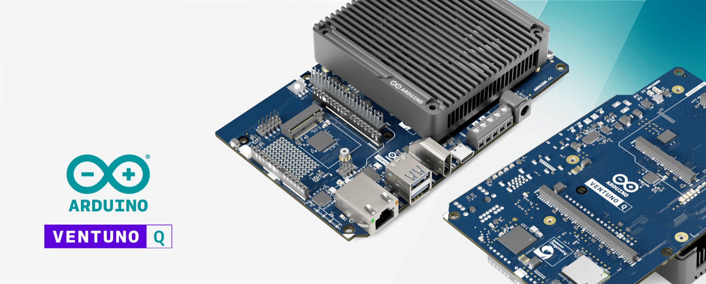

This board can be used as a Single-board Computer (SBC), by connecting a screen, display & mouse to its dedicated HDMI & USB connectors.

The Dragonwing™ QCS8275 features:

- **Qualcomm® Hexagon™ Tensor Processor** with up to 40 dense TOPS for running advanced computer vision applications and local LLMs
- **Spectra™ 690 ISP** high performance image processing engine
- **Qualcomm® Adreno™ 623 GPU** for high graphics performance
- **2x8GB LPDDR5 (RAM)** and **64GB eMMC**

## Hardware and Software Requirements

### Hardware Requirements

- [Arduino® VENTUNO™ Q](https://store.arduino.cc/products/ventuno-q) (1x)
- [Arduino® USB Type-C® Cable 2in1](https://store.arduino.cc/products/usb-cable2in1-type-c) (1x)
- [Arduino® USB-C Power Supply (65W)](https://store.arduino.cc/products/usb-c-power-supply-65w)\*

\*Other power supplies can be used, within the range of 7-24 V and ≥ 3 A. See the [Power Overview Section](#power-overview) for more information.

<Alert type="note" text="Note">
The Arduino USB-C Power Supply (65W) includes a small adapter that converts USB-C® into a DC barrel jack. Use this adapter to power the board via the barrel jack connector if needed.
</Alert>

Additionally, to use the board as a [Single Board Computer (SBC)](#single-board-computer-sbc-mode), you will need the following:

- Mouse
- Keyboard
- HDMI cable
- Display
- USB dongle (optional)\*

<Alert type="note">
\*Mouse, keyboard and display can be connected to the USB-A and HDMI connector. For more peripherals, use a USB-C® dongle connected to the USB-C® connector.
</Alert>

### Software Requirements

- [Arduino App Lab](https://www.arduino.cc/en/software/#app-lab-section)

## Product Overview

The VENTUNO Q is designed to handle high-performance computing in combination with real-time sensing and actuation. Its dual-brain architecture allows the board to interact with the real world and process large sets of data, supporting a large number of use cases in Edge AI and IoT.

The Dragonwing™ QCS8275 (MPU) runs a full Ubuntu Linux OS with upstream support, where the STM32H5F5 (MCU) runs Arduino sketches over Zephyr OS. Using a built-in RPC library, the two systems can communicate seamlessly.

The VENTUNO Q also features a large set of connectors & expansion ports:

- USB-C®
- USB-A
- HDMI
- Ethernet 2.5Gb
- 40-pin RPI connector
- CAN-FD (screw terminal)
- 3x MIPI/CSI (camera) connectors
- Qwiic
- M.2 connector for memory expansion

### Application Examples

The VENTUNO Q is capable of running a multitude of high performance applications in several fields:

- **Offline Voice assistant**: run a speech-to-text model and a local LLM to create offline voice assistants
- **Advanced Robotics**: build computer vision applications with 3x dedicated camera connectors, and interface it with a dedicated CAN port or other peripherals via the MCU.
- **Smart Environment:** create a local smart home hub that can interact with various components and system in a physical space.

### Board Architecture Overview

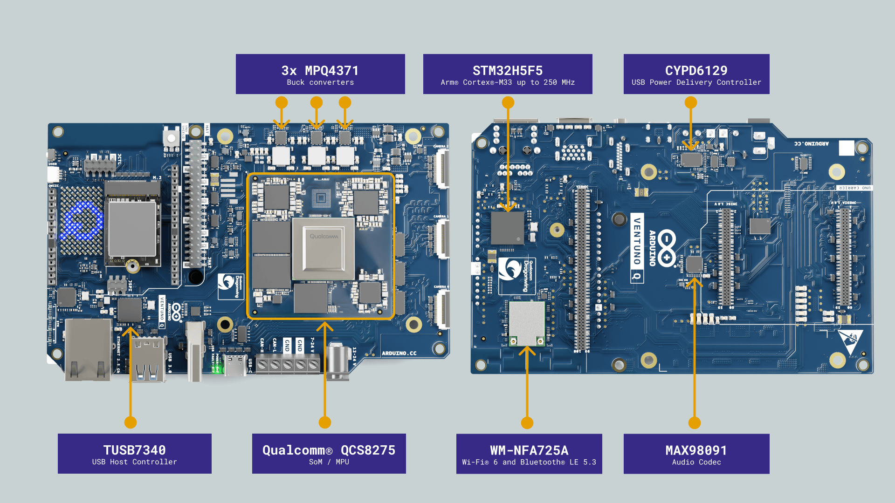

- **MPU**: The **Dragonwing™ QCS8275** is an MPU featuring an octa-core processor with a Kryo™ Gen 6 CPU subsystem (up to 2.35 GHz), an Adreno™ A623 GPU/VPU (877 MHz) and a Hexagon Tensor AI Processor (NPU) with up to 40 TOPS. It runs Ubuntu Linux OS with upstream support, making it well suited for performance-demanding applications, such as LLM, VLM, TTS / STT. It also features a Qualcomm Spectra 692 Image Signal Processor (ISP) for handling multiple cameras connections.
- **Microcontroller (MCU)**: The **STM32H5F5** microcontroller features an Arm® Cortex®-M33 core running at 250 MHz, with 4 MB of flash memory and 1.5 MB of SRAM. The STM32H5F5's GPIOs are accessible via the board's pins. The MCU can communicate with the MPU over RPC using the [bridge](#bridge---remote-procedure-call-rpc-library) framework.
- **Wireless Connectivity**: The Wi-Fi® / Bluetooth® radio module provides tri-band Wi-Fi® 6 (2.4/5/6 GHz) and Bluetooth® 5.3 connectivity, with 2x onboard antennas.
- **RAM**: 16 GB of LPDDR5 RAM.
- **Storage:** 64 GB of eMMC storage with an option for extending it via M.2 connector using NVME Gen.4 external storage.
- **Multimedia Codec**: The MAX98091 audio codec enables audio input/output via the [JMISC](#jmisc) high-density connector.

### Connector Overview

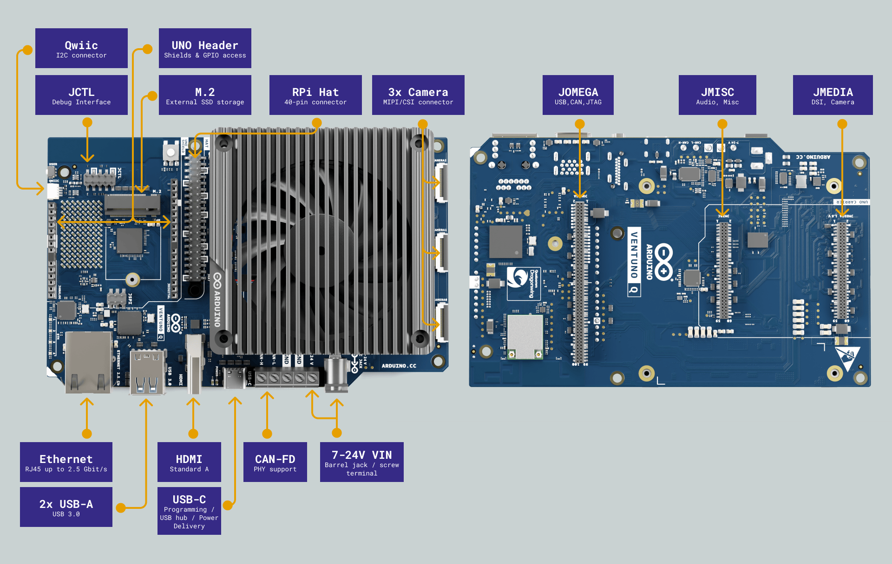

VENTUNO Q features a very rich set of connectors, including 3x dedicated camera connectors, HDMI, Ethernet, 2x USB-A, 40-pin RPi Hat connector and much more.

See the [connectors & expansion ports](#connectors--expansion-ports) section for more information.

### Power Overview


VENTUNO Q has multiple options for powering the board:

- USB-C® PD (9-20 V, max 3 A)<sup>1</sup>
- Barrel jack (7-24 V max 5 A)
- Screw terminals (7-24 V max 10 A)

<Alert type="warning" text="Warning">
<sup>1</sup> Power over USB requires **at least** 9 V (Power Delivery negotiation). Powering with e.g. 5 V only (e.g. via computer USB port) is not accepted and will result in a USB fault (blinking red LED next to the USB). This error is not damaging to the board and a power-cycle to reset it will remove the LED blinking sequence.
</Alert>

It is recommended to use a 12/24 V power supply at **maximum 5 A**. Drawing more than 5 A will damage the DC jack.

The maximum ratings (using a 12/24 V power supply) for the DC jack are:

- 12 V × 5 A = 60 W
- 24 V × 5 A = 120 W

### Power Safety Considerations

<Alert type="warning" text="Warning">
Please read these statements carefully as it is possible to damage the board if powered incorrectly.
</Alert>

Please note that when powering the board with lower voltages, the amount of power the board can draw is limited.

- Powering with 7 V / 5 A will limit the board to draw max 35 W. Without any external circuitry attached, the board (at full power) draws around ~25 W.
- Note that connecting additional peripherals via e.g. USB-A connector will increase the power draw. See the sections below for more information.

#### USB-A Power Draw

The 2x USB-A connectors can also provide up to 5 V × 1.71 A = 8.55 W each, putting it at a maximum total draw of **~17 W**. If the board is powered with a lower voltage (e.g. 7 V 5 A), and the USB-A draws ~17 W total, this will damage the jack.

#### 5 V / 3.3 V Power Rails

The `+3V3_LIMITED` and `+5V_LIMITED` nets (used for shields, hats, Qwiic connector, UNO pins), is limited to 2.8 A

- 3.3 V × 2.8 A = **~9.5 W**
- 5 V × 2.8 A = **14 W**

<Alert type="info">Note that the [carrier connectors](#uno-carrier-headers--connectors) and [JOMEGA](#jomega-expansion-header) are not part of the limited net and can draw more power.</Alert>

#### VIN Pin Ratings

The input voltage for the VIN pin is 7-24 V, protected by a 1.1 A PTC fuse (limiting it to approximately 26 W at 24 V). As the board draws around 25 W~ *without* any peripherals connected, it is **not ideal** to power the board via the VIN pin.

### User Features

### Pinout

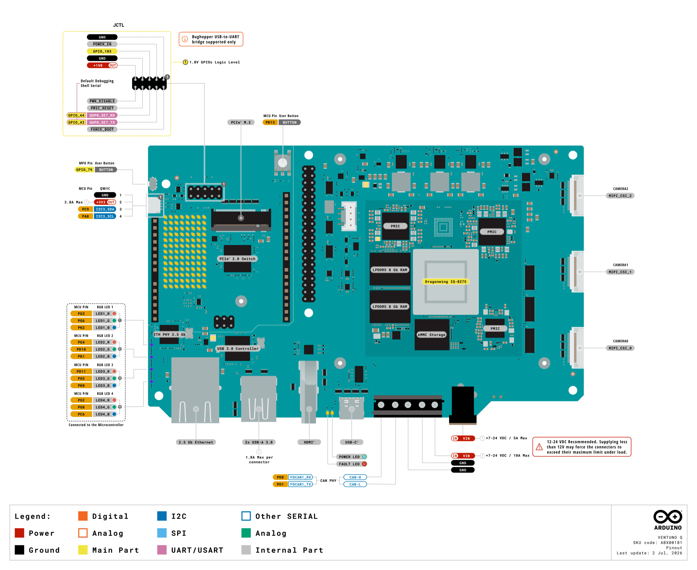

To see the full pinout, visit the link below:

- [VENTUNO Q full pinout](https://docs.arduino.cc/resources/pinouts/ABX00181-full-pinout.pdf)

### Datasheet

The complete datasheet is available and downloadable as PDF from the link below:

- [VENTUNO Q datasheet](https://docs.arduino.cc/resources/datasheets/ABX00181-datasheet.pdf)

### Schematics

The complete schematics are available and downloadable as PDF from the link below:

- [VENTUNO Q schematics](https://docs.arduino.cc/resources/schematics/ABX00181-schematics.pdf)

### STEP Files

The complete STEP files are available and downloadable from the link below:

- [VENTUNO Q STEP files](https://docs.arduino.cc/resources/models/ABX00181-step.zip)

### Form Factor

The VENTUNO Q features a new larger form factor (160 mm x 100 mm), but is equipped with the classic UNO pin headers to ensure compatibility with both official Arduino shields and shields created by the community\*.

\*This refers only to the mechanical and pin compatibility, not software compatibility.

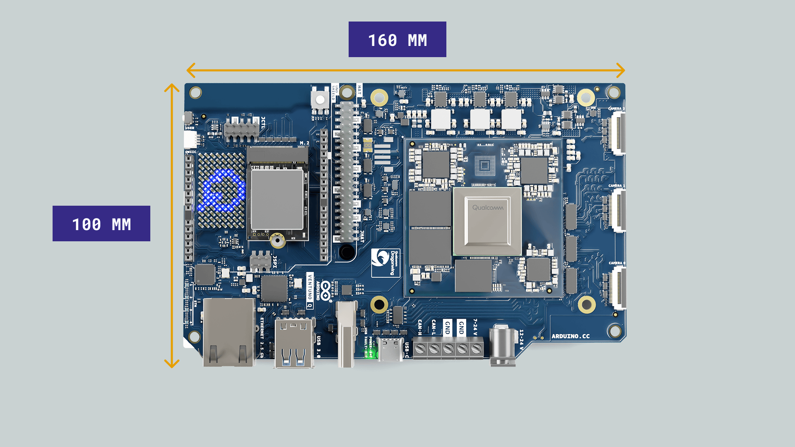

### Board Clearance

<Alert type="warning">Always mount the VENTUNO Q on the included standoffs. Without them, exposed solder joints on the underside can short-circuit against a conductive surface, damaging the board.</Alert>

Four spacers and nuts are included in the packaging for this purpose: place a spacer under each of the board's four corners, then secure it with a nut through the mounting hole on top.

## Arduino App Lab

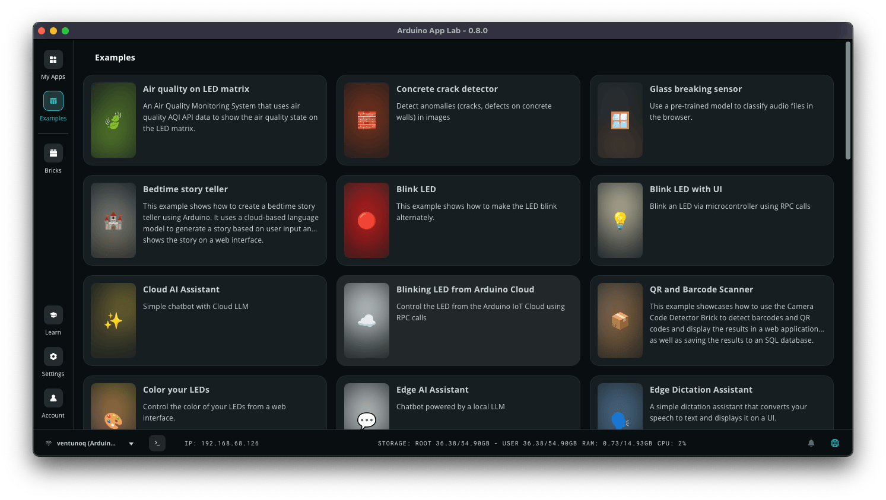

The [Arduino App Lab](/software/app-lab/) is a unified development environment for programming Linux-based Arduino boards. This allows you to run Python scripts on the Linux processor (Dragonwing™ QCS8275) and sketches on the MCU (STM32H5F5), by creating and deploying **Apps** through the Arduino App Lab.

To build Apps, several [Bricks](/software/app-lab/bricks/about-bricks/) (building blocks) can be selected, where some are paired with preconfigured AI models (that can be swapped out in the Arduino App Lab).

## First Setup

To get started with our board, we can choose from three alternatives.

- **PC Mode** - connect to the VENTUNO Q over **USB-C®** using the Arduino App Lab desktop application (macOS/Windows/Linux)
- **Network Mode** - connect to the VENTUNO Q over **the local network** using the Arduino App Lab desktop application (macOS/Windows/Linux).\*
- **Single Board Computer (SBC) Mode** - use the Arduino App Lab directly from the VENTUNO Q, with a display, keyboard and mouse connected (Arduino App Lab is pre-installed on the board).

\*This option is only available once [First Setup](/tutorials/ventuno-q/first-setup/) is completed.

### Power the Board

Regardless of how you want to use your board, it needs to be powered:

Powering the board can be done through the following options:

- Through the USB-C® connector, using a 9-20 V input source (max 3 A).\*
- An external +7-24 VDC (max 5 A) power supply connected with the barrel jack plug.
- An external +7-24 VDC power supply (max 10 A) connected to the screw terminal headers.

\*Only available in **Network Mode** or **Single Board Computer** mode.

<Alert type="warning">
Power over USB requires **at least** 9 V. Powering with e.g. 5 V only (e.g. via computer USB port) is not accepted and will result in a USB fault (blinking red LED next to the USB). This error is not damaging to the board and a power-cycle will remove the LED blinking sequence.
</Alert>

### PC Mode (USB-C®)

<Alert type="info">The complete instructions for the first setup is documented in the [VENTUNO Q - First Setup](/tutorials/ventuno-q/first-setup/) tutorial.</Alert>

The most common way to interact with your board is by using the **PC mode**, where you program the board from your computer, over either USB-C® or local network.

1. Power your board by connecting the [Arduino USB-C Power Supply (65W)](https://store.arduino.cc/products/usb-c-power-supply-65w) to the barrel jack connector.
2. Connect your board to your computer over USB-C®.
   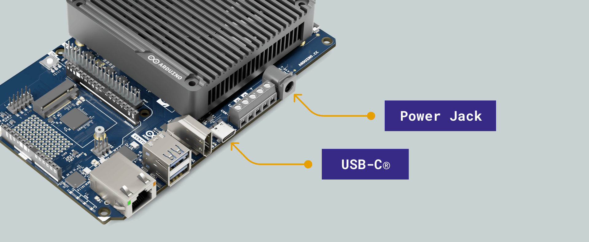
3. Download [Arduino App Lab](https://www.arduino.cc/en/software/#app-lab-section), and run the application. Your board should appear if it is connected to your computer, click on it to proceed.
   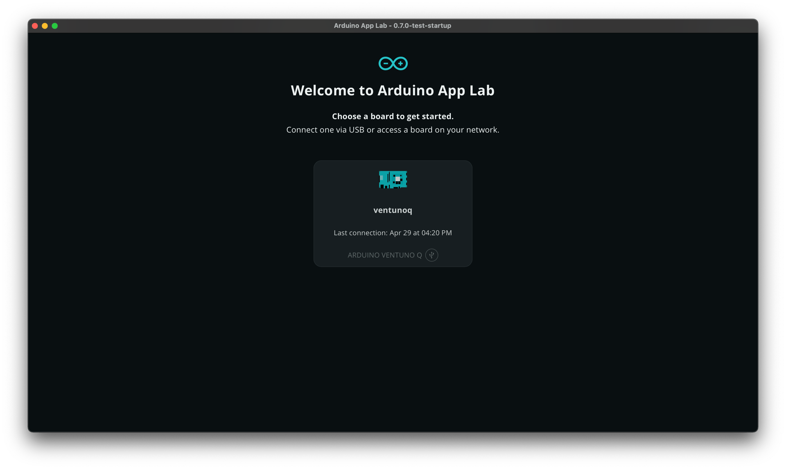
4. You will be prompted to set **Board Name**, **Keyboard Language** and **Wi-Fi®** credentials when launching it for the first time. Complete the configuration and perform any board updates needed.

Once configuration and update is finished, you will be ready to run the examples in the Arduino App Lab 🚀.

Apps are run by selecting an example and clicking the **"Run"** button.

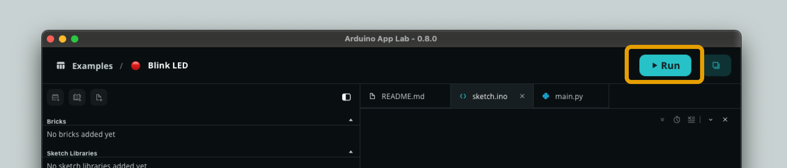

#### Network Mode (Local Wi-Fi®)

Once the first configuration is completed you can use **network mode**, if the board is on the same network as your PC. To use network mode:

1. Re-launch Arduino App Lab.
2. Your board should appear with a little **Wi-Fi®** symbol next to it. Click on it.
   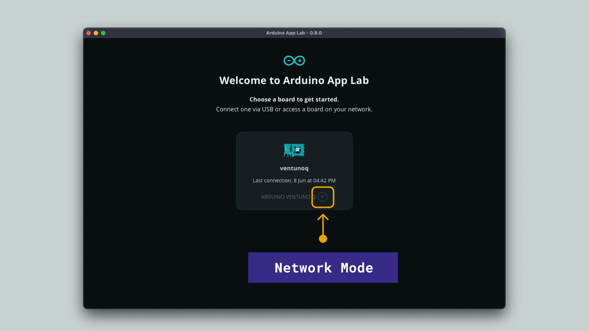
3. You will need to enter the password for **your board**, not your network.

Once password is entered, you will be able to program your board using the Arduino App Lab over a local Wi-Fi® network!

### Single Board Computer (SBC) Mode

<Alert type="info">The complete instructions for setting up your board as Single Board Computer is documented in the [VENTUNO Q - Single Board Computer](/tutorials/ventuno-q/sbc-mode-setup/) tutorial.</Alert>

The VENTUNO Q runs a full Ubuntu operating system, complete with a graphical user interface. With other words: it can be setup as a regular computer, with a mouse, keyboard & display.

If you want to set up your board as a **Single Board Computer (SBC)**, you will need:

- A keyboard + mouse
- Display + HDMI cable
- [Arduino USB-C Power Supply (65W)](https://store.arduino.cc/products/usb-c-power-supply-65w)

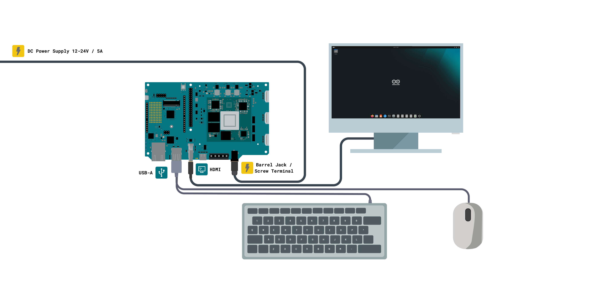

1. Connect the keyboard & mouse to the USB-A connectors
2. Connect the display to your board via the HDMI connector
3. Power the board, using the power supply connected to the barrel jack or screw terminals.
4. During the first setup, you will need to choose a password.

After selecting the password, you will see the home screen of your board, which should look like the picture below:

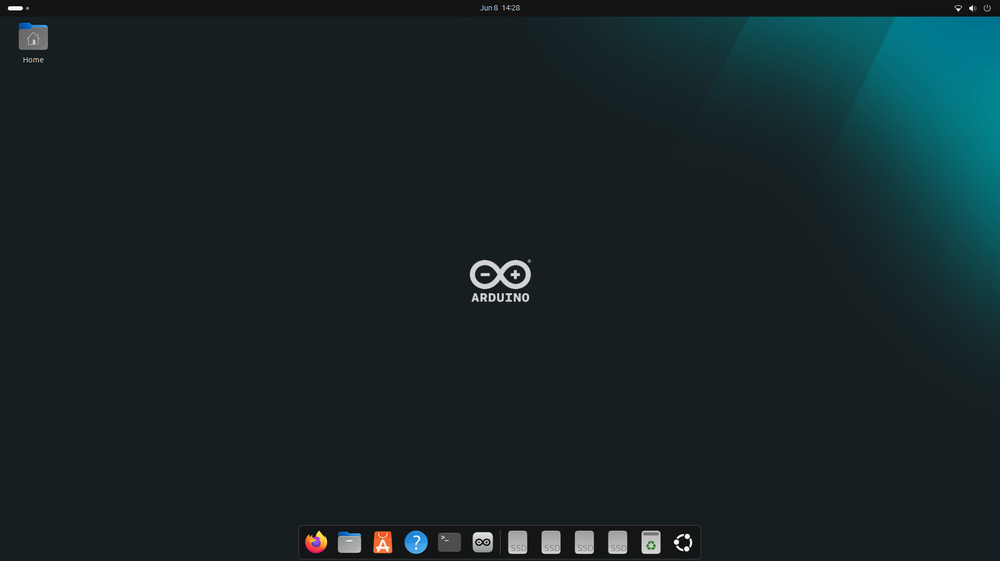

To launch Arduino App Lab, click the icon in the navbar:


The program will launch, and you will be ready to run the examples in the Arduino App Lab 🚀.

### Running an App at Startup

Apps can be configured to launch when VENTUNO Q is powered on. This is very useful when you are deploying a board.

1. Open your custom App (or the copy of an example).
2. Locate the App name in the top left corner.
3. Click the arrow (▼) next to the name to open the menu.
4. Toggle the **Run at startup** switch to the **ON** position.

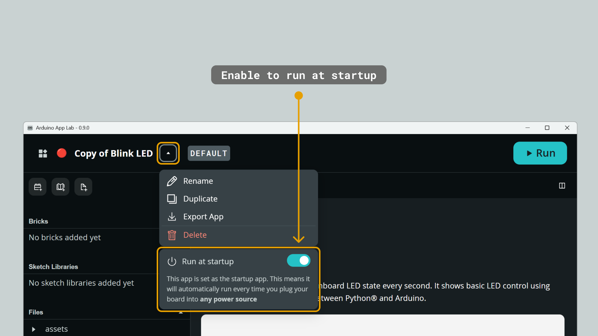

Once configured, a **DEFAULT** badge will appear next to your App's name, indicating it will run automatically upon boot.

<Alert type="info">Note that built-in examples cannot run on start up, you will need to click the "Copy and Edit App" button to use this feature.</Alert>

#### Advanced: Using the CLI

Alternatively, you can set the default app using the command line interface (CLI) inside the terminal:

```bash
arduino-app-cli properties set default user:<NAME_OF_YOUR_APP>
```

## Access via SSH or ADB (Terminal)

Another alternative to use the board is by accessing the board's terminal via `ssh` (local network) or `adb` (over USB-C®).

Note that to access via `ssh`, you will need to connect your board to your Wi-Fi® network, which can be done through the Arduino App Lab, or by accessing the board first via `adb`.

<Alert type="info">It is recommended to first complete the Arduino App Lab first configuration before connecting via ADB or SSH, as you will be able to set a password for your board, as well as connect to a Wi-Fi® network.</Alert>

### Access via ADB

Android Debug Bridge (ADB) is used to access the board over USB-C®, and can be installed on MacOS, Windows & Linux.

**MacOS**:

```bash
brew install android-platform-tools
```

**Windows:**

```bash
winget install Google.PlatformTools
```

**Linux:**

```bash
sudo apt-get install android-sdk-platform-tools
```

To access the VENTUNO Q over `adb`, open a terminal and run:

```bash
adb devices #lists connected devices
adb shell #access the board's shell
```

Once you are in, you can navigate the Ubuntu system through the terminal.

#### Connect to a Wi-Fi® Network

To enable `ssh` communication, your board will need to be connected to the same network as your host computer. To connect to a Wi-Fi® network, use the `nmtui` tool:

```bash
sudo nmtui
```

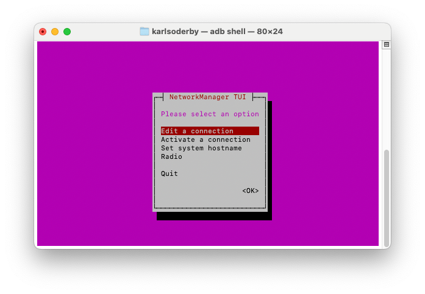

### Access via SSH

To access via `ssh`, the board needs to be connected to your local network. To connect to a network, you can either use Arduino App Lab, or access the board via `adb` and run `sudo nmtui` to select a network. When connected, you can also run `hostname -I` to obtain the IP address of the board (also available in the Arduino App Lab).

To connect to the board:

1. Run `ssh arduino@<ipaddress>` in a terminal
2. Type `yes` when asked to generate a fingerprint
3. Enter the password for your board

You are now able to use the board's shell over `ssh`.

### Run Apps via Arduino App CLI

With the Arduino App CLI we can launch Apps directly from the terminal. To test it out, let's use the `blink` example:

```bash
arduino-app-cli app start examples:blink
```

This should launch the App on your board, where an LED should start blinking after launching it.

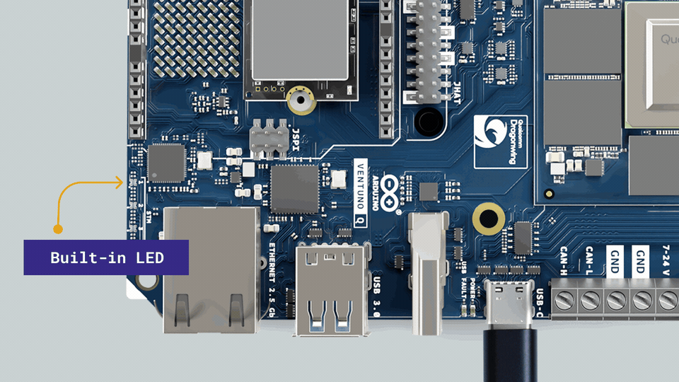

To see all the installed Apps (as well as user Apps), run the `arduino-app-cli app list` command. This will give a complete list.

## Arduino IDE (Beta)

The Arduino VENTUNO Q is compatible with the standard Arduino IDE, allowing you to program the microcontroller side (STM32) of the board using the familiar Arduino language and ecosystem.

<Alert type="info">To learn more about flashing the microcontroller using Arduino IDE, visit [this tutorial](/tutorials/ventuno-q/arduino-ide/).</Alert>

## Onboard User Interface

The VENTUNO Q offers an additional set of user interfaces for onboard control and feedback out of the box.

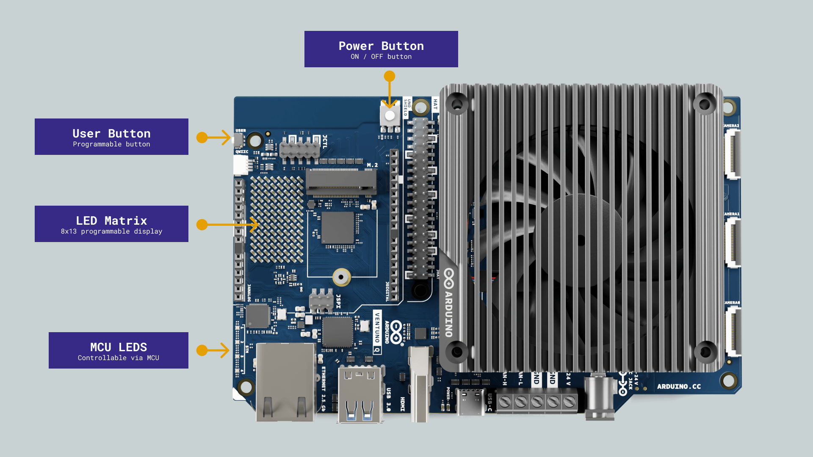

- **LED Matrix** - a 8x13 LED matrix for displaying animations, icons, text and more.
- **MCU LEDs** - 4x RGB LEDs that can be used for feedback.
- **Power Button** - for resetting the board.
- **User Button** - a programmable button.

### LED Matrix

The board features an 8×13 blue LED matrix that is managed by the MCU.

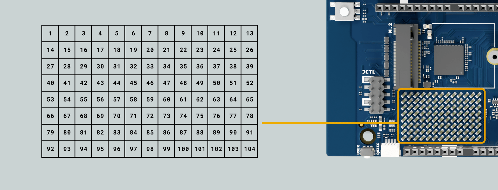

The LED Matrix is programmed on the MCU side, and can be used to display animations, icons, numbers and text (in scrolling format). The LED Matrix can also be used to create mini-games.

The Matrix is controlled through the `Arduino_LED_Matrix`, with a variety of methods for control. This library is built-in to the core ([ArduinoCore-zephyr](https://github.com/arduino/ArduinoCore-zephyr)) comes pre-installed on the STM32F5H5 MCU.

<Alert type="info">To learn more about controlling the LED Matrix, visit the [VENTUNO Q LED Matrix Guide](/tutorials/ventuno-q/led-matrix/).</Alert>

### RGB LEDs

The VENTUNO Q features 4x RGB LEDs which are connected to the STM32 microcontroller.

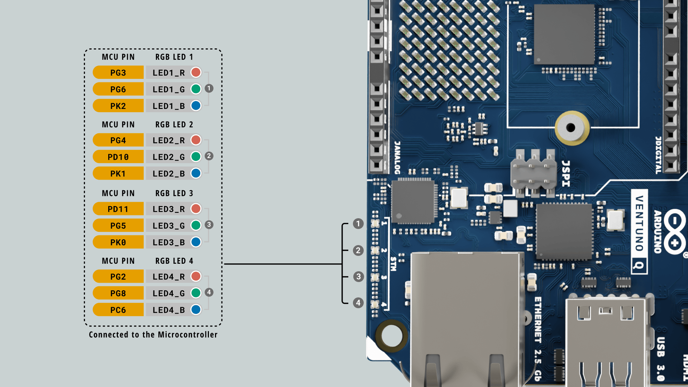

They can be controlled by setting the state of their respective GPIOs using the `digitalWrite` function as usual.

```arduino
void setup(){
  // Configure the pins as outputs
  pinMode(LED3_R, OUTPUT);
  pinMode(LED3_G, OUTPUT);
  pinMode(LED3_B, OUTPUT);
  // As they are active low, turn them OFF initially
  digitalWrite(LED3_R, HIGH);
  digitalWrite(LED3_G, HIGH);
  digitalWrite(LED3_B, HIGH);
}

void loop(){
  digitalWrite(LED3_R, LOW);  // Turn ON red segment
  digitalWrite(LED3_G, HIGH);
  digitalWrite(LED3_B, HIGH);
  delay(1000);
  digitalWrite(LED3_R, HIGH);
  digitalWrite(LED3_G, LOW);  // Turn ON green segment
  digitalWrite(LED3_B, HIGH);
  delay(1000);
  digitalWrite(LED3_R, HIGH);
  digitalWrite(LED3_G, HIGH);
  digitalWrite(LED3_B, LOW);  // Turn ON blue segment
  delay(1000);
}
```

To control them in the code, use the table below for reference:

| LED   | Red      | Green    | Blue     |
| :---- | :------- | :------- | :------- |
| LED 1 | `LED1_R` | `LED1_G` | `LED1_B` |
| LED 2 | `LED2_R` | `LED2_G` | `LED2_B` |
| LED 3 | `LED3_R` | `LED3_G` | `LED3_B` |
| LED 4 | `LED4_R` | `LED4_G` | `LED4_B` |

<Alert type="info">The RGB LEDs are active low, this means they turn ON with logic '0'.</Alert>

### Power Button

The VENTUNO Q features a **power button** that can be used to reboot the board.

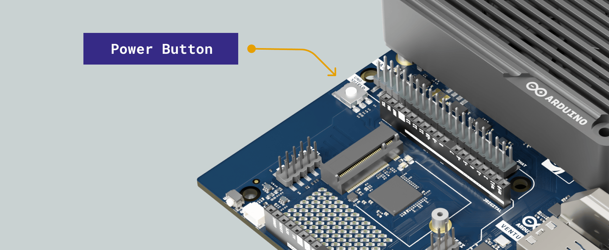

- **Long press**: the board is shut down completely when the button is pressed for **10+** seconds. It will remain off until power is disconnected and reconnected.

<Alert type="info">You do not need to press the power button for the board to power up, it boots automatically after being powered.</Alert>

### User Button

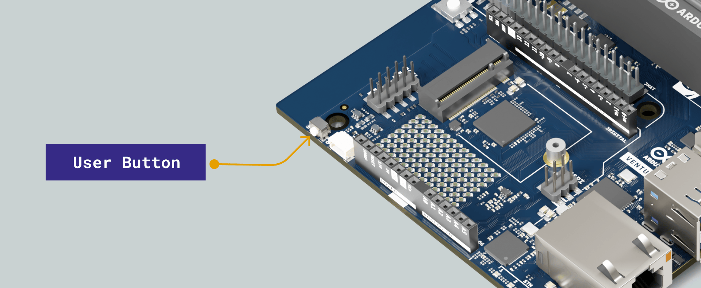

The **user button** on the VENTUNO Q is connected to `GPIO_79` on the Dragonwing™ QCS8275.

The button can be accessed using `gpiod`. For a quick test, run the following command on the board's terminal (access via `adb` or `ssh`):

```bash
gpiomon gpiochip2 79
```

You should see something akin to:

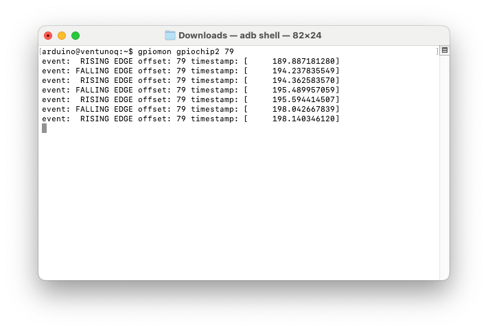

#### User Button Example Script

You can also write a Python script to access the user button.

1. Create a virtual environment: `python3 -m venv /path/to/venv`
2. Activate the virtual environment: `source /path/to/venv/bin/activate`
3. Install `gpiod`: `pip install gpiod`
4. Create a python script by running `nano user-button.py` and add the code from the example below to the script.
5. Save the script (CTRL+X while in edit mode).
6. Run it using `python3 user-button.py`

<Alert type="info">You can also run this script with a `--verbose` flag, e.g. `python3 user-button.py --verbose` to display more data regarding the button click.</Alert>

**user-button.py**

```python
import gpiod
import argparse
import sys
from gpiod.line import Direction, Edge, Bias

def main():
    parser = argparse.ArgumentParser(description="Monitor GPIO 79 Pushbutton")
    parser.add_argument('-v', '--verbose', action='store_true',
                        help="Print detailed event timestamps and types")
    args = parser.parse_args()

    CHIP_PATH = "/dev/gpiochip2"
    LINE_OFFSET = 79

    try:
        with gpiod.request_lines(
            CHIP_PATH,
            consumer="button-monitor",
            config={
                LINE_OFFSET: gpiod.LineSettings(
                    direction=Direction.INPUT,
                    edge_detection=Edge.BOTH,
                    bias=Bias.PULL_UP
                )
            },
        ) as request:

            if args.verbose:
                print(f"DEBUG: Monitoring {CHIP_PATH} line {LINE_OFFSET}")
                print("DEBUG: Waiting for events...")
            else:
                print("Ready! Press the button.")

            while True:
                # Wait for events
                if request.wait_edge_events():
                    for event in request.read_edge_events():

                        # VERBOSE MODE: Print everything
                        if args.verbose:
                            print(f"DEBUG Event: {event.event_type} | Timestamp: {event.timestamp_ns}ns")

                        # REGULAR MODE: Only print on "Falling" edge (the press)
                        else:
                            if event.event_type == gpiod.EdgeEvent.Type.FALLING_EDGE:
                                print("Button Pressed!")

    except PermissionError:
        print("Error: Permission denied. Try running with 'sudo'.")
    except KeyboardInterrupt:
        print("\nExiting...")
    except Exception as e:
        print(f"Unexpected Error: {e}")

if __name__ == "__main__":
    main()
```

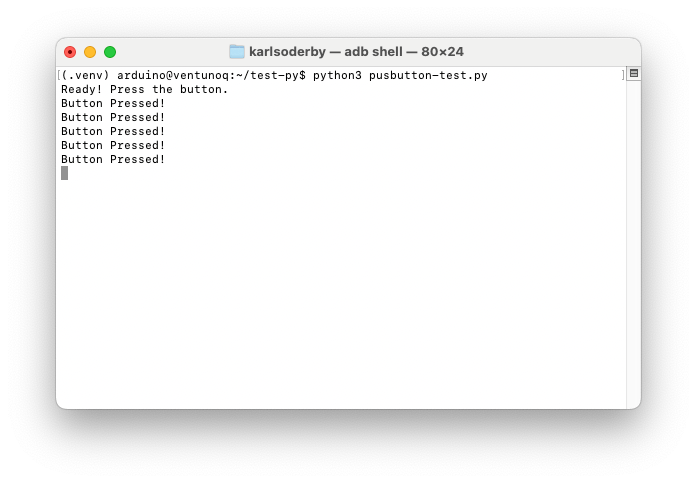

## UNO Header Pins

The VENTUNO Q features classic UNO-style headers on the top, which can be used for prototyping and debugging. These feature the familiar digital and analog pin headers present in older UNO versions, making them retro-compatible with shields based on the UNO form factor.

### Digital Pins

There are 22 digital pins from the MCU available through the UNO header (D0-D21) with the following functionality:

| MCU Pin  |   UNO Header    |    Pin Functionality    |
| :------: | :-------------: | :---------------------: |
|   PB11   |     D0 / RX     |     GPIO / UART RX      |
|   PB10   |     D1 / TX     |     GPIO / UART TX      |
|   PB0    |       D2        |          GPIO           |
|   PB1    |       D3        |    GPIO / OPAMP OUT     |
|   PB6    | D4 / FDCAN2_TX  |    GPIO / CAN Bus TX    |
|   PB5    | D5 / FDCAN2_RX  |    GPIO / CAN Bus RX    |
|   PB2    |       D6        |          GPIO           |
|   PB3    |       D7        |          GPIO           |
|   PB4    |       D8        |          GPIO           |
|   PB7    |       D9        |          GPIO           |
|   PB12   |    D10 / SS     |      GPIO / SPI CS      |
|   PB15   |   D11 / MOSI    |     GPIO / SPI MOSI     |
|   PB14   |   D12 / MISO    |     GPIO / SPI MISO     |
|   PB13   |    D13 / SCK    |     GPIO / SPI SCK      |
|   PA4    | D14 / A0 / DAC0 |    GPIO / ADC / DAC     |
|   PA5    | D15 / A1 / DAC1 |    GPIO / ADC / DAC     |
|   PE12   |    D16 / A2     | GPIO / ADC / OPAMP IN + |
|   PE13   |    D17 / A3     | GPIO / ADC / OPAMP IN - |
|   PE14   |    D18 / A4     |       GPIO / ADC        |
|   PE15   |    D19 / A5     |       GPIO / ADC        |
|   PH12   |       D20       |     GPIO / I2C SDA      |
|   PH11   |       D21       |     GPIO / I2C SCL      |

<Alert type="info">Notice that pins D14 to D19 also have analog capabilities.</Alert>

The digital pins of the VENTUNO Q can be used as inputs or outputs through the built-in functions of the Arduino programming language.

The configuration of a digital pin is done in the `setup()` function with the built-in function `pinMode()` as shown below:

```arduino
// Pin configured as an input
pinMode(pin, INPUT);
// Pin configured as an output
pinMode(pin, OUTPUT);
// Pin configured as an input, internal pull-up resistor enabled
pinMode(pin, INPUT_PULLUP);
```

The state of a digital pin, configured as an input, can be read using the built-in function `digitalRead()` as shown below:

```arduino
// Read pin state, store value in a state variable
state = digitalRead(pin);
```

The state of a digital pin, configured as an output, can be changed using the built-in function `digitalWrite()` as shown below:

```arduino
// Set pin on
digitalWrite(pin, HIGH);
// Set pin off
digitalWrite(pin, LOW);
```

<Alert type="info">To learn more, visit the [VENTUNO Q Microcontroller Examples - Digital I/O](/tutorials/ventuno-q/mcu-examples/#digital-pins).</Alert>

### Analog Pins

The VENTUNO Q features 6 analog pins in the **JANALOG** connector, with 6x ADC channels, 2x DAC channels and OPAMP.

<Alert type="info">Pin A0-A5 can be used as GPIOs, but not simultaneously as the other functionalities.</Alert>

#### Analog to Digital Converter (ADC)

In the **JANALOG** connector the VENTUNO Q has 6x 12-bit ADC pins mapped as follows:

| Microcontroller Pin | Arduino Pin Mapping |         Pin Functionality          |
| :-----------------: | :-----------------: | :--------------------------------: |
|         PA4         |         A0          |          GPIO / ADC / DAC          |
|         PA5         |         A1          |          GPIO / ADC / DAC          |
|        PE12         |         A2          | GPIO / ADC / OPAMP IN + / SPI SCK  |
|        PE13         |         A3          | GPIO / ADC / OPAMP IN - / SPI MISO |
|        PE14         |         A4          |       GPIO / ADC / SPI MOSI        |
|        PE15         |         A5          |             GPIO / ADC             |

Analog input pins can be used through the built-in functions of the Arduino programming language.

The VENTUNO Q ADC **resolution** can be configured between 12, 10, or 8 bits by using the `analogReadResolution(bits)` function:

```arduino
  // ADC resolution set to 12-bit (0 to 4095)
  analogReadResolution(12);
```

The default ADC **voltage reference** is 3.3V and can be changed by software using the function `analogReference()` with the following arguments:

| Analog Voltage Reference (V_REF+) |    Argument     |  Source  |
| :-------------------------------: | :-------------: | :------: |
|               1.5 V               | AR_INTERNAL1V5  | Internal |
|               1.8 V               | AR_INTERNAL1V8  | Internal |
|              2.048 V              | AR_INTERNAL2V05 | Internal |
|               2.5 V               | AR_INTERNAL2V5  | Internal |
|             2 V ~ VDD             |   AR_EXTERNAL   | External |

<Alert type="info">An external voltage reference can be provided through the AREF pin when `AR_EXTERNAL` reference is used.</Alert>

To set a different analog reference from the default one, see the following example:

```arduino
analogReference(AR_INTERNAL2V5);
```

<Alert type="info">To learn more, visit the [VENTUNO Q Microcontroller Examples - ADC](/tutorials/ventuno-q/mcu-examples/#analog-to-digital-converter-adc).</Alert>

#### Digital to Analog Converter (DAC)

The VENTUNO Q has two DAC outputs, mapped as follows:

| Microcontroller Pin | Arduino Pin Mapping | Pin Functionality |
| :-----------------: | :-----------------: | :---------------: |
|         PA4         |        DAC0         | GPIO / ADC / DAC  |
|         PA5         |        DAC1         | GPIO / ADC / DAC  |

The digital-to-analog converters of the VENTUNO Q can be used to output analog voltages through the built-in functions of the Arduino programming language.

The DAC output resolution can be configured from 8 to 12 bits using the `analogWriteResolution()` function as follows:

```arduino
// DAC resolution set to 12-bit (0 to 4095)
analogWriteResolution(12);  // enter the desired resolution in bits (8, 10, 12)
```

<Alert type="warning">**Warning:** The ADC and DAC cannot be used at the same time.</Alert>

<Alert type="info">To learn more, visit the [VENTUNO Q Microcontroller Examples - DAC](/tutorials/ventuno-q/mcu-examples/#digital-to-analog-converter-dac).</Alert>

### PWM Pins

The VENTUNO Q has 6x PWM (Pulse Width Modulation) pins, mapped as follows:

| Microcontroller Pin | Arduino Pin Mapping | Pin Functionality |
| :-----------------: | :-----------------: | :---------------: |
|         PB1         |         D3          |    GPIO / PWM     |
|         PB5         |         D5          |    GPIO / PWM     |
|         PB2         |         D6          |    GPIO / PWM     |
|         PB7         |         D9          |    GPIO / PWM     |
|        PB12         |         D10         |    GPIO / PWM     |
|        PB15         |         D11         |    GPIO / PWM     |

This functionality can be used with the built-in function `analogWrite()` as shown below:

```arduino
analogWrite(pin, value);
```

By default, the output resolution is **8 bits**, so the output value should be between 0 and 255. To set a greater resolution, do it using the built-in function `analogWriteResolution` as shown below:

```arduino
// PWM resolution set to 10-bit (0 to 4095)
analogWriteResolution(10);
```

<Alert type="info">To learn more, visit the [VENTUNO Q Microcontroller Examples - PWM](/tutorials/ventuno-q/mcu-examples/#pwm-example).</Alert>

## Connectors & Expansion Ports

### USB-C Connector

The VENTUNO Q features a USB-C connector that can be used for more than just programming and powering the board.

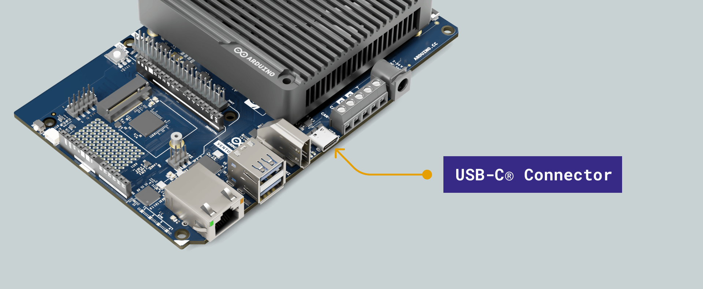

Below is a table with the main features of the USB-C connector that expands the VENTUNO Q capabilities.

| Feature            | Description                      |
| ------------------ | -------------------------------- |
| USB Power (Sink)   | Receive power, 9-20 VDC 3 A (PD) |
| USB Power (Source) | Provide power, 5 VDC 3 A (15 W)  |
| USB Standard       | USB 3.1 Gen 1 (5 Gb/s)           |
| Display over USB-C | DisplayPort                      |

<Alert type="info">The board can also power USB-C® peripherals, meaning it supports a Dual Role Power (DRP) specification. The board can both receive and provide power via its USB-C® port.</Alert>

By using a USB-C dongle (adapter/hub) you can also leverage the following features:

| Feature      | Description                                 |
| ------------ | ------------------------------------------- |
| Video Output | HDMI support                                |
| Video Input  | USB camera support                          |
| Audio        | USB or 3.5mm headset (speaker + microphone) |
| Ethernet     | Internet through Ethernet supported         |
| HID          | USB keyboard/mouse and other HID devices    |
| Storage      | External microSD card or USB drive support  |

### USB-A Connectors

The VENTUNO Q features two high-speed USB 3.0 Type-A ports, providing a familiar interface for connecting a wide range of standard peripherals directly to the Dragonwing™ QCS8275.

This connector is ideal for connecting a mouse & keyboard when using the board as an SBC, or for easy integration of cameras over USB.

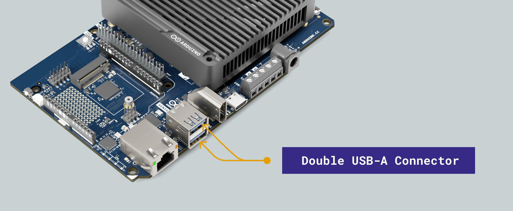

Below is a table with the main features of the USB-A connectors integrated into the VENTUNO Q.

| Feature      | Description                          |
| ------------ | ------------------------------------ |
| USB Standard | USB 3.0 (SuperSpeed)                 |
| Data Rate    | Up to 5 Gb/s                         |
| Quantity     | 2x Type-A Ports (plus 2x via header) |

By utilizing these ports, you can natively support various hardware categories to expand your edge AI applications:

| Feature      | Description                                |
| ------------ | ------------------------------------------ |
| Camera Input | USB 3.0 High-definition camera support     |
| Audio        | USB Soundcards and USB headsets            |
| HID          | Keyboard, mouse, and game controllers      |
| Storage      | External USB flash drives or SSDs          |
| Serial/COM   | Programming other boards or sensor modules |

### Qwiic

The VENTUNO Q features an onboard Qwiic connector that provides a simple, tool-free solution for connecting I²C devices. The Qwiic ecosystem, developed by SparkFun Electronics, has become an industry standard for rapid prototyping with I²C devices, allowing you to connect sensors, displays, and other peripherals without soldering or complex wiring.

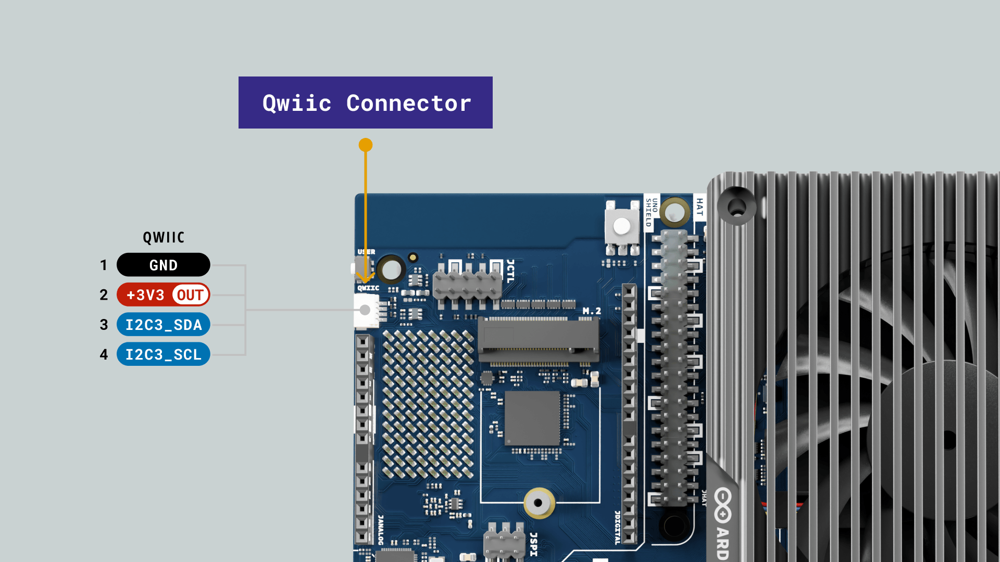

The Qwiic system’s key advantages include:

- **Plug-and-play connectivity**: No breadboards, jumper wires, or soldering required
- **Polarized connectors**: Prevents accidental reverse connections
- **Daisy-chain capability**: Connect multiple devices in series
- **Built-in pull-up resistors**: No external resistors needed
- **Standard pinout**: Compatible across all Qwiic ecosystem devices

<Alert type="info">The Qwiic connector on the VENTUNO Q is connected to the secondary I2C bus (I2C4), which uses the `Wire1` object rather than the `Wire` object. Please note that the Qwiic connector is 3.3 V only.</Alert>

The Qwiic connector allows you to interface our Modulino nodes for developing soldering-free projects.

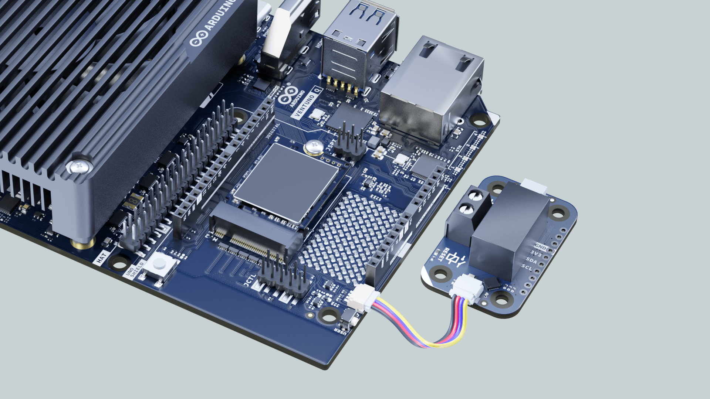

- See the full [Modulino family](https://www.arduino.cc/en/hardware/#modulino) where you will find a variety of **sensors** and **actuators** to expand your projects.
- Source code and API documentation for all Modulino nodes are available in the [Arduino_Modulino Github Repository](https://github.com/arduino-libraries/Arduino_Modulino)

### Ethernet Connector

The VENTUNO Q features a high-performance 2.5 Gbps RJ45 Ethernet port, providing ultra-fast wired networking capabilities essential for high-bandwidth edge AI tasks, such as streaming multiple video feeds or local server communication.

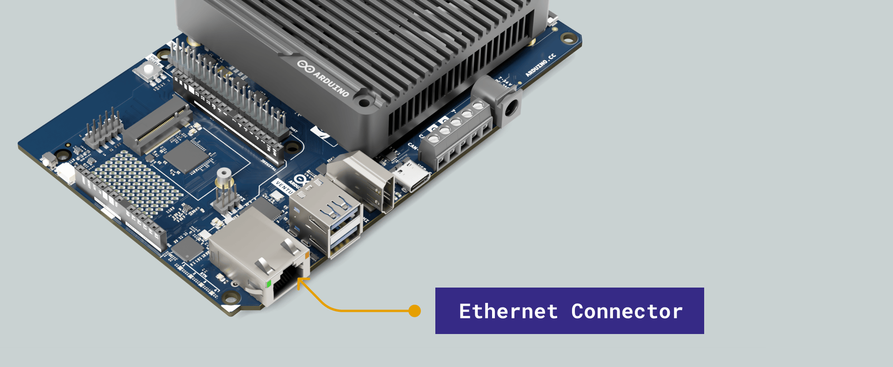

The networking subsystem is powered by a dedicated **QCA-8081 PHY** and a **TRJT9010A98NL** connector, ensuring stable industrial-grade connectivity.

| Feature        | Description                            |
| -------------- | -------------------------------------- |
| Interface      | RJ45 (8P8C)                            |
| Maximum Speed  | 2.5 Gbit/s (NBASE-T)                   |
| Controller/PHY | Qualcomm QCA-8081                      |
| Compatibility  | 10/100/1000/2500 Mbps auto-negotiation |

By leveraging the high-speed Ethernet port, the VENTUNO Q can be utilized for:

| Feature           | Description                                    |
| ----------------- | ---------------------------------------------- |
| High-Speed Uplink | Rapid data transfer to local servers or NAS    |
| Low Latency       | Real-time control in industrial environments   |
| Video Streaming   | Low-latency IP camera (RTSP/ONVIF) processing  |
| Network Boot      | Potential for PXE or network-based deployments |
| Secure Gateway    | Acting as a secure edge AI firewall/gateway    |

### HDMI

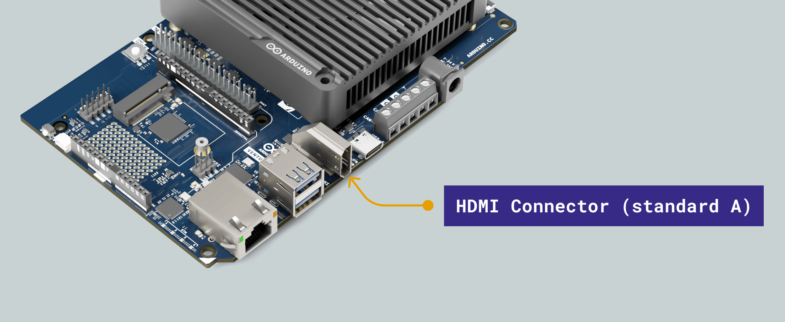

The VENTUNO Q features a full-size **HDMI Type A** connector vertically mounted on the board, directly connected to the Qualcomm Dragonwing™ QCS8275. It is muxed with the MIPI-DSI connector located on the [JMEDIA](#jmedia) header, meaning only one display output (HDMI or MIPI-DSI) can be active at a time.

The connector carries three TMDS differential data pairs (TX0–TX2) plus a differential clock, enabling high-quality digital video and audio output. It also includes DDC/I2C lines (SCL/SDA) for reading EDID data from the connected display, a CEC line for device control over the HDMI link, and a 5 V hot-plug detect signal (polyfuse protected at 500 mA).

| Feature         | Description                                |
| --------------- | ------------------------------------------ |
| Type            | HDMI Type A (19-pin)                       |
| Video signal    | 3× TMDS differential pairs + clock         |
| DDC / EDID      | I²C (SCL / SDA) for display identification |
| CEC             | Yes (Consumer Electronics Control)         |
| Hot-plug detect | Yes (5 V, 500 mA polyfuse protected)       |
| ESD protection  | Yes (TVS diodes on data and HPD lines)     |

### M.2 Connector

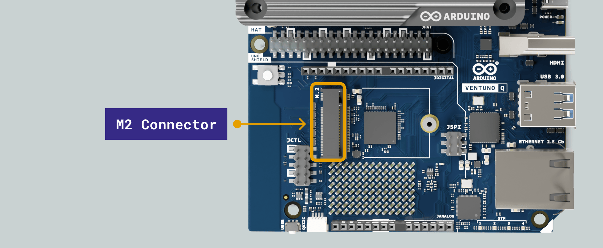

The VENTUNO Q features an **M-key M.2 slot** that provides high-speed storage expansion via a **PCIe Gen 4 x4** interface, directly connected to the Qualcomm Dragonwing™ QCS8275. This allows the board's base storage of 64 GB eMMC to be supplemented or exceeded with a fast NVMe drive.

After connecting additional memory, it will be made available in the Linux environment.

The connector exposes four PCIe Gen 4 differential TX/RX lane pairs, a reference clock, standard PCIe control signals (WAKE, CLKREQ, RST), and an SMBus interface for device management.

| Feature     | Description             |
| ----------- | ----------------------- |
| Key type    | M-key                   |
| Interface   | PCIe Gen 4 x4           |
| SMBus       | Yes (device management) |
| Power rails | 3.3 V, 1.8 V            |

<Alert type="warning">**Warning:** Make sure that the VENTUNO Q is powered OFF when connecting any external devices.</Alert>

#### Compatible Devices

The M.2 M-key slot is compatible with **NVMe SSDs** in the **2230** form factor only. The mounting standoff is positioned for 2230 modules, so larger drives (2242, 2260, 2280) cannot be secured with the retention screw.

| Form Factor | Dimensions    | Common Use        |
| ----------- | ------------- | ----------------- |
| 2230        | 22 mm × 30 mm | Compact NVMe SSDs |

<Alert type="note">
The M-key slot supports only **PCIe (NVMe)** drives. SATA-based M.2 drives are **not** compatible.
</Alert>

### RPi 40-Pin Header

The board features a 40-pin male header for easy integration with RPi "hats". The pins are connected to the Dragonwing™ QCS8275 using level translators between the MPU (1.8 V) to the header (3.3 V).

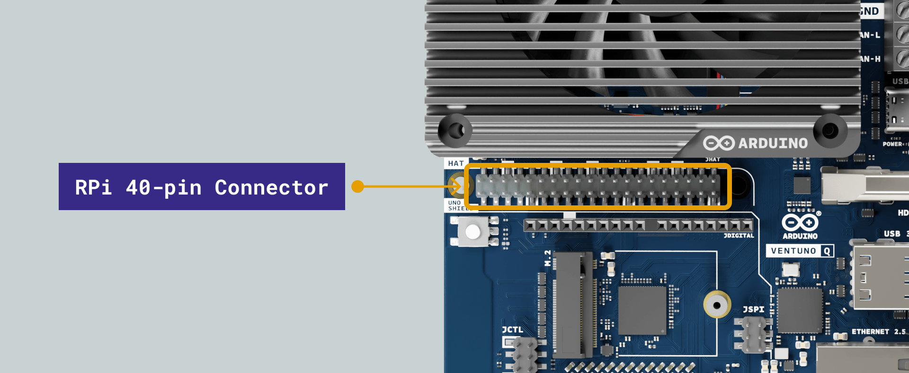

> Note that the header features 2x **5V pins** to match the RPi hat standard. Proceed with caution if manually connecting any jumpers as the board operates on both 5 V and 3.3 V.

The pin header features 28 connected GPIOs, listed below:

| Pin No. | Dragonwing™ QCS8275 (MPU) | Function   |
| ------- | ------------------------- | ---------- |
| 1       | -                         | +3V3       |
| 2       | -                         | +5V        |
| 3       | MD_GPIO_17                | SE0_SDA    |
| 4       | -                         | +5V        |
| 5       | MD_GPIO_18                | SE0_SCL    |
| 6       | -                         | GND        |
| 7       | MD_GPIO_83                | GPIO       |
| 8       | MD_GPIO_86                | SE2_TX     |
| 9       | -                         | GND        |
| 10      | MD_GPIO_87                | SE2_RX     |
| 11      | MD_GPIO_85                | SE2_RFR    |
| 12      | MD_GPIO_116               | I2S1_SCK   |
| 13      | MD_GPIO_109               | GPIO       |
| 14      | -                         | GND        |
| 15      | MD_GPIO_90                | GPIO       |
| 16      | MD_GPIO_105               | GPIO       |
| 17      | -                         | +3V3       |
| 18      | MD_GPIO_106               | GPIO       |
| 19      | MD_GPIO_26                | SE3_MOSI   |
| 20      | -                         | GND        |
| 21      | MD_GPIO_25                | SE3_MISO   |
| 22      | MD_GPIO_107               | GPIO       |
| 23      | MD_GPIO_27                | SE3_SCK    |
| 24      | MD_GPIO_28                | SE3_CS     |
| 25      | -                         | GND        |
| 26      | MD_GPIO_88                | GPIO       |
| 27      | MD_GPIO_19                | SE1_SDA    |
| 28      | MD_GPIO_20                | SE1_SCL    |
| 29      | MD_GPIO_89                | GPIO       |
| 30      | -                         | GND        |
| 31      | MD_GPIO_80                | GPIO       |
| 32      | MD_GPIO_77                | GPIO       |
| 33      | MD_GPIO_81                | GPIO       |
| 34      | -                         | GND        |
| 35      | MD_GPIO_117               | I2S1_WS    |
| 36      | MD_GPIO_84                | SE2_CTS    |
| 37      | MD_GPIO_108               | GPIO       |
| 38      | MD_GPIO_118               | I2S1_DATA0 |
| 39      | -                         | GND        |
| 40      | MD_GPIO_119               | I2S1_DATA1 |

<Alert type="note">
Note that the following pins are not available on JHAT while Bluetooth® is in use, neither as UART nor as GPIO:

- **Pin 8** (UART TX, `MD_GPIO_86`)
- **Pin 10** (UART RX, `MD_GPIO_87`)
- **Pin 11** (UART RFR, `MD_GPIO_85`)
- **Pin 36** (UART CTS, `MD_GPIO_84`)

These four pins are level-translated to 3.3 V for the JHAT connector, but on the 1.8 V side (before translation) they are shared with the UART used between the MPU and the onboard Wi-Fi®/Bluetooth® module, including flow control. Whenever Bluetooth® is active, this UART link claims all four pins, making them unavailable for external HAT use.
</Alert>

### MIPI / CSI Camera


<Alert type="info">**Note:** Currently, only the IMX577 camera module is supported.</Alert>

The VENTUNO Q features **three dedicated MIPI CSI-2 camera connectors** (CAMERA0, CAMERA1, CAMERA2), each driven by the Qualcomm Spectra 692 ISP inside the Dragonwing™ QCS8275. This allows simultaneous connection of up to three independent cameras for multi-camera edge AI applications such as stereo vision, 360° capture, or multi-angle object detection.

Each connector is a **22-pin FPC connector** (TF31-22S-0.5SH, 0.5 mm pitch) carrying a full **4-lane MIPI CSI-2** interface, an I²C control bus, one GPIO control line, and a 3.3 V power rail. ESD protection is provided on all high-speed data lanes (RCLAMP0524TCT) and on the power and I²C lines (DF2B7ASL,L3F).

| Connector | Label   | Interface         | Control                | Power |
| --------- | ------- | ----------------- | ---------------------- | ----- |
| J3_1      | CAMERA2 | MIPI CSI-2 4-lane | I²C4 + 1× GPIO (3.3 V) | 3.3 V |
| J3_3      | CAMERA1 | MIPI CSI-2 4-lane | I²C2 + 1× GPIO (3.3 V) | 3.3 V |
| J3_2      | CAMERA0 | MIPI CSI-2 4-lane | I²C0 + 1× GPIO (3.3 V) | 3.3 V |

The GPIO line on each connector (Pin 17) are typically used for camera reset and power-enable control. The I²C bus (SCL/SDA, 3.3 V) is used to configure the camera sensor registers.

### Install Gstreamer

To use a camera connected via MIPI/CSI, we need to use a specific version of `gstreamer`, more specifically `gstreamer1.0-plugins-qcom`.

To install this package, open a shell on your board (either via `ssh`, `adb` or opening a terminal in SBC mode), and install the package.

```bash
sudo apt update 
sudo apt upgrade -y
sudo apt install gstreamer1.0-plugins-qcom -y
```

Connect the camera to your board, and **reboot** the board after the installation. Then open a new shell on the board, and run:

```bash
sudo dmesg | grep Probe
```

You should see something akin to:

```bash
[   28.182686] CAM_INFO: CAM-SENSOR: cam_sensor_driver_cmd: 1250: Probe failed for cmk_imx577 slot:23, slave_addr:0x34, sensor_id:0x577
[   28.213671] CAM_INFO: CAM-SENSOR: cam_sensor_driver_cmd: 1250: Probe failed for cmk_imx577 slot:24, slave_addr:0x34, sensor_id:0x577
[   28.231128] CAM_INFO: CAM-SENSOR: cam_sensor_driver_cmd: 1250: Probe failed for cmk_imx577 slot:25, slave_addr:0x34, sensor_id:0x577
[   28.268640] CAM_INFO: CAM-SENSOR: cam_sensor_driver_cmd: 1290: Probe success for cmk_imx577 slot:26,slave_addr:0x34,sensor_id:0x577
[   28.688703] CAM_INFO: CAM-SENSOR: cam_sensor_driver_cmd: 1250: Probe failed for cmk_imx577 slot:27, slave_addr:0x34, sensor_id:0x577
```

Look for the `Probe success` line (in this case, the 4th entry).

This means the camera is identified and is working.

### Capture a Video Recording

With the above steps completed, we can now test out recording a video stream.

Run the following command. This will start a recording. End the recording with `CTRL + C`. The video file will be found in the same directory the command was run from (or if specified differently with the `location` flag).

```bash
gst-launch-1.0 -e qtiqmmfsrc camera=0 name=camsrc video_0::type=preview ! video/x-raw,format=NV12_Q08C,width=3840,height=2160,framerate=30/1,interlace-mode=progressive,colorimetry=bt601 ! queue ! v4l2h264enc capture-io-mode=4 output-io-mode=5 ! h264parse ! mp4mux ! queue ! filesink location=capture.mp4
```

### Live Stream on Board

To set up a simple live stream of the camera, you can use the following Python script.

<Alert type="note" text="note">
Note that you need a display via HDMI connected to the VENTUNO Q to use this example.
</Alert>

```python
import signal
import sys
import time

import gi

gi.require_version("Gst", "1.0")
from gi.repository import Gst, GLib

PIPELINE_DESC = (
    "qtiqmmfsrc camera=0 name=camsrc video_0::type=preview ! "
    "video/x-raw,format=NV12_Q08C,width=1920,height=1080,framerate=30/1,"
    "interlace-mode=progressive,colorimetry=bt601 ! "
    "queue ! v4l2h264enc capture-io-mode=4 output-io-mode=5 ! h264parse ! "
    "v4l2h264dec ! video/x-raw,format=NV12 ! "
    "queue ! waylandsink name=sink sync=false"
)

PRINT_INTERVAL_S = 1.0


def main():
    Gst.init(None)
    pipeline = Gst.parse_launch(PIPELINE_DESC)
    sink = pipeline.get_by_name("sink")
    sinkpad = sink.get_static_pad("sink")

    last_print = [0.0]

    def on_probe(pad, info):
        buf = info.get_buffer()
        if buf is None or buf.pts == Gst.CLOCK_TIME_NONE:
            return Gst.PadProbeReturn.OK

        now_wall = time.monotonic()
        if now_wall - last_print[0] < PRINT_INTERVAL_S:
            return Gst.PadProbeReturn.OK
        last_print[0] = now_wall

        clock = pipeline.get_clock()
        if clock is None:
            return Gst.PadProbeReturn.OK
        running_time = clock.get_time() - pipeline.get_base_time()
        latency_ms = (running_time - buf.pts) / 1e6
        print(f"latency (capture -> encode -> decode -> display): {latency_ms:.2f} ms")
        return Gst.PadProbeReturn.OK

    sinkpad.add_probe(Gst.PadProbeType.BUFFER, on_probe)

    loop = GLib.MainLoop()

    def on_bus_message(bus, message):
        t = message.type
        if t == Gst.MessageType.ERROR:
            err, debug = message.parse_error()
            print(f"gst error: {err} ({debug})", file=sys.stderr)
        elif t == Gst.MessageType.EOS:
            loop.quit()
        return True

    bus = pipeline.get_bus()
    bus.add_signal_watch()
    bus.connect("message", on_bus_message)

    def shutdown():
        print("\nstopping...")
        pipeline.set_state(Gst.State.NULL)
        loop.quit()
        return GLib.SOURCE_REMOVE

    GLib.unix_signal_add(GLib.PRIORITY_DEFAULT, signal.SIGINT, shutdown)

    pipeline.set_state(Gst.State.PLAYING)
    try:
        loop.run()
    finally:
        pipeline.set_state(Gst.State.NULL)


if __name__ == "__main__":
    main()
```

After running the example, you should see the logs in the terminal (latency), and a screen should appear on your display.

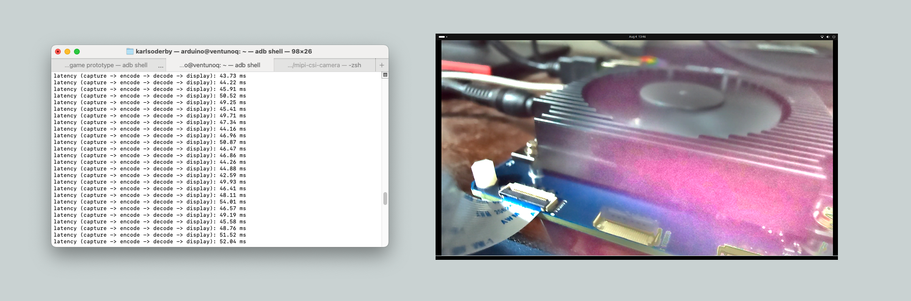

### CAN-FD

The board supports the Controller Area Network Flexible Data-Rate (CAN-FD) protocol, with dedicated screw terminals (CAN-H and CAN-L).

The board features the **ATA6563** CAN transceiver (Physical Layer / PHY), that is connected to the STM32H5F5. The STM32H5F5 has three FDCAN interfaces with multiplexer options to route them to the physical CAN transceiver.

The CAN bus is accessed in the Linux OS, which is interacting with the MCU through a pre-loaded firmware handling CAN communication. This means that no user sketch is required to interface with a CAN bus.

To interact with the CAN bus, first set it up using the following commands in the shell (using e.g. `adb` or `ssh` or terminal directly on the board):

Install `can-utils`:

```bash
sudo apt-get update
sudo apt-get install can-utils
```

Configure the CAN bus:

```bash
sudo ip li set can0 down # the interface must be down to configure it
sudo ip li set can0 type can bitrate 500000 # CAN 2.0
sudo ip link set can0 type can bitrate 500000 dbitrate 2000000 fd on # CAN-FD (Flexible Data-Rate)
sudo ip li set can0 up
```

<Alert type="info">**Note:** The CAN physical bitrate limit is 5 Mbps.</Alert>

To send a message to the bus, use the following format:

```bash
cansend <device> <can_frame>
```

- The `<device>` can be: `can0`, `can1` or `can2`. (`can0` is the one exposed through the Screw Terminal (PHY))
- The `<can_frame>` follow the structure below:

| Structure                 | Note                              |
| :------------------------ | :-------------------------------- |
| `<can_id>#{data}`         | for Classical CAN 2.0 data frames |
| `<can_id>#R{len}`         | for Classical CAN 2.0 data frames |
| `<can_id>#{data}_{dlc}`   | for Classical CAN 2.0 data frames |
| `<can_id>#R{len}_{dlc}`   | for Classical CAN 2.0 data frames |
| `<can_id>##<flags>{data}` | for CAN FD frames                 |

Transmitting example:

```bash
cansend can0 123#DEADBEEF
```

To listen to the CAN bus, use:

```bash
candump can0
```

#### Screw Terminal Pinout

The screw terminal pins are directly connected with the CAN_PHY (ATA6563) via the `FDCAN1_RX` and `FDCAN1_TX`.

| Screw Terminal | Description  | CAN PHY   | MCU Pins |
| :------------- | :----------- | :-------- | :------- |
| CAN-H          | CAN High Bus | FDCAN1_RX | PD0      |
| CAN-L          | CAN Low Bus  | FDCAN1_TX | PD1      |

#### CAN Interfaces

| CAN Bus   | MCU Pin | JOMEGA Header Pin |             Note             |
| :-------- | :------ | :---------------: | :--------------------------: |
| FDCAN1_TX | PD0\*   |                   | \*Exposed via Screw Terminal |
| FDCAN1_RX | PD1\*   |                   | \*Exposed via Screw Terminal |
| FDCAN1_TX | PD5     |      Pin 86       |          Shared Bus          |
| FDCAN1_RX | PI9     |      Pin 88       |          Shared Bus          |
| FDCAN2_TX | PA10    |      Pin 92       |                              |
| FDCAN2_RX | PD9     |      Pin 94       |                              |
| FDCAN3_TX | PF6     |      Pin 98       |                              |
| FDCAN3_RX | PF7     |      Pin 100      |                              |

#### CAN Transceiver Connections

| Pin No. | Transceiver Pin | Signal      | Connection     | Logic Level |
| :-----: | :-------------- | :---------- | :------------- | :---------: |
|    1    | TXD             | CAN TX      | MCU PD1        |    3.3 V    |
|    2    | GND             | Ground      | GND            |      -      |
|    3    | VCC             | Power       | +5 V           |      -      |
|    4    | RXD             | CAN RX      | MCU PD0        |    3.3 V    |
|    5    | VIO             | MCU Voltage | Reference      |    3.3 V    |
|    6    | CANL            | CAN Low     | Screw Terminal |  Bus Level  |
|    7    | CANH            | CAN High    | Screw Terminal |  Bus Level  |
|    8    | STBY            | Standby     | MCU PI11       |    3.3 V    |
|    9    | GND             | Ground      | GND            |      -      |

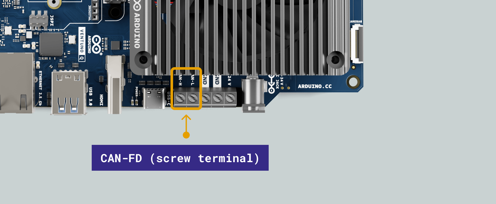

### UNO Carrier Headers / Connectors

The board features a unique set of headers that can expand your board's functionalities.

#### JMEDIA

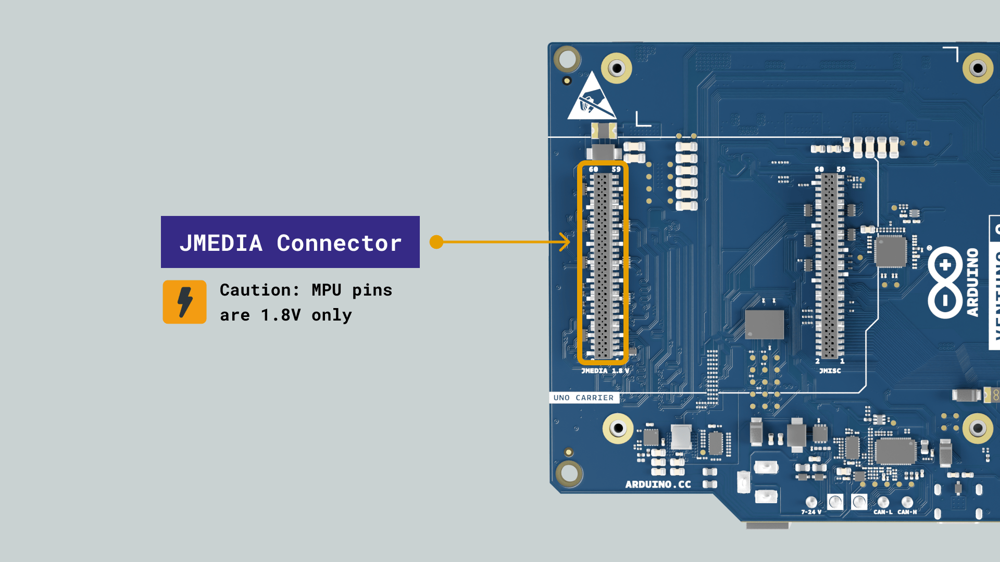

The JMEDIA connector is located on the bottom side of the board and is operating on **1.8V**. The pins on the connector is directly connected to the Dragonwing™ QCS8275, with pin table available below. This connector is primarily designed to be used with accessories to extend the board's functionalities.

| JMEDIA Pin | Signal (Dragonwing™ QCS8275) | GPIO    |
| :--------: | :--------------------------- | :------ |
|   Pin 1    | GND                          |         |
|   Pin 2    | GND                          |         |
|   Pin 3    | MIPI_DSI0_CLK_M              |         |
|   Pin 4    | MIPI_DSI0_L1_P               |         |
|   Pin 5    | MIPI_DSI0_CLK_P              |         |
|   Pin 6    | MIPI_DSI0_L1_M               |         |
|   Pin 7    | GND                          |         |
|   Pin 8    | GND                          |         |
|   Pin 9    | MIPI_DSI0_L2_M               |         |
|   Pin 10   | MIPI_DSI0_L0_P               |         |
|   Pin 11   | MIPI_DSI0_L2_P               |         |
|   Pin 12   | MIPI_DSI0_L0_M               |         |
|   Pin 13   | GND                          |         |
|   Pin 14   | GND                          |         |
|   Pin 15   | MIPI_DSI0_L3_M               |         |
|   Pin 16   | SOC_CAM_MCLK0                | GPIO_67 |
|   Pin 17   | MIPI_DSI0_L3_P               |         |
|   Pin 18   | SOC_CAM_MCLK1                | GPIO_68 |
|   Pin 19   | GND                          |         |
|   Pin 20   | GND                          |         |
|   Pin 21   | CSI0_C0_LN0_M                |         |
|   Pin 22   | CCI_I2C2_SDA1                | GPIO_59 |
|   Pin 23   | CSI0_B0_LN0_P                |         |
|   Pin 24   | CCI_I2C2_SCL1                | GPIO_60 |
|   Pin 25   | GND                          |         |
|   Pin 26   | GND                          |         |
|   Pin 27   | CSI0_B1_LN1_M                |         |
|   Pin 28   | CSI1_B2_LN3_P                |         |
|   Pin 29   | CSI0_A1_LN1_P                |         |
|   Pin 30   | CSI1_C2_LN3_M                |         |
|   Pin 31   | GND                          |         |
|   Pin 32   | GND                          |         |
|   Pin 33   | CSI0_A0_CLK_M                |         |
|   Pin 34   | CSI1_C1_LN2_P                |         |
|   Pin 35   | CSI0_NC_CLK_P                |         |
|   Pin 36   | CSI1_A2_LN2_M                |         |
|   Pin 37   | GND                          |         |
|   Pin 38   | GND                          |         |
|   Pin 39   | CSI0_A2_LN2_M                |         |
|   Pin 40   | CSI1_NC_CLK_P                |         |
|   Pin 41   | CSI0_C1_LN2_P                |         |
|   Pin 42   | CSI1_A0_CLK_M                |         |
|   Pin 43   | GND                          |         |
|   Pin 44   | GND                          |         |
|   Pin 45   | CSI0_C2_LN3_M                |         |
|   Pin 46   | CSI1_A1_LN1_P                |         |
|   Pin 47   | CSI0_B2_LN3_P                |         |
|   Pin 48   | CSI1_B1_LN1_M                |         |
|   Pin 49   | GND                          |         |
|   Pin 50   | GND                          |         |
|   Pin 51   | CCI_I2C0_SCL1                | GPIO_58 |
|   Pin 52   | CSI1_B0_LN0_P                |         |
|   Pin 53   | CCI_I2C0_SDA1                | GPIO_57 |
|   Pin 54   | CSI1_C0_LN0_M                |         |
|   Pin 55   | GND                          |         |
|   Pin 56   | GND                          |         |
|   Pin 57   | VIN (IN, 1.5 A max)          |         |
|   Pin 58   | +3V3 (OUT)                   |         |
|   Pin 59   | VIN (IN, 1.5 A max)          |         |
|   Pin 60   | +3V3 (OUT)                   |         |

#### JMISC

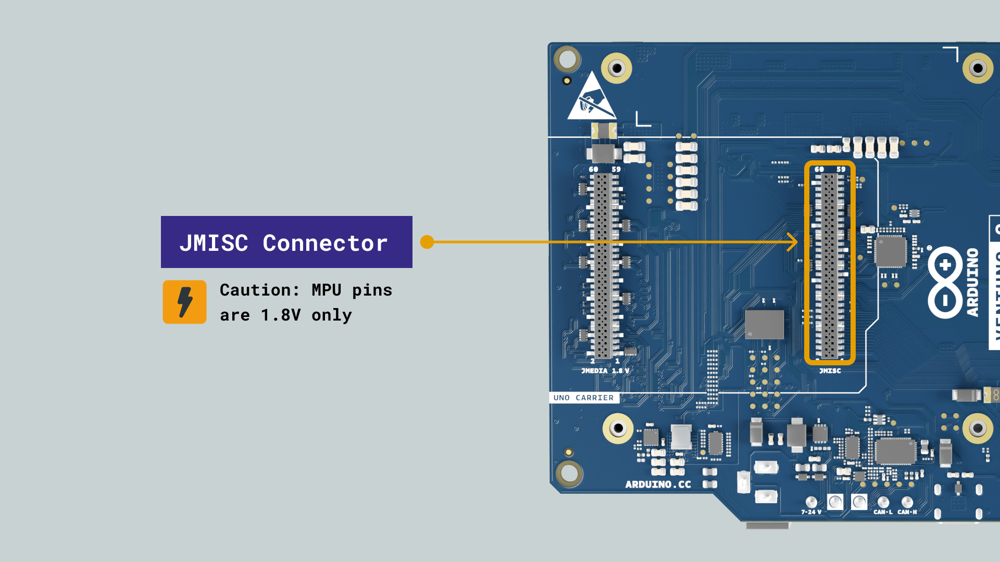

The **JMISC** header is connected to several key components on the board, including:

- STM32H5F5 (MCU)
- Dragonwing™ QCS8275 (MPU)
- Audio Codec (MAX98091)

This connector is also used to extend functionalities of the board, and is also used in combination when connecting carriers.

| JMISC Pin | Signal          | GPIO / Function |
| :-------: | :-------------- | :-------------- |
|   Pin 1   | MCU_PSSI_D0     | PA9             |
|   Pin 2   | MCU_TRACE_CLK   | PE2             |
|   Pin 3   | MCU_PSSI_D1     | PC7             |
|   Pin 4   | MCU_TRACE_D0    | PE3             |
|   Pin 5   | MCU_PSSI_D2     | PC8             |
|   Pin 6   | MCU_TRACE_D1    | PE4             |
|   Pin 7   | MCU_PSSI_D3     | PE1             |
|   Pin 8   | MCU_TRACE_D2    | PE5             |
|   Pin 9   | MCU_PSSI_D4     | PC11            |
|  Pin 10   | MCU_TRACE_D3    | PE6             |
|  Pin 11   | MCU_PSSI_D5     | PD3             |
|  Pin 12   | MCU_USART2_RX   | PE7             |
|  Pin 13   | MCU_PSSI_D6     | PF4             |
|  Pin 14   | MCU_USART2_TX   | PE8             |
|  Pin 15   | MCU_PSSI_D7     | PI7             |
|  Pin 16   | MCU_I2C2_SCL    | PF1             |
|  Pin 17   | MCU_PSSI_PDCK   | PA6             |
|  Pin 18   | MCU_I2C2_SDA    | PF0             |
|  Pin 19   | MCU_PSSI_RDY    | PI5             |
|  Pin 20   | MCU_GPIO_PA0    | PA0             |
|  Pin 21   | MCU_PSSI_DE     | PH8             |
|  Pin 22   | MCU_GPIO_PA1    | PA1             |
|  Pin 23   | MCU_UART4_RX    | PA11            |
|  Pin 24   | MCU_GPIO_PA2    | PA2             |
|  Pin 25   | MCU_UART4_TX    | PA12            |
|  Pin 26   | GND             |                 |
|  Pin 27   | GND             |                 |
|  Pin 28   | EAR_P           |                 |
|  Pin 29   | MIC_IN+         |                 |
|  Pin 30   | EAR_M           |                 |
|  Pin 31   | MIC_IN-         |                 |
|  Pin 32   | LINEOUT_P       |                 |
|  Pin 33   | MIC_BIAS        |                 |
|  Pin 34   | LINEOUT_M       |                 |
|  Pin 35   | GND             |                 |
|  Pin 36   | HPH_L           |                 |
|  Pin 37   | SOC_GPIO_10_SE0 | MISO            |
|  Pin 38   | HPH_R           |                 |
|  Pin 39   | SOC_GPIO_11_SE0 | MOSI            |
|  Pin 40   | HPH_REF         |                 |
|  Pin 41   | SOC_GPIO_12_SE0 | SCK             |
|  Pin 42   | HS_DET          |                 |
|  Pin 43   | SOC_GPIO_13_SE0 | CS0             |
|  Pin 44   | GND             |                 |
|  Pin 45   | SOC_GPIO_15_SE0 | CS2             |
|  Pin 46   | SOC_GPIO_120    | I2S2_SCK        |
|  Pin 47   | SOC_GPIO_14_SE0 | CS1             |
|  Pin 48   | SOC_GPIO_121    | I2S2_WS         |
|  Pin 49   | SOC_GPIO_73     |                 |
|  Pin 50   | SOC_GPIO_122    | I2S2_DATA0      |
|  Pin 51   | SOC_GPIO_74     |                 |
|  Pin 52   | SOC_GPIO_123    | I2S2_DATA1      |
|  Pin 53   | +3V3 (OUT)      |                 |
|  Pin 54   | +5V USB (OUT)   |                 |
|  Pin 55   | +3V3 (OUT)      |                 |
|  Pin 56   | +5V USB (OUT)   |                 |
|  Pin 57   | +1V8 (OUT)      |                 |
|  Pin 58   | GND             |                 |
|  Pin 59   | SOC_VCOIN (IN)  | MCU_VBAT        |
|  Pin 60   | NC              |                 |

<Alert type="note">
Pin 59 (SOC_VCOIN / MCU_VBAT) is an RTC backup battery input, accepting a battery of up to 3.3 V. It only powers the real-time clocks on the MPU and MCU so they keep time while the board is unpowered — by "backup" we don't mean backup power for the rest of the board. Expected current draw is very low.
</Alert>

### JOMEGA Expansion Header

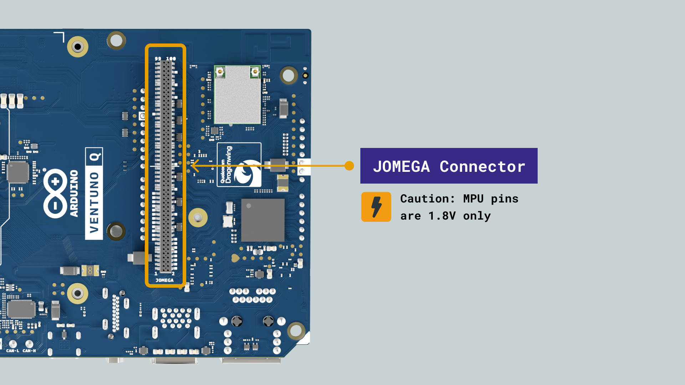

The **JOMEGA** header is an advanced 100-pin high-density connector that is connected to various components on the board:

- USB Host Controller (TUSB7340)
- STM32H5F5 (MCU)
- Dragonwing™ QCS8275 (MPU)
- Audio Codec (MAX98091)

The header is designed for expanding functionalities to accessories, with pins dedicated to USB, SPI & CAN communication, as well as JTAG. Below is a pin table to get familiar with the header:

| JOMEGA Pin | Signal          | GPIO / Function |
| :--------: | :-------------- | :-------------- |
|   Pin 1    | VIN (IN)        |                 |
|   Pin 2    | GND             |                 |
|   Pin 3    | VIN (IN)        |                 |
|   Pin 4    | GND             |                 |
|   Pin 5    | VIN (IN)        |                 |
|   Pin 6    | GND             |                 |
|   Pin 7    | VIN (IN)        |                 |
|   Pin 8    | GND             |                 |
|   Pin 9    | VIN (IN)        |                 |
|   Pin 10   | GND             |                 |
|   Pin 11   | VIN (IN)        |                 |
|   Pin 12   | GND             |                 |
|   Pin 13   | VIN (IN)        |                 |
|   Pin 14   | GND             |                 |
|   Pin 15   | GND             |                 |
|   Pin 16   | GND             |                 |
|   Pin 17   | GND             |                 |
|   Pin 18   | USB1_SS_TX_P    |                 |
|   Pin 19   | GND             |                 |
|   Pin 20   | USB1_SS_TX_N    |                 |
|   Pin 21   | GND             |                 |
|   Pin 22   | GND             |                 |
|   Pin 23   | GND             |                 |
|   Pin 24   | USB1_HS_D_P     |                 |
|   Pin 25   | GND             |                 |
|   Pin 26   | USB1_HS_D_N     |                 |
|   Pin 27   | GND             |                 |
|   Pin 28   | GND             |                 |
|   Pin 29   | GND             |                 |
|   Pin 30   | USB1_SS_RX_P    |                 |
|   Pin 31   | GND             |                 |
|   Pin 32   | USB1_SS_RX_N    |                 |
|   Pin 33   | GND             |                 |
|   Pin 34   | GND             |                 |
|   Pin 35   | GND             |                 |
|   Pin 36   | USB2_SS_TX_P    |                 |
|   Pin 37   | GND             |                 |
|   Pin 38   | USB2_SS_TX_N    |                 |
|   Pin 39   | MCU_GPIO_PC0    |                 |
|   Pin 40   | GND             |                 |
|   Pin 41   | MCU_GPIO_PC1    |                 |
|   Pin 42   | USB2_HS_D_P     |                 |
|   Pin 43   | MCU_GPIO_PC2    |                 |
|   Pin 44   | USB2_HS_D_N     |                 |
|   Pin 45   | MCU_GPIO_PC3    |                 |
|   Pin 46   | GND             |                 |
|   Pin 47   | MCU_GPIO_PD12   |                 |
|   Pin 48   | USB2_SS_RX_P    |                 |
|   Pin 49   | MCU_GPIO_PD13   |                 |
|   Pin 50   | USB2_SS_RX_N    |                 |
|   Pin 51   | MCU_GPIO_PD14   |                 |
|   Pin 52   | GND             |                 |
|   Pin 53   | MCU_GPIO_PD15   |                 |
|   Pin 54   | USB1_PWRON      |                 |
|   Pin 55   | MCU_GPIO_PI2    |                 |
|   Pin 56   | USB1_OVERCUR    |                 |
|   Pin 57   | MIC2_IN+        |                 |
|   Pin 58   | USB2_PWRON      |                 |
|   Pin 59   | MIC2_IN-        |                 |
|   Pin 60   | USB2_OVERCUR    |                 |
|   Pin 61   | MIC2_BIAS       |                 |
|   Pin 62   | MISO            | GPIO_39         |
|   Pin 63   | JTAG_TMS        |                 |
|   Pin 64   | MOSI            | GPIO_40         |
|   Pin 65   | JTAG_TDO        |                 |
|   Pin 66   | SCK             | GPIO_37         |
|   Pin 67   | JTAG_TDI        |                 |
|   Pin 68   | CS              | GPIO_38         |
|   Pin 69   | JTAG_TCK        |                 |
|   Pin 70   | PM_PS_HOLD      |                 |
|   Pin 71   | JTAG_SRST       |                 |
|   Pin 72   | FORCE_USB_BOOT  | GPIO_52         |
|   Pin 73   | JTAG_TRST       |                 |
|   Pin 74   | POWER_EN        |                 |
|   Pin 75   | GND             |                 |
|   Pin 76   | USER_BUTTON     | GPIO_79         |
|   Pin 77   | +1V8_SPX3 (OUT) |                 |
|   Pin 78   | PMIC_RESET      |                 |
|   Pin 79   | +1V8 (OUT)      |                 |
|   Pin 80   | RTSS_RESET      |                 |
|   Pin 81   | +1V8 (OUT)      |                 |
|   Pin 82   | RTSS_PS_HOLD    |                 |
|   Pin 83   | QUP0_SE7_TX     | GPIO_71         |
|   Pin 84   | GND             |                 |
|   Pin 85   | QUP0_SE7_RX     | GPIO_72         |
|   Pin 86   | FDCAN1_TX       | PD5             |
|   Pin 87   | PWR_DISABLE     |                 |
|   Pin 88   | FDCAN1_RX       | PI9             |
|   Pin 89   | FORCE_BOOT      |                 |
|   Pin 90   | GND             |                 |
|   Pin 91   | +3V3 (OUT)      |                 |
|   Pin 92   | FDCAN2_TX       | PA10            |
|   Pin 93   | +3V3 (OUT)      |                 |
|   Pin 94   | FDCAN2_RX       | PD9             |
|   Pin 95   | +3V3 (OUT)      |                 |
|   Pin 96   | GND             |                 |
|   Pin 97   | +5V (OUT)       |                 |
|   Pin 98   | FDCAN3_TX       | PF6             |
|   Pin 99   | +5V (OUT)       |                 |
|  Pin 100   | FDCAN3_RX       | PF7             |

## Communication

This section of the user manual covers the different communication protocols that are supported by the VENTUNO Q.

### Bridge - Remote Procedure Call (RPC) Library

The VENTUNO Q uses RPC (Remote Procedure Call) to exchange data between the Linux (Qualcomm MPU) side and the real-time STM32 MCU. This mechanism allows functions running on one processor to be invoked transparently from the other, as if they were local calls.

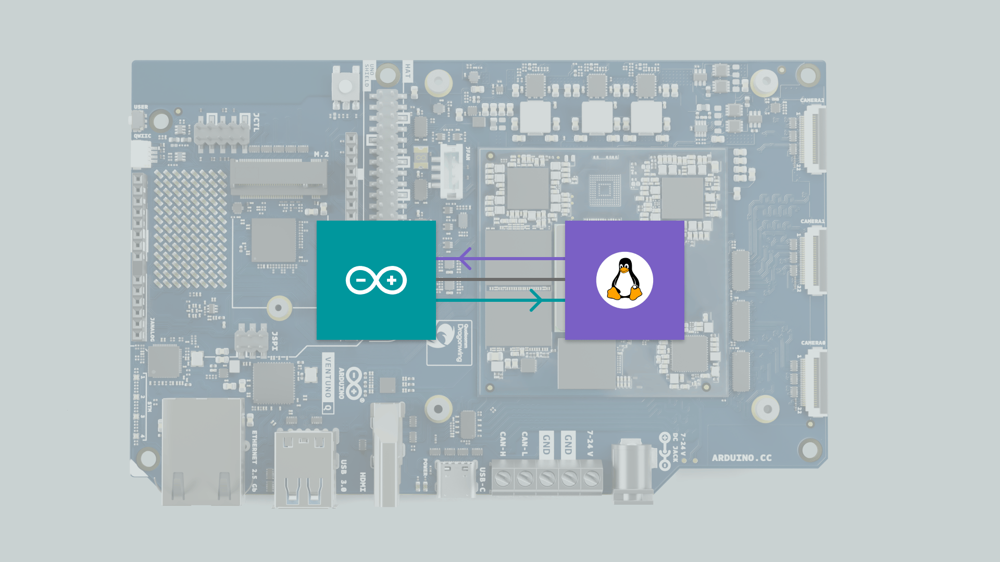

The `Bridge` library provides a communication layer built on top of the `Arduino_RPClite` framework. It manages bidirectional RPC traffic between the MPU and MCU, handling method binding, request forwarding, and asynchronous responses.

- **Linux side (Dragonwing™ QCS8275)**: Runs higher-level services and can remotely invoke MCU functions.
- **MCU side (STM32, Zephyr RTOS)**: Handles time-critical tasks and exposes functions to the Linux processor via RPC.

<Alert type="info">To read more about the Bridge library, visit the [Bridge](/software/app-lab/bridge/get-started-with-bridge/) article.</Alert>

### SPI

The VENTUNO Q supports SPI communication, which allows data transmission between the board and other SPI-compatible devices.

The pins used in the VENTUNO Q for the SPI communication protocol are the following:

| **Microcontroller Pin** | **Arduino Pin Mapping** |
| :---------------------: | :---------------------: |
|          PB12           |        SS / D10         |
|          PB15           |       MOSI / D11        |
|          PB14           |       MISO / D12        |
|          PB13           |        SCK / D13        |

Please, refer to the [board pinout section](#pinout) of the user manual to locate them on the board.

Include the `SPI` library at the top of your sketch to use the SPI communication protocol. The SPI library provides functions for SPI communication:

```arduino
#include <SPI.h>
```

In the `setup()` function, initialize the SPI library, define and configure the chip select (`SS`) pin:

```arduino
#define SS D10

void setup() {
  // Set the chip select pin as output
  pinMode(SS, OUTPUT);

  // Pull the SS pin HIGH to unselect the device
  digitalWrite(SS, HIGH);

  // Initialize the SPI communication
  SPI.begin();
}
```

<Alert type="info">To learn more, visit the [VENTUNO Q Microcontroller Examples - SPI](/tutorials/ventuno-q/mcu-examples/#spi).</Alert>

### I2C

<Alert type="info">See the section about [Qwiic](#qwiic) to understand how to connect Modulino nodes and other devices directly via the board's Qwiic connector.</Alert>

The VENTUNO Q supports I2C communication, which allows data transmission between the board and other I2C-compatible devices. The pins used in the VENTUNO Q for the I2C communication protocol are the following:

| **Microcontroller Pin** | **Arduino Pin Mapping (Wire)** | **Microcontroller Pin** | **Arduino Pin Mapping (Wire1)** |
| :---------------------: | :----------------------------: | :---------------------: | :-----------------------------: |
|          PH11           |           SCL / D21            |          PA8            |        I2C3_SCL (Qwiic)         |
|          PH12           |           SDA / D20            |          PC9            |        I2C3_SDA (Qwiic)         |

Please, refer to the [board pinout section](#pinout) of the user manual to locate them on the board.

To use I2C communication, include the `Wire` library at the top of your sketch. The `Wire` library provides functions for I2C communication:

```arduino
#include <Wire.h>
```

In the `setup()` function, initialize the I2C library:

```arduino
// Initialize the I2C communication
Wire.begin(); // I2C in UNO-style headers (D20, D21)
// or
Wire1.begin(); // I2C in Qwiic connector
```

<Alert type="info">To learn more, visit the [VENTUNO Q Microcontroller Examples - I2C](/tutorials/ventuno-q/mcu-examples/#i2c).</Alert>

### UART

The pins used in the VENTUNO Q for the UART communication protocol are the following:

| **Microcontroller Pin** | **Arduino Pin Mapping** |
| :---------------------: | :---------------------: |
|          PB10           |     USART3_TX / D1      |
|          PB11           |     USART3_RX / D0      |

Please, refer to the [board pinout section](#pinout) of the user manual to locate them on the board.

<Alert type="info">To communicate over the hardware serial pins on the JDIGITAL connector, the `Serial1` object must be used. Otherwise, `Serial` will communicate with your USB serial terminal.</Alert>

To begin with UART communication, you will need to configure it first. In the `setup()` function, set the baud rate (bits per second):

```arduino
// Start UART communication at 115200 baud
Serial1.begin(115200);
```

To transmit data to another device via UART, you can use the `write()` function:

```arduino
// Transmit the string "Hello VENTUNO Q"
Serial1.write("Hello VENTUNO Q");
Serial1.write("\r\n"); // new line
```

You can also use the `print` and `println()` to send a string without a newline character or followed by a newline character:

```arduino
// Transmit the string "Hello VENTUNO Q"
Serial1.print("Hello VENTUNO Q");

// Transmit the string "Hello VENTUNO Q" followed by a newline character
Serial1.println("Hello VENTUNO Q");
```

<Alert type="info">To learn more, visit the [VENTUNO Q Microcontroller Examples - UART](/tutorials/ventuno-q/mcu-examples/#uart).</Alert>

## Hardware Debug UART Interface

The VENTUNO Q provides a dedicated low-level UART interface for debugging and system diagnostics. This interface connects directly to the MPU's main console (TTY), allowing you to observe boot and kernel logs, troubleshoot system issues, or access a shell environment before network services like SSH or ADB are available.

To access the logs, we recommend the [Arduino® Bughopper](https://store.arduino.cc/products/bughopper), as it is designed to be used with this board.\*

<Alert type="warning">**Warning:** Using a different serial device than the Bughopper may cause the VENTUNO Q to boot incorrectly. This is due to the fact that the Dragonwing™ QCS8275 processor can accidentally be backpowered with the TX/RX pins. The Bughopper is designed to prevent this from happening, as the TX/RX channels are powered from the board itself (not from the serial adapter).</Alert>

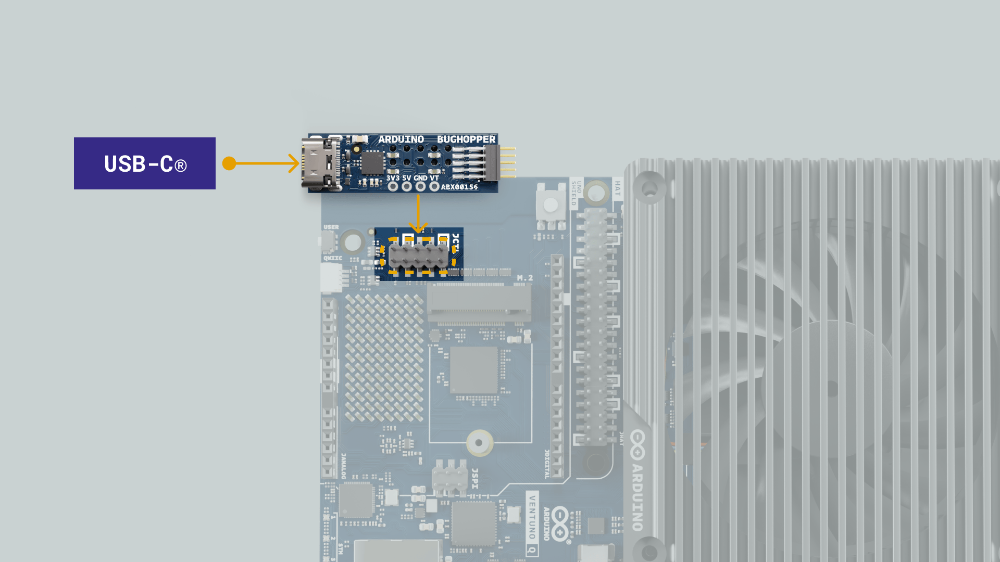

This interface is available through the JCTL connector on the VENTUNO Q. Refer to the [pinout](#pinout) section for details, and follow the wiring example above to access it.

## Wireless Connectivity

The VENTUNO Q features the NFA725B radio module that provides dual-band Wi-Fi® 6 2.4/5/6 GHz and Bluetooth® 5.1 to the board. This allows seamless wireless connectivity for both IoT and peripheral communication.

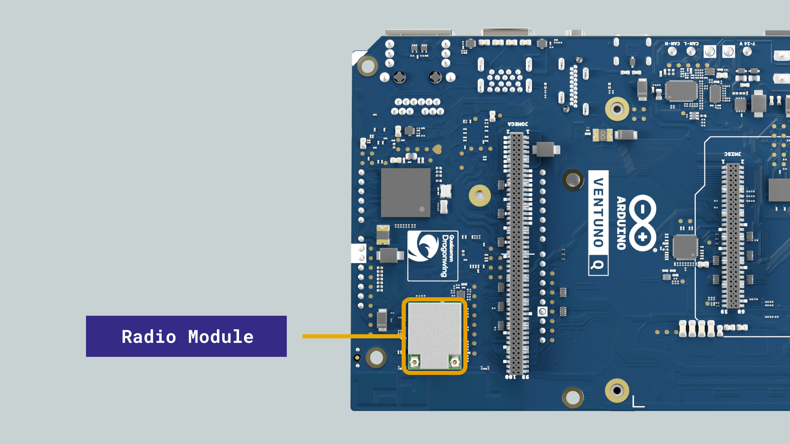

Whether connecting to a local network, uploading data to the cloud, or communicating with Bluetooth-enabled devices such as smartphones and sensors, the VENTUNO Q offers flexible and reliable options for your projects.

### Wi-Fi®

Wi-Fi connectivity on the VENTUNO Q allows the board to connect to local networks or the internet to access online services, perform software updates, and communicate with remote servers. Additionally, Wi-Fi can be configured to share its internet connection with the onboard microcontroller, allowing both systems to stay connected without additional network hardware.

If you followed the Arduino App Lab first set up, you should be already connected to the internet. However, there are several alternatives available, listed below.

#### Connect via Ubuntu Desktop (SBC)

If you have setup the board as an SBC, you can click on the top right menu and select the Wi-Fi network you want to connect to.

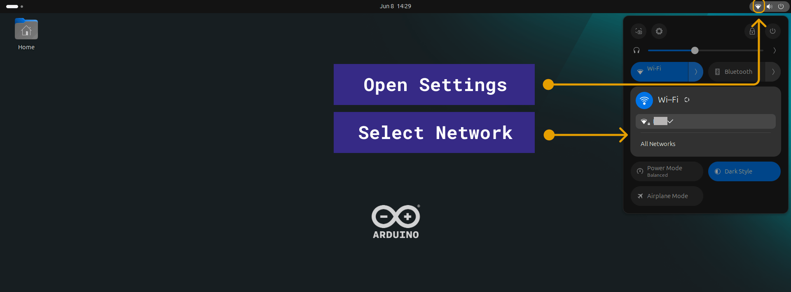

#### Connect via Terminal (Nmtui)

You can also use `nmtui` to access a terminal-based UI for connecting to Wi-Fi networks.

```bash
sudo nmtui
```


#### Connect via Terminal (Nmcli)

To connect to or disconnect from a network, we can use `nmcli` which is pre-installed on the board.

```bash
# Connect to a network
sudo nmcli d wifi connect <SSID> password <YOUR_PASSWORD>

#Disconnect from a network
sudo nmcli d disconnect wlan0
```

<Alert type="info">`wlan0` is the typical name of the Wi-Fi interface, you can verify yours running `nmcli device` in the terminal.</Alert>

#### WPA2-Enterprise Connections (Nmcli)

To connect to a WPA2-Enterprise network, you need to provide additional authentication configuration. The possible configurations can be complex; please refer to the [official documentation](https://people.freedesktop.org/~lkundrak/nm-dbus-api/nm-settings.html) for a comprehensive list of options.

For example, here is the configuration for **Eduroam**, an international Wi-Fi roaming service for users in research and education.

```bash
nmcli con add \
  type wifi \
  connection.id Eduroam \ # Connection name
  wifi.ssid eduroam \   # Network Wi-Fi SSID
  wifi.mode infrastructure \
  wifi-sec.key-mgmt wpa-eap \
  802-1x.eap peap \
  802-1x.phase2-auth mschapv2 \
  802-1x.identity <your identity>
```

Here's another example using TTLS authentication with PAP:

```bash
nmcli con add \
  type wifi \
  connection.id ExampleNetwork \ # Connection name
  wifi.ssid <your Wi-Fi SSID> \ # Network Wi-Fi SSID
  wifi.mode infrastructure \
  wifi-sec.key-mgmt wpa-eap \
  802-1x.eap ttls \
  802-1x.phase2-auth pap \
  802-1x.domain-suffix-match example.com \
  802-1x.identity <your identity>
```

If you prefer not to store your password in plain text (especially when it contains special characters), you can use the `--ask` flag to be prompted for the password interactively when connecting:

```bash
nmcli --ask con up <your network name>
```

#### Wi-Fi on the MCU

Wi-Fi is not available on the MCU by default, as it is connected only to the Dragonwing™ QCS8275. You can however provide Internet access to the MCU by using TCP over RCP calls, a method that is documented in the link below:

- [Microcontroller Examples - Enabling Wi-Fi® on the MCU](/tutorials/ventuno-q/mcu-examples/#enabling-wi-fi-on-the-mcu)

### Bluetooth®

Bluetooth® connectivity allows the VENTUNO Q to communicate with nearby devices such as smartphones, computers, or sensors. It can be used for data exchange, remote control, or connecting to Bluetooth peripherals like keyboards, headsets and serial devices. Depending on the setup, the VENTUNO Q can act as either a Bluetooth peripheral or host, enabling flexible short-range communication for various applications.

You can leverage the Bluetooth feature from the Single-Board Computer mode by clicking on the upper-right menu to manage it, such as selecting a device to connect to.

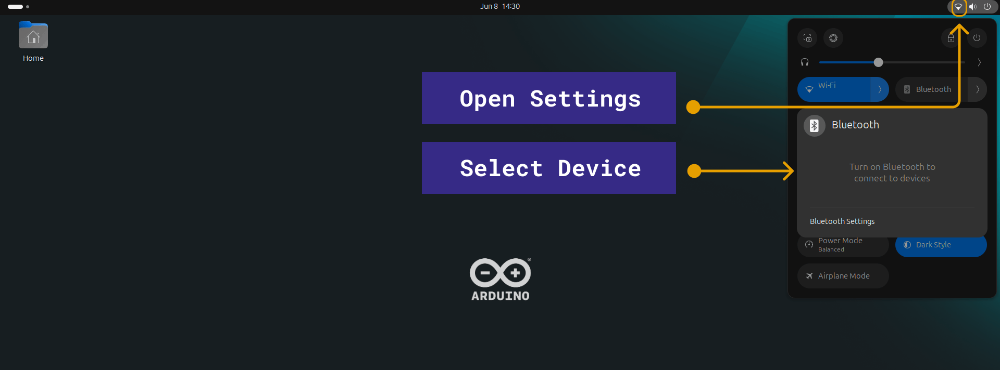

You can also manage the Bluetooth connection from the terminal by using `bluetoothctl` as follows:

```bash
bluetoothctl power on # turn on Bluetooth
bluetoothctl power off # turn off Bluetooth
```

You can enter the Bluetooth manager prompt by running `bluetoothctl` and inside you can run specific commands:

```bash
power on # turn on Bluetooth
power off # turn off Bluetooth
scan on # start searching for nearby Bluetooth devices
scan off # stop searching for devices
connect <MAC_ADDRESS> # pair to the device with the specified MAC address
```

Here is an example of how looks like to search for Bluetooth devices from the terminal:

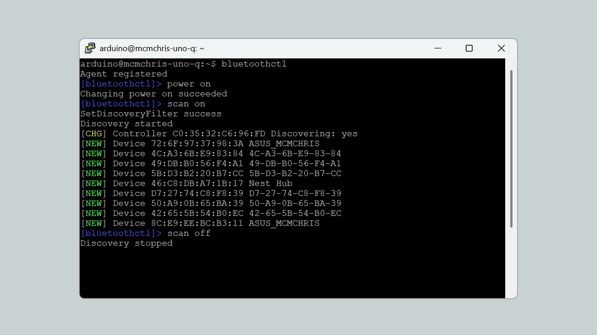

## Troubleshooting

### MDNS

Network Mode relies on **local network discovery (mDNS)** to automatically find boards on the same network. Some network configurations such as guest Wi-Fi, corporate or IoT networks, VPNs, or strict firewall rules may prevent automatic discovery, even if the board is connected to Wi-Fi.

#### Troubleshooting Discovery Issues

- **Windows Users:** When launching Arduino App Lab for the first time, you may receive a prompt from Windows Defender (or other security software) regarding `mdns-discovery.exe`. You must **allow** this access for the board to be discovered. *Note: The prompt may not appear on systems that have already run Arduino IDE at some point.*
- **Firewall Settings:** If the board does not appear, ensure that your firewall allows traffic on **UDP port 5353**, which is required for mDNS discovery.

>**Note**: Being able to access the board via browser, SSH, or IP address does not guarantee that it will appear in Network Mode. Arduino App Lab uses local network discovery to list boards automatically.

## Support

If you encounter any issues or have questions while working with the VENTUNO Q, we provide various support resources to help you find answers and solutions.

### Help Center

Explore our [Help Center](https://support.arduino.cc/hc/en-us), which offers a comprehensive collection of articles and guides for the VENTUNO Q. The Arduino Help Center is designed to provide in-depth technical assistance and help you make the most of your device.

### Forum

Join our community forum to connect with other VENTUNO Q users, share your experiences, and ask questions. The forum is an excellent place to learn from others, discuss issues, and discover new ideas and projects related to the VENTUNO Q.

- [VENTUNO Q category in the Arduino Forum](https://forum.arduino.cc/c/official-hardware/uno-family/ventuno-q/222)

### Contact Us

Please get in touch with our support team if you need personalized assistance or have questions not covered by the help and support resources described before. We are happy to help you with any issues or inquiries about the UNO Q.

- [Contact us page](https://www.arduino.cc/en/contact-us/)
